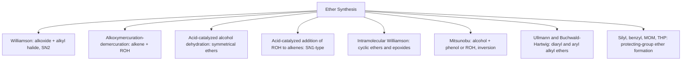
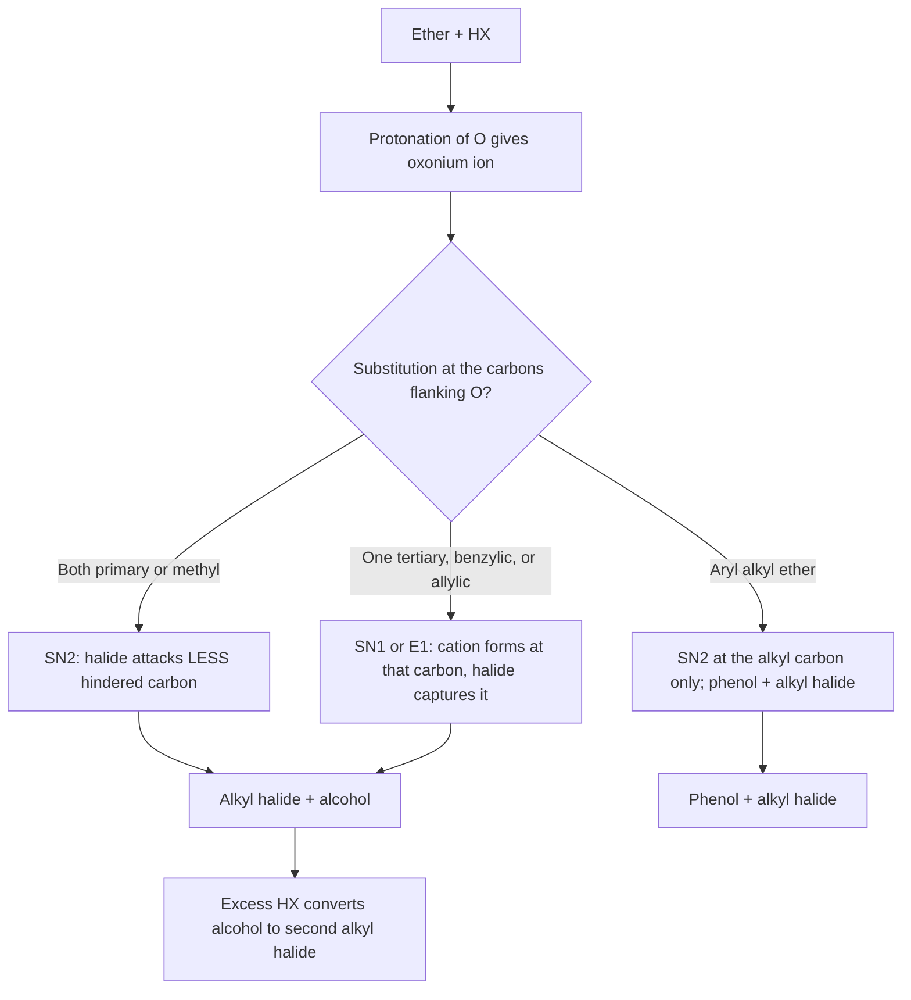

## Synthesis and Cleavage of Ethers


### Overview

**Ethers** are compounds of the general formula $R{-}O{-}R'$, in which an oxygen atom is bonded to two carbon groups (alkyl, aryl, or vinyl). Symmetrical ethers ($R = R'$) and unsymmetrical ethers ($R \neq R'$) are both common, as are cyclic ethers such as tetrahydrofuran (THF), 1,4-dioxane, and epoxides.

Ethers are relatively unreactive: they lack an acidic $O{-}H$ bond, resist bases, nucleophiles, mild oxidants, and reductants, and are stable to most reaction conditions. This inertness makes them ideal **solvents** (diethyl ether, THF, DME, MTBE) and **protecting groups** for alcohols (methyl, benzyl, MOM, THP, silyl ethers), and it defines the two chemical themes of this topic: how ethers are **built** and how their $C{-}O$ bonds are deliberately **broken**.

**Key Points**

- Ether synthesis is dominated by $S_N2$ chemistry (Williamson), $S_N1$/carbocation chemistry (alkoxymercuration, acid-catalyzed addition, dehydration), and epoxide-forming cyclizations.
- Cleavage requires strong acid (HBr, HI, $BBr_3$) because the alkoxide leaving group must first be converted to a good leaving group by protonation or Lewis-acid coordination.
- The mechanism of cleavage ($S_N1$ vs $S_N2$) depends on the substitution pattern of the carbons flanking the oxygen.
- Diaryl ethers and aryl alkyl ethers cleave selectively: the alkyl $C{-}O$ bond breaks; the aryl $C{-}O$ bond does not.
- Ethers form explosive peroxides on storage in air; this is the major practical hazard.

---

### Structure and Properties Relevant to Reactivity

| Property | Typical value / feature |
| --- | --- |
| $C{-}O{-}C$ bond angle | ~$110^\circ$ (dimethyl ether ~$111^\circ$) |
| $C{-}O$ bond length | ~1.42 Å |
| Hybridization at O | Approximately $sp^3$ (two lone pairs) |
| Dipole moment | ~1.2–1.3 D (diethyl ether ~1.15 D) |
| Hydrogen bonding | Acceptor only; no donor ($O{-}H$ absent) |
| Boiling point | Much lower than isomeric alcohols (diethyl ether 34.6 °C vs 1-butanol 117.7 °C) |
| Lewis basicity | Moderate; coordinates $BF_3$, $MgX_2$, $Li^+$ |

**Key Points**

- The lone pairs on oxygen make ethers Lewis bases; this is why they stabilize Grignard reagents ($RMgX \cdot 2\,Et_2O$) and organolithiums, and why $BF_3 \cdot OEt_2$ is a convenient liquid source of $BF_3$.
- The oxygen lone pairs are also what enable **acid-mediated cleavage**: protonation gives an oxonium ion, converting $RO^-$ (a poor leaving group) into $ROH$ (a good one).

---

### Part I: Synthesis of Ethers

#### Overview of Methods



---

#### 1. Williamson Ether Synthesis

The Williamson synthesis is the most general and reliable laboratory route to ethers. An alkoxide (or phenoxide) nucleophile displaces a leaving group from an alkyl electrophile in an $S_N2$ reaction.

$$R{-}O^- \;+\; R'{-}X \;\longrightarrow\; R{-}O{-}R' \;+\; X^-$$

**Generating the alkoxide**

| Method | Reagent | Byproduct | Notes |
| --- | --- | --- | --- |
| Deprotonation with metal hydride | $NaH$ or $KH$ | $H_2$ (gas) | Irreversible; standard in THF or DMF |
| Active metal | $Na$, $K$ | $H_2$ | Classical; slower for hindered alcohols |
| Strong base | $NaOH$, $KOH$ (often with phase-transfer catalyst) | $H_2O$ | Practical for phenols ($pK_a \approx 10$) |
| Carbonate base | $K_2CO_3$, $Cs_2CO_3$ | $CO_2 + H_2O$ | Mild; ideal for phenols in acetone or DMF |
| Silver oxide | $Ag_2O$ | AgX | Mild, neutral; useful for sensitive carbohydrates |

**Mechanism** (concerted $S_N2$, backside attack, inversion at the electrophilic carbon)

$$RO^- + R'{-}X \xrightarrow{S_N2} \left[RO{\cdots}R'{\cdots}X\right]^{\ddagger} \longrightarrow RO{-}R' + X^-$$

**Substrate rules (dictated by $S_N2$)**

| Alkyl halide type | Outcome |
| --- | --- |
| Methyl, primary (including allylic, benzylic) | Excellent ether yields |
| Secondary | Mixture of substitution ($S_N2$) and elimination ($E2$); yield falls |
| Tertiary | Elimination dominates (alkene forms); ether essentially not obtained |
| Aryl, vinyl halides | No $S_N2$ reaction (unless activated for $S_{N}Ar$) |

**Design principle for unsymmetrical ethers:** choose the disconnection so the *less hindered* carbon is the electrophile and the *more hindered* group is the alkoxide.

**Example 1: Synthesis of tert-butyl methyl ether (MTBE)**

Two possible disconnections:

| Route | Reagents | Outcome |
| --- | --- | --- |
| A | $t\text{-BuO}^- + CH_3I$ | $S_N2$ at methyl carbon → **MTBE** (good yield) |
| B | $CH_3O^- + t\text{-BuBr}$ | $E2$ → isobutylene (no ether) |

$$(CH_3)_3C{-}O^-\,K^+ + CH_3{-}I \longrightarrow (CH_3)_3C{-}O{-}CH_3 + KI$$

Route A is correct: the hindered group belongs on the nucleophile.

**Example 2: Synthesis of ethyl phenyl ether (phenetole)**

$$C_6H_5OH \xrightarrow{K_2CO_3,\ \text{acetone}} C_6H_5O^- \xrightarrow{CH_3CH_2Br} C_6H_5{-}O{-}CH_2CH_3$$

Phenols are far more acidic than aliphatic alcohols, so mild bases suffice. The aryl group cannot be the electrophile (aryl halides do not undergo $S_N2$), so the phenoxide must be the nucleophile.

**Leaving groups** ($S_N2$ reactivity)

$$TfO^- > I^- > Br^- \approx TsO^- \approx MsO^- > Cl^- \gg F^-$$

Alkyl sulfonates (tosylates, mesylates), dimethyl sulfate ($Me_2SO_4$), and methyl triflate are potent methylating agents. Note that $Me_2SO_4$ and $MeOTf$ are toxic alkylators and require appropriate handling.

**Solvent effects:** polar aprotic solvents (DMF, DMSO, acetonitrile, THF, acetone) leave the alkoxide "naked" and dramatically accelerate $S_N2$. Protic solvents (the parent alcohol) hydrogen-bond the alkoxide and slow the reaction.

**Phase-transfer catalysis (PTC):** quaternary ammonium salts (e.g., $Bu_4N^+\,HSO_4^-$, benzyltriethylammonium chloride) shuttle $RO^-$ into an organic phase, allowing aqueous NaOH to be used for O-alkylation of phenols and alcohols.

**Competing reactions and side products**

- $E2$ elimination (secondary/tertiary halides, bulky bases, high temperature)
- $C$-alkylation of phenoxides (ambident nucleophile; favored in protic solvents; $O$-alkylation favored in polar aprotic solvents)
- Over-alkylation (with polyols or amino alcohols, multiple sites)
- Hydrolysis of the alkylating agent by adventitious water

**Key Points**

- Williamson works best with methyl and primary electrophiles.
- The bulkier alkyl group should come from the alkoxide.
- Phenols use mild bases; aliphatic alcohols usually require NaH or Na.
- Yields drop steeply with secondary electrophiles because $E2$ competes.

---

#### 2. Intramolecular Williamson: Cyclic Ethers and Epoxides

A haloalcohol treated with base forms a cyclic ether by intramolecular $S_N2$ (an *exo-tet* cyclization).

$$X{-}(CH_2)_n{-}OH \xrightarrow{NaOH} \underbrace{(CH_2)_n{-}O}_{\text{cyclic ether}} + NaX + H_2O$$

**Ring-size preference (rates of ring closure)**

$$3 > 5 > 6 > 4,\ 7$$

| Ring | Ring strain (kcal/mol, approximate) | Comment |
| --- | --- | --- |
| Oxirane (epoxide, 3) | ~27 | Fast formation (favorable entropy, proximity); very reactive ring |
| Oxetane (4) | ~25 | Slow closure (strain + poorer entropy) |
| THF (5) | ~6 | Very favorable formation |
| Tetrahydropyran (6) | ~1 | Favorable; nearly strain free |
| Oxepane (7) | ~6 | Slower closure |

**Example 3: Epoxide from a halohydrin**

$$CH_3CH(OH)CH_2Br \xrightarrow{NaOH} CH_3{-}CH{-}CH_2 \ (\text{epoxide, propylene oxide}) + NaBr + H_2O$$

The alkoxide must attack the $C{-}Br$ carbon from the **backside**, so in cyclohexane systems a *trans-diaxial* arrangement of $O^-$ and $X$ is required. *trans*-2-Chlorocyclohexanol closes to cyclohexene oxide readily; the *cis* isomer cannot, and gives other products instead.

**Halohydrin route from an alkene:** alkene $+ X_2/H_2O \rightarrow$ halohydrin (anti addition) $\xrightarrow{base}$ epoxide. Overall, this is a two-step epoxidation with net *syn* stereochemical outcome for the epoxide relative to the alkene.

---

#### 3. Epoxidation of Alkenes (Direct)

Peroxyacids deliver an oxygen atom to an alkene in a concerted, stereospecific ("butterfly") reaction:

$$R_2C{=}CR_2 + RCO_3H \longrightarrow \text{epoxide} + RCO_2H$$

| Reagent | Notes |
| --- | --- |
| mCPBA (*meta*-chloroperoxybenzoic acid) | Standard lab reagent; often buffered with $NaHCO_3$ to protect acid-sensitive epoxides |
| Peracetic acid, trifluoroperacetic acid | Stronger; more reactive |
| $H_2O_2$ with catalysts (e.g., methyltrioxorhenium) | Greener oxidant |
| Dimethyldioxirane (DMDO) | Neutral conditions; volatile acetone byproduct |
| Sharpless asymmetric epoxidation ($Ti(OiPr)_4$, tartrate, TBHP) | Enantioselective for allylic alcohols |
| Jacobsen and Shi epoxidations | Enantioselective for unfunctionalized alkenes |

**Stereochemistry:** *cis*-alkene → *cis* (meso or *cis*-substituted) epoxide; *trans*-alkene → *trans* epoxide. Electron-rich alkenes react faster.

---

#### 4. Alkoxymercuration–Demercuration

Alkenes react with an alcohol solvent and mercuric salt, then are reduced, giving the **Markovnikov** ether **without carbocation rearrangement**.

$$R{-}CH{=}CH_2 \xrightarrow[\text{2. }NaBH_4]{\text{1. }Hg(OAc)_2 \text{ or } Hg(OCOCF_3)_2,\ R'OH} R{-}CH(OR'){-}CH_3$$

**Mechanism**

1. Electrophilic $Hg^{2+}$ adds to the alkene, forming a cyclic **mercurinium ion** (a bridged three-membered ring, no free carbocation).
2. The alcohol attacks the *more substituted* carbon (Markovnikov), anti to mercury, and loses a proton.
3. $NaBH_4$ replaces $C{-}Hg$ with $C{-}H$ (a radical-type reduction; stereochemistry at that carbon is not controlled).

**Example 4: Synthesis of 2-methoxy-3,3-dimethylbutane**

3,3-Dimethyl-1-butene + $Hg(OAc)_2$ in methanol, then $NaBH_4$:

$$(CH_3)_3C{-}CH{=}CH_2 \longrightarrow (CH_3)_3C{-}CH(OCH_3){-}CH_3$$

Acid-catalyzed addition of methanol would give methyl shifts (rearranged tertiary ether); the mercurinium pathway avoids that.

**Practical note:** mercury compounds are highly toxic; modern practice often substitutes other methods. Waste must be handled as heavy-metal hazardous waste.

---

#### 5. Acid-Catalyzed Addition of Alcohols to Alkenes

Alkenes that give stable carbocations react directly with alcohols under acid catalysis.

$$(CH_3)_2C{=}CH_2 + CH_3OH \xrightarrow{H^+ \text{ (e.g., acidic resin)}} (CH_3)_3C{-}O{-}CH_3$$

This is the industrial route to **MTBE** (isobutylene + methanol over an acidic ion-exchange resin) and to *tert*-amyl methyl ether (TAME).

**Mechanism:** protonate the alkene → tertiary carbocation → nucleophilic capture by ROH → deprotonation.

**Limitations**

- Carbocation rearrangements can occur.
- Reversible; excess alcohol drives the equilibrium.
- Works best for alkenes that form tertiary, allylic, or benzylic cations.

---

#### 6. Bimolecular Dehydration of Alcohols (Symmetrical Ethers)

Two molecules of a *primary* alcohol condense in the presence of strong acid at moderate temperature:

$$2\,RCH_2OH \xrightarrow{H_2SO_4,\ \sim 130\text{–}140\,^\circ C} RCH_2{-}O{-}CH_2R + H_2O$$

**Mechanism ($S_N2$):** one alcohol is protonated (making $H_2O$ a leaving group), and a second alcohol attacks it.

**Temperature control** (ethanol example)

| Temperature | Major product |
| --- | --- |
| ~130–140 °C | Diethyl ether (substitution) |
| ~170–180 °C | Ethylene (elimination) |

**Limitations**

- Suitable mainly for symmetrical ethers from primary alcohols.
- Secondary and tertiary alcohols dehydrate to alkenes.
- Mixing two different alcohols gives a statistical mixture (three ethers).

Industrially, diethyl ether is largely a by-product of ethanol production from ethylene hydration.

---

#### 7. Mitsunobu Reaction

The Mitsunobu reaction couples an alcohol with an acidic pronucleophile ($pK_a \lesssim 13$, such as a phenol) using triphenylphosphine and an azodicarboxylate (DEAD or DIAD), forming an ether with **inversion of configuration** at a secondary alcohol carbon.

$$R{-}OH + Ar{-}OH + PPh_3 + DEAD \longrightarrow R{-}O{-}Ar + Ph_3P{=}O + \text{hydrazine dicarboxylate}$$

**Key Points**

- Works with primary and secondary alcohols; $S_N2$ inversion at chiral secondary carbons.
- Excellent for aryl alkyl ethers from phenols under mild, neutral conditions.
- Drawbacks: stoichiometric byproducts ($Ph_3P{=}O$ and hydrazide) complicate purification; poor atom economy.

---

#### 8. Synthesis of Aryl Ethers

| Ether type | Method | Comment |
| --- | --- | --- |
| Aryl alkyl | Williamson (phenoxide + alkyl halide) | Standard, high yielding |
| Aryl alkyl | Mitsunobu | Inversion at secondary alkyl carbon |
| Aryl alkyl / diaryl | Ullmann-type coupling ($Cu$ catalyst, ArX + ROH or ArOH, base, heat) | Classical; modern ligands allow milder conditions |
| Aryl alkyl / diaryl | Buchwald–Hartwig C–O coupling ($Pd$, bulky phosphine ligands) | Broad scope, milder |
| Activated aryl halides | $S_NAr$ (e.g., 2,4-dinitrochlorobenzene + $RO^-$) | Requires ortho/para electron-withdrawing groups |
| Diaryl | Chan–Lam coupling (aryl boronic acid + phenol, $Cu(OAc)_2$, air) | Mild, room temperature |

**Example 5: $S_NAr$ ether formation**

$$2,4\text{-}(O_2N)_2C_6H_3Cl + CH_3O^- \longrightarrow 2,4\text{-}(O_2N)_2C_6H_3OCH_3 + Cl^-$$

The Meisenheimer intermediate is stabilized by the nitro groups.

---

#### 9. Ethers as Protecting Groups for Alcohols

| Protecting group | Formation | Cleavage | Stability |
| --- | --- | --- | --- |
| Methyl ether (Me) | $NaH$, $MeI$ | $BBr_3$, $TMSI$ (harsh) | Very robust |
| Benzyl ether (Bn) | $NaH$, $BnBr$ | $H_2$, $Pd/C$ (hydrogenolysis); Birch | Stable to acids and bases |
| *p*-Methoxybenzyl (PMB) | $NaH$, PMBCl | DDQ or CAN (oxidative); TFA | Orthogonal to Bn |
| Methoxymethyl (MOM) | $MOMCl$, $iPr_2NEt$ | Aqueous acid (HCl, TFA) | Base-stable acetal |
| Tetrahydropyranyl (THP) | Dihydropyran, cat. $H^+$ (PPTS) | Aqueous acid | Adds a stereocenter (diastereomers) |
| *tert*-Butyl ether | Isobutylene, cat. $H^+$ | TFA | Stable to base |
| Silyl ethers (TMS, TES, TBS, TIPS, TBDPS) | $R_3SiCl$, imidazole or $Et_3N$ | Fluoride ($TBAF$, $HF{\cdot}py$) or acid | Stability increases with steric bulk |

*Relative acid stability of silyl ethers (approximate order):* $TMS < TES < TBS < TIPS < TBDPS$.

*Handling note:* MOMCl and BOMCl are potent carcinogens; safer alternatives (e.g., dimethoxymethane with acid catalysis) are preferred where possible.

---

### Part II: Cleavage of Ethers

#### Why Ethers Resist Cleavage

The leaving group in ether cleavage would be an alkoxide, $RO^-$, a strong base and a very poor leaving group. Cleavage therefore requires **activation** of oxygen:

1. Protonation by a strong acid (forming a dialkyloxonium ion, $R_2OH^+$).
2. Coordination by a strong Lewis acid ($BBr_3$, $BCl_3$, $AlCl_3$, $TMSI$).

Only after activation does the $C{-}O$ bond become susceptible to nucleophilic attack (by $Br^-$, $I^-$) or to ionization (giving a stable carbocation).

---

#### 1. Cleavage by Strong Aqueous Acids: HI and HBr

Hydroiodic acid (HI) and hydrobromic acid (HBr) are the classical reagents; HCl is generally too weak a nucleophile/acid combination, and $H_2SO_4$ lacks a good nucleophile (its conjugate base, $HSO_4^-$, is poorly nucleophilic).

**Reactivity order of HX:** $HI > HBr \gg HCl$ (correlates with nucleophilicity of $X^-$ and acid strength).

$$R{-}O{-}R' + HX \longrightarrow R{-}X + R'{-}OH \xrightarrow{\text{excess }HX} R{-}X + R'{-}X + H_2O$$

**Mechanistic decision tree**



**Case A: $S_N2$ pathway (methyl, primary, and most secondary alkyl groups)**

The halide attacks the **less sterically hindered** carbon of the oxonium ion.

**Example 6: Ethyl isopropyl ether + HI (1 equiv)**

The two carbons are primary ($CH_2$ of ethyl) and secondary (isopropyl $CH$). $S_N2$ takes place at the *less hindered* ethyl carbon:

$$CH_3CH_2{-}O{-}CH(CH_3)_2 + HI \longrightarrow CH_3CH_2I + (CH_3)_2CHOH$$

(With secondary isopropyl groups, some $S_N1$ character can compete under forcing conditions; product ratios can vary.)

**Example 7: Diethyl ether + excess HBr (heat)**

$$CH_3CH_2OCH_2CH_3 + 2\,HBr \longrightarrow 2\,CH_3CH_2Br + H_2O$$

**Case B: $S_N1$ (or $E1$) pathway (tertiary, benzylic, allylic)**

If one group can form a stable carbocation, the $C{-}O$ bond ionizes and the cation is captured by halide.

**Example 8: tert-Butyl methyl ether (MTBE) + HI**

$$(CH_3)_3C{-}O{-}CH_3 + HI \longrightarrow (CH_3)_3C{-}I + CH_3OH$$

Cleavage occurs at the *tertiary* carbon via a carbocation, even though methyl is less hindered. Excess HI converts $CH_3OH$ to $CH_3I$ (via $S_N2$ on protonated methanol).

Mild conditions (e.g., trifluoroacetic acid, TFA) selectively cleave tert-butyl ethers via $E1$, releasing isobutylene:

$$R{-}O{-}C(CH_3)_3 \xrightarrow{CF_3CO_2H} R{-}OH + (CH_3)_2C{=}CH_2$$

**Example 9: Benzyl and allyl ethers**

Benzyl and allyl ethers cleave under acid ($S_N1$) but are usually removed by milder, more selective methods (hydrogenolysis, Pd(0)/nucleophile).

**Case C: Aryl alkyl ethers**

The alkyl $C{-}O$ bond breaks; the aryl $C{-}O$ bond does not, because:

- Phenyl cations are highly unstable ($sp^2$ carbon; $S_N1$ not feasible).
- Backside $S_N2$ attack on an $sp^2$ aromatic carbon is geometrically impossible.
- The $C_{aryl}{-}O$ bond has partial double-bond character from resonance.

**Example 10: Anisole + HI**

$$C_6H_5{-}O{-}CH_3 + HI \longrightarrow C_6H_5OH + CH_3I$$

Phenol is never converted onward to an aryl halide, so even excess HI stops here.

**Diaryl ethers** (e.g., diphenyl ether) are essentially inert to HX; they require extremely harsh conditions or specialized reagents.

**Regioselectivity summary**

| Ether substitution pattern | Mechanism | Halide ends up on |
| --- | --- | --- |
| Methyl + primary | $S_N2$ | The smaller (methyl) carbon |
| Primary + primary | $S_N2$ | Either (statistical; symmetrical gives one product) |
| Primary + secondary | Mostly $S_N2$ | Primary carbon (less hindered) |
| Tertiary + anything | $S_N1$ / $E1$ | Tertiary carbon |
| Benzylic / allylic + primary | $S_N1$-like | Benzylic / allylic carbon |
| Aryl + alkyl | $S_N2$ (or $S_N1$) at alkyl | Alkyl carbon (phenol released) |

---

#### 2. Cleavage by Lewis Acids

**Boron tribromide ($BBr_3$)**

$BBr_3$ is the reagent of choice for cleaving **methyl aryl ethers** (demethylation) under mild conditions (typically $-78\,^\circ C$ to room temperature in $CH_2Cl_2$).

$$Ar{-}O{-}CH_3 + BBr_3 \longrightarrow Ar{-}O{-}BBr_2 + CH_3Br \xrightarrow{H_2O} Ar{-}OH$$

**Mechanism:** boron coordinates the ether oxygen; bromide (from the ate complex or a second equivalent) attacks the methyl carbon ($S_N2$), releasing $CH_3Br$ and an aryloxyborane, which hydrolyzes on aqueous workup.

Modern mechanistic work suggests one equivalent of $BBr_3$ can, in principle, cleave up to three equivalents of ether via bimolecular pathways, though practical protocols typically use a stoichiometric excess per methoxy group. [Inference: exact stoichiometry depends on substrate and conditions.]

**Example 11: Demethylation of a natural-product aryl methyl ether**

$$ArOCH_3 \xrightarrow{BBr_3,\ CH_2Cl_2,\ -78\,^\circ C \to 25\,^\circ C} ArOH$$

$BBr_3$ is moisture sensitive and reacts violently with water and protic solvents, releasing HBr.

**Trimethylsilyl iodide (TMSI, $Me_3SiI$)**

$TMSI$ (often generated in situ from $TMSCl + NaI$ in acetonitrile, or from hexamethyldisilane + $I_2$) cleaves methyl ethers, esters, and carbamates under near-neutral conditions.

$$R{-}O{-}CH_3 + Me_3SiI \longrightarrow R{-}O{-}SiMe_3 + CH_3I \xrightarrow{H_2O} R{-}OH$$

**Other Lewis acid/nucleophile combinations**

| Reagent | Typical use |
| --- | --- |
| $BCl_3$ | Selective cleavage of aryl methyl ethers (often adjacent to carbonyl or chelating group); benzyl ether removal |
| $AlCl_3$ / thiol ($EtSH$) | Aryl methyl ether demethylation; nucleophilic thiol traps the methyl group |
| $LiCl$, $LiI$ in DMF or pyridine·HCl (heat) | Aryl methyl ether cleavage under forcing conditions |
| $NaSEt$ in DMF (heat) | Nucleophilic $S_N2$ demethylation of aryl methyl ethers |
| $HBr$ / $AcOH$ (reflux) | Classical demethylation |

---

#### 3. Hydrogenolysis of Benzyl Ethers

Benzyl ethers cleave under catalytic hydrogenation, releasing the alcohol and toluene:

$$R{-}O{-}CH_2Ph + H_2 \xrightarrow{Pd/C} R{-}OH + PhCH_3$$

**Key Points**

- Neutral, mild, high yielding.
- Incompatible with other reducible groups (alkenes, alkynes, nitro groups, some halides) unless conditions are tuned.
- Transfer hydrogenolysis (ammonium formate, cyclohexadiene) avoids handling $H_2$ gas.
- Dissolving-metal (Birch) cleavage ($Na$, liquid $NH_3$) is an alternative for benzyl and aryl ethers.

**Oxidative cleavage of PMB and related ethers:** DDQ removes *p*-methoxybenzyl ethers via a benzylic cation stabilized by the methoxy group; this is *orthogonal* to benzyl ether hydrogenolysis.

---

#### 4. Cleavage of Epoxides (Ring Opening)

Epoxides are exceptionally reactive ethers because of ~27 kcal/mol of ring strain. They open under **both acidic and basic (nucleophilic) conditions**, unlike acyclic ethers.

**Acid-catalyzed ring opening**

Protonation of the epoxide oxygen activates it; the nucleophile attacks the carbon that better stabilizes positive charge (more substituted), with **inversion** at that carbon (backside attack), giving *anti* products. The transition state has substantial $S_N1$ character (borderline $S_N2$).

$$\text{Epoxide} + HX \text{ (or } H_2O/H^+,\ ROH/H^+) \longrightarrow trans\text{-}\ \text{halohydrin / diol / hydroxy ether}$$

**Base-catalyzed / nucleophilic ring opening ($S_N2$)**

Strong nucleophiles ($RO^-$, $HO^-$, $RMgX$, $LiAlH_4$, $N_3^-$, $RS^-$, amines) attack the **less hindered** carbon.

$$\text{Epoxide} + Nu^- \longrightarrow \text{alkoxide} \xrightarrow{H_3O^+} \text{alcohol}$$

**Regiochemistry summary**

| Conditions | Site of attack | Mechanistic character |
| --- | --- | --- |
| Acidic (HX, $H_3O^+$, ROH/$H^+$) | More substituted carbon | $S_N1$-like / borderline $S_N2$ |
| Basic / strongly nucleophilic | Less substituted carbon | Pure $S_N2$ |

**Example 12: Unsymmetrical epoxide (2-methyl-1,2-epoxypropane) ring opening**

| Conditions | Product |
| --- | --- |
| $CH_3OH$, cat. $H_2SO_4$ | $(CH_3)_2C(OCH_3)CH_2OH$ (attack at tertiary carbon) |
| $NaOCH_3$, $CH_3OH$ | $(CH_3)_2C(OH)CH_2OCH_3$ (attack at primary carbon) |

**Example 13: Trans-diol from cyclohexene oxide**

$$\text{Cyclohexene oxide} \xrightarrow{H_3O^+} trans\text{-cyclohexane-1,2-diol}$$

Backside attack by water produces the *trans* (diaxial-opening, then ring-flipped to diequatorial) diol, per the Fürst–Plattner rule for cyclohexane-based epoxides.

---

#### 5. Autoxidation: Peroxide Formation (Safety-Critical)

Ethers with $\alpha$-hydrogens react slowly with $O_2$ via a radical chain mechanism, forming hydroperoxides and dialkyl peroxides.

$$R{-}O{-}CH_2R' + O_2 \xrightarrow{\text{light, heat, radical initiators}} R{-}O{-}CH(OOH)R'$$

**Highest-risk ethers**

| Class | Examples |
| --- | --- |
| Diisopropyl ether, dicyclopentyl ether | Form peroxides very rapidly; classed among the most hazardous |
| Diethyl ether, THF, 1,4-dioxane, DME, tetrahydropyran | Common; peroxides accumulate on storage |
| Ethers with allylic or benzylic $\alpha$-H | Form peroxides especially readily |

**Hazards:** peroxide crystals or concentrated residues can detonate on shock, friction, or heating, particularly upon distillation to dryness.

**Practices** (follow institutional safety procedures)

- Date containers on receipt and opening; discard or test within recommended intervals.
- Store in tightly closed, opaque containers, away from heat and light; inhibited grades (BHT) slow but do not eliminate peroxide formation.
- Test for peroxides (potassium iodide/starch test strips, KI/acetic acid) before distilling or concentrating.
- Never distill ethers to dryness; leave a residual volume.
- Treat peroxide-contaminated ether with a reducing agent (ferrous sulfate, alumina column, or sodium metabisulfite washes) only per approved procedures.
- Do not open containers with visible crystals around the cap or suspended solids; contact safety personnel.

---

### Comparative Summary: Choosing a Cleavage Method

| Goal | Preferred method | Notes |
| --- | --- | --- |
| Cleave an aryl methyl ether | $BBr_3$, $CH_2Cl_2$ (low temp) | Mild; widely used in total synthesis |
| Cleave a simple dialkyl ether completely | Excess conc. HI or HBr, heat | Gives two alkyl halides |
| Remove a benzyl ether | $H_2$, $Pd/C$ | Neutral conditions |
| Remove a PMB ether | DDQ or CAN | Oxidative; orthogonal to Bn |
| Remove a *tert*-butyl ether | TFA | $E1$; releases isobutylene |
| Remove a MOM or THP ether | Aqueous acid or PPTS/alcohol | Acetals, more acid labile than simple ethers |
| Remove a silyl ether | $TBAF$ or $HF{\cdot}pyridine$ | Exploits strong $Si{-}F$ bond |
| Cleave methyl ether under neutral conditions | $TMSI$ | Sensitive substrates; TMSI is moisture sensitive |
| Open an epoxide | Nucleophile (base) or acid + nucleophile | Regiochemistry depends on conditions |

---

### Worked Multi-Step Problem

**Problem:** Design a synthesis of *(R)*-2-phenoxybutane starting from *(S)*-2-butanol, and predict the products when the resulting ether is treated with excess HI.

**Analysis of the synthetic step**

A Williamson approach would need a secondary electrophile (2-halobutane) reacting with phenoxide; alternatively, converting the alcohol to a good leaving group and displacing it with phenoxide gives inversion:

1. $(S)\text{-2-Butanol} + TsCl,\ pyridine \rightarrow (S)\text{-2-butyl tosylate}$ (retention; the $C{-}O$ bond of the alcohol carbon is not broken).
2. $(S)\text{-2-Butyl tosylate} + PhO^-\,Na^+$ (in DMF, polar aprotic) $\rightarrow (R)\text{-2-phenoxybutane}$ via $S_N2$ with **inversion**.

Alternatively, use **Mitsunobu** conditions directly: $(S)\text{-2-butanol} + PhOH + PPh_3 + DIAD \rightarrow (R)\text{-2-phenoxybutane}$ with inversion.

*Caveat:* secondary tosylates are prone to competing $E2$ elimination (giving butenes), so yields are moderate and product mixtures are possible; the Mitsunobu route often gives cleaner results for phenols.

**Cleavage step**

$$C_6H_5{-}O{-}CH(CH_3)CH_2CH_3 + HI \longrightarrow C_6H_5OH + CH_3CH_2CH(I)CH_3$$

Because the aryl $C{-}O$ bond cannot cleave, phenol and 2-iodobutane are the products. The alkyl halide is formed as a mixture of enantiomers to a significant extent if any $S_N1$ character operates at the secondary center; a pure $S_N2$ pathway would give inversion. [Inference: for a secondary alkyl aryl ether in refluxing HI, partial racemization is plausible.]

---

### Computational Aid: Tracking Regioselectivity

The following Python function is a *heuristic* helper (not a substitute for chemical reasoning) that predicts the major cleavage site of a dialkyl ether with HX from carbon substitution class. Real outcomes depend on conditions, solvent, and substrate details.

```python
# Heuristic cleavage-site predictor for R-O-R' + HX (educational sketch).
# Classes: 'methyl', 'primary', 'secondary', 'tertiary', 'benzylic', 'allylic', 'aryl'

def cleavage_site(class_a: str, class_b: str) -> str:
    # SN1-capable groups (stable cation) react by ionization
    sn1_capable = {"tertiary", "benzylic", "allylic"}
    # Aryl carbon never cleaves under HX
    if class_a == "aryl" and class_b == "aryl":
        return "No reaction (diaryl ether)"
    if class_a == "aryl":
        return f"Cleave alkyl side ({class_b}); phenol + alkyl halide"
    if class_b == "aryl":
        return f"Cleave alkyl side ({class_a}); phenol + alkyl halide"

    a_sn1, b_sn1 = class_a in sn1_capable, class_b in sn1_capable
    if a_sn1 and not b_sn1:
        return f"SN1/E1 at {class_a} carbon"
    if b_sn1 and not a_sn1:
        return f"SN1/E1 at {class_b} carbon"
    if a_sn1 and b_sn1:
        return "Competing SN1 at both; more stabilized cation favored"

    # Both SN2-type: attack less hindered carbon
    order = {"methyl": 0, "primary": 1, "secondary": 2}
    if order[class_a] == order[class_b]:
        return "SN2 at either carbon (statistical / symmetrical)"
    less = class_a if order[class_a] < order[class_b] else class_b
    return f"SN2 at {less} carbon (less hindered)"

for pair in [("methyl", "tertiary"), ("primary", "secondary"),
             ("aryl", "methyl"), ("benzylic", "primary"), ("aryl", "aryl")]:
    print(pair, "->", cleavage_site(*pair))
```

**Output**



```
('methyl', 'tertiary') -> SN1/E1 at tertiary carbon
('primary', 'secondary') -> SN2 at primary carbon (less hindered)
('aryl', 'methyl') -> Cleave alkyl side (methyl); phenol + alkyl halide
('benzylic', 'primary') -> SN1/E1 at benzylic carbon
('aryl', 'aryl') -> No reaction (diaryl ether)
```

---

### Common Pitfalls

**Key Points**

- Choosing the wrong Williamson disconnection: putting the hindered group on the electrophile leads to elimination, not ether.
- Attempting Williamson with an aryl halide as the electrophile (no $S_N2$ at $sp^2$ carbon).
- Using HCl or $H_2SO_4$ to cleave ethers; HI and HBr (good nucleophilic halides) are required.
- Expecting HX to cleave the aryl–oxygen bond of aryl ethers; only the alkyl–oxygen bond breaks.
- Forgetting that a methyl *tert*-butyl ether cleaves at the tertiary carbon ($S_N1$), not the methyl.
- Assuming the same regiochemistry for acidic and basic epoxide ring openings; they are opposite.
- Heating alcohol dehydrations too hot and obtaining alkene rather than ether.
- Overlooking that secondary alkyl halides in Williamson give large amounts of $E2$ product.
- Neglecting peroxide safety when concentrating, distilling, or storing ethers.
- Treating $BBr_3$ like a simple reagent; it is violently water-reactive and evolves HBr.
- Confusing ether protecting-group orthogonality (e.g., trying to remove a benzyl ether in the presence of an alkene using $H_2$/Pd).

---

### Conclusion

Ether chemistry is defined by a contrast: the $C{-}O{-}C$ linkage is easy to install by a handful of dependable methods (Williamson $S_N2$, alkoxymercuration, acid-catalyzed addition, Mitsunobu, and metal-catalyzed couplings) yet is inert enough to survive most reagents until it is deliberately cleaved. Cleavage demands activation of oxygen by strong protic or Lewis acids, and the resulting regiochemistry follows the familiar $S_N1$/$S_N2$ logic: $S_N1$ at tertiary, benzylic, and allylic carbons; $S_N2$ at the least hindered carbon otherwise; and never at an aryl carbon. Epoxides stand apart as strained ethers that open under both acidic and basic nucleophilic conditions with opposite regiochemical outcomes. Finally, peroxide formation makes disciplined handling and storage of ethers as important as the reaction chemistry itself.

---

### Related Topics

- Epoxide chemistry: Sharpless, Jacobsen, and Shi asymmetric epoxidations
- Crown ethers, cryptands, and host–guest chemistry
- Acetals, ketals, and their role as carbonyl and diol protecting groups
- Protecting-group strategy and orthogonal deprotection
- Claisen rearrangement of allyl aryl and allyl vinyl ethers
- Ether solvents: solvent effects on organometallic reagent aggregation and reactivity
- Williamson synthesis variants: phase-transfer catalysis and microwave acceleration
- Ullmann, Buchwald–Hartwig, and Chan–Lam C–O cross-coupling
- Thioethers (sulfides), sulfonium salts, and their comparison with ethers
- Peroxide hazards: detection, quantification, and safe disposal procedures