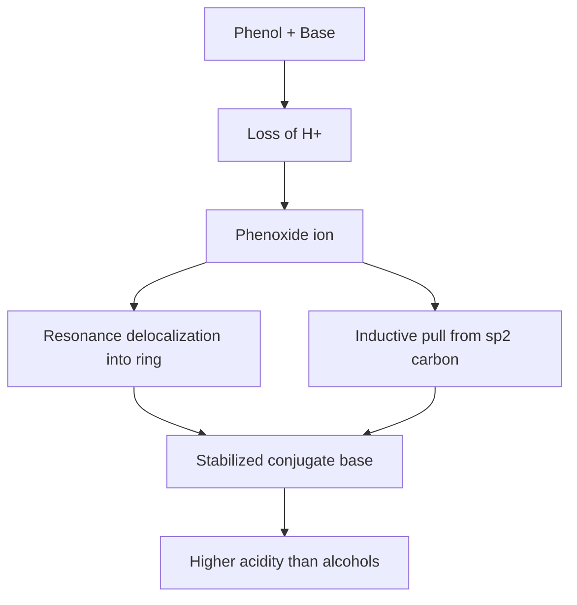
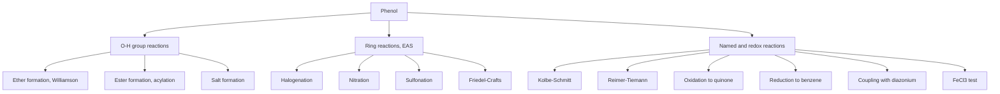
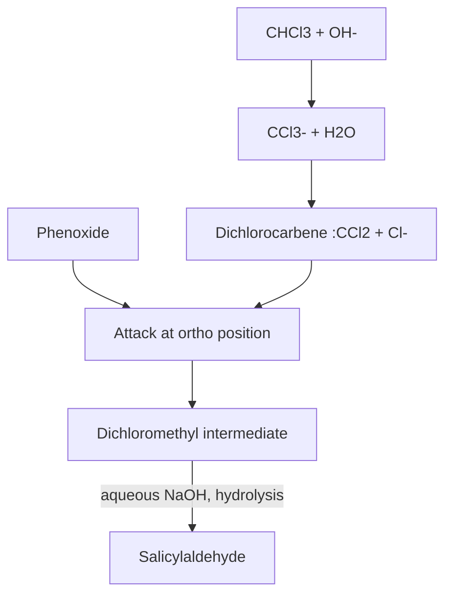

## Acidity and Reactions of Phenols

### Overview

Phenols are organic compounds in which a hydroxyl group ($-OH$) is bonded directly to an $sp^2$-hybridized carbon of an aromatic ring. The simplest member is phenol ($C_6H_5OH$), formerly called carbolic acid. Unlike aliphatic alcohols, phenols are noticeably acidic, and the aromatic ring is strongly activated toward electrophilic attack. These two properties, acidity of the O–H bond and activation of the ring, define almost all of phenol chemistry.

**Key Points**

- Phenol is roughly $10^6$ times more acidic than cyclohexanol, yet far weaker than carboxylic acids and carbonic acid.
- The $-OH$ group is a strong activating, ortho/para-directing substituent.
- Phenols react as O-nucleophiles (ether and ester formation) and as C-nucleophiles (electrophilic aromatic substitution, Kolbe–Schmitt, Reimer–Tiemann).
- Phenols are easily oxidized (to quinones) and give a characteristic color test with $FeCl_3$.

---

### Part 1: Acidity of Phenols

#### 1.1 Dissociation Equilibrium

$$C_6H_5OH + H_2O \rightleftharpoons C_6H_5O^- + H_3O^+$$

$$K_a = \frac{[C_6H_5O^-][H_3O^+]}{[C_6H_5OH]}, \qquad pK_a = -\log K_a$$

The conjugate base, $C_6H_5O^-$, is the **phenoxide** (phenolate) ion.

#### 1.2 Why Phenol Is More Acidic Than Alcohols

Acidity is governed by the stability of the conjugate base relative to the acid. Two effects operate.

**Resonance stabilization of the phenoxide ion.** The negative charge on oxygen delocalizes into the ring, placing partial negative charge on the ortho and para carbons. Ethoxide and cyclohexoxide have no such delocalization; their charge stays on oxygen.

**Inductive effect of the $sp^2$ carbon.** The $sp^2$ carbon attached to oxygen is more electronegative than an $sp^3$ carbon, so it withdraws electron density from oxygen through the $\sigma$-bond, stabilizing the anion.

Resonance structures of the phenoxide ion (svg_diagram):

<svg xmlns="http://www.w3.org/2000/svg" viewBox="0 0 760 200" width="760" height="200" font-family="sans-serif" font-size="13">
<text x="380" y="18" text-anchor="middle" font-weight="bold">Phenoxide Resonance (svg_diagram)</text>
<g fill="none" stroke="black" stroke-width="1.5">
<polygon points="90,60 120,77 120,111 90,128 60,111 60,77" />
<polygon points="290,60 320,77 320,111 290,128 260,111 260,77" />
<polygon points="490,60 520,77 520,111 490,128 460,111 460,77" />
<polygon points="690,60 720,77 720,111 690,128 660,111 660,77" />
</g>
<g text-anchor="middle">
<text x="90" y="140" dominant-baseline="hanging" fill="black">O⁻ on ring carbon C1</text>
<text x="290" y="140" dominant-baseline="hanging">charge at ortho C</text>
<text x="490" y="140" dominant-baseline="hanging">charge at para C</text>
<text x="690" y="140" dominant-baseline="hanging">charge at ortho C'</text>
<text x="190" y="98" font-size="20">↔</text>
<text x="390" y="98" font-size="20">↔</text>
<text x="590" y="98" font-size="20">↔</text>
<text x="380" y="185" text-anchor="middle">Charge delocalized over O, two ortho carbons, and the para carbon</text>
</g>
</svg>

Mermaid summary of the acidity logic:

#### 1.3 Comparative Acidity Data

| Compound | Approx. $pK_a$ (water, 25 °C) | Notes |
| --- | --- | --- |
| Ethanol | ~16 | No conjugate base stabilization |
| Cyclohexanol | ~16–18 | Aliphatic alcohol |
| Water | 15.7 | Reference |
| Phenol | ~10.0 | Resonance-stabilized anion |
| Carbonic acid ($H_2CO_3$, first) | ~6.4 | Stronger than phenol |
| Acetic acid | 4.76 | Carboxylate has equivalent oxygens |
| $p$-Nitrophenol | ~7.15 | Strong $-M$ and $-I$ effect |
| 2,4,6-Trinitrophenol (picric acid) | ~0.4 | Comparable to a strong acid |
| $p$-Cresol | ~10.3 | $+I$ and hyperconjugation destabilize anion |

Values are approximate and vary slightly by source and measurement conditions.

**Why carboxylic acids are stronger than phenols.** In a carboxylate ion, the negative charge is shared equally by two electronegative oxygen atoms. In phenoxide, the charge is shared with less electronegative carbon atoms, and the delocalization disrupts aromatic character in the contributing structures. Consequently $RCOO^-$ is more stable than $ArO^-$.

#### 1.4 Effect of Substituents on Acidity

| Substituent type | Examples | Effect on acidity | Reason |
| --- | --- | --- | --- |
| Electron-withdrawing ($-M$, $-I$) | $-NO_2$, $-CN$, $-CHO$, $-COR$ | Increases | Stabilizes phenoxide by charge withdrawal |
| Halogens ($-I$ dominant) | $-Cl$, $-Br$ | Slightly increases | Inductive withdrawal outweighs weak $+M$ |
| Electron-donating ($+I$, $+M$) | $-CH_3$, $-OCH_3$ (para) | Decreases | Destabilizes phenoxide by adding charge density |

**Position matters for nitrophenols.**

- Ortho and para nitro groups conjugate directly with the phenoxide charge through resonance ($-M$ effect), giving large acidity increases.
- A meta nitro group cannot delocalize the charge by resonance; only the weaker inductive effect operates.
- Approximate order: $p$-nitrophenol ($\approx 7.15$) and $o$-nitrophenol ($\approx 7.2$) are more acidic than $m$-nitrophenol ($\approx 8.4$), all more acidic than phenol.
- Ortho isomers experience intramolecular hydrogen bonding, which stabilizes the neutral molecule and affects properties such as volatility and solubility.

Resonance of $p$-nitrophenoxide, where the charge reaches the nitro oxygen:

#### 1.5 Practical Acid–Base Behavior

**Reaction with strong bases.** Phenol dissolves in aqueous $NaOH$ because its $pK_a$ is well below that of water:

$$C_6H_5OH + NaOH \rightarrow C_6H_5ONa + H_2O$$

**Reaction with sodium bicarbonate.** Simple phenol does not react with $NaHCO_3$ appreciably (carbonic acid is stronger than phenol), whereas carboxylic acids liberate $CO_2$. This gives a standard separation and test:

$$RCOOH + NaHCO_3 \rightarrow RCOONa + H_2O + CO_2\uparrow$$

$$C_6H_5OH + NaHCO_3 \rightarrow \text{no reaction}$$

Highly acidic phenols such as picric acid do react with bicarbonate.

**Reaction with sodium metal.**

$$2C_6H_5OH + 2Na \rightarrow 2C_6H_5ONa + H_2\uparrow$$

**Regeneration of phenol.** Phenoxide salts are converted back to phenol by acidification with a stronger acid, for example $CO_2$ bubbled through aqueous sodium phenoxide or dilute $HCl$:

$$C_6H_5ONa + HCl \rightarrow C_6H_5OH + NaCl$$

**Key Points**

- Solubility in $NaOH$ but not in $NaHCO_3$ distinguishes phenols from carboxylic acids.
- Alcohols do not dissolve in aqueous $NaOH$ (their conjugate bases are too basic and hydrolyze back).

---

### Part 2: Reactions of Phenols

Reactions fall into three groups: (A) reactions of the O–H group, (B) electrophilic aromatic substitution on the activated ring, and (C) special named reactions and oxidation/reduction.

#### 2A. Reactions Involving the O–H Group

**2A.1 Williamson ether synthesis (O-alkylation).** Phenoxide is a good nucleophile and reacts with primary alkyl halides via $S_N2$ to give aryl alkyl ethers:

$$C_6H_5OH \xrightarrow{NaOH} C_6H_5O^- Na^+ \xrightarrow{CH_3I} C_6H_5OCH_3 + NaI$$

The product is anisole (methoxybenzene). Aryl halides cannot serve as the electrophile in this reaction because $S_N2$ at an $sp^2$ carbon is unfavorable. Tertiary alkyl halides tend to give elimination.

**2A.2 Esterification (O-acylation).** Phenols react poorly with carboxylic acids directly (the phenolic oxygen is a weaker nucleophile than an alcohol oxygen), so more reactive acylating agents are used, typically with a base such as pyridine or $NaOH$ (Schotten–Baumann conditions):

$$C_6H_5OH + (CH_3CO)_2O \xrightarrow{H^+ \text{ or base}} C_6H_5OCOCH_3 + CH_3COOH$$

$$C_6H_5OH + C_6H_5COCl \xrightarrow{NaOH} C_6H_5OCOC_6H_5 + HCl$$

An industrially important example is the acetylation of salicylic acid to **aspirin** (acetylsalicylic acid).

**2A.3 Fries rearrangement.** Aryl esters rearrange to hydroxyaryl ketones under Lewis acid catalysis ($AlCl_3$). Low temperature tends to favor the para product and high temperature the ortho product (general trend; depends on substrate and solvent).

**2A.4 Claisen rearrangement.** Allyl aryl ethers, heated (about 200 °C), undergo a concerted [3,3]-sigmatropic shift to give $o$-allylphenols:

$$C_6H_5O\text{-}CH_2CH{=}CH_2 \xrightarrow{\Delta} o\text{-}HOC_6H_4CH_2CH{=}CH_2$$

#### 2B. Electrophilic Aromatic Substitution (EAS)

The $-OH$ group donates electron density into the ring by resonance ($+M$), strongly activating the ortho and para positions. Phenol undergoes EAS under much milder conditions than benzene, and often does not need a Lewis acid catalyst.

**2B.1 Halogenation**

*In polar solvent (bromine water), all activated positions react:*

$$C_6H_5OH + 3Br_2 \xrightarrow{H_2O} 2,4,6\text{-}C_6H_2Br_3OH\downarrow + 3HBr$$

The white precipitate of 2,4,6-tribromophenol forms immediately. This is a classic qualitative test.

*In non-polar solvent ($CS_2$, $CHCl_3$) at low temperature, monosubstitution is favored:*

$$C_6H_5OH + Br_2 \xrightarrow{CS_2,\ 0^\circ C} o\text{-}BrC_6H_4OH + p\text{-}BrC_6H_4OH + HBr$$

The para isomer is usually the major product for steric reasons. In polar solvent, phenol partially ionizes to the far more reactive phenoxide, which explains the exhaustive substitution.

**2B.2 Nitration**

*Dilute $HNO_3$ at low temperature (about 298 K):* gives a mixture of $o$- and $p$-nitrophenol:

$$C_6H_5OH \xrightarrow{\text{dil. } HNO_3} o\text{-}O_2NC_6H_4OH + p\text{-}O_2NC_6H_4OH$$

The isomers are separable by steam distillation: $o$-nitrophenol is steam volatile because of intramolecular hydrogen bonding, while $p$-nitrophenol forms intermolecular hydrogen bonds and is not.

*Concentrated $HNO_3$ (with conc. $H_2SO_4$):* gives 2,4,6-trinitrophenol (picric acid). Direct nitration of phenol with concentrated acids gives poor yields because of oxidation and tar formation, so picric acid is often made by first sulfonating phenol and then nitrating the sulfonated product.

**2B.3 Sulfonation.**

$$C_6H_5OH + H_2SO_4 \rightarrow o\text{-}HOC_6H_4SO_3H \ (\text{about } 25^\circ C) \quad \text{or} \quad p\text{-}HOC_6H_4SO_3H \ (\text{about } 100^\circ C)$$

The ortho product is kinetically favored and the para product is thermodynamically favored (a standard example of kinetic versus thermodynamic control).

**2B.4 Friedel–Crafts reactions.** Alkylation and acylation of phenol are complicated because $AlCl_3$ coordinates to the phenolic oxygen, deactivating the ring and promoting O-acylation. Working conditions:

- Alkylation is possible with alcohols/alkenes under acid catalysis (for example, formation of $p$-tert-butylphenol).
- Acylation can proceed via O-acylation followed by Fries rearrangement, or by using excess $AlCl_3$.

**2B.5 Azo coupling.** Phenoxide (in mildly alkaline solution) attacks arenediazonium salts at the para position to form brightly colored azo dyes:

$$C_6H_5N_2^+Cl^- + C_6H_5O^- \xrightarrow{pH\ 9\text{–}10} p\text{-}C_6H_5N{=}NC_6H_4OH + Cl^-$$

The product, $p$-hydroxyazobenzene, is orange. Alkaline conditions convert phenol to the more nucleophilic phenoxide, but very high pH would decompose the diazonium salt.

#### 2C. Named and Special Reactions

**2C.1 Kolbe–Schmitt reaction (carboxylation).** Sodium phenoxide reacts with $CO_2$ under pressure and heat, followed by acidification, to give salicylic acid (2-hydroxybenzoic acid):

$$C_6H_5ONa + CO_2 \xrightarrow{125^\circ C,\ 4\text{–}7\ atm} \text{sodium salicylate} \xrightarrow{H^+} o\text{-}HOC_6H_4COOH$$

Mechanism outline: the phenoxide ring carbon (ortho) attacks the electrophilic carbon of $CO_2$; tautomerization restores aromaticity. The ortho selectivity with sodium is commonly attributed to chelation of $Na^+$ between the phenoxide oxygen and the $CO_2$ oxygen. With the potassium salt at higher temperature, the para isomer ($p$-hydroxybenzoic acid) becomes significant.

**2C.2 Reimer–Tiemann reaction (formylation).** Phenol, chloroform, and aqueous base give $o$-hydroxybenzaldehyde (salicylaldehyde) as the major product:

$$C_6H_5OH + CHCl_3 + 3NaOH \xrightarrow{\Delta} o\text{-}HOC_6H_4CHO + 3NaCl + 2H_2O$$

Mechanism outline:

1. Base deprotonates $CHCl_3$ and $\alpha$-elimination of chloride gives **dichlorocarbene**, $:CCl_2$, the electrophile.
2. Phenoxide attacks the carbene at the ortho position.
3. Hydrolysis of the resulting dichloromethyl intermediate gives the aldehyde.

Using $CCl_4$ in place of $CHCl_3$ gives salicylic acid instead (a variant sometimes called the Reimer–Tiemann carboxylation).

**2C.3 Oxidation.** Phenols are readily oxidized. Air oxidation darkens samples on standing. With chromic acid, phenol gives $p$-benzoquinone (a conjugated cyclohexadienedione):

$$C_6H_5OH \xrightarrow{Na_2Cr_2O_7,\ H_2SO_4} O{=}C_6H_4{=}O$$

Hydroquinone and catechol are also oxidized easily to quinones. This redox behavior underlies the use of hydroquinone as a photographic developer and antioxidant.

**2C.4 Reduction (zinc dust distillation).** Heating phenol with zinc dust removes the hydroxyl group:

$$C_6H_5OH + Zn \xrightarrow{\Delta} C_6H_6 + ZnO$$

Catalytic hydrogenation ($H_2$, Ni, elevated temperature) reduces the ring to cyclohexanol.

**2C.5 Phenol–formaldehyde condensation (Bakelite).** Under acid or base catalysis, phenol reacts with formaldehyde. Hydroxymethylation at the ortho and para positions is followed by condensation to methylene bridges, giving first linear novolac and, with further formaldehyde, the cross-linked thermosetting polymer Bakelite.

**2C.6 Liebermann test and other color tests.** Phenol heated with concentrated $H_2SO_4$ and a nitrite gives a colored indophenol-type product; this is a classic qualitative test, though details vary by reference.

#### 2D. Qualitative Tests for Phenols

| Test | Reagent | Observation | Comment |
| --- | --- | --- | --- |
| Ferric chloride | Neutral $FeCl_3$ solution | Violet (phenol), blue, green, or red colors depending on structure | Formation of colored iron(III)–phenoxide complexes |
| Bromine water | $Br_2/H_2O$ | Decolorization, white precipitate of 2,4,6-tribromophenol | Excess bromine may give yellow tribromophenol-bromine adduct |
| Azo dye test | Diazonium salt, $NaOH$ | Orange-red dye | Coupling at para position |
| $NaOH$ solubility | Aqueous $NaOH$ | Dissolves | Distinguishes from most neutral organics |
| $NaHCO_3$ solubility | Aqueous $NaHCO_3$ | No effect (simple phenols) | Distinguishes from carboxylic acids |
| Millon's test | Millon's reagent | Red color | Also used for tyrosine residues in proteins |

---

### Part 3: Industrial Preparation (Context for Reactions)

**Cumene process.** The dominant industrial route: benzene is alkylated with propene to give cumene (isopropylbenzene), which is oxidized by air to cumene hydroperoxide and cleaved with acid to give phenol and acetone.

$$C_6H_6 + CH_3CH{=}CH_2 \xrightarrow{H^+} C_6H_5CH(CH_3)_2 \xrightarrow{O_2} C_6H_5C(CH_3)_2OOH \xrightarrow{H_3O^+} C_6H_5OH + (CH_3)_2C{=}O$$

The key step is an acid-catalyzed rearrangement in which the phenyl group migrates to oxygen (a Hock-type rearrangement).

Laboratory routes include hydrolysis of arenediazonium salts ($ArN_2^+ + H_2O \xrightarrow{\Delta} ArOH + N_2 + H^+$), and alkali fusion of sodium benzenesulfonate (older industrial method).

---

### Part 4: Worked Examples

**Example 1: Ranking acidity**

Rank: phenol, $p$-nitrophenol, $p$-cresol, ethanol, acetic acid.

Reasoning:

- Acetic acid (4.76): carboxylate charge shared by two oxygens.
- $p$-Nitrophenol (~7.15): nitro group stabilizes anion through resonance and induction.
- Phenol (~10.0): resonance-stabilized phenoxide.
- $p$-Cresol (~10.3): methyl group donates electron density and destabilizes the anion.
- Ethanol (~16): no resonance stabilization.

**Output**

$$\text{acetic acid} > p\text{-nitrophenol} > \text{phenol} > p\text{-cresol} > \text{ethanol}$$

**Example 2: Separating a mixture of benzoic acid, phenol, and toluene**

1. Dissolve the mixture in ether.
2. Extract with aqueous $NaHCO_3$: benzoic acid moves to the aqueous layer as sodium benzoate. Acidify the aqueous layer with $HCl$ to recover benzoic acid.
3. Extract the remaining ether layer with aqueous $NaOH$: phenol moves to the aqueous layer as sodium phenoxide. Acidify (or bubble $CO_2$) to recover phenol.
4. The ether layer now contains only toluene. Evaporate the solvent.

**Example 3: Synthesis planning**

Target: 2-hydroxy-5-nitrobenzoic acid from phenol.

- Route: Kolbe–Schmitt gives salicylic acid. Nitration of salicylic acid with dilute $HNO_3$ then places the nitro group para to the strongly directing $-OH$ (position 5 of the benzoic acid numbering). The $-OH$ activates and directs more strongly than the deactivating $-COOH$, so the nitro group enters para to $-OH$.

**Example 4: Predicting products**

| Reactants | Conditions | Major product |
| --- | --- | --- |
| Phenol + $Br_2$ | $H_2O$ | 2,4,6-Tribromophenol |
| Phenol + $Br_2$ | $CS_2$, 0 °C | $p$-Bromophenol (major), $o$-bromophenol |
| Sodium phenoxide + $CH_3CH_2Br$ | Ethanol, $\Delta$ | Ethoxybenzene (phenetole) |
| Phenol + acetic anhydride | Pyridine or $H^+$ | Phenyl acetate |
| Phenol + $CHCl_3$ | $NaOH$, $\Delta$ | Salicylaldehyde |
| Sodium phenoxide + $CO_2$ | 125 °C, pressure, then $H^+$ | Salicylic acid |
| Phenol | $Zn$, $\Delta$ | Benzene |

---

### Part 5: Common Pitfalls and Notes

- **Williamson limitation:** phenoxide + aryl halide does not give diaryl ethers under simple $S_N2$ conditions; Ullmann-type copper-catalyzed coupling is required.
- **Direct esterification:** phenol plus a carboxylic acid with acid catalyst gives low conversion; use anhydrides or acyl chlorides.
- **Nitration yields:** direct nitration of phenol with concentrated acid causes oxidation and tar; controlled conditions or sulfonation-first routes give cleaner results.
- **Ortho/para ratios:** these depend on solvent, temperature, counterion, and sterics; the trends stated above are general and may vary with specific substrates and conditions.
- **Quantitative $pK_a$ values:** literature values differ by a few tenths of a unit depending on the source and the ionic strength and temperature of measurement.

**Conclusion**

Phenols occupy a distinct position between alcohols and carboxylic acids. Resonance delocalization in the phenoxide ion accounts for their enhanced acidity, while the same electron donation from oxygen into the ring accounts for the high reactivity toward electrophiles at the ortho and para positions. Mastery of this topic rests on connecting three ideas: conjugate base stability (acidity and substituent effects), O-nucleophilicity of phenoxide (ethers and esters), and ring activation (halogenation, nitration, sulfonation, Kolbe–Schmitt, Reimer–Tiemann, azo coupling).

**Related Topics**

- Preparation of phenols (cumene process, diazonium hydrolysis, alkali fusion)
- Physical properties and hydrogen bonding in phenols
- Electrophilic aromatic substitution: directing effects and activating groups
- Hammett equation and substituent constants ($\sigma$ values)
- Quinones and redox chemistry of hydroquinone/catechol
- Aryl ethers: anisole reactions and Claisen rearrangement
- Polyhydric phenols: catechol, resorcinol, hydroquinone
- Phenolic polymers: Bakelite, novolacs, resoles
- Azo dyes and diazonium coupling
- Salicylic acid derivatives: aspirin and methyl salicylate
- Antioxidant phenols (BHT, BHA, tocopherols)