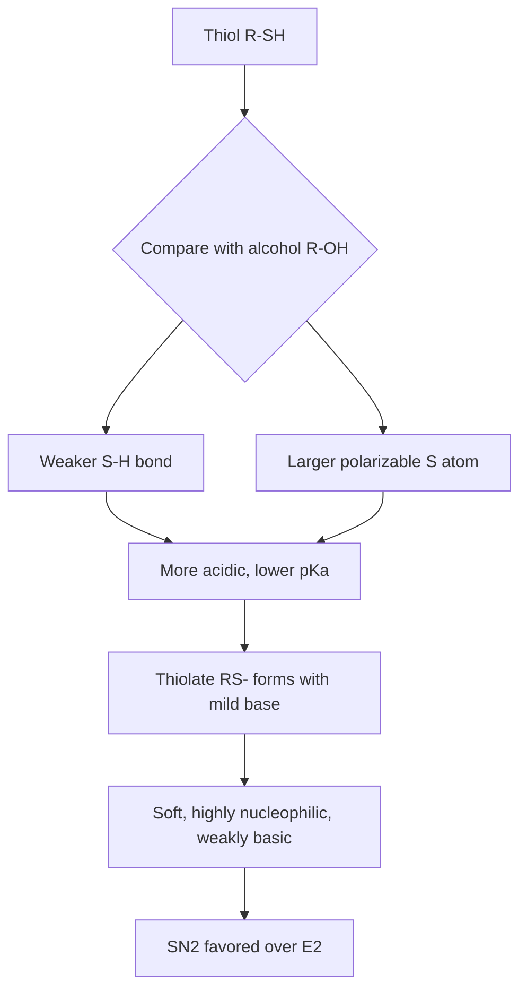
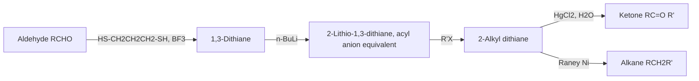

## Thiols and Sulfides

### Overview

Thiols (R–SH, also called mercaptans) and sulfides (R–S–R', also called thioethers) are the sulfur analogs of alcohols and ethers. Sulfur lies directly below oxygen in Group 16, but its larger atomic radius (about 100 pm covalent radius versus about 66 pm for oxygen), greater polarizability, lower electronegativity (2.58 versus 3.44 on the Pauling scale), and accessible 3d/σ* orbitals make the chemistry of these compounds strikingly different from their oxygen counterparts. Thiols are more acidic, far less hydrogen-bonded, and far more nucleophilic than alcohols; sulfides are excellent nucleophiles that readily alkylate to sulfonium salts and oxidize to sulfoxides and sulfones, transformations with no simple analog in ether chemistry.

**Key Points**

- Thiols are roughly $10^5$ to $10^6$ times more acidic than alcohols ($pK_a$ of ethanethiol ≈ 10.6 versus ethanol ≈ 16).
- Thiolates ($RS^-$) are exceptional nucleophiles but weak bases, so $S_N2$ substitution is favored over elimination.
- Thiols oxidize reversibly to disulfides (R–S–S–R), a redox couple central to protein structure and glutathione biochemistry.
- Sulfides oxidize stepwise to sulfoxides and sulfones, and alkylate to sulfonium salts that serve as alkylating agents and ylide precursors.
- Volatile thiols have extremely low odor thresholds (parts per billion or below).

---

### Part 1: Nomenclature and Structure

#### 1.1 Naming

| Class | Structure | IUPAC convention | Example |
| --- | --- | --- | --- |
| Thiol | R–SH | Suffix **-thiol** appended to the alkane name; prefix **sulfanyl-** (formerly mercapto-) when a higher-priority group is present | $CH_3CH_2SH$: ethanethiol |
| Thiolate | R–S⁻ | **-thiolate** | $CH_3CH_2S^-Na^+$: sodium ethanethiolate |
| Sulfide (thioether) | R–S–R' | Named as **alkylsulfanylalkane** (substitutive) or **alkyl alkyl sulfide** (radicofunctional) | $CH_3SCH_2CH_3$: (methylsulfanyl)ethane or ethyl methyl sulfide |
| Disulfide | R–S–S–R' | **dialkyl disulfide** | $CH_3SSCH_3$: dimethyl disulfide |
| Sulfoxide | R–S(=O)–R' | **alkylsulfinylalkane**, or dialkyl sulfoxide | $(CH_3)_2S{=}O$: dimethyl sulfoxide (DMSO) |
| Sulfone | R–SO₂–R' | **alkylsulfonylalkane**, or dialkyl sulfone | $(CH_3)_2SO_2$: dimethyl sulfone |
| Thiophenol | Ar–SH | benzenethiol | $C_6H_5SH$ |

The thiol group takes priority over alcohols only in the sense that the suffix ranking follows the general IUPAC seniority order; when both –OH and –SH are present, –OH takes the suffix and –SH is named as **sulfanyl**.

#### 1.2 Geometry and Bonding

- The C–S–H bond angle in methanethiol is about 96°, and the C–S–C angle in dimethyl sulfide is about 99°, significantly smaller than the corresponding oxygen angles (about 105–112°).
- Small angles indicate that sulfur bonds with mostly pure p orbitals (little hybridization), consistent with the larger size and diffuse valence orbitals of sulfur.
- The S–H bond (about 365 kJ/mol) is weaker than the O–H bond (about 460 kJ/mol), and the C–S bond (about 272 kJ/mol) is weaker than the C–O bond (about 358 kJ/mol). Values are approximate and vary with the source.

---

### Part 2: Physical Properties

| Property | Alcohols / ethers | Thiols / sulfides | Reason |
| --- | --- | --- | --- |
| Hydrogen bonding | Strong | Very weak | S is less electronegative; S–H bond is less polar |
| Boiling point | High for ROH | Lower than the corresponding ROH | Weak H-bonding in thiols |
| Water solubility | Good for small ROH | Poor | Thiols do not H-bond effectively with water |
| Odor | Mild | Intensely unpleasant | Low odor detection thresholds |

Comparative boiling points (approximate):

| Compound | Boiling point (°C) |
| --- | --- |
| Methanol ($CH_3OH$) | 65 |
| Methanethiol ($CH_3SH$) | 6 |
| Ethanol | 78 |
| Ethanethiol | 35 |
| Dimethyl ether | −24 |
| Dimethyl sulfide | 37 |

Note the reversal for the last pair: dimethyl sulfide boils higher than dimethyl ether because of greater polarizability (stronger London dispersion forces) and a larger molecular mass, even though ether oxygen can accept hydrogen bonds.

**Odor.** Methanethiol, ethanethiol, and related compounds are detectable at part-per-billion levels (odor thresholds vary by source and measurement method). Because of this, ethanethiol and tert-butyl mercaptan are added as odorants to natural gas for leak detection. Thiols also occur in skunk spray (for example, (E)-2-butene-1-thiol and 3-methylbutane-1-thiol), garlic and onion (allyl thiol derivatives and disulfides), and in tropical-fruit aroma compounds.

---

### Part 3: Acidity and Basicity

#### 3.1 Thiol Acidity

$$RSH + H_2O \rightleftharpoons RS^- + H_3O^+$$

| Compound | Approximate $pK_a$ |
| --- | --- |
| Ethanol | ~16 |
| Ethanethiol | ~10.6 |
| Benzenethiol | ~6.6 |
| Phenol | ~10.0 |
| Cysteine thiol group (in free amino acid) | ~8.3 |

Values are approximate; literature figures differ slightly by measurement conditions.

**Why thiols are more acidic than alcohols:**

1. **Weaker S–H bond.** The bond dissociation energy is lower, making proton loss easier.
2. **Larger, more polarizable anion.** The negative charge is spread over a large sulfur atom (larger volume, lower charge density), so the thiolate is more stabilized in solution than an alkoxide.
3. Bond strength and anion size dominate over the electronegativity difference, which would predict the opposite trend.

Consequently, thiols dissolve in aqueous $NaOH$ and can be converted quantitatively to thiolates:

$$RSH + NaOH \rightarrow RS^-Na^+ + H_2O$$

Thiophenols are stronger acids than phenols because the aromatic ring further stabilizes the anion by delocalization, added to the size effect.

#### 3.2 Basicity

Thiolates are weaker bases than alkoxides (their conjugate acids are stronger acids), yet stronger nucleophiles. Sulfides are much weaker Brønsted bases than ethers but far better Lewis bases toward soft electrophiles (alkyl halides, metal ions such as $Hg^{2+}$, $Pt^{2+}$, $Ag^+$).

**Key Points**

- Basicity (toward protons) and nucleophilicity (toward carbon, in soft/soft interactions) are not the same: $RS^-$ is a weaker base than $RO^-$ but a much better nucleophile.
- Sulfur's polarizability explains the strong affinity of thiols for heavy metals (the origin of the name **mercaptan**, from *mercurio captans*, "capturing mercury").

---

### Part 4: Preparation

#### 4.1 Preparation of Thiols

**(a) $S_N2$ with hydrosulfide ion**

$$RX + NaSH \rightarrow RSH + NaX$$

**Limitation:** the product thiol is deprotonated to a thiolate under the basic conditions, and the thiolate attacks another molecule of $RX$ to give a sulfide as a by-product. Using a large excess of $NaSH$ suppresses this side reaction:

$$RS^- + RX \rightarrow RSR + X^-$$

**(b) Thiourea method (clean route to primary thiols)**

1. Thiourea, a good sulfur nucleophile, displaces the halide to give an isothiouronium salt.
2. Aqueous base hydrolyzes the salt, releasing the thiolate; acidification gives the thiol.

$$RX + (H_2N)_2C{=}S \rightarrow [RS{-}C(=\overset{+}{N}H_2)NH_2]X^- \xrightarrow{1.\ NaOH,\ H_2O;\ 2.\ H_3O^+} RSH + (H_2N)_2C{=}O$$

The isothiouronium salt cannot react further, avoiding sulfide formation.

**(c) Thioacetate route**

$$RX + CH_3COS^-K^+ \rightarrow RSCOCH_3 \xrightarrow{NaOH\ or\ LiAlH_4} RSH$$

**(d) Reduction of disulfides**

$$RSSR + 2[H] \rightarrow 2RSH$$

Reducing agents include $LiAlH_4$, $Zn/HCl$, $NaBH_4$, and dithiothreitol (DTT) or tris(2-carboxyethyl)phosphine (TCEP) in biochemical settings.

**(e) Grignard route from sulfur**

$$RMgX + S_8 \rightarrow RSMgX \xrightarrow{H_3O^+} RSH$$

**(f) Industrial routes.** Methanethiol is produced industrially from methanol and hydrogen sulfide over an alumina catalyst at elevated temperature:

$$CH_3OH + H_2S \xrightarrow{Al_2O_3,\ \Delta} CH_3SH + H_2O$$

#### 4.2 Preparation of Sulfides

**(a) Thiolate alkylation (thio-Williamson synthesis)**

$$RS^-Na^+ + R'X \rightarrow RSR' + NaX$$

This is the direct analog of the Williamson ether synthesis, but with important advantages: thiolates are much better nucleophiles and weaker bases, so the reaction works with secondary halides with little competing elimination and proceeds under mild conditions.

**(b) Symmetrical sulfides**

$$2RX + Na_2S \rightarrow RSR + 2NaX$$

**(c) Conjugate (Michael) addition of thiols**

$$RSH + CH_2{=}CH{-}C(=O)R' \xrightarrow{base} RS{-}CH_2CH_2C(=O)R'$$

Thiol–ene "click" reactions (radical or base-catalyzed additions of thiols to alkenes) are widely used in polymer and materials chemistry.

**(d) Radical anti-Markovnikov addition of thiols to alkenes**

$$RSH + CH_2{=}CHR' \xrightarrow{h\nu\ or\ initiator} RS{-}CH_2CH_2R'$$

---

### Part 5: Reactions of Thiols

#### 5.1 Oxidation to Disulfides

Thiols are readily and reversibly oxidized under mild conditions ($I_2$, $Br_2$, $H_2O_2$, air with a metal catalyst, or $DMSO$):

$$2RSH \underset{[H]}{\overset{[O]}{\rightleftharpoons}} RS{-}SR + 2H^+ + 2e^-$$

For example:

$$2RSH + I_2 + 2NaOH \rightarrow RSSR + 2NaI + 2H_2O$$

Contrast with alcohols: oxidation of alcohols occurs at carbon (giving carbonyls), whereas thiol oxidation occurs at sulfur.

**Biological relevance.** Two cysteine residues can oxidize to form a **cystine disulfide bridge**, stabilizing tertiary and quaternary protein structure (for example, in insulin and antibodies). Glutathione (γ-Glu-Cys-Gly), a tripeptide thiol, cycles between reduced (GSH) and oxidized (GSSG) states and buffers cellular redox conditions.

$$2\ GSH \rightleftharpoons GS{-}SG + 2H^+ + 2e^-$$

#### 5.2 Stronger Oxidation

With strong oxidants (concentrated $HNO_3$, $KMnO_4$, or excess peroxide), thiols proceed beyond the disulfide stage to sulfenic ($RSOH$), sulfinic ($RSO_2H$), and ultimately **sulfonic acids** ($RSO_3H$):

$$RSH \xrightarrow{[O]} RSOH \xrightarrow{[O]} RSO_2H \xrightarrow{[O]} RSO_3H$$

Sulfenic acids are generally unstable intermediates (they condense to thiosulfinates or oxidize further), though protein sulfenic acids play regulatory roles in cells.

#### 5.3 Alkylation (Thiolate as Nucleophile)

$$RS^- + R'X \rightarrow RSR' + X^-$$

Thiolates are highly effective in $S_N2$ reactions with primary and secondary alkyl halides, tosylates, and epoxides.

**Epoxide opening:**

$$RS^- + \text{ethylene oxide} \rightarrow RSCH_2CH_2O^- \xrightarrow{H_3O^+} RSCH_2CH_2OH$$

#### 5.4 Thioacetal and Thioketal Formation

Thiols add to aldehydes and ketones under acid catalysis (Lewis or Brønsted) to give thioacetals and thioketals. Dithiols such as ethane-1,2-dithiol give cyclic 1,3-dithiolanes; propane-1,3-dithiol gives 1,3-dithianes:

$$R_2C{=}O + HSCH_2CH_2SH \xrightarrow{BF_3\ or\ H^+} R_2C(SCH_2CH_2S) + H_2O$$

Uses:

- **Carbonyl protection** that is stable to both acid and base (unlike acetals, which are acid-labile).
- **Umpolung (polarity reversal).** In the Corey–Seebach reaction, a 1,3-dithiane derived from an aldehyde is deprotonated at C-2 with $n$-BuLi to give an acyl-anion equivalent that attacks electrophiles:

$$\text{dithiane} \xrightarrow{n\text{-BuLi}} \text{2-lithio-1,3-dithiane} \xrightarrow{R'X} \text{2-alkyl-dithiane} \xrightarrow{HgCl_2,\ H_2O} R'C(=O)R$$

- **Desulfurization.** Raney nickel reduces C–S bonds, converting thioacetals to $CH_2$ groups (an alternative to Wolff–Kishner or Clemmensen reduction):

$$R_2C(SR')_2 \xrightarrow{Raney\ Ni,\ H_2} R_2CH_2$$

#### 5.5 Metal Thiolate Formation

Thiols react with heavy metal ions to form insoluble thiolate salts, as in mercury and lead mercaptides:

$$2RSH + Hg^{2+} \rightarrow (RS)_2Hg + 2H^+$$

This property explains the toxicity of heavy metals (binding cysteine residues in enzymes) and the use of dithiol chelators, such as British anti-Lewisite (BAL, 2,3-dimercaptopropanol) and dimercaptosuccinic acid, in chelation therapy.

#### 5.6 Acylation (Thioester Formation)

$$RSH + R'COCl \xrightarrow{base} R'C(=O)SR + HCl$$

Thioesters are more reactive than oxygen esters toward nucleophilic acyl substitution, because of reduced resonance stabilization (poorer 3p–2p orbital overlap between sulfur and the carbonyl carbon) and the better leaving-group ability of thiolate. This is why **acetyl coenzyme A (acetyl-CoA)** functions as a biological acyl-transfer agent.

#### 5.7 Radical Chemistry

The weak S–H bond makes thiols effective hydrogen-atom donors and radical chain-transfer agents (used to control molecular weight in radical polymerization) and antioxidant/radical scavengers.

---

### Part 6: Reactions of Sulfides

#### 6.1 Nucleophilic Alkylation to Sulfonium Salts

Sulfur in a sulfide is a good nucleophile; it attacks alkyl halides to give trialkylsulfonium salts. Ethers do this only with very powerful alkylating agents (for example, Meerwein's reagent), whereas sulfides react with methyl iodide at room temperature:

$$R_2S + R'X \rightarrow R_2R'S^+X^-$$

Sulfonium salts:

- Act as alkylating agents. **S-Adenosylmethionine (SAM)** is the biological methyl donor: the sulfonium center transfers a methyl group to nucleophiles (DNA, proteins, small molecules) in $S_N2$ reactions.
- Are precursors to **sulfonium ylides** (deprotonation adjacent to $S^+$), used in the **Corey–Chaykovsky reaction** to convert ketones/aldehydes to epoxides (or enones to cyclopropanes).

$$R_2C{=}O + (CH_3)_2S{=}CH_2 \rightarrow \text{epoxide} + (CH_3)_2S$$

#### 6.2 Oxidation: Sulfoxides and Sulfones

Sulfides oxidize stepwise, with the first oxidation being much faster than the second when stoichiometry is controlled:

$$R_2S \xrightarrow{[O]} R_2S{=}O \xrightarrow{[O]} R_2SO_2$$

| Product | Typical reagents | Notes |
| --- | --- | --- |
| Sulfoxide | 1 equiv $H_2O_2$ (acetic acid), 1 equiv $NaIO_4$, 1 equiv mCPBA at low temperature | Controlled oxidation stops at sulfoxide |
| Sulfone | Excess $H_2O_2$, excess mCPBA, $KMnO_4$, Oxone | Overoxidation |

- Sulfoxides are pyramidal at sulfur (a lone pair, an oxygen, and two carbons), so a sulfoxide with two different R groups is **chiral at sulfur**. Enantiopure sulfoxides are used in asymmetric synthesis (for example, the proton pump inhibitors omeprazole and esomeprazole, the latter being the single S enantiomer).
- The S=O bond is conventionally drawn as a double bond but is better described as a highly polarized $S^+{-}O^-$ bond with contributions from negative hyperconjugation (a point of ongoing textbook simplification).
- DMSO is a polar aprotic solvent with high boiling point (189 °C) and is also the oxidant in **Swern oxidation** and the related Pfitzner–Moffatt and Parikh–Doering oxidations.

#### 6.3 Desulfurization

Raney nickel cleaves both C–S bonds, replacing them with C–H:

$$R{-}S{-}R' + H_2 \xrightarrow{Raney\ Ni} RH + R'H + NiS$$

This is used to remove sulfur after it has served as a synthetic handle (for instance, after thioacetal chemistry).

#### 6.4 Coordination Chemistry

Sulfides are soft Lewis bases that bind soft metals ($Pd^{2+}$, $Pt^{2+}$, $Hg^{2+}$, $Cu^+$, $Ag^+$). Cyclic thioethers (thiacrowns) and thioether-containing ligands are used in coordination chemistry, and the methionine side chain coordinates copper in blue-copper proteins such as plastocyanin.

#### 6.5 Reactions of Cyclic Sulfides and Mustard Analogs

Sulfides bearing a β-leaving group can form cyclic **episulfonium (thiiranium) ions** by neighboring-group participation, which greatly accelerates substitution. Bis(2-chloroethyl) sulfide is a historical example of this reactivity pattern; it is a highly toxic chemical-warfare agent, and this chemistry is discussed here only as a mechanistic illustration of anchimeric assistance.

---

### Part 7: Comparison with Oxygen Analogs

| Feature | Alcohols / ethers | Thiols / sulfides |
| --- | --- | --- |
| Acidity ($pK_a$ of R–XH) | ~16 | ~10–11 |
| Nucleophilicity of conjugate base | Moderate | High (soft, polarizable) |
| Basicity of conjugate base | Strong | Weaker |
| Substitution vs. elimination | Elimination competes | $S_N2$ dominates |
| Oxidation site | Carbon (carbonyl formation) | Sulfur (disulfide, sulfoxide, sulfone) |
| Hydrogen bonding | Strong | Weak |
| Reaction with alkyl halides (neutral) | Ethers essentially unreactive | Sulfides form sulfonium salts |
| Heavy metal affinity | Low | High |
| Odor | Mild | Strong, pungent |

---

### Part 8: Worked Examples

**Example 1: Selecting conditions to make a thiol without sulfide by-product**

Target: 1-butanethiol from 1-bromobutane.

- Direct $NaSH$ can give dibutyl sulfide by over-alkylation.
- Preferred: thiourea route.

$$CH_3CH_2CH_2CH_2Br + (H_2N)_2C{=}S \rightarrow \text{isothiouronium salt} \xrightarrow{NaOH,\ H_2O;\ H_3O^+} CH_3CH_2CH_2CH_2SH$$

**Output:** 1-butanethiol, uncontaminated with dibutyl sulfide.

**Example 2: Predicting acid–base behavior**

Which of the following are extracted from an ether solution by cold aqueous $NaOH$: ethanol, ethanethiol, 4-methylphenol?

- Ethanol ($pK_a$ ≈ 16): remains in ether.
- Ethanethiol ($pK_a$ ≈ 10.6): partly to fully deprotonated, extracted as sodium ethanethiolate (extent depends on concentration and pH).
- 4-Methylphenol ($pK_a$ ≈ 10.3): extracted as the phenoxide.

**Example 3: Sulfide oxidation control**

Convert methyl phenyl sulfide to methyl phenyl sulfoxide but not sulfone.

- Use 1.0 equivalent of $NaIO_4$ in aqueous methanol at 0 °C, or 1.0 equivalent of mCPBA at −78 to 0 °C.
- Excess oxidant and heat would give methyl phenyl sulfone.

**Example 4: Umpolung synthesis of a ketone**

Prepare 2-butanone-type ketone from acetaldehyde-derived dithiane:

1. Acetaldehyde + propane-1,3-dithiol, $BF_3$ gives 2-methyl-1,3-dithiane.
2. $n$-BuLi at −30 °C gives the 2-lithio derivative.
3. Ethyl iodide gives 2-ethyl-2-methyl-1,3-dithiane.
4. $HgCl_2$, aqueous acetonitrile gives 2-butanone.

**Example 5: Disulfide/thiol interconversion in biochemistry**

Reduction of a protein disulfide with DTT:

$$Protein{-}S{-}S{-}Protein + DTT_{red} \rightarrow 2\ Protein{-}SH + DTT_{ox}\ (\text{cyclic disulfide})$$

The intramolecular cyclic six-membered disulfide of oxidized DTT is thermodynamically favorable, driving the reduction to completion.

---

### Part 9: Applications and Occurrence

- **Biochemistry:** cysteine (thiol) and methionine (sulfide) amino acids; disulfide bridges; glutathione; coenzyme A; biotin and lipoic acid (sulfur-containing cofactors); SAM as methyl donor; thiamine.
- **Pharmaceuticals:** penicillins and cephalosporins (thioether within the ring system), captopril (thiol-containing ACE inhibitor), omeprazole (sulfoxide), penicillamine (thiol chelator).
- **Industrial:** natural gas odorants (ethanethiol, tert-butyl mercaptan, tetrahydrothiophene), rubber vulcanization (S–S cross-links), lubricant additives, polysulfide sealants, and DMSO as a solvent.
- **Materials:** self-assembled monolayers (SAMs) of alkanethiols on gold surfaces, thiol–ene photopolymerization networks.
- **Flavor and fragrance:** trace thiols contribute to the aroma of coffee, roasted meat, grapefruit, and wine (for example, 3-mercaptohexan-1-ol in some white wines).

---

### Part 10: Handling and Safety Notes

- Volatile thiols have very strong odors; work in an efficient fume hood, and neutralize glassware and spills with dilute bleach (sodium hypochlorite), which oxidizes thiols to less volatile sulfonates.
- Hydrogen sulfide, a possible by-product or reagent, is highly toxic; it can desensitize the sense of smell at higher concentrations, so odor alone is not a reliable warning.
- Many thiols and sulfides are flammable. Exact hazard properties vary by compound; consult the safety data sheet for the specific substance.

---

### Part 11: Summary Table of Key Transformations

| Transformation | Reagents | Product |
| --- | --- | --- |
| Halide to thiol (clean) | Thiourea, then $NaOH$, then $H_3O^+$ | RSH |
| Halide to sulfide | $R'S^-$ | RSR' |
| Thiol to thiolate | $NaOH$ or $NaH$ | $RS^-$ |
| Thiol to disulfide | $I_2$, $H_2O_2$, air/metal, DMSO | RSSR |
| Disulfide to thiol | $Zn/H^+$, $LiAlH_4$, DTT, TCEP | RSH |
| Thiol to sulfonic acid | Conc. $HNO_3$, $KMnO_4$ | $RSO_3H$ |
| Thiol + ketone | $HSCH_2CH_2SH$, $BF_3$ | Dithiolane (thioketal) |
| Sulfide to sulfoxide | 1 equiv $NaIO_4$ or $H_2O_2$, mCPBA | $R_2S{=}O$ |
| Sulfide to sulfone | Excess $H_2O_2$ or mCPBA | $R_2SO_2$ |
| Sulfide to sulfonium | $R'X$ | $R_2R'S^+X^-$ |
| C–S to C–H | Raney Ni, $H_2$ | Alkane |

**Conclusion**

Replacing oxygen with sulfur transforms the chemistry of alcohols and ethers. The larger, more polarizable sulfur atom gives weaker bonds, greater acidity, exceptional nucleophilicity, easy access to multiple oxidation states, and strong affinity for soft metals. Thiols and sulfides therefore serve as versatile synthetic intermediates (thioacetals, sulfonium ylides, dithiane umpolung), as central players in biochemical redox and methyl-transfer processes, and as functional materials. Understanding the contrast with the oxygen analogs, especially $pK_a$, nucleophilicity versus basicity, and oxidation at sulfur, is the key to predicting their behavior.

**Related Topics**

- Sulfoxides and sulfones: stereochemistry, Swern oxidation, and sulfoxide-based asymmetric synthesis
- Sulfonium and sulfoxonium ylides: Corey–Chaykovsky epoxidation and cyclopropanation
- Sulfonic acids and sulfonate esters (tosylates, mesylates) as leaving groups
- Disulfide chemistry in proteins: formation, exchange, and redox regulation
- Thioesters and acyl-CoA in biosynthesis
- Thiol–ene click chemistry and polymer networks
- Hard and soft acid–base (HSAB) theory
- Neighboring-group participation (anchimeric assistance) by sulfur
- Organosulfur compounds in natural products (allicin, glucosinolates, penicillins)
- Thiophene and other sulfur heterocycles