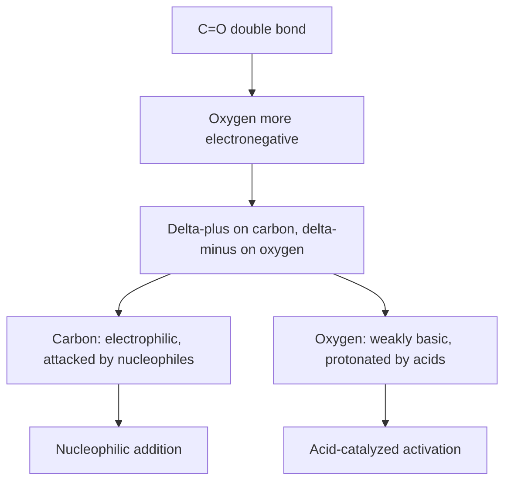
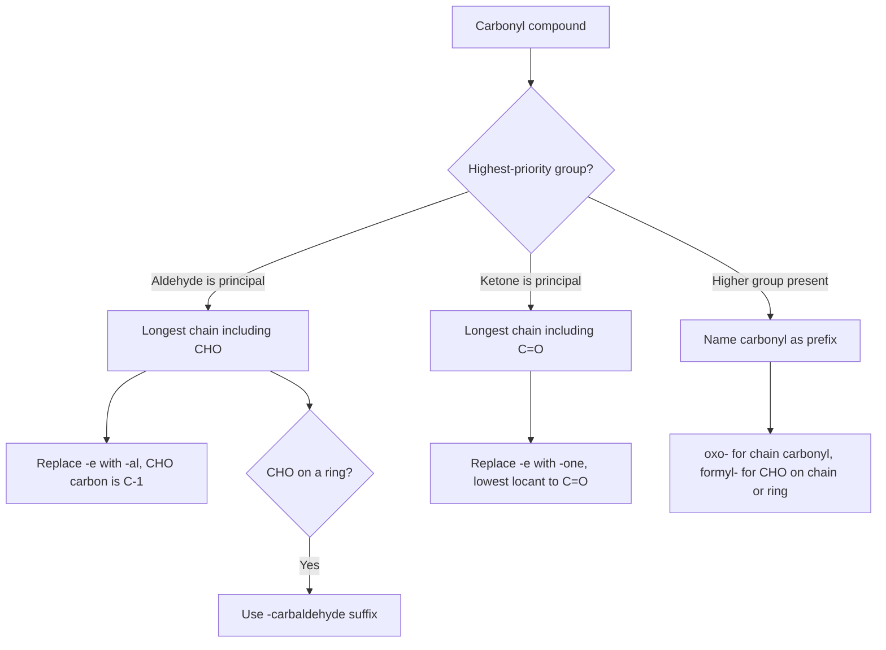

## Nomenclature and Structure

### Overview

Aldehydes (R–CHO) and ketones (R–CO–R') are the two principal classes of carbonyl compounds, defined by the presence of a carbon–oxygen double bond ($C{=}O$). In an aldehyde the carbonyl carbon is bonded to at least one hydrogen; in a ketone it is bonded to two carbon substituents. This single structural difference controls naming, reactivity, oxidation behavior, and spectroscopic signatures. A precise command of nomenclature (IUPAC and common systems) and of the electronic and geometric structure of the carbonyl group is the foundation for understanding all subsequent carbonyl chemistry: nucleophilic addition, enolization, condensation, and redox reactions.

**Key Points**

- The carbonyl carbon is $sp^2$-hybridized and trigonal planar, with bond angles near 120°.
- The $C{=}O$ bond is strongly polarized ($C^{\delta+}{=}O^{\delta-}$), making carbon electrophilic and oxygen weakly nucleophilic/basic.
- Aldehydes always occupy a chain terminus (or a ring substituent position), so their carbon is numbered C-1 automatically; ketone positions must be numbered explicitly.
- Aldehydes are named with the suffix **-al** (or **-carbaldehyde** on rings); ketones with **-one**.
- Common (trivial) names remain widely used for the lowest members and for many natural products.

---

### Part 1: Structure of the Carbonyl Group

#### 1.1 General Formulas

| Class | General formula | Substituents on carbonyl carbon | Example |
| --- | --- | --- | --- |
| Aldehyde | $R{-}CHO$ | One H and one R (or two H in formaldehyde) | $CH_3CHO$ |
| Ketone | $R{-}CO{-}R'$ | Two carbon groups (alkyl, aryl, or both) | $CH_3COCH_3$ |
| Formaldehyde | $H_2C{=}O$ | Two H (the only aldehyde with no carbon substituent) | $HCHO$ |

Related carbonyl families (carboxylic acids, esters, amides, acyl halides) carry a heteroatom on the carbonyl carbon and are treated separately; they are not aldehydes or ketones.

#### 1.2 Hybridization and Geometry

- The carbonyl carbon uses three $sp^2$ hybrid orbitals to form three $\sigma$-bonds (to O and two substituents) and one unhybridized $p$ orbital that overlaps sideways with an oxygen $p$ orbital to form the $\pi$ bond.
- The three atoms attached to the carbonyl carbon and the carbon itself lie in one plane; bond angles are close to 120° (for example, about 121.7° for H–C=O in formaldehyde and about 121° for C–C=O in acetone; exact values vary with the substituents and measurement method).
- Oxygen also has two lone pairs in $sp^2$-type orbitals lying in the molecular plane.
- Because the carbonyl carbon is planar, a nucleophile can approach from either face of the trigonal plane (the Bürgi–Dunitz trajectory, approximately 107° relative to the $C{=}O$ axis).

Structural representation of the carbonyl group (svg_diagram):

<svg xmlns="http://www.w3.org/2000/svg" viewBox="0 0 640 260" width="640" height="260" font-family="sans-serif" font-size="14">
<text x="320" y="20" text-anchor="middle" font-weight="bold">Carbonyl Group Geometry (svg_diagram)</text>

<g stroke="black" stroke-width="2" fill="none">
<line x1="140" y1="120" x2="140" y2="70" />
<line x1="146" y1="120" x2="146" y2="70" />
<line x1="140" y1="120" x2="95" y2="150" />
<line x1="140" y1="120" x2="185" y2="150" />
</g>
<text x="140" y="60" text-anchor="middle" font-size="16">O</text>
<text x="140" y="118" text-anchor="middle" font-size="12" dy="-8" dx="-14">C</text>
<text x="80" y="165" text-anchor="middle" font-size="16">R</text>
<text x="198" y="165" text-anchor="middle" font-size="16">H</text>
<text x="140" y="200" text-anchor="middle">Aldehyde (~120° angles)</text>

<g stroke="black" stroke-width="2" fill="none">
<line x1="480" y1="120" x2="480" y2="70" />
<line x1="486" y1="120" x2="486" y2="70" />
<line x1="480" y1="120" x2="435" y2="150" />
<line x1="480" y1="120" x2="525" y2="150" />
</g>
<text x="480" y="60" text-anchor="middle" font-size="16">O</text>
<text x="480" y="118" text-anchor="middle" font-size="12" dy="-8" dx="-14">C</text>
<text x="420" y="165" text-anchor="middle" font-size="16">R</text>
<text x="540" y="165" text-anchor="middle" font-size="16">R'</text>
<text x="480" y="200" text-anchor="middle">Ketone (~120° angles)</text>
<text x="320" y="245" text-anchor="middle" font-size="12">Planar, sp2 carbon; nucleophiles attack the pi* orbital from above or below the plane</text>
</svg>

#### 1.3 Polarity and Resonance

The $C{=}O$ bond is polarized because oxygen (electronegativity 3.44) is more electronegative than carbon (2.55). This is described by two resonance contributors:

$$\underset{\text{major}}{R_2C{=}O} \;\longleftrightarrow\; \underset{\text{minor, carbocation-like}}{R_2\overset{+}{C}{-}O^-}$$

Consequences:

- The carbonyl carbon carries partial positive charge and is the site of nucleophilic attack.
- The oxygen is weakly basic (conjugate acid $pK_a$ approximately −7 for protonated acetone; values vary with source), so acid catalysis activates the carbonyl by protonation on oxygen.
- Dipole moments are large: acetaldehyde about 2.7 D and acetone about 2.9 D. This gives aldehydes and ketones higher boiling points than alkanes or ethers of similar mass, but lower than alcohols, because carbonyls cannot donate hydrogen bonds to each other (they can accept them).

#### 1.4 Bond Lengths and Energies

| Bond | Approximate length (pm) | Approximate bond energy (kJ/mol) |
| --- | --- | --- |
| $C{=}O$ (aldehyde/ketone) | 121–122 | about 745 (about 800 in $CO_2$; about 720–750 in ketones) |
| $C{-}O$ (alcohol/ether) | 143 | about 358 |
| $C{=}C$ | 134 | about 614 |

The $C{=}O$ bond is shorter and stronger than $C{-}O$ but the $\pi$ component is weaker than the corresponding $\sigma$ component, and it is the $\pi$ bond that undergoes addition reactions. Values are approximate and differ among references.

#### 1.5 Electronic Differences Between Aldehydes and Ketones

| Factor | Aldehyde | Ketone |
| --- | --- | --- |
| Alkyl groups on carbonyl carbon | One (or zero) | Two |
| Electron donation ($+I$, hyperconjugation) | Less stabilization of $\delta^+$ | More stabilization of $\delta^+$ |
| Steric hindrance to nucleophile | Lower | Higher |
| Typical reactivity toward nucleophiles | Higher | Lower |

Both electronic and steric effects predict the order $HCHO > RCHO > RCOR'$ for nucleophilic addition reactivity. Aryl aldehydes and ketones are less reactive than their aliphatic counterparts because of resonance donation from the ring.

---

### Part 2: IUPAC Nomenclature of Aldehydes

#### 2.1 Acyclic Aldehydes

**Rules**

1. Identify the longest continuous carbon chain that **includes the carbonyl carbon**.
2. Replace the terminal **-e** of the parent alkane with **-al**.
3. The aldehyde carbon is always C-1; it is never given a locant.
4. Number substituents from C-1, name them in alphabetical order, and use prefixes (di-, tri-) for multiples.

| Structure | IUPAC name | Common name |
| --- | --- | --- |
| $HCHO$ | methanal | formaldehyde |
| $CH_3CHO$ | ethanal | acetaldehyde |
| $CH_3CH_2CHO$ | propanal | propionaldehyde |
| $CH_3CH_2CH_2CHO$ | butanal | butyraldehyde |
| $(CH_3)_2CHCHO$ | 2-methylpropanal | isobutyraldehyde |
| $CH_3CH_2CH_2CH_2CHO$ | pentanal | valeraldehyde |
| $CH_2{=}CHCHO$ | prop-2-enal | acrolein |
| $CH_3CH{=}CHCHO$ | (2E)-but-2-enal | crotonaldehyde |
| $OHC{-}CHO$ | ethanedial | glyoxal |
| $OHC(CH_2)_3CHO$ | pentanedial | glutaraldehyde |

**Dialdehydes** use **-dial** (the final **-e** of the alkane name is retained before the consonant **d**, giving "butanedial", "pentanedial").

**Unsaturated aldehydes** are numbered from the aldehyde carbon, and the double bond locant is placed before the "-en" infix: $CH_3CH{=}CHCHO$ is but-2-enal, since C-1 is the CHO carbon.

**Substituted example:** $CH_3CH(Cl)CH_2CHO$ is 3-chlorobutanal, and $(CH_3)_2C(OH)CH_2CHO$ is 3-hydroxy-3-methylbutanal.

#### 2.2 Cyclic Aldehydes and the -carbaldehyde Suffix

When the $-CHO$ group is attached to a ring (or otherwise cannot be counted as part of the parent chain), it is named with the suffix **-carbaldehyde** appended to the full name of the ring or parent structure. The ring carbon bearing $-CHO$ is C-1.

| Structure | IUPAC name |
| --- | --- |
| Cyclohexane with $-CHO$ | cyclohexanecarbaldehyde |
| Benzene with $-CHO$ | benzenecarbaldehyde (retained name: benzaldehyde) |
| Thiophene with $-CHO$ at C-2 | thiophene-2-carbaldehyde |
| 2-Methylcyclopentane with $-CHO$ | 2-methylcyclopentane-1-carbaldehyde |

A **retained name** benzaldehyde is the preferred IUPAC name for $C_6H_5CHO$.

#### 2.3 When -CHO Is a Substituent: the Prefix Formyl-

If another functional group of higher seniority is present (such as a carboxylic acid or ester), the aldehyde group is named with the prefix **oxo-** (when it is part of the chain) or **formyl-** (when it is attached to a chain or ring as a substituent):

| Structure | Name |
| --- | --- |
| $OHC{-}CH_2{-}COOH$ | 3-oxopropanoic acid |
| 4-$OHC{-}C_6H_4{-}COOH$ | 4-formylbenzoic acid |

The seniority order (highest first) among common classes is: carboxylic acids > esters > acyl halides > amides > nitriles > **aldehydes** > **ketones** > alcohols > amines > alkenes/alkynes > alkanes/halides (halides and other prefix-only groups are never principal groups).

---

### Part 3: IUPAC Nomenclature of Ketones

#### 3.1 Acyclic Ketones

**Rules**

1. Select the longest continuous chain containing the carbonyl carbon.
2. Replace the terminal **-e** of the alkane with **-one**.
3. Number the chain so the carbonyl carbon receives the **lowest possible locant**, and place that locant immediately before **-one** (current IUPAC recommendations place it directly before the suffix, for example "pentan-2-one"; older usage wrote "2-pentanone").
4. Add substituents with their locants in alphabetical order.

| Structure | IUPAC name | Common name |
| --- | --- | --- |
| $CH_3COCH_3$ | propan-2-one (retained: acetone) | acetone |
| $CH_3COCH_2CH_3$ | butan-2-one | ethyl methyl ketone (MEK) |
| $CH_3COCH_2CH_2CH_3$ | pentan-2-one | methyl propyl ketone |
| $CH_3CH_2COCH_2CH_3$ | pentan-3-one | diethyl ketone |
| $CH_3COCH(CH_3)_2$ | 3-methylbutan-2-one | isopropyl methyl ketone |
| $CH_3COCH_2COCH_3$ | pentane-2,4-dione | acetylacetone |
| $CH_3COCOCH_3$ | butane-2,3-dione | diacetyl |
| $CH_3COCH{=}CH_2$ | but-3-en-2-one | methyl vinyl ketone |
| $(CH_3)_2C{=}CHCOCH_3$ | 4-methylpent-3-en-2-one | mesityl oxide |

**Locant rule for propanone.** Because acetone has only one possible position for the carbonyl in a three-carbon chain, the locant is technically unnecessary ("propanone"); current recommendations retain "propan-2-one" as the systematic name and accept "acetone" as the preferred IUPAC name.

**Diketones** use **-dione**, and the final **-e** of the parent alkane is retained ("pentane-2,4-dione").

**Unsaturated ketones.** Both the ketone and the double bond need locants, and the carbonyl carbon takes the lowest locant since ketone outranks alkene as principal characteristic group: $CH_2{=}CHCH_2COCH_3$ is pent-4-en-2-one, not pent-1-en-4-one.

#### 3.2 Cyclic Ketones

The carbonyl carbon of a ring ketone is automatically C-1, and the locant "1" is normally omitted for monoketones.

| Structure | Name |
| --- | --- |
| Cyclopentane with one $C{=}O$ | cyclopentanone |
| Cyclohexane with one $C{=}O$ | cyclohexanone |
| 2-methylcyclohexane with $C{=}O$ at C-1 | 2-methylcyclohexan-1-one (or 2-methylcyclohexanone) |
| Benzene-derived 1,4-dione ring | cyclohexa-2,5-diene-1,4-dione (retained: 1,4-benzoquinone, or *p*-benzoquinone) |

For ring diketones, both locants are required ("cyclohexane-1,3-dione").

#### 3.3 Aromatic Ketones

Aryl ketones are commonly named with the prefix or retained names:

| Structure | IUPAC name | Common name |
| --- | --- | --- |
| $C_6H_5COCH_3$ | 1-phenylethan-1-one | acetophenone |
| $C_6H_5COC_6H_5$ | diphenylmethanone | benzophenone |
| $C_6H_5COCH_2CH_3$ | 1-phenylpropan-1-one | propiophenone |
| $C_6H_5COCH{=}CHC_6H_5$ | (2E)-1,3-diphenylprop-2-en-1-one | chalcone |
| 1-Tetralone | 3,4-dihydronaphthalen-1(2H)-one | α-tetralone |

The suffix **-phenone** is a common (non-systematic) name for a phenyl ketone.

#### 3.4 Ketone as a Substituent: the Prefix oxo-

When a higher-priority group is present, the ketone carbonyl is named with **oxo-**:

| Structure | Name |
| --- | --- |
| $CH_3COCH_2COOH$ | 3-oxobutanoic acid (acetoacetic acid) |
| $CH_3COCH_2CH_2COOCH_3$ | methyl 4-oxopentanoate |
| $OHC{-}CH_2{-}CO{-}CH_3$ | 3-oxobutanal |

In the last example the aldehyde outranks the ketone as principal group, so the ketone is expressed by **oxo-**.

---

### Part 4: Common (Trivial) Nomenclature

#### 4.1 Aldehydes

Common names derive from the carboxylic acid that the aldehyde would oxidize to: the **-ic acid** ending of the acid name is replaced by **-aldehyde**.

| Carboxylic acid (common) | Aldehyde (common) |
| --- | --- |
| Formic acid | Formaldehyde |
| Acetic acid | Acetaldehyde |
| Propionic acid | Propionaldehyde |
| Butyric acid | Butyraldehyde |
| Benzoic acid | Benzaldehyde |
| Cinnamic acid | Cinnamaldehyde |
| Salicylic acid | Salicylaldehyde (2-hydroxybenzaldehyde) |

Positions of substituents in the common system use Greek letters, with **α** being the carbon adjacent to the carbonyl carbon (the carbonyl carbon itself is not labeled): $CH_3CH(Cl)CHO$ is α-chloropropionaldehyde; $ClCH_2CH_2CHO$ is β-chloropropionaldehyde.

#### 4.2 Ketones

Simple ketones are named by listing the two groups attached to the carbonyl carbon **alphabetically** followed by the word **ketone**:

| Structure | Common name |
| --- | --- |
| $CH_3COCH_3$ | dimethyl ketone (acetone) |
| $CH_3COC_2H_5$ | ethyl methyl ketone |
| $C_6H_5COCH_3$ | methyl phenyl ketone (acetophenone) |
| $C_2H_5COC_2H_5$ | diethyl ketone |
| $(CH_3)_3CCOCH_3$ | *tert*-butyl methyl ketone (pinacolone) |
| $C_6H_5COC_6H_5$ | diphenyl ketone (benzophenone) |

In the common system, positions on the alkyl chain attached to the carbonyl are marked with Greek letters α, α', β, β' on either side of the carbonyl, for example, α,α'-dibromoacetone denotes the compound $BrCH_2COCH_2Br$.

---

### Part 5: Retained Names and Notable Compounds

| Compound | Structure | Notes |
| --- | --- | --- |
| Formaldehyde | $HCHO$ | Gas at room temperature; available as aqueous formalin (~37% w/w) |
| Acetaldehyde | $CH_3CHO$ | Volatile (bp ~20 °C); intermediate in ethanol metabolism |
| Benzaldehyde | $C_6H_5CHO$ | Almond flavor; retained IUPAC name |
| Cinnamaldehyde | $C_6H_5CH{=}CHCHO$ | Cinnamon flavor; (2E)-3-phenylprop-2-enal |
| Vanillin | 4-hydroxy-3-methoxybenzaldehyde | Vanilla flavor |
| Citral | 3,7-dimethylocta-2,6-dienal | Lemon aroma; mixture of geranial and neral isomers |
| Acetone | $CH_3COCH_3$ | Solvent; retained IUPAC name |
| Butanone (MEK) | $CH_3COCH_2CH_3$ | Industrial solvent |
| Cyclohexanone | $C_6H_{10}O$ | Nylon precursor |
| Camphor | 1,7,7-trimethylbicyclo[2.2.1]heptan-2-one | Bicyclic terpenoid ketone |
| Testosterone | steroid with C-3 enone | Contains an α,β-unsaturated ketone within a fused ring |
| Progesterone | steroid with C-3 enone and C-20 ketone | Two ketone groups |

---

### Part 6: Structural Isomerism

#### 6.1 Isomer Types

Compounds with formula $C_nH_{2n}O$ can be aldehydes or ketones (as well as cyclic ethers, unsaturated alcohols, and others), so **functional-group isomerism** is common: propanal and propanone are isomers with formula $C_3H_6O$.

| Molecular formula | Aldehyde isomers | Ketone isomers |
| --- | --- | --- |
| $C_3H_6O$ | propanal | propan-2-one |
| $C_4H_8O$ | butanal, 2-methylpropanal | butan-2-one |
| $C_5H_{10}O$ | pentanal, 2-methylbutanal, 3-methylbutanal, 2,2-dimethylpropanal | pentan-2-one, pentan-3-one, 3-methylbutan-2-one |

- **Chain isomerism:** butanal versus 2-methylpropanal.
- **Position isomerism (ketones only):** pentan-2-one versus pentan-3-one. Aldehydes cannot show positional isomerism of the carbonyl, because the carbonyl must sit at the chain end.
- **Functional-group isomerism:** aldehydes are isomeric with ketones of the same carbon count, and both are isomeric with, for example, allyl alcohol ($CH_2{=}CHCH_2OH$) or oxetane for $C_3H_6O$.

#### 6.2 Stereochemistry

- A carbonyl carbon is not itself a stereocenter (it is planar), but α-carbons may be. For example, 2-methylbutanal has a stereocenter at C-2 and exists as (R) and (S) enantiomers.
- α,β-Unsaturated carbonyls can show **E/Z** isomerism at the double bond: (2E)-but-2-enal (crotonaldehyde, trans) versus (2Z)-but-2-enal.
- Ketones with two different substituents attached to a planar carbonyl are **prochiral**: addition of a nucleophile to the *Re* or *Si* face gives one or the other enantiomer of the product alcohol.
- Ring ketones such as 2-methylcyclohexanone and camphor contain stereocenters, and camphor exists as (+) and (−) enantiomers.

#### 6.3 Keto–Enol Tautomerism (Structural Relationship)

Carbonyl compounds with α-hydrogens are in equilibrium with their **enol** tautomers, which differ by the position of a proton and a double bond:

$$R{-}CO{-}CH_2R' \rightleftharpoons R{-}C(OH){=}CHR'$$

For simple aldehydes and ketones, the keto form strongly predominates (acetone is about $10^{-6}$ to $10^{-8}$ mol fraction enol in water; values vary with conditions). Enol content is substantially higher in 1,3-dicarbonyls like pentane-2,4-dione (roughly 80% enol in the neat liquid; varies with solvent) thanks to conjugation and intramolecular hydrogen bonding. Tautomerism is a distinct concept from resonance: tautomers are different compounds in equilibrium, whereas resonance forms are contributors to a single structure.

---

### Part 7: Spectroscopic Fingerprints Related to Structure

| Technique | Aldehyde | Ketone | Comment |
| --- | --- | --- | --- |
| IR: $C{=}O$ stretch | ~1720–1740 cm⁻¹ (strong) | ~1705–1725 cm⁻¹ (strong) | Conjugation lowers by ~30 cm⁻¹; ring strain raises it (cyclopentanone ~1745, cyclobutanone ~1780) |
| IR: aldehyde C–H stretch | Two weak bands at ~2720 and ~2820 cm⁻¹ | Absent | Fermi resonance doublet |
| $^1H$ NMR | CHO proton at δ ~9–10 ppm | No such signal; α-H at δ ~2.0–2.7 | Aldehyde proton strongly deshielded |
| $^{13}C$ NMR | C=O at δ ~190–205 ppm | C=O at δ ~200–220 ppm | Ketone carbonyl further downfield |
| UV-Vis | Weak $n\to\pi^*$ near 280–300 nm | Weak $n\to\pi^*$ near 270–290 nm | $\epsilon$ ~10–30; conjugated enones show strong $\pi\to\pi^*$ near 220–250 nm |
| Mass spectrometry | $\alpha$-cleavage; McLafferty rearrangement ($\gamma$-H needed) | $\alpha$-cleavage; McLafferty rearrangement | Acylium ions $RCO^+$ are diagnostic |

All ranges are typical and shift with solvent, substitution, and conjugation.

---

### Part 8: Physical Properties Linked to Structure

| Compound | Molar mass (g/mol) | Boiling point (°C) | Comment |
| --- | --- | --- | --- |
| Butane | 58 | ~0 | Non-polar reference |
| Propanal | 58 | ~49 | Dipole–dipole forces |
| Propan-2-one | 58 | ~56 | Slightly higher than propanal (larger dipole moment) |
| Propan-1-ol | 60 | ~97 | Hydrogen bonding |

- Boiling points follow the order alcohols > aldehydes/ketones > ethers > alkanes for similar masses.
- Carbonyl oxygen can accept hydrogen bonds from water, so the lowest members (up to about four carbons) are miscible or highly soluble in water; solubility falls quickly as the hydrophobic chain lengthens.
- Lower aldehydes have sharp odors; higher aldehydes and many aromatic carbonyls have pleasant floral or fruity scents.

---

### Part 9: Worked Examples

**Example 1: Name the aldehyde $CH_3CH(CH_3)CH_2CHO$**

1. Longest chain containing CHO: four carbons, so the parent is butanal.
2. C-1 is the CHO carbon; a methyl group sits on C-3.
3. Name: **3-methylbutanal**.

**Example 2: Name the ketone $CH_3CH_2COCH(CH_3)CH_3$**

1. Longest chain containing the carbonyl: five carbons (pentane).
2. Numbering from the left gives C=O at position 3; from the right, at position 3 of... let the chain be $CH_3{-}CH_2{-}C(=O){-}CH(CH_3){-}CH_3$. Number from the right: C-1 is the terminal $CH_3$ of the isopropyl unit's chain; the carbonyl is at C-3 from the left, or C-3 from the right? Renumber carefully: the main chain runs $CH_3$ (1)–$CH_2$ (2)–$C=O$ (3)–$CH$ (4)–$CH_3$ (5) with a methyl on C-4, versus numbering from the other end, with the carbonyl still at 3 and the methyl at 2.
3. Both directions give the carbonyl locant 3, so the tie is broken by lowest locant to the substituent: methyl at C-2.
4. Name: **2-methylpentan-3-one**.

**Output:** 2-methylpentan-3-one (also written 2-methyl-3-pentanone).

**Example 3: Choose the correct IUPAC name for $C_6H_5CH_2CHO$**

- The chain containing CHO is two carbons, ethanal, with a phenyl substituent at C-2.
- Name: **2-phenylethanal** (common: phenylacetaldehyde). Compare $C_6H_5CHO$, benzaldehyde, where the CHO is directly attached to the ring.

**Example 4: Name a polyfunctional compound $HOOC{-}CH_2{-}CO{-}CH_3$**

- Carboxylic acid outranks ketone, so the parent is butanoic acid.
- The ketone carbon at C-3 is expressed as **oxo-**.
- Name: **3-oxobutanoic acid**.

**Example 5: Draw and name a ring aldehyde with a substituent**

- Structure: a cyclohexane ring with $-CHO$ on C-1 and $-CH_3$ on C-3.
- Name: **3-methylcyclohexane-1-carbaldehyde**.

**Example 6: Distinguish the isomers of $C_4H_8O$ that are carbonyl compounds**

| Isomer | Class | Name |
| --- | --- | --- |
| $CH_3CH_2CH_2CHO$ | Aldehyde | butanal |
| $(CH_3)_2CHCHO$ | Aldehyde | 2-methylpropanal |
| $CH_3COCH_2CH_3$ | Ketone | butan-2-one |

---

### Part 10: Common Errors in Nomenclature

- Choosing the longest chain that omits the carbonyl carbon; the parent chain must **include** the carbonyl carbon.
- Assigning a locant to the aldehyde carbon (it is always C-1 and takes no locant).
- Numbering a ketone from the wrong end; the carbonyl must get the lowest possible locant, and substituents only break ties.
- Using "-al" for a ring-attached CHO instead of "-carbaldehyde".
- Forgetting the "e" in "-dione" and "-dial" names (correct: "butane-2,3-dione", "pentanedial").
- Confusing prefix and suffix status: when a carboxylic acid, ester, amide, or acyl halide is present, the aldehyde or ketone is a prefix (formyl-/oxo-).
- Mixing older placement of locants ("2-butanone") with current recommendations ("butan-2-one"); both appear widely and both are understood, but consistent use is advisable.

**Conclusion**

Aldehydes and ketones share the planar, polarized $C{=}O$ group that defines their chemistry, with the aldehyde carbon carrying a hydrogen and the ketone carbon carrying two carbon substituents. Accurate naming depends on choosing the parent chain that contains the carbonyl carbon, applying the suffixes **-al**, **-carbaldehyde**, or **-one**, giving the carbonyl the lowest locant, and shifting to the prefixes **formyl-** and **oxo-** whenever a higher-priority group is present. Understanding the structural basis (sp² geometry, polarity, resonance, electronic and steric differences between aldehydes and ketones, isomerism, tautomerism, and spectroscopic signatures) prepares the way for predicting reactivity in nucleophilic addition, enolate chemistry, and redox transformations.

**Related Topics**

- Preparation of aldehydes and ketones (oxidation of alcohols, ozonolysis, Friedel–Crafts acylation, hydration of alkynes)
- Nucleophilic addition reactions (hydrates, hemiacetals, acetals, cyanohydrins, imines, oximes, hydrazones)
- Grignard and organolithium additions to carbonyls
- Hydride reductions ($NaBH_4$, $LiAlH_4$) and Wolff–Kishner/Clemmensen reductions
- Oxidation tests (Tollens, Fehling, Benedict) and haloform reaction
- Enols, enolates, and α-substitution reactions
- Aldol and Claisen–Schmidt condensations
- α,β-Unsaturated carbonyl compounds and Michael addition
- Spectroscopic identification of carbonyl compounds (IR, NMR, MS)
- Carboxylic acid derivatives and their nomenclature