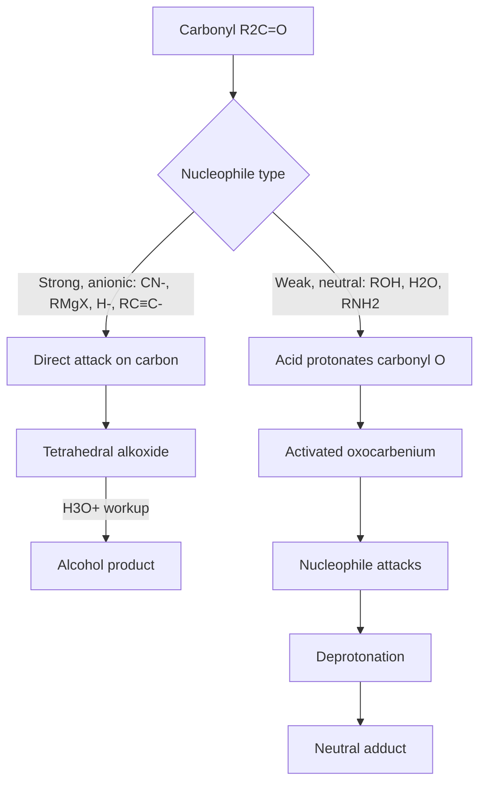
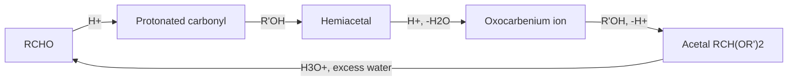
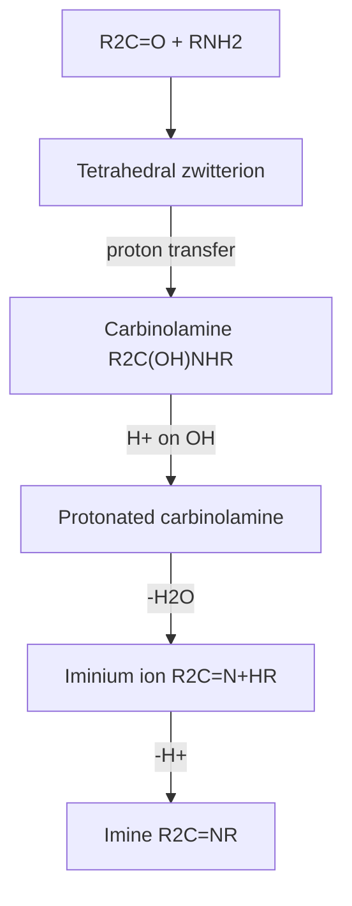

## Nucleophilic Addition Reactions

### Overview

Nucleophilic addition is the characteristic reaction of aldehydes and ketones. The carbonyl carbon is electrophilic ($C^{\delta+}{=}O^{\delta-}$) and planar ($sp^2$), so a nucleophile ($Nu^-$ or $Nu{-}H$) can attack it, breaking the $\pi$ bond and converting the carbon from $sp^2$ to $sp^3$. The oxygen becomes an alkoxide (or, after protonation, an alcohol). Depending on the nucleophile and conditions, the initial adduct may be the final product (cyanohydrins, alcohols from Grignard reagents, hydrides) or may proceed further (hemiacetals to acetals, carbinolamines to imines).

**Key Points**

- The general transformation is $R_2C{=}O + Nu{-}H \rightarrow R_2C(OH)Nu$.
- Reactivity order toward nucleophiles: $HCHO > RCHO > RCOR' $, and aliphatic > aromatic carbonyls.
- Strong, negatively charged nucleophiles usually add first and protonate second (basic conditions). Weak, neutral nucleophiles need acid catalysis to activate the carbonyl.
- Many additions are reversible; the position of equilibrium depends on carbonyl stability and nucleophile strength.
- Attack occurs along the Bürgi–Dunitz trajectory (about 107° to the $C{=}O$ axis) from either face of the planar carbonyl, so prochiral carbonyls give racemic products unless a chiral influence is present.

---

### Part 1: General Mechanism

#### 1.1 Base-Promoted (Strong Nucleophile) Pathway

1. The nucleophile attacks the carbonyl carbon (rate-determining step), pushing the $\pi$ electrons onto oxygen to give a tetrahedral alkoxide.
2. The alkoxide is protonated by solvent or added acid to give the alcohol.

$$R_2C{=}O + Nu^- \rightarrow R_2C(Nu)O^- \xrightarrow{H^+} R_2C(Nu)OH$$

#### 1.2 Acid-Catalyzed (Weak Nucleophile) Pathway

1. The carbonyl oxygen is protonated (or coordinated to a Lewis acid), increasing the electrophilicity of carbon.
2. The neutral nucleophile attacks.
3. Deprotonation gives the neutral adduct.

$$R_2C{=}O \xrightarrow{H^+} R_2C{=}\overset{+}{O}H \xrightarrow{Nu{-}H} R_2C(OH)\overset{+}{Nu}H \xrightarrow{-H^+} R_2C(OH)Nu$$

#### 1.3 Orbital Picture

The nucleophile's HOMO donates into the carbonyl's $\pi^*$ (LUMO), which has its larger coefficient on carbon. The developing tetrahedral geometry places the new bond roughly perpendicular to the plane of the original carbonyl substituents but tilted away from the oxygen (Bürgi–Dunitz angle).

Reaction coordinate concept (svg_diagram):

<svg xmlns="http://www.w3.org/2000/svg" viewBox="0 0 680 300" width="680" height="300" font-family="sans-serif" font-size="13">
<text x="340" y="20" text-anchor="middle" font-weight="bold">Nucleophilic Addition to a Carbonyl (svg_diagram)</text>

<g stroke="black" stroke-width="2" fill="none">
<line x1="120" y1="190" x2="240" y2="190" />
<line x1="180" y1="190" x2="180" y2="130" />
<line x1="186" y1="190" x2="186" y2="130" />
<line x1="180" y1="190" x2="130" y2="225" />
<line x1="180" y1="190" x2="230" y2="225" />
</g>
<text x="183" y="120" text-anchor="middle" font-size="16">O</text>
<text x="183" y="212" text-anchor="middle" font-size="12" dx="-14" dy="-12">C</text>
<text x="115" y="240" font-size="14">R</text>
<text x="235" y="240" font-size="14">R'</text>

<path d="M 340 60 Q 260 80 195 180" stroke="red" stroke-width="2" fill="none" stroke-dasharray="6,4" />
<text x="350" y="60" font-size="16" fill="red">Nu⁻</text>
<text x="290" y="100" font-size="12" fill="red">~107° (Bürgi–Dunitz)</text>

<text x="330" y="190" font-size="26">→</text>

<g stroke="black" stroke-width="2" fill="none">
<line x1="520" y1="190" x2="520" y2="140" />
<line x1="520" y1="190" x2="470" y2="225" />
<line x1="520" y1="190" x2="570" y2="225" />
<line x1="520" y1="190" x2="520" y2="240" />
</g>
<text x="520" y="130" text-anchor="middle" font-size="16">O⁻</text>
<text x="520" y="258" text-anchor="middle" font-size="16" fill="red">Nu</text>
<text x="455" y="240" font-size="14">R</text>
<text x="575" y="240" font-size="14">R'</text>
<text x="340" y="285" text-anchor="middle" font-size="12">sp2 planar carbon becomes sp3 tetrahedral carbon</text>
</svg>

#### 1.4 Factors Governing Reactivity

| Factor | Effect | Explanation |
| --- | --- | --- |
| Electronic ($+I$, hyperconjugation) | Alkyl groups reduce reactivity | Donate electron density to $C^{\delta+}$ |
| Steric | Bulky groups reduce reactivity | Hinder approach; tetrahedral product is more crowded than trigonal reactant |
| Conjugation with aryl ring or $C{=}C$ | Reduces reactivity | Resonance delocalizes the positive charge |
| Electron-withdrawing groups ($-CF_3$, $-CCl_3$, $-NO_2$) | Increase reactivity | Enhance $\delta^+$ on carbon (chloral is extensively hydrated) |
| Ring strain (small rings) | Cyclobutanone, cyclopropanone more reactive | Relief of angle strain on going from $sp^2$ (120°) to $sp^3$ (109.5°) |
| Ring strain (cyclohexanone) | Somewhat higher than acyclic ketones | Relief of eclipsing interactions |

Reactivity order (typical): $HCHO > CH_3CHO > RCHO > C_6H_5CHO > RCOCH_3 > RCOR > C_6H_5COCH_3 > C_6H_5COC_6H_5$.

---

### Part 2: Hydration (Addition of Water)

$$R_2C{=}O + H_2O \rightleftharpoons R_2C(OH)_2 \quad (\text{gem-diol, or hydrate})$$

Equilibrium constants $K_{hyd} = [\text{hydrate}]/[\text{carbonyl}]$ (approximate, aqueous solution, room temperature; values vary by source):

| Carbonyl | Approx. $K_{hyd}$ | Fraction hydrated |
| --- | --- | --- |
| Formaldehyde | ~2000 | >99.9% |
| Acetaldehyde | ~1 | ~50% |
| Acetone | ~$10^{-3}$ | ~0.1% |
| Chloral ($CCl_3CHO$) | ~$10^{4}$ | Essentially fully hydrated (chloral hydrate is isolable) |
| Hexafluoroacetone | very large | Fully hydrated |

- Both acid and base catalyze the approach to equilibrium but do not change the position.
- Simple gem-diols usually cannot be isolated because they lose water on attempted purification; exceptions are those stabilized by strongly electron-withdrawing groups (chloral hydrate, ninhydrin) or by intramolecular hydrogen bonding.
- Isotope labeling ($H_2{}^{18}O$) shows that carbonyl oxygens exchange with water through reversible hydration, which accounts for $^{18}O$ incorporation into aldehydes and ketones in labeled water.

---

### Part 3: Addition of Alcohols

#### 3.1 Hemiacetals and Hemiketals

$$RCHO + R'OH \rightleftharpoons RCH(OH)OR' \quad (\text{hemiacetal})$$

$$R_2C{=}O + R'OH \rightleftharpoons R_2C(OH)OR' \quad (\text{hemiketal})$$

- Acyclic hemiacetals are generally unstable relative to the starting materials and are not isolable.
- **Cyclic hemiacetals** form readily when the hydroxyl group is positioned to give a five- or six-membered ring (entropically favorable intramolecular attack). This is the structural basis of carbohydrate chemistry: glucose exists overwhelmingly (>99%) as cyclic pyranose hemiacetals (α and β anomers) in solution.

#### 3.2 Acetals and Ketals

Under **acid catalysis** with excess alcohol (or a diol), and removal of water, the hemiacetal continues to the full acetal (ketal):

$$RCHO + 2R'OH \xrightarrow{H^+} RCH(OR')_2 + H_2O$$

Mechanism (acid-catalyzed):

1. Protonation of carbonyl oxygen.
2. Attack by $R'OH$ to give a protonated hemiacetal; deprotonation gives the hemiacetal.
3. Protonation of the hemiacetal $-OH$ and loss of water to give a resonance-stabilized oxocarbenium ion.
4. Attack by a second $R'OH$; deprotonation gives the acetal.

Key features:

- The reaction is **reversible**; equilibrium is driven toward the acetal by removing water (Dean–Stark trap, molecular sieves, trimethyl orthoformate) and toward the carbonyl by adding excess aqueous acid.
- **Cyclic acetals** from ethylene glycol (1,3-dioxolanes) or propane-1,3-diol (1,3-dioxanes) are favored entropically and are the standard protecting groups for carbonyls.
- Acetals are **stable to bases, nucleophiles, hydrides, and Grignard reagents**, and **labile to aqueous acid**. This orthogonality permits selective reaction of another functional group (an ester, for example) in the presence of a protected carbonyl.

**Example: selective reduction using an acetal protecting group**

To reduce the ester of methyl 4-oxopentanoate to an alcohol while preserving the ketone:

1. Protect the ketone: ethylene glycol, $TsOH$, toluene, Dean–Stark (gives the dioxolane).
2. Reduce the ester with $LiAlH_4$ in ether.
3. Deprotect: $H_3O^+$ gives 5-hydroxypentan-2-one.

Without protection, $LiAlH_4$ would reduce both groups.

---

### Part 4: Addition of Hydrogen Cyanide (Cyanohydrin Formation)

$$R_2C{=}O + HCN \xrightarrow{CN^-\ (\text{cat.})} R_2C(OH)CN$$

- The nucleophile is cyanide ion, not HCN (a weak acid, $pK_a$ about 9.2); a catalytic amount of base (or a cyanide salt with acid, such as $NaCN/H_2SO_4$ keeping pH near 4–5) provides free $CN^-$.
- Mechanism: $CN^-$ attacks carbon giving the tetrahedral alkoxide, which is protonated by HCN (regenerating $CN^-$).
- Equilibrium favors the cyanohydrin for aldehydes and unhindered aliphatic ketones; it is less favorable for hindered ketones and aryl ketones.
- **Synthetic value:** the nitrile can be hydrolyzed to give an α-hydroxy carboxylic acid, or reduced to give a β-amino alcohol, extending the carbon chain by one carbon.

$$RCHO \xrightarrow{HCN} RCH(OH)CN \xrightarrow{H_3O^+,\ \Delta} RCH(OH)COOH$$

Example: acetaldehyde gives lactic acid (2-hydroxypropanoic acid) via the cyanohydrin.

**Safety note:** HCN and cyanide salts are acutely toxic. In practice, cyanohydrins are often prepared using $NaCN$ with acid in a fume hood, or with trimethylsilyl cyanide (TMSCN), which gives O-silylated cyanohydrins under Lewis acid or base catalysis.

Sugar chain extension (Kiliani–Fischer) uses cyanohydrin formation on an aldose.

---

### Part 5: Addition of Sodium Bisulfite

$$RCHO + NaHSO_3 \rightleftharpoons RCH(OH)SO_3^-Na^+ \quad (\text{α-hydroxy sulfonate})$$

- Works well with aldehydes, methyl ketones, and unhindered cyclic ketones (about C-3 to C-8 rings); fails with bulky ketones.
- The product is a crystalline, water-soluble salt; the reaction is used to **separate and purify** carbonyl compounds from mixtures. The carbonyl is regenerated with aqueous acid or base (release of $SO_2$ or sulfite).

---

### Part 6: Addition of Organometallic Reagents

#### 6.1 Grignard and Organolithium Reagents

$$R_2C{=}O + R'MgX \rightarrow R_2C(R')OMgX \xrightarrow{H_3O^+} R_2C(R')OH$$

| Carbonyl | Product alcohol class |
| --- | --- |
| Formaldehyde | Primary alcohol ($R'CH_2OH$) |
| Other aldehydes | Secondary alcohol |
| Ketones | Tertiary alcohol |
| Esters (two equivalents of RMgX) | Tertiary alcohol |
| Epoxide (ethylene oxide) | Primary alcohol, two carbons longer |

- Conditions: anhydrous ether or THF; water and protic sources destroy the reagent (Grignard reagents are strong bases, $pK_a$ of conjugate alkane about 45–50).
- Mechanism can involve a polar four- or six-membered cyclic transition state or single-electron transfer for hindered/aryl substrates; the simple nucleophilic addition picture is sufficient for most predictions.
- Side reactions with hindered ketones: enolization (Grignard acts as base) and reduction (β-hydride transfer from a Grignard with β-hydrogens).
- Organolithium reagents are more reactive and less prone to enolization at low temperature; organocerium reagents ($RLi + CeCl_3$) suppress enolization for readily enolizable ketones.

#### 6.2 Acetylide Addition (Alkynylation)

$$R_2C{=}O + R'C{\equiv}C^-\ Na^+ \rightarrow R_2C(OH)C{\equiv}CR'$$

Terminal alkyne acidity ($pK_a$ about 25) allows generation of acetylide by $NaNH_2$ or by Grignard exchange; the products are propargylic alcohols (Favorskii/ethynylation-type reaction).

#### 6.3 Organozinc Reagents

The **Reformatsky reaction** adds an organozinc enolate derived from an α-bromo ester to a carbonyl to give a β-hydroxy ester without attacking the ester group:

$$BrCH_2COOEt + Zn \rightarrow BrZnCH_2COOEt \xrightarrow{R_2C{=}O} \xrightarrow{H_3O^+} R_2C(OH)CH_2COOEt$$

---

### Part 7: Hydride Reduction

Hydride ($H^-$) transfer from complex metal hydrides converts aldehydes to primary alcohols and ketones to secondary alcohols.

$$RCHO \xrightarrow{1.\ NaBH_4,\ EtOH;\ 2.\ H_3O^+} RCH_2OH$$

$$R_2C{=}O \xrightarrow{1.\ NaBH_4;\ 2.\ H_3O^+} R_2CHOH$$

| Reagent | Solvent | Reactivity | Selectivity |
| --- | --- | --- | --- |
| $NaBH_4$ | Alcohols, water | Mild | Reduces aldehydes and ketones; generally leaves esters, amides, nitriles untouched |
| $LiAlH_4$ | Ether, THF (anhydrous) | Powerful | Reduces aldehydes, ketones, esters, acids, amides, nitriles; reacts violently with water |
| $NaBH_3CN$ | Buffered protic solvents (pH 3–7) | Mild | Selective for iminium ions over carbonyls; used in reductive amination |
| $DIBAL{-}H$ | Toluene, −78 °C | Moderate | Reduces esters to aldehydes at low temperature |
| $H_2$, Pd/C or Raney Ni | Various | Depends | Reduces $C{=}O$ but also $C{=}C$ |

- $NaBH_4$ delivers one hydride per B–H bond (up to four), and each alkoxyborate intermediate can continue to react.
- Stereochemical control: cyclic ketones such as 4-*tert*-butylcyclohexanone give mostly the equatorial alcohol (axial hydride attack) with small hydrides like $NaBH_4$; bulky hydrides (L-Selectride) favor axial alcohol via equatorial attack.
- The **Meerwein–Ponndorf–Verley reduction** transfers hydride from isopropoxide (aluminum triisopropoxide/isopropanol) to a carbonyl reversibly; the reverse is the **Oppenauer oxidation**.
- Enantioselective reductions use CBS (Corey–Bakshi–Shibata) oxazaborolidine catalysts, Noyori Ru-BINAP transfer hydrogenation, or enzymes (alcohol dehydrogenases).

---

### Part 8: Addition of Nitrogen Nucleophiles (Addition–Elimination)

Primary amines and their derivatives ($H_2N{-}Z$) add to give a **carbinolamine** (hemiaminal), which loses water to form a $C{=}N$ product (imine and relatives). These reactions are typically **acid-catalyzed and pH-dependent**.

$$R_2C{=}O + H_2N{-}Z \rightleftharpoons R_2C(OH)NHZ \xrightarrow{-H_2O} R_2C{=}N{-}Z$$

| $H_2N{-}Z$ reagent | Z group | Product | Notes |
| --- | --- | --- | --- |
| Ammonia | $H$ | Imine (unstable, often trimerizes) | Rarely isolated |
| Primary amine $RNH_2$ | $R$ | **Imine (Schiff base)** | Basis of many biochemical processes (retinal–opsin, pyridoxal phosphate) |
| Hydroxylamine | $OH$ | **Oxime** | Crystalline derivatives; used in Beckmann rearrangement |
| Hydrazine | $NH_2$ | **Hydrazone** | Intermediate in Wolff–Kishner reduction |
| Phenylhydrazine | $NHC_6H_5$ | Phenylhydrazone | Historical derivative; used in osazone formation of sugars |
| 2,4-Dinitrophenylhydrazine (2,4-DNP) | $NH{-}C_6H_3(NO_2)_2$ | 2,4-Dinitrophenylhydrazone | Yellow/orange/red precipitate; classic qualitative test for aldehydes and ketones |
| Semicarbazide | $NHCONH_2$ | Semicarbazone | Crystalline derivative with sharp melting point |

#### 8.1 Mechanism of Imine Formation

1. Nucleophilic attack of the amine on the carbonyl gives a zwitterionic tetrahedral intermediate, then a neutral carbinolamine after proton transfer.
2. Acid-catalyzed protonation of the carbinolamine hydroxyl converts it to a good leaving group.
3. Loss of water, assisted by nitrogen lone pair, gives an iminium ion.
4. Deprotonation gives the imine.

#### 8.2 The pH-Rate Profile

The rate of imine formation is a **bell-shaped function of pH**, with a maximum near pH 4–5:

- At **low pH**, most of the amine is protonated ($RNH_3^+$), which is not nucleophilic; the attack step becomes rate-limiting.
- At **high pH**, there is insufficient acid to protonate the carbinolamine hydroxyl, so dehydration is slow (rate-limiting).
- The optimum pH balances free amine availability with acid catalysis of dehydration; the exact value depends on the amine's $pK_a$.

Imine formation is reversible; imines hydrolyze back to carbonyl and amine in aqueous acid, so water removal (molecular sieves, azeotropic distillation) drives condensation.

#### 8.3 Secondary Amines: Enamines and Iminium Ions

Secondary amines ($R_2NH$) cannot lose a second N–H to form a neutral imine. If the carbonyl has an α-hydrogen, the iminium ion loses an α-proton to form an **enamine**:

$$R{-}CO{-}CH_2R' + R''_2NH \xrightarrow{H^+,\ -H_2O} R{-}C(NR''_2){=}CHR'$$

Enamines are nucleophilic at carbon (the Stork enamine reaction, α-alkylation/acylation under mild conditions) and are key intermediates in organocatalysis (for example, proline catalysis).

#### 8.4 Reductive Amination

Imine or iminium formation followed by in situ reduction (with $NaBH_3CN$ or $NaBH(OAc)_3$) converts a carbonyl and an amine into a new amine:

$$R_2C{=}O + R'NH_2 \xrightarrow{NaBH_3CN} R_2CH{-}NHR'$$

#### 8.5 Wolff–Kishner Reduction

A hydrazone is converted to an alkane by strong base ($KOH$ in diethylene glycol, about 200 °C; Huang-Minlon modification). Overall: $R_2C{=}O \rightarrow R_2CH_2$, with loss of $N_2$. This complements the Clemmensen reduction ($Zn(Hg)/HCl$), which is not suitable for acid-sensitive substrates.

---

### Part 9: Wittig Reaction (Phosphorus Ylide Addition)

Phosphonium ylides ($Ph_3P{=}CR_2 \leftrightarrow Ph_3P^+{-}C^-R_2$) add to carbonyls to give alkenes, replacing $C{=}O$ with $C{=}C$.

$$R_2C{=}O + Ph_3P{=}CHR' \rightarrow R_2C{=}CHR' + Ph_3P{=}O$$

Preparation of the ylide:

1. $Ph_3P + R'CH_2X \rightarrow Ph_3P^+CH_2R'\ X^-$ ($S_N2$; best with primary halides).
2. Deprotonation with a strong base ($n$-BuLi, $NaH$, $NaOMe$ for stabilized ylides).

Mechanism (current accepted view for lithium-free conditions): a [2+2] cycloaddition forms a four-membered **oxaphosphetane**, which fragments to alkene and triphenylphosphine oxide. The formation of the strong $P{=}O$ bond (about 540 kJ/mol) drives the reaction.

Stereochemical trend:

| Ylide type | Substituent on ylide carbon | Typical alkene selectivity |
| --- | --- | --- |
| Non-stabilized | Alkyl | Mainly **Z** (kinetic control) |
| Semi-stabilized | Aryl, vinyl | Mixtures |
| Stabilized | $-COOR$, $-CN$, $-COR$ | Mainly **E** (thermodynamic control) |

The **Horner–Wadsworth–Emmons (HWE) reaction** uses phosphonate carbanions instead of phosphonium ylides; it favors E-alkenes and gives water-soluble phosphate byproducts that ease purification. The precise selectivity depends on the substrate, base, and conditions.

---

### Part 10: Addition of Thiols and Related Nucleophiles

- Thiols add to carbonyls under acid catalysis to give **thioacetals** or **thioketals**; 1,3-dithianes serve as protecting groups and, after deprotonation, as acyl anion equivalents (Corey–Seebach umpolung).
- Thioacetals are stable to acid and base but are removed with Hg(II) salts or oxidative conditions, and reduced to $CH_2$ with Raney nickel.

---

### Part 11: Stereochemical Aspects

#### 11.1 Prochirality

The two faces of a trigonal carbonyl carbon bearing two different substituents are **enantiotopic**, designated *Re* and *Si* (viewed from a face, substituents in CIP priority order appear clockwise for *Re* and counterclockwise for *Si*). Attack by an achiral nucleophile on an achiral ketone gives a racemic mixture.

#### 11.2 Diastereoselectivity with an α-Stereocenter

When the carbonyl compound already contains a stereocenter at the α-position, the two faces are **diastereotopic**, and addition can be diastereoselective. Predictive models:

| Model | Assumption | Predicted major product |
| --- | --- | --- |
| **Cram (open-chain) rule** | Largest α-substituent anti to incoming Nu; Nu approaches from the side of the smallest substituent | Cram (syn-like) product |
| **Felkin–Anh model** | Largest α-group perpendicular to $C{=}O$ and anti to the Nu (due to $\sigma^*_{C-L}$ stabilization); Nu attacks along the Bürgi–Dunitz angle past the smallest group | Felkin product |
| **Cram-chelate model** | An α- or β-heteroatom (OR, NR₂) chelates the metal along with carbonyl oxygen, locking a rigid conformation | Anti-Felkin (chelation-controlled) product |

The Felkin–Anh model is the standard modern rationalization for non-chelating conditions. Chelation control operates with Lewis acidic metals ($Mg^{2+}$, $Zn^{2+}$, $Ti^{4+}$) and can reverse the selectivity relative to Felkin–Anh.

#### 11.3 Enantioselective Additions

Chiral catalysts and auxiliaries induce facial selectivity:

- Asymmetric alkylation of aldehydes with dialkylzinc reagents catalyzed by amino alcohols (for example, DAIB, Noyori).
- CBS reduction of prochiral ketones.
- Asymmetric aldol and cyanosilylation reactions using organocatalysts or metal-ligand complexes.

Stereochemical outcomes depend on the specific catalyst and substrate, so the models above are guides rather than guarantees.

---

### Part 12: Equilibrium, Kinetics, and Reversibility

| Nucleophile type | Basicity of $Nu^-$ | Addition step | Typical behavior |
| --- | --- | --- | --- |
| $H^-$, $R^-$ (Grignard, RLi) | Very strong base (conjugate acid $pK_a$ > 30) | **Irreversible** | Kinetic product; alkoxide is a poor leaving group compared with the nucleophile |
| $CN^-$, $HO^-$, $RO^-$, $RS^-$, $HSO_3^-$ | Weak to moderate base (conjugate acid $pK_a$ < 20) | **Reversible** | Thermodynamic control; product favored only if it is more stable than reactants |
| Amines, hydrazines (after dehydration) | Weakly basic neutral N | Reversible, driven by water removal | Condensation products |

Rule of thumb: when the conjugate acid of the nucleophile is much weaker than the conjugate acid of the alkoxide product, the addition is effectively irreversible.

---

### Part 13: Qualitative Analytical Tests Based on Nucleophilic Addition

| Test | Reagent | Positive result | Interpretation |
| --- | --- | --- | --- |
| 2,4-DNP (Brady's reagent) | 2,4-Dinitrophenylhydrazine in $H_2SO_4$/EtOH | Orange to red precipitate | Aldehyde or ketone (not carboxylic acids, esters, amides) |
| Bisulfite | Saturated aqueous $NaHSO_3$ | Crystalline adduct | Aldehydes, methyl ketones, unhindered cyclic ketones |
| Hydroxylamine or semicarbazide derivative formation | $NH_2OH \cdot HCl$ or semicarbazide | Crystalline derivative with characteristic mp | Identification of unknown carbonyls |
| Schiff's reagent | Fuchsin–sulfurous acid | Magenta color | Aldehydes (not ketones) |

Tests that distinguish aldehydes from ketones (Tollens, Fehling, Benedict) rely on oxidation rather than nucleophilic addition and are covered under oxidation of carbonyl compounds.

---

### Part 14: Worked Examples

**Example 1: Predict the product**

Propanal + $CH_3MgBr$, then $H_3O^+$.

- Nucleophilic addition of methyl carbanion equivalent to the aldehyde carbon.
- Product: butan-2-ol (a secondary alcohol; racemic, since the new stereocenter forms without chiral influence).

**Example 2: Synthesize 2-methylbutan-2-ol by two different routes**

Target: $CH_3CH_2C(CH_3)_2OH$ (a tertiary alcohol).

- Route A: propan-2-one (acetone) + $CH_3CH_2MgBr$, then $H_3O^+$.
- Route B: butan-2-one + $CH_3MgBr$, then $H_3O^+$.
- Route C: ethyl acetate + two equivalents of $CH_3MgBr$ would give 2-methylpropan-2-ol (tert-butanol), not the target; to make the target from an ester, use ethyl propanoate + 2 equiv $CH_3MgBr$ (gives $CH_3CH_2C(CH_3)_2OH$).

**Example 3: Protecting-group strategy**

Convert 4-oxopentanal... (an aldehyde–ketone) to 5-hydroxypentan-2-one, selectively reducing the aldehyde: $NaBH_4$ at low temperature at −78 °C with controlled stoichiometry, or use the Luche-type conditions or selective acetalization of the more reactive aldehyde first. Direct discrimination relies on aldehyde > ketone reactivity; a common approach is selective aldehyde protection as a cyclic acetal under kinetic control.

**Example 4: pH optimum reasoning**

Why does imine formation from benzaldehyde and aniline proceed fastest around pH 4–5 and not at pH 1 or pH 10?

- pH 1: aniline ($pK_a$ of $C_6H_5NH_3^+$ about 4.6) is mostly protonated and non-nucleophilic.
- pH 10: little acid available to convert $-OH$ of the carbinolamine into a good leaving group ($H_2O$), so dehydration is slow.
- pH 4–5: compromise between free amine concentration and acid catalysis.

**Example 5: Cyanohydrin and hydrolysis**

Convert benzaldehyde to mandelic acid ($C_6H_5CH(OH)COOH$):

1. $C_6H_5CHO + NaCN, H^+$ gives mandelonitrile ($C_6H_5CH(OH)CN$).
2. $H_3O^+$, heat hydrolyzes the nitrile to the carboxylic acid.

**Example 6: Choosing between reagents**

Reduce the ketone in ethyl 3-oxobutanoate ($CH_3COCH_2COOEt$) but keep the ester.

- Use $NaBH_4$ in ethanol at 0 °C; it reduces the ketone selectively, giving ethyl 3-hydroxybutanoate.
- $LiAlH_4$ would reduce both groups.

**Example 7: Wittig planning**

Prepare methylenecyclohexane from cyclohexanone.

- Ylide: $Ph_3P{=}CH_2$, from $Ph_3P + CH_3Br$ then $n$-BuLi.
- Product: methylenecyclohexane plus $Ph_3P{=}O$. (Direct acid-catalyzed methods for this exocyclic alkene are unreliable, which is why the Wittig reaction is preferred; it places the double bond unambiguously.)

---

### Part 15: Summary Table of Nucleophilic Additions

| Nucleophile | Reagent/conditions | Product | Reversible? |
| --- | --- | --- | --- |
| $H_2O$ | Acid or base cat. | Gem-diol (hydrate) | Yes |
| $R'OH$ (1 equiv) | Acid or base | Hemiacetal/hemiketal | Yes |
| $R'OH$ (excess) | $H^+$, remove water | Acetal/ketal | Yes (acid, water) |
| $HO{-}CH_2CH_2{-}OH$ | $H^+$, Dean–Stark | Cyclic acetal (protecting group) | Yes (acid, water) |
| $CN^-$ | $HCN$ or $NaCN/H^+$ | Cyanohydrin | Yes |
| $HSO_3^-$ | $NaHSO_3$ | α-Hydroxy sulfonate | Yes |
| $H^-$ | $NaBH_4$, $LiAlH_4$ | Alcohol | No |
| $R^-$ | $RMgX$, $RLi$ | Alcohol | No |
| $RC{\equiv}C^-$ | Acetylide | Propargylic alcohol | Effectively no |
| $RNH_2$ | Mild $H^+$, pH 4–5 | Imine | Yes |
| $R_2NH$ | $H^+$, remove water | Enamine | Yes |
| $NH_2OH$ | Mild $H^+$ | Oxime | Yes |
| $NH_2NH_2$ | Mild $H^+$ | Hydrazone | Yes |
| $Ph_3P{=}CR_2$ | Ether/THF | Alkene | No |
| $RSH$ | $H^+$ or Lewis acid | Thioacetal | Yes |

**Conclusion**

Nucleophilic addition to the electrophilic, planar carbonyl carbon is the unifying reaction of aldehydes and ketones. Its outcome is determined by the nucleophile (strong versus weak, reversible versus irreversible), by catalysis (base for anionic nucleophiles, acid for neutral ones), and by the structure of the carbonyl (steric, electronic, and ring-strain effects). The same core mechanism explains hydration, acetal formation, cyanohydrins, hydride reduction, Grignard additions, imine-type condensations, and Wittig olefination, and knowledge of the stereochemical models (Bürgi–Dunitz, Felkin–Anh, chelation control) allows prediction and control of product configuration.

**Related Topics**

- Enols, enolates, and α-substitution reactions
- Aldol condensation and crossed/mixed aldol reactions
- Claisen–Schmidt and Knoevenagel condensations
- Michael (conjugate 1,4-) versus 1,2-addition to α,β-unsaturated carbonyls
- Oxidation of aldehydes and ketones (Tollens, Fehling, Baeyer–Villiger, haloform)
- Reduction methods: Clemmensen, Wolff–Kishner, Birch, Luche reduction
- Protecting-group strategy in multistep synthesis
- Carbohydrate hemiacetal chemistry and mutarotation
- Asymmetric catalysis of carbonyl additions (organocatalysis, CBS, Noyori)
- Carbonyl derivatives for characterization and identification