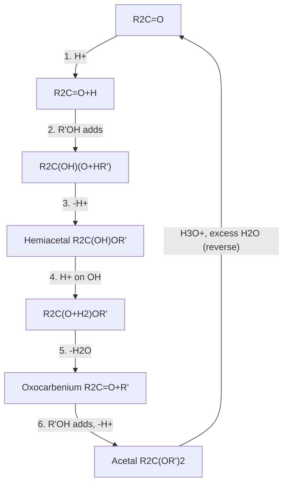
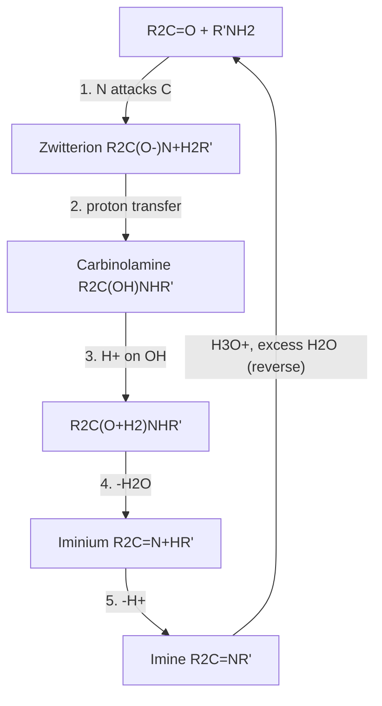

## Formation of Acetals and Imines

### Overview

Acetals (and ketals) and imines are the two classic condensation products of aldehydes and ketones. Both arise through **nucleophilic addition followed by loss of water**, but they differ in the nucleophile and in the type of intermediate that forms.

- **Acetals** form when a carbonyl compound reacts with two equivalents of an alcohol (or one equivalent of a diol) under acid catalysis. The nucleophile is oxygen, and the key intermediate is an **oxocarbenium ion**.
- **Imines** (Schiff bases) form when a carbonyl compound reacts with a primary amine. The nucleophile is nitrogen, and the key intermediate is an **iminium ion**.

Both reactions are reversible and both are controlled by removal or addition of water. Their practical importance is large: acetals serve as carbonyl protecting groups and as the linkage in carbohydrates and polymers, while imines are central to reductive amination, biochemical carbonyl chemistry (Schiff-base linkages in enzymes and vision), and the preparation of nitrogen heterocycles.

**Key Points**

- Both reactions follow the sequence: activation of carbonyl, nucleophilic addition, proton transfer, loss of water, second step (attack by second ROH, or deprotonation).
- Acetal formation needs **acid catalysis and water removal**; the acetal is **stable to base and nucleophiles** but **hydrolyzes in aqueous acid**.
- Imine formation is fastest in **mildly acidic solution (about pH 4–5)**, with a bell-shaped pH-rate profile.
- Secondary amines give **enamines** (when an α-hydrogen is present) rather than imines.
- Equilibrium position is dictated by Le Chatelier's principle: remove water to form, add excess water (with acid) to hydrolyze.

---

### Part 1: Acetal and Ketal Formation

#### 1.1 Terminology and Structure

| Term | General structure | Formed from | Notes |
| --- | --- | --- | --- |
| Hemiacetal | $R{-}CH(OH)(OR')$ | Aldehyde + 1 ROH | Generally unstable, except cyclic forms (sugars) |
| Hemiketal | $R_2C(OH)(OR')$ | Ketone + 1 ROH | Generally unstable, except cyclic forms |
| Acetal | $R{-}CH(OR')_2$ | Aldehyde + 2 ROH | Stable, isolable |
| Ketal | $R_2C(OR')_2$ | Ketone + 2 ROH | Stable, isolable |
| Cyclic acetal (1,3-dioxolane) | 5-membered ring, $O{-}CH_2CH_2{-}O$ | Carbonyl + ethylene glycol | Common protecting group |
| Cyclic acetal (1,3-dioxane) | 6-membered ring | Carbonyl + propane-1,3-diol | Common protecting group |

Current IUPAC recommendations use "acetal" as the generic term for both aldehyde-derived and ketone-derived compounds (ketal is retained in common usage). The carbon bearing two single-bonded oxygens is the **acetal carbon**.

#### 1.2 Overall Equation

$$R_2C{=}O + 2R'OH \underset{H_3O^+,\ excess\ H_2O}{\overset{H^+,\ -H_2O}{\rightleftharpoons}} R_2C(OR')_2 + H_2O$$

With ethylene glycol:

$$R_2C{=}O + HOCH_2CH_2OH \underset{H_3O^+}{\overset{TsOH,\ -H_2O}{\rightleftharpoons}} \text{1,3-dioxolane} + H_2O$$

#### 1.3 Why Acid Catalysis Is Required

Alcohols are weak nucleophiles, and a neutral carbonyl is only modestly electrophilic. Acid protonates the carbonyl oxygen, converting it to a much more electrophilic oxocarbenium-like species. A second acid-dependent step is needed to convert the hemiacetal hydroxyl (a poor leaving group, $HO^-$) into a good leaving group ($H_2O$). Under basic conditions, hemiacetals can form but cannot proceed to acetals, because there is no way to activate the $-OH$ for departure.

#### 1.4 Mechanism (Acid-Catalyzed, Six Steps)

1. **Protonation** of the carbonyl oxygen.
2. **Nucleophilic attack** by the first alcohol at the carbonyl carbon.
3. **Deprotonation** gives the neutral hemiacetal.
4. **Protonation** of the hemiacetal hydroxyl group.
5. **Loss of water** (assisted by the lone pair on the remaining alkoxy oxygen) gives a resonance-stabilized **oxocarbenium ion**.
6. **Attack by the second alcohol**, then **deprotonation** gives the acetal.

Every step is reversible. The mnemonic **PADPEAD** (Protonate, Add, Deprotonate, Protonate, Eliminate, Add, Deprotonate) is used by many students to remember the order.

Mechanism map (svg_diagram):

<svg xmlns="http://www.w3.org/2000/svg" viewBox="0 0 760 240" width="760" height="240" font-family="sans-serif" font-size="13">
<text x="380" y="20" text-anchor="middle" font-weight="bold">Acetal Formation Pathway (svg_diagram)</text>
<g fill="#eef" stroke="black" stroke-width="1.2">
<rect x="15" y="60" width="110" height="46" rx="6" />
<rect x="160" y="60" width="130" height="46" rx="6" />
<rect x="325" y="60" width="120" height="46" rx="6" />
<rect x="480" y="60" width="130" height="46" rx="6" />
<rect x="645" y="60" width="100" height="46" rx="6" />
</g>
<g text-anchor="middle">
<text x="70" y="88">Carbonyl</text>
<text x="225" y="88">Protonated C=O</text>
<text x="385" y="88">Hemiacetal</text>
<text x="545" y="88">Oxocarbenium</text>
<text x="695" y="88">Acetal</text>
</g>
<g stroke="black" stroke-width="1.5" fill="black">
<line x1="125" y1="83" x2="158" y2="83" />
<line x1="290" y1="83" x2="323" y2="83" />
<line x1="445" y1="83" x2="478" y2="83" />
<line x1="610" y1="83" x2="643" y2="83" />
</g>
<g text-anchor="middle" font-size="11">
<text x="142" y="55">+H⁺</text>
<text x="306" y="55">+R'OH</text>
<text x="462" y="55">+H⁺, −H₂O</text>
<text x="627" y="55">+R'OH, −H⁺</text>
</g>
<text x="380" y="150" text-anchor="middle" font-size="12">Forward: remove water (Dean–Stark, sieves, orthoformate)</text>
<text x="380" y="172" text-anchor="middle" font-size="12">Reverse: aqueous acid, excess water</text>
<text x="380" y="210" text-anchor="middle" font-size="12">Every step is reversible; the oxocarbenium ion is the key electrophilic intermediate</text>
</svg>

#### 1.5 Driving the Equilibrium

| Strategy | Mechanism of action | Example |
| --- | --- | --- |
| Dean–Stark trap | Azeotropic removal of water with toluene or benzene | Cyclohexanone + ethylene glycol, $TsOH$, toluene, reflux |
| Molecular sieves (3 Å or 4 Å) | Adsorb water | Acetal formation in dichloromethane or methanol |
| Trialkyl orthoformate ($HC(OR)_3$) | Chemically consumes water, giving ester + alcohol | $HC(OCH_3)_3 + H_2O \rightarrow HCOOCH_3 + 2CH_3OH$ |
| 2,2-Dimethoxypropane | Transacetalization; releases acetone and methanol | Acetonide formation from diols |
| Large excess of alcohol (solvent) | Mass action | Methanol as solvent for dimethyl acetals |

**Cyclic acetals** form more readily than acyclic ones because the ring closure is intramolecular after the first attack (an entropic advantage), so 1,3-dioxolanes and 1,3-dioxanes are the standard choices for protection. Five-membered rings form slightly faster for aldehydes and ketones alike, while 1,3-dioxanes can be thermodynamically favored in some cases (for example, from bulky or six-ring-locked substrates).

#### 1.6 Typical Catalysts

| Catalyst | Type | Notes |
| --- | --- | --- |
| $p$-Toluenesulfonic acid ($TsOH$) | Organic Brønsted acid | Most common; soluble in organic solvents |
| $H_2SO_4$, $HCl$ (gas), $CSA$ (camphorsulfonic acid) | Brønsted acid | Use catalytic amounts |
| Pyridinium $p$-toluenesulfonate (PPTS) | Mild acid | For acid-sensitive substrates |
| $BF_3 \cdot OEt_2$, $TMSOTf$, $Sc(OTf)_3$ | Lewis acids | Work at low temperature; used for hindered or sensitive carbonyls |
| Acidic resins (Amberlyst-15, Dowex 50) | Solid acid | Easily filtered off |

#### 1.7 Reactivity Trends

- Aldehydes form acetals faster and with more favorable equilibria than ketones. Ketalization of simple ketones with simple alcohols is often unfavorable at equilibrium (the tetrahedral ketal is sterically more crowded), so it usually requires water removal or a diol.
- Electron-rich aromatic aldehydes and conjugated carbonyls are less electrophilic and form acetals more slowly.
- α,β-Unsaturated carbonyls can protect selectively at the more electrophilic center under kinetic conditions (methods vary with substrate).

#### 1.8 Stability and Hydrolysis

| Condition | Acetal stability |
| --- | --- |
| Aqueous acid | **Labile** (hydrolyzes readily) |
| Aqueous or anhydrous base ($NaOH$, $NaOMe$, $t$-BuOK) | Stable |
| Organometallics ($RMgX$, $RLi$, $R_2CuLi$) | Stable |
| Hydrides ($LiAlH_4$, $NaBH_4$, $DIBAL$) | Stable |
| Catalytic hydrogenation | Stable |
| Oxidants ($PCC$, $CrO_3$ under non-acidic conditions, $KMnO_4$ under neutral conditions) | Generally stable |
| Nucleophiles (amines, enolates, cyanide) | Stable |

**Hydrolysis** is the microscopic reverse of formation: protonation of an alkoxy oxygen, loss of alcohol to form the oxocarbenium ion (rate-determining, favored by electron-donating groups on carbon), addition of water, and loss of the second alcohol. Rates vary greatly with structure:

- Ketals hydrolyze much faster than aldehyde acetals, since the oxocarbenium ion from a ketone is more stabilized by two alkyl groups.
- Acetals derived from conjugated aldehydes hydrolyze slowly; electron-withdrawing groups slow hydrolysis.
- Five-membered dioxolanes hydrolyze differently from six-membered dioxanes, and the relative rates depend on substituents.

#### 1.9 Acetals as Protecting Groups

The general protecting-group strategy is:

**Example: selective Grignard addition to an ester in the presence of a ketone**

Target: convert methyl 4-oxopentanoate into a diol-containing tertiary alcohol without touching the ketone.

1. Protect the ketone: ethylene glycol, $TsOH$, toluene, Dean–Stark.
2. Grignard: 2 equiv $CH_3MgBr$ converts the ester to a tertiary alcohol.
3. Deprotect: $H_3O^+$ regenerates the ketone (a hydroxy ketone product).

Without step 1, the Grignard reagent would add to the ketone as well.

**Chemoselective protection.** Aldehydes can often be protected in the presence of ketones, because they react faster with alcohols; conversely, ketones can be protected selectively using specific methods (for example, with 1,2-bis(trimethylsiloxy)ethane and $TMSOTf$) even in the presence of aldehydes for certain substrates. Outcomes depend on the substrate and conditions.

#### 1.10 Special Types of Acetals

| Type | Structure or origin | Use |
| --- | --- | --- |
| **Acetonide** (isopropylidene) | Diol + acetone or 2,2-dimethoxypropane, $H^+$ | Protects 1,2- and 1,3-diols (sugars, glycerol) |
| **Benzylidene acetal** | Diol + benzaldehyde or $PhCH(OMe)_2$ | Protects 4,6-diols of hexopyranosides; can be opened regioselectively (for example, $DIBAL$, $NaBH_3CN/HCl$) |
| **Methoxymethyl (MOM) ether** | $ROCH_2OCH_3$ | Alcohol protection (an acetal of formaldehyde) |
| **Tetrahydropyranyl (THP) ether** | Alcohol + dihydropyran, $H^+$ | Alcohol protection; a mixed acetal, creates a new stereocenter |
| **Glycosides** | Sugar hemiacetal + ROH, $H^+$ | Carbohydrate linkages, natural product glycosides |
| **Orthoesters** | $RC(OR')_3$ | Precursors and water scavengers |
| **Thioacetals (dithioacetals)** | $R_2C(SR')_2$ | Acid-stable protecting group; Corey–Seebach umpolung; Raney Ni desulfurization |

**Glycosides and biological acetals.** In carbohydrates, the anomeric carbon is a hemiacetal carbon that becomes an acetal upon reaction with an alcohol or another sugar's hydroxyl. The α- and β-glycosidic linkages of disaccharides and polysaccharides (sucrose, lactose, cellulose, starch) are acetal linkages, which are stable to base and cleaved by aqueous acid or specific glycosidases. Polymers such as polyoxymethylene (Delrin, $-(CH_2O)_n-$) and polyvinyl butyral are also acetal-based.

#### 1.11 Formation from Other Precursors

- **From enol ethers.** Acid-catalyzed addition of $ROH$ to vinyl ethers gives mixed acetals (the THP formation route).
- **From alkynes.** Hydration of alkynes in alcohol with mercury(II) or gold catalysts can lead to ketals.
- **Transacetalization.** An existing acetal exchanges alcohol groups with another alcohol or diol under acid catalysis, useful when direct condensation is inconvenient.
- **From gem-dihalides.** $RCHCl_2 + 2NaOR' \rightarrow RCH(OR')_2 + 2NaCl$ (Williamson-type route; limited use).

---

### Part 2: Imine Formation

#### 2.1 Overview and Classification

An **imine** contains the $C{=}N$ functional group ($R_2C{=}NR'$). The traditional name **Schiff base** is used for imines derived from aromatic aldehydes (or ketones) and primary amines with N-alkyl or N-aryl substituents.

| Nitrogen nucleophile | Product | Type |
| --- | --- | --- |
| $NH_3$ | $R_2C{=}NH$ | Primary imine (unstable; often trimerizes or polymerizes) |
| $R'NH_2$ | $R_2C{=}NR'$ | Imine (Schiff base) |
| $R'NH_2$ where $R'$ = aryl | $R_2C{=}NAr$ | N-Aryl imine (anil), more stable by conjugation |
| $NH_2OH$ | $R_2C{=}NOH$ | Oxime |
| $NH_2NH_2$ | $R_2C{=}NNH_2$ | Hydrazone |
| $NH_2NHAr$ | $R_2C{=}NNHAr$ | Arylhydrazone |
| $NH_2NHCONH_2$ | $R_2C{=}NNHCONH_2$ | Semicarbazone |
| $R'_2NH$ (with $\alpha$-H) | $R{-}C(NR'_2){=}CHR''$ | **Enamine** (iminium lost an $\alpha$-H) |

Oximes, hydrazones, and semicarbazones are formed by the same mechanism and are generally **more stable toward hydrolysis** than simple imines, because the adjacent heteroatom (O or N) donates electron density into the $C{=}N$ bond and stabilizes it.

#### 2.2 Overall Equation

$$R_2C{=}O + R'NH_2 \underset{H_3O^+}{\overset{-H_2O}{\rightleftharpoons}} R_2C{=}NR' + H_2O$$

#### 2.3 Mechanism (Acid-Catalyzed)

Imine formation has two major phases, **addition** (to give the carbinolamine) and **elimination** (loss of water).

1. **Nucleophilic attack** of the neutral amine on the carbonyl carbon, forming a zwitterionic tetrahedral intermediate (often concerted with proton transfer).
2. **Proton transfer** gives the neutral **carbinolamine** (hemiaminal), $R_2C(OH)NHR'$.
3. **Protonation of the carbinolamine hydroxyl** converts it into a good leaving group.
4. **Loss of water**, pushed by the nitrogen lone pair, gives the **iminium ion**, $R_2C{=}N^+HR'$.
5. **Deprotonation** of nitrogen gives the neutral imine.

Structural comparison of the acetal and imine pathways (svg_diagram):

<svg xmlns="http://www.w3.org/2000/svg" viewBox="0 0 760 260" width="760" height="260" font-family="sans-serif" font-size="13">
<text x="380" y="20" text-anchor="middle" font-weight="bold">Acetal vs Imine Formation (svg_diagram)</text>
<text x="20" y="70" font-weight="bold">Acetal:</text>
<text x="90" y="70">C=O</text>
<text x="140" y="70">→ hemiacetal → oxocarbenium ion → acetal (two O–C bonds, no C=X left)</text>
<text x="20" y="120" font-weight="bold">Imine:</text>
<text x="90" y="120">C=O</text>
<text x="140" y="120">→ carbinolamine → iminium ion → imine (C=N retained after loss of H₂O)</text>
<text x="20" y="175" font-weight="bold">Common:</text>
<text x="90" y="175">1) activate C=O 2) add nucleophile 3) proton transfer 4) lose H₂O 5) finish</text>
<text x="20" y="215" font-weight="bold">Difference:</text>
<text x="105" y="215">the second alcohol adds to C (acetal); the N–H proton is lost instead (imine)</text>
</svg>

#### 2.4 The pH-Rate Profile

The rate of imine formation is a **bell-shaped function of pH** with a maximum typically around **pH 4–5** (the exact optimum depends on the $pK_a$ of the amine's conjugate acid and on the carbonyl).

| Region | Limiting factor | Explanation |
| --- | --- | --- |
| Low pH (< ~3) | Attack step | Most of the amine is protonated ($R'NH_3^+$) and is not nucleophilic |
| Optimum (~4–5) | Balanced | Enough free amine to attack, enough acid to protonate the carbinolamine |
| High pH (> ~7) | Dehydration step | Insufficient acid to convert the carbinolamine $-OH$ into a leaving group |

The rate-determining step **changes** across the pH range: dehydration of the carbinolamine at neutral-to-basic pH, and amine attack at acidic pH. This change in rate-determining step is a classic example in physical organic chemistry (Jencks' studies of semicarbazone formation). Aryl amines ($pK_a$ of the ammonium about 4–5) have their optimum shifted toward lower pH than alkyl amines ($pK_a$ about 10–11), and reactions with weakly basic nucleophiles like semicarbazide ($pK_a$ about 3.7) work well at lower pH.

**Catalysis by nucleophilic amines.** Aniline and related aromatic amines accelerate hydrazone and oxime formation at neutral pH by forming a more reactive iminium intermediate that undergoes rapid transimination (widely used in bioconjugation).

#### 2.5 Driving the Equilibrium

Imine formation is reversible, and simple imines hydrolyze easily in water. Strategies:

| Strategy | Notes |
| --- | --- |
| Dean–Stark trap with toluene | Standard for ketimines and aryl imines |
| Molecular sieves (4 Å) | Common at room temperature in $CH_2Cl_2$ or toluene |
| Drying agents ($MgSO_4$, $Na_2SO_4$) | Used with aldehyde-derived imines |
| Lewis acids ($TiCl_4$, $Ti(OEt)_4$, $ZnCl_2$) | Activate carbonyl and scavenge water; useful for hindered ketones |
| Acid catalysts ($TsOH$, $AcOH$) | Catalytic; avoid excess, which protonates the amine |
| Removal of the imine by precipitation or crystallization | Le Chatelier |

Aldehydes react faster and give more stable imines than ketones. Imines derived from **aromatic aldehydes and aromatic amines** are the most stable (extended conjugation) and are often isolable by crystallization; imines from **enolizable aliphatic aldehydes** can tautomerize to enamines or undergo aldol-type side reactions.

#### 2.6 Imine Hydrolysis

Hydrolysis is the reverse of formation and is promoted by aqueous acid:

$$R_2C{=}NR' + H_2O \xrightarrow{H_3O^+} R_2C{=}O + R'NH_3^+$$

The mechanism proceeds through protonation of nitrogen, attack of water on the iminium carbon, proton transfers, and loss of the amine. This step is exploited to unmask carbonyl compounds after using imines or enamines as synthetic intermediates.

#### 2.7 Stereochemistry of Imines

- The $C{=}N$ bond is planar, and unsymmetrical imines can exist as **E and Z isomers**. The **lone pair on nitrogen** counts as the lowest-priority group in CIP assignment.
- Interconversion of $E/Z$ isomers occurs by **nitrogen inversion** (in-plane lateral shift) or by rotation through an iminium/enamine tautomer; barriers are much lower than for $C{=}C$ bonds (roughly 20–25 kcal/mol for N-alkyl imines; values vary), so isomers often equilibrate at room temperature.
- **Oximes** are configurationally more stable (higher barrier) and their $E/Z$ isomers can often be isolated; this matters for the **Beckmann rearrangement**, where the group *anti* to the departing $-OH$ migrates.
- Imines derived from prochiral ketones and chiral amines (for example, $\alpha$-methylbenzylamine, Ellman's *tert*-butanesulfinamide) undergo diastereoselective nucleophilic additions and reductions, a standard route to enantiopure amines.

#### 2.8 Enamine Formation from Secondary Amines

A secondary amine adds to the carbonyl, and after dehydration it forms an **iminium ion** that carries no N–H proton. If the carbonyl has an $\alpha$-hydrogen, the iminium loses it to form a neutral **enamine**:

$$R{-}CO{-}CH_2R' + R''_2NH \xrightarrow{H^+,\ -H_2O} R{-}C(NR''_2){=}CHR' \quad (\text{enamine})$$

Common secondary amines: pyrrolidine (most reactive), morpholine, piperidine, and proline (in organocatalysis).

- Enamines are **carbon nucleophiles** (the $\beta$-carbon is nucleophilic through nitrogen lone-pair donation), reacting with alkyl halides, acyl halides, and Michael acceptors (**Stork enamine synthesis**), and giving the $\alpha$-substituted carbonyl after aqueous hydrolysis.
- In **enamine catalysis**, chiral secondary amines such as proline or MacMillan and Jørgensen–Hayashi catalysts convert aldehydes into nucleophilic enamines, enabling asymmetric $\alpha$-functionalizations and aldol reactions.
- The complementary **iminium catalysis** activates $\alpha,\beta$-unsaturated aldehydes toward nucleophilic conjugate addition by lowering the LUMO.

#### 2.9 Reactions of Imines (Reductive Amination)

**Reductive amination** converts a carbonyl and an amine into a new amine without isolating the imine:

$$R_2C{=}O + R'NH_2 \xrightarrow{NaBH_3CN\ or\ NaBH(OAc)_3,\ pH\ \sim 4\text{–}6} R_2CH{-}NHR'$$

- $NaBH_3CN$ and $NaBH(OAc)_3$ reduce iminium ions faster than carbonyl compounds at mildly acidic pH, so the carbonyl survives long enough to condense.
- $NaBH_4$ can be used stepwise (form the imine first, then reduce), because it also reduces aldehydes and ketones.
- Catalytic hydrogenation ($H_2$, Pd/C, Raney Ni) is used industrially.
- Reaction with ammonia, primary amines, and secondary amines gives primary, secondary, and tertiary amines, respectively, and avoids the over-alkylation problem of direct $S_N2$ alkylation of amines.

Other transformations: addition of Grignard or organolithium reagents to imines gives amines; the **Mannich reaction** adds an enol or enolate to an iminium ion; **Strecker synthesis** adds cyanide to an imine to give an $\alpha$-aminonitrile (then hydrolysis gives an $\alpha$-amino acid); **aza-Diels–Alder** reactions use imines as dienophiles.

---

### Part 3: Comparison of Acetal and Imine Formation

| Feature | Acetal/ketal formation | Imine formation |
| --- | --- | --- |
| Nucleophile | $ROH$ (two equivalents) or diol | $R'NH_2$ (one equivalent) |
| Key electrophilic intermediate | Oxocarbenium ion | Iminium ion |
| Final product retains a $C{=}X$? | No (two $C{-}O$ single bonds) | Yes ($C{=}N$) |
| Catalyst | Strong acid ($TsOH$, $H_2SO_4$) or Lewis acid; anhydrous | Mild acid, optimum near pH 4–5; strong acid inhibits |
| Role of water | Must be removed; excess water hydrolyzes | Must be removed; excess water hydrolyzes |
| Base stability of product | Stable | Moderately stable; hydrolyzes in water |
| Acid stability of product | Hydrolyzes in aqueous acid | Hydrolyzes in aqueous acid |
| Ketone reactivity | Unfavorable equilibrium with simple ROH | Slower than aldehydes; needs water removal |
| Main synthetic role | Protecting group; glycosides | Reductive amination; C–N bond formation; enamine catalysis |

**Why the pH-rate profile differs.** Alcohols do not become protonated to a non-nucleophilic form at moderately acidic pH the way amines do, so alcohol nucleophiles tolerate (indeed require) strongly acidic conditions. Amines are basic enough that strong acid removes the nucleophile from solution, so a compromise pH is needed.

---

### Part 4: Worked Examples

**Example 1: Predict the product of acetalization**

Cyclohexanone + ethylene glycol, catalytic $TsOH$, toluene, reflux with Dean–Stark trap.

- The diol adds to the protonated carbonyl to form a hemiketal, loses water to form the oxocarbenium ion, and closes to the five-membered ring.
- Product: 1,4-dioxaspiro[4.5]decane (the ethylene ketal of cyclohexanone).

**Output:** spirocyclic ketal plus water collected in the trap.

**Example 2: Predict the product of imine formation**

Benzaldehyde + methylamine, molecular sieves, $CH_2Cl_2$.

- Product: $C_6H_5CH{=}NCH_3$, (E)-N-benzylidenemethanamine, formed as the E isomer as the major stereoisomer (the phenyl and methyl groups trans across $C{=}N$).

**Example 3: Choose conditions for hydrolysis**

Recover the aldehyde from its diethyl acetal.

- Stir with aqueous $HCl$ (dilute) in THF or acetone, room temperature. Excess water and acid drive the equilibrium to the carbonyl.
- For acid-sensitive substrates, use mild deprotection such as PPTS in wet acetone or $CeCl_3 \cdot 7H_2O/NaI$, or transacetalization with acetone.

**Example 4: Explain why a reaction at pH 1 is slow**

Aniline + benzaldehyde in 1 M $HCl$.

- Anilinium ion ($pK_a$ about 4.6) is almost completely protonated, so the free amine concentration is around $10^{-4}$ of the total or less, and the nucleophilic attack becomes rate-limiting. Adjust to pH 4–5 (acetate buffer) to speed the reaction.

**Example 5: Planning a selective transformation**

Convert 4-oxopentanal ($CH_3COCH_2CH_2CHO$) selectively at the aldehyde using a reductive amination with benzylamine, leaving the ketone intact.

- Aldehydes condense with amines much faster than ketones; mild conditions (1 equiv $BnNH_2$, $NaBH(OAc)_3$, dichloroethane, acetic acid) give the secondary amine at the aldehyde carbon.
- Selectivity depends on stoichiometry and conditions; intramolecular reactions to form cyclic products (a 1,4-dicarbonyl with a primary amine can form pyrrole derivatives via the Paal–Knorr synthesis) may compete under other conditions.

**Example 6: Distinguish a hemiacetal, acetal, and imine by IR and NMR**

| Feature | Hemiacetal | Acetal | Imine |
| --- | --- | --- | --- |
| IR | Broad O–H (~3400 cm⁻¹), no C=O | No O–H, no C=O; strong C–O at ~1050–1150 cm⁻¹ | C=N stretch ~1640–1690 cm⁻¹; no C=O |
| $^1H$ NMR | Acetal-type C–H (δ ~4.5–5.5), O–H exchangeable | Acetal C–H at δ ~4.5–5.5 (aldehyde-derived) | Aldimine C–H at δ ~8–8.5 |
| $^{13}C$ NMR | C(OH)(OR) at δ ~90–105 | Acetal carbon at δ ~95–110 | C=N at δ ~155–165 |

Ranges are typical and shift with substitution and solvent.

**Example 7: Enamine alkylation (Stork)**

Convert cyclohexanone into 2-methylcyclohexanone.

1. Cyclohexanone + pyrrolidine, $TsOH$, toluene, Dean–Stark gives the enamine.
2. Enamine + $CH_3I$ alkylates at carbon, giving an iminium salt.
3. $H_3O^+$ hydrolyzes the iminium to 2-methylcyclohexanone.

The method avoids the polyalkylation and regiochemical problems of direct enolate alkylation.

---

### Part 5: Common Pitfalls

- Using too much acid in imine formation; protonating the amine shuts down the nucleophilic step.
- Failing to remove water in either reaction; the equilibrium sits on the carbonyl side, especially for ketones.
- Attempting to deprotect an acetal in the presence of another acid-labile group without choosing selective conditions.
- Expecting a stable, isolable acyclic hemiacetal; only cyclic hemiacetals (sugars) are typically isolable.
- Drawing an imine from a secondary amine; secondary amines give enamines (or iminium salts), not neutral imines.
- Ignoring that aldehyde-derived imines with $\alpha$-hydrogens can tautomerize to enamines and undergo self-condensation (aza-aldol) on standing.
- Chromatography of simple imines on silica can cause hydrolysis; use deactivated silica or neutral alumina, or use the crude material directly.

**Conclusion**

Acetals and imines are both products of a nucleophilic-addition/dehydration sequence at the carbonyl carbon. The mechanistic sequences are parallel, but oxygen nucleophiles require strongly acidic, anhydrous conditions and give products that are excellent protecting groups (stable to base, cleaved by aqueous acid), whereas nitrogen nucleophiles require mildly acidic conditions (pH about 4–5) and give $C{=}N$ products that serve as intermediates for reductive amination, enamine chemistry, and asymmetric synthesis. Mastery of the equilibria (water removal to form, water and acid to cleave), the identity of the key cationic intermediates (oxocarbenium versus iminium), and the pH dependence of amine condensation allows prediction and control of both reaction families.

**Related Topics**

- Hemiacetals, glycosides, and anomeric chemistry in carbohydrates
- Protecting-group strategy and orthogonal deprotection
- Reductive amination and its variants (Leuckart–Wallach, Eschweiler–Clarke)
- Enamine and iminium organocatalysis (proline, MacMillan, Jørgensen–Hayashi catalysts)
- Mannich, Strecker, and aza-Diels–Alder reactions of imines
- Oximes, Beckmann rearrangement, and hydrazones (Wolff–Kishner, Fischer indole synthesis)
- Ellman sulfinimines and asymmetric amine synthesis
- Thioacetals and umpolung (Corey–Seebach)
- Dynamic covalent chemistry with imines and acetals (covalent organic frameworks, self-healing materials)
- Schiff-base ligands and coordination chemistry (salen complexes)