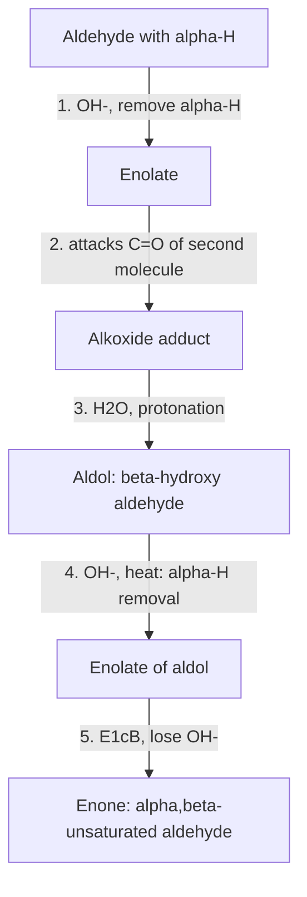
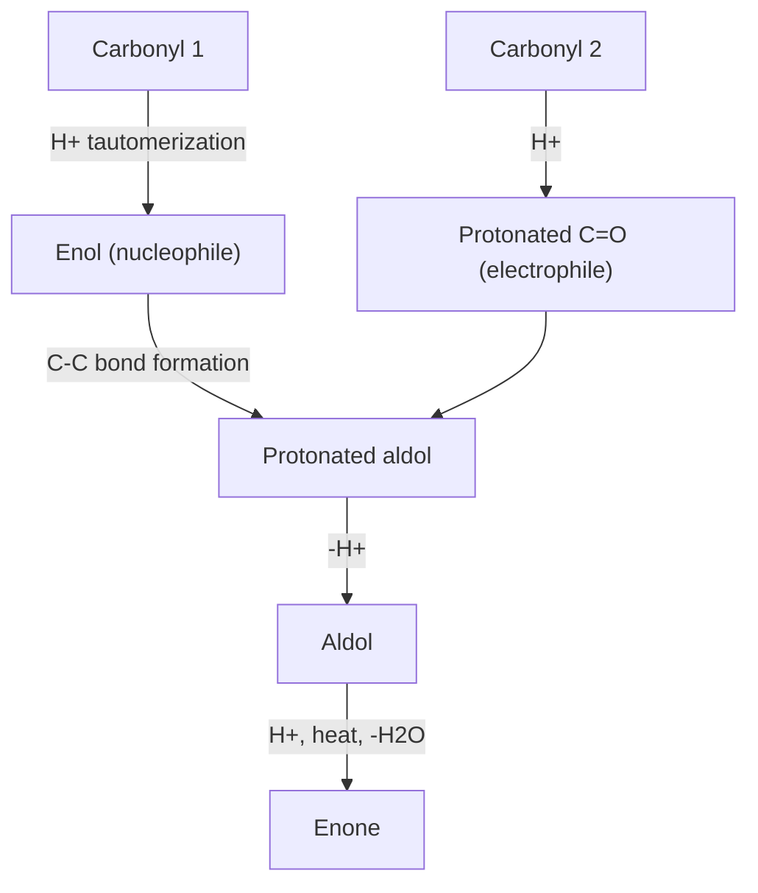
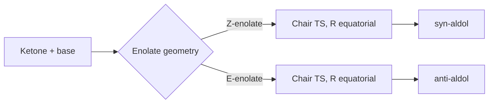

## Aldol Condensation

### Overview

The aldol reaction is a carbon–carbon bond-forming reaction in which an **enol or enolate** of one carbonyl compound (the nucleophile, the *donor*) adds to the carbonyl group of a second molecule (the electrophile, the *acceptor*). The initial product is a **β-hydroxy aldehyde or ketone** (an *aldol*, from *ald*ehyde + alcoh*ol*). When this adduct loses water to form an **α,β-unsaturated carbonyl compound (an enone)**, the overall sequence is called the **aldol condensation**.

$$2\,RCH_2CHO \xrightarrow{\text{base or acid}} RCH_2CH(OH)CH(R)CHO \xrightarrow{-H_2O} RCH_2CH{=}C(R)CHO$$

The reaction is central to synthesis (it builds carbon skeletons and sets up to two new stereocenters), to biochemistry (aldolase enzymes in glycolysis and gluconeogenesis), and to industry (production of 2-ethylhexanol, pentaerythritol, and many fragrance and pharmaceutical intermediates).

**Key Points**

- Two distinct steps: **aldol addition** (C–C bond formation, gives β-hydroxycarbonyl) and **dehydration** (E1cB under base, gives conjugated enone).
- The nucleophile is an **enolate** (base catalysis) or **enol** (acid catalysis) formed from a carbonyl compound bearing an **α-hydrogen**.
- The electrophile is the carbonyl carbon of a second carbonyl molecule; aldehydes are better electrophiles than ketones.
- Addition is **reversible** (retro-aldol); dehydration is driven by conjugation and is often the thermodynamic sink.
- **Crossed (mixed) aldol** reactions give mixtures unless one partner cannot enolize (no α-H) or unless a preformed enolate (for example, LDA) is used.
- Intramolecular aldol reactions form five- and six-membered rings preferentially (Robinson annulation, Wieland–Miescher ketone).

---

### Part 1: Prerequisites: Enolization and α-Acidity

#### 1.1 Acidity of the α-Hydrogen

The α-hydrogens (on the carbon adjacent to $C{=}O$) are unusually acidic for C–H bonds because the conjugate base, the **enolate**, is resonance-stabilized with the charge shared between carbon and oxygen.

$$R{-}CO{-}CH_2R' + B^- \rightleftharpoons \left[R{-}CO{-}\overset{-}{C}HR' \longleftrightarrow R{-}C(O^-){=}CHR'\right] + BH$$

| Compound class | Approximate $pK_a$ (α-H) |
| --- | --- |
| Alkane C–H | ~50 |
| Ester | ~25 |
| Ketone (acetone) | ~19–20 |
| Aldehyde (acetaldehyde) | ~17 |
| β-Diketone ($CH_3COCH_2COCH_3$) | ~9 |
| β-Ketoester (ethyl acetoacetate) | ~11 |
| Malonic ester | ~13 |
| Water | 15.7 |
| Ethanol | ~16 |

Values are approximate and vary with solvent and source. Because hydroxide and alkoxides ($pK_a$ of conjugate acid ~15–16) are similar in strength to the α-hydrogens of aldehydes and ketones, **only a small equilibrium fraction of enolate** forms in aqueous $NaOH$ or ethoxide/ethanol, but it is enough for the reaction to proceed.

#### 1.2 Enolate Formation: Bases and Conditions

| Base/conditions | Extent of enolate formation | Typical use |
| --- | --- | --- |
| $NaOH$, $KOH$, $NaOEt$ (protic solvent) | Small equilibrium fraction | Classical aldol condensations, Claisen–Schmidt |
| $NaH$, $KH$ (aprotic) | Essentially complete but slow, can equilibrate | Thermodynamic enolates |
| **$LDA$** (lithium diisopropylamide), THF, −78 °C | **Quantitative** and fast (base $pK_a$ of conjugate acid ~36) | **Kinetic** enolates for directed aldol reactions |
| $LiHMDS$, $NaHMDS$, $KHMDS$ | Quantitative | Kinetic enolates; tunable aggregation and $E/Z$ ratio |
| $Bu_2BOTf$ + $i$-$Pr_2NEt$ | Boron enolates (soft enolization) | Stereoselective (Evans) aldol reactions |
| $TMSCl$/$Et_3N$ or $TMSOTf$ | Silyl enol ethers | Mukaiyama aldol (Lewis-acid promoted) |

**Kinetic versus thermodynamic enolates (unsymmetrical ketones):**

| Feature | Kinetic enolate | Thermodynamic enolate |
| --- | --- | --- |
| Position of deprotonation | Less substituted α-carbon | More substituted α-carbon |
| Conditions | LDA, THF, −78 °C, short times, irreversible | $NaH$ or $NaOEt$, higher temperature, protic conditions allowing equilibration |
| Selectivity origin | Fastest proton removal (less hindered) | Most stable (more substituted) alkene |

#### 1.3 Requirement for α-Hydrogens

A carbonyl compound with **no α-hydrogens** cannot form an enolate and can act only as an electrophile. Common non-enolizable partners: formaldehyde ($HCHO$), benzaldehyde ($C_6H_5CHO$), other aromatic aldehydes, pivaldehyde ($(CH_3)_3CCHO$), and benzophenone. This is the basis for **crossed aldol** control (Part 5).

---

### Part 2: Base-Catalyzed Aldol Addition and Condensation

#### 2.1 Mechanism (Aldehyde Example: Acetaldehyde)

**Step 1: Enolate formation.** Hydroxide removes an α-proton.

$$CH_3CHO + OH^- \rightleftharpoons \left[{}^-CH_2CHO \leftrightarrow CH_2{=}CH{-}O^-\right] + H_2O$$

**Step 2: Nucleophilic addition.** The α-carbon of the enolate attacks the carbonyl carbon of a second acetaldehyde molecule, giving an alkoxide.

$$CH_3CHO + {}^-CH_2CHO \rightarrow CH_3CH(O^-)CH_2CHO$$

**Step 3: Protonation.** The alkoxide takes a proton from water, regenerating hydroxide (catalytic in base).

$$CH_3CH(O^-)CH_2CHO + H_2O \rightarrow CH_3CH(OH)CH_2CHO + OH^-$$

The product, 3-hydroxybutanal (**aldol**; acetaldol), is the classic β-hydroxy aldehyde.

**Step 4 (condensation): Dehydration via E1cB.** Under heating or stronger base, a second α-deprotonation gives an enolate that expels hydroxide from the β-carbon.

$$CH_3CH(OH)CH_2CHO \xrightarrow{OH^-,\ \Delta} CH_3CH{=}CHCHO + H_2O$$

The product is (2E)-but-2-enal (crotonaldehyde). The driving force is formation of a **conjugated** $C{=}C{-}C{=}O$ system, and often loss of water also renders the overall process irreversible.

Mechanism schematic (svg_diagram):

<svg xmlns="http://www.w3.org/2000/svg" viewBox="0 0 780 250" width="780" height="250" font-family="sans-serif" font-size="13">
<text x="390" y="20" text-anchor="middle" font-weight="bold">Base-Catalyzed Aldol Condensation (svg_diagram)</text>
<g fill="#eef" stroke="black" stroke-width="1.2">
<rect x="10" y="55" width="110" height="44" rx="6" />
<rect x="160" y="55" width="110" height="44" rx="6" />
<rect x="310" y="55" width="140" height="44" rx="6" />
<rect x="490" y="55" width="120" height="44" rx="6" />
<rect x="650" y="55" width="120" height="44" rx="6" />
</g>
<g text-anchor="middle">
<text x="65" y="82">R-CH2-CHO</text>
<text x="215" y="82">Enolate</text>
<text x="380" y="82">Alkoxide adduct</text>
<text x="550" y="82">Aldol (β-OH)</text>
<text x="710" y="82">Enone</text>
</g>
<g stroke="black" stroke-width="1.5">
<line x1="120" y1="77" x2="158" y2="77" />
<line x1="270" y1="77" x2="308" y2="77" />
<line x1="450" y1="77" x2="488" y2="77" />
<line x1="610" y1="77" x2="648" y2="77" />
</g>
<g text-anchor="middle" font-size="11">
<text x="139" y="50">OH⁻</text>
<text x="289" y="50">+ RCH2CHO</text>
<text x="469" y="50">H2O</text>
<text x="629" y="50">OH⁻, Δ, −H2O</text>
</g>
<text x="390" y="150" text-anchor="middle" font-size="12">Addition (steps 1–3) is reversible (retro-aldol); dehydration (E1cB) is driven by conjugation</text>
<text x="390" y="175" text-anchor="middle" font-size="12">Low temperature favors the aldol; heating favors the condensation product</text>
<text x="390" y="215" text-anchor="middle" font-size="12">New C–C bond forms between the α-carbon of one molecule and the carbonyl carbon of the other</text>
</svg>

#### 2.2 Ketone Example: Self-Condensation of Acetone

Ketone aldol additions are **thermodynamically less favorable** than aldehyde additions (steric crowding in the tertiary alkoxide, and loss of a stabilized ketone carbonyl). Equilibrium for acetone → diacetone alcohol lies on the side of acetone (about 5–10% aldol at equilibrium at room temperature; values vary). The reaction can be pushed by continuously removing the product (Soxhlet extraction over solid $Ba(OH)_2$ or $Ca(OH)_2$):

$$2\,CH_3COCH_3 \underset{}{\overset{Ba(OH)_2}{\rightleftharpoons}} (CH_3)_2C(OH)CH_2COCH_3 \quad (\text{diacetone alcohol, 4-hydroxy-4-methylpentan-2-one})$$

Dehydration gives mesityl oxide, 4-methylpent-3-en-2-one:

$$(CH_3)_2C(OH)CH_2COCH_3 \xrightarrow{H^+\ or\ OH^-,\ \Delta} (CH_3)_2C{=}CHCOCH_3 + H_2O$$

#### 2.3 Equilibrium and Reversibility

- **Aldol addition** is reversible. The reverse reaction, the **retro-aldol**, proceeds by alkoxide formation followed by C–C cleavage to regenerate enolate plus carbonyl. It is important in glycolysis (fructose-1,6-bisphosphate aldolase cleaves fructose 1,6-bisphosphate to dihydroxyacetone phosphate and glyceraldehyde 3-phosphate).
- For aldehydes with two α-hydrogens the addition equilibrium often favors the aldol at low temperature.
- For ketones and for aldehydes with only one α-hydrogen (where the aldol product is more crowded), equilibrium is less favorable.
- **Dehydration** converts the aldol into a stabilized conjugated enone and loss of water shifts the equilibrium, so heating a mixture that would otherwise stall at the aldol stage generally pulls the reaction to the condensation product.

| Conditions | Typical outcome |
| --- | --- |
| Dilute $NaOH$ (~5–10%), cold (0–5 °C) | Aldol (β-hydroxy carbonyl) isolable, especially from aldehydes |
| Concentrated base, heat (50–100 °C) | α,β-Unsaturated carbonyl (condensation) |
| Acid, heat | Usually condensation directly (enol pathway; dehydration facile) |

#### 2.4 E1cB Dehydration Detail

The dehydration proceeds through an **E1cB** (elimination unimolecular conjugate base) mechanism: the enolate forms first (fast, reversible), then hydroxide leaves from the β-carbon in the rate-determining step. Hydroxide is normally a poor leaving group, but the adjacent anionic center (enolate) pushes it out. This is why β-hydroxycarbonyls dehydrate readily even under mildly basic conditions, whereas ordinary alcohols do not eliminate under base.

$$\underset{\text{aldol}}{R{-}CH(OH){-}CH_2{-}CHO} \xrightarrow{OH^-} \left[R{-}CH(OH){-}\overset{-}{C}H{-}CHO\right] \xrightarrow{-OH^-} R{-}CH{=}CH{-}CHO$$

The **E** (trans) alkene is generally favored for steric reasons.

---

### Part 3: Acid-Catalyzed Aldol Reaction

Under acid conditions the **nucleophile is an enol** and the **electrophile is a protonated carbonyl**.

1. Protonation of the carbonyl oxygen activates the electrophile ($R_2C{=}OH^+$).
2. **Enolization** of another molecule (acid-catalyzed tautomerization) gives the enol.
3. The enol's β-carbon (the α-carbon of the original carbonyl) attacks the protonated carbonyl.
4. Deprotonation gives the β-hydroxycarbonyl (aldol).
5. Under acid, dehydration typically follows readily (protonation of the β-OH, loss of water via an E1-like pathway assisted by enol formation), so the condensation product is often isolated directly.

| Feature | Base catalysis | Acid catalysis |
| --- | --- | --- |
| Active nucleophile | Enolate (charged) | Enol (neutral) |
| Active electrophile | Neutral carbonyl | Protonated carbonyl |
| Catalyst regenerated by | Protonation of alkoxide | Deprotonation |
| Dehydration | Requires heat or second enolization | Facile, often spontaneous |
| Control | Preferred for directed/stereoselective work | Less selective; more side reactions (polymerization) |

---

### Part 4: Self-Condensation and Regiochemistry

- **Self-aldol:** both partners are the same carbonyl compound. Acetaldehyde gives crotonaldehyde; propanal gives 2-methylpent-2-enal; butanal gives 2-ethylhex-2-enal (industrial precursor to 2-ethylhexanol, used for plasticizers).

$$2\,CH_3CH_2CH_2CHO \xrightarrow{NaOH,\ \Delta} CH_3CH_2CH_2CH{=}C(CH_2CH_3)CHO \xrightarrow{H_2,\ cat.} \text{2-ethylhexanol}$$

- **Aldehyde with a single α-hydrogen** (for example, 2-methylpropanal): the aldol adduct forms but cannot dehydrate by the normal E1cB route because the α-carbon that would carry the negative charge has no remaining hydrogen; the product is isolated as the aldol (for example, 3-hydroxy-2,2,4-trimethylpentanal, in this case).
- **Ketones with two different α-carbons** give regioisomeric enolates; use LDA (kinetic) versus alkoxide (thermodynamic) to choose.

---

### Part 5: Crossed (Mixed) Aldol Reactions

A mixture of two enolizable carbonyl compounds under base gives up to **four products** (two self-aldols and two cross-aldols), and each may be further subject to dehydration or stereoisomerism. Practical strategies to make crossed aldols useful:

| Strategy | Principle | Example |
| --- | --- | --- |
| Use a **non-enolizable aldehyde** as the electrophile | Only one enolate can form; the aromatic aldehyde is also more electrophilic | Benzaldehyde + acetone |
| Add the enolizable partner **slowly** to a mixture of base and the non-enolizable partner | Keeps the concentration of the enolizable component low, minimizing self-condensation | Claisen–Schmidt |
| **Preform** a quantitative enolate with LDA, then add the electrophile | Complete control over which partner is the nucleophile ("directed aldol") | Kinetic ketone enolate + aldehyde at −78 °C |
| Use **Lewis-acid-activated silyl enol ether** (Mukaiyama aldol) | Nucleophile and electrophile are preassigned; no strong base needed | $TMS$ enol ether + aldehyde, $TiCl_4$ |
| Exploit differential reactivity | Aldehyde is a much better electrophile than a ketone; ketone (more acidic α-H than... ) often serves as the donor | Aldehyde acceptor + ketone donor under mild base |

#### 5.1 Claisen–Schmidt Condensation

A crossed aldol condensation between an **aromatic aldehyde (no α-H)** and an **enolizable aldehyde or ketone** under aqueous base, giving a conjugated enone. The dehydration step is especially favorable because the product enone is conjugated with the aromatic ring.

$$C_6H_5CHO + CH_3COCH_3 \xrightarrow{NaOH,\ H_2O/EtOH} C_6H_5CH{=}CHCOCH_3 + H_2O \quad (\text{benzalacetone, (E)-4-phenylbut-3-en-2-one})$$

With excess benzaldehyde, both α-carbons of acetone react:

$$2\,C_6H_5CHO + CH_3COCH_3 \xrightarrow{NaOH} C_6H_5CH{=}CH{-}CO{-}CH{=}CHC_6H_5 + 2H_2O \quad (\text{dibenzalacetone})$$

Another example: benzaldehyde with acetophenone gives **chalcone** ($C_6H_5CH{=}CHCOC_6H_5$, (2E)-1,3-diphenylprop-2-en-1-one). Chalcones are precursors to flavonoids and many biologically active compounds.

Benzaldehyde + acetaldehyde gives cinnamaldehyde ($C_6H_5CH{=}CHCHO$), though controlling acetaldehyde self-condensation requires slow addition.

#### 5.2 Directed Aldol with Preformed Enolates

1. Treat the ketone with 1 equivalent of **LDA** in THF at −78 °C to give the lithium enolate quantitatively.
2. Add the aldehyde at −78 °C; the aldolate forms rapidly and irreversibly at low temperature.
3. Quench with aqueous $NH_4Cl$ or dilute acid to give the β-hydroxy ketone (aldol), with no dehydration.

This gives precise control of **regiochemistry** (which α-carbon reacts) and **stoichiometry**, and lets one carbonyl partner be an enolizable aldehyde.

#### 5.3 Mukaiyama Aldol

$$R_2C{=}O + CH_2{=}C(OSiMe_3)R' \xrightarrow{TiCl_4\ (\text{or }BF_3 \cdot OEt_2)} R_2C(OH)CH_2COR' \ (\text{after workup})$$

- The silyl enol ether is a neutral, isolable nucleophile equivalent; the Lewis acid activates the electrophile.
- Enables aldol chemistry under mild, non-basic conditions and allows catalytic asymmetric versions with chiral Lewis acids.

---

### Part 6: Stereochemistry of the Aldol Reaction

#### 6.1 New Stereocenters

The aldol addition creates up to **two new stereocenters** (the α-carbon and the carbinol carbon), giving **syn** and **anti** diastereomers (each as a pair of enantiomers, in the absence of chiral control). Dehydration destroys both stereocenters and creates a $C{=}C$ with $E/Z$ geometry.

$$R^1CH_2COR^2 + R^3CHO \rightarrow R^1CH(COR^2)\text{–}CH(OH)R^3 \quad (\text{syn / anti})$$

#### 6.2 Enolate Geometry and the Zimmerman–Traxler Model

Enolates can exist as **Z** or **E** isomers (CIP labeling of the enolate double bond places the oxygen substituent as highest priority). Under kinetic aldol conditions with metals such as Li, B, or Ti, the reaction proceeds through a **closed, chair-like six-membered transition state** (Zimmerman–Traxler model), in which the metal bridges the enolate oxygen and the aldehyde oxygen.

| Enolate geometry | Predicted major aldol diastereomer (typical) |
| --- | --- |
| **Z-enolate** | **syn** aldol |
| **E-enolate** | **anti** aldol |

In the chair transition state, the aldehyde substituent $R^3$ prefers the equatorial position to avoid 1,3-diaxial interactions; the enolate geometry then dictates the relative configuration of the new stereocenters. Exceptions occur with bulky groups, very hindered enolates, or open transition states; the model is a guide, and outcomes depend on the metal, ligands, solvent, and substrate.

#### 6.3 Asymmetric Aldol Reactions

| Method | Principle | Notes |
| --- | --- | --- |
| **Evans aldol** | Chiral oxazolidinone auxiliary on the acyl group; boron (Z)-enolate with $Bu_2BOTf$, $i$-$Pr_2NEt$ | High **syn** selectivity and high diastereofacial control; auxiliary later removed |
| **Proline-catalyzed aldol** | Enamine catalysis: secondary amine forms an enamine with the donor ketone; carboxylic acid activates the acceptor by hydrogen bonding | Organocatalytic direct asymmetric aldol (List, Barbas, Lerner; Hajos–Parrish–Eder–Sauer–Wiechert for the intramolecular version) |
| **Chiral Lewis-acid Mukaiyama aldol** | Chiral metal complex (for example, Ti-BINOL, Cu-box) controls face selectivity | Catalytic and general |
| **Aldolase enzymes** | Lysine-derived enamine (Class I) or zinc enolate (Class II) | Highly stereospecific; used in biocatalysis |
| **Chiral phase-transfer catalysis** | Quaternary ammonium ion pairs with enolate | Used for glycine-derived aldol-type reactions |

Stereochemical outcomes depend on the specific catalyst, substrate, solvent, and temperature.

---

### Part 7: Intramolecular Aldol Reactions and Ring Formation

When a molecule contains both an enolizable carbonyl and a second carbonyl positioned to form a **5- or 6-membered ring**, intramolecular aldol condensation is favored over intermolecular reaction (high effective molarity, low ring strain). Small (3-, 4-) rings and medium (7+) rings form far less readily.

**Example 1: Hexane-2,5-dione** (a 1,4-diketone) cyclizes to **3-methylcyclopent-2-enone** under base (five-membered ring, enone).

**Example 2: Heptane-2,6-dione** (a 1,5-diketone) cyclizes to **3-methylcyclohex-2-enone** (six-membered ring).

**Example 3: Hexanedial** (a 1,6-dialdehyde) cyclizes to **cyclopent-1-enecarbaldehyde** (five-membered ring).

**Ring-size logic:** count atoms in the ring formed. The nucleophilic α-carbon attacks the other carbonyl; the newly formed ring must contain the α-carbon, the attacked carbonyl carbon, and all atoms between them. Five- and six-membered rings are favored; alternative modes producing strained rings (3, 4) or unfavorable rings are not observed.

**Retrosynthesis hint:** a cyclic enone (cyclopentenone or cyclohexenone) can be traced back, by breaking the $C{=}C$ bond at the α,β position, to a 1,4- or 1,5-dicarbonyl compound.

#### 7.1 Robinson Annulation

A sequence of **Michael addition** (conjugate addition of a ketone enolate to methyl vinyl ketone or an analogous enone) followed by **intramolecular aldol condensation** forms a new six-membered ring fused to the original:

1. Enolate of cyclohexanone adds 1,4 to methyl vinyl ketone to give a 1,5-diketone.
2. Base-promoted intramolecular aldol forms the six-membered β-hydroxy ketone.
3. Dehydration gives the fused bicyclic enone (for example, the Wieland–Miescher ketone from 2-methylcyclohexane-1,3-dione and methyl vinyl ketone; the Hajos–Parrish ketone from the five-membered analog).

The Robinson annulation is a foundational tool in steroid and terpenoid synthesis.

---

### Part 8: Related Named Reactions

| Reaction | Donor | Acceptor | Product | Notes |
| --- | --- | --- | --- | --- |
| **Claisen–Schmidt** | Enolizable ketone/aldehyde | Aromatic aldehyde | Aryl enone | Crossed aldol condensation |
| **Knoevenagel** | Active methylene ($CH_2(COOEt)_2$, $CH_2(CN)_2$) | Aldehyde or ketone | α,β-Unsaturated dicarbonyl/nitrile | Weak base (piperidine, pyridine); Doebner modification gives cinnamic acids with decarboxylation |
| **Perkin** | Acid anhydride (with $\alpha$-H) | Aromatic aldehyde | α,β-Unsaturated acid (cinnamic acid) | Weak base (carboxylate salt), heat |
| **Henry (nitroaldol)** | Nitroalkane | Aldehyde/ketone | β-Nitro alcohol | Nitronate as nucleophile |
| **Mukaiyama aldol** | Silyl enol ether | Aldehyde | β-Hydroxycarbonyl | Lewis acid activated |
| **Reformatsky** | Zinc enolate from α-bromo ester | Aldehyde/ketone | β-Hydroxy ester | Organozinc, mild |
| **Stobbe** | Succinic ester | Ketone/aldehyde | Alkylidenesuccinic half-ester | Strong base |
| **Cannizzaro (contrasting)** | Non-enolizable aldehyde | (another molecule of itself) | Alcohol + carboxylate | Disproportionation, **not** an aldol pathway; occurs when no α-H is present and strong base is used |
| **Tishchenko** | Aldehyde | Aldehyde | Ester | Alkoxide-catalyzed hydride transfer |
| **Baylis–Hillman** | Activated alkene (acrylate) | Aldehyde | Allylic alcohol (α-methylene-β-hydroxy) | Nucleophilic catalyst ($DABCO$) |
| **Vinylogous aldol** | Extended (dienolate) donors | Aldehyde | δ-Hydroxy-α,β-unsaturated carbonyl | Extended conjugation |

**Note on the Cannizzaro reaction.** Aldehydes lacking α-hydrogens (benzaldehyde, formaldehyde) treated with concentrated hydroxide undergo Cannizzaro disproportionation instead of aldol chemistry. The crossed Cannizzaro with formaldehyde (a sacrificial hydride donor) reduces the second aldehyde to an alcohol while formate is produced. Aldol chemistry and Cannizzaro reactions compete only when the aldehyde has (or lacks) α-hydrogens; enolizable aldehydes preferentially undergo aldol reactions under dilute base.

---

### Part 9: Factors Affecting Outcome

| Factor | Effect |
| --- | --- |
| **Structure of donor** | Aldehydes more acidic and more electrophilic than ketones; ketones need forcing conditions or preformed enolates |
| **Structure of acceptor** | Reactivity order: $HCHO > RCHO > ArCHO > R_2CO$; steric hindrance lowers reactivity |
| **Base strength and concentration** | Weak/dilute base gives aldol; strong/concentrated base and heat give condensation |
| **Temperature** | Low temperature favors addition and kinetic products; high temperature favors condensation and thermodynamic products (and may reverse addition) |
| **Solvent** | Protic solvents allow equilibration (thermodynamic control); aprotic solvents (THF) with strong bases give kinetic control |
| **Counterion** | $Li^+$, $Mg^{2+}$, $Zn^{2+}$, $B$, and $Ti$ enforce chelated closed transition states; $K^+$ enolates are looser and less selective |
| **Order and rate of addition** | Slow addition of the enolizable component reduces self-condensation |
| **Water removal** | Drives condensation to completion in equilibrium-limited cases |

---

### Part 10: Industrial and Biological Relevance

**Industrial**

- **2-Ethylhexanol:** butanal self-aldol condensation, then hydrogenation; feedstock for plasticizers such as DEHP-type esters and for acrylate esters.
- **Pentaerythritol:** acetaldehyde + 3 equivalents of formaldehyde undergo three sequential aldol additions to give tris(hydroxymethyl)acetaldehyde, followed by a crossed Cannizzaro reduction with a fourth formaldehyde, giving $C(CH_2OH)_4$, a raw material for alkyd resins and explosives precursors (PETN).
- **Methyl isobutyl ketone (MIBK):** acetone → diacetone alcohol → mesityl oxide → hydrogenation.
- **Fragrance compounds:** cinnamaldehyde analogs, jasmine aldehyde ($\alpha$-amylcinnamaldehyde, from heptanal and benzaldehyde).
- **1,3-Butanediol:** hydrogenation of acetaldol.

**Biological**

- **Fructose-1,6-bisphosphate aldolase** (Class I, Schiff-base/lysine mechanism in animals and plants; Class II, zinc-dependent in many bacteria and fungi) catalyzes reversible aldol cleavage/addition in glycolysis and gluconeogenesis.
- **Transaldolase and transketolase** act in the pentose phosphate pathway.
- **Citrate synthase** and **polyketide synthases** use aldol/Claisen-type C–C bond formation.
- **Sialic acid** (N-acetylneuraminic acid) biosynthesis and related sugar-chain assembly use aldolase enzymes.

---

### Part 11: Analytical Recognition of Aldol Products

| Technique | Aldol (β-hydroxycarbonyl) | Aldol condensation product (enone) |
| --- | --- | --- |
| **IR** | Broad O–H (~3400 cm⁻¹), C=O (~1710–1730 cm⁻¹) | No O–H; conjugated C=O lower (~1665–1690 cm⁻¹); C=C ~1620–1640 cm⁻¹ |
| **$^1H$ NMR** | Carbinol C–H at δ ~3.5–4.5; α-CH₂ at δ ~2.4–2.8; aldehyde H at δ ~9.7 (if aldol of aldehyde) | Vinyl H at δ ~5.8–7.5; for trans enones $J_{H-H} \approx 15\text{–}16$ Hz |
| **$^{13}C$ NMR** | Carbinol C at δ ~65–75 | Alkene carbons at δ ~120–155; conjugated C=O at δ ~190–200 |
| **UV-Vis** | No conjugated chromophore, weak $n\to\pi^*$ | Strong $\pi\to\pi^*$ near 220–250 nm (simple enones; extended conjugation, longer wavelengths; Woodward–Fieser rules estimate $\lambda_{max}$) |
| **2,4-DNP test** | Positive (carbonyl present) | Positive |
| **Iodoform, Tollens, etc.** | Depends on structure (methyl ketones give iodoform) | Depends on structure |

Values are typical and shift with substitution and solvent.

---

### Part 12: Worked Examples

**Example 1: Predict the aldol addition and condensation products of propanal**

- Enolate: $CH_3CH^-CHO$.
- Addition to another propanal: $CH_3CH_2CH(OH)CH(CH_3)CHO$ (3-hydroxy-2-methylpentanal).
- Dehydration (heat): $CH_3CH_2CH{=}C(CH_3)CHO$ (2-methylpent-2-enal).

**Output:** aldol at low temperature; α,β-unsaturated aldehyde on heating.

**Example 2: Predict the Claisen–Schmidt product**

Benzaldehyde + acetophenone, aqueous $NaOH$/ethanol.

- Enolate from acetophenone's $CH_3$ (only α-carbon with H).
- Attack on benzaldehyde's carbonyl (no α-H, cannot enolize).
- Dehydration gives the conjugated **chalcone**, $(E)\text{-}C_6H_5CH{=}CHCOC_6H_5$.

**Example 3: Choose the correct pair of reagents for a target enone**

Target: (E)-4-(4-methoxyphenyl)but-3-en-2-one.

- Disconnect the $C{=}C$ bond (retro-aldol condensation): acetone (donor) + 4-methoxybenzaldehyde (acceptor).
- Conditions: dilute $NaOH$ in ethanol/water, room temperature, slow addition of aldehyde to excess acetone to minimize double condensation.

**Example 4: Directed aldol**

Prepare 3-hydroxy-3-phenyl-1-... : react the lithium enolate of butanone with benzaldehyde with regiocontrol.

- LDA, THF, −78 °C removes the less substituted α-H (kinetic) of butan-2-one giving $CH_3CH_2COCH_2^-Li^+$ derived from the methyl side.
- Add benzaldehyde at −78 °C: gives $C_6H_5CH(OH)CH_2COCH_2CH_3$ (1-hydroxy... after numbering: 5-hydroxy-5-phenylpentan-3-one is not right for this enolate; the product from the methyl-side enolate of butan-2-one is 4-hydroxy-4-phenylbutan-... ). Working carefully: the kinetic enolate of butan-2-one is $CH_2{=}C(O^-)CH_2CH_3$; attack on $PhCHO$ gives $PhCH(OH)CH_2COCH_2CH_3$, named **1-hydroxy-1-phenylpentan-3-one** ("5-hydroxy-5-phenylpentan-3-one" renumbered lowest locant to the ketone gives **1-hydroxy-1-phenylpentan-3-one**, IUPAC: 5-hydroxy-5-phenylpentan-3-one is equivalent; standard name **1-hydroxy-1-phenylpentan-3-one**).
- Quench with $NH_4Cl$; no dehydration occurs at −78 °C.

**Example 5: Intramolecular aldol**

Predict the product of 1,5-diketone heptane-2,6-dione with $NaOH$, heat.

- Enolization at C-1 methyl (or C-3): only ring closure through C-3 attack onto C-6 would give a 4-membered ring, while attack from the C-1 (methyl) enolate onto C-6 gives a six-membered ring including C-1, C-2, C-3, C-4, C-5, C-6.
- Product after dehydration: 3-methylcyclohex-2-en-1-one.

**Example 6: Why does 2,2-dimethylpropanal not self-condense?**

- No α-hydrogens ($(CH_3)_3C{-}CHO$), so no enolate can form; it can only act as an electrophile. In the presence of concentrated base it may undergo Cannizzaro disproportionation instead.

**Example 7: Retro-aldol reasoning**

Diacetone alcohol heated with dilute base returns acetone: alkoxide formation followed by C–C cleavage (retro-aldol) gives the acetone enolate plus acetone, illustrating microscopic reversibility of aldol addition.

**Example 8: Zimmerman–Traxler prediction**

The Z-lithium enolate of 3-pentanone + benzaldehyde at −78 °C gives predominantly the **syn** aldol (2-methyl-3-hydroxy-3-phenyl-1-... : $PhCH(OH)CH(CH_3)COCH_2CH_3$), because the chair TS with equatorial phenyl and a Z enolate places the two new stereocenters in a syn relationship. Actual selectivity varies with metal and conditions.

---

### Part 13: Common Pitfalls and Troubleshooting

- **Mixtures from crossed aldol:** using two enolizable partners under simple base gives up to four products; use a non-enolizable electrophile, slow addition, or a directed method.
- **Over-condensation:** acetone plus excess benzaldehyde gives dibenzalacetone; control stoichiometry to isolate the mono product.
- **Self-condensation of the donor** in a Claisen–Schmidt: keep the enolizable component in excess or add it slowly.
- **Polymerization/resinification:** aliphatic aldehydes under strong base and heat can polymerize into dark resins ("aldol resins"); use dilute base and moderate temperature.
- **Cannizzaro side reaction:** concentrated hydroxide with non-enolizable aldehydes gives acid and alcohol rather than aldol product; use dilute base and ensure a suitable enolizable partner.
- **Retro-aldol on workup or chromatography:** β-hydroxy ketones can revert or dehydrate on silica or under acid/base; quench cold and purify gently.
- **Confusing aldol addition with condensation:** the aldol retains the β-OH; the condensation product has lost water and contains a conjugated $C{=}C$.
- **Assuming acid and base give identical selectivity:** acid-promoted reactions tend to dehydrate and can shift regiochemistry (enol formation favors the more substituted enol).
- **Forgetting reversibility:** if the aldol seems not to form (ketone self-aldol), it may be thermodynamically disfavored; drive to enone or remove product.

**Conclusion**

The aldol condensation joins two carbonyl compounds through an α-carbon nucleophile and a carbonyl-carbon electrophile, forming a β-hydroxycarbonyl that frequently dehydrates to a conjugated enone. Base catalysis proceeds through enolates and E1cB dehydration; acid catalysis proceeds through enols and typically drives directly to the enone. Practical success depends on controlling which partner enolizes (non-enolizable electrophiles, preformed enolates, Mukaiyama variants), on managing reversibility (temperature, water removal), and, for stereochemically demanding targets, on enolate geometry, chelation, and chiral catalysts. The reaction underlies intramolecular ring formation (Robinson annulation), major industrial processes, and central metabolic pathways.

**Related Topics**

- Enolate chemistry: kinetic versus thermodynamic control, alkylation, and Claisen condensation
- Michael addition and conjugate (1,4-) reactivity of α,β-unsaturated carbonyls
- Robinson annulation and steroid/terpenoid ring construction
- Knoevenagel, Perkin, and Henry (nitroaldol) condensations
- Zimmerman–Traxler transition state and Evans auxiliary-controlled aldol reactions
- Organocatalytic enamine and iminium catalysis (proline, MacMillan catalysts)
- Mukaiyama aldol and catalytic asymmetric Lewis-acid catalysis
- Claisen and Dieckmann condensations of esters
- Cannizzaro, Tishchenko, and related aldehyde disproportionation reactions
- Aldolases and biocatalytic C–C bond formation