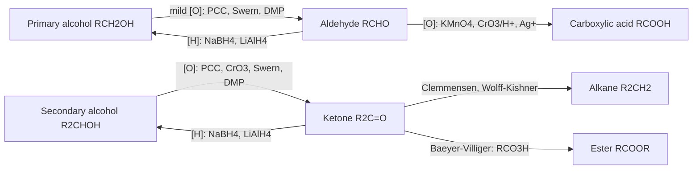
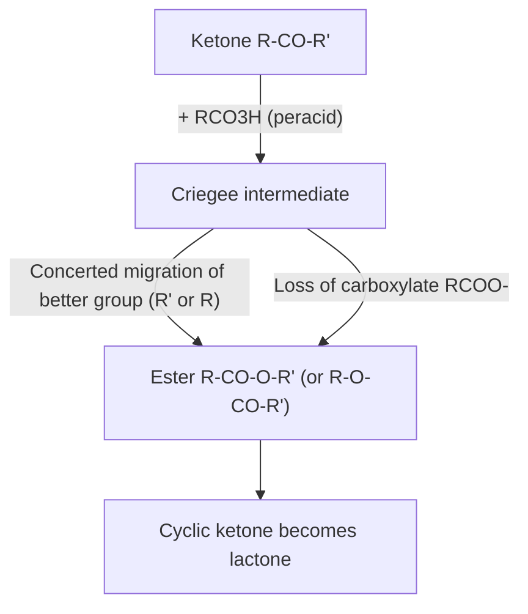
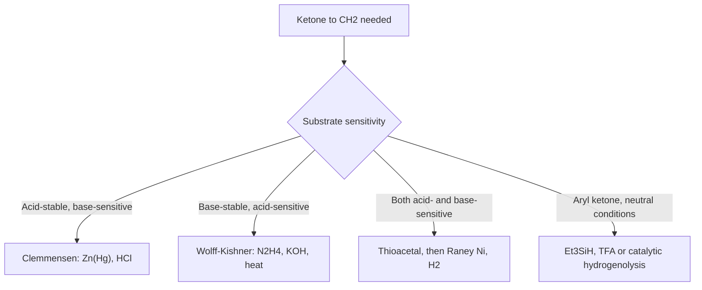

## Oxidation and Reduction of Carbonyl Compounds

### Overview

Aldehydes and ketones sit at an intermediate oxidation level between alcohols and carboxylic acids. This position makes them the hub of redox chemistry in organic synthesis:

- **Reduction** converts $C{=}O$ into $CH{-}OH$ (alcohols) or all the way to $CH_2$ (alkanes), and can also give amines (reductive amination) or pinacol-type coupling products.
- **Oxidation** of aldehydes gives carboxylic acids with very mild oxidants, because the aldehyde carbon carries a hydrogen. Ketones lack this hydrogen and resist oxidation except under forcing conditions (C–C bond cleavage) or through special reactions such as Baeyer–Villiger oxidation and the haloform reaction.

In organic chemistry, oxidation means an increase in the number of C–O bonds (or a decrease in C–H bonds) at a carbon; reduction is the reverse.

$$\text{alkane} \xrightarrow{[O]} \text{alcohol} \xrightarrow{[O]} \text{aldehyde/ketone} \xrightarrow{[O]} \text{carboxylic acid} \xrightarrow{[O]} CO_2$$

**Key Points**

- Aldehydes are readily oxidized (even by air, Tollens, Fehling, and Benedict reagents); ketones are resistant.
- Hydride reagents ($NaBH_4$, $LiAlH_4$) reduce the carbonyl to alcohols by nucleophilic addition of $H^-$.
- Complete deoxygenation to $CH_2$ is achieved by Clemmensen (acid), Wolff–Kishner (base), or thioacetal/Raney nickel routes; the choice depends on the substrate's acid/base sensitivity.
- Baeyer–Villiger oxidation inserts oxygen next to the carbonyl to give esters or lactones, with predictable migratory aptitude.
- The Cannizzaro reaction is a redox disproportionation of non-enolizable aldehydes.
- Selectivity (chemoselectivity, regioselectivity, stereoselectivity) governs reagent choice.

---

### Part 1: Oxidation States and Redox Bookkeeping

#### 1.1 Oxidation Level Table

| Compound class | Carbon oxidation state (carbonyl/functional carbon) | Example |
| --- | --- | --- |
| Alkane | −4 to −1 (depending on substitution) | Methane, −4 |
| Primary alcohol | −1 | Ethanol, C-1 |
| Aldehyde | +1 | Acetaldehyde, C-1 |
| Ketone | +2 | Acetone, C-2 |
| Carboxylic acid | +3 | Acetic acid, C-1 |
| $CO_2$ | +4 | Carbon dioxide |

Exact values are computed by assigning bonding electrons to the more electronegative atom; for a carbon, each bond to O or N counts +1, each bond to H counts −1, and C–C bonds count 0.

#### 1.2 Redox Relationships in a Diagram

---

### Part 2: Oxidation of Aldehydes

#### 2.1 Why Aldehydes Oxidize Easily

The aldehyde carbon bears a hydrogen. Oxidation replaces C–H with C–O, often through the **hydrate** ($RCH(OH)_2$) or a chromate/permanganate ester, so a hydrogen can be removed without breaking a C–C bond. Ketones have no such hydrogen, so oxidation would require cleaving a C–C bond, which demands much harsher conditions.

#### 2.2 Common Oxidants for Aldehydes

| Reagent | Conditions | Product | Notes |
| --- | --- | --- | --- |
| $KMnO_4$ | Basic, neutral, or acidic; heat | $RCOOH$ (or carboxylate) | Powerful; also cleaves alkenes and oxidizes benzylic positions |
| $K_2Cr_2O_7$ or $CrO_3$, $H_2SO_4$ (Jones reagent) | Aqueous acid, acetone | $RCOOH$ | Orange $Cr(VI)$ to green $Cr(III)$; toxic chromium waste |
| $Ag_2O$ or Tollens' reagent | Mild, basic, room temperature to warm | $RCOO^-$ + $Ag$ | Selective for aldehydes; does not attack $C{=}C$ |
| Fehling's/Benedict's | Alkaline $Cu^{2+}$ tartrate/citrate complex, heat | $RCOO^-$ + $Cu_2O$ | Aliphatic aldehydes only; aromatic aldehydes usually negative |
| $NaClO_2$ (Pinnick oxidation) | Buffered ($NaH_2PO_4$), scavenger (2-methyl-2-butene) | $RCOOH$ | Excellent with sensitive substrates and α,β-unsaturated aldehydes |
| $H_2O_2$ | Basic or with catalysts | $RCOOH$ | Green oxidant |
| Air ($O_2$) autoxidation | Spontaneous, radical chain | $RCOOH$ (via peracid) | Explains benzaldehyde converting to benzoic acid on standing |
| Oxone | $DMF$ or aqueous | $RCOOH$ | Convenient solid oxidant |

#### 2.3 Tollens' Test (Silver Mirror)

Reagent: $[Ag(NH_3)_2]^+$ in aqueous ammonia (prepared by adding $NH_3$ to $AgNO_3$ until the initial brown $Ag_2O$ precipitate dissolves).

$$RCHO + 2[Ag(NH_3)_2]^+ + 3OH^- \rightarrow RCOO^- + 2Ag\downarrow + 4NH_3 + 2H_2O$$

- Positive: a silver mirror (or black precipitate) on the glass.
- Positive for aldehydes, α-hydroxy ketones (which can isomerize to aldehydes, such as fructose), and formic acid derivatives; **negative for simple ketones**.
- Freshly prepared reagent must be used, and residues should be destroyed with dilute acid after use, since aged Tollens solutions can form explosive silver nitride/fulminating compounds.

#### 2.4 Fehling's and Benedict's Tests

$$RCHO + 2Cu^{2+} + 5OH^- \rightarrow RCOO^- + Cu_2O\downarrow + 3H_2O$$

- Positive result: brick-red precipitate of copper(I) oxide.
- Fehling's solution is a mixture of copper(II) sulfate (Fehling A) and alkaline sodium potassium tartrate (Fehling B); Benedict's uses citrate.
- Aromatic aldehydes such as benzaldehyde give a negative or weak result under these conditions; formaldehyde and aliphatic aldehydes are positive. Reducing sugars are positive.

#### 2.5 Mechanism Sketch: Chromic Acid Oxidation of an Aldehyde

1. Hydration: $RCHO + H_2O \rightleftharpoons RCH(OH)_2$.
2. The hydrate reacts with chromic acid to form a chromate ester, $RCH(OH){-}O{-}CrO_3H$.
3. E2-like removal of the C–H hydrogen by water while $Cr(VI)$ is reduced to $Cr(IV)$ gives $RCOOH$.

Because a hydrate is required, **anhydrous** oxidants (PCC in $CH_2Cl_2$) stop at the aldehyde stage when oxidizing primary alcohols, whereas aqueous chromic acid (Jones) continues to the acid.

#### 2.6 Autoxidation

Aldehydes in air undergo a free-radical chain reaction:

$$RCHO + O_2 \rightarrow RCO_3H \quad (\text{peracid}), \qquad RCO_3H + RCHO \rightarrow 2\,RCOOH$$

This is why aldehydes (benzaldehyde, for example) develop carboxylic-acid impurities on storage and are often stabilized with hydroquinone or stored under nitrogen.

---

### Part 3: Oxidation of Ketones

#### 3.1 Resistance to Oxidation

Under mild conditions, ketones are inert to Tollens, Fehling, Benedict, and most chromium(VI) conditions at room temperature. This difference is the basis of aldehyde/ketone discrimination tests.

#### 3.2 Vigorous Oxidative Cleavage

With hot, strong oxidants (concentrated $HNO_3$, hot alkaline $KMnO_4$), ketones are cleaved at the C–C bonds adjacent to the carbonyl, giving mixtures of carboxylic acids:

$$\text{Cyclohexanone} \xrightarrow{HNO_3,\ V_2O_5\ (cat.)} HOOC(CH_2)_4COOH \quad (\text{adipic acid})$$

Adipic acid, the nylon-6,6 monomer, is manufactured industrially by nitric acid oxidation of a cyclohexanol/cyclohexanone mixture (KA oil). For unsymmetrical ketones, cleavage occurs on either side of the carbonyl (**Popoff's rule**: the carbonyl generally stays with the smaller alkyl group, forming the smaller carboxylic acid; this is an empirical guide).

#### 3.3 Baeyer–Villiger Oxidation

A peracid converts a ketone into an ester (or a cyclic ketone into a lactone) by **oxygen insertion** between the carbonyl carbon and one of the attached groups.

$$R{-}CO{-}R' + R''CO_3H \rightarrow R{-}COO{-}R' + R''COOH$$

**Common peracids:** *m*-chloroperoxybenzoic acid (mCPBA), peracetic acid, trifluoroperacetic acid (most reactive, for unreactive ketones), monoperoxyphthalic acid. $H_2O_2$ with a Lewis acid or $Sn$-zeolite catalyst gives greener variants.

**Mechanism**

1. Protonation (or activation) of the carbonyl and nucleophilic addition of the peracid to give the **Criegee intermediate**.
2. Concerted migration of one substituent from carbon to the adjacent oxygen, with simultaneous loss of a carboxylate leaving group (the rate-determining step).
3. Deprotonation gives the ester.

**Migratory aptitude (typical order):**

$$\text{tertiary alkyl} > \text{cyclohexyl} \approx \text{secondary alkyl} \approx \text{benzyl} \approx \text{phenyl} > \text{primary alkyl} > \text{methyl}$$

The group better able to stabilize a partial positive charge migrates. Electronic effects in aryl migration follow the expected pattern (electron-rich aryl groups migrate faster).

| Ketone | Migrating group | Product |
| --- | --- | --- |
| Acetophenone ($CH_3COC_6H_5$) | Phenyl | Phenyl acetate ($CH_3COOC_6H_5$) |
| Methyl cyclohexyl ketone | Cyclohexyl | Cyclohexyl acetate |
| 2-Butanone | Ethyl (primary alkyl > methyl) | Ethyl acetate |
| Cyclohexanone | Ring carbon | ε-Caprolactone (precursor to polycaprolactone and nylon-6) |
| Cyclopentanone | Ring carbon | δ-Valerolactone |
| Camphor | Migration of the more substituted bridgehead-adjacent carbon | Lactone (regiochemistry depends on strain and geometry) |

**Stereochemistry:** the migrating carbon retains its configuration (the migration is **stereospecific with retention**), so chiral migrating groups do not racemize. This makes the reaction valuable in natural-product synthesis.

**Aldehydes:** in the Baeyer–Villiger reaction, aldehydes typically give carboxylic acids (hydride migrates) but can give formate esters with electron-rich aryl aldehydes (the **Dakin oxidation**, where $H_2O_2$ in base converts *o*- or *p*-hydroxybenzaldehydes to catechol or hydroquinone).

#### 3.4 Haloform Reaction (Oxidation of Methyl Ketones)

Methyl ketones ($RCOCH_3$), and compounds oxidizable to them (such as $RCH(OH)CH_3$), react with halogen and base to give a carboxylate and a haloform ($CHX_3$):

$$RCOCH_3 + 3X_2 + 4NaOH \rightarrow RCOONa + CHX_3 + 3NaX + 3H_2O$$

**Mechanism outline**

1. Base-catalyzed enolization and α-halogenation, repeated three times (each halogen makes the remaining α-hydrogens more acidic, so halogenation accelerates to the trihalomethyl ketone).
2. Hydroxide attacks the trihalomethyl ketone at carbonyl carbon.
3. The tetrahedral intermediate expels the trihalomethyl carbanion ($CX_3^-$, a good leaving group stabilized by three halogens).
4. Proton transfer gives the carboxylate and $CHX_3$.

**Iodoform test:** $I_2/NaOH$ gives a yellow precipitate of iodoform ($CHI_3$, mp 119–123 °C, antiseptic odor). Positive for methyl ketones, acetaldehyde, ethanol, and secondary alcohols with a $CH_3CH(OH){-}$ unit (which are oxidized in situ). Bromoform and chloroform are liquids. The reaction is also a synthetic route from methyl ketones to carboxylic acids with one fewer carbon.

#### 3.5 α-Oxidation and Other Ketone Oxidations

| Reaction | Reagents | Product | Notes |
| --- | --- | --- | --- |
| **Riley oxidation** | $SeO_2$ | α-Diketone (1,2-dicarbonyl) from the α-$CH_2$; α,β-unsaturation elsewhere | $SeO_2$ is toxic |
| **Rubottom oxidation** | Silyl enol ether + mCPBA | α-Hydroxy ketone | Via siloxy epoxide |
| **Davis oxaziridine oxidation** | Enolate + oxaziridine | α-Hydroxy ketone | Asymmetric versions exist |
| **α-Halogenation (acid or base)** | $X_2$, $H^+$ or $OH^-$ | α-Haloketone | Acid: monosubstitution; base: polyhalogenation |
| **Saegusa–Ito oxidation** | Silyl enol ether, $Pd(OAc)_2$ | α,β-Unsaturated ketone (dehydrogenation) | Introduces $C{=}C$ conjugation |
| **Oxidative cleavage by periodate** ($NaIO_4$) | For 1,2-diketones, α-hydroxy ketones | Carboxylic acids | Also cleaves 1,2-diols |

---

### Part 4: Reduction of Carbonyl Compounds to Alcohols

#### 4.1 Hydride Reagents

$$R{-}CHO \xrightarrow{1.\ [H^-];\ 2.\ H_3O^+} R{-}CH_2OH \qquad R{-}CO{-}R' \xrightarrow{1.\ [H^-];\ 2.\ H_3O^+} R{-}CH(OH){-}R'$$

| Reagent | Solvent | Strength | Reduces | Usually does **not** reduce |
| --- | --- | --- | --- | --- |
| $NaBH_4$ | $EtOH$, $MeOH$, water | Mild | Aldehydes, ketones, acyl chlorides | Esters, amides, carboxylic acids, nitriles, isolated $C{=}C$ |
| $LiAlH_4$ (LAH) | $Et_2O$, THF (anhydrous) | Strong | Aldehydes, ketones, esters, acids, amides, nitriles, epoxides, halides | Isolated $C{=}C$ (generally) |
| $LiBH_4$ | THF | Intermediate | Aldehydes, ketones, esters | Amides, acids (slowly) |
| $NaBH_3CN$ | Buffered protic solvent | Mild | Iminium ions selectively (pH ~6–7); aldehydes and ketones at low pH | Ketones/aldehydes at neutral pH |
| $NaBH(OAc)_3$ | DCE, THF | Mild | Iminium ions (reductive amination); aldehydes slowly | Ketones |
| $DIBAL{-}H$ | Toluene or $CH_2Cl_2$, −78 °C | Bulky, electrophilic | Esters to aldehydes (1 equiv, low temperature); aldehydes/ketones to alcohols | Depends on conditions |
| $L$-Selectride, $K$-Selectride | THF, −78 °C | Bulky hydride | Ketones (with high stereoselectivity) | Esters generally slow |
| $Red{-}Al$, $LiAlH(OtBu)_3$ | Ether/THF | Modified | $LiAlH(OtBu)_3$ reduces acid chlorides to aldehydes; Red-Al is soluble in toluene | Depends |
| $Zn(BH_4)_2$, $Ca(BH_4)_2$ | THF | Mild-moderate | Chelation-controlled ketone reductions | Depends |
| $NaBH_4/CeCl_3$ (Luche) | $MeOH$ | Modified | 1,2-Reduction of α,β-unsaturated ketones to allylic alcohols | Suppresses 1,4-reduction |

**Note on exact selectivity.** The reactivity summaries above are general trends; solvent, temperature, additives, and substrate structure can alter outcomes.

#### 4.2 Mechanism of Hydride Reduction

1. **Hydride transfer.** The hydridic $B{-}H$ or $Al{-}H$ bond donates $H^-$ to the electrophilic carbonyl carbon (rate-determining step), giving an alkoxide bound to boron or aluminum.
2. For $NaBH_4$, the resulting alkoxyborate can transfer additional hydrides; all four $B{-}H$ bonds may reduce carbonyl groups, giving $B(OR)_4^-$.
3. **Protonation.** Solvent (for $NaBH_4$ in alcohols) or aqueous acid workup (essential for $LiAlH_4$) protonates the alkoxide to the alcohol.

$$4R_2C{=}O + NaBH_4 \rightarrow Na^+\,B(OCHR_2)_4^- \xrightarrow{H_3O^+} 4R_2CHOH$$

**Safety.** $LiAlH_4$ reacts violently with water and protic solvents releasing hydrogen; use dry ether or THF, quench carefully (Fieser workup: sequential addition of $x$ mL water, $x$ mL 15% $NaOH$, then $3x$ mL water per $x$ g of $LiAlH_4$).

Hydride reduction (svg_diagram):

<svg xmlns="http://www.w3.org/2000/svg" viewBox="0 0 700 240" width="700" height="240" font-family="sans-serif" font-size="13">
<text x="350" y="20" text-anchor="middle" font-weight="bold">Hydride Reduction of a Carbonyl (svg_diagram)</text>
<g fill="#eef" stroke="black" stroke-width="1.2">
<rect x="20" y="60" width="130" height="46" rx="6" />
<rect x="240" y="60" width="150" height="46" rx="6" />
<rect x="480" y="60" width="170" height="46" rx="6" />
</g>
<g text-anchor="middle">
<text x="85" y="88">R2C=O</text>
<text x="315" y="88">R2CH–O⁻ (alkoxide)</text>
<text x="565" y="88">R2CH–OH (alcohol)</text>
</g>
<g stroke="black" stroke-width="1.5">
<line x1="150" y1="83" x2="238" y2="83" />
<line x1="390" y1="83" x2="478" y2="83" />
</g>
<g text-anchor="middle" font-size="11">
<text x="194" y="55">H⁻ (from BH4⁻ or AlH4⁻)</text>
<text x="434" y="55">H3O⁺ workup</text>
</g>
<text x="350" y="150" text-anchor="middle" font-size="12">Aldehyde gives primary alcohol; ketone gives secondary alcohol</text>
<text x="350" y="175" text-anchor="middle" font-size="12">NaBH4 tolerates protic solvents; LiAlH4 requires dry ether or THF</text>
<text x="350" y="205" text-anchor="middle" font-size="12">Hydride attacks the carbonyl carbon along the Bürgi–Dunitz angle</text>
</svg>

#### 4.3 Catalytic Hydrogenation

$$R_2C{=}O + H_2 \xrightarrow{Pt,\ Pd/C,\ Raney\ Ni,\ or\ Ru} R_2CHOH$$

- Requires more forcing conditions than alkene hydrogenation; $C{=}C$ is reduced first, unless the catalyst is chosen to favor $C{=}O$ (for example, certain Pt-modified or Ru catalysts, or Luche/Meerwein–Ponndorf conditions for chemoselectivity).
- Industrial hydrogenation of aldehydes and ketones (for example, acetone to isopropanol, butanal to butanol in the oxo process) is widely practiced.
- Aromatic ketones can be over-reduced with Pd to the hydrocarbon (hydrogenolysis of the benzylic alcohol).

#### 4.4 Meerwein–Ponndorf–Verley (MPV) and Oppenauer

**MPV reduction:** aluminum isopropoxide in isopropanol reduces a ketone to an alcohol by **hydride transfer via a six-membered chair transition state**; the isopropanol becomes acetone, which is distilled off to drive the equilibrium.

$$R_2C{=}O + (CH_3)_2CHOH \underset{Oppenauer}{\overset{Al(OiPr)_3,\ MPV}{\rightleftharpoons}} R_2CHOH + (CH_3)_2C{=}O$$

The **Oppenauer oxidation** is the reverse, using acetone or another ketone in excess to oxidize a secondary alcohol; it is mild and does not affect $C{=}C$ (useful in steroid chemistry). MPV is highly chemoselective for carbonyls in the presence of $C{=}C$, nitro groups, and halides.

#### 4.5 Stereochemistry of Carbonyl Reduction

**Prochirality.** An unsymmetrical ketone has two enantiotopic faces; reduction with an achiral reagent gives a racemic secondary alcohol.

**Cyclic ketones.** For 4-*tert*-butylcyclohexanone:

| Hydride reagent | Major product | Rationale |
| --- | --- | --- |
| $NaBH_4$, $LiAlH_4$ (small) | *trans* (equatorial OH), about 85–90% | Axial attack by small hydride avoids 1,3-diaxial steric strain and torsional effects |
| $L$-Selectride (bulky) | *cis* (axial OH), >90% | Bulky hydride attacks from the less hindered equatorial direction |

Percentages are approximate and depend on solvent and temperature.

**Acyclic α-chiral ketones.** Diastereoselectivity is predicted by the Felkin–Anh model (non-chelating conditions) and by the Cram-chelate model (with $Zn^{2+}$, $Mg^{2+}$, or other chelating metals and α- or β-heteroatoms).

**Enantioselective reductions:**

| Method | Catalyst/reagent | Notes |
| --- | --- | --- |
| **CBS reduction** (Corey–Bakshi–Shibata) | Chiral oxazaborolidine + $BH_3$ | Prochiral ketones to chiral alcohols, typically >90% ee for aryl alkyl ketones |
| **Noyori asymmetric hydrogenation / transfer hydrogenation** | Ru(II)–BINAP–diamine, $H_2$ or *i*-PrOH/formate | Highly enantioselective, industrial application |
| **Enzymatic reduction** | Alcohol dehydrogenases (ADH), ketoreductases (KRED), baker's yeast, $NADH/NADPH$ cofactors | Green, often >99% ee |
| **Midland Alpine-borane** | Chiral $B$-alkyl-9-BBN from α-pinene | Reduces acetylenic ketones with high ee |
| **Chiral auxiliaries and directing groups** | For example, β-hydroxyl directed *anti* reduction with $Me_4NBH(OAc)_3$ | Substrate-controlled 1,3-diastereoselectivity |

Biological analogy: **NADH** delivers a hydride from the C-4 position of its dihydronicotinamide ring to carbonyls (as in lactate dehydrogenase, which reduces pyruvate to lactate); the reaction is stereospecific for one face of both NADH and the substrate.

#### 4.6 Chemoselectivity: Strategy Table

| Task | Suitable reagent | Reason |
| --- | --- | --- |
| Reduce ketone in the presence of an ester | $NaBH_4$, $EtOH$ | $NaBH_4$ does not reduce esters at ordinary rates |
| Reduce ester and ketone both | $LiAlH_4$ | Strong hydride |
| Reduce aldehyde selectively in the presence of a ketone | $NaBH_4$ at −78 °C, $NaBH(OAc)_3$, or protect ketone | Aldehydes are more electrophilic |
| Reduce α,β-unsaturated ketone to allylic alcohol (1,2-reduction) | $NaBH_4/CeCl_3$ (Luche) | Hard Ce-activated carbonyl favors 1,2-addition |
| Reduce $C{=}C$ of an enone selectively (1,4-reduction) | $H_2$, $Pd/C$; $L$-Selectride; Stryker's reagent; $NaBH_4$ with $NiCl_2$ | Conjugate reduction |
| Reduce ester to aldehyde | $DIBAL{-}H$, −78 °C, 1 equiv | Stops at hemiacetal-aluminate stage until workup |
| Reduce an acid chloride to an aldehyde | $LiAlH(OtBu)_3$ or Rosenmund ($H_2$, poisoned Pd) | Prevent over-reduction |
| Reduce nitrile to aldehyde | $DIBAL{-}H$ | Imine intermediate hydrolyzed on workup |

---

### Part 5: Complete Deoxygenation: $C{=}O \rightarrow CH_2$

#### 5.1 Clemmensen Reduction

$$R{-}CO{-}R' \xrightarrow{Zn(Hg),\ conc.\ HCl,\ \Delta} R{-}CH_2{-}R'$$

- Acidic conditions; works best for **aryl alkyl ketones** (for example, products of Friedel–Crafts acylation, giving straight-chain alkylbenzenes, avoiding the rearrangement problem of Friedel–Crafts alkylation).
- Unsuitable for acid-sensitive substrates (acetals, tertiary alcohols, many protecting groups, acid-labile heterocycles).
- The mechanism occurs on the zinc surface and is not fully settled; zinc carbenoid intermediates have been proposed. [Inference: the exact intermediates are still debated.]

#### 5.2 Wolff–Kishner Reduction

$$R_2C{=}O \xrightarrow{NH_2NH_2} R_2C{=}NNH_2 \xrightarrow{KOH,\ \Delta,\ HOCH_2CH_2OCH_2CH_2OH} R_2CH_2 + N_2$$

**Huang-Minlon modification:** a one-pot procedure using hydrazine hydrate and $KOH$ in diethylene glycol (or ethylene glycol), first refluxing to form the hydrazone, then distilling off water and excess hydrazine and heating to about 200 °C to drive nitrogen loss. It shortens reaction time and increases yield.

**Mechanism:**

1. Hydrazone formation.
2. Deprotonation of the N–H by hydroxide, then protonation at carbon (through tautomerization to an azo/diimide-type intermediate).
3. Second deprotonation gives a diazenyl (alkyldiazenide) anion.
4. Loss of $N_2$ gives a carbanion, which is protonated by solvent. The irreversible loss of nitrogen gas drives the reaction.

- Basic conditions; suited to **base-stable, acid-sensitive** substrates.
- Hindered ketones may be slow, and base-sensitive groups (esters, halides prone to elimination) are incompatible.
- Modified variants: **Myers' modification** (N-*tert*-butyldimethylsilylhydrazone with a strong base at lower temperature), **Cram modification** (hydrazone with $KOtBu$ in DMSO at room temperature), and **Barton modification** (for hindered ketones).

#### 5.3 Thioacetal Desulfurization

$$R_2C{=}O \xrightarrow{HS(CH_2)_3SH,\ BF_3} \text{1,3-dithiane} \xrightarrow{Raney\ Ni,\ H_2} R_2CH_2$$

Nearly neutral conditions; useful when both Clemmensen and Wolff–Kishner are unsuitable. Raney Ni also reduces $C{=}C$ if hydrogen is present (the Ni is loaded with adsorbed hydrogen), which should be considered when unsaturation is present.

#### 5.4 Other Deoxygenation Methods

| Method | Reagents | Notes |
| --- | --- | --- |
| **Ionic hydrogenation** | $Et_3SiH$, $TFA$ or $BF_3$ | Effective for diaryl ketones and aryl ketones (via benzylic cation) |
| **Catalytic hydrogenolysis** | $H_2$, $Pd/C$, acid | Works for benzylic and aryl ketones |
| **Mozingo reduction** | Dithioacetal + Raney Ni | Same as thioacetal route |
| **Caglioti (tosylhydrazone) reduction** | $TsNHNH_2$, then $NaBH_3CN$ or catecholborane | Mild reduction to $CH_2$ |
| **Shapiro reaction** | Tosylhydrazone + 2 equiv $RLi$ | Gives alkenes (vinyllithium) rather than $CH_2$ |

---

### Part 6: Reductive Coupling and Other Reductions

#### 6.1 Pinacol Coupling

Single-electron reductants ($Mg$, $Mg/MgI_2$, $Na$, $SmI_2$, $TiCl_3$/$Zn$) reduce a carbonyl to a ketyl radical anion. Two ketyl radicals couple to give a **1,2-diol (pinacol)** as the dianion:

$$2\,R_2C{=}O \xrightarrow{Mg\ or\ SmI_2} R_2C(OH){-}C(OH)R_2$$

Acetone gives pinacol (2,3-dimethylbutane-2,3-diol), which in turn undergoes the **pinacol rearrangement** with acid to give pinacolone (3,3-dimethylbutan-2-one).

#### 6.2 McMurry Coupling

Low-valent titanium ($TiCl_3/LiAlH_4$ or $TiCl_4/Zn$) couples two carbonyls with deoxygenation to give an alkene:

$$2\,R_2C{=}O \xrightarrow{TiCl_3,\ Zn\text{-}Cu} R_2C{=}CR_2$$

Particularly valuable for intramolecular ring formation (including strained and medium/large rings).

#### 6.3 Acyloin Condensation

Esters plus sodium metal in an inert solvent give α-hydroxy ketones (acyloins). Related to ketyl coupling; useful for ring synthesis. The Rühlmann modification with $TMSCl$ improves yields.

#### 6.4 Birch-Type and Dissolving-Metal Reductions of Ketones

Dissolving metal ($Na$ or $Li$ in liquid $NH_3$ with alcohol) reduces ketones to alcohols with thermodynamic (equatorial) stereochemistry via ketyl radical anion and carbanion intermediates. In α,β-unsaturated ketones, dissolving metals reduce the $C{=}C$ bond selectively to give the saturated ketone (or its enolate).

#### 6.5 Reductive Amination (Formal Reduction to Amine)

$$R_2C{=}O + R'NH_2 \xrightarrow{H^+} R_2C{=}NR' \xrightarrow{NaBH_3CN\ or\ NaBH(OAc)_3\ or\ H_2/cat.} R_2CH{-}NHR'$$

Detailed in the imine chapter; the imine/iminium intermediate is reduced faster than the starting carbonyl at mildly acidic pH.

**Leuckart–Wallach reaction:** carbonyl + ammonium formate or formamide at high temperature (about 160–190 °C) gives amines, with formate as the hydride source.

---

### Part 7: Redox Disproportionation: The Cannizzaro Reaction

Aldehydes lacking α-hydrogens (formaldehyde, benzaldehyde, pivaldehyde, glyoxal-type) undergo disproportionation in concentrated aqueous or alcoholic base: one molecule is oxidized to the carboxylate and one is reduced to the alcohol.

$$2\,C_6H_5CHO \xrightarrow{conc.\ NaOH} C_6H_5COO^-Na^+ + C_6H_5CH_2OH$$

**Mechanism**

1. Hydroxide adds to the carbonyl to give a tetrahedral alkoxide (hydrate anion).
2. This anion transfers **hydride** to the carbonyl carbon of a second aldehyde molecule (rate-determining step; second-order in aldehyde, sometimes with a base-dependence that gives a dianion pathway at high hydroxide concentration).
3. The result is carboxylic acid (deprotonated to carboxylate under the basic conditions) and an alkoxide (protonated to alcohol).

**Crossed Cannizzaro.** Formaldehyde is the most reactive hydride acceptor (highest electrophilicity), so it is sacrificially oxidized to formate while a second, more valuable aldehyde is reduced to alcohol:

$$ArCHO + HCHO \xrightarrow{NaOH} ArCH_2OH + HCOO^-Na^+$$

The crossed Cannizzaro is the last step in the **pentaerythritol** synthesis: acetaldehyde plus formaldehyde undergoes three aldol additions to give tris(hydroxymethyl)acetaldehyde, which is reduced by formaldehyde (crossed Cannizzaro) to $C(CH_2OH)_4$.

**Intramolecular Cannizzaro.** Glyoxal gives glycolate; phthalaldehyde gives phthalide (via hydride shift). Aldehydes with α-hydrogens undergo aldol condensation preferentially under base, so Cannizzaro is not observed for them under normal conditions.

**Tishchenko reaction.** Related disproportionation of aldehydes catalyzed by aluminum alkoxides gives the ester (for example, acetaldehyde to ethyl acetate) through a hydride transfer in a hemiacetal alkoxide; it proceeds without added strong hydroxide and is used industrially for ethyl acetate.

---

### Part 8: Selective Oxidation of Alcohols to Carbonyl Compounds

While alcohol oxidation is covered under alcohols, the preparations that feed the carbonyl functional group are summarized here because they complete the redox cycle.

| Reagent | Conditions | Primary alcohol → | Secondary alcohol → | Notes |
| --- | --- | --- | --- | --- |
| **PCC** (pyridinium chlorochromate) | $CH_2Cl_2$, anhydrous | Aldehyde | Ketone | Stops at aldehyde; chromium waste; mildly acidic |
| **PDC** (pyridinium dichromate) | $CH_2Cl_2$ (aldehyde) or DMF (acid) | Aldehyde or acid | Ketone | Solvent-dependent |
| **Jones** ($CrO_3$, $H_2SO_4$, acetone) | Aqueous acid | Carboxylic acid | Ketone | Strong, acidic |
| **Swern** ($DMSO$, $(COCl)_2$, $Et_3N$, −78 °C) | $CH_2Cl_2$ | Aldehyde | Ketone | Mild; foul-smelling $Me_2S$ by-product; needs low temperature |
| **Dess–Martin periodinane (DMP)** | $CH_2Cl_2$, room temperature | Aldehyde | Ketone | Mild, neutral, short reaction times; expensive; potentially shock-sensitive in bulk |
| **TEMPO / $NaOCl$** (Anelli) | $CH_2Cl_2$/water, $KBr$ | Aldehyde (or acid with excess) | Ketone | Catalytic, selective for primary alcohols |
| **Parikh–Doering** ($SO_3 \cdot py$, $DMSO$) | Room temperature-ish | Aldehyde | Ketone | Swern alternative without cryogenics |
| **Oppenauer** | $Al(OiPr)_3$, acetone | Aldehyde (limited) | Ketone | Reverse of MPV |
| **$MnO_2$** | $CH_2Cl_2$ or hexane | Allylic/benzylic aldehydes | Allylic/benzylic ketones | Selective for allylic and benzylic alcohols |

---

### Part 9: Comparison Tables

#### 9.1 Aldehyde versus Ketone: Redox Behavior

| Test/reaction | Aldehyde | Ketone |
| --- | --- | --- |
| Tollens' reagent | Positive (silver mirror) | Negative (except α-hydroxy ketones) |
| Fehling's/Benedict's | Positive for aliphatic aldehydes | Negative (except α-hydroxy ketones) |
| Schiff's reagent | Magenta color | Negative (or very slow) |
| Chromic acid (Jones) | Rapid oxidation to acid (orange to green) | No reaction at room temperature |
| $KMnO_4$ | Oxidized to acid | Resistant (cleaved under forcing conditions) |
| Baeyer–Villiger | H migrates (acid) or aryl migrates (formate/phenol) | Ester or lactone |
| $NaBH_4$ | Reduced (faster) | Reduced (slower) |
| Haloform | Only $CH_3CHO$ | $RCOCH_3$ |
| Cannizzaro | Non-enolizable aldehydes | Not applicable |

#### 9.2 Choosing a Reduction Method

| Desired outcome | Method |
| --- | --- |
| Alcohol from carbonyl, mild | $NaBH_4$ in $EtOH$ |
| Alcohol, including other reducible groups | $LiAlH_4$ in $Et_2O$ or THF |
| Allylic alcohol from enone | $NaBH_4/CeCl_3$ (Luche) |
| Alkane, acid-stable substrate | Clemmensen |
| Alkane, base-stable substrate | Wolff–Kishner (Huang-Minlon) |
| Alkane, neutral conditions | Dithiane/Raney Ni |
| Enantioenriched alcohol | CBS, Noyori, KRED |
| Amine | Reductive amination |
| 1,2-Diol | Pinacol coupling ($SmI_2$, $Mg$) |
| Alkene by coupling | McMurry |

---

### Part 10: Worked Examples

**Example 1: Predict the products with Tollens' reagent**

Compounds: propanal, propanone, benzaldehyde, 2-hydroxypropanal.

| Compound | Result | Reason |
| --- | --- | --- |
| Propanal | Silver mirror | Aldehyde oxidized to propanoate |
| Propanone | No reaction | Ketone, no aldehydic C–H |
| Benzaldehyde | Silver mirror | Aldehyde (oxidized to benzoate) |
| 2-Hydroxypropanal (an α-hydroxy aldehyde) | Silver mirror | Aldehyde present |

**Example 2: Select the reagent**

Convert methyl 4-oxopentanoate ($CH_3COCH_2CH_2COOCH_3$) into methyl 4-hydroxypentanoate.

- Use $NaBH_4$ in $MeOH$ at 0 °C. It reduces the ketone but leaves the ester; $LiAlH_4$ would reduce both, giving pentane-1,4-diol. (In practice, $NaBH_4$ selectivity is very good but the resulting γ-hydroxy ester can lactonize to γ-valerolactone on standing or heating.)

**Example 3: Predict the Baeyer–Villiger product**

| Substrate | Peracid | Product | Migrating group |
| --- | --- | --- | --- |
| Cyclohexyl methyl ketone | mCPBA | Cyclohexyl acetate | Cyclohexyl (secondary) over methyl |
| Acetophenone | $CF_3CO_3H$ | Phenyl acetate | Phenyl over methyl |
| 3-Methylcyclohexanone | mCPBA | 4-Methyl-ε-caprolactone / 6-methyl regioisomer mixture | More substituted α-carbon migrates preferentially; regiochemistry favors the more substituted position |
| Pinacolone ($(CH_3)_3CCOCH_3$) | mCPBA | *tert*-Butyl acetate | Tertiary alkyl |

**Example 4: Choose Clemmensen versus Wolff–Kishner**

Target: 4-nitropropylbenzene from 4-nitropropiophenone.

- Clemmensen reduces nitro groups under $Zn/HCl$ (converting to amines), so it is unsuitable if the nitro group must survive; Wolff–Kishner (hydrazine) can also reduce aromatic nitro compounds to a mixture of products. Modified conditions are needed; in practice, ionic hydrogenation ($Et_3SiH$, $TFA$) is often chosen to leave the nitro group untouched. Chemoselectivity should be verified for the specific substrate.

**Example 5: Route to a straight-chain alkylbenzene**

Target: butylbenzene from benzene.

1. Friedel–Crafts acylation: benzene + butanoyl chloride, $AlCl_3$ gives butyrophenone ($C_6H_5COCH_2CH_2CH_3$; no rearrangement).
2. Clemmensen or Wolff–Kishner reduction gives butylbenzene.

Direct alkylation with 1-chlorobutane would give sec-butylbenzene from carbocation rearrangement, which is why the acylation–reduction sequence is standard.

**Example 6: Cannizzaro outcome**

4-Chlorobenzaldehyde, 50% aqueous $KOH$, heat.

- No α-hydrogens, so no aldol pathway.
- Products: potassium 4-chlorobenzoate and 4-chlorobenzyl alcohol in about a 1:1 ratio (maximum 50% yield of each).

**Example 7: Haloform sequence**

Convert 4-methoxyacetophenone into 4-methoxybenzoic acid.

- $I_2$ (or $Br_2$/$Cl_2$ as $NaOX$), $NaOH$, then acidify.
- Products: 4-methoxybenzoic acid plus iodoform ($CHI_3$), a yellow solid that confirms the methyl ketone.

**Example 8: Stereochemical prediction**

Reduce 2-methylcyclohexanone with $NaBH_4$.

- The hydride approaches preferentially axially (from the face opposite the equatorial methyl's adjacent hindrance for the more stable conformer), giving mainly the *trans*-2-methylcyclohexanol (equatorial OH, equatorial CH₃) along with a smaller amount of *cis*. Ratios depend on conditions.

**Example 9: Luche reduction**

Reduce cyclohex-2-en-1-one to cyclohex-2-en-1-ol.

- $NaBH_4$ alone gives a mixture of 1,2-reduction (allylic alcohol) and 1,4-reduction (saturated ketone, then alcohol). $NaBH_4$ with $CeCl_3 \cdot 7H_2O$ in methanol at low temperature gives the allylic alcohol selectively.

**Example 10: Pinacol synthesis**

Prepare 2,3-dimethylbutane-2,3-diol.

- Acetone + $Mg$ (amalgam) in benzene/ether, then $H_2O$ (a classical pinacol coupling), or $SmI_2$ in THF.

---

### Part 11: Analytical and Spectroscopic Considerations for Redox Monitoring

| Transformation | Observable change |
| --- | --- |
| Aldehyde → carboxylic acid | IR: loss of aldehyde C–H doublet (2720, 2820 cm⁻¹), new broad O–H (2500–3300 cm⁻¹); ¹H NMR: loss of δ 9–10 signal, new δ 10–12 (broad, exchangeable) |
| Ketone → alcohol | IR: loss of C=O (~1715 cm⁻¹), new O–H (~3300–3400 cm⁻¹); ¹H NMR: new carbinol CH at δ 3.5–4.5; ¹³C: C=O (δ ~205) replaced by C–OH (δ ~65–80) |
| Ketone → $CH_2$ | Loss of C=O in IR and ¹³C; new CH₂ signals; no O–H |
| Ketone → ester (Baeyer–Villiger) | IR: C=O shift to ~1735–1750 cm⁻¹ (ester) and C–O at 1150–1300; ¹³C carbonyl shifts from ~205 to ~170 |
| Cannizzaro | Two products: carboxylate (after acidification, carboxylic acid) and alcohol; separable by extraction (acid soluble in base; alcohol in organic layer) |
| Enone (conjugated) → allylic alcohol | Loss of UV enone $\pi\to\pi^*$ band at ~220–250 nm; new O–H and carbinol CH signals |

Typical shifts; values vary with substituents and solvent.

---

### Part 12: Common Pitfalls

- Assuming that ketones give a silver mirror: only aldehydes (and α-hydroxy ketones capable of tautomerizing to aldehydes) give positive Tollens' tests.
- Forgetting the aqueous acid workup for $LiAlH_4$ reductions, which leaves the product as the aluminum alkoxide.
- Using $LiAlH_4$ in protic solvents (violent reaction) or $NaBH_4$ in strongly acidic solution (decomposition).
- Applying Clemmensen to acid-sensitive substrates or Wolff–Kishner to base-sensitive ones.
- Ignoring competing reductions of nitro groups, halides, or $C{=}C$ bonds under catalytic hydrogenation or dissolving-metal conditions.
- Predicting the wrong migrating group in Baeyer–Villiger oxidations; use the migratory-aptitude series and remember that electronic and stereoelectronic effects (antiperiplanar alignment) can override simple rules in strained ring systems.
- Attempting the Cannizzaro reaction with enolizable aldehydes (aldol wins) or using dilute base (Cannizzaro requires concentrated base).
- Confusing the haloform reaction (methyl ketones and compounds oxidizable to them) with a general test for ketones.
- Using Tollens' waste improperly; aged solutions can be explosive, so acidify and dispose promptly.
- Overlooking that Jones reagent oxidizes primary alcohols past the aldehyde to the carboxylic acid.

**Conclusion**

Aldehydes and ketones are the pivot of organic redox chemistry. Aldehydes oxidize readily to carboxylic acids (Tollens, Fehling, chromate, permanganate, Pinnick), while ketones resist oxidation except through targeted transformations such as Baeyer–Villiger oxygen insertion and the haloform cleavage of methyl ketones. Reduction options range from mild hydride donors ($NaBH_4$) to strong ones ($LiAlH_4$), from catalytic hydrogenation to enantioselective catalysts (CBS, Noyori, ketoreductases), and from stepwise conversion to alcohols to complete deoxygenation (Clemmensen, Wolff–Kishner, thioacetal/Raney Ni). Success in synthesis rests on matching reagent strength, pH, and compatibility to the substrate's other functional groups, and on understanding how the mechanism (hydride transfer, radical coupling, migration, or disproportionation) determines chemo-, regio-, and stereoselectivity.

**Related Topics**

- Alcohol oxidation methods and chromium-free alternatives
- Carboxylic acid derivatives: reduction with $LiAlH_4$ and $DIBAL$
- Enantioselective reduction: CBS, Noyori, and biocatalytic ketoreduction
- Felkin–Anh and Cram-chelate models for diastereoselective reduction
- Reductive amination and the Leuckart–Wallach reaction
- Baeyer–Villiger variants: Dakin oxidation, enzymatic BVMOs, and catalytic peroxide systems
- Pinacol, McMurry, and SmI₂-mediated radical carbonyl couplings
- Cannizzaro and Tishchenko disproportionations
- Biological redox: NAD⁺/NADH, alcohol dehydrogenase, and lactate dehydrogenase
- Spectroscopic characterization of carbonyl redox products (IR, NMR, UV)