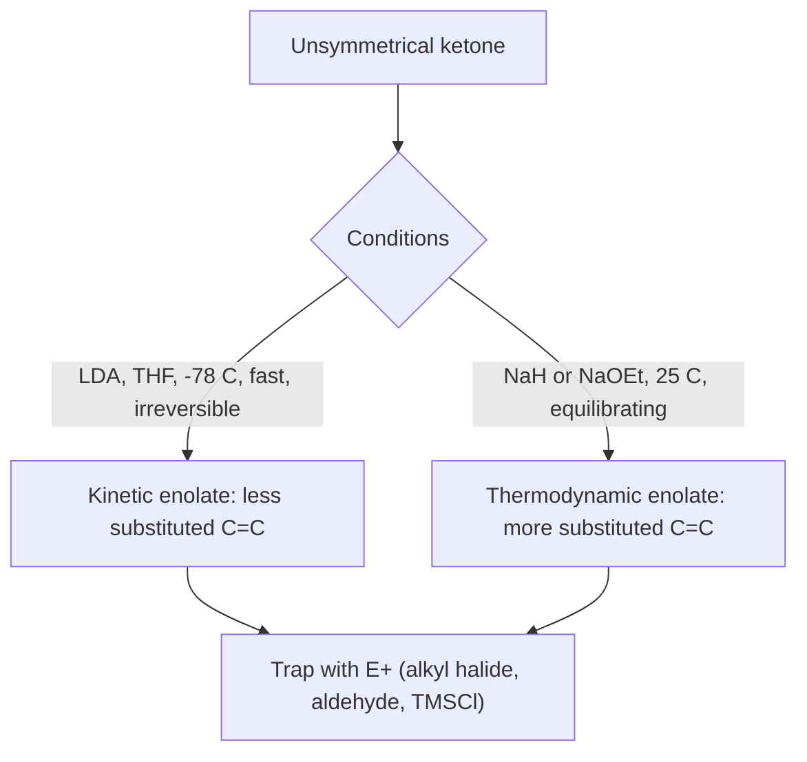
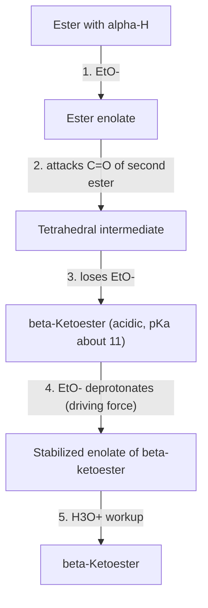

## Enolate Chemistry

### Overview

An **enolate** is the anion formed when a base removes an acidic α-hydrogen from a carbonyl compound. It is an **ambident nucleophile**: negative charge is delocalized over the α-carbon and the oxygen, so it can react at either atom. In practice, the α-carbon acts as the nucleophile toward most carbon electrophiles (alkyl halides, carbonyl compounds, Michael acceptors), making enolates the workhorse of carbon–carbon bond formation in carbonyl chemistry.

$$R{-}CO{-}CH_2R' + B^- \rightleftharpoons \left[R{-}CO{-}\overset{-}{C}HR' \longleftrightarrow R{-}C(O^-){=}CHR'\right] + BH$$

Enolate chemistry unifies a large body of reactions: α-alkylation, aldol reactions, Claisen and Dieckmann condensations, Michael additions, α-halogenation, and α-oxidation. Control of **which** enolate forms (regiochemistry), its **geometry** (E/Z), and **how** it reacts (C versus O, stereochemistry) determines the outcome.

**Key Points**

- α-Hydrogens of aldehydes and ketones are acidic ($pK_a$ about 17–20) because the enolate is resonance stabilized.
- **Strong, bulky, non-nucleophilic bases** (LDA, LiHMDS) at low temperature generate enolates **quantitatively and irreversibly**, allowing clean alkylation and directed aldol reactions.
- **Kinetic enolates** (less substituted, formed fast at −78 °C) and **thermodynamic enolates** (more substituted, formed under equilibrating conditions) are distinct and accessible selectively.
- Enolates are ambident: **C-alkylation** predominates with soft electrophiles (alkyl iodides, bromides); **O-alkylation** or O-silylation occurs with hard electrophiles (silyl chlorides, sulfonates, acylating agents) under some conditions.
- Enolate reactivity extends to esters, amides, nitriles, nitroalkanes, and 1,3-dicarbonyl compounds, each with characteristic $pK_a$ values.
- Related nucleophilic equivalents: **enols** (acid), **enamines**, **silyl enol ethers**, **azaenolates**, and **boron enolates**.

---

### Part 1: Acidity of α-Hydrogens and Enolate Structure

#### 1.1 Why α-Hydrogens Are Acidic

Deprotonation at the α-carbon produces a conjugate base in which the carbon lone pair overlaps with the carbonyl $\pi$ system. The negative charge is shared between carbon and the more electronegative oxygen; the oxygen-centered resonance form contributes more to the structure (the anion is better described as an alkoxide-like enolate with substantial C=C character).

Requirements for effective enolate formation:

1. The α-C–H bond must **overlap** with the carbonyl $\pi^*$ orbital (stereoelectronic requirement). Bridgehead α-hydrogens in bicyclic systems cannot form enolates because the resulting enolate would violate Bredt's rule.
2. The base must be strong enough to remove the proton to a useful extent.

#### 1.2 Approximate $pK_a$ Values

| Compound (acidic C–H) | Approximate $pK_a$ (DMSO or water, varies by scale) |
| --- | --- |
| Alkane | ~50 |
| Ester (α-H) | ~25 |
| Amide (α-H) | ~30 |
| Nitrile (α-H) | ~25 |
| Ketone (acetone) | ~19–20 (water); ~26 (DMSO) |
| Aldehyde (acetaldehyde) | ~17 |
| Acid chloride | ~16 |
| Nitroalkane ($CH_3NO_2$) | ~10 |
| Malonic ester ($CH_2(COOEt)_2$) | ~13 |
| Ethyl acetoacetate | ~11 |
| Acetylacetone (pentane-2,4-dione) | ~9 |
| Malononitrile | ~11 |
| Meldrum's acid | ~5 |
| Water / ethanol | 15.7 / ~16 |

Values are approximate; aqueous and DMSO $pK_a$ scales differ, and literature figures vary by a few units.

Two carbonyl groups (or a carbonyl plus a nitrile or nitro group) flanking the same carbon lower the $pK_a$ dramatically because the charge delocalizes over both. This is why **1,3-dicarbonyl** compounds are fully deprotonated by alkoxide bases and are convenient alkylation substrates.

#### 1.3 Base Strength Requirements

| Base | $pK_a$ of conjugate acid (approx.) | Extent of deprotonation of a ketone ($pK_a$ ~20) |
| --- | --- | --- |
| $NaOH$, $KOH$ | 15.7 | Small equilibrium fraction |
| $NaOEt$ / $EtOH$ | ~16 | Small equilibrium fraction |
| $KOtBu$ / $tBuOH$ | ~17–19 | Partial |
| $NaH$, $KH$ | ~35 (H₂) | Essentially complete (irreversible) |
| $NaNH_2$ | ~35 ($NH_3$) | Complete |
| **LDA** | ~36 (diisopropylamine) | **Complete** |
| $LiHMDS$, $NaHMDS$, $KHMDS$ | ~26 (in THF; $HMDS$) | Nearly complete for ketones, tunable |
| $n$-BuLi | ~50 | Complete but nucleophilic (adds to carbonyl) |

When the base's conjugate acid $pK_a$ is more than ~2 units above the substrate $pK_a$, deprotonation is essentially quantitative. Alkoxide bases give **equilibrium** enolate concentrations (an advantage for 1,3-dicarbonyls, a limitation for simple ketones).

#### 1.4 Enolate Geometry and Aggregation

- Lithium enolates exist as **aggregates** (dimers, tetramers, hexamers) in THF and other ethereal solvents; the aggregation state influences reactivity and selectivity.
- HMPA or DMPU (dipolar aprotic additives) break up aggregates, giving more reactive, "naked" enolates and often shifting reaction from C- to O-attack or changing $E/Z$ ratios.
- The enolate C=C is described with the **oxygen substituent as highest priority**, so Z-enolates place the α-substituent cis to the oxygen (in conventional CIP conventions used with enolates).

Resonance and orbital picture (svg_diagram):

<svg xmlns="http://www.w3.org/2000/svg" viewBox="0 0 720 240" width="720" height="240" font-family="sans-serif" font-size="13">
<text x="360" y="20" text-anchor="middle" font-weight="bold">Enolate Resonance and Ambident Reactivity (svg_diagram)</text>
<g fill="#eef" stroke="black" stroke-width="1.2">
<rect x="20" y="60" width="200" height="50" rx="6" />
<rect x="260" y="60" width="200" height="50" rx="6" />
<rect x="500" y="60" width="200" height="50" rx="6" />
</g>
<g text-anchor="middle">
<text x="120" y="82">Carbanion form</text>
<text x="120" y="98">R–C(=O)–C⁻HR'</text>
<text x="360" y="82">Enolate (O⁻ form)</text>
<text x="360" y="98">R–C(O⁻)=CHR'</text>
<text x="600" y="82">Reacts at carbon (soft E⁺)</text>
<text x="600" y="98">or oxygen (hard E⁺)</text>
</g>
<g stroke="black" stroke-width="1.5">
<line x1="220" y1="85" x2="258" y2="85" />
<line x1="460" y1="85" x2="498" y2="85" />
</g>
<text x="240" y="75" font-size="18" text-anchor="middle">↔</text>
<text x="360" y="160" text-anchor="middle" font-size="12">Negative charge delocalized over Cα and O; the HOMO has its largest coefficient on carbon</text>
<text x="360" y="182" text-anchor="middle" font-size="12">Soft electrophiles (R–I, R–Br, Michael acceptors, carbonyl carbon) attack carbon</text>
<text x="360" y="204" text-anchor="middle" font-size="12">Hard electrophiles (R3SiCl, acyl chlorides, sulfonates) can attack oxygen</text>
</svg>

---

### Part 2: Regioselective Enolate Formation

#### 2.1 Kinetic versus Thermodynamic Enolates

For an unsymmetrical ketone such as 2-methylcyclohexanone, two enolates are possible:

| Property | Kinetic enolate | Thermodynamic enolate |
| --- | --- | --- |
| Site of deprotonation | Less substituted α-carbon (CH₃ or CH₂ less hindered) | More substituted α-carbon |
| Alkene stability | Less substituted (less stable) | More substituted (more stable) |
| Base | **LDA**, LiHMDS (bulky, strong) | $NaH$, $KH$, $NaOEt$, $KOtBu$; or a slight excess of ketone with LDA |
| Solvent | THF, aprotic, or with HMPA | Protic or aprotic; conditions allowing proton exchange |
| Temperature | **−78 °C** | 0 °C to room temperature or higher |
| Time | Short (minutes), then trap | Long (hours), equilibration |
| Control | Rate of proton removal (steric access) | Enolate stability |

**Why LDA gives the kinetic enolate:** the bulky base removes the more accessible, less hindered proton faster, and at −78 °C the deprotonation is irreversible (the amine by-product $iPr_2NH$ does not re-protonate the lithium enolate appreciably when the enolate is generated with a slight deficiency of ketone). Adding the ketone slowly to excess base ensures no free ketone is available to act as a proton shuttle and equilibrate the enolates.

**Thermodynamic conditions:** an excess of ketone relative to base, or a protic/equilibrating medium, allows reversible proton transfer (enolate ⇌ ketone ⇌ enolate), so the more stable enolate accumulates.

#### 2.2 Trapping as Silyl Enol Ethers

Enolates are captured by trimethylsilyl chloride to give **silyl enol ethers**, stable, isolable enolate equivalents that lock in regiochemistry.

| Route | Conditions | Product |
| --- | --- | --- |
| Kinetic | 1. LDA, THF, −78 °C; 2. $TMSCl$ | Less substituted silyl enol ether |
| Thermodynamic | $TMSCl$, $Et_3N$, $DMF$, heat; or $TMSI$/ HMDS | More substituted silyl enol ether |

Silyl enol ethers regenerate specific lithium enolates on treatment with $MeLi$ (transmetalation, giving $Me_4Si$), or react directly with electrophiles under Lewis-acid activation (Mukaiyama aldol, Michael, and alkylation reactions).

#### 2.3 Other Enolate Types

| Enolate/equivalent | Preparation | Notable features |
| --- | --- | --- |
| **Boron enolates** | $R_2BOTf$ (for example $Bu_2BOTf$) + $iPr_2NEt$ | Short B–O bonds give tight chair TS: high diastereoselectivity (Evans aldol); mild "soft enolization" |
| **Titanium enolates** | $TiCl_4$ + amine base | Strong chelation; used with chiral auxiliaries |
| **Zinc enolates** | Reformatsky ($Zn$ + α-bromo ester) | Less basic, tolerate esters; do not attack the ester group |
| **Magnesium enolates** | Grignard/enolate exchange | Chelation-controlled reactions |
| **Copper enolates** | Transmetalation | Softer nucleophiles |
| **Azaenolates** (metalloenamines) | Imine or hydrazone + LDA | Alkylation of aldehydes/ketones with control; Stork, Corey–Enders (SAMP/RAMP hydrazones) |
| **Enamines** | Secondary amine + ketone, $H^+$, $-H_2O$ | Neutral, mildly nucleophilic; Stork enamine alkylation |
| **Enol ethers, silyl ketene acetals** | From esters via LDA/TMSCl | Mukaiyama aldol/Michael for esters |
| **Dianions** | 2 equiv LDA on β-ketoesters, 1,3-diketones | Alkylation at the more basic (terminal) carbanion (Weiler) |

---

### Part 3: Enolate Alkylation

#### 3.1 Direct Alkylation

$$R{-}CO{-}CH_2R' \xrightarrow{1.\ LDA,\ THF,\ -78\ ^\circ C;\ 2.\ R''X} R{-}CO{-}CH(R'')R'$$

**Mechanism.** The enolate α-carbon attacks the alkyl halide in an **$S_N2$** reaction; hence the usual $S_N2$ constraints apply.

| Electrophile | Suitability |
| --- | --- |
| Methyl, primary alkyl, allylic, benzylic halides ($I > Br > Cl$), sulfonates | Good |
| $\alpha$-Halo carbonyls, $\alpha$-halo ethers ($MOMCl$) | Very good (activated) |
| Secondary halides | Poor to modest (E2 competes) |
| Tertiary halides, aryl or vinyl halides | Unsuitable (elimination, or no $S_N2$) |
| Epoxides | Good (opening at the less hindered carbon) |

**Practical considerations**

- Use a slight excess of base to avoid proton exchange (which causes polyalkylation and equilibration).
- **Polyalkylation** is a problem with reversible bases (alkoxides) because the mono-alkylated product can be deprotonated again; quantitative enolate generation with LDA minimizes it.
- **Kinetic vs thermodynamic** regiochemistry of alkylation follows that of enolate formation (Part 2). For 2-methylcyclohexanone: LDA then $MeI$ gives 2,6-dimethylcyclohexanone; $NaH$/equilibrating conditions then $MeI$ favors 2,2-dimethylcyclohexanone (more substituted enolate).
- **Stereochemistry in cyclic systems:** alkylation of cyclohexanone enolates prefers **axial attack** via a chair-like transition state (stereoelectronic control), leading to a trans-diaxial-like arrangement; a preexisting substituent may bias facial selectivity.

#### 3.2 C- versus O-Alkylation (Ambident Reactivity)

| Factor | Favors C-alkylation | Favors O-alkylation |
| --- | --- | --- |
| Electrophile hardness (HSAB) | Soft leaving group ($I$, $Br$) | Hard leaving group ($OTs$, $OTf$, $Cl$ of $R_3SiCl$, $RCOCl$) |
| Solvent | Protic solvents (H-bond the oxygen), low polarity ethers | Polar aprotic (DMSO, HMPA, DMF) leaving the oxygen "naked" |
| Counterion | Tight ion pair ($Li^+$) | Loose ion pair ($K^+$, ammonium; crown ethers) |
| Temperature/control | Thermodynamic (C-alkylated product more stable) | Kinetic (highest charge density on oxygen) |

**Rule of thumb:** alkyl iodides and bromides with lithium enolates in THF give C-alkylation; silyl chlorides and acyl chlorides give O-silylation and O-acylation.

#### 3.3 Alkylation of 1,3-Dicarbonyls: Malonic and Acetoacetic Ester Syntheses

**Malonic ester synthesis** (route to substituted acetic acids):

1. Deprotonate diethyl malonate with $NaOEt$/$EtOH$ ($pK_a$ ~13; equilibrium strongly favors the stabilized enolate).
2. Alkylate with $RX$ ($S_N2$); repeat with $R'X$ for dialkylation if desired.
3. Hydrolyze the esters ($H_3O^+$ or saponification then acid) and **decarboxylate** by heating (the β-diacid loses $CO_2$ through a cyclic six-membered transition state giving an enol, which tautomerizes).

$$CH_2(COOEt)_2 \xrightarrow{1.\ NaOEt;\ 2.\ RX} RCH(COOEt)_2 \xrightarrow{1.\ H_3O^+,\ \Delta;\ 2.\ -CO_2} RCH_2COOH$$

**Acetoacetic ester synthesis** (route to methyl ketones):

$$CH_3COCH_2COOEt \xrightarrow{1.\ NaOEt;\ 2.\ RX} CH_3COCH(R)COOEt \xrightarrow{1.\ NaOH;\ 2.\ H_3O^+,\ \Delta} CH_3COCH_2R + CO_2 + EtOH$$

Decarboxylation of β-ketoacids is facile because the cyclic transition state avoids formation of an unstable carbanion:

Both syntheses are limited to primary (and some secondary) alkyl halides; the products differ by which portion of the synthon is delivered ($RCH_2COOH$ from malonate; $CH_3COCH_2R$ from acetoacetate).

#### 3.4 Alkylation of Esters, Amides, and Nitriles

- **Esters** ($pK_a$ ~25) require LDA at −78 °C for complete enolization; alkoxide bases cause Claisen self-condensation.
- **Amides and lactams** ($pK_a$ ~30) require LDA or LiHMDS; tertiary amides avoid N–H deprotonation.
- **Nitriles** ($pK_a$ ~25) are alkylated with NaNH₂ or LDA and are useful precursors to acids, amines, and aldehydes.
- **Evans and Myers auxiliaries:** chiral oxazolidinone or pseudoephedrine amides give highly diastereoselective enolate alkylations (Evans; Myers), allowing asymmetric synthesis of α-substituted carboxylic acid derivatives.

#### 3.5 Alkylation via Enamines and Azaenolates

| Method | Steps | Advantages |
| --- | --- | --- |
| **Stork enamine** | Ketone + pyrrolidine → enamine; $RX$; $H_3O^+$ | Neutral conditions; monoalkylation; no strong base |
| **Metalloenamine (azaenolate)** | Imine from aldehyde/ketone + LDA; $RX$; hydrolysis | Alkylates aldehydes (which are difficult with direct enolates) |
| **SAMP/RAMP hydrazone (Enders)** | Chiral hydrazone + LDA; $RX$; ozonolysis or hydrolysis | Enantioselective α-alkylation of ketones and aldehydes |

---

### Part 4: Enolate Reactions with Carbonyl Electrophiles

#### 4.1 Aldol Reactions

Covered in depth under aldol condensation; key enolate-specific points:

- Preformed lithium enolates (LDA, −78 °C) give **directed aldol** additions, avoiding self-condensation.
- **Zimmerman–Traxler transition state:** Z-enolates favor *syn* aldols; E-enolates favor *anti* aldols (typical trend).
- Boron enolates ($Bu_2BOTf$, $iPr_2NEt$) exhibit especially tight, well-organized transition states (Evans aldol with chiral oxazolidinones for enantioselective *syn* aldols).

#### 4.2 Claisen Condensation

Ester enolate + ester → β-ketoester (with loss of alkoxide).

$$2\,CH_3COOEt \xrightarrow{1.\ NaOEt,\ EtOH;\ 2.\ H_3O^+} CH_3COCH_2COOEt + EtOH$$

**Mechanism:**

1. $EtO^-$ deprotonates the α-carbon of ethyl acetate (small equilibrium concentration of enolate).
2. The enolate adds to the carbonyl of a second ester, giving a tetrahedral intermediate.
3. Loss of ethoxide gives the β-ketoester.
4. The product is **more acidic** ($pK_a$ ~11) than ethanol ($pK_a$ ~16), so the alkoxide base irreversibly deprotonates it. This final deprotonation **drives the equilibrium**, which is why a full equivalent of base is required and the reaction gives poor yields if the product has no acidic α-hydrogen between the carbonyls.
5. Acidic workup regenerates the neutral β-ketoester.

**Rules and variations**

- Use the alkoxide corresponding to the ester's alcohol portion ($NaOEt$ for ethyl esters) to avoid transesterification scrambling.
- **Crossed Claisen:** works when one ester is non-enolizable (ethyl benzoate, ethyl formate, diethyl carbonate, diethyl oxalate) and acts as the electrophile.
- **Ketone + ester (Claisen-type acylation):** a ketone enolate attacks an ester (often ethyl formate, ethyl oxalate, or ethyl acetate) to give a 1,3-dicarbonyl compound.
- **Dieckmann condensation:** intramolecular Claisen forming five- or six-membered cyclic β-ketoesters from 1,6- or 1,7-diesters (diethyl adipate gives 2-carbethoxycyclopentanone).

$$EtOOC(CH_2)_4COOEt \xrightarrow{1.\ NaOEt;\ 2.\ H_3O^+} \text{2-(ethoxycarbonyl)cyclopentanone}$$

- **Thorpe reaction:** the nitrile analog (dinitriles give cyclic β-enaminonitriles, hydrolyzed to cyclic ketones).

#### 4.3 Other Enolate Acylations

| Reaction | Nucleophile | Electrophile | Product |
| --- | --- | --- | --- |
| **Enolate + acid chloride or anhydride** | Ketone lithium enolate | $RCOCl$ | 1,3-Diketone (competes with O-acylation) |
| **Enolate + Weinreb amide** | Ester/ketone enolate | $RCON(OMe)Me$ | Ketone (no over-addition) |
| **Enolate + carbon dioxide (carboxylation)** | Ketone enolate | $CO_2$ | β-Keto acid |
| **Enolate + Mander's reagent** ($NCCOOMe$) | Lithium enolate | Methyl cyanoformate | β-Keto ester, selective C-acylation |
| **Enolate + ethyl formate** | Ketone enolate | $HCOOEt$ | α-Formyl ketone (hydroxymethylene ketone) |

---

### Part 5: Conjugate Addition and Related Reactions

#### 5.1 Michael Addition

A stabilized enolate (1,3-dicarbonyl, nitro alkane, cyanoacetate) adds to the β-carbon of an α,β-unsaturated carbonyl, nitrile, or nitro compound (**1,4-addition**), forming a new C–C bond and a new enolate that is protonated.

$$CH_2(COOEt)_2 + CH_2{=}CH{-}COCH_3 \xrightarrow{NaOEt,\ EtOH} (EtOOC)_2CH{-}CH_2CH_2{-}COCH_3$$

- The nucleophile is **soft**, and the acceptor is a **soft electrophile** (conjugate position); hard organometallics (RLi, RMgX) add 1,2 to the carbonyl, whereas Gilman cuprates ($R_2CuLi$) add 1,4.
- **Robinson annulation:** Michael addition of a ketone enolate to methyl vinyl ketone followed by intramolecular aldol condensation forms a new fused cyclohexenone ring.
- **Stork enamine Michael:** enamine + acrylate or MVK gives 1,5-dicarbonyl after hydrolysis.
- Asymmetric versions use chiral organocatalysts (proline derivatives, Cinchona alkaloids, Jørgensen–Hayashi catalysts), chiral metal complexes, or chiral phase-transfer catalysts.

#### 5.2 Mannich Reaction

An enolizable carbonyl compound, an aldehyde (often formaldehyde), and a primary or secondary amine react to give a **β-amino carbonyl compound** (Mannich base). The electrophile is an iminium ion formed in situ, and the enol or enolate attacks its carbon.

$$R{-}CO{-}CH_3 + CH_2O + HNR'_2 \xrightarrow{H^+} R{-}CO{-}CH_2CH_2NR'_2$$

Mannich bases eliminate amine on heating (or after quaternization) to give α-methylene ketones (enones).

#### 5.3 Related Nucleophilic Additions

| Reaction | Notes |
| --- | --- |
| **Knoevenagel condensation** | Active methylene compound + aldehyde/ketone, weak base (piperidine, pyridine) gives α,β-unsaturated dicarbonyl/dinitrile; Doebner modification decarboxylates in situ |
| **Henry (nitroaldol) reaction** | Nitronate (enolate analog of nitroalkane) + aldehyde gives β-nitro alcohol |
| **Perkin reaction** | Anhydride enolate + aromatic aldehyde gives cinnamic acid derivatives |
| **Darzens condensation** | α-Haloester enolate + carbonyl gives α,β-epoxy ester (glycidic ester) |
| **Stobbe condensation** | Succinic ester enolate + ketone gives alkylidene succinic half ester |
| **Reformatsky** | Zinc enolate from α-bromo ester + carbonyl gives β-hydroxy ester |
| **Baylis–Hillman** | Uses an enolate-like zwitterion from nucleophilic catalysis rather than a preformed enolate |

---

### Part 6: α-Functionalization Under Base and Acid

#### 6.1 α-Halogenation

| Conditions | Species | Outcome |
| --- | --- | --- |
| **Acid** ($H^+$, $X_2$, $AcOH$) | Enol (rate-limiting enolization; zero-order in halogen) | **Monohalogenation** at the more substituted α-carbon (more stable enol); each halogen slightly deactivates further enolization |
| **Base** ($OH^-$, $X_2$) | Enolate | **Polyhalogenation** (each halogen increases acidity of remaining α-H); leads to **haloform reaction** for methyl ketones |

Kinetic evidence for the enol intermediate: halogenation of acetone in acid is zero order in $X_2$ (rate = enolization rate), and the rates of halogenation, deuterium exchange, and racemization of α-chiral ketones are all identical.

α-Bromoketones undergo dehydrohalogenation ($LiBr/Li_2CO_3$, DMF, heat) to give α,β-unsaturated ketones.

**Hell–Volhard–Zelinsky (HVZ) reaction:** carboxylic acids are α-brominated with $Br_2$/catalytic $PBr_3$ (via the acyl bromide enol); water workup gives the α-bromo acid.

#### 6.2 α-Alkylation, Amination, and Oxidation

| Transformation | Reagent | Product |
| --- | --- | --- |
| α-Hydroxylation | Rubottom ($TMS$ enol ether + mCPBA); Davis oxaziridine on enolate; $O_2$/enolate then reduction | α-Hydroxy ketone |
| α-Amination | Azodicarboxylates (DEAD, DBAD), electrophilic azide ($TrisN_3$) | α-Amino (hydrazino) carbonyl |
| α-Selenation/dehydrogenation | $PhSeCl$ then $H_2O_2$ (selenoxide elimination) | Enone |
| Saegusa–Ito | Silyl enol ether + $Pd(OAc)_2$ | α,β-Unsaturated ketone |
| α-Sulfenylation | $PhSSPh$, $PhSCl$ | α-Thioketone; oxidation/elimination gives enone |
| α-Fluorination | Selectfluor, NFSI | α-Fluoroketone |

#### 6.3 Deuterium Exchange and Racemization

In the presence of $D_2O$ with catalytic acid or base, all α-hydrogens exchange for deuterium via enol/enolate intermediates (used for labeling and to probe acidity). A stereocenter at the α-carbon of a ketone racemizes for the same reason (planar enol/enolate); this explains the configurational lability of α-chiral aldehydes and ketones, and why epimerizable stereocenters must be handled under mild, non-enolizing conditions.

---

### Part 7: Acid-Catalyzed Enol Chemistry

Under acid, carbonyl compounds tautomerize to **enols**, which are neutral nucleophiles (much less reactive than enolates but sufficient for halogenation, acid-catalyzed aldol, and deuterium exchange).

$$R{-}CO{-}CH_2R' \underset{H^+ / OH^-}{\rightleftharpoons} R{-}C(OH){=}CHR'$$

| Compound | Approximate enol content |
| --- | --- |
| Acetone | ~$10^{-6}$–$10^{-8}$ (fraction) in water; varies with conditions |
| Cyclohexanone | ~$10^{-6}$ |
| Acetaldehyde | ~$10^{-6}$ |
| Ethyl acetoacetate | ~8–10% (neat), varies with solvent |
| Pentane-2,4-dione | ~80% (neat), lower in water |
| Phenol | Essentially 100% enol (aromatic stabilization) |

Enol stabilization arises from conjugation, intramolecular hydrogen bonding (β-dicarbonyls), and aromaticity. Keto and enol forms are **tautomers** (different compounds in equilibrium), not resonance structures.

---

### Part 8: Stereochemical Control in Enolate Reactions

#### 8.1 Enolate Geometry (E/Z)

The geometry of the enolate double bond is controlled by base and solvent:

| Substrate | Conditions | Major enolate |
| --- | --- | --- |
| Ethyl ketone ($RCOCH_2CH_3$) | LDA, THF | **E** (Ireland model; a chair TS with minimal 1,3-diaxial interaction) |
| Ethyl ketone | LDA, THF/HMPA | **Z** |
| Ester ($RCH_2COOR'$) | LDA, THF | E (E(O)-enolate via Ireland model) |
| Ester | LDA, THF/HMPA | Z |
| Hindered ketone (bulky R, for example mesityl or $tBu$) | LDA | Z |
| Boron enolates from $Bu_2BOTf$ | Ketones (ethyl ketones) | Typically Z |

(The Ireland model rationalizes E/Z selectivity by a chair-like six-membered transition state in which the lithium coordinates to the amide base and the carbonyl oxygen; HMPA disrupts this organization.)

Because CIP priorities for enolates place the O–metal substituent above carbon substituents, the descriptor E/Z for esters versus ketones can lead to apparent inversions; comparisons should use consistent conventions.

#### 8.2 Diastereoselective Alkylation and Aldol

- **Substrate control:** an existing stereocenter α or β to the carbonyl biases facial selectivity (allylic strain, chelation).
- **Auxiliary control:** chiral auxiliaries (Evans oxazolidinones, Oppolzer sultams, Myers pseudoephedrine amides, SAMP/RAMP) enforce a rigid, chelated enolate with one face blocked.
- **Reagent/catalyst control:** chiral Lewis acids, organocatalysts (proline enamines), and chiral phase-transfer catalysts.

| Method | Enolate type | Typical outcome |
| --- | --- | --- |
| **Evans oxazolidinone alkylation** | Z-Sodium or lithium enolate, chelated | High diastereoselectivity; alkyl halide approaches opposite the auxiliary substituent |
| **Evans *syn* aldol** | Z-Boron enolate | *syn* aldol, high de (>95%) |
| **Crimmins/thiazolidinethione aldol** | Titanium enolate | *Evans-syn* or *non-Evans-syn* depending on base stoichiometry |
| **Myers alkylation** | Lithium enolate of pseudoephedrine amide (with $LiCl$) | High de for a wide range of alkyl halides |
| **Proline-catalyzed aldol** | Enamine (from proline) | Enantioselective, *anti* selective for many aldehyde acceptors |

Outcomes depend on the specific substrate and conditions; the models above are guides.

#### 8.3 Stereoelectronic Effects in Cyclic Enolates

For cyclohexanone enolates, electrophiles approach along the axis giving the **chair-like** transition state (axial attack), passing through a lower-energy pathway than equatorial attack, which would go through a twist-boat. This explains the frequent *trans* diaxial alkylation stereochemistry and the stereochemical outcome of Robinson annulations and steroid alkylations.

---

### Part 9: Biological and Industrial Relevance

**Biological**

- **Aldolases** generate enolate or enamine nucleophiles (Class II uses $Zn^{2+}$-bound enolates; Class I uses lysine-derived enamines).
- **Claisen-type reactions** underlie fatty acid and polyketide biosynthesis (malonyl-CoA decarboxylative Claisen condensations by ketosynthases) and the citrate synthase step of the citric acid cycle (acetyl-CoA enol(ate) adds to oxaloacetate).
- **Isomerases** (triose phosphate isomerase) use enediolate intermediates for keto–enol interconversion.
- **Racemases and epimerases** act through enolate intermediates at α-carbons of amino acids, sugars, and 2-methylacyl-CoA.
- **Decarboxylases** for β-ketoacids (acetoacetate decarboxylase) form enamine/enol intermediates.

**Industrial and synthetic**

- Malonic/acetoacetic ester syntheses for pharmaceuticals and fragrances (barbiturates from malonates and urea).
- Claisen and Dieckmann condensations for cyclic ketones and heterocycles.
- Alkylation of enolates in steroid and terpene synthesis (Robinson annulation for the Wieland–Miescher and Hajos–Parrish ketones).
- Enolate chemistry in natural-product total synthesis (Evans, Myers, Crimmins methods) and in process chemistry.

---

### Part 10: Worked Examples

**Example 1: Regioselective alkylation of 2-methylcyclohexanone**

| Target | Conditions | Product |
| --- | --- | --- |
| 2,6-Dimethylcyclohexanone | 1. LDA (1.05 equiv), THF, −78 °C; 2. $CH_3I$ | Kinetic enolate at C-6 alkylated |
| 2,2-Dimethylcyclohexanone | 1. $KH$ or $NaH$, equilibrating conditions (excess ketone), or $KOtBu$/$tBuOH$; 2. $CH_3I$ | Thermodynamic enolate at C-2 (tetrasubstituted C=C) alkylated |

Alternatively, use a benzyl-blocked or silyl-enol-ether approach for absolute regiocontrol.

**Example 2: Acetoacetic ester synthesis of 2-hexanone**

1. Ethyl acetoacetate + $NaOEt$ gives the enolate.
2. $CH_3CH_2CH_2Br$ alkylates carbon: ethyl 2-acetylpentanoate.
3. Aqueous $NaOH$, heat, then $H_3O^+$, heat: hydrolysis and decarboxylation give $CH_3COCH_2CH_2CH_2CH_3$ (hexan-2-one).

**Output:** hexan-2-one plus $CO_2$ and ethanol.

**Example 3: Malonic ester synthesis of 3-methylbutanoic acid**

1. Diethyl malonate + $NaOEt$, then $(CH_3)_2CHBr$ (secondary, slower; isobutyl bromide gives 4-methylpentanoic acid, so the isopropyl bromide route gives the target 3-methylbutanoic acid only if the alkyl group is isopropyl). Correct disconnection: $(CH_3)_2CH{-}CH_2{-}COOH$ = malonic ester alkylated with **isopropyl** halide ($(CH_3)_2CHBr$) gives $(CH_3)_2CH{-}CH_2COOH$ after hydrolysis and decarboxylation.
2. Hydrolysis and decarboxylation give 3-methylbutanoic acid (isovaleric acid).

Secondary halides give reduced yields because of E2 competition; primary halides are preferred.

**Example 4: Why does the Claisen condensation require a full equivalent of base?**

The product β-ketoester ($pK_a$ ~11) is deprotonated by ethoxide ($pK_a$ of ethanol ~16). This thermodynamically favorable final step pulls the otherwise unfavorable equilibrium (the condensation itself is roughly thermoneutral to slightly uphill) to completion. Esters that give products with no α-hydrogen between the carbonyls (for example, from two α,α-disubstituted esters) do not condense under $NaOEt$; a stronger base such as $NaH$ or $Ph_3CNa$ is required to drive it by irreversible deprotonation of the starting ester.

**Example 5: Choosing conditions for a crossed Claisen**

Synthesize ethyl benzoylacetate ($C_6H_5COCH_2COOEt$).

- Ethyl benzoate (no α-H, electrophile) + ethyl acetate (enolizable, nucleophile) with $NaOEt$/ $EtOH$ in excess ethyl benzoate, or use $NaH$ to avoid self-condensation of ethyl acetate; slow addition of ethyl acetate to the mixture minimizes ethyl acetoacetate formation.

**Example 6: Stork enamine alkylation**

Convert cyclohexanone to 2-allylcyclohexanone.

1. Cyclohexanone + pyrrolidine, $TsOH$ (cat.), toluene, Dean–Stark gives the enamine.
2. Allyl bromide alkylates at carbon, giving the iminium salt.
3. Aqueous $H_3O^+$ hydrolyzes it to 2-allylcyclohexanone.

The neutral enamine avoids polyalkylation and strong base.

**Example 7: Predict the outcome**

Ethyl propanoate + LDA, THF, −78 °C; then $CH_3I$.

- Ester enolate (E, in THF) is alkylated at carbon to give ethyl 2-methylpropanoate (ethyl isobutyrate). Because LDA deprotonates quantitatively, no Claisen self-condensation occurs.

**Example 8: C- versus O-selectivity**

Sodium enolate of acetone + $CH_3I$ in $THF$ gives mostly 2-butanone (C-alkylation); the same enolate + $TMSCl$ gives the silyl enol ether (O-silylation); in HMPA with a hard electrophile (dimethyl sulfate or methyl triflate), a substantial O-methylation product (methyl isopropenyl ether) can appear.

**Example 9: Deuterium exchange**

Acetone dissolved in $D_2O$ with catalytic $NaOD$ becomes acetone-$d_6$ ($CD_3COCD_3$) after exchange of all six α-hydrogens via repeated enolate formation and reprotonation (deuteration). $^1H$ NMR shows the disappearance of the δ 2.1 singlet.

**Example 10: Synthesis by Dieckmann cyclization**

Prepare 2-methylcyclopentanone from diethyl adipate.

1. Dieckmann cyclization ($NaOEt$, then $H_3O^+$) gives ethyl 2-oxocyclopentane-1-carboxylate.
2. Alkylation ($NaOEt$, $CH_3I$) at the doubly activated carbon.
3. Hydrolysis and decarboxylation give 2-methylcyclopentanone.

---

### Part 11: Common Pitfalls and Troubleshooting

- **Proton exchange:** if the ketone is added to a deficiency of base or the reaction is warmed prematurely, enolates equilibrate and give mixtures; add the ketone to excess base and keep it cold.
- **Polyalkylation:** with alkoxide bases, monoalkylated products re-enolize; use LDA or protect one site.
- **Elimination of the alkyl halide:** secondary or hindered electrophiles undergo E2 with strongly basic enolates; use primary halides, triflates at low temperature, or less basic soft enolates.
- **Aldol/Claisen self-condensation:** avoid by quantitative enolate formation and low temperature, or use non-enolizable electrophiles.
- **Equilibration of aldehyde enolates:** aldehyde enolates self-condense rapidly; use azaenolates, enamines, or silyl enol ethers.
- **Wrong base for the substrate:** $n$-BuLi adds to carbonyls; LDA must be prepared fresh and kept cold; excess LDA can deprotonate the product.
- **Racemization of α-stereocenters:** any α-chiral carbonyl is at risk in base or acid; use mild non-enolizing conditions and quick workups.
- **O-acylation vs C-acylation:** hard acylating agents (acid chlorides) give enol esters; use Mander's reagent or soft acyl donors for C-acylation.
- **Moisture:** water quenches enolates and consumes LDA; use dry glassware, inert atmosphere, and anhydrous solvents.
- **Ignoring the reversibility of enolate formation** when trying to prepare a specific regioisomer: quantitative, irreversible conditions (LDA, −78 °C) or a silyl enol ether trap are needed.

**Conclusion**

Enolate chemistry converts ordinary carbonyl compounds into carbon nucleophiles through deprotonation at the α-carbon. Success depends on matching the base to the substrate's $pK_a$ (quantitative LDA for simple ketones, esters, and amides; alkoxides for 1,3-dicarbonyls), on controlling regiochemistry (kinetic versus thermodynamic), geometry (E versus Z), and site of attack (C versus O), and on managing stereochemistry through auxiliaries, chelation, and catalysts. The same intermediate underlies alkylation, aldol, Claisen, Dieckmann, Michael, Mannich, halogenation, and oxidation reactions, and the same principles operate in enzyme active sites, making enolates one of the most versatile reactive intermediates in organic and biological chemistry.

**Related Topics**

- Aldol reactions: directed, crossed, and asymmetric variants (Evans, Mukaiyama, proline)
- Claisen, Dieckmann, and related ester condensations
- Michael addition, Robinson annulation, and conjugate additions with organocuprates
- Enamine and iminium organocatalysis (Stork, proline, MacMillan, Jørgensen–Hayashi)
- Chiral auxiliaries for enolate alkylation (Evans, Myers, Oppolzer, Enders SAMP/RAMP)
- Silyl enol ethers and Mukaiyama chemistry
- Malonic ester and acetoacetic ester syntheses
- Dianion chemistry and Weiler alkylation of β-ketoesters
- α-Functionalization: halogenation, hydroxylation, amination, fluorination
- Enolate reactivity in biochemistry: aldolases, isomerases, polyketide synthases