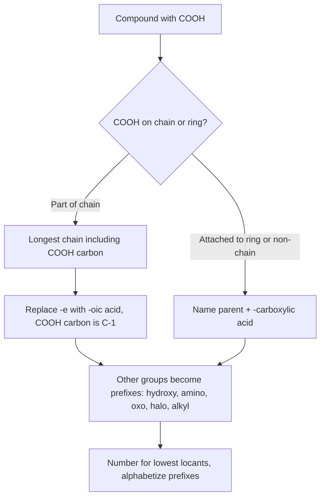
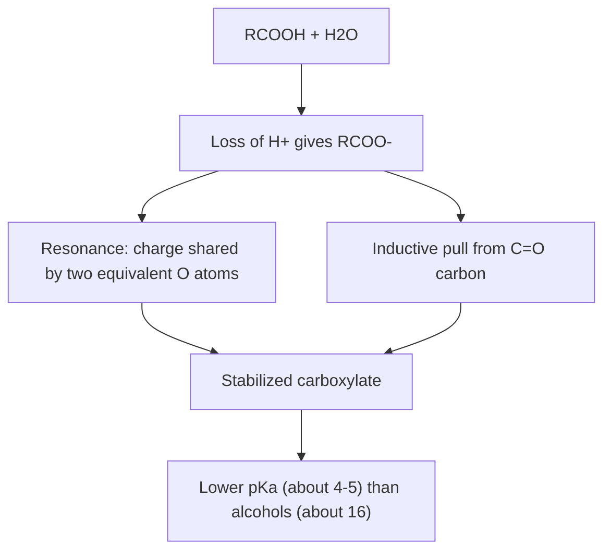
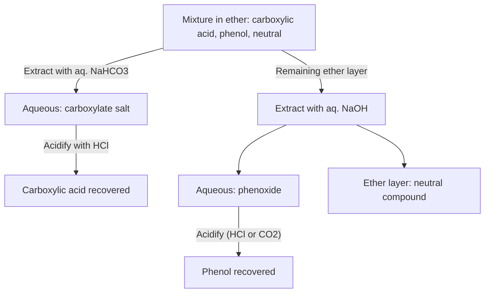

## Nomenclature and Acidity

### Overview

Carboxylic acids ($R{-}COOH$) are organic compounds whose defining feature is the **carboxyl group**, a carbonyl ($C{=}O$) and a hydroxyl ($-OH$) attached to the same carbon. The name "carboxyl" is a contraction of *carb*onyl + hydr*oxyl*. Their derivatives (acyl halides, anhydrides, esters, amides, and nitriles as a related class) replace the $-OH$ with another heteroatom group and share a common **acyl group** ($R{-}C{=}O$).

Two topics underpin everything else in this chapter:

1. **Nomenclature.** A systematic (IUPAC) and traditional (common) naming system covers the acids and every derivative class. Because carboxylic acids and their derivatives sit near the top of functional-group seniority, they set the parent name, and other groups appear as prefixes.
2. **Acidity.** Carboxylic acids are the most acidic common organic functional group (typical $pK_a$ about 4–5), far stronger than alcohols and phenols, yet weak acids compared with mineral acids. The acidity is explained by resonance stabilization of the carboxylate anion, and is finely tuned by inductive, resonance, steric, and solvation effects.

**Key Points**

- The carboxyl carbon is $sp^2$ hybridized and trigonal planar; the functional group is planar and polar.
- IUPAC names use the suffix **-oic acid** (chains) or **-carboxylic acid** (rings and non-chain attachments), with the carboxyl carbon always numbered C-1.
- Derivative names are built from the parent acid name: **-oyl halide**, **-oic anhydride**, **alkyl -oate**, **-amide**, and **-nitrile**.
- Priority order among common groups (highest first): carboxylic acids > anhydrides > esters > acyl halides > amides > nitriles > aldehydes > ketones > alcohols > amines.
- The carboxylate anion is stabilized by delocalization of negative charge over two equivalent oxygens; the $C{-}O$ bond lengths in carboxylate are equal (about 126–127 pm).
- Electron-withdrawing substituents (halogens, $-NO_2$, $-CF_3$) increase acidity; electron-donating substituents (alkyl groups) decrease it. The effect falls off rapidly with distance from the carboxyl group.
- Approximate $pK_a$ values: formic 3.75, acetic 4.76, benzoic 4.20, trifluoroacetic about 0.5, phenol about 10, ethanol about 16.

---

### Part 1: Structure of the Carboxyl Group

#### 1.1 Geometry and Bonding

- The carboxyl carbon is $sp^2$-hybridized with bond angles near 120° (about 122° for $O{=}C{-}O$ in acetic acid; exact angles vary by compound and phase).
- The group is planar because of $\pi$ overlap: the hydroxyl oxygen lone pair delocalizes into the carbonyl $\pi^*$ orbital (resonance donation), giving the C–OH bond partial double-bond character.
- Typical bond lengths in acetic acid (gas/solid phase, approximate): $C{=}O$ about 121 pm, $C{-}O$ about 131 pm. In the carboxylate anion both C–O bonds equalize at about 126 pm.
- The $O{-}H$ hydrogen prefers a **syn** conformation (the H eclipses the carbonyl oxygen side), stabilized by resonance and an electrostatic effect. The anti conformer is higher in energy by roughly 20–25 kJ/mol in the gas phase (approximate).

#### 1.2 Resonance in the Acid and in the Carboxylate

The neutral acid is described by a major structure and a minor charge-separated contributor:

$$R{-}C(=O){-}OH \longleftrightarrow R{-}\overset{+}{C}(O^-){-}OH \longleftrightarrow R{-}C(O^-){=}\overset{+}{O}H$$

The carboxylate anion has two **equivalent** resonance structures:

$$R{-}C(=O){-}O^- \longleftrightarrow R{-}C(O^-){=}O$$

The two equivalent contributors mean the negative charge is shared equally, giving a symmetric anion with bond order 1.5 for each C–O bond.

Carboxylate resonance (svg_diagram):

<svg xmlns="http://www.w3.org/2000/svg" viewBox="0 0 700 220" width="700" height="220" font-family="sans-serif" font-size="14">
<text x="350" y="22" text-anchor="middle" font-weight="bold">Carboxylate Resonance (svg_diagram)</text>
<g fill="#eef" stroke="black" stroke-width="1.2">
<rect x="40" y="60" width="180" height="60" rx="8" />
<rect x="270" y="60" width="180" height="60" rx="8" />
<rect x="500" y="60" width="160" height="60" rx="8" />
</g>
<g text-anchor="middle">
<text x="130" y="86">R–C(=O)–O⁻</text>
<text x="130" y="106" font-size="12">charge on lower O</text>
<text x="360" y="86">R–C(–O⁻)=O</text>
<text x="360" y="106" font-size="12">charge on upper O</text>
<text x="580" y="86">Hybrid</text>
<text x="580" y="106" font-size="12">R–C(O^½⁻)₂ (equal C–O)</text>
</g>
<text x="245" y="95" font-size="22" text-anchor="middle">↔</text>
<text x="475" y="95" font-size="22" text-anchor="middle">→</text>
<text x="350" y="165" text-anchor="middle" font-size="12">Two equivalent contributors: charge shared equally between two electronegative oxygens</text>
<text x="350" y="188" text-anchor="middle" font-size="12">Both C–O bonds ≈ 126 pm; bond order 1.5</text>
</svg>

---

### Part 2: IUPAC Nomenclature of Carboxylic Acids

#### 2.1 Acyclic Carboxylic Acids

**Rules**

1. Select the **longest continuous chain that includes the carboxyl carbon**.
2. Replace the terminal **-e** of the alkane name with **-oic acid**.
3. The carboxyl carbon is always **C-1** and takes no locant.
4. Number substituents from C-1, name them alphabetically, and use multiplying prefixes (di-, tri-) as needed.
5. For unsaturated acids, place the double or triple bond locant before **-en** or **-yn**, with the carboxyl carbon still C-1 (for example, but-2-enoic acid).

| Structure | IUPAC name | Common name | Origin of common name |
| --- | --- | --- | --- |
| $HCOOH$ | methanoic acid | formic acid | Latin *formica*, ant |
| $CH_3COOH$ | ethanoic acid | acetic acid | Latin *acetum*, vinegar |
| $CH_3CH_2COOH$ | propanoic acid | propionic acid | Greek *protos pion*, first fat |
| $CH_3(CH_2)_2COOH$ | butanoic acid | butyric acid | Latin *butyrum*, butter |
| $CH_3(CH_2)_3COOH$ | pentanoic acid | valeric acid | Valerian root |
| $CH_3(CH_2)_4COOH$ | hexanoic acid | caproic acid | Latin *caper*, goat |
| $CH_3(CH_2)_6COOH$ | octanoic acid | caprylic acid |  |
| $CH_3(CH_2)_{10}COOH$ | dodecanoic acid | lauric acid | Laurel oil |
| $CH_3(CH_2)_{14}COOH$ | hexadecanoic acid | palmitic acid | Palm oil |
| $CH_3(CH_2)_{16}COOH$ | octadecanoic acid | stearic acid | Greek *stear*, tallow |
| $(CH_3)_2CHCOOH$ | 2-methylpropanoic acid | isobutyric acid |  |
| $CH_2{=}CHCOOH$ | prop-2-enoic acid | acrylic acid |  |
| $CH_2{=}C(CH_3)COOH$ | 2-methylprop-2-enoic acid | methacrylic acid |  |
| $CH_3CH{=}CHCOOH$ | (2E)-but-2-enoic acid | crotonic acid |  |
| $CH_3(CH_2)_7CH{=}CH(CH_2)_7COOH$ (Z) | (9Z)-octadec-9-enoic acid | oleic acid | Olive oil |
| $CH_3(CH_2)_4CH{=}CHCH_2CH{=}CH(CH_2)_7COOH$ (Z,Z) | (9Z,12Z)-octadeca-9,12-dienoic acid | linoleic acid |  |

**Substituted examples:**

- $CH_3CHClCH_2COOH$: 3-chlorobutanoic acid.
- $(CH_3)_2C(OH)COOH$: 2-hydroxy-2-methylpropanoic acid.
- $CH_3CH(NH_2)COOH$: 2-aminopropanoic acid (alanine).

#### 2.2 Diacids and Polyacids

Dicarboxylic acids use **-dioic acid** with the final **-e** of the alkane retained (for example, "hexanedioic acid").

| Structure | IUPAC name | Common name |
| --- | --- | --- |
| $HOOC{-}COOH$ | ethanedioic acid | oxalic acid |
| $HOOCCH_2COOH$ | propanedioic acid | malonic acid |
| $HOOC(CH_2)_2COOH$ | butanedioic acid | succinic acid |
| $HOOC(CH_2)_3COOH$ | pentanedioic acid | glutaric acid |
| $HOOC(CH_2)_4COOH$ | hexanedioic acid | adipic acid |
| $HOOC(CH_2)_5COOH$ | heptanedioic acid | pimelic acid |
| (Z)-$HOOCCH{=}CHCOOH$ | (2Z)-but-2-enedioic acid | maleic acid |
| (E)-$HOOCCH{=}CHCOOH$ | (2E)-but-2-enedioic acid | fumaric acid |

A memory device for the common names of the first six saturated diacids (oxalic through adipic, then pimelic): "**O**h **M**y, **S**uch **G**reat **A**pples, **P**lease" (oxalic, malonic, succinic, glutaric, adipic, pimelic).

**Tricarboxylic acid:** citric acid is 2-hydroxypropane-1,2,3-tricarboxylic acid.

#### 2.3 Cyclic and Aromatic Acids: The -carboxylic acid Suffix

When the $-COOH$ group is attached to a ring (or otherwise cannot be counted in the parent chain), append **-carboxylic acid** to the name of the ring or parent structure. The ring atom bearing $-COOH$ is C-1.

| Structure | IUPAC name |
| --- | --- |
| Cyclohexane with $-COOH$ | cyclohexanecarboxylic acid |
| Cyclopentane with $-COOH$ | cyclopentanecarboxylic acid |
| Benzene with $-COOH$ | benzoic acid (retained IUPAC name; systematic: benzenecarboxylic acid) |
| Pyridine with $-COOH$ at C-3 | pyridine-3-carboxylic acid (nicotinic acid) |
| Naphthalene with $-COOH$ at C-2 | naphthalene-2-carboxylic acid |
| Cyclohexane-1,2-dicarboxylic acid | cyclohexane-1,2-dicarboxylic acid |

**Retained names for substituted benzoic acids:**

| Structure | Name |
| --- | --- |
| $o$-$HOC_6H_4COOH$ | 2-hydroxybenzoic acid (salicylic acid) |
| $p$-$H_2NC_6H_4COOH$ | 4-aminobenzoic acid (PABA) |
| $o$-$CH_3COOC_6H_4COOH$ | 2-(acetyloxy)benzoic acid (acetylsalicylic acid, aspirin) |
| $o$-$C_6H_4(COOH)_2$ | benzene-1,2-dicarboxylic acid (phthalic acid) |
| $m$-$C_6H_4(COOH)_2$ | benzene-1,3-dicarboxylic acid (isophthalic acid) |
| $p$-$C_6H_4(COOH)_2$ | benzene-1,4-dicarboxylic acid (terephthalic acid) |
| $C_6H_5CH_2COOH$ | 2-phenylethanoic acid or phenylacetic acid |
| $C_6H_5CH{=}CHCOOH$ | (2E)-3-phenylprop-2-enoic acid (cinnamic acid) |

**Positions in common nomenclature** use Greek letters: the carbon adjacent to the carboxyl carbon is **α**, the next **β**, then **γ**, **δ**, and so on. $CH_3CHClCOOH$ is α-chloropropionic acid (IUPAC: 2-chloropropanoic acid), and $ClCH_2CH_2COOH$ is β-chloropropionic acid (3-chloropropanoic acid). In the IUPAC system, numerals count from the carboxyl carbon (C-1), whereas in the common system Greek letters start at the α carbon (C-2), so the correspondence is α = C-2, β = C-3, γ = C-4.

#### 2.4 Polyfunctional Compounds: Priority and Prefixes

Because the carboxyl group sits at the top of the common priority list, other groups become prefixes:

| Group present | Prefix when a carboxylic acid is the principal group |
| --- | --- |
| $-OH$ | hydroxy- |
| $-NH_2$ | amino- |
| $C{=}O$ (ketone, in chain) | oxo- |
| $-CHO$ | oxo- (chain) or formyl- (attached) |
| $-OR$ | alkoxy- |
| $-X$ | fluoro-, chloro-, bromo-, iodo- |
| $-NO_2$ | nitro- |
| $-CN$ | cyano- |

| Structure | Name |
| --- | --- |
| $CH_3COCOOH$ | 2-oxopropanoic acid (pyruvic acid) |
| $CH_3COCH_2COOH$ | 3-oxobutanoic acid (acetoacetic acid) |
| $HOOC{-}CH_2{-}CO{-}CH_2{-}COOH$ | 3-oxopentanedioic acid |
| $HOCH_2COOH$ | 2-hydroxyethanoic acid (glycolic acid) |
| $CH_3CH(OH)COOH$ | 2-hydroxypropanoic acid (lactic acid) |
| $HOOCCH(OH)CH(OH)COOH$ | 2,3-dihydroxybutanedioic acid (tartaric acid) |
| $HOOCCH_2C(OH)(COOH)CH_2COOH$ | 2-hydroxypropane-1,2,3-tricarboxylic acid (citric acid) |
| 4-$HOC_6H_4COOH$ | 4-hydroxybenzoic acid |

**Seniority order of functional groups (highest first, as principal characteristic groups):**

$$\text{acids} > \text{anhydrides} > \text{esters} > \text{acyl halides} > \text{amides} > \text{nitriles} > \text{aldehydes} > \text{ketones} > \text{alcohols} > \text{amines} > \text{alkenes/alkynes} > \text{alkanes/halides/ethers}$$

Halides, ethers, nitro groups, and alkyl substituents are never principal groups and always appear as prefixes.

---

### Part 3: Nomenclature of Carboxylic Acid Derivatives

All derivatives contain the acyl group $R{-}CO{-}$ and are named by modifying the parent acid name.

#### 3.1 Acyl Groups

The acyl group name replaces **-ic acid** (common) with **-yl** or **-oic acid** (IUPAC) with **-oyl**.

| Acid | Acyl group | Acyl group name |
| --- | --- | --- |
| Ethanoic (acetic) acid | $CH_3CO-$ | ethanoyl or acetyl |
| Propanoic acid | $CH_3CH_2CO-$ | propanoyl |
| Benzoic acid | $C_6H_5CO-$ | benzoyl |
| Methanoic (formic) acid | $HCO-$ | formyl |
| Butanoic acid | $CH_3(CH_2)_2CO-$ | butanoyl |

#### 3.2 Acyl Halides (Acid Halides)

Replace **-ic acid** with **-yl halide** (common) or **-oic acid** with **-oyl halide** (IUPAC). For ring attachment, replace **-carboxylic acid** with **-carbonyl halide**.

| Structure | IUPAC name | Common name |
| --- | --- | --- |
| $CH_3COCl$ | ethanoyl chloride | acetyl chloride |
| $CH_3CH_2COBr$ | propanoyl bromide | propionyl bromide |
| $C_6H_5COCl$ | benzoyl chloride | benzoyl chloride |
| $(CH_3)_2CHCOCl$ | 2-methylpropanoyl chloride | isobutyryl chloride |
| Cyclohexyl-$COCl$ | cyclohexanecarbonyl chloride |  |
| $ClOC(CH_2)_4COCl$ | hexanedioyl dichloride | adipoyl chloride |

#### 3.3 Acid Anhydrides

Replace the word **acid** with **anhydride**. Symmetrical anhydrides use the acid name once; mixed anhydrides list the two acid names alphabetically.

| Structure | IUPAC name | Common name |
| --- | --- | --- |
| $(CH_3CO)_2O$ | ethanoic anhydride | acetic anhydride |
| $(C_6H_5CO)_2O$ | benzoic anhydride | benzoic anhydride |
| $CH_3CO{-}O{-}COCH_2CH_3$ | ethanoic propanoic anhydride | acetic propionic anhydride |
| Cyclic from succinic acid | oxolane-2,5-dione | succinic anhydride |
| Cyclic from maleic acid | furan-2,5-dione | maleic anhydride |
| Cyclic from phthalic acid | 2-benzofuran-1,3-dione | phthalic anhydride |

Cyclic anhydrides form easily from 1,4- and 1,5-diacids (five- and six-membered rings) by heating.

#### 3.4 Esters

**Rule.** Name the alkyl (or aryl) group on oxygen first as a separate word, then the acid-derived portion with **-ic acid → -ate** (common) or **-oic acid → -oate** (IUPAC).

| Structure | IUPAC name | Common name |
| --- | --- | --- |
| $HCOOCH_3$ | methyl methanoate | methyl formate |
| $CH_3COOCH_2CH_3$ | ethyl ethanoate | ethyl acetate |
| $CH_3COOC_6H_5$ | phenyl ethanoate | phenyl acetate |
| $C_6H_5COOCH_3$ | methyl benzoate | methyl benzoate |
| $CH_3CH_2CH_2COOCH_2CH_3$ | ethyl butanoate | ethyl butyrate (pineapple) |
| $CH_3COO(CH_2)_4CH_3$ | pentyl ethanoate | amyl acetate (banana) |
| $CH_2{=}CHCOOCH_3$ | methyl prop-2-enoate | methyl acrylate |
| $CH_3COOC(CH_3)_3$ | 1,1-dimethylethyl ethanoate or tert-butyl ethanoate | tert-butyl acetate |

**Cyclic esters (lactones)** are named as oxacycloalkanones (IUPAC) or by the parent acid with **-olactone** (common):

| Ring size | Common name | IUPAC-type name |
| --- | --- | --- |
| Four-membered | β-propiolactone | oxetan-2-one |
| Five-membered | γ-butyrolactone | oxolan-2-one |
| Six-membered | δ-valerolactone | oxan-2-one |
| Seven-membered | ε-caprolactone | oxepan-2-one |

Greek-letter prefixes (β, γ, δ, ε) indicate the position of the carbon bearing the ring oxygen relative to the carbonyl.

**Esters as substituents.** When an ester is not the principal group, it is named with **alkoxycarbonyl-** (for $-COOR$) or **acyloxy-** (for $-OCOR$) prefixes:

| Structure | Name |
| --- | --- |
| $CH_3OCO{-}CH_2CH_2{-}COOH$ | 4-methoxy-4-oxobutanoic acid (or 3-(methoxycarbonyl)propanoic acid) |
| $CH_3COO{-}CH_2CH_2{-}COOH$ | 3-(acetyloxy)propanoic acid |

#### 3.5 Amides

Replace **-ic acid** or **-oic acid** with **-amide**; **-carboxylic acid** becomes **-carboxamide**. Substituents on nitrogen are indicated with the locant **N-** (or **N,N-** for two substituents).

| Structure | IUPAC name | Common name |
| --- | --- | --- |
| $HCONH_2$ | methanamide | formamide |
| $CH_3CONH_2$ | ethanamide | acetamide |
| $CH_3CONHCH_3$ | N-methylethanamide | N-methylacetamide |
| $CH_3CON(CH_3)_2$ | N,N-dimethylethanamide | N,N-dimethylacetamide (DMAc) |
| $HCON(CH_3)_2$ | N,N-dimethylmethanamide | N,N-dimethylformamide (DMF) |
| $C_6H_5CONH_2$ | benzamide | benzamide |
| $C_6H_5CONHC_6H_5$ | N-phenylbenzamide | benzanilide |
| $CH_3CONHC_6H_5$ | N-phenylethanamide | acetanilide |
| $H_2NCONH_2$ | urea, carbonic diamide | urea |
| Cyclohexane-$CONH_2$ | cyclohexanecarboxamide |  |
| $H_2NCO(CH_2)_4CONH_2$ | hexanediamide | adipamide |

**Cyclic amides (lactams)** are named as azacycloalkanones or with **-lactam**:

| Ring size | Common name | Note |
| --- | --- | --- |
| Four-membered | β-lactam (azetidin-2-one) | Core of penicillins and cephalosporins |
| Five-membered | γ-butyrolactam (pyrrolidin-2-one) | Precursor to N-vinylpyrrolidone |
| Six-membered | δ-valerolactam (piperidin-2-one) |  |
| Seven-membered | ε-caprolactam (azepan-2-one) | Monomer for nylon-6 |

**Imides** contain two acyl groups on one nitrogen: $R{-}CO{-}NH{-}CO{-}R$. Cyclic imides include succinimide (pyrrolidine-2,5-dione) and phthalimide (isoindoline-1,3-dione).

**Amide as substituent:** *carbamoyl-* ($-CONH_2$) or *acylamino-* ($-NHCOR$, for example, acetamido).

#### 3.6 Nitriles

Nitriles ($R{-}C{\equiv}N$) are classed with carboxylic acid derivatives because hydrolysis gives the acid.

- **Acyclic:** add **-nitrile** to the full alkane name (the nitrile carbon is C-1 and counts in the chain): $CH_3CN$ is ethanenitrile (acetonitrile); $CH_3CH_2CN$ is propanenitrile; $CH_2{=}CHCN$ is prop-2-enenitrile (acrylonitrile).
- **Ring attachment:** **-carbonitrile**: $C_6H_{11}CN$ is cyclohexanecarbonitrile; $C_6H_5CN$ is benzonitrile.
- **Common names:** replace **-ic acid** with **-onitrile**: acetonitrile, propionitrile, benzonitrile.
- **As a prefix:** *cyano-* when a higher-priority group is present, for example, 3-cyanobenzoic acid.

#### 3.7 Summary Table of Suffixes

| Class | General formula | Suffix (chain) | Suffix (ring) | Prefix (substituent) |
| --- | --- | --- | --- | --- |
| Carboxylic acid | $RCOOH$ | -oic acid | -carboxylic acid | carboxy- |
| Acyl halide | $RCOX$ | -oyl halide | -carbonyl halide | halocarbonyl- |
| Anhydride | $(RCO)_2O$ | -oic anhydride | -carboxylic anhydride | (none, named as a whole) |
| Ester | $RCOOR'$ | alkyl -oate | alkyl -carboxylate | alkoxycarbonyl- / acyloxy- |
| Amide | $RCONH_2$ | -amide | -carboxamide | carbamoyl- / acylamino- |
| Nitrile | $RCN$ | -nitrile | -carbonitrile | cyano- |
| Carboxylate salt | $RCOO^-M^+$ | metal -oate | metal -carboxylate | (named as a salt) |

**Salts of carboxylic acids** are named cation first, then the anion with **-oate**: $CH_3COONa$ is sodium ethanoate (sodium acetate); $(CH_3COO)_2Ca$ is calcium ethanoate.

---

### Part 4: Structural Isomerism and Stereochemistry

**Isomers of $C_4H_8O_2$ (carboxylic acids and esters):**

| Structure | Class | Name |
| --- | --- | --- |
| $CH_3CH_2CH_2COOH$ | Acid | butanoic acid |
| $(CH_3)_2CHCOOH$ | Acid | 2-methylpropanoic acid |
| $CH_3CH_2COOCH_3$ | Ester | methyl propanoate |
| $CH_3COOCH_2CH_3$ | Ester | ethyl ethanoate |
| $HCOOCH_2CH_2CH_3$ | Ester | propyl methanoate |
| $HCOOCH(CH_3)_2$ | Ester | 1-methylethyl methanoate (isopropyl formate) |

Acids and esters of the same carbon count are **functional group isomers**.

**Stereochemistry.**

- α-Substituted acids can be chiral: lactic acid (2-hydroxypropanoic acid) exists as (R)- and (S)-enantiomers; (S)-lactic acid is the biological L-(+)-lactic acid.
- α,β-Unsaturated acids show **E/Z isomerism**: maleic acid (Z) versus fumaric acid (E). The Z isomer forms a cyclic anhydride upon heating; the E isomer cannot.
- Tartaric acid has two stereocenters and exists as (R,R), (S,S), and the achiral **meso** (R,S) form.

---

### Part 5: Acidity of Carboxylic Acids

#### 5.1 Dissociation Equilibrium and $pK_a$

$$RCOOH + H_2O \rightleftharpoons RCOO^- + H_3O^+$$

$$K_a = \frac{[RCOO^-][H_3O^+]}{[RCOOH]}, \qquad pK_a = -\log_{10} K_a$$

A lower $pK_a$ means a stronger acid. Each unit of $pK_a$ corresponds to a tenfold change in $K_a$.

Note that in dilute solution of typical carboxylic acids, only a small fraction ionizes: for 0.1 M acetic acid, the degree of ionization is about 1.3%, and $[H_3O^+] \approx \sqrt{K_a C} = \sqrt{(1.75\times10^{-5})(0.1)} \approx 1.3\times10^{-3}$ M (pH about 2.9).

#### 5.2 Comparison Across Functional Groups

| Compound class | Representative | Approximate $pK_a$ |
| --- | --- | --- |
| Sulfonic acid | $CH_3SO_3H$ | about −2 |
| Mineral acid | $HCl$ | about −7 |
| Trifluoroacetic acid | $CF_3COOH$ | about 0.5 |
| Carboxylic acid | $CH_3COOH$ | 4.76 |
| Carbonic acid (first dissociation, effective) | $H_2CO_3$ | about 6.4 |
| Phenol | $C_6H_5OH$ | about 10.0 |
| Water | $H_2O$ | 15.7 |
| Alcohol | $CH_3CH_2OH$ | about 16 |
| Terminal alkyne | $HC{\equiv}CH$ | about 25 |
| Ammonia | $NH_3$ | about 38 |
| Alkane | $CH_3CH_3$ | about 50 |

Values are approximate and differ slightly across sources and measurement conditions (water, 25 °C).

**Why carboxylic acids are about $10^{11}$ times more acidic than alcohols:**

1. **Resonance stabilization of the carboxylate anion.** The negative charge is delocalized equally over two oxygen atoms; alkoxides have the charge localized on one oxygen.
2. **Inductive effect of the carbonyl.** The $C{=}O$ carbon is electron-poor, pulling electron density from the O–H bond and stabilizing the anion.
3. **Resonance in the acid itself** slightly stabilizes the acid, but this effect is smaller than the stabilization of the anion; the net result favors ionization.

**Why carboxylic acids are stronger than phenols:** phenoxide delocalization places charge partly on less electronegative carbon atoms and disrupts the aromatic ring in the contributing forms; carboxylate delocalizes charge onto two equivalent, highly electronegative oxygens with no loss of aromaticity or other stabilization.

#### 5.3 Thermodynamic Analysis

Acidity depends on $\Delta G^\circ_{ion} = -RT\ln K_a$, which combines enthalpic and entropic terms including **solvation**. In water, ionization of acetic acid is almost thermoneutral in enthalpy ($\Delta H \approx -0.1$ kJ/mol at 25 °C; approximate) and the free-energy cost is dominated by the negative entropy of ordering of water around the ions (electrostriction). In the gas phase, acids are far weaker than in water because the anion lacks solvent stabilization; gas-phase acidity trends can differ from aqueous trends (in the gas phase, larger alkyl groups make acids *stronger* through polarizability, the reverse of aqueous behavior, showing that solvation contributes significantly to the aqueous order).

#### 5.4 Substituent Effects on Acidity

**Inductive effects (through-bond, through σ-framework).**

| Substituent (α-position) | Acid | $pK_a$ (approx.) |
| --- | --- | --- |
| $H$ | $CH_3COOH$ | 4.76 |
| $I$ | $ICH_2COOH$ | 3.18 |
| $Br$ | $BrCH_2COOH$ | 2.87 |
| $Cl$ | $ClCH_2COOH$ | 2.86 |
| $F$ | $FCH_2COOH$ | 2.59 |
| $OH$ | $HOCH_2COOH$ | 3.83 |
| $OCH_3$ | $CH_3OCH_2COOH$ | 3.57 |
| $NO_2$ | $O_2NCH_2COOH$ | 1.68 |
| $CN$ | $NCCH_2COOH$ | 2.47 |
| $CH_3$ (propanoic) | $CH_3CH_2COOH$ | 4.87 |
| $(CH_3)_3C$ (pivalic-type effect) | $(CH_3)_3CCOOH$ | 5.03 |

Electron-withdrawing groups **stabilize the carboxylate** by pulling charge density away, increasing acidity. Electron-donating alkyl groups destabilize the anion (and have weaker solvation), decreasing acidity slightly.

**Number of electron-withdrawing groups (cumulative effect):**

| Acid | $pK_a$ (approx.) |
| --- | --- |
| Acetic, $CH_3COOH$ | 4.76 |
| Chloroacetic, $ClCH_2COOH$ | 2.86 |
| Dichloroacetic, $Cl_2CHCOOH$ | 1.29 |
| Trichloroacetic, $Cl_3CCOOH$ | 0.65 |
| Trifluoroacetic, $F_3CCOOH$ | about 0.23–0.5 (values vary) |

Each additional chlorine lowers $pK_a$ by about 1.5–2 units in the early steps, with diminishing increments.

**Distance dependence.** The inductive effect attenuates roughly by a factor of about 2–3 per intervening carbon:

| Acid | $pK_a$ (approx.) |
| --- | --- |
| $CH_3CH_2CH_2COOH$ (butanoic) | 4.82 |
| $CH_3CH_2CHClCOOH$ (2-chlorobutanoic) | 2.84 |
| $CH_3CHClCH_2COOH$ (3-chlorobutanoic) | 4.06 |
| $ClCH_2CH_2CH_2COOH$ (4-chlorobutanoic) | 4.52 |

The α-chlorine has the strongest effect; by the γ-carbon the effect is small.

**Hybridization of the attached carbon.** Greater s-character on the carbon attached to the carboxyl group (more electronegative) increases acidity: propiolic acid ($HC{\equiv}C{-}COOH$, $pK_a$ about 1.9) > acrylic acid (4.25) > propanoic acid (4.87).

#### 5.5 Aromatic Carboxylic Acids

**Benzoic acid ($pK_a$ 4.20)** is more acidic than acetic acid (4.76) and cyclohexanecarboxylic acid (4.9), because the $sp^2$ ring carbon is more electron-withdrawing (inductive) than an $sp^3$ carbon, while the ring's resonance donation to the carboxyl is only weak in the acid.

**Substituent effects on benzoic acid:**

| Substituent | Ortho | Meta | Para | Explanation |
| --- | --- | --- | --- | --- |
| $H$ (benzoic acid) | 4.20 | 4.20 | 4.20 | Reference |
| $CH_3$ | 3.91 | 4.27 | 4.36 | Para/meta: donor ($+I$, hyperconjugation) lowers acidity; ortho: steric effect increases acidity |
| $OCH_3$ | 4.09 | 4.09 | 4.47 | Para: strong $+M$ donation lowers acidity; meta: $-I$ increases it slightly |
| $Cl$ | 2.94 | 3.83 | 3.99 | $-I$ effect dominant; strongest ortho |
| $NO_2$ | 2.17 | 3.45 | 3.44 | $-I$ and $-M$ (ortho, para) stabilize the anion |
| $OH$ | 2.98 | 4.08 | 4.58 | Ortho: intramolecular H-bond stabilizes the anion (salicylate) |
| $NH_2$ | 4.98 | 4.79 | 4.92 | Donor by resonance; weakens acidity |
| $CF_3$ | 3.79 | 3.79 | 3.6 | Strong $-I$ |

Approximate values; sources differ.

**Ortho effect.** Almost all ortho substituents (regardless of electronic nature) increase the acidity of benzoic acid relative to the meta and para isomers. Contributing factors: (1) **steric inhibition of resonance**: the bulky ortho group twists the carboxyl group out of the ring plane, removing conjugation of the carboxylic acid with the ring (which destabilizes the acid form relative to the anion, since resonance donation from the ring stabilizes the neutral acid but is less important for the anion); (2) through-space field effects; (3) intramolecular hydrogen bonding in the anion for ortho-OH (salicylate) and related groups.

**Hammett relationship.** For meta- and para-substituted benzoic acids, the acidity is quantified by the **Hammett equation**:

$$\log\frac{K}{K_0} = \sigma\rho$$

where $\sigma$ is the substituent constant (positive for electron-withdrawing groups) and $\rho$ is the reaction constant ($\rho = 1.00$ by definition for ionization of benzoic acids in water at 25 °C). Larger positive $\sigma$ means a stronger acid. Representative $\sigma$ values: $p$-$NO_2$ +0.78, $p$-$Cl$ +0.23, $m$-$Cl$ +0.37, $p$-$CH_3$ −0.17, $p$-$OCH_3$ −0.27.

#### 5.6 Dicarboxylic Acids and Multiple Ionization

Diacids have two ionization constants, $pK_{a1}$ and $pK_{a2}$:

| Diacid | $pK_{a1}$ | $pK_{a2}$ | Comment |
| --- | --- | --- | --- |
| Oxalic | 1.25 | 4.27 | Strong first ionization: the second $COOH$ is a powerful electron-withdrawing group |
| Malonic | 2.85 | 5.70 |  |
| Succinic | 4.21 | 5.64 |  |
| Glutaric | 4.34 | 5.27 |  |
| Adipic | 4.41 | 5.41 |  |
| Maleic (Z) | 1.83 | 6.07 | Large gap: intramolecular H-bond stabilizes the monoanion and makes the second $H^+$ harder to remove |
| Fumaric (E) | 3.03 | 4.44 | Small gap: no intramolecular H-bond |
| Phthalic | 2.94 | 5.43 |  |
| Carbonic (true) | about 3.6 | about 10.3 | Effective $pK_{a1}$ 6.35 accounts for dissolved $CO_2$ |
| Citric (three) | 3.13 | 4.76 | $pK_{a3}$ = 6.40 |

**Trends.**

- $pK_{a1}$ is always lower than the monoacid analog (electron-withdrawing effect of the second $COOH$ and a statistical factor of 2).
- $pK_{a2}$ is always higher than $pK_{a1}$, because removing a proton from an already negatively charged species is harder (electrostatic repulsion).
- The difference $pK_{a2} - pK_{a1}$ shrinks as the two carboxyl groups move farther apart (oxalic, difference about 3.0; adipic, about 1.0).
- Maleic vs fumaric acid shows the influence of geometry: in the Z isomer the two carboxyl groups are close, giving a large $pK_{a1}$ (strong first ionization from field effect and stabilization of the monoanion through intramolecular H-bonding) and a large $pK_{a2}$.

#### 5.7 Solvent, Temperature, and Ionic-Strength Effects

- $pK_a$ values quoted for water at 25 °C. In DMSO, acids are far weaker (acetic acid $pK_a$ about 12.3 in DMSO) because DMSO solvates anions poorly.
- Temperature changes shift $pK_a$ slightly; for acetic acid, $pK_a$ passes through a minimum near 25 °C (values approximately 4.76 at 25 °C).
- Ionic strength alters activity coefficients; concentration constants differ from thermodynamic constants.
- Hydrogen-bonded **dimers** exist in non-polar solvents and in the gas phase (acetic acid dimer, about 60–65 kJ/mol for two hydrogen bonds), which raises boiling points and affects apparent acidity measurements in non-aqueous media.

---

### Part 6: Acid–Base Behavior in Practice

#### 6.1 Salt Formation and Solubility

Carboxylic acids react with bases to form carboxylate salts:

$$RCOOH + NaOH \rightarrow RCOO^-Na^+ + H_2O$$

$$RCOOH + NaHCO_3 \rightarrow RCOO^-Na^+ + H_2O + CO_2\uparrow$$

- Carboxylic acids (pKa about 4–5) are strong enough to react with sodium bicarbonate (conjugate acid $H_2CO_3$, effective $pK_a$ about 6.4), liberating effervescent $CO_2$. Most phenols ($pK_a$ about 10) do not.
- Salts of low-molecular-weight acids are water-soluble; long-chain fatty acid sodium and potassium salts are **soaps** (amphiphilic, forming micelles). Calcium and magnesium salts are insoluble (soap scum).
- Regeneration of the free acid: acidify with a strong acid (usually $HCl$).

$$RCOO^-Na^+ + HCl \rightarrow RCOOH + NaCl$$

#### 6.2 Extraction Scheme (Separating Acidic, Phenolic, and Neutral Compounds)

#### 6.3 Buffers and the Henderson–Hasselbalch Equation

A mixture of a carboxylic acid and its conjugate base resists changes in pH:

$$pH = pK_a + \log\frac{[RCOO^-]}{[RCOOH]}$$

- When $[RCOO^-] = [RCOOH]$, $pH = pK_a$.
- Acetate buffers are effective from about pH 3.8 to 5.8 (within about ±1 unit of $pK_a$).
- At physiological pH 7.4, essentially all carboxylic acids (pKa about 3–5) exist as carboxylate anions; the ionized fraction at pH 7.4 for acetic acid is $1/(1+10^{4.76-7.4}) \approx 99.8\%$. This governs biological behavior of amino acids, fatty acids, and drugs such as aspirin and ibuprofen.

**Example calculation.** Prepare a buffer of pH 5.00 from acetic acid ($pK_a = 4.76$):

$$5.00 = 4.76 + \log\frac{[A^-]}{[HA]} \implies \frac{[A^-]}{[HA]} = 10^{0.24} = 1.74$$

So the acetate/acetic acid ratio must be about 1.74:1.

#### 6.4 Amino Acids as a Special Case

Amino acids contain both $-COOH$ ($pK_a$ about 2) and $-NH_3^+$ ($pK_a$ about 9–10). In water they exist as **zwitterions** ($^+H_3N{-}CHR{-}COO^-$) near neutral pH, and the isoelectric point (pI) is the average of the two relevant $pK_a$ values (for amino acids with a neutral side chain).

---

### Part 7: Worked Examples

**Example 1: Name the compound $CH_3CH(CH_3)CH_2CH_2COOH$**

1. Longest chain including the carboxyl carbon: five carbons (pentane).
2. Numbering from the $COOH$ carbon: C-1 ($COOH$), C-2 ($CH_2$), C-3 ($CH_2$), C-4 ($CH$ with methyl), C-5 ($CH_3$).
3. Name: **4-methylpentanoic acid** (common: γ-methylvaleric acid; isocaproic acid).

**Example 2: Name $HOOC{-}CH_2{-}CH(CH_3){-}CH_2{-}COOH$**

- Diacid, five-carbon chain including both carboxyls: pentanedioic acid, methyl at C-3.
- Name: **3-methylpentanedioic acid** (3-methylglutaric acid).

**Example 3: Name a polyfunctional compound $CH_3CH(OH)CH_2COOCH_3$**

- Ester is the principal group (esters outrank alcohols). The acid part is a four-carbon chain with $-OH$ on C-3; the alkyl group is methyl.
- Name: **methyl 3-hydroxybutanoate**.

**Example 4: Name $C_6H_5CH_2CONH_2$ and $C_6H_5CON(CH_3)_2$**

- $C_6H_5CH_2CONH_2$: **2-phenylethanamide** (phenylacetamide).
- $C_6H_5CON(CH_3)_2$: **N,N-dimethylbenzamide**.

**Example 5: Name the anhydride from two acids**

$CH_3CO{-}O{-}COC_6H_5$ is **benzoic ethanoic anhydride** (alphabetical: benzoic before ethanoic) or acetic benzoic anhydride in common nomenclature.

**Example 6: Rank acidity**

Rank: acetic acid, chloroacetic acid, trichloroacetic acid, propanoic acid, benzoic acid, phenol.

| Compound | $pK_a$ (approx.) |
| --- | --- |
| Trichloroacetic acid | 0.65 |
| Chloroacetic acid | 2.86 |
| Benzoic acid | 4.20 |
| Acetic acid | 4.76 |
| Propanoic acid | 4.87 |
| Phenol | 10.0 |

**Output:** trichloroacetic > chloroacetic > benzoic > acetic > propanoic > phenol.

**Example 7: Explain why $p$-nitrobenzoic acid is more acidic than benzoic acid, and $p$-methoxybenzoic acid is less acidic**

- $p$-$NO_2$: strong $-I$ and $-M$ effects withdraw electron density from the ring and carboxylate, stabilizing the anion ($pK_a$ 3.44).
- $p$-$OCH_3$: strong $+M$ donation (outweighing the small $-I$ at para) pushes electron density toward the carboxyl group, destabilizing the anion ($pK_a$ 4.47).

**Example 8: Compare maleic and fumaric acid**

- Maleic acid ($pK_{a1}$ 1.83, $pK_{a2}$ 6.07); fumaric acid ($pK_{a1}$ 3.03, $pK_{a2}$ 4.44).
- In the Z isomer, the monoanion is stabilized by a strong **intramolecular hydrogen bond** between the carboxylate and the remaining $COOH$, which makes the first ionization easier (lower $pK_{a1}$) and the second more difficult (higher $pK_{a2}$). In the E isomer the groups are far apart and no such bond forms.

**Example 9: Calculate the pH of 0.10 M acetic acid**

$K_a = 1.75\times10^{-5}$. With $x = [H_3O^+]$: $x^2/(0.10 - x) = 1.75\times10^{-5}$; approximating $0.10 - x \approx 0.10$ gives $x = 1.32\times10^{-3}$ M, so $pH = 2.88$. The ionization fraction is 1.3%, so the approximation is valid.

**Example 10: Predict the direction of reaction**

Does acetic acid ($pK_a$ 4.76) react with sodium phenoxide (phenol $pK_a$ 10)? Yes: the equilibrium constant is $K = 10^{10 - 4.76} = 10^{5.24}$, strongly favoring formation of phenol and acetate. Conversely, phenol does not react appreciably with sodium acetate.

**Example 11: Explain why the fluoro-substituted acid is stronger than the iodo-substituted**

Fluorine is more electronegative than iodine, giving a larger inductive effect: $pK_a$ of $FCH_2COOH$ 2.59 vs $ICH_2COOH$ 3.18. The trend follows electronegativity ($F > Cl > Br > I$), although the Cl and Br values are nearly equal because other factors (polarizability, solvation) intervene.

---

### Part 8: Spectroscopic Identification Related to Structure

| Technique | Carboxylic acid | Comment |
| --- | --- | --- |
| IR: O–H stretch | Very broad, ~2500–3300 cm⁻¹ (overlaps C–H region) | Hydrogen-bonded dimer |
| IR: C=O stretch | ~1700–1725 cm⁻¹ (dimer); ~1760 cm⁻¹ (monomer, dilute, non-polar solvent) | Conjugation lowers by ~20–30 cm⁻¹ |
| IR: carboxylate | Asymmetric ~1550–1610 cm⁻¹, symmetric ~1400 cm⁻¹ | Both bands, no C=O near 1710 |
| $^1H$ NMR: $COOH$ | δ ~10–13 ppm, broad, exchangeable with $D_2O$ | Concentration and solvent dependent |
| $^1H$ NMR: α-$CH$ | δ ~2.0–2.6 ppm | Deshielded by carbonyl |
| $^{13}C$ NMR: carboxyl carbon | δ ~165–185 ppm | Upfield of ketones and aldehydes (~190–215 ppm) |
| Mass spectrometry | Loss of $OH$ (M−17), $COOH$ (M−45); McLafferty rearrangement for chains with γ-H | Diagnostic fragments |

**Derivative carbonyl IR (typical):** acyl chloride ~1800 cm⁻¹; anhydride ~1820 and 1760 cm⁻¹ (two bands); ester ~1735–1750 cm⁻¹; carboxylic acid ~1710 cm⁻¹; amide ~1650–1690 cm⁻¹ (amide I); nitrile $C{\equiv}N$ ~2210–2260 cm⁻¹. This carbonyl stretch trend reflects resonance donation from the substituent (stronger donors lower the frequency) versus inductive withdrawal (stronger withdrawal raises it).

---

### Part 9: Physical Properties Linked to Structure

- **Hydrogen bonding and dimerization.** Carboxylic acids form cyclic hydrogen-bonded **dimers** in non-polar solvents, in the pure liquid, and in the gas phase. This gives unusually high boiling points relative to alcohols of similar molar mass (acetic acid bp 118 °C; propan-1-ol bp 97 °C; butane bp about −1 °C).
- **Water solubility.** Acids up to about four carbons are miscible with water; solubility falls rapidly with chain length. Aromatic and long-chain fatty acids are poorly soluble but dissolve as their salts.
- **Melting points.** Even-carbon-numbered straight-chain acids melt higher than the neighboring odd-carbon acids (alternation, from crystal packing). Diacids have high melting points because of extended hydrogen bonding.
- **Odor.** Short-chain acids have sharp or unpleasant odors (butyric acid: rancid butter; caproic acid: goat); esters, in contrast, are fragrant.

| Compound | Boiling point (°C, approx.) |
| --- | --- |
| Acetic acid | 118 |
| Propanoic acid | 141 |
| Butanoic acid | 164 |
| Benzoic acid (mp 122 °C) | 249 |
| Methyl acetate | 57 |
| Acetamide (mp 82 °C) | 221 |
| Acetyl chloride | 51 |

Amides have very high melting and boiling points because of extensive N–H···O=C hydrogen bonding; tertiary amides (no N–H) have lower values.

---

### Part 10: Common Errors in Nomenclature and Acidity

**Nomenclature**

- Choosing the longest chain without including the carboxyl carbon; the parent chain **must include** the $COOH$ carbon.
- Assigning a locant to the carboxyl carbon (always C-1, no locant).
- Using **-carboxylic acid** for a chain acid or **-oic acid** for a ring acid.
- Omitting the letter **e** in diacid names ("butanedioic", not "butandioic", since the "e" is retained before a consonant suffix beginning with "d").
- Failing to name the alkyl group **first** in esters (methyl ethanoate, not ethanoate methyl).
- Writing an N-substituent without the **N-** locant in amides.
- Confusing the lettering systems (Greek letters in common names versus numerals in IUPAC).
- Forgetting that nitrile carbon counts as part of the chain for **-nitrile** names.

**Acidity**

- Assuming alcohols and carboxylic acids have similar acidity because both contain $-OH$.
- Forgetting that acid strength is determined by **conjugate base stability**.
- Applying the inductive effect without regard to distance (it decays rapidly).
- Overlooking that the ortho effect increases acidity of nearly all ortho-substituted benzoic acids.
- Treating $pK_a$ differences as small when they represent orders of magnitude.
- Using the equation $pH = -\log C$ for weak acids (they only partially ionize).
- Forgetting that in diacids, $pK_{a2} > pK_{a1}$ and that the gap depends on the distance and geometry between the carboxyl groups.
- Confusing acidity of the O–H with acidity of the α-C–H; the α-hydrogens of carboxylic acids are much less acidic ($pK_a$ about 25 for the carbon, and the acidic O–H is removed first).

**Conclusion**

Carboxylic acids and their derivatives share a common acyl framework, and their nomenclature follows a consistent set of transformations of the parent acid name: **-oic acid**, **-oyl halide**, **-oic anhydride**, **alkyl -oate**, **-amide**, and **-nitrile**, with **-carboxylic acid**, **-carbonyl halide**, **-carboxylate**, **-carboxamide**, and **-carbonitrile** used for ring attachments. Because these groups rank near the top of functional-group priority, other groups appear as prefixes and the carboxyl carbon is always C-1. Their acidity, with $pK_a$ values typically 4–5, arises mainly from resonance delocalization of the carboxylate charge across two equivalent oxygens plus the inductive effect of the carbonyl, and is modulated predictably by substituents: electron-withdrawing groups near the carboxyl group increase acidity, electron-donating groups decrease it, and the effect diminishes with distance and can be quantified with the Hammett equation for aromatic acids. These principles govern salt formation, extraction and separation methods, buffering, and the behavior of carboxylic acids in biological systems.

**Related Topics**

- Preparation of carboxylic acids (oxidation, Grignard carboxylation, nitrile hydrolysis, malonic ester synthesis)
- Nucleophilic acyl substitution: relative reactivity of acid derivatives
- Acyl chlorides and anhydrides: synthesis and reactions
- Esters: Fischer esterification, saponification, and transesterification
- Amides and lactams: formation, hydrolysis, and Hofmann rearrangement
- Nitriles: hydrolysis, reduction, and Grignard addition
- Hell–Volhard–Zelinsky α-halogenation and reactions at the α-carbon
- Decarboxylation of β-ketoacids and malonic acids
- Hammett equation and linear free-energy relationships
- Amino acids, zwitterions, and isoelectric points
- Fatty acids, soaps, and lipid chemistry