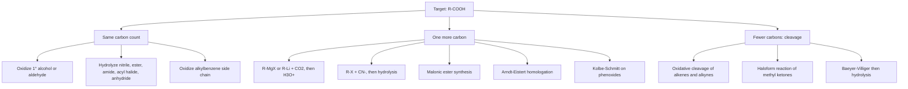

## Synthesis of Carboxylic Acids


### Overview

**Carboxylic acids** ($R{-}COOH$, also written $RCO_2H$) contain the carboxyl group, a carbonyl ($C{=}O$) bonded to a hydroxyl ($O{-}H$). The carboxyl carbon is in the +3 oxidation state, the highest oxidation level attainable by a carbon bearing a single carbon substituent short of $CO_2$. Consequently, most synthetic routes to acids fall into a few strategic categories:

1. **Oxidation** of carbon atoms already at a lower oxidation level (primary alcohols, aldehydes, alkylbenzenes, alkenes, alkynes, methyl ketones).
2. **Carboxylation** of organometallic reagents with $CO_2$ (forms a new $C{-}C$ bond and adds one carbon).
3. **Hydrolysis** of acid derivatives (nitriles, esters, amides, acyl halides, anhydrides, trihalides, orthoesters).
4. **Homologation and chain-extension** routes (malonic ester synthesis, Arndt–Eistert, cyanide displacement then hydrolysis).
5. **Rearrangement and cleavage** routes (haloform reaction, Favorskii, benzilic acid rearrangement, Baeyer–Villiger followed by hydrolysis, Kolbe–Schmitt).
6. **Transition-metal catalysis** (hydrocarboxylation, carbonylation, C–H carboxylation).

**Key Points**

- Choose the route by asking whether the target acid has the **same** number of carbons as the precursor (oxidation, hydrolysis) or **one more** carbon (Grignard/$CO_2$, cyanide, malonic ester).
- Functional-group tolerance is the deciding factor: strongly oxidizing routes destroy alkenes and other sensitive groups; Grignard routes fail with acidic protons (OH, NH, CO$_2$H, terminal alkyne C–H).
- Carboxylic acids are weak acids ($pK_a \approx 4$–5 for typical alkyl and aryl acids), so aqueous base extraction cleanly separates them from neutral organics.

---

### Structure and Properties Relevant to Synthesis

| Property | Typical value / feature |
| --- | --- |
| $pK_a$ (acetic acid) | 4.76 |
| $pK_a$ (benzoic acid) | 4.20 |
| $pK_a$ (formic acid) | 3.75 |
| $pK_a$ (trifluoroacetic acid) | ~0.5 |
| $pK_a$ (chloroacetic acid) | 2.86 |
| Solid-state / neat association | Hydrogen-bonded cyclic dimers |
| Boiling point | High (acetic acid 118 °C) relative to alcohols of similar mass, owing to dimerization |
| IR (diagnostic) | Broad $O{-}H$ ~2500–3300 cm$^{-1}$; $C{=}O$ ~1700–1725 cm$^{-1}$ |
| $^{13}C$ NMR | Carboxyl carbon ~165–185 ppm |
| $^1H$ NMR | Acidic proton ~10–13 ppm (broad, exchangeable) |

**Oxidation-level ladder**

$$R{-}CH_3 \;\rightarrow\; R{-}CH_2OH \;\rightarrow\; R{-}CHO \;\rightarrow\; R{-}COOH \;\rightarrow\; CO_2$$

Each arrow is a two-electron oxidation of the terminal carbon (with the alkane-to-alcohol step usually the most difficult to control).

---

### Strategy Map



---

### Part I: Oxidative Methods

#### 1. Oxidation of Primary Alcohols

Primary alcohols oxidize through the aldehyde to the carboxylic acid. The key to reaching the acid (rather than stopping at the aldehyde) is the presence of **water** (forming the aldehyde hydrate, which is oxidized further) and a strong oxidant.

$$R{-}CH_2OH \xrightarrow{[O]} R{-}CHO \xrightarrow{[O],\ H_2O} R{-}COOH$$

| Reagent | Conditions | Notes |
| --- | --- | --- |
| $KMnO_4$ | Basic (then acidify), or acidic, heat | Powerful; cleaves alkenes and oxidizes alkyl side chains too |
| Jones reagent ($CrO_3$, $H_2SO_4$, acetone) | 0 °C to rt | Fast, efficient; Cr(VI) is toxic and carcinogenic |
| $Na_2Cr_2O_7$ / $H_2SO_4$ | Aqueous, heat | Classical dichromate oxidation |
| $RuCl_3$ (cat.), $NaIO_4$ | $CCl_4/CH_3CN/H_2O$ | Catalytic; broad scope |
| TEMPO (cat.), $NaOCl$ then $NaClO_2$ (Anelli–Pinnick / Zhao–Lin modification) | Buffered, biphasic | Mild, selective for primary alcohols; tolerates many groups |
| $PDC$ in DMF | rt | Oxidizes primary alcohols to acids in DMF (in $CH_2Cl_2$ it stops at the aldehyde) |
| $HNO_3$ | Heat | Industrial; vigorous |
| $O_2$ with Pt, Pd, or Au catalysts | Aqueous base | Green route, used for sugar-derived acids |

**Mechanism sketch (chromic acid)**

1. Alcohol forms a chromate ester with $H_2CrO_4$.
2. E2-like loss of the $\alpha$-hydrogen gives the aldehyde and a reduced Cr(IV) species.
3. In water, the aldehyde hydrates to a gem-diol; a second chromate ester forms and oxidizes it to the acid.

**Example 1: Jones oxidation**

$$CH_3(CH_2)_4CH_2OH \xrightarrow{CrO_3,\ H_2SO_4,\ \text{acetone}} CH_3(CH_2)_4COOH$$

1-Hexanol gives hexanoic acid. (Chromium(VI) reagents are hazardous; disposal as heavy-metal waste is required.)

**Example 2: Two-step, one-pot TEMPO/bleach/chlorite oxidation**

$$R{-}CH_2OH \xrightarrow{\text{TEMPO (cat.), NaOCl (cat.), NaClO}_2} R{-}COOH$$

Mild, compatible with substrates bearing sensitive groups. $NaClO_2$ (with a hypochlorite scavenger such as 2-methyl-2-butene in Pinnick-type conditions) performs the final aldehyde-to-acid step.

**Limitations**

- Only **primary** alcohols give acids; secondary alcohols give ketones (unless C–C cleavage under forcing conditions).
- Over-oxidizing reagents destroy alkenes, sulfides, amines, and electron-rich aromatic rings.

---

#### 2. Oxidation of Aldehydes

Aldehydes oxidize readily; even air ($O_2$) converts many aldehydes to acids (autoxidation), a radical chain process.

$$R{-}CHO \xrightarrow{[O]} R{-}COOH$$

| Reagent | Notes |
| --- | --- |
| $KMnO_4$, Jones reagent | Strong; standard |
| $Ag_2O$ or Tollens' reagent ($[Ag(NH_3)_2]^+$) | Mild; tolerates alkenes; silver mirror is diagnostic |
| $NaClO_2$, $NaH_2PO_4$, 2-methyl-2-butene (Pinnick oxidation) | Very mild, selective; tolerates alkenes, stereocenters $\alpha$ to carbonyl, and many protecting groups |
| Oxone, $H_2O_2$/catalyst | Greener alternatives |
| Air / $O_2$ (autoxidation) | Often an unwanted storage problem for aldehydes (e.g., benzaldehyde to benzoic acid) |

**Pinnick oxidation mechanism (summary):** $NaClO_2$ is protonated by the buffer to chlorous acid ($HClO_2$), which adds to the aldehyde; a pericyclic fragmentation delivers the carboxylic acid and hypochlorous acid ($HOCl$), which the 2-methyl-2-butene scavenger removes to avoid side reactions (chlorination of alkenes/aromatics).

**Example 3: Pinnick oxidation**

$$R{-}CH{=}CH{-}CHO \xrightarrow{NaClO_2,\ NaH_2PO_4,\ \text{2-methyl-2-butene},\ t\text{-BuOH/H}_2O} R{-}CH{=}CH{-}COOH$$

The $C{=}C$ bond survives, which would not be true with permanganate.

---

#### 3. Oxidation of Alkylbenzene Side Chains

Any alkyl group bearing at least one **benzylic hydrogen** is oxidized to a carboxylic acid ($-COOH$) by hot, strong oxidants, regardless of chain length; the rest of the chain is cleaved.

$$Ar{-}CH_2R \xrightarrow{KMnO_4,\ HO^-,\ \Delta;\ \text{then }H_3O^+} Ar{-}COOH$$

| Substrate | Outcome |
| --- | --- |
| Toluene, ethylbenzene, isopropylbenzene (cumene) | Benzoic acid |
| *tert*-Butylbenzene | No reaction (no benzylic H) |
| *p*-Xylene | Terephthalic acid (industrial polyester precursor) |
| *o*-Xylene / naphthalene | Phthalic acid / phthalic anhydride (industrial, with $O_2$/$V_2O_5$) |

**Mechanism:** initiated by benzylic $C{-}H$ abstraction (radical), reflecting the special stability of the benzylic radical; this is why quaternary benzylic carbons resist oxidation.

**Example 4: Industrial terephthalic acid (Amoco process)**

$$p\text{-}CH_3C_6H_4CH_3 + 3\,O_2 \xrightarrow{Co/Mn\ \text{salts, HBr, AcOH},\ \sim 200\,^\circ C} p\text{-}HOOC{-}C_6H_4{-}COOH + 2\,H_2O$$

Also the industrial route to benzoic acid from toluene ($O_2$, cobalt catalyst).

**Key Points**

- Electron-withdrawing groups on the ring (nitro, halogen, carboxyl) survive; strongly activating groups (–OH, –NH$_2$) are destroyed unless protected.
- Ring-alkyl chain of any length gives the same benzoic acid; useful for structure determination (the carbon skeleton identity of the ring substitution pattern).

---

#### 4. Oxidative Cleavage of Alkenes and Alkynes

Cleavage of $C{=}C$ or $C{\equiv}C$ bonds delivers carboxylic acids (and/or ketones) with **fewer** carbons than the starting material.

| Reagent | Alkene product (monosubstituted terminus) | Alkene product (disubstituted terminus) |
| --- | --- | --- |
| Hot, concentrated $KMnO_4$ (acidic or basic) | $R{-}COOH$ (and $CO_2$ from $=CH_2$) | Ketone ($R_2C{=}O$) |
| Ozonolysis, oxidative workup ($O_3$; then $H_2O_2$) | $R{-}COOH$ | Ketone |
| $RuO_4$ (cat. $RuCl_3$, $NaIO_4$) | $R{-}COOH$ | Ketone |
| $OsO_4$ (cat.), Oxone (Borhan protocol) | $R{-}COOH$ | Ketone |

$$R{-}CH{=}CH{-}R' \xrightarrow{1.\ O_3;\ 2.\ H_2O_2} R{-}COOH + R'{-}COOH$$

**Alkynes**

$$R{-}C{\equiv}C{-}R' \xrightarrow{1.\ O_3;\ 2.\ H_2O \text{ or } KMnO_4,\ \Delta} R{-}COOH + R'{-}COOH$$

Terminal alkynes give $R{-}COOH + CO_2$.

**Example 5: Oxidative cleavage of oleic acid**

$$CH_3(CH_2)_7CH{=}CH(CH_2)_7COOH \xrightarrow{1.\ O_3;\ 2.\ H_2O_2} CH_3(CH_2)_7COOH + HOOC(CH_2)_7COOH$$

Nonanoic acid and azelaic acid (nonanedioic acid) result; this is the basis of industrial azelaic acid production.

**Safety note:** ozone is toxic and ozonides/peroxides are explosive when concentrated; ozonolyses are run cold ($-78\,^\circ C$) with an appropriate quench.

---

#### 5. Haloform Reaction of Methyl Ketones

Methyl ketones ($R{-}CO{-}CH_3$, and acetaldehyde or methyl carbinols that oxidize to them) react with excess halogen and base to give a carboxylate and a haloform ($CHX_3$).

$$R{-}CO{-}CH_3 + 3\,X_2 + 4\,HO^- \longrightarrow R{-}COO^- + CHX_3 + 3\,X^- + 3\,H_2O$$

**Mechanism**

1. Enolate formation, then $\alpha$-halogenation (repeated three times because each halogen makes the remaining $\alpha$-H more acidic).
2. Hydroxide adds to the trihalomethyl ketone carbonyl.
3. Expulsion of $CX_3^-$ (a stabilized leaving group) gives the carboxylic acid.
4. Proton transfer: $CX_3^-$ deprotonates the acid, yielding $CHX_3$ and the carboxylate.

**Example 6: Synthesis of benzoic acid from acetophenone**

$$C_6H_5COCH_3 \xrightarrow{NaOCl \text{ (or } I_2/NaOH)} C_6H_5COO^-\ Na^+ \xrightarrow{H_3O^+} C_6H_5COOH + CHCl_3\ (\text{or } CHI_3)$$

The iodoform test ($I_2$, $NaOH$, yellow $CHI_3$ precipitate) is a classical qualitative test for methyl ketones.

**Key Points**

- Carbon count decreases by one.
- The haloform product is a by-product; the carboxylic acid retains the $R$ group.
- Fails for substrates where the $R$ group is sensitive to halogenation (e.g., activated aromatics, alkenes).

---

#### 6. Baeyer–Villiger Oxidation Followed by Hydrolysis

Ketones convert to esters with peroxyacids (Baeyer–Villiger); hydrolysis of the ester then gives a carboxylic acid plus an alcohol. Most useful when the ester intermediate is the desired target, but hydrolysis provides an acid route for specific disconnections (for example, aryl methyl ketone to aryl acetate to phenol/acetic acid).

$$R{-}CO{-}R' \xrightarrow{RCO_3H} R{-}COO{-}R' \xrightarrow{H_3O^+ \text{ or } HO^-} R{-}COOH + R'{-}OH$$

Migratory aptitude: tertiary alkyl > cyclohexyl ≈ secondary alkyl ≈ benzyl ≈ phenyl > primary alkyl > methyl.

---

### Part II: Carboxylation with Carbon Dioxide

#### 7. Grignard and Organolithium Carboxylation

Organometallic reagents are strong carbon nucleophiles that add to $CO_2$ (an electrophile) to form a carboxylate, which is protonated on acid workup. This forms a **new $C{-}C$ bond** and extends the carbon chain by one carbon.

$$R{-}X \xrightarrow{Mg,\ \text{Et}_2O \text{ or THF}} R{-}MgX \xrightarrow{1.\ CO_2 \text{ (dry ice)}} R{-}COO^-\,MgX^+ \xrightarrow{2.\ H_3O^+} R{-}COOH$$

**Procedure highlights**

- Pour the Grignard solution onto crushed **dry ice** (solid $CO_2$) in large excess, or bubble dry $CO_2$ gas, to minimize double addition (formation of ketone and then tertiary alcohol).
- Acidify to protonate the carboxylate; extract with organic solvent, or first extract into aqueous base, wash with organic solvent, and re-acidify to isolate the acid.
- Strictly anhydrous, aprotic conditions are needed for reagent formation.

**Scope**

| Halide precursor | Notes |
| --- | --- |
| Primary, secondary, tertiary alkyl halides | All viable; tertiary can suffer elimination/Wurtz coupling |
| Aryl and vinyl halides | Excellent (aryl Grignard from bromobenzene gives benzoic acid) |
| Alkyl/aryl lithium reagents | Also viable; $R{-}Li$ can react a second time with the lithium carboxylate (giving ketones) if $CO_2$ is limiting |
| Terminal alkynyl anions ($RC{\equiv}C^-$) | Give propiolic acids ($RC{\equiv}C{-}COOH$) |

**Incompatible functional groups:** any group that is acidic enough to protonate the organometallic ($-OH$, $-NH_2$, $-SH$, $-COOH$, terminal alkynes) or electrophilic enough to be attacked by it (aldehyde, ketone, ester, nitrile, nitro, epoxide) must be absent or protected.

**Example 7: Synthesis of benzoic acid**

$$C_6H_5Br \xrightarrow{Mg,\ THF} C_6H_5MgBr \xrightarrow{1.\ CO_2;\ 2.\ H_3O^+} C_6H_5COOH$$

**Example 8: Synthesis of 2,2-dimethylpropanoic (pivalic) acid**

$$(CH_3)_3C{-}Cl \xrightarrow{Mg,\ Et_2O} (CH_3)_3C{-}MgCl \xrightarrow{1.\ CO_2;\ 2.\ H_3O^+} (CH_3)_3C{-}COOH$$

This route is preferred over $S_N2$ cyanide displacement, which fails for tertiary halides.

**Stereochemistry:** Grignard formation at a stereocenter racemizes it; carboxylation of chiral organometallics requires configurationally stable reagents (e.g., certain organolithiums at low temperature).

**Isotopic labeling:** using $^{13}CO_2$ or $^{14}CO_2$ is the standard way to prepare carboxyl-labeled acids.

---

#### 8. Kolbe–Schmitt Reaction (Carboxylation of Phenoxides)

Sodium (or potassium) phenoxide reacts with $CO_2$ under pressure and heat via electrophilic aromatic substitution, giving ortho- (or para-) hydroxybenzoic acids.

$$C_6H_5O^-\,Na^+ + CO_2 \xrightarrow{\sim 125\,^\circ C,\ \sim 5\ atm} 2\text{-}HO{-}C_6H_4{-}COO^-\,Na^+ \xrightarrow{H_3O^+} \text{salicylic acid}$$

**Regiochemistry:** sodium phenoxide favors *ortho* (chelation of $Na^+$ between phenoxide oxygen and $CO_2$); potassium phenoxide at higher temperature favors *para* (thermodynamic product).

Salicylic acid is the precursor of aspirin (acetylation with acetic anhydride).

---

#### 9. Carboxylation of Other Nucleophiles and C–H Acids

| Method | Description |
| --- | --- |
| Directed *ortho*-metalation then $CO_2$ | Aryl C–H lithiation directed by amide, carbamate, or methoxy group; $CO_2$ quench gives *ortho*-substituted benzoic acids |
| Carboxylation of enolates / carbanions | Stabilized carbanions capture $CO_2$ (e.g., synthesis of $\beta$-keto acids, often unstable to decarboxylation) |
| Base-mediated C–H carboxylation with $Cs_2CO_3$ / $CO_2$ | Emerging methods for acidic C–H bonds (e.g., furan-2-carboxylate formation from furoic acids); scope is substrate-specific |
| Ni- or Pd-catalyzed carboxylation of organic halides/pseudohalides with $CO_2$ | Modern catalytic alternatives to Grignard; tolerate more functional groups [Inference: conditions and scope vary widely between catalyst systems] |

---

### Part III: Hydrolysis of Carboxylic Acid Derivatives

#### 10. Hydrolysis of Nitriles

Nitriles ($R{-}C{\equiv}N$) hydrolyze to carboxylic acids through the amide intermediate, under either acidic or basic conditions with heating.

$$R{-}C{\equiv}N \xrightarrow{H_3O^+,\ \Delta} R{-}COOH + NH_4^+$$


$$R{-}C{\equiv}N \xrightarrow{1.\ HO^-,\ H_2O,\ \Delta;\ 2.\ H_3O^+} R{-}COOH + NH_3$$

**Mechanism (acid):** protonation of the nitrile nitrogen, attack of water on carbon, tautomerization to the amide, then standard amide hydrolysis (protonation, water attack, loss of $NH_4^+$).

**Mechanism (base):** hydroxide adds to the nitrile carbon; protonation and tautomerization give the amide, which then hydrolyzes to the carboxylate with ammonia release. Basic hydrolysis is often stopped at the amide with milder conditions (e.g., $H_2O_2/HO^-$ or $t\text{-BuOH/KOH}$).

**Nitrile synthesis (chain extension by one carbon)**

$$R{-}X + CN^- \xrightarrow{S_N2,\ \text{DMSO or DMF}} R{-}CN \xrightarrow{\text{hydrolysis}} R{-}COOH$$

| Precursor to nitrile | Comment |
| --- | --- |
| Primary or methyl halide + $NaCN$/$KCN$ | Good $S_N2$ yields |
| Secondary halide | Competing $E2$; lower yields |
| Tertiary halide | Elimination only |
| Aryl halide | No $S_N2$; use Rosenmund–von Braun ($CuCN$) or Pd-catalyzed cyanation |
| Aryl diazonium salt + $CuCN$ (Sandmeyer) | Converts $Ar{-}NH_2$ to $Ar{-}CN$ to $Ar{-}COOH$ |
| Aldehyde/ketone + $HCN$ (cyanohydrin) | Gives $\alpha$-hydroxy nitriles, hydrolyzed to $\alpha$-hydroxy acids |
| Strecker synthesis (aldehyde + $NH_3$ + $HCN$) | $\alpha$-Aminonitrile hydrolyzed to an $\alpha$-amino acid |

**Example 9: Two-step chain extension**

$$CH_3CH_2CH_2Br \xrightarrow{NaCN,\ DMSO} CH_3CH_2CH_2CN \xrightarrow{H_3O^+,\ \Delta} CH_3CH_2CH_2COOH$$

1-Bromopropane gives butanoic acid (one carbon added).

**Example 10: Sandmeyer route to benzoic acids**

$$ArNH_2 \xrightarrow{NaNO_2,\ HCl,\ 0\,^\circ C} ArN_2^+\,Cl^- \xrightarrow{CuCN} ArCN \xrightarrow{H_3O^+,\ \Delta} ArCOOH$$

**Safety note:** cyanide salts and $HCN$ are acutely toxic; acidification of cyanide-containing mixtures releases $HCN$ gas. Work in a fume hood with appropriate quenching (e.g., alkaline hypochlorite) and emergency procedures.

---

#### 11. Hydrolysis of Esters (Saponification and Acid Hydrolysis)

**Base-promoted (saponification):** irreversible; the carboxylate is deprotonated and cannot be attacked further.

$$R{-}COOR' + HO^- \longrightarrow R{-}COO^- + R'{-}OH \xrightarrow{H_3O^+} R{-}COOH$$

**Acid-catalyzed:** reversible (the reverse of Fischer esterification); driven forward with excess water.

$$R{-}COOR' + H_2O \overset{H^+}{\rightleftharpoons} R{-}COOH + R'{-}OH$$

**Mechanisms**

| Conditions | Pathway | Notes |
| --- | --- | --- |
| Base | $B_{AC}2$ (bimolecular, acyl–oxygen cleavage, tetrahedral intermediate) | Typical for methyl, ethyl esters; $^{18}O$-labeling shows the alcohol oxygen stays with the alcohol |
| Acid | $A_{AC}2$ | Reversible; tetrahedral intermediate |
| Acid, tertiary alkyl ester | $A_{AL}1$ | $C{-}O$ alkyl–oxygen cleavage via carbocation (e.g., $t$-Bu esters with TFA release isobutylene) |
| Benzyl ester | Hydrogenolysis ($H_2$, $Pd/C$) | Neutral, mild |
| Methyl ester, sensitive substrates | $LiI$/pyridine, $LiOH$/THF–$H_2O$, $Me_3SiOK$, $AlCl_3$/thiol, enzymatic (lipase, esterase) | Mild alternatives |

**Example 11: Saponification of ethyl benzoate**

$$C_6H_5COOEt \xrightarrow{1.\ NaOH,\ H_2O/EtOH,\ \Delta;\ 2.\ HCl} C_6H_5COOH + EtOH$$

**Ester protecting groups for the acid function:** methyl/ethyl (base hydrolysis), *tert*-butyl (acid), benzyl (hydrogenolysis), allyl ($Pd(0)$), 2-(trimethylsilyl)ethyl (fluoride), and orthoesters (OBO) allow orthogonal unmasking of a carboxylic acid late in a synthesis.

**Fats to soaps:** saponification of triglycerides with $NaOH$ gives glycerol and fatty acid carboxylate salts (soap), and acidification gives free fatty acids.

---

#### 12. Hydrolysis of Amides

Amides are the least reactive acid derivatives; hydrolysis requires prolonged heating in strong acid or base.

$$R{-}CONH_2 + H_3O^+ \xrightarrow{\Delta} R{-}COOH + NH_4^+$$


$$R{-}CONH_2 + HO^- \xrightarrow{\Delta} R{-}COO^- + NH_3$$

Peptide bond hydrolysis (6 M HCl, ~110 °C, ~24 h) is a standard amino-acid-analysis procedure; enzymatic hydrolysis (proteases) proceeds at physiological temperature.

---

#### 13. Hydrolysis of Acyl Halides and Anhydrides

These are highly reactive; water alone hydrolyzes them, often violently (acyl chlorides release $HCl$).

$$R{-}COCl + H_2O \longrightarrow R{-}COOH + HCl$$


$$(RCO)_2O + H_2O \longrightarrow 2\,R{-}COOH$$

Because acyl halides and anhydrides are usually made *from* the carboxylic acid, their hydrolysis is more a side reaction (moisture sensitivity) than a synthetic route. Exceptions include anhydrides derived from other feedstocks (maleic anhydride from benzene/butane oxidation to maleic acid; phthalic anhydride to phthalic acid) and acid chlorides from other sources (e.g., phosgene-derived).

---

#### 14. Hydrolysis of 1,1,1-Trihalides and Related Precursors

Benzotrichlorides and other $R{-}CX_3$ compounds hydrolyze to carboxylic acids:

$$Ar{-}CCl_3 + 2\,H_2O \longrightarrow Ar{-}COOH + 3\,HCl$$

Industrial benzoic acid has historically been made by hydrolysis of benzotrichloride (from radical chlorination of toluene), although catalytic air oxidation of toluene is now dominant.

**Orthoesters** $R{-}C(OR')_3$ hydrolyze in mild acid to esters and then acids. **Trifluoromethyl arenes** ($Ar{-}CF_3$) can be hydrolyzed to acids under superacidic or forcing conditions. [Inference: practical conditions vary strongly with substitution pattern.]

---

### Part IV: Chain-Extension and Homologation Routes

#### 15. Malonic Ester Synthesis

Diethyl malonate ($pK_a \approx 13$) is deprotonated by ethoxide, alkylated, hydrolyzed, and decarboxylated to give a substituted acetic acid. This route makes $R{-}CH_2{-}COOH$ or $R_2CH{-}COOH$ from alkyl halides.

$$CH_2(COOEt)_2 \xrightarrow{1.\ NaOEt} \overline{C}H(COOEt)_2 \xrightarrow{2.\ R{-}X} R{-}CH(COOEt)_2 \xrightarrow{3.\ H_3O^+,\ \Delta} R{-}CH_2{-}COOH + CO_2 + 2\,EtOH$$

**Mechanism highlights**

1. Deprotonation at the doubly activated $\alpha$-carbon forms the stabilized enolate.
2. $S_N2$ alkylation (primary and methyl halides work best).
3. Ester hydrolysis gives the substituted malonic acid (a 1,3-diacid).
4. Heating triggers decarboxylation via a cyclic six-membered transition state (enol intermediate), releasing $CO_2$.

**Dialkylation:** a second deprotonation and alkylation before hydrolysis gives $R{-}C(R'){-}COOH$-type acids ($R_2CH{-}COOH$).

**Cyclic products:** using a dihalide (e.g., $Br(CH_2)_nBr$) gives cycloalkane carboxylic acids (Perkin alicyclic synthesis), for example $BrCH_2CH_2CH_2Br$ yields cyclobutanecarboxylic acid.

**Example 12: Synthesis of 3-methylbutanoic acid (isovaleric acid)**

$$CH_2(COOEt)_2 \xrightarrow{NaOEt} \xrightarrow{(CH_3)_2CHBr} (CH_3)_2CH{-}CH(COOEt)_2 \xrightarrow{H_3O^+,\ \Delta} (CH_3)_2CH{-}CH_2{-}COOH$$

Note: isopropyl bromide is secondary, so competing $E2$ lowers the yield; isobutyl bromide is primary but $\beta$-branched. The disconnection $Me_2CH{-}CH_2{-}COOH \Rightarrow$ malonate + $Me_2CH{-}X$ is the direct one; practical yields are moderate. [Inference: actual yield depends on conditions.]

**Related synthesis:** the **acetoacetic ester synthesis** ($CH_3COCH_2COOEt$) leads to methyl ketones (not acids) under the same sequence, but "acid cleavage" (concentrated $NaOH$) gives carboxylic acids.

**Key Points**

- The method adds a **two-carbon acetic acid unit** to an alkyl halide: net $R{-}X \rightarrow R{-}CH_2{-}COOH$.
- Limited to $S_N2$-competent halides (methyl, primary, benzylic, allylic; secondary is poor; no tertiary or aryl).

---

#### 16. Arndt–Eistert Homologation

Extends a carboxylic acid by one methylene unit ($R{-}COOH \rightarrow R{-}CH_2{-}COOH$) via an acyl diazo ketone and a Wolff rearrangement.

$$R{-}COOH \xrightarrow{SOCl_2} R{-}COCl \xrightarrow{CH_2N_2} R{-}CO{-}CHN_2 \xrightarrow{Ag_2O,\ H_2O \ (\text{Wolff})} R{-}CH_2{-}COOH$$

The Wolff rearrangement proceeds through a ketene with **retention** of configuration at the migrating $R$ group, so $\alpha$-amino acids convert to $\beta$-amino acids without racemization.

**Safety note:** diazomethane is toxic and explosive; safer surrogates such as $TMSCHN_2$ are widely used. Newer flow-chemistry protocols generate and consume diazomethane in situ.

---

#### 17. Cyanide, Cyanohydrin, and Related Routes

| Route | Sequence | Product |
| --- | --- | --- |
| Kiliani–Fischer synthesis | Aldose + $HCN$, hydrolysis, lactone reduction | One-carbon-longer aldose (via aldonic acid) |
| Cyanohydrin | Aldehyde/ketone + $HCN$ → $\alpha$-hydroxy nitrile → $H_3O^+$ | $\alpha$-Hydroxy carboxylic acid (e.g., lactic acid from acetaldehyde) |
| Strecker | Aldehyde + $NH_3$ + $HCN$ → $\alpha$-aminonitrile → $H_3O^+$ | $\alpha$-Amino acid (racemic) |

**Example 13: Lactic acid**

$$CH_3CHO + HCN \longrightarrow CH_3CH(OH)CN \xrightarrow{H_3O^+,\ \Delta} CH_3CH(OH)COOH$$


---

### Part V: Rearrangement and Named-Reaction Routes

#### 18. Favorskii Rearrangement

$\alpha$-Halo ketones with base (hydroxide or alkoxide) rearrange to carboxylic acids (or esters) via a cyclopropanone intermediate. Cyclic $\alpha$-halo ketones give **ring-contracted** acids.

$$\text{2-chlorocyclohexanone} \xrightarrow{NaOH,\ H_2O;\ H_3O^+} \text{cyclopentanecarboxylic acid}$$

#### 19. Benzilic Acid Rearrangement

1,2-Diketones rearrange with hydroxide to $\alpha$-hydroxy carboxylic acids via aryl or alkyl migration:

$$Ph{-}CO{-}CO{-}Ph \xrightarrow{1.\ KOH;\ 2.\ H_3O^+} Ph_2C(OH){-}COOH \ (\text{benzilic acid})$$

#### 20. Cannizzaro Reaction

Non-enolizable aldehydes (lacking $\alpha$-H) disproportionate in concentrated base to a 1:1 mixture of carboxylate and primary alcohol (hydride transfer).

$$2\,ArCHO \xrightarrow{conc.\ NaOH} ArCOO^-\,Na^+ + ArCH_2OH$$

Maximum 50% yield of acid (unless a crossed Cannizzaro with formaldehyde as the sacrificial hydride donor is used, pushing the other aldehyde entirely to the alcohol).

#### 21. Willgerodt–Kindler and Related Reactions

Aryl alkyl ketones with sulfur and a secondary amine (morpholine) give thioamides, which hydrolyze to arylacetic acids (chain migration of the carbonyl to the terminal position).

$$Ar{-}CO{-}CH_3 \xrightarrow{S_8,\ morpholine,\ \Delta} Ar{-}CH_2{-}C(=S)N(CH_2CH_2)_2O \xrightarrow{H_3O^+,\ \Delta} Ar{-}CH_2{-}COOH$$


---

### Part VI: Transition-Metal-Catalyzed and Industrial Syntheses

#### 22. Carbonylation and Hydrocarboxylation

| Process | Reaction | Notes |
| --- | --- | --- |
| Monsanto / Cativa acetic acid process | $CH_3OH + CO \xrightarrow{Rh\ \text{or}\ Ir,\ HI} CH_3COOH$ | Dominant industrial acetic acid route; iodide-promoted, high selectivity |
| Koch reaction | Alkene + $CO$ + $H_2O$ under strong acid ($H_2SO_4$, $HF$, $BF_3$) → tertiary carboxylic acid | Via carbocation and acylium ion (e.g., pivalic and neo-acids from isobutylene) |
| Reppe carbonylation | Alkyne + $CO$ + $H_2O$, $Ni(CO)_4$ → acrylic acid (from acetylene) | Historical acrylic acid route |
| Hydrocarboxylation of alkenes | Alkene + $CO$ + $H_2O$, $Pd$ catalysts | Branched vs linear selectivity is ligand dependent |
| Alkoxycarbonylation | Alkene + $CO$ + $ROH$, $Pd$ (e.g., Lucite Alpha process for methyl propanoate/methyl methacrylate) | Ester product; hydrolyzable to acid |
| Aryl halide carbonylation | $ArX + CO + H_2O$ (or $ROH$), $Pd$ catalyst, base | General route to benzoic acids/esters |

#### 23. Industrial Preparations (Selected)

| Acid | Major industrial route |
| --- | --- |
| Acetic acid | Methanol carbonylation (Monsanto/Cativa); also acetaldehyde oxidation, butane/naphtha oxidation |
| Formic acid | Methyl formate hydrolysis; $CO + NaOH$ giving formate then acidification |
| Benzoic acid | Toluene air oxidation ($Co$ catalyst) |
| Terephthalic acid | *p*-Xylene oxidation (Amoco process) |
| Adipic acid | Cyclohexane oxidation to KA oil (cyclohexanol/cyclohexanone), then $HNO_3$ oxidation (produces $N_2O$ as a greenhouse-gas by-product) |
| Acrylic acid | Propylene two-step oxidation via acrolein |
| Propionic acid | Ethylene hydrocarboxylation/carbonylation; propanal oxidation |
| Fatty acids | Triglyceride hydrolysis (fat splitting) followed by fractionation |
| Citric acid, lactic acid, gluconic acid | Fermentation (*Aspergillus niger*, *Lactobacillus*, etc.) |
| Salicylic acid | Kolbe–Schmitt |

---

### Part VII: Selecting the Right Route

#### Decision Table

| Starting material / constraint | Recommended method | Carbon change |
| --- | --- | --- |
| 1° alcohol, robust molecule | Jones, $KMnO_4$ | 0 |
| 1° alcohol, sensitive molecule | TEMPO/$NaClO_2$ | 0 |
| Aldehyde with alkene | Pinnick oxidation | 0 |
| Aryl alkyl (benzylic H present) | Hot $KMnO_4$ | Chain truncated to $-COOH$ |
| Alkyl/aryl halide, no acidic/electrophilic groups | Grignard + $CO_2$ | +1 |
| Primary alkyl halide | $NaCN$ then hydrolysis | +1 |
| Tertiary alkyl halide | Grignard + $CO_2$ (not cyanide) | +1 |
| Alkyl halide, need $R{-}CH_2{-}COOH$ | Malonic ester synthesis | +2 |
| Methyl ketone | Haloform | −1 |
| Alkene/alkyne, want two smaller acids | Ozonolysis (oxidative) or $KMnO_4$ | Cleaved |
| Acid to homologous acid ($+CH_2$) | Arndt–Eistert | +1 |
| Phenol to hydroxy acid | Kolbe–Schmitt | +1 |
| Aryl amine to aryl acid | Sandmeyer cyanation then hydrolysis | +1 |
| Ester in hand, need acid | Saponification or acid hydrolysis | 0 |

#### Retrosynthetic Thinking

The carboxylic acid group can be disconnected as:

- $R{-}COOH \Rightarrow R{-}MgX + CO_2$ (C–C disconnection, $-1$ carbon)
- $R{-}COOH \Rightarrow R{-}CN$ (FGI, hydrolysis) $\Rightarrow R{-}X + CN^-$
- $R{-}COOH \Rightarrow R{-}CH_2OH$ or $R{-}CHO$ (FGI, oxidation)
- $R{-}CH_2{-}COOH \Rightarrow$ malonate $+ R{-}X$

---

### Worked Multi-Step Problems

#### Problem 1: Synthesize 4-nitrobenzoic acid from toluene

**Analysis:** the methyl group is an ortho/para director; nitration then oxidation gives the *para* acid, whereas the reverse order (oxidize first) would place the nitro group *meta*.

1. Nitration of toluene ($HNO_3$, $H_2SO_4$) gives *o*- and *p*-nitrotoluene; separate the *para* isomer.
2. Oxidation of the side chain ($KMnO_4$, $HO^-$, $\Delta$; then $H_3O^+$) gives 4-nitrobenzoic acid.

**Key insight:** ordering of steps controls the substitution pattern (activator/director changes when $-CH_3$ becomes $-COOH$, a meta director).

#### Problem 2: Synthesize 3-phenylpropanoic acid from benzyl bromide

**Disconnection:** $PhCH_2CH_2COOH \Rightarrow PhCH_2{-}CH_2{-}COOH$, i.e., benzyl bromide + a two-carbon acetic acid synthon $\Rightarrow$ malonic ester synthesis.

1. $CH_2(COOEt)_2 + NaOEt$, then $PhCH_2Br$ gives $PhCH_2CH(COOEt)_2$.
2. $H_3O^+$, $\Delta$ (hydrolysis and decarboxylation) gives $PhCH_2CH_2COOH$.

Alternative: $PhCH_2Br \xrightarrow{NaCN} PhCH_2CN \xrightarrow{H_3O^+} PhCH_2COOH$ gives phenylacetic acid (one carbon fewer); to reach 3-phenylpropanoic acid via a nitrile, use $PhCH_2CH_2Br + CN^-$.

#### Problem 3: Convert 1-bromobutane into pentanoic acid by two routes

| Route | Steps | Reagents |
| --- | --- | --- |
| Grignard | $BuBr \rightarrow BuMgBr \rightarrow$ acid | $Mg$/ether; $CO_2$; $H_3O^+$ |
| Nitrile | $BuBr \rightarrow BuCN \rightarrow$ acid | $NaCN$/DMSO; $H_3O^+$, $\Delta$ |

Both add one carbon; the Grignard route is shorter in steps but requires anhydrous handling, while the nitrile route uses toxic cyanide but tolerates some functional groups the Grignard cannot.

---

### Computational Aid: Route Selector (Heuristic)

The following Python sketch encodes a **simplified decision heuristic** for choosing a synthetic route to a carboxylic acid. It is educational only; real route selection must weigh functional-group compatibility, scale, safety, and cost.

```python
# Simplified route-selection heuristic for carboxylic-acid synthesis.
# Inputs are coarse descriptors; outputs are candidate methods (not guarantees).

def suggest_routes(precursor: str, has_acidic_or_electrophilic_groups: bool = False,
                   halide_class: str = "primary", has_alkene: bool = False) -> list[str]:
    routes = []
    if precursor == "primary_alcohol":
        routes.append("TEMPO/NaClO2 (mild)" if has_alkene else "Jones or KMnO4")
    elif precursor == "aldehyde":
        routes.append("Pinnick (NaClO2, scavenger)" if has_alkene else "KMnO4 / Tollens / Pinnick")
    elif precursor == "alkylbenzene":
        routes.append("Hot KMnO4 (requires benzylic H)")
    elif precursor == "methyl_ketone":
        routes.append("Haloform (loses one carbon)")
    elif precursor == "alkyl_halide":
        if not has_acidic_or_electrophilic_groups:
            routes.append("Grignard/RLi + CO2 (+1 C)")
        if halide_class in ("methyl", "primary"):
            routes.append("NaCN then hydrolysis (+1 C)")
            routes.append("Malonic ester synthesis (+2 C, as R-CH2-COOH)")
        elif halide_class == "secondary":
            routes.append("Grignard + CO2 preferred; cyanide gives E2 competition")
        elif halide_class == "tertiary":
            routes.append("Grignard + CO2 only (SN2 routes fail)")
    elif precursor == "nitrile":
        routes.append("Acid or base hydrolysis")
    elif precursor == "ester":
        routes.append("Saponification (NaOH then H3O+) or acid hydrolysis")
    elif precursor == "alkene":
        routes.append("Oxidative ozonolysis or hot KMnO4 (cleaves; fewer carbons)")
    return routes or ["No standard route in this heuristic"]

for case in [
    ("primary_alcohol", False, "primary", True),
    ("alkyl_halide", False, "tertiary", False),
    ("alkyl_halide", True, "primary", False),
    ("methyl_ketone", False, "primary", False),
]:
    print(case, "->", suggest_routes(*case))
```

**Output**



```
('primary_alcohol', False, 'primary', True) -> ['TEMPO/NaClO2 (mild)']
('alkyl_halide', False, 'tertiary', False) -> ['Grignard/RLi + CO2 (+1 C)', 'Grignard + CO2 only (SN2 routes fail)']
('alkyl_halide', True, 'primary', False) -> ['NaCN then hydrolysis (+1 C)', 'Malonic ester synthesis (+2 C, as R-CH2-COOH)']
('methyl_ketone', False, 'primary', False) -> ['Haloform (loses one carbon)']
```

---

### Isolation and Purification of Carboxylic Acids

**Acid–base extraction**

1. Dissolve the crude product in an organic solvent (ether, ethyl acetate, dichloromethane).
2. Extract with aqueous $NaHCO_3$ or $NaOH$: the acid moves into water as the carboxylate.
3. Wash the aqueous layer with fresh organic solvent to remove neutral and basic impurities.
4. Acidify the aqueous layer (HCl to $pH \lesssim 2$) to precipitate or liberate the free acid.
5. Extract into organic solvent (or filter the solid), dry, and concentrate.

**Notes**

- Bicarbonate extracts carboxylic acids ($pK_a \approx 4$–5) but not most phenols ($pK_a \approx 10$), enabling separation of acids from phenols; $CO_2$ evolves, so vent the separatory funnel.
- Recrystallization (water, ethanol/water, toluene) is the standard solid purification; distillation for low-molecular-weight liquid acids.
- Small acids (formic, acetic, propionic) are water-miscible; salting out with $NaCl$ or continuous extraction is needed.

**Characterization**

| Technique | Diagnostic signal |
| --- | --- |
| IR | Very broad $O{-}H$ (2500–3300 cm$^{-1}$), strong $C{=}O$ (~1710 cm$^{-1}$ dimer) |
| $^1H$ NMR | $\delta$ 10–13 (1H, broad, $D_2O$-exchangeable) |
| $^{13}C$ NMR | $\delta$ ~165–185 (carboxyl carbon) |
| Titration | Equivalent weight by $NaOH$ titration with phenolphthalein |
| Melting point | Sharp value for solid acids; compare with literature |

---

### Common Pitfalls

**Key Points**

- Using a Grignard reagent on a substrate that also bears an $-OH$, $-NH$, $-COOH$, or carbonyl group (the organometallic is destroyed or attacks intramolecularly).
- Adding $CO_2$ as a slow gas stream to a concentrated Grignard, allowing ketone/tertiary-alcohol by-products; pour onto excess dry ice instead.
- Attempting $S_N2$ cyanide displacement on secondary/tertiary/aryl halides (elimination or no reaction).
- Forgetting that nitrile hydrolysis under basic conditions initially gives the carboxylate (and $NH_3$); acidification is needed to isolate the acid.
- Assuming $KMnO_4$ oxidation works on *tert*-butylbenzene (no benzylic hydrogen, so no reaction).
- Using $KMnO_4$ or Jones reagent on molecules containing alkenes, sulfides, or free amines and expecting them to survive.
- Stopping at the aldehyde by using anhydrous oxidants (PCC) when the acid is wanted, or overshooting to the acid when the aldehyde is wanted (water presence controls this).
- Confusing the haloform reaction's carbon count: the acid has **one fewer** carbon than the methyl ketone.
- Forgetting decarboxylation in the malonic ester route requires heating the free diacid ($\beta$-carboxyl acid).
- Neglecting safety: cyanide ($HCN$ release on acidification), diazomethane (explosive), $Cr(VI)$ (carcinogen), ozone and ozonides (toxic, explosive), and $BBr_3$-type reagents used in downstream steps.
- Overlooking $E2$ competition in malonic ester alkylations with secondary halides.
- Racemization at stereocenters $\alpha$ to the carbonyl during basic hydrolysis or enolizable acid-catalyzed steps.

---

### Conclusion

Carboxylic acids can be assembled by a small number of strategic operations: **oxidation** of one-carbon-lower functionality (alcohols, aldehydes, alkylarenes, alkenes, methyl ketones), **carboxylation** of organometallics with $CO_2$ (adding one carbon), **hydrolysis** of nitriles, esters, amides, and other derivatives, and **homologation** methods (malonic ester, Arndt–Eistert) that build larger frameworks. Selecting among them is a matter of carbon count, functional-group compatibility, stereochemical requirements, scale, and safety. Industrially, carbonylation, air oxidation, and fermentation dominate; in the laboratory, the Grignard/$CO_2$ route, nitrile hydrolysis, and mild selective oxidations (TEMPO, Pinnick) are the workhorse tools, with acid–base extraction providing a uniquely convenient purification handle.

---

### Related Topics

- Reactions of carboxylic acids: Fischer esterification, acyl halide and anhydride formation, amide coupling
- Nucleophilic acyl substitution: reactivity order and tetrahedral intermediates
- Acidity of carboxylic acids: inductive and resonance effects, substituent effects, Hammett correlations
- Decarboxylation reactions: $\beta$-keto acids, Hunsdiecker, Kolbe electrolysis, Krapcho
- Dicarboxylic acids and cyclic anhydrides
- $\alpha$-Halogenation of carboxylic acids (Hell–Volhard–Zelinsky reaction)
- Reduction of carboxylic acids ($LiAlH_4$, $BH_3$) to primary alcohols
- Amino acids: Strecker, Gabriel, and asymmetric syntheses
- Protecting-group strategy for carboxylic acids (esters, orthoesters)
- Green chemistry approaches: catalytic aerobic oxidation, $CO_2$ utilization, biocatalysis