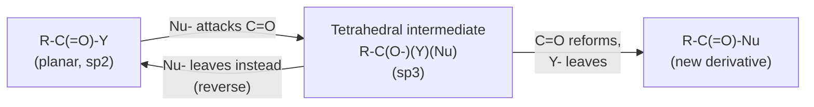
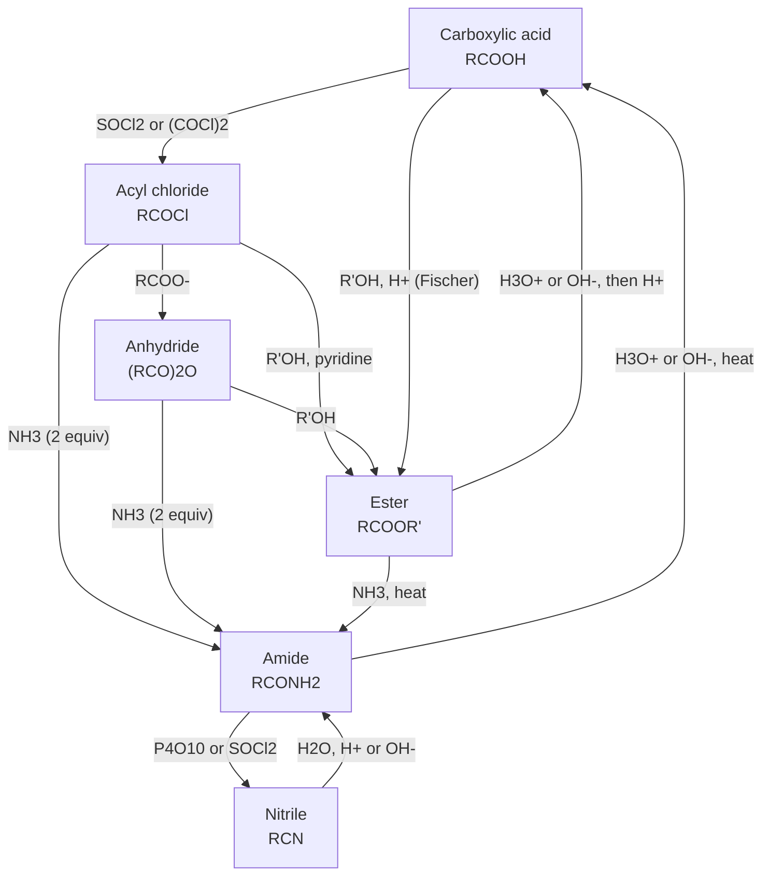

## Esters, Amides, Anhydrides, and Acyl Halides

### Overview

Esters, amides, anhydrides, and acyl halides are the four principal **carboxylic acid derivatives**. Each contains an acyl group ($\text{R-C=O}$) bonded to a heteroatom or heteroatom-containing group (Y). They differ in the identity of Y, and that difference controls their stability, reactivity, physical properties, and synthetic utility.

$$\text{R-C(=O)-Y} \quad \text{where } Y = \text{-OR' (ester)},\ \text{-NR'}_2\text{ (amide)},\ \text{-OC(=O)R' (anhydride)},\ \text{-X (acyl halide)}$$

**Key Points**

- All four undergo **nucleophilic acyl substitution** (addition–elimination) through a tetrahedral intermediate.
- Reactivity order (most to least reactive): acyl halide > anhydride > ester ≈ carboxylic acid > amide.
- A more reactive derivative can be converted into a less reactive one, but not generally the reverse without special activation.
- Reactivity correlates with the leaving-group ability of Y (weaker base = better leaving group) and with the extent of resonance donation from Y into the carbonyl.

### Structure and Nomenclature

#### General Structures

| Class | General Formula | Functional Group | Y (leaving group) | Conjugate acid of Y ($pK_a$, approx.) |
| --- | --- | --- | --- | --- |
| Acyl halide | $\text{RCOX}$ | Acyl chloride, bromide | $\text{X}^-$ | $\text{HCl} \approx -7$ |
| Anhydride | $\text{RCO-O-COR'}$ | Carboxylic anhydride | $\text{RCOO}^-$ | $\text{RCOOH} \approx 4.8$ |
| Ester | $\text{RCOOR'}$ | Alkoxycarbonyl | $\text{R'O}^-$ | $\text{R'OH} \approx 16$ |
| Amide | $\text{RCONR'}_2$ | Carboxamide | $\text{R'}_2\text{N}^-$ | $\text{R'}_2\text{NH} \approx 35\text{-}38$ |

#### IUPAC Nomenclature

**Acyl halides:** Replace the *-ic acid* ending of the parent acid with *-yl halide*.

- $\text{CH}_3\text{COCl}$: ethanoyl chloride (acetyl chloride)
- $\text{C}_6\text{H}_5\text{COCl}$: benzoyl chloride
- $\text{CH}_3\text{CH}_2\text{COBr}$: propanoyl bromide

**Anhydrides:** Replace *acid* with *anhydride*. Symmetric anhydrides use the acid name; mixed anhydrides name both acids alphabetically.

- $(\text{CH}_3\text{CO})_2\text{O}$: ethanoic anhydride (acetic anhydride)
- $\text{CH}_3\text{CO-O-COC}_6\text{H}_5$: acetic benzoic anhydride
- Cyclic anhydrides: succinic anhydride, maleic anhydride, phthalic anhydride

**Esters:** Name the alkyl group of the alcohol first, then the acid with *-ic acid* changed to *-ate*.

- $\text{CH}_3\text{COOCH}_2\text{CH}_3$: ethyl ethanoate (ethyl acetate)
- $\text{HCOOCH}_3$: methyl methanoate (methyl formate)
- Cyclic esters are called **lactones** (e.g., $\gamma$-butyrolactone, a 5-membered ring).

**Amides:** Replace *-oic acid* with *-amide*, or *-ic acid* with *-amide*. Substituents on nitrogen are prefixed with **N-**.

- $\text{CH}_3\text{CONH}_2$: ethanamide (acetamide)
- $\text{CH}_3\text{CON(CH}_3)_2$: N,N-dimethylethanamide
- Cyclic amides are called **lactams** (e.g., $\epsilon$-caprolactam, the monomer for nylon-6).
- Amides are classified as primary ($\text{RCONH}_2$), secondary ($\text{RCONHR'}$), or tertiary ($\text{RCONR'}_2$).

**Priority in polyfunctional compounds:** carboxylic acid > anhydride > ester > acyl halide > amide > nitrile > aldehyde > ketone > alcohol > amine.

### Electronic Structure and Reactivity

#### Resonance and Inductive Effects

Reactivity toward nucleophiles depends on two competing electronic effects of Y:

1. **Resonance donation** (+M): lone-pair donation from Y into $\text{C=O}$ reduces the electrophilicity of the carbonyl carbon.
2. **Inductive withdrawal** (−I): electronegative Y increases the partial positive charge on carbon.

- **Amides:** N is a strong resonance donor (least electronegative of N, O, Cl) and stabilizes the carbonyl strongly. The $\text{C-N}$ bond has partial double-bond character (barrier to rotation roughly 15–20 kcal/mol), so amides are planar and least reactive.
- **Esters:** O donates moderately by resonance; ester resonance stabilization is smaller than in amides.
- **Anhydrides:** the bridging O is shared between two carbonyls, so its lone pair is divided, giving weaker resonance donation per carbonyl and higher reactivity than esters.
- **Acyl chlorides:** Cl is a poor resonance donor (3p–2p overlap is weak) and strongly inductively withdrawing, so the carbonyl carbon is highly electrophilic.

Resonance in an amide:

$$\text{R-C(=O)-NR'}_2 \;\longleftrightarrow\; \text{R-C(-O}^-\text{)=N}^+\text{R'}_2$$

#### Relative Reactivity Diagram

<svg xmlns="http://www.w3.org/2000/svg" viewBox="0 0 640 260" width="640" height="260" font-family="Arial, sans-serif">
<title>Reactivity Order of Carboxylic Acid Derivatives (svg_diagram)</title>
<text x="320" y="24" text-anchor="middle" font-size="16" font-weight="bold">Reactivity Order of Acyl Derivatives (svg_diagram)</text>
<rect x="20" y="70" width="130" height="60" rx="8" fill="#f8d7da" stroke="#c0392b" />
<text x="85" y="97" text-anchor="middle" font-size="13">Acyl halide</text>
<text x="85" y="115" text-anchor="middle" font-size="12">RCOX</text>
<rect x="170" y="70" width="130" height="60" rx="8" fill="#fde2c4" stroke="#e67e22" />
<text x="235" y="97" text-anchor="middle" font-size="13">Anhydride</text>
<text x="235" y="115" text-anchor="middle" font-size="12">(RCO)2O</text>
<rect x="320" y="70" width="130" height="60" rx="8" fill="#fff3b0" stroke="#d4ac0d" />
<text x="385" y="97" text-anchor="middle" font-size="13">Ester</text>
<text x="385" y="115" text-anchor="middle" font-size="12">RCOOR'</text>
<rect x="470" y="70" width="130" height="60" rx="8" fill="#d5f5e3" stroke="#27ae60" />
<text x="535" y="97" text-anchor="middle" font-size="13">Amide</text>
<text x="535" y="115" text-anchor="middle" font-size="12">RCONR'2</text>
<line x1="150" y1="100" x2="168" y2="100" stroke="#333" stroke-width="2" marker-end="url(#arr)" />
<line x1="300" y1="100" x2="318" y2="100" stroke="#333" stroke-width="2" marker-end="url(#arr)" />
<line x1="450" y1="100" x2="468" y2="100" stroke="#333" stroke-width="2" marker-end="url(#arr)" />
<text x="85" y="170" text-anchor="middle" font-size="12">Most reactive</text>
<text x="535" y="170" text-anchor="middle" font-size="12">Least reactive</text>
<text x="320" y="215" text-anchor="middle" font-size="12">Leaving group ability: Cl- &gt; RCOO- &gt; RO- &gt; R2N-</text>
<text x="320" y="235" text-anchor="middle" font-size="12">Any derivative can be converted to those to its right</text>
</svg>

### General Mechanism: Nucleophilic Acyl Substitution

The reaction proceeds in two stages:

1. **Addition:** the nucleophile (Nu) attacks the electrophilic carbonyl carbon, breaking the $\pi$ bond and forming a tetrahedral intermediate (alkoxide).
2. **Elimination:** the carbonyl re-forms and the leaving group Y⁻ is expelled.

**Key Points**

- The outcome depends on which group is the better leaving group: if Nu⁻ is a better leaving group than Y⁻, the tetrahedral intermediate collapses back to starting material.
- Under acidic conditions, protonation of the carbonyl oxygen activates the carbonyl toward weaker nucleophiles (e.g., Fischer esterification).
- Under basic conditions, a strong nucleophile attacks directly, and the final step is often an irreversible deprotonation (e.g., saponification).
- Substitution requires that Y be a viable leaving group. Unlike aldehydes and ketones, where H⁻ and R⁻ are poor leaving groups, acyl derivatives can complete the elimination step.

### Physical Properties

| Property | Acyl halides | Anhydrides | Esters | Amides |
| --- | --- | --- | --- | --- |
| Hydrogen-bond donor | No | No | No | Yes (1° and 2°) |
| Hydrogen-bond acceptor | Weak | Yes | Yes | Yes (strong) |
| Boiling point trend | Similar to ketones of comparable mass | Higher than acyl halides | Lower than acids of comparable mass | Highest (1° and 2°) |
| Odor | Pungent, lachrymatory | Pungent, acrid | Fruity, pleasant | Generally odorless solids |
| Water reactivity | Violent hydrolysis (HX released) | Hydrolyze slowly to acids | Stable (slow hydrolysis) | Very stable |
| Water solubility (small members) | Reacts | Reacts | Moderate (lower esters) | High (lower amides) |

**Spectroscopic signatures**

| Derivative | IR $\text{C=O}$ stretch ($\text{cm}^{-1}$, approx.) | Other IR features | $^{13}\text{C}$ NMR carbonyl ($\delta$, approx.) |
| --- | --- | --- | --- |
| Acyl chloride | 1800 |  | 165–175 |
| Anhydride | 1820 and 1760 (two bands, coupled) | Strong C–O–C at 1050–1200 | 165–175 |
| Ester | 1735–1750 (aliphatic); 1715–1730 (conjugated) | C–O stretches at 1000–1300 | 165–175 |
| Amide | 1630–1690 (amide I) | N–H stretch 3100–3500; N–H bend (amide II) ~1550 | 165–180 |

**Notes:** The higher C=O frequency of acyl chlorides reflects poor resonance donation and strong inductive effects, whereas the low frequency of amides reflects substantial single-bond character in the C=O due to resonance. Exact values vary with substituents, conjugation, ring size, and medium.

In $^1\text{H}$ NMR, the $\text{OCH}_2$ protons of an ester appear at about $\delta$ 4.1 ppm, and the $\alpha$-protons of any acyl derivative appear at about $\delta$ 2.0–2.5 ppm. Amide N–H protons are broad and appear at about $\delta$ 5–8 ppm; restricted C–N rotation can make the two N-alkyl groups of tertiary amides inequivalent.

### Acyl Halides

#### Preparation

Acyl chlorides are typically prepared from carboxylic acids using chlorinating agents that convert the poor $\text{-OH}$ leaving group into a good one.

$$\text{RCOOH} + \text{SOCl}_2 \rightarrow \text{RCOCl} + \text{SO}_2 \uparrow + \text{HCl} \uparrow$$

$$\text{RCOOH} + \text{PCl}_5 \rightarrow \text{RCOCl} + \text{POCl}_3 + \text{HCl}$$

$$3\,\text{RCOOH} + \text{PCl}_3 \rightarrow 3\,\text{RCOCl} + \text{H}_3\text{PO}_3$$

$$\text{RCOOH} + (\text{COCl})_2 \xrightarrow{\text{cat. DMF}} \text{RCOCl} + \text{CO}_2 + \text{CO} + \text{HCl}$$

- **Thionyl chloride** is convenient because the byproducts ($\text{SO}_2$, $\text{HCl}$) are gases that leave the reaction mixture.
- **Oxalyl chloride** with catalytic DMF (via the Vilsmeier-type intermediate) works under milder conditions and is common for sensitive substrates.
- Acyl bromides can be made using $\text{PBr}_3$; acyl fluorides using reagents such as cyanuric fluoride or DAST-type reagents.

**Mechanism with $\text{SOCl}_2$:** the carboxylic acid oxygen attacks sulfur, chloride is displaced to give an acyl chlorosulfite ($\text{RCO-O-S(=O)Cl}$), a highly activated intermediate; chloride then attacks the carbonyl, and the tetrahedral intermediate collapses, releasing $\text{SO}_2$ and $\text{Cl}^-$.

#### Reactions

Acyl chlorides react readily with a wide range of nucleophiles.

| Nucleophile | Product | Notes |
| --- | --- | --- |
| $\text{H}_2\text{O}$ | Carboxylic acid | Vigorous; produces HCl |
| $\text{R'OH}$ | Ester | Base (pyridine, $\text{Et}_3\text{N}$) scavenges HCl |
| $\text{NH}_3$, $\text{R'NH}_2$, $\text{R'}_2\text{NH}$ | Amide | Two equivalents of amine (or added base) needed |
| $\text{R'COO}^-$ | Anhydride | Carboxylate salt or acid with pyridine |
| $\text{R'}_2\text{CuLi}$ (Gilman) | Ketone | Stops at ketone |
| $\text{R'MgX}$ (excess) | Tertiary alcohol | Two equivalents add |
| $\text{LiAlH}_4$ | Primary alcohol |  |
| $\text{LiAl(OtBu)}_3\text{H}$ | Aldehyde | Bulky, less reactive hydride |
| $\text{H}_2$, Pd/BaSO$_4$, quinoline | Aldehyde | Rosenmund reduction |
| Arene, $\text{AlCl}_3$ | Aryl ketone | Friedel–Crafts acylation |

**Example: Schotten–Baumann acylation of aniline**

$$\text{C}_6\text{H}_5\text{COCl} + \text{C}_6\text{H}_5\text{NH}_2 \xrightarrow{\text{aq. NaOH}} \text{C}_6\text{H}_5\text{CONHC}_6\text{H}_5 + \text{NaCl} + \text{H}_2\text{O}$$

The aqueous base neutralizes the HCl formed, driving the reaction to completion. The Schotten–Baumann conditions (biphasic, aqueous base) are also used for ester formation from phenols.

**Example: Friedel–Crafts acylation**

$$\text{C}_6\text{H}_6 + \text{CH}_3\text{COCl} \xrightarrow{\text{AlCl}_3} \text{C}_6\text{H}_5\text{COCH}_3 + \text{HCl}$$

The acylium ion ($\text{CH}_3\text{C}\equiv\text{O}^+$) is the electrophile. Unlike alkylation, acylation does not suffer from carbocation rearrangement or polysubstitution, since the product ketone deactivates the ring.

### Acid Anhydrides

#### Preparation

1. **Dehydration of carboxylic acids (mainly cyclic anhydrides):** heating dicarboxylic acids that can form five- or six-membered rings.

$$\text{HOOC-CH}_2\text{CH}_2\text{-COOH} \xrightarrow{\Delta} \text{succinic anhydride} + \text{H}_2\text{O}$$

2. **Acyl chloride + carboxylate:**

$$\text{RCOCl} + \text{R'COO}^-\text{Na}^+ \rightarrow \text{RCO-O-COR'} + \text{NaCl}$$

3. **Industrial acetic anhydride:** made from ketene and acetic acid, or by carbonylation of methyl acetate (Eastman process).

$$\text{CH}_2\text{=C=O} + \text{CH}_3\text{COOH} \rightarrow (\text{CH}_3\text{CO})_2\text{O}$$

#### Reactions

Anhydrides react like acyl chlorides but more gently, releasing a carboxylic acid (rather than HX) as the leaving group.

$$(\text{RCO})_2\text{O} + \text{Nu-H} \rightarrow \text{RCO-Nu} + \text{RCOOH}$$

| Nucleophile | Product |
| --- | --- |
| $\text{H}_2\text{O}$ | 2 RCOOH |
| $\text{R'OH}$ | Ester + RCOOH |
| $\text{R'NH}_2$ | Amide + RCOOH (2 equiv. amine) |
| Arene, Lewis acid | Aryl ketone + RCOOH |

**Example: synthesis of aspirin**

$$\text{Salicylic acid} + (\text{CH}_3\text{CO})_2\text{O} \xrightarrow{\text{H}^+ \text{ cat.}} \text{acetylsalicylic acid} + \text{CH}_3\text{COOH}$$

- The phenolic $\text{-OH}$ is acetylated; the carboxylic acid group remains free.
- Acetic anhydride is preferred to acetyl chloride for this reaction because it is cheaper, easier to handle, and does not generate corrosive HCl.

**Key Points**

- Mixed anhydrides are useful acylating agents, and the more electrophilic (less hindered or more electron-poor) carbonyl is attacked preferentially.
- Unsymmetrical anhydrides waste one equivalent of acid as leaving group (poor atom economy), so symmetrical or cyclic anhydrides are more commonly used.
- Cyclic anhydrides (e.g., phthalic, maleic) open with nucleophiles to give bifunctional products, such as a monoester–acid or amide–acid (half-amide).
- Maleic anhydride is a highly reactive dienophile in Diels–Alder reactions.

### Esters

#### Preparation

**1. Fischer esterification (acid-catalyzed condensation):**

$$\text{RCOOH} + \text{R'OH} \underset{\text{H}_2\text{O removal}}{\overset{\text{H}^+,\ \Delta}{\rightleftharpoons}} \text{RCOOR'} + \text{H}_2\text{O}$$

- Equilibrium reaction with $K_{eq} \approx 4$ for typical primary alcohols and acids.
- Driven toward product by using excess alcohol (often as solvent) or by removing water (Dean–Stark trap, molecular sieves, dehydrating agent).
- Mechanism (acronym PADPED): **P**rotonation of carbonyl, **A**ddition of alcohol, **D**eprotonation, **P**rotonation of an $\text{-OH}$, **E**limination of water, **D**eprotonation.
- Isotopic labeling with $^{18}\text{O}$-labeled alcohol shows the label appears in the ester, so the acid loses $\text{-OH}$ and the alcohol loses only H (acyl-oxygen cleavage).
- Tertiary alcohols tend to dehydrate under these conditions and are poor substrates.

**2. From acyl chlorides or anhydrides (irreversible):**

$$\text{RCOCl} + \text{R'OH} \xrightarrow{\text{pyridine}} \text{RCOOR'} + \text{pyridinium chloride}$$

**3. Alkylation of carboxylate salts (SN2):**

$$\text{RCOO}^-\text{Na}^+ + \text{R'-X} \rightarrow \text{RCOOR'} + \text{NaX}$$

Works best with primary and methyl halides. Diazomethane ($\text{CH}_2\text{N}_2$) converts acids to methyl esters quantitatively but is toxic and explosive.

**4. Transesterification:**

$$\text{RCOOR'} + \text{R''OH} \underset{}{\overset{\text{H}^+ \text{ or } \text{R''O}^-}{\rightleftharpoons}} \text{RCOOR''} + \text{R'OH}$$

Used industrially for biodiesel production (triglycerides + methanol → fatty acid methyl esters + glycerol). Equilibrium is shifted using excess of the new alcohol or removal of the displaced alcohol.

**5. Baeyer–Villiger oxidation of ketones:** a peracid (e.g., mCPBA) inserts oxygen adjacent to the carbonyl, converting a ketone into an ester (or a cyclic ketone into a lactone). The more substituted (better cation-stabilizing) group migrates preferentially.

**6. Steglich and related coupling:** DCC or EDC with catalytic DMAP couples acids and alcohols under mild conditions, useful for acid-sensitive or sterically hindered substrates.

#### Reactions

**1. Hydrolysis**

*Acid-catalyzed hydrolysis* (reverse of Fischer esterification, reversible):

$$\text{RCOOR'} + \text{H}_2\text{O} \underset{}{\overset{\text{H}^+}{\rightleftharpoons}} \text{RCOOH} + \text{R'OH}$$

*Base-promoted hydrolysis (saponification)*, effectively irreversible because the carboxylic acid is deprotonated to the carboxylate:

$$\text{RCOOR'} + \text{OH}^- \rightarrow \text{RCOO}^- + \text{R'OH}$$

Acidification of the carboxylate then gives the free acid. Saponification of fats (triglycerides) with NaOH or KOH yields glycerol and soap (sodium or potassium salts of fatty acids). Hydroxide is consumed stoichiometrically, so it is a reagent rather than a catalyst.

Under the most common conditions (the $\text{B}_{\text{AC}}2$ mechanism) hydroxide attacks the carbonyl carbon and acyl–oxygen bond cleavage occurs. Tertiary alkyl esters under acidic conditions can instead react through an $\text{A}_{\text{AL}}1$ mechanism (alkyl–oxygen cleavage via a carbocation).

**2. Aminolysis:** esters react with ammonia or amines, usually slowly, to give amides.

$$\text{RCOOR'} + \text{R''NH}_2 \rightarrow \text{RCONHR''} + \text{R'OH}$$

**3. Reduction**

- $\text{LiAlH}_4$ reduces esters to two alcohols (primary alcohol from the acyl portion plus the alcohol portion R'OH).

$$\text{RCOOR'} \xrightarrow{1.\ \text{LiAlH}_4;\ 2.\ \text{H}_3\text{O}^+} \text{RCH}_2\text{OH} + \text{R'OH}$$

- $\text{NaBH}_4$ generally does not reduce esters under standard conditions.
- DIBAL-H at −78 °C (1 equivalent) stops at the aldehyde.

**4. Grignard reaction:** two equivalents of $\text{R''MgX}$ add to give a tertiary alcohol (with two identical R'' groups), via an intermediate ketone that is more reactive than the starting ester.

$$\text{RCOOR'} + 2\,\text{R''MgX} \xrightarrow{\text{H}_3\text{O}^+} \text{RC(OH)R''}_2$$

**5. Claisen condensation:** enolizable esters in the presence of an alkoxide base (matching the ester's alkoxy group to avoid transesterification) undergo self-condensation to give $\beta$-ketoesters.

$$2\,\text{CH}_3\text{COOEt} \xrightarrow{1.\ \text{NaOEt};\ 2.\ \text{H}_3\text{O}^+} \text{CH}_3\text{COCH}_2\text{COOEt} + \text{EtOH}$$

A full equivalent of base is required because the product $\beta$-ketoester is deprotonated (pKa ≈ 11), which drives the equilibrium forward. The intramolecular version is the **Dieckmann condensation**, giving five- and six-membered cyclic $\beta$-ketoesters.

**6. Pyrolysis:** esters with $\beta$-hydrogens on the alkoxy group undergo thermal syn-elimination (via a six-membered cyclic transition state) to give an alkene and a carboxylic acid.

**Example: Saponification of ethyl acetate**

$$\text{CH}_3\text{COOCH}_2\text{CH}_3 + \text{NaOH} \xrightarrow{\Delta} \text{CH}_3\text{COO}^-\text{Na}^+ + \text{CH}_3\text{CH}_2\text{OH}$$

**Output**

Sodium acetate (aqueous) and ethanol; acidification yields acetic acid.

#### Natural and Industrial Occurrence

- **Flavors and fragrances:** isoamyl acetate (banana), ethyl butanoate (pineapple), methyl salicylate (wintergreen).
- **Fats and oils:** triglycerides (glycerol tri-esters of fatty acids).
- **Waxes:** esters of long-chain fatty acids with long-chain alcohols.
- **Polymers:** polyesters such as PET (poly(ethylene terephthalate)) are made by step-growth polymerization of diols with diacids or diesters.
- **Phosphate esters** (DNA, RNA, ATP) and **thioesters** (e.g., acetyl-CoA) are biologically important relatives.

### Amides

#### Preparation

**1. From acyl chlorides or anhydrides (most reliable):**

$$\text{RCOCl} + 2\,\text{R'NH}_2 \rightarrow \text{RCONHR'} + \text{R'NH}_3^+\text{Cl}^-$$

Tertiary amines (as HCl scavengers) or a second equivalent of the reacting amine are needed. Tertiary amines cannot themselves be acylated to stable amides.

**2. Direct thermal condensation of an acid and an amine:** initial acid–base reaction gives an ammonium carboxylate, which on strong heating (>160 °C) dehydrates to the amide. This is practical mainly for bulk industrial uses.

**3. Coupling reagents (peptide synthesis):** DCC, EDC, HATU, HBTU, and related reagents activate the carboxylic acid (as an O-acylisourea or active ester), which is then attacked by the amine under mild conditions.

**4. Partial hydrolysis of nitriles:**

$$\text{RC}\equiv\text{N} + \text{H}_2\text{O} \xrightarrow{\text{H}^+ \text{ or } \text{OH}^-,\ \text{controlled}} \text{RCONH}_2$$

**5. Aminolysis of esters:** feasible for reactive esters or with heating or catalysis.

**6. Beckmann rearrangement:** oximes rearrange under acid catalysis to N-substituted amides; cyclohexanone oxime gives $\epsilon$-caprolactam, the monomer for nylon-6.

**7. Schmidt reaction and related rearrangements:** ketones with hydrazoic acid give amides via alkyl migration.

#### Reactions

**1. Hydrolysis (requires forcing conditions):**

*Acidic:*

$$\text{RCONH}_2 + \text{H}_3\text{O}^+ \xrightarrow{\Delta} \text{RCOOH} + \text{NH}_4^+$$

The amine product is protonated under acidic conditions, which makes the reaction effectively irreversible.

*Basic:*

$$\text{RCONH}_2 + \text{OH}^- \xrightarrow{\Delta} \text{RCOO}^- + \text{NH}_3$$

Amide hydrolysis is much slower than ester hydrolysis, which is why proteins are kinetically stable in water and require enzymes (proteases) to be cleaved under physiological conditions.

**2. Reduction with $\text{LiAlH}_4$:** amides are reduced to **amines** (not alcohols), because the C=O oxygen is removed as an aluminate leaving group and an iminium ion intermediate is reduced further.

$$\text{RCONR'}_2 \xrightarrow{1.\ \text{LiAlH}_4;\ 2.\ \text{H}_2\text{O}} \text{RCH}_2\text{NR'}_2$$

**3. Dehydration of primary amides to nitriles:**

$$\text{RCONH}_2 \xrightarrow{\text{P}_4\text{O}_{10},\ \text{SOCl}_2,\ \text{or POCl}_3} \text{RC}\equiv\text{N}$$

**4. Hofmann rearrangement (degradation):** primary amides treated with $\text{Br}_2$ and NaOH give a primary amine with one fewer carbon, via an isocyanate intermediate.

$$\text{RCONH}_2 + \text{Br}_2 + 4\,\text{NaOH} \rightarrow \text{RNH}_2 + 2\,\text{NaBr} + \text{Na}_2\text{CO}_3 + 2\,\text{H}_2\text{O}$$

The R group migrates from carbon to nitrogen with retention of configuration.

**5. Acidity and basicity:**

- Amides are extremely weak bases; protonation occurs on **oxygen** (conjugate acid $pK_a \approx -0.5$), not nitrogen, because the N lone pair is delocalized.
- The N–H of a primary or secondary amide is weakly acidic ($pK_a \approx 15\text{-}17$ in water; higher in DMSO).

#### Biological and Industrial Importance

- **Peptide (amide) bond:** links amino acids in proteins. Restricted rotation around the C–N bond makes the peptide group planar, which strongly constrains protein secondary structure ($\alpha$-helices, $\beta$-sheets).
- **Nylons:** polyamides such as nylon-6,6 (from hexamethylenediamine and adipic acid) and nylon-6 (from caprolactam). Kevlar is an aromatic polyamide (aramid).
- **Pharmaceuticals:** paracetamol (acetaminophen), penicillins ($\beta$-lactam), lidocaine, and many more contain amide bonds.
- **Solvents:** DMF and N,N-dimethylacetamide (DMAc) are polar aprotic solvents.

### Interconversion Map

**Key Points**

- The general rule is "downhill" interconversion: a derivative can be converted into any less reactive derivative directly.
- Going "uphill" (e.g., amide to ester) generally requires first hydrolyzing to the carboxylic acid and re-activating it.
- The acyl chloride serves as the central activated intermediate in many syntheses.

### Comparative Summary of Reactions

| Reagent | Acyl chloride | Anhydride | Ester | Amide |
| --- | --- | --- | --- | --- |
| $\text{H}_2\text{O}$ | RCOOH (fast) | RCOOH (moderate) | Slow; needs acid or base | Very slow; needs heat and strong acid or base |
| $\text{R'OH}$ | Ester | Ester | Transesterification (catalyst) | No reaction under mild conditions |
| $\text{NH}_3$ / amines | Amide | Amide | Amide (slow) | Transamidation (harsh, rare) |
| $\text{LiAlH}_4$ | 1° alcohol | 2 × 1° alcohol | 1° alcohol + R'OH | Amine |
| $\text{R'MgX}$ (excess) | 3° alcohol | 3° alcohol | 3° alcohol | Generally stops at ketone (tertiary amides, Weinreb) or no useful addition |
| Gilman reagent | Ketone | Ketone (some) | Usually no reaction | No reaction |

**Special note: Weinreb amide.** N-methoxy-N-methylamides ($\text{RCON(OMe)Me}$) react with Grignard or organolithium reagents to give ketones without over-addition, because the tetrahedral intermediate is stabilized by chelation to the metal until workup.

### Worked Examples

**Example 1: Predict the product**

Reaction of propanoyl chloride with excess ethanol in the presence of pyridine.

$$\text{CH}_3\text{CH}_2\text{COCl} + \text{CH}_3\text{CH}_2\text{OH} \xrightarrow{\text{pyridine}} \text{CH}_3\text{CH}_2\text{COOCH}_2\text{CH}_3 + \text{pyridinium chloride}$$

**Output**

Ethyl propanoate. Pyridine neutralizes HCl, which prevents acid-mediated side reactions.

**Example 2: Multi-step synthesis**

Convert benzoic acid to N-methylbenzamide.

1. $\text{C}_6\text{H}_5\text{COOH} + \text{SOCl}_2 \rightarrow \text{C}_6\text{H}_5\text{COCl}$
2. $\text{C}_6\text{H}_5\text{COCl} + 2\,\text{CH}_3\text{NH}_2 \rightarrow \text{C}_6\text{H}_5\text{CONHCH}_3 + \text{CH}_3\text{NH}_3^+\text{Cl}^-$

**Example 3: Reduction selectivity**

Compound: ethyl 4-oxopentanoate ($\text{CH}_3\text{COCH}_2\text{CH}_2\text{COOEt}$).

- $\text{NaBH}_4$ reduces the ketone selectively and leaves the ester untouched, giving ethyl 4-hydroxypentanoate (which may cyclize to $\gamma$-valerolactone on acid treatment).
- $\text{LiAlH}_4$ reduces both groups, giving pentane-1,4-diol (plus ethanol).

**Example 4: Stoichiometry of saponification**

How many moles of NaOH are needed to fully saponify 1 mol of a triglyceride?

Each triglyceride contains three ester linkages, so 3 mol of NaOH are consumed per mole of triglyceride, producing 1 mol of glycerol and 3 mol of carboxylate salt.

$$\text{Triglyceride} + 3\,\text{NaOH} \rightarrow \text{glycerol} + 3\,\text{RCOO}^-\text{Na}^+$$

**Example 5: Spectroscopic identification**

An unknown compound of formula $\text{C}_4\text{H}_8\text{O}_2$ shows an IR band at 1740 $\text{cm}^{-1}$, no broad O–H band, a $^1\text{H}$ NMR quartet at $\delta$ 4.1 (2H), a singlet at $\delta$ 2.0 (3H), and a triplet at $\delta$ 1.2 (3H).

- IR near 1740 and no O–H: ester.
- Quartet at 4.1 (2H) coupled to a triplet at 1.2 (3H): $\text{-OCH}_2\text{CH}_3$ group.
- Singlet at 2.0 (3H): $\text{CH}_3\text{-C=O}$.
- Identity: **ethyl acetate**, $\text{CH}_3\text{COOCH}_2\text{CH}_3$.

### Laboratory Practice and Safety

- **Acyl halides** react violently with water and alcohols, releasing HCl gas; they are corrosive and lachrymatory. Use in a fume hood, with dry glassware and inert atmosphere if needed.
- **Thionyl chloride and oxalyl chloride** release toxic gases ($\text{SO}_2$, $\text{HCl}$, $\text{CO}$); scrub or vent appropriately.
- **Anhydrides** (especially acetic anhydride) are corrosive and flammable, and are controlled or regulated in some jurisdictions because of their use as precursors in illicit drug manufacture; follow local regulations.
- **Diazomethane** is toxic and explosive; safer alternatives include trimethylsilyldiazomethane.
- **Esters** are generally low in toxicity, but many are flammable and volatile.
- Quench reactive acylating agents carefully (slowly add to cold water, alcohol, or aqueous base), never the reverse.
- Actual hazards and required protective measures depend on the specific compound and scale; consult the current Safety Data Sheet (SDS) for each material.

### Common Misconceptions and Exam Pitfalls

- Amides are **not** basic like amines; they protonate on oxygen and only weakly.
- $\text{LiAlH}_4$ reduces amides to **amines**, but esters to **alcohols**.
- Esters cannot be prepared from carboxylic acids and phenols by Fischer conditions efficiently (equilibrium is unfavorable); use an acyl chloride or anhydride instead.
- Saponification is **irreversible** (carboxylate formation), whereas acid-catalyzed hydrolysis is an equilibrium.
- The ordering "amide is the least reactive" refers to nucleophilic acyl substitution; amides can still be hydrolyzed under forcing conditions.
- In Friedel–Crafts acylation, more than a stoichiometric amount of $\text{AlCl}_3$ is typically needed because the ketone product complexes the Lewis acid.

### Related Topics

- Carboxylic acid acidity and substituent effects
- Nucleophilic acyl substitution mechanisms in greater depth (tetrahedral intermediate, $\text{B}_{\text{AC}}2$, $\text{A}_{\text{AC}}2$, $\text{A}_{\text{AL}}1$)
- Claisen, Dieckmann, and malonic/acetoacetic ester syntheses
- Lactones and lactams (ring strain, $\beta$-lactam antibiotics)
- Peptide bond formation and protecting-group strategies
- Polyesters and polyamides (step-growth polymerization)
- Nitriles and their hydrolysis
- Thioesters and phosphate esters in biochemistry
- Hofmann, Curtius, and Lossen rearrangements
- Spectroscopic characterization (IR, NMR, MS) of acyl derivatives