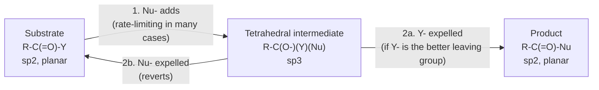
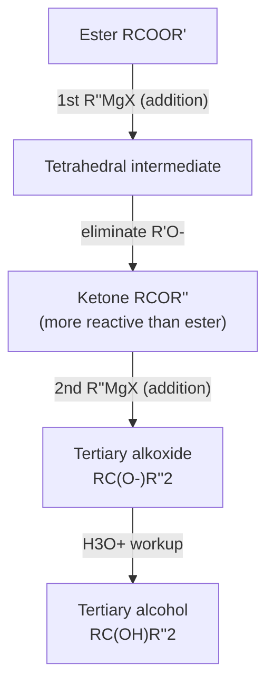

## Nucleophilic Acyl Substitution

### Overview

**Nucleophilic acyl substitution** (NAS) is the characteristic reaction of carboxylic acids and their derivatives. A nucleophile replaces the leaving group (Y) on an acyl carbon, converting one carbonyl compound into another while the $\text{C=O}$ is retained in the product.

$$\text{R-C(=O)-Y} + \text{Nu}^- \longrightarrow \text{R-C(=O)-Nu} + \text{Y}^-$$

The reaction proceeds by a two-stage **addition–elimination** pathway through a **tetrahedral intermediate**. This differs from:

- **Nucleophilic addition** (aldehydes and ketones), where the tetrahedral intermediate is protonated and retained, because H⁻ and R⁻ are poor leaving groups.
- **$\text{S}_\text{N}2$ substitution** at $sp^3$ carbon, which is a concerted, single-step, backside-attack process with inversion of configuration.

**Key Points**

- The substrate carbon is $sp^2$ (planar, trigonal); the intermediate carbon is $sp^3$ (tetrahedral); the product carbon is $sp^2$ again.
- The reaction is feasible only when Y is a competent leaving group relative to Nu.
- The direction of the reaction follows relative leaving-group ability and basicity: equilibrium favors the derivative with the stronger (more stabilized) carbonyl, i.e., the weaker leaving group.
- The reaction can be catalyzed by acid (activation of the electrophile) or base (activation of the nucleophile).

### Substrates and Reactivity

#### Acyl Derivatives Involved

| Substrate | Formula | Leaving group Y | Conjugate acid $pK_a$ (approx.) |
| --- | --- | --- | --- |
| Acyl chloride | $\text{RCOCl}$ | $\text{Cl}^-$ | $-7$ |
| Acid anhydride | $\text{(RCO)}_2\text{O}$ | $\text{RCOO}^-$ | 4.8 |
| Thioester | $\text{RCOSR'}$ | $\text{R'S}^-$ | 10 |
| Carboxylic acid | $\text{RCOOH}$ | $\text{HO}^-$ (poor; needs activation) | 15.7 |
| Ester | $\text{RCOOR'}$ | $\text{R'O}^-$ | 16 |
| Amide | $\text{RCONR'}_2$ | $\text{R'}_2\text{N}^-$ | 35–38 |

**Approximate reactivity order:**

$$\text{acyl halide} > \text{anhydride} > \text{thioester} > \text{ester} \approx \text{carboxylic acid} > \text{amide} > \text{carboxylate}$$

Carboxylates are the least reactive because they carry a negative charge, which repels incoming nucleophiles and offers a very poor leaving group ($\text{O}^{2-}$).

#### Factors Controlling Reactivity

1. **Leaving-group ability:** weaker bases are better leaving groups. This correlates with the $pK_a$ of $\text{H-Y}$.
2. **Resonance donation from Y:** lone pairs on Y donate into the $\text{C=O}$ ($\pi$), lowering electrophilicity. Nitrogen donates strongly (amides); chlorine donates poorly because of weak 3p–2p overlap.
3. **Inductive effects:** electronegative Y increases the partial positive charge on the carbonyl carbon.
4. **Sterics:** bulky groups on the acyl carbon or the nucleophile slow addition (e.g., pivaloyl derivatives are slower than acetyl).
5. **Electronic effects of R:** electron-withdrawing R groups (e.g., $\text{CF}_3$, $\text{ClCH}_2$) accelerate attack; electron-donating R groups retard it. Aryl esters are more reactive than alkyl esters because phenoxide is a better leaving group ($pK_a$ of phenol ≈ 10).
6. **Solvent and catalysts:** polar protic solvents stabilize anionic leaving groups; Lewis and Brønsted acids activate the carbonyl.

### General Mechanism

#### Base-Promoted (Anionic Nucleophile) Pathway

1. **Addition:** the nucleophile attacks the carbonyl carbon; the $\pi$ electrons move to oxygen, forming a tetrahedral alkoxide intermediate.
2. **Elimination:** the alkoxide lone pair reforms the $\text{C=O}$ and expels Y⁻.

#### Acid-Catalyzed Pathway

For weakly nucleophilic, neutral nucleophiles (e.g., $\text{ROH}$, $\text{H}_2\text{O}$) with less reactive substrates (esters, acids):

1. **Protonation** of the carbonyl oxygen makes the carbon far more electrophilic.
2. **Addition** of the neutral nucleophile gives a protonated tetrahedral intermediate.
3. **Proton transfer** converts the departing group into a good leaving group (e.g., $\text{-OR'} \rightarrow \text{-O}^+\text{HR'}$).
4. **Elimination** of the neutral leaving group (e.g., $\text{R'OH}$) reforms the protonated carbonyl.
5. **Deprotonation** releases the neutral product and regenerates the catalyst.

#### Energy Profile

<svg xmlns="http://www.w3.org/2000/svg" viewBox="0 0 640 340" width="640" height="340" font-family="Arial, sans-serif">
<title>Reaction Coordinate for Nucleophilic Acyl Substitution (svg_diagram)</title>
<text x="320" y="24" text-anchor="middle" font-size="16" font-weight="bold">Reaction Coordinate Diagram (svg_diagram)</text>
<line x1="60" y1="290" x2="600" y2="290" stroke="#333" stroke-width="2" />
<line x1="60" y1="290" x2="60" y2="50" stroke="#333" stroke-width="2" />
<text x="330" y="325" text-anchor="middle" font-size="13">Reaction coordinate</text>
<text x="22" y="170" text-anchor="middle" font-size="13" transform="rotate(-90 22 170)">Free energy</text>
<path d="M 70 200 L 130 200 C 170 200, 180 90, 230 90 C 270 90, 275 150, 310 150 C 345 150, 350 100, 400 100 C 445 100, 455 235, 500 235 L 590 235" fill="none" stroke="#c0392b" stroke-width="3" />
<text x="100" y="192" text-anchor="middle" font-size="12">R-CO-Y + Nu-</text>
<text x="230" y="78" text-anchor="middle" font-size="12">TS1</text>
<text x="310" y="172" text-anchor="middle" font-size="12">Tetrahedral</text>
<text x="310" y="187" text-anchor="middle" font-size="12">intermediate</text>
<text x="400" y="88" text-anchor="middle" font-size="12">TS2</text>
<text x="545" y="255" text-anchor="middle" font-size="12">R-CO-Nu + Y-</text>
<text x="320" y="45" text-anchor="middle" font-size="11" fill="#555">Intermediate lies in an energy well (a true intermediate, not a transition state)</text>
</svg>

**Key Points**

- The tetrahedral intermediate occupies a shallow energy minimum between two transition states.
- Depending on the substrate, either step may be rate-determining. For reactive substrates with good leaving groups (acyl chlorides), addition is typically rate-limiting; for poorer leaving groups, breakdown of the intermediate can become rate-limiting [Inference: varies by substrate and conditions].
- The structure of the intermediate has been supported by isotope-exchange experiments (see below).

### Evidence for the Tetrahedral Intermediate

**$^{18}\text{O}$ exchange experiment (Bender, 1951):** when an ester labeled with $^{18}\text{O}$ at the carbonyl oxygen is hydrolyzed in $\text{H}_2{}^{16}\text{O}$ with hydroxide, and the reaction is stopped before completion, some recovered unreacted ester has lost the $^{18}\text{O}$ label. This exchange is explained by reversible formation of a tetrahedral intermediate with two equivalent oxygens (the diol-type anion), which can collapse back to ester with either oxygen as the carbonyl.

**Interpretation:**

$$\text{R-C(}^{18}\text{O)-OR'} + \text{OH}^- \rightleftharpoons \text{R-C(O}^-\text{)(}^{18}\text{OH)(OR')} \rightleftharpoons \text{R-C(}^{16}\text{O)-OR'} + {}^{18}\text{OH}^-$$

Because the two oxygens on the tetrahedral carbon can become equivalent through proton transfer, the label scrambles into solvent while the substrate is still present. This provides strong evidence that the intermediate has a finite lifetime.

### Regiochemistry and Directionality

#### Leaving Group vs. Nucleophile Competition

At the tetrahedral intermediate, the group that departs is determined by which can better stabilize negative charge (the weaker base leaves). This defines the thermodynamic direction of substitution:

$$\text{Nu}^- \text{ must be a stronger base than } \text{Y}^- \text{ for forward reaction to be favorable.}$$

**Example:** an ester reacts with $\text{NH}_3$ to form an amide only with difficulty in the forward direction relative to acid chlorides, but an acid chloride reacts readily with an alcohol to give an ester because chloride ($pK_a$ of $\text{HCl} \approx -7$) is a much weaker base than alkoxide ($pK_a \approx 16$).

#### Direction Rule

$$\text{Favorable: more reactive derivative} \rightarrow \text{less reactive derivative}$$

Converting a less reactive derivative into a more reactive one (e.g., amide to ester) is thermodynamically unfavorable under simple conditions and needs activation, e.g., by hydrolysis to the acid followed by conversion to the acyl chloride.

### Interconversions of Acyl Derivatives

<svg xmlns="http://www.w3.org/2000/svg" viewBox="0 0 640 340" width="640" height="340" font-family="Arial, sans-serif">
<title>Interconversion of Acyl Derivatives (svg_diagram)</title>
<text x="320" y="24" text-anchor="middle" font-size="16" font-weight="bold">Interconversion Ladder (svg_diagram)</text>
<rect x="245" y="45" width="150" height="45" rx="8" fill="#f8d7da" stroke="#c0392b" />
<text x="320" y="73" text-anchor="middle" font-size="13">Acyl chloride</text>
<rect x="245" y="115" width="150" height="45" rx="8" fill="#fde2c4" stroke="#e67e22" />
<text x="320" y="143" text-anchor="middle" font-size="13">Anhydride</text>
<rect x="245" y="185" width="150" height="45" rx="8" fill="#fff3b0" stroke="#d4ac0d" />
<text x="320" y="213" text-anchor="middle" font-size="13">Ester / Acid</text>
<rect x="245" y="255" width="150" height="45" rx="8" fill="#d5f5e3" stroke="#27ae60" />
<text x="320" y="283" text-anchor="middle" font-size="13">Amide</text>
<line x1="320" y1="90" x2="320" y2="113" stroke="#333" stroke-width="2" marker-end="url(#arr2)" />
<line x1="320" y1="160" x2="320" y2="183" stroke="#333" stroke-width="2" marker-end="url(#arr2)" />
<line x1="320" y1="230" x2="320" y2="253" stroke="#333" stroke-width="2" marker-end="url(#arr2)" />
<text x="90" y="160" text-anchor="middle" font-size="12">Direct conversion</text>
<text x="90" y="176" text-anchor="middle" font-size="12">flows downward</text>
<text x="90" y="192" text-anchor="middle" font-size="12">(more to less reactive)</text>
<text x="550" y="160" text-anchor="middle" font-size="12">Upward conversion</text>
<text x="550" y="176" text-anchor="middle" font-size="12">needs activation</text>
<text x="550" y="192" text-anchor="middle" font-size="12">(e.g., SOCl2)</text>
</svg>

### Reactions by Substrate Class

#### Acyl Chlorides

Acyl chlorides are the most reactive derivatives and serve as the standard acylating agents.

| Nucleophile | Product | Conditions |
| --- | --- | --- |
| $\text{H}_2\text{O}$ | $\text{RCOOH}$ | Rapid, exothermic; HCl evolved |
| $\text{R'OH}$ | $\text{RCOOR'}$ | Pyridine or $\text{Et}_3\text{N}$ as HCl scavenger |
| $\text{R'NH}_2$ | $\text{RCONHR'}$ | 2 equivalents of amine or added base |
| $\text{R'COO}^-$ | $\text{(RCO)}_2\text{O}$ (mixed or symmetric) | Carboxylate salt |
| $\text{R'}_2\text{CuLi}$ | $\text{RCOR'}$ | Stops at ketone |
| $\text{R'MgX}$ (2 equiv.) | $\text{RC(OH)R'}_2$ | Over-addition to 3° alcohol |
| $\text{LiAlH}_4$ | $\text{RCH}_2\text{OH}$ | Over-reduction to alcohol |
| $\text{LiAl(O-}t\text{-Bu)}_3\text{H}$ | $\text{RCHO}$ | Stops at aldehyde |

**Example**

$$\text{CH}_3\text{COCl} + \text{CH}_3\text{CH}_2\text{NH}_2 \xrightarrow{\text{Et}_3\text{N}} \text{CH}_3\text{CONHCH}_2\text{CH}_3 + \text{Et}_3\text{NH}^+\text{Cl}^-$$

**Output**

N-ethylacetamide, with triethylammonium chloride as byproduct.

#### Acid Anhydrides

Anhydrides react like acyl chlorides but more slowly. One equivalent of the parent carboxylic acid is expelled as the leaving group.

$$\text{(RCO)}_2\text{O} + \text{Nu-H} \rightarrow \text{RCO-Nu} + \text{RCOOH}$$

- **With alcohols:** esters (used in aspirin synthesis from salicylic acid and acetic anhydride).
- **With amines:** amides (2 equivalents of amine, or 1 equivalent plus a tertiary amine base).
- **Cyclic anhydrides** (phthalic, succinic, maleic) open to give bifunctional acid–ester or acid–amide products.

#### Esters

Esters are moderately reactive and typically require a catalyst or an anionic nucleophile.

| Reaction | Reagents | Product |
| --- | --- | --- |
| Acid hydrolysis | $\text{H}_3\text{O}^+$, heat | $\text{RCOOH} + \text{R'OH}$ (equilibrium) |
| Saponification | $\text{OH}^-$, heat | $\text{RCOO}^- + \text{R'OH}$ (irreversible) |
| Transesterification | $\text{R''OH}$, $\text{H}^+$ or $\text{R''O}^-$ | $\text{RCOOR''} + \text{R'OH}$ (equilibrium) |
| Aminolysis | $\text{R''NH}_2$, heat | $\text{RCONHR''} + \text{R'OH}$ |
| Reduction | $\text{LiAlH}_4$ | $\text{RCH}_2\text{OH} + \text{R'OH}$ |
| Grignard | 2 $\text{R''MgX}$ | $\text{RC(OH)R''}_2$ |

**Saponification mechanism ($\text{B}_\text{AC}2$):**

1. $\text{OH}^-$ adds to the carbonyl carbon, forming a tetrahedral alkoxide.
2. The intermediate collapses, expelling $\text{R'O}^-$ and forming $\text{RCOOH}$.
3. The alkoxide ($\text{R'O}^-$, strong base) rapidly deprotonates the carboxylic acid, giving $\text{RCOO}^-$ and $\text{R'OH}$.

Step 3 is highly exergonic and irreversible, and it is why saponification consumes a full equivalent of hydroxide and goes to completion.

**Acid-catalyzed hydrolysis mechanism ($\text{A}_\text{AC}2$):** protonation, water addition, proton transfer, loss of alcohol, deprotonation. Every step is reversible, so the reaction can be pushed either way by adjusting water or alcohol concentrations.

**Mechanistic notation summary**

| Label | Meaning | Typical substrates |
| --- | --- | --- |
| $\text{B}_\text{AC}2$ | Base-promoted, acyl–oxygen cleavage, bimolecular | Most esters with hydroxide |
| $\text{A}_\text{AC}2$ | Acid-catalyzed, acyl–oxygen cleavage, bimolecular | Most esters with aqueous acid |
| $\text{A}_\text{AL}1$ | Acid-catalyzed, alkyl–oxygen cleavage, unimolecular | Tertiary alkyl esters (e.g., tert-butyl) |
| $\text{B}_\text{AL}2$ | Base, alkyl–oxygen cleavage, bimolecular ($\text{S}_\text{N}2$ at alkyl carbon) | Methyl esters with soft nucleophiles (uncommon) |

#### Carboxylic Acids

The $\text{-OH}$ of a carboxylic acid is a poor leaving group, and basic nucleophiles simply deprotonate the acid, forming an unreactive carboxylate. NAS at the acid therefore requires activation.

**Strategies:**

- **Acid catalysis (Fischer esterification):** protonation makes the carbonyl more electrophilic and converts $\text{-OH}$ into $\text{-OH}_2^+$ (leaving as water).

$$\text{RCOOH} + \text{R'OH} \underset{}{\overset{\text{H}^+}{\rightleftharpoons}} \text{RCOOR'} + \text{H}_2\text{O}$$

- **Conversion to acyl chloride:** $\text{SOCl}_2$, $\text{PCl}_5$, or $(\text{COCl})_2$.
- **Coupling reagents:** DCC, EDC, and related carbodiimides form an O-acylisourea (an activated ester-like species) that is attacked by the nucleophile.
- **Ester activation:** N-hydroxysuccinimide (NHS) esters and related "active esters" isolate a moderately reactive acylating agent.

**DCC coupling mechanism (outline):**

1. The carboxylate adds to a carbodiimide carbon, forming an O-acylisourea.
2. The amine attacks the acyl carbon (tetrahedral intermediate).
3. Collapse expels dicyclohexylurea (DCU), a very stable, poorly soluble leaving group, and forms the amide.

#### Amides

Amides are the least reactive carboxylic acid derivatives because nitrogen is a strong resonance donor and $\text{R}_2\text{N}^-$ is a very poor leaving group. Reactions require forcing conditions.

- **Acid hydrolysis:** $\text{H}_3\text{O}^+$, prolonged heating. The amine product is protonated to the ammonium ion, which makes the reaction effectively irreversible.

$$\text{RCONHR'} + \text{H}_3\text{O}^+ \xrightarrow{\Delta} \text{RCOOH} + \text{R'NH}_3^+$$

- **Base hydrolysis:** $\text{OH}^-$, heat. The leaving group is the amide anion ($\text{R'NH}^-$), which is protonated immediately by solvent or by the carboxylic acid.

$$\text{RCONHR'} + \text{OH}^- \xrightarrow{\Delta} \text{RCOO}^- + \text{R'NH}_2$$

- **Reduction:** $\text{LiAlH}_4$ gives amines through a different pathway: after hydride addition, oxygen (as an aluminate) is the group that leaves, forming an iminium ion that is reduced further.

$$\text{RCONR'}_2 \xrightarrow{\text{LiAlH}_4} \text{RCH}_2\text{NR'}_2$$

**Key Points**

- Amide hydrolysis in proteins is kinetically slow in water (half-life on the order of years to hundreds of years at neutral pH and 25 °C); enzymes (proteases) accelerate it dramatically by activating the carbonyl and stabilizing the tetrahedral intermediate [values depend on the specific peptide bond and conditions].
- The $\text{C-N}$ partial double-bond character (rotational barrier about 15–20 kcal/mol) reduces electrophilicity of the carbonyl.

#### Thioesters

Thioesters ($\text{RCOSR'}$) are more reactive toward NAS than oxygen esters because sulfur is a weaker $\pi$-donor to the carbonyl (poorer 3p–2p overlap) and thiolates are better leaving groups than alkoxides. This underlies **acetyl-CoA** chemistry in biology: thioesters act as activated acyl donors in acyl transfers and Claisen-type condensations, while remaining stable enough to persist in aqueous cells.

### Nucleophiles Beyond Heteroatoms: Organometallic and Hydride Reagents

#### Grignard and Organolithium Reagents

These add twice to acyl chlorides and esters because the intermediate ketone is more electrophilic than the starting derivative.

#### Gilman Reagents

Lithium dialkylcuprates ($\text{R'}_2\text{CuLi}$) are softer and less reactive nucleophiles. They react with acyl chlorides but not with the resulting ketone, so they cleanly convert acyl chlorides to ketones. Gilman reagents generally do not react with esters or amides under normal conditions.

#### Weinreb Amides

N-methoxy-N-methylamides react with organometallic reagents to give ketones without over-addition. The tetrahedral intermediate is chelated by the metal between the carbonyl-derived oxygen and the N-methoxy oxygen, so it does not collapse until aqueous workup, at which point the ketone is released and cannot react further.

#### Hydride Reagents

| Reagent | Acyl chloride | Ester | Amide | Notes |
| --- | --- | --- | --- | --- |
| $\text{LiAlH}_4$ | 1° alcohol | 1° alcohol (+ R'OH) | Amine | Strong, unselective |
| $\text{NaBH}_4$ | 1° alcohol (often slow, reacts with solvent) | Generally no reaction | No reaction | Mild |
| DIBAL-H (1 equiv., −78 °C) | Aldehyde | Aldehyde | Aldehyde (some substrates) | Requires low temperature |
| $\text{LiAl(O-}t\text{-Bu)}_3\text{H}$ | Aldehyde | Slow | No reaction | Bulky, attenuated |

### Catalysis in Nucleophilic Acyl Substitution

#### Acid Catalysis

- Protonation of the carbonyl oxygen increases the electrophilicity of the carbon.
- Protonation of the leaving group converts a poor leaving group (e.g., $\text{-OH}$, $\text{-OR}$, $\text{-NR}_2$) into a good one ($\text{-OH}_2^+$, $\text{-ROH}^+$, $\text{-NHR}_2^+$).
- Used in Fischer esterification, acid-catalyzed transesterification, and acid hydrolysis of esters and amides.

#### Base Catalysis and Promotion

- Deprotonation of the nucleophile (e.g., $\text{ROH} \rightarrow \text{RO}^-$) makes it more reactive.
- Stoichiometric bases (pyridine, triethylamine) neutralize acid byproducts and shift equilibria.
- In saponification, hydroxide is consumed rather than acting catalytically.

#### Nucleophilic Catalysis

A catalyst that is a better nucleophile than the primary reagent attacks first, forming a highly reactive acyl-transfer intermediate that is then intercepted by the actual nucleophile.

- **DMAP (4-dimethylaminopyridine):** attacks an acyl chloride or anhydride to give an N-acylpyridinium ion, which is much more electrophilic than the starting material.
- **Pyridine:** weaker version of the same effect, in addition to acting as an acid scavenger.
- **Imidazole and carbodiimide/HOBt systems:** used in peptide couplings.

#### Enzymatic Catalysis

Serine proteases (e.g., chymotrypsin) use a **catalytic triad** (Ser, His, Asp) to hydrolyze peptide bonds. The serine hydroxyl attacks the amide carbonyl, forming a tetrahedral intermediate stabilized in the **oxyanion hole** by backbone $\text{N-H}$ hydrogen bonds. Collapse gives an acyl-enzyme intermediate, which is then hydrolyzed by water in a second NAS cycle.

### Kinetics and Structure–Reactivity Relationships

#### Rate Laws

For base-promoted ester hydrolysis (second-order overall):

$$\text{rate} = k[\text{ester}][\text{OH}^-]$$

For saponification of ethyl acetate at 25 °C, $k$ is on the order of $0.1\text{-}0.2\ \text{M}^{-1}\text{s}^{-1}$ [approximate; varies with solvent and temperature].

#### Hammett Correlation

For hydrolysis of substituted aryl esters (e.g., $\text{p-X-C}_6\text{H}_4\text{COOEt}$), rates correlate with the Hammett substituent constant $\sigma$:

$$\log\frac{k}{k_0} = \rho\sigma$$

- For base-promoted hydrolysis of benzoate esters, $\rho$ is positive (roughly +2), because negative charge builds up in the transition state and is stabilized by electron-withdrawing groups.
- Electron-withdrawing substituents therefore speed alkaline hydrolysis, and electron-donating substituents slow it.

#### Steric Effects

Rates fall rapidly with branching at the $\alpha$-carbon and at the alcohol carbon. Hindered esters (e.g., methyl 2,4,6-trimethylbenzoate) resist normal $\text{A}_\text{AC}2$ hydrolysis and may proceed through an $\text{A}_\text{AC}1$ pathway (acylium ion) in concentrated sulfuric acid.

### Related Rearrangements Involving Acyl Groups

Some name reactions share NAS-type steps:

- **Claisen condensation:** an ester enolate acts as a carbon nucleophile attacking a second ester (NAS, eliminating alkoxide) to give a $\beta$-ketoester.
- **Dieckmann condensation:** intramolecular Claisen forming five- or six-membered rings.
- **Friedel–Crafts acylation:** electrophilic aromatic substitution by an acylium ion (generated by NAS-type activation of acyl chloride with $\text{AlCl}_3$).
- **Hell–Volhard–Zelinsky:** $\alpha$-halogenation via an acyl bromide intermediate formed by NAS on the acid.

### Worked Examples

**Example 1: Predicting feasibility**

Can ethyl acetate be converted to acetyl chloride by treatment with $\text{HCl}$?

No. Chloride is a much weaker base than ethoxide, so the equilibrium lies overwhelmingly on the side of ester and $\text{HCl}$. Conversion to the acyl chloride requires first hydrolyzing the ester to the acid and then using $\text{SOCl}_2$.

**Example 2: Ranking reactivity toward hydroxide**

Rank in order of increasing reactivity toward aqueous $\text{NaOH}$: $\text{CH}_3\text{CONH}_2$, $\text{CH}_3\text{COOCH}_3$, $\text{CH}_3\text{COCl}$, $\text{(CH}_3\text{CO)}_2\text{O}$.

$$\text{CH}_3\text{CONH}_2 < \text{CH}_3\text{COOCH}_3 < (\text{CH}_3\text{CO})_2\text{O} < \text{CH}_3\text{COCl}$$

**Example 3: Mechanism drawing (base hydrolysis of methyl benzoate)**

1. $\text{OH}^-$ attacks the carbonyl carbon → tetrahedral alkoxide ($\text{C}_6\text{H}_5\text{C(O}^-\text{)(OH)(OCH}_3)$).
2. Reformation of $\text{C=O}$ expels $\text{CH}_3\text{O}^-$ → benzoic acid.
3. $\text{CH}_3\text{O}^-$ deprotonates benzoic acid → benzoate + methanol.
4. Acid workup ($\text{H}_3\text{O}^+$) → benzoic acid.

**Output**

Sodium benzoate (aqueous), methanol; benzoic acid after acidification.

**Example 4: Selectivity**

Which product forms when phenylacetyl chloride reacts with 1 equivalent of methylamine and 1 equivalent of triethylamine in dichloromethane?

$$\text{C}_6\text{H}_5\text{CH}_2\text{COCl} + \text{CH}_3\text{NH}_2 \xrightarrow{\text{Et}_3\text{N}} \text{C}_6\text{H}_5\text{CH}_2\text{CONHCH}_3 + \text{Et}_3\text{NH}^+\text{Cl}^-$$

Triethylamine acts as the HCl scavenger, so a full equivalent of the valuable amine is retained as nucleophile.

**Example 5: Tracing an isotope label**

Methyl benzoate is hydrolyzed with $\text{NaOH}$ in $\text{H}_2{}^{18}\text{O}$. Where is $^{18}\text{O}$ found?

- In the benzoate carboxyl group (from hydroxide attack at the carbonyl carbon and acyl–oxygen cleavage), not in the methanol.
- This is consistent with the $\text{B}_\text{AC}2$ mechanism [the methanol oxygen originates from the ester's alkoxy group].
- Some label may also appear in recovered unreacted ester via the reversible tetrahedral intermediate.

### Comparison: NAS vs. Related Carbonyl Reactions

| Feature | Nucleophilic acyl substitution | Nucleophilic addition (aldehyde/ketone) | $\text{S}_\text{N}2$ |
| --- | --- | --- | --- |
| Substrate carbon | $sp^2$ acyl | $sp^2$ carbonyl | $sp^3$ alkyl |
| Steps | Two (addition–elimination) | Two (addition, protonation) | One (concerted) |
| Intermediate | Tetrahedral, transient | Tetrahedral, isolable after protonation | None (transition state only) |
| Leaving group required | Yes | No | Yes |
| Stereochemical outcome | Not relevant at acyl carbon (planar) | Creates a new stereocenter possibly | Inversion |
| Net result | Substitution, C=O retained | Addition, C=O lost | Substitution |

### Common Pitfalls

- Treating NAS as $\text{S}_\text{N}2$: there is no backside attack at $sp^2$ carbon; the pathway is addition–elimination.
- Forgetting that basic nucleophiles deprotonate carboxylic acids before attacking, which shuts down reactivity.
- Predicting the wrong direction: reactivity flows from more reactive to less reactive derivatives.
- Assuming saponification is catalytic: hydroxide is consumed stoichiometrically.
- Assuming Grignard reagents stop at the ketone stage with esters or acyl chlorides: they add twice unless the substrate is a Weinreb amide or the reagent is a Gilman reagent.
- Expecting $\text{LiAlH}_4$ to convert amides to alcohols: the product is an amine.
- Ignoring that the reactivity order is modified by substituents, sterics, and reaction medium; the general ranking is a guide, not an absolute rule.

### Related Topics

- Esters, amides, anhydrides, and acyl halides (preparation and properties)
- Fischer esterification and Steglich esterification
- Peptide coupling reagents and protecting groups
- Claisen and Dieckmann condensations
- Serine protease mechanism and the oxyanion hole
- Hammett relationships and linear free-energy analysis
- Acyl transfer in biochemistry (acetyl-CoA, ATP-mediated activation)
- Hofmann, Curtius, and Schmidt rearrangements
- Polymerization by NAS (polyesters, polyamides)