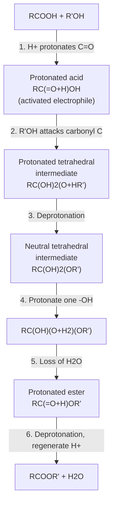

## Fischer Esterification

### Overview

**Fischer esterification** (Fischer–Speier esterification, first described by Emil Fischer and Arthur Speier in 1895) is the acid-catalyzed condensation of a carboxylic acid with an alcohol to give an ester and water.

$$\text{RCOOH} + \text{R'OH} \underset{\text{H}_2\text{O removed}}{\overset{\text{H}^+,\ \Delta}{\rightleftharpoons}} \text{RCOOR'} + \text{H}_2\text{O}$$

It is a nucleophilic acyl substitution in which the poor leaving group $\text{-OH}$ of the acid is activated by protonation and departs as water. The reaction is:

- **Reversible:** the reverse reaction is acid-catalyzed ester hydrolysis (the principle of microscopic reversibility applies, so both directions share the same intermediates and transition states).
- **Equilibrium-controlled:** conversion depends on thermodynamics, not just rate.
- **Acid-catalyzed:** it proceeds negligibly without a strong acid catalyst.

**Key Points**

- The equilibrium constant is close to unity for most primary alcohols and simple carboxylic acids ($K_{eq} \approx 4$), so conversion must be driven by Le Chatelier's principle.
- The acid catalyst accelerates attainment of equilibrium but does not change the position of equilibrium.
- Acyl–oxygen cleavage occurs: the $\text{C-OH}$ bond of the acid breaks, not the $\text{O-H}$ bond of the alcohol.
- The reaction is best suited to primary and secondary alcohols and unhindered acids.

### Thermodynamics and Equilibrium

#### Equilibrium Expression

$$K_{eq} = \frac{[\text{RCOOR'}][\text{H}_2\text{O}]}{[\text{RCOOH}][\text{R'OH}]}$$

For acetic acid and ethanol at about 25–100 °C, $K_{eq}$ is approximately 4 (a value often used in textbook problems). The reaction is nearly thermoneutral ($\Delta H^\circ$ close to zero, on the order of a few kJ/mol), so changing temperature has little effect on the equilibrium position but strongly affects the rate [approximate; values vary with substrate and solvent].

#### Worked Equilibrium Calculation

**Example**

Starting from 1.0 mol acetic acid and 1.0 mol ethanol with $K_{eq} = 4.0$, find the equilibrium yield of ethyl acetate.

Let $x$ = moles of ester formed.

$$K_{eq} = \frac{x \cdot x}{(1-x)(1-x)} = \frac{x^2}{(1-x)^2} = 4.0$$

$$\frac{x}{1-x} = 2.0 \quad\Rightarrow\quad x = 0.667$$

**Output**

The equilibrium yield is about 67% with equimolar reactants.

**Effect of excess alcohol:** using 10 mol ethanol per 1 mol acid:

$$\frac{x \cdot x}{(1-x)(10-x)} = 4.0$$

$$x^2 = 4(10 - 11x + x^2) \Rightarrow 3x^2 - 44x + 40 = 0$$

$$x = \frac{44 - \sqrt{44^2 - 4(3)(40)}}{2(3)} = \frac{44 - \sqrt{1456}}{6} \approx \frac{44 - 38.16}{6} \approx 0.97$$

**Output**

The equilibrium yield rises to about 97% with a tenfold excess of alcohol.

#### Strategies for Driving the Equilibrium

| Strategy | How it works | Practical implementation |
| --- | --- | --- |
| Excess alcohol | Shifts equilibrium toward products | Alcohol used as solvent (methanol, ethanol) |
| Excess acid | Shifts equilibrium toward products | Used when the acid is cheap and the alcohol is valuable |
| Removal of water | Removes a product | Dean–Stark trap with azeotropic solvent (toluene, benzene); molecular sieves; anhydrous $\text{MgSO}_4$ or $\text{CuSO}_4$ |
| Removal of ester | Removes a product | Distillation of low-boiling esters (e.g., methyl formate, ethyl acetate) as formed |
| Dehydrating catalyst | Consumes water | Concentrated $\text{H}_2\text{SO}_4$ acts as both catalyst and dehydrating agent |
| Reactive distillation | Combines reaction and separation | Industrial production of ethyl and butyl acetates |

**Key Points**

- Concentrated sulfuric acid at high loading absorbs water, which helps conversion but can promote charring, dehydration of alcohols, and ether formation.
- Azeotropic removal with a Dean–Stark apparatus is the standard laboratory method for high-boiling or valuable substrates.
- Water is the byproduct: any moisture in the reagents or solvent depresses conversion.

### Mechanism

The Fischer mechanism is a sequence of six reversible steps, commonly remembered by the mnemonic **PADPED** (**P**rotonation, **A**ddition, **D**eprotonation, **P**rotonation, **E**limination, **D**eprotonation).

#### Step-by-Step

1. **Protonation of the carbonyl oxygen.** The acid catalyst protonates the $\text{C=O}$ oxygen. The resulting oxocarbenium ion (resonance-stabilized) is a far stronger electrophile than the neutral acid.

$$\text{RC(=O)OH} + \text{H}^+ \rightleftharpoons \text{RC(=}\text{O}^+\text{H)OH} \longleftrightarrow \text{RC}^+\text{(OH)}_2$$

2. **Nucleophilic addition of the alcohol.** The alcohol oxygen attacks the electrophilic carbon, forming a protonated tetrahedral intermediate (rate-limiting in most conditions [Inference: depends on substrate and acid strength]).
3. **Deprotonation.** Loss of a proton from the attacking oxygen gives a neutral tetrahedral intermediate (a hemi-orthoester-type diol, $\text{RC(OH)}_2\text{OR'}$).
4. **Protonation of a hydroxyl.** One of the two equivalent $\text{-OH}$ groups is protonated, converting it into a good leaving group ($\text{-OH}_2^+$). Proton transfers between the oxygens are fast and make the two hydroxyl positions equivalent.
5. **Elimination of water.** The lone pair on the remaining oxygen pushes down to reform the $\text{C=O}$ (as its protonated form), expelling neutral water.
6. **Deprotonation.** Loss of the proton from the protonated ester regenerates the acid catalyst and delivers the neutral ester.

#### Mechanism Illustration

<svg xmlns="http://www.w3.org/2000/svg" viewBox="0 0 700 380" width="700" height="380" font-family="Arial, sans-serif">
<title>Fischer Esterification Mechanism Outline (svg_diagram)</title>
<text x="350" y="24" text-anchor="middle" font-size="16" font-weight="bold">Fischer Esterification Mechanism Outline (svg_diagram)</text>
<rect x="20" y="50" width="200" height="55" rx="8" fill="#e8f4fd" stroke="#2980b9" />
<text x="120" y="74" text-anchor="middle" font-size="13">1. Protonation</text>
<text x="120" y="92" text-anchor="middle" font-size="12">RC(=O+H)OH</text>
<rect x="250" y="50" width="200" height="55" rx="8" fill="#e8f4fd" stroke="#2980b9" />
<text x="350" y="74" text-anchor="middle" font-size="13">2. Addition of R'OH</text>
<text x="350" y="92" text-anchor="middle" font-size="12">RC(OH)2(O+HR')</text>
<rect x="480" y="50" width="200" height="55" rx="8" fill="#e8f4fd" stroke="#2980b9" />
<text x="580" y="74" text-anchor="middle" font-size="13">3. Deprotonation</text>
<text x="580" y="92" text-anchor="middle" font-size="12">RC(OH)2(OR')</text>
<rect x="480" y="170" width="200" height="55" rx="8" fill="#fef5e7" stroke="#e67e22" />
<text x="580" y="194" text-anchor="middle" font-size="13">4. Protonation of -OH</text>
<text x="580" y="212" text-anchor="middle" font-size="12">RC(OH)(OH2+)(OR')</text>
<rect x="250" y="170" width="200" height="55" rx="8" fill="#fef5e7" stroke="#e67e22" />
<text x="350" y="194" text-anchor="middle" font-size="13">5. Loss of H2O</text>
<text x="350" y="212" text-anchor="middle" font-size="12">RC(=O+H)OR'</text>
<rect x="20" y="170" width="200" height="55" rx="8" fill="#eafaf1" stroke="#27ae60" />
<text x="120" y="194" text-anchor="middle" font-size="13">6. Deprotonation</text>
<text x="120" y="212" text-anchor="middle" font-size="12">RCOOR' + H+</text>
<line x1="220" y1="78" x2="248" y2="78" stroke="#333" stroke-width="2" marker-end="url(#arr3)" />
<line x1="450" y1="78" x2="478" y2="78" stroke="#333" stroke-width="2" marker-end="url(#arr3)" />
<line x1="580" y1="105" x2="580" y2="168" stroke="#333" stroke-width="2" marker-end="url(#arr3)" />
<line x1="480" y1="198" x2="452" y2="198" stroke="#333" stroke-width="2" marker-end="url(#arr3)" />
<line x1="250" y1="198" x2="222" y2="198" stroke="#333" stroke-width="2" marker-end="url(#arr3)" />
<text x="350" y="275" text-anchor="middle" font-size="12">All steps are reversible; the reverse sequence is acid-catalyzed ester hydrolysis</text>
<text x="350" y="295" text-anchor="middle" font-size="12">Net: acyl-oxygen cleavage (the -OH of the acid is lost, the alcohol keeps its O)</text>
<text x="350" y="330" text-anchor="middle" font-size="11" fill="#555">Bond-breaking at C-OH of the acid; bond-making at C-O of the alcohol</text>
</svg>

#### Isotopic Labeling Evidence

Roberts and Urey (1938) used $^{18}\text{O}$-labeled methanol with benzoic acid:

$$\text{C}_6\text{H}_5\text{COOH} + \text{CH}_3{}^{18}\text{OH} \xrightarrow{\text{H}^+} \text{C}_6\text{H}_5\text{CO}{}^{18}\text{OCH}_3 + \text{H}_2\text{O}$$

- The $^{18}\text{O}$ label appears in the **ester**, not in the water.
- This shows that the alcohol oxygen is retained and the acid $\text{-OH}$ is lost as water.
- The result confirms acyl–oxygen cleavage and rules out alkyl–oxygen cleavage (which would have placed $^{18}\text{O}$ in water) for primary and secondary alcohols.

**Key Points**

- Tertiary alcohols behave differently: they can react via an $\text{S}_\text{N}1$/$\text{E}1$ pathway (carbocation formation) instead of through the standard Fischer route.
- The tetrahedral intermediate is a genuine, transient intermediate rather than a transition state.

### Factors Affecting Rate and Yield

#### Structure of the Alcohol

| Alcohol type | Relative rate | Comments |
| --- | --- | --- |
| Methanol | Fastest | Least hindered; also easily used as solvent |
| Primary | Fast | Standard substrates (ethanol, 1-butanol) |
| Secondary | Slower | Steric hindrance at nucleophilic oxygen; may need longer reaction times |
| Tertiary | Very slow / not suitable | Dehydration to alkene and $\text{S}_\text{N}1$ side reactions dominate |
| Phenols | Poor | Weaker nucleophiles and unfavorable equilibrium; use acyl chloride or anhydride instead |

#### Structure of the Carboxylic Acid

- **Steric hindrance** at the $\alpha$-carbon slows attack. Rates fall in the order: $\text{HCOOH} > \text{CH}_3\text{COOH} > \text{RCH}_2\text{COOH} > \text{R}_2\text{CHCOOH} > \text{R}_3\text{CCOOH}$.
- **Ortho-disubstituted benzoic acids** (e.g., 2,6-dimethylbenzoic acid) are very slow under normal Fischer conditions because of steric blocking; they can esterify by a different mechanism ($\text{A}_\text{AC}1$, via an acylium ion) in concentrated $\text{H}_2\text{SO}_4$ [Newman's method].
- **Electronic effects** are relatively modest for the forward reaction because the polar effect on protonation and on nucleophilic attack partially cancel.

#### Catalyst

| Catalyst | Notes |
| --- | --- |
| Concentrated $\text{H}_2\text{SO}_4$ | Classic catalyst; also dehydrating agent; can cause charring/oxidation |
| Anhydrous $\text{HCl}$ (gas or generated in situ from $\text{SOCl}_2$ or $\text{AcCl}$ in alcohol) | Standard for amino acid esterification |
| $p$-Toluenesulfonic acid (TsOH) | Solid, convenient; common with Dean–Stark |
| Acidic ion-exchange resins (Amberlyst-15, Dowex 50) | Heterogeneous, filterable, reusable; used industrially |
| Lewis acids ($\text{BF}_3\cdot\text{Et}_2\text{O}$, $\text{Sc(OTf)}_3$, $\text{ZrCl}_4$) | Milder conditions; useful for sensitive substrates |
| Solid acids (zeolites, sulfated zirconia) | Green chemistry alternatives |

#### Temperature and Time

- Typical conditions: reflux of the alcohol (or of azeotrope with toluene) for several hours.
- Reaction rate roughly doubles per 10 °C increase (a general rule of thumb for many reactions, not a fixed law).
- Higher temperature accelerates approach to equilibrium but does not much change $K_{eq}$.

### Experimental Procedure

#### Representative Laboratory Synthesis: Ethyl Benzoate

**Reagents**

- Benzoic acid, 12.2 g (0.10 mol)
- Absolute ethanol, 60 mL (about 1.0 mol, ~10-fold excess)
- Concentrated $\text{H}_2\text{SO}_4$, 2–3 mL (catalytic)

**Procedure**

1. Dissolve the benzoic acid in ethanol in a round-bottom flask; add a boiling chip or stir bar.
2. Cautiously add the concentrated sulfuric acid dropwise with swirling (exothermic).
3. Fit a reflux condenser and heat to gentle reflux for 1–2 hours (or use a Dean–Stark trap with toluene to remove water).
4. Cool to room temperature; remove most excess ethanol by rotary evaporation.
5. Dilute the residue with diethyl ether or ethyl acetate and wash with water.
6. Wash with saturated aqueous $\text{NaHCO}_3$ (until $\text{CO}_2$ evolution ceases) to remove the acid catalyst and unreacted benzoic acid.
7. Wash with brine, dry over anhydrous $\text{Na}_2\text{SO}_4$ or $\text{MgSO}_4$, filter, and concentrate.
8. Purify by distillation (bp of ethyl benzoate ≈ 212 °C) or column chromatography if necessary.

**Output**

Ethyl benzoate, a colorless liquid with a characteristic fruity odor. Typical yields are in the range of 70–90% for well-optimized conditions [approximate; depends on scale and technique].

#### Characterization of the Product

| Technique | Diagnostic features for a simple ester |
| --- | --- |
| IR | Strong $\text{C=O}$ stretch at ~1735–1750 $\text{cm}^{-1}$ (aliphatic) or ~1715–1730 $\text{cm}^{-1}$ (conjugated); C–O stretches 1000–1300 $\text{cm}^{-1}$; loss of broad O–H (2500–3300 $\text{cm}^{-1}$) |
| $^1\text{H}$ NMR | $\text{-OCH}_2\text{-}$ at $\delta$ ≈ 4.1 ppm; $\alpha$-$\text{CH}_2$/$\text{CH}_3$ at $\delta$ ≈ 2.0–2.5 ppm |
| $^{13}\text{C}$ NMR | Carbonyl at $\delta$ ≈ 165–175 ppm; $\text{-OCH}_2\text{-}$ at $\delta$ ≈ 60 ppm |
| MS | Molecular ion; fragmentation by acylium ion formation ($\text{RC}\equiv\text{O}^+$) and McLafferty rearrangement where $\gamma$-hydrogens are available |

### Intramolecular Fischer Esterification: Lactone Formation

Hydroxy acids in which the hydroxyl and carboxyl groups are separated to form five- or six-membered rings cyclize spontaneously under acid catalysis to give **lactones**.

$$\text{HO-CH}_2\text{CH}_2\text{CH}_2\text{-COOH} \underset{}{\overset{\text{H}^+}{\rightleftharpoons}} \gamma\text{-butyrolactone} + \text{H}_2\text{O}$$

- $\gamma$-Hydroxy acids (five-membered ring) and $\delta$-hydroxy acids (six-membered ring) lactonize readily; $\gamma$-lactone formation is often so favorable that the free $\gamma$-hydroxy acid is difficult to isolate from acidic solution.
- Entropy favors intramolecular ring closure compared to bimolecular esterification.
- $\beta$-Lactones (four-membered) and medium-sized rings (8–11 membered) are strained and form poorly; large macrolactones require high-dilution conditions or specialized methods (e.g., Yamaguchi or Corey–Nicolaou macrolactonization).

### Limitations and Side Reactions

- **Reversibility:** requires driving the equilibrium; incomplete conversion is common without water removal.
- **Acid-sensitive substrates:** substrates with acetals, silyl ethers, $\text{Boc}$ groups, or tertiary alcohols may decompose under strongly acidic conditions.
- **Tertiary alcohols:** dehydrate to alkenes, or give tertiary carbocations that undergo elimination or rearrangement.
- **Alcohol dehydration/ether formation:** at high temperatures with sulfuric acid, alcohols can form ethers (e.g., diethyl ether from ethanol near 140 °C) or alkenes.
- **Phenols:** poor substrates; use acyl chlorides, anhydrides, or coupling reagents.
- **Sterically hindered substrates:** slow; alternative methods are preferable.
- **Amino acids:** the amino group is protonated under the reaction conditions, so amino acid esters are normally isolated as hydrochloride salts (e.g., from $\text{SOCl}_2$ in methanol).
- **Optical purity:** stereocenters adjacent to the carbonyl can epimerize under strongly acidic, prolonged heating conditions [Inference: substrate-dependent].

### Alternatives to Fischer Esterification

| Method | Reagents | Advantages | Drawbacks |
| --- | --- | --- | --- |
| Acyl chloride route | $\text{SOCl}_2$ or $(\text{COCl})_2$, then $\text{R'OH}$, pyridine | Irreversible; works with phenols and hindered alcohols | Two steps; corrosive reagents, HCl generation |
| Anhydride route | $(\text{RCO})_2\text{O}$, $\text{R'OH}$, DMAP or acid | Milder than acyl chloride | Half of acyl groups wasted |
| Steglich esterification | DCC or EDC, cat. DMAP | Mild, neutral; good for acid- and base-sensitive substrates | Urea byproducts; cost |
| Carboxylate alkylation | $\text{RCOO}^-$, $\text{R'-X}$ (primary or methyl) | Mild, irreversible | Limited to good $\text{S}_\text{N}2$ electrophiles |
| Diazomethane / TMS-diazomethane | $\text{CH}_2\text{N}_2$ or $\text{TMSCHN}_2$ | Quantitative methyl ester formation | $\text{CH}_2\text{N}_2$ is toxic and explosive |
| Mitsunobu reaction | $\text{PPh}_3$, DEAD/DIAD, $\text{R'OH}$ | Inversion at secondary alcohol stereocenters | Stoichiometric byproducts; acidic nucleophile required |
| Transesterification | Ester + $\text{R'OH}$, acid or base catalyst | Useful for ester exchange; used in biodiesel | Also an equilibrium |

### Industrial Applications

- **Solvents and plasticizers:** ethyl acetate, butyl acetate, and phthalate diesters are produced on very large scale by esterification with acid catalysts.
- **Flavors and fragrances:** isoamyl acetate (banana), ethyl butanoate (pineapple), and methyl salicylate (wintergreen) are made by esterification of the parent acids and alcohols.
- **Biodiesel:** acid-catalyzed esterification of free fatty acids with methanol is used as a pretreatment step for high-acid feedstocks, followed by base-catalyzed transesterification of triglycerides.
- **Polyesters:** polyethylene terephthalate (PET) synthesis involves esterification (or transesterification) of terephthalic acid or dimethyl terephthalate with ethylene glycol; poly(lactic acid) forms from lactic acid via esterification-based polymerization or lactide ring opening.
- **Pharmaceuticals:** ester prodrugs and intermediates, and the classic aspirin ester–acid case (although aspirin is formed by acylation with acetic anhydride, not Fischer conditions).

### Worked Examples

**Example 1: Predict the product**

Propanoic acid heated with 1-butanol and a catalytic amount of $\text{H}_2\text{SO}_4$.

$$\text{CH}_3\text{CH}_2\text{COOH} + \text{CH}_3\text{CH}_2\text{CH}_2\text{CH}_2\text{OH} \xrightarrow{\text{H}^+} \text{CH}_3\text{CH}_2\text{COOCH}_2\text{CH}_2\text{CH}_2\text{CH}_3 + \text{H}_2\text{O}$$

**Output**

Butyl propanoate (with removal of water by Dean–Stark to improve conversion).

**Example 2: Isotope tracing**

Acetic acid is reacted with $\text{CH}_3\text{CH}_2{}^{18}\text{OH}$ under Fischer conditions. Where does the $^{18}\text{O}$ end up?

- In the ethyl acetate product, as the alkoxy oxygen: $\text{CH}_3\text{C(=O)-}{}^{18}\text{O}\text{CH}_2\text{CH}_3$.
- Not in the water.

**Example 3: Why is a tenfold excess of alcohol used?**

With $K_{eq} \approx 4$ and equimolar reactants, the maximum conversion is about 67%. A tenfold excess of alcohol raises the equilibrium conversion to about 97% (from the calculation above). This is Le Chatelier's principle in practice.

**Example 4: Selecting conditions for a sensitive substrate**

Esterify (S)-2-phenylpropanoic acid (ibuprofen-type $\alpha$-stereocenter) with methanol while minimizing racemization.

- Use mild conditions: $\text{SOCl}_2$ in methanol at 0 °C to room temperature (generates anhydrous $\text{HCl}$ in situ), or use $\text{TMSCHN}_2$/methanol.
- Avoid prolonged reflux with strong acid to limit epimerization at the $\alpha$-carbon [Inference: extent of epimerization depends on substrate and conditions].

**Example 5: Lactonization**

4-Hydroxybutanoic acid in dilute aqueous acid.

$$\text{HOCH}_2\text{CH}_2\text{CH}_2\text{COOH} \rightleftharpoons \gamma\text{-butyrolactone} + \text{H}_2\text{O}$$

**Output**

$\gamma$-Butyrolactone, a five-membered cyclic ester; the equilibrium lies substantially toward the lactone in acidic solution [ring strain minimal, favorable entropy].

**Example 6: Rank the reactivity of alcohols**

Rank in order of decreasing rate of Fischer esterification with acetic acid: 2-propanol, methanol, ethanol, *tert*-butanol.

$$\text{methanol} > \text{ethanol} > \text{2-propanol} > \text{tert-butanol}$$

### Fischer Esterification vs. Ester Hydrolysis

| Aspect | Fischer esterification | Acid-catalyzed ester hydrolysis |
| --- | --- | --- |
| Direction | Acid + alcohol → ester + water | Ester + water → acid + alcohol |
| Driving force | Excess alcohol, water removal | Excess water |
| Catalyst | $\text{H}^+$ | $\text{H}^+$ |
| Mechanism | PADPED | Exact reverse of PADPED |
| Equilibrium constant | $K_{eq} \approx 4$ (for acetic acid/ethanol) | $1/K_{eq} \approx 0.25$ |
| Practical note | Anhydrous conditions preferred | Dilute aqueous acid preferred |

### Common Pitfalls

- Treating the reaction as irreversible; without water removal or excess reagent, conversion typically stalls near equilibrium.
- Using a tertiary alcohol and expecting a clean ester: elimination competes strongly.
- Forgetting to neutralize the acid catalyst before concentrating the crude ester, which can cause hydrolysis or decomposition during workup.
- Omitting the bicarbonate wash and leaving unreacted carboxylic acid in the product.
- Assuming the alcohol oxygen is lost as water: the isotopic-labeling evidence shows the acid $\text{-OH}$ is lost.
- Using aqueous acid or wet solvents, which reverses the reaction.
- Applying Fischer conditions to phenols, where equilibrium is unfavorable.

### Safety Considerations

- Concentrated sulfuric acid is corrosive and reacts exothermically when mixed with alcohols or water; add acid slowly to the alcohol with cooling and stirring.
- Many alcohols and ester products are flammable and volatile; heat with a heating mantle or oil bath rather than an open flame.
- Benzene (formerly used for azeotropic water removal) is carcinogenic; toluene or cyclohexane are preferred alternatives.
- $\text{SOCl}_2$ and acyl chlorides release $\text{HCl}$ and $\text{SO}_2$; use in a fume hood.
- Wear appropriate PPE (goggles, gloves, lab coat). Specific hazards depend on the reagents and scale; consult the Safety Data Sheet for each material.

### Related Topics

- Nucleophilic acyl substitution mechanisms
- Transesterification (acid- and base-catalyzed) and biodiesel production
- Saponification and ester hydrolysis kinetics
- Steglich, Mitsunobu, and Yamaguchi esterifications
- Lactones and macrolactonization
- Le Chatelier's principle and equilibrium control in organic synthesis
- Dean–Stark apparatus and azeotropic distillation
- Amino acid esterification and peptide synthesis protecting groups
- Polyester synthesis (step-growth polymerization)
- Ester spectroscopy (IR, NMR, MS)