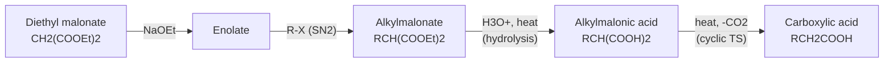
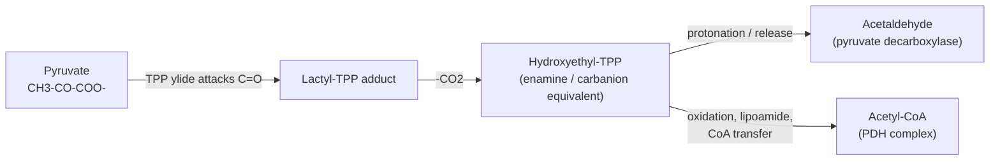

## Decarboxylation Reactions

### Overview

**Decarboxylation** is the loss of carbon dioxide from a carboxylic acid (or carboxylate) in which the carboxyl group is replaced by a hydrogen atom or another group:

$$\text{R-COOH} \longrightarrow \text{R-H} + \text{CO}_2$$

The reaction is thermodynamically favorable in many cases because $\text{CO}_2$ is a very stable, low-energy molecule and its release as a gas increases entropy. Kinetically, however, simple carboxylic acids decarboxylate only under harsh conditions, because the carbon–carbon bond cleavage generates a carbanion (or carbanion equivalent) on R. Decarboxylation therefore becomes easy when the developing negative charge on the carbon that departs with the electron pair is **stabilized**.

**Key Points**

- The ease of decarboxylation depends on how well the resulting carbanion (or enol/enolate) is stabilized.
- Carboxylic acids with a carbonyl group at the $\beta$-position ($\beta$-keto acids) and malonic acid derivatives decarboxylate readily on mild heating through a cyclic six-membered transition state.
- Simple aliphatic and aromatic acids require high temperatures, catalysts, or oxidative/radical strategies.
- Decarboxylation is central to biochemistry (citric acid cycle, amino acid metabolism, fatty acid biosynthesis) and to synthetic methods (malonic ester synthesis, acetoacetic ester synthesis, Hunsdiecker, Kolbe, Barton, and modern photoredox reactions).

### Thermodynamic and Kinetic Basis

#### Driving Forces

1. **Entropy:** one molecule becomes two, and one product is a gas that escapes, so $\Delta S > 0$ and $-T\Delta S$ contributes favorably.
2. **Stability of $\text{CO}_2$:** the two $\text{C=O}$ bonds in $\text{CO}_2$ are strong, and the molecule is a thermodynamic sink.
3. **Irreversibility:** escape of $\text{CO}_2$ from solution removes a product (Le Chatelier), so the reaction is effectively irreversible under open conditions.

#### Requirement for Carbanion Stabilization

Heterolytic decarboxylation of a carboxylate generates a carbanion:

$$\text{R-COO}^- \rightarrow \text{R}^- + \text{CO}_2$$

The reaction rate correlates with the stability of $\text{R}^-$, which can be assessed from the $pK_a$ of $\text{R-H}$:

| Carbon acid R–H | Approx. $pK_a$ | Decarboxylation ease of R–COOH |
| --- | --- | --- |
| Alkane | ~50 | Very difficult (>300 °C or radical methods) |
| Arene (benzene) | ~43 | Difficult; needs Cu catalysis or high temperature |
| Alkyne | ~25 | Moderate (propiolic acids) |
| Nitromethane | ~10 | Facile (nitroacetic acids) |
| Acetone/ketone ($\alpha$-C–H) | ~19–20 | Facile via enol pathway ($\beta$-keto acids) |
| Malonate ($\alpha$-C–H) | ~13 | Facile via enol pathway (malonic acids) |
| Trichloromethane ($\text{CHCl}_3$) | ~24 | Facile (trichloroacetic acid) |

[Values are approximate and solvent dependent.]

### Classification of Decarboxylation Pathways

```mermaid
flowchart TD
    D["Decarboxylation"] --> T["Thermal / cyclic TS"]
    D --> B["Base or carbanion-driven"]
    D --> O["Oxidative / radical"]
    D --> M["Metal-catalyzed / photoredox"]
    D --> E["Enzymatic"]

    T --> T1["beta-Keto acids"]
    T --> T2["Malonic acids"]
    T --> T3["Other beta,gamma-unsaturated acids"]

    B --> B1["Trichloroacetic acid"]
    B --> B2["Nitroacetic acid"]
    B --> B3["Soda-lime (RCOONa + NaOH)"]

    O --> O1["Kolbe electrolysis"]
    O --> O2["Hunsdiecker / Borodin"]
    O --> O3["Barton decarboxylation"]

    M --> M1["Cu / Ag-catalyzed protodecarboxylation"]
    M --> M2["Pd-catalyzed decarboxylative coupling"]
    M --> M3["Photoredox / Ni dual catalysis"]

    E --> E1["PLP-dependent amino acid decarboxylases"]
    E --> E2["Thiamine pyrophosphate (TPP) systems"]
    E --> E3["Biotin-dependent / non-oxidative"]
```

### Thermal Decarboxylation of $\beta$-Keto Acids and Malonic Acids

#### Scope

Carboxylic acids that have a second carbonyl (ketone, carboxyl, aldehyde, ester in the appropriate arrangement) or another $\pi$-acceptor (alkene, nitrile) at the $\beta$-position decarboxylate at moderate temperatures (often 50–150 °C, and in some cases below room temperature for very unstable $\beta$-keto acids) [approximate; substrate dependent].

$$\text{R-CO-CH}_2\text{-COOH} \xrightarrow{\Delta} \text{R-CO-CH}_3 + \text{CO}_2$$

$$\text{HOOC-CH}_2\text{-COOH} \xrightarrow{\Delta\ (\sim 140\text{-}150\,^\circ\text{C})} \text{CH}_3\text{COOH} + \text{CO}_2$$

#### Mechanism: Concerted Cyclic Transition State

The reaction proceeds through a **six-membered cyclic transition state** in which:

1. The carboxylic acid O–H hydrogen is transferred to the $\beta$-carbonyl oxygen.
2. The $\text{C-C}$ bond between the $\alpha$-carbon and the carboxyl carbon breaks.
3. $\text{CO}_2$ is expelled, and an **enol** is formed.
4. The enol **tautomerizes** to the more stable keto form (or the acid, in the malonic case).

$$\text{R-C(=O)-CH}_2\text{-C(=O)-OH} \rightarrow \text{[R-C(OH)=CH}_2] + \text{O=C=O} \rightarrow \text{R-C(=O)-CH}_3$$

<svg xmlns="http://www.w3.org/2000/svg" viewBox="0 0 700 330" width="700" height="330" font-family="Arial, sans-serif">
<title>Cyclic Transition State in beta-Keto Acid Decarboxylation (svg_diagram)</title>
<text x="350" y="24" text-anchor="middle" font-size="16" font-weight="bold">beta-Keto Acid Decarboxylation (svg_diagram)</text>
<rect x="20" y="70" width="190" height="70" rx="8" fill="#e8f4fd" stroke="#2980b9" />
<text x="115" y="97" text-anchor="middle" font-size="13">beta-Keto acid</text>
<text x="115" y="118" text-anchor="middle" font-size="12">R-CO-CH2-COOH</text>
<rect x="255" y="70" width="190" height="70" rx="8" fill="#fef5e7" stroke="#e67e22" />
<text x="350" y="92" text-anchor="middle" font-size="13">Six-membered cyclic TS</text>
<text x="350" y="110" text-anchor="middle" font-size="12">H transferred to C=O oxygen;</text>
<text x="350" y="126" text-anchor="middle" font-size="12">C-C bond breaks</text>
<rect x="490" y="70" width="190" height="70" rx="8" fill="#eafaf1" stroke="#27ae60" />
<text x="585" y="97" text-anchor="middle" font-size="13">Enol + CO2</text>
<text x="585" y="118" text-anchor="middle" font-size="12">R-C(OH)=CH2 + O=C=O</text>
<line x1="210" y1="105" x2="253" y2="105" stroke="#333" stroke-width="2" marker-end="url(#arr4)" />
<line x1="445" y1="105" x2="488" y2="105" stroke="#333" stroke-width="2" marker-end="url(#arr4)" />
<rect x="490" y="190" width="190" height="60" rx="8" fill="#f4ecf7" stroke="#8e44ad" />
<text x="585" y="216" text-anchor="middle" font-size="13">Ketone (tautomerization)</text>
<text x="585" y="236" text-anchor="middle" font-size="12">R-CO-CH3</text>
<line x1="585" y1="140" x2="585" y2="188" stroke="#333" stroke-width="2" marker-end="url(#arr4)" />
<text x="350" y="290" text-anchor="middle" font-size="12">Six atoms in the ring: O(H), C(=O), C(alpha), C(=O), O, and the transferred H</text>
<text x="350" y="310" text-anchor="middle" font-size="11" fill="#555">Neutral pericyclic-type process; requires no external base</text>
</svg>

**Key Points**

- The cyclic TS requires that the $\beta$-carbonyl oxygen can approach the carboxylic acid hydrogen, so the acid form (not the carboxylate) decarboxylates faster in simple cases.
- The initial product is an enol (or enediol), which tautomerizes rapidly to the carbonyl compound.
- **Bredt's rule effect:** bridgehead $\beta$-keto acids cannot easily form the planar enol, so they decarboxylate very slowly [because the developing enol double bond at a bridgehead is strained].
- The reaction is first order in substrate.

#### Substituent and Structural Effects

| Feature | Effect |
| --- | --- |
| $\alpha$-Alkyl substituents | Do not prevent decarboxylation; product is a substituted ketone |
| $\alpha,\alpha$-Disubstituted $\beta$-keto acids | Decarboxylate readily, giving a ketone with a new stereocenter possibility (racemization if the $\alpha$-carbon becomes stereogenic) |
| Ester analogs ($\beta$-keto esters) | Do **not** decarboxylate directly; must first be hydrolyzed to the acid |
| Carboxylate form | Decarboxylates more slowly than the free acid in simple $\beta$-keto acids (the carboxylate cannot deliver an acid proton) [approximate; solvent dependent] |
| Cyclic $\beta$-keto acids | Decarboxylate readily if the enol product can form without violating Bredt's rule |

#### Amine-Catalyzed Pathway (Imine/Enamine)

Primary amines and secondary amines accelerate decarboxylation of $\beta$-keto acids by forming an **iminium ion** with the ketone. The iminium ion is a much better electron sink than the neutral ketone, so $\text{CO}_2$ loss gives an enamine that hydrolyzes to the ketone.

$$\text{R-CO-CH}_2\text{-COO}^- + \text{R'}_2\text{NH}_2^+ \rightarrow \text{iminium} \rightarrow \text{enamine} + \text{CO}_2 \rightarrow \text{ketone}$$

This mechanism is used by enzymes such as **acetoacetate decarboxylase**, which forms a Schiff base with a lysine residue.

### Malonic Ester Synthesis (Synthetic Application)

The **malonic ester synthesis** converts alkyl halides into carboxylic acids that are two carbons longer than the halide-derived group, using diethyl malonate as a synthetic equivalent of the acetic acid enolate.

**Sequence**

1. Deprotonate diethyl malonate ($pK_a \approx 13$) with sodium ethoxide.
2. Alkylate the enolate with a primary alkyl halide ($\text{S}_\text{N}2$); repeat if a dialkylated product is desired.
3. Hydrolyze both esters (aqueous acid or base, then acidify) to the substituted malonic acid.
4. Heat to decarboxylate.

$$\text{CH}_2(\text{COOEt})_2 \xrightarrow{1.\ \text{NaOEt};\ 2.\ \text{R-X}} \text{RCH(COOEt)}_2 \xrightarrow{\text{H}_3\text{O}^+,\ \Delta} \text{RCH}_2\text{COOH} + \text{CO}_2 + 2\,\text{EtOH}$$

**Example**

Synthesis of pentanoic acid from 1-bromopropane:

$$\text{CH}_2(\text{COOEt})_2 + \text{CH}_3\text{CH}_2\text{CH}_2\text{Br} \xrightarrow{\text{NaOEt}} \text{CH}_3\text{CH}_2\text{CH}_2\text{CH(COOEt)}_2 \xrightarrow{\text{H}_3\text{O}^+,\ \Delta} \text{CH}_3\text{CH}_2\text{CH}_2\text{CH}_2\text{COOH}$$

**Output**

Pentanoic acid (valeric acid), with $\text{CO}_2$ and ethanol as byproducts.

**Notes**

- Dialkylation gives $\text{R}_2\text{CHCOOH}$ (disubstituted acetic acids).
- Dihaloalkanes (1,3-, 1,4-dibromoalkanes) give cyclic acids (cyclopropane- and cyclobutanecarboxylic acids) through intramolecular alkylation.
- Limitations: works best with primary and methyl halides; secondary halides give lower yields; tertiary and aryl halides fail ($\text{S}_\text{N}2$ requirement and elimination).

### Acetoacetic Ester Synthesis

The **acetoacetic ester synthesis** converts alkyl halides into methyl ketones (substituted acetones), using ethyl acetoacetate ($pK_a \approx 11$) as the acetone enolate equivalent.

**Sequence**

1. Deprotonate ethyl acetoacetate with sodium ethoxide.
2. Alkylate with a primary alkyl halide (once or twice).
3. Hydrolyze the ester (aqueous acid or base, then acid) to the $\beta$-keto acid.
4. Heat to decarboxylate.

$$\text{CH}_3\text{COCH}_2\text{COOEt} \xrightarrow{1.\ \text{NaOEt};\ 2.\ \text{R-X}} \text{CH}_3\text{COCH(R)COOEt} \xrightarrow{1.\ \text{NaOH};\ 2.\ \text{H}_3\text{O}^+;\ \Delta} \text{CH}_3\text{COCH}_2\text{R} + \text{CO}_2$$

**Example**

Synthesis of 2-hexanone from 1-bromopropane and ethyl acetoacetate:

$$\text{CH}_3\text{COCH}_2\text{COOEt} + \text{CH}_3\text{CH}_2\text{CH}_2\text{Br} \rightarrow \text{CH}_3\text{COCH(CH}_2\text{CH}_2\text{CH}_3)\text{COOEt} \rightarrow \text{CH}_3\text{CO(CH}_2)_3\text{CH}_3$$

**Output**

2-Hexanone, with $\text{CO}_2$ lost in the final thermal step.

**Key Points**

- Both malonic and acetoacetic syntheses rely on the same decarboxylation mechanism (six-membered cyclic TS).
- The synthetic pattern is: "enolate alkylation, hydrolysis, decarboxylation."
- Acetoacetic ester synthesis gives methyl ketones ($\text{CH}_3\text{COCH}_2\text{R}$); malonic ester synthesis gives carboxylic acids ($\text{RCH}_2\text{COOH}$).
- Krapcho decarboxylation (below) offers an alternative to two-step hydrolysis and thermal decarboxylation.

### Krapcho Decarboxylation

The **Krapcho reaction** removes an ester group from malonate-type or $\beta$-keto esters using a halide salt (LiCl, NaCl, NaCN) in a wet dipolar aprotic solvent (DMSO, DMF) at about 140–190 °C, without a separate saponification step [approximate].

$$\text{R-CH(COOMe)}_2 \xrightarrow{\text{LiCl},\ \text{H}_2\text{O},\ \text{DMSO},\ \Delta} \text{R-CH}_2\text{COOMe} + \text{CO}_2 + \text{MeCl}$$

**Mechanism outline**

1. The halide attacks the methyl group of the ester in an $\text{S}_\text{N}2$ reaction, releasing the carboxylate and methyl halide.
2. The resulting malonate half-ester carboxylate decarboxylates, generating a stabilized ester enolate.
3. Protonation of the enolate by water gives the monoester.

**Key Points**

- Works best for methyl esters (fastest $\text{S}_\text{N}2$); ethyl and higher esters react more slowly.
- Tolerates base-sensitive functional groups, which is an advantage over saponification.
- Useful for selective mono-decarboxylation of substituted malonate diesters.

### Decarboxylation of Other Activated Acids

#### Trichloroacetic Acid

Trichloroacetate loses $\text{CO}_2$ on heating in polar solvents, giving the trichloromethyl anion, which is stabilized by three inductively withdrawing chlorines. Protonation gives chloroform.

$$\text{Cl}_3\text{C-COO}^- \xrightarrow{\Delta} \text{Cl}_3\text{C}^- + \text{CO}_2 \xrightarrow{\text{H}^+} \text{CHCl}_3$$

The $\text{Cl}_3\text{C}^-$ can also lose chloride to form dichlorocarbene, $:\text{CCl}_2$ (relevant to the Reimer–Tiemann reaction and cyclopropanation methods).

#### Nitroacetic and Cyanoacetic Acids

- **Nitroacetic acid** decarboxylates very readily because the nitro group stabilizes the developing negative charge at carbon (as a nitronate).
- **Cyanoacetic acid** decarboxylates on heating to give acetonitrile; the nitrile group serves as the electron sink.

#### Aromatic Carboxylic Acids (Protodecarboxylation)

Simple benzoic acids resist decarboxylation because the aryl carbanion is poorly stabilized. Ortho- and para-substituents that stabilize negative charge (nitro groups) or that facilitate protonation at the ipso carbon (hydroxyl, amino groups) accelerate the reaction.

- **Salicylic acid and hydroxy-substituted benzoic acids** decarboxylate more easily under acid catalysis by an electrophilic ($\text{S}_\text{E}\text{Ar}$-type) pathway: protonation at the ipso carbon, then loss of $\text{CO}_2$.
- **Copper-catalyzed protodecarboxylation:** Cu (often with quinoline or phenanthroline ligands) at 150–250 °C decarboxylates aryl carboxylic acids via an aryl-copper intermediate.
- **Silver- and palladium-catalyzed variants:** operate under somewhat milder conditions (modern methods, some near 100 °C) for electron-poor or ortho-substituted substrates [conditions vary widely].

**Example**

$$\text{2-Nitrobenzoic acid} \xrightarrow{\text{Cu, quinoline},\ \Delta} \text{nitrobenzene} + \text{CO}_2$$

#### Soda-Lime Decarboxylation

Heating sodium salts of carboxylic acids with soda lime (a mixture of $\text{NaOH}$ and $\text{CaO}$) at high temperature (roughly 300 °C or above) gives the corresponding hydrocarbon:

$$\text{RCOONa} + \text{NaOH} \xrightarrow{\text{CaO},\ \Delta} \text{R-H} + \text{Na}_2\text{CO}_3$$

- This classical method converts acetate to methane and benzoate to benzene.
- The carbon lost is captured as sodium carbonate, so $\text{CO}_2$ is not released as a gas.
- It is of limited synthetic value today because of the severe conditions and poor selectivity.

### Oxidative and Radical Decarboxylation Reactions

These reactions involve one-electron pathways or halogenation and are useful for removing the carboxyl group and introducing new functionality.

#### Kolbe Electrolysis

Electrolysis of aqueous or methanolic carboxylate salts at a platinum anode causes anodic oxidation of the carboxylate to an acyloxy radical, which loses $\text{CO}_2$ to give an alkyl radical. Two alkyl radicals then dimerize.

$$2\,\text{RCOO}^- \xrightarrow{-2e^-} 2\,\text{RCOO}\cdot \rightarrow 2\,\text{R}\cdot + 2\,\text{CO}_2 \rightarrow \text{R-R}$$

**Example**

$$2\,\text{CH}_3\text{COO}^-\text{Na}^+ \xrightarrow{\text{electrolysis}} \text{CH}_3\text{CH}_3 + 2\,\text{CO}_2$$

**Key Points**

- Produces symmetrical dimers; cross-Kolbe couplings of two different acids give statistical mixtures.
- Side reactions (disproportionation, over-oxidation to carbocations, "non-Kolbe" products like alcohols and ethers) occur, especially with secondary and tertiary acids.
- High current density and concentrated carboxylate solutions favor the Kolbe coupling.

#### Hunsdiecker (Borodin–Hunsdiecker) Reaction

The silver salt of a carboxylic acid reacts with bromine to form an acyl hypobromite, which undergoes radical chain decarboxylation to give an alkyl bromide **with one fewer carbon**.

$$\text{RCOOAg} + \text{Br}_2 \rightarrow \text{RCOOBr} + \text{AgBr} \xrightarrow{\Delta\ \text{or}\ h\nu} \text{R-Br} + \text{CO}_2$$

**Radical chain mechanism (outline)**

1. Homolysis of the weak $\text{O-Br}$ bond gives $\text{RCOO}\cdot$ and $\text{Br}\cdot$.
2. $\text{RCOO}\cdot \rightarrow \text{R}\cdot + \text{CO}_2$.
3. $\text{R}\cdot + \text{RCOOBr} \rightarrow \text{R-Br} + \text{RCOO}\cdot$ (propagation).

**Variants and notes**

- **Cristol–Firth modification:** uses the free carboxylic acid with $\text{HgO}$ and $\text{Br}_2$, avoiding preparation of dry silver salts.
- **Kochi modification:** lead(IV) acetate with halide salts (LiCl, LiBr) converts acids to alkyl chlorides or bromides.
- **Barton variants (see below)** and modern photochemical protocols avoid heavy metals.
- Yields are best for primary alkyl acids; aromatic acids give lower yields; the silver salt must be thoroughly dry.

#### Barton Decarboxylation

The **Barton decarboxylation** converts a carboxylic acid into a thiohydroxamic ester (Barton ester, an N-hydroxy-2-thiopyridone ester). Radical-chain fragmentation initiated by heat, light, or a radical initiator releases $\text{CO}_2$ and forms an alkyl radical, which is trapped by a hydrogen donor ($\text{Bu}_3\text{SnH}$, tert-butyl thiol) or by a halogen or chalcogen source.

$$\text{RCOOH} \rightarrow \text{RC(=O)-O-N(pyridinethione)} \xrightarrow{\text{Bu}_3\text{SnH}\ (\text{AIBN or } h\nu)} \text{R-H} + \text{CO}_2$$

**Key Points**

- Very mild (room temperature or below, with visible light in many protocols) and highly functional-group tolerant.
- The alkyl radical intermediate can be intercepted for C–C bond formation, halogenation, or selenation.
- Widely used in complex-molecule and natural-product synthesis.
- Tin reagents are toxic; modern versions use silanes or thiols where possible.

#### Comparison of Oxidative Methods

| Reaction | Reagents | Product | Feature |
| --- | --- | --- | --- |
| Kolbe | Electrolysis of RCOO⁻ | R–R (dimer) | Symmetrical hydrocarbons |
| Hunsdiecker | RCOOAg, $\text{Br}_2$ | R–Br (one carbon shorter) | Radical chain; halide product |
| Kochi | RCOOH, $\text{Pb(OAc)}_4$, halide | R–X or alkene | Works for secondary and tertiary acids |
| Barton | Barton ester, radical initiator, H-donor | R–H (or R–X) | Mild; broad scope |
| Photoredox/Ni | RCOOH or RCOO⁻, photocatalyst, coupling partner | R–Ar, R–alkyl, etc. | Modern decarboxylative cross-coupling |

### Metal-Catalyzed and Photoredox Decarboxylative Reactions

#### Transition-Metal-Catalyzed Decarboxylative Coupling

Carboxylic acids serve as stable, inexpensive alternatives to organometallic reagents. Metal salts of the acid (Cu, Ag, Pd, Ni) extrude $\text{CO}_2$ to give aryl- or alkyl–metal species that couple with electrophiles.

- **Gooßen decarboxylative cross-coupling:** Cu/Pd bimetallic catalysis couples aryl carboxylates with aryl halides to give biaryls, with $\text{CO}_2$ as the only stoichiometric byproduct (besides halide salt).
- **Tsuji–Trost-type decarboxylative allylation:** allyl esters of $\beta$-keto acids undergo Pd-catalyzed decarboxylation to give $\pi$-allyl palladium enolates, which recombine to give $\alpha$-allyl ketones (Carroll-type and Tsuji allylation).
- **Decarboxylative Heck and Sonogashira-type reactions:** use carboxylic acids as aryl sources.

#### Photoredox Decarboxylation

Visible-light photocatalysts (Ir or Ru polypyridyl complexes, organic dyes such as acridinium salts) oxidize carboxylates by single-electron transfer, generating acyloxy radicals that lose $\text{CO}_2$ to form alkyl radicals under mild conditions.

- **Dual photoredox/nickel catalysis (MacMillan and others):** alkyl radicals from carboxylic acids are captured by Ni and cross-coupled with aryl halides ($\text{C}(sp^3)\text{-C}(sp^2)$ bond formation).
- **Giese-type additions:** alkyl radicals add to electron-poor alkenes.
- **Hydrodecarboxylation:** radical + H-atom donor gives the alkane.
- **Redox-active esters** (N-hydroxyphthalimide, NHPI esters) provide a related route to alkyl radicals by reductive fragmentation.

**Key Points**

- Modern decarboxylative methods use abundant, bench-stable carboxylic acids (amino acids, fatty acids, drug fragments) as radical precursors.
- Reaction conditions are typically mild (room temperature, visible light, neutral to basic pH), which allows late-stage functionalization.
- Specific scope, yields, and catalyst systems vary by report; consult primary literature for exact conditions.

### Enzymatic and Biological Decarboxylation

Decarboxylation is ubiquitous in metabolism. Enzymes lower the barrier by providing an "electron sink" cofactor or by stabilizing the carbanion.

#### Classes of Biological Decarboxylation

| Class | Cofactor / mechanism | Examples |
| --- | --- | --- |
| $\beta$-Keto acid decarboxylation | Schiff base (lysine) or metal ion ($\text{Mg}^{2+}$, $\text{Mn}^{2+}$) stabilizing enolate | Acetoacetate decarboxylase; oxaloacetate decarboxylase; isocitrate dehydrogenase (oxidative step then decarboxylation) |
| $\alpha$-Amino acid decarboxylation | Pyridoxal phosphate (PLP) as an electron sink | Histidine decarboxylase (histamine), glutamate decarboxylase (GABA), DOPA decarboxylase (dopamine) |
| $\alpha$-Keto acid decarboxylation | Thiamine pyrophosphate (TPP) forms a stabilized carbanion (ylide) | Pyruvate decarboxylase (to acetaldehyde); pyruvate dehydrogenase complex; $\alpha$-ketoglutarate dehydrogenase |
| Oxidative decarboxylation | Coupled to NAD⁺ reduction | Pyruvate → acetyl-CoA; isocitrate → $\alpha$-ketoglutarate; $\alpha$-ketoglutarate → succinyl-CoA |
| Biotin-dependent carboxylation/decarboxylation | Biotin carries $\text{CO}_2$ | Reverse of carboxylation reactions (e.g., malonyl-CoA decarboxylase) |
| Non-oxidative decarboxylation | Enzyme-stabilized carbanion, no cofactor | Orotidine 5'-monophosphate (OMP) decarboxylase; among the most proficient enzymes known |

#### PLP-Dependent Amino Acid Decarboxylation

The amino group of the amino acid forms an aldimine (Schiff base) with pyridoxal phosphate. The protonated pyridine ring of PLP acts as an **electron sink**: $\text{CO}_2$ loss produces a quinonoid intermediate (delocalized negative charge into the ring), which is protonated at the $\alpha$-carbon. Hydrolysis then releases the amine product (e.g., histamine from histidine).

$$\text{R-CH(NH}_3^+)\text{-COO}^- \xrightarrow{\text{PLP}} \text{R-CH}_2\text{-NH}_3^+ + \text{CO}_2$$

Dunathan's stereoelectronic hypothesis: the bond to be broken (here the C–COO⁻ bond) is aligned perpendicular to the plane of the PLP–imine $\pi$ system so that the developing carbanion overlaps with the $\pi$ system.

#### TPP-Dependent $\alpha$-Keto Acid Decarboxylation

The thiazolium ring of TPP has an acidic C2 hydrogen; deprotonation gives a nucleophilic ylide that attacks the ketone carbonyl of pyruvate. Loss of $\text{CO}_2$ yields an enamine-like hydroxyethyl-TPP (a resonance-stabilized carbanion equivalent). In pyruvate decarboxylase, protonation and release give acetaldehyde; in pyruvate dehydrogenase, the intermediate is oxidized and transferred to lipoamide and then to coenzyme A to give acetyl-CoA.

#### Acetoacetate Decarboxylase

- Mechanism: a lysine $\epsilon$-amino group forms a Schiff base (iminium) with acetoacetate. The iminium accepts electrons as $\text{CO}_2$ leaves, forming an enamine that is protonated and hydrolyzed to acetone.
- This enzyme provides a classic example of covalent (imine) catalysis in decarboxylation and mirrors the amine-catalyzed pathway of nonenzymatic decarboxylation.
- Physiological role: acetone is one of the ketone bodies produced from acetoacetate in ketosis.

**Key Points**

- Biological decarboxylation is often coupled with redox chemistry (NAD⁺, FAD, lipoamide) in central carbon metabolism.
- Common electron sinks: carbonyl groups, Schiff bases, PLP, TPP, and metal ions.
- OMP decarboxylase accelerates decarboxylation of orotidine monophosphate by a factor on the order of $10^{17}$ over the uncatalyzed reaction, illustrating how enzymes can stabilize a difficult carbanion [order-of-magnitude figure from the literature; exact value depends on conditions].

### Comparison of Decarboxylation Methods

| Method | Substrate class | Typical conditions | Product type | Notes |
| --- | --- | --- | --- | --- |
| Thermal ($\beta$-keto/malonic) | $\beta$-Keto acids, malonic acids | 50–150 °C | Ketone / carboxylic acid | Cyclic TS; core of malonic and acetoacetic syntheses |
| Krapcho | Malonate esters, $\beta$-keto esters | LiCl, wet DMSO, 140–190 °C | Monoester / ketone | No saponification step |
| Soda lime | Sodium carboxylates | NaOH/CaO, $\ge$300 °C | Alkane/arene | Harsh; limited scope |
| Kolbe | Carboxylate salts | Electrolysis | Dimer R–R | Radical coupling |
| Hunsdiecker | Silver carboxylates | $\text{Br}_2$, CCl$_4$, heat | R–Br | One-carbon degradation; radical chain |
| Barton | Thiohydroxamate esters | Radical initiator, H-donor | R–H | Mild, functional-group tolerant |
| Cu/Ag protodecarboxylation | Aryl carboxylic acids | 100–250 °C | Ar–H | Metal aryl intermediate |
| Photoredox/Ni | Alkyl carboxylic acids | Visible light, room temperature | C–C coupled products | Modern, mild |
| Enzymatic | Amino acids, keto acids, etc. | 37 °C, aqueous, pH ~7 | Amines, aldehydes, acyl-CoA | Cofactor-assisted |

### Worked Examples

**Example 1: Predict the product**

Heating 2-methyl-3-oxobutanoic acid ($\text{CH}_3\text{COCH(CH}_3)\text{COOH}$).

The compound is a $\beta$-keto acid, so it decarboxylates through the six-membered cyclic TS to an enol that tautomerizes to the ketone.

$$\text{CH}_3\text{COCH(CH}_3)\text{COOH} \xrightarrow{\Delta} \text{CH}_3\text{COCH}_2\text{CH}_3 + \text{CO}_2$$

**Output**

2-Butanone (methyl ethyl ketone) and $\text{CO}_2$.

**Example 2: Design a synthesis using malonic ester**

Prepare 3-methylbutanoic acid (isovaleric acid) from diethyl malonate.

1. $\text{CH}_2(\text{COOEt})_2 \xrightarrow{\text{NaOEt}}$ enolate.
2. Enolate + isopropyl bromide ($\text{(CH}_3)_2\text{CHBr}$), giving $\text{(CH}_3)_2\text{CHCH(COOEt)}_2$. (A secondary halide alkylates more slowly and with competing elimination; 1-bromo-2-methylpropane would be a better electrophile for a different target.)
3. Hydrolysis and decarboxylation give $\text{(CH}_3)_2\text{CHCH}_2\text{COOH}$.

**Note:** to obtain 3-methylbutanoic acid, the alkyl group needed is isopropyl (three carbons in the branch, giving $\text{(CH}_3)_2\text{CH-CH}_2\text{-COOH}$ after adding two carbons from malonate). The route works, though yields are moderate because a secondary halide is used [Inference: expected to be lower than with a primary halide].

**Example 3: Choosing between methods**

Which conditions convert $\text{PhCH}_2\text{CH}_2\text{COOH}$ into $\text{PhCH}_2\text{CH}_2\text{Br}$?

Hunsdiecker: the silver salt with $\text{Br}_2$ gives $\text{PhCH}_2\text{CH}_2\text{Br}$? The carbon count must be checked: the acid $\text{PhCH}_2\text{CH}_2\text{COOH}$ has the carboxyl carbon attached to a two-carbon chain; Hunsdiecker removes the carboxyl carbon and installs bromine on the carbon that was attached to it, yielding $\text{PhCH}_2\text{CH}_2\text{Br}$ (2-phenylethyl bromide).

$$\text{PhCH}_2\text{CH}_2\text{COOAg} + \text{Br}_2 \rightarrow \text{PhCH}_2\text{CH}_2\text{Br} + \text{CO}_2 + \text{AgBr}$$

**Output**

2-Phenylethyl bromide, one carbon shorter than the starting acid chain (the acid had a $-\text{CH}_2\text{CH}_2\text{COOH}$ unit; the product has the $-\text{CH}_2\text{CH}_2\text{Br}$ unit).

**Example 4: Kolbe product**

Electrolysis of sodium propanoate gives butane.

$$2\,\text{CH}_3\text{CH}_2\text{COO}^- \xrightarrow{-2e^-} \text{CH}_3\text{CH}_2\text{CH}_2\text{CH}_3 + 2\,\text{CO}_2$$

**Example 5: Bredt's rule and decarboxylation**

Why does 2-oxobicyclo[2.2.1]heptane-1-carboxylic acid ($\beta$-keto acid with the carboxyl at a bridgehead) decarboxylate only with difficulty?

The enol intermediate would place a $\text{C=C}$ double bond at a bridgehead position of a small bicyclic system, which is highly strained (Bredt's rule). The cyclic six-membered TS cannot access the required geometry easily, so thermal decarboxylation is slow compared with acyclic or larger-ring analogs.

**Example 6: Predicting relative ease**

Rank in order of increasing ease of thermal decarboxylation: benzoic acid, acetic acid, malonic acid, acetoacetic acid.

$$\text{benzoic acid} < \text{acetic acid} \ll \text{malonic acid} < \text{acetoacetic acid}$$

Simple acids need very forcing conditions; malonic acid decarboxylates around 140 °C; acetoacetic acid decarboxylates near or slightly above room temperature [approximate; conditions and relative ordering of malonic vs. $\beta$-keto acids depend on substituents and medium].

**Example 7: Stoichiometry**

How many moles of $\text{CO}_2$ are released when 1 mol of diethylmalonic acid ($\text{Et}_2\text{C(COOH)}_2$) is fully decarboxylated?

$$\text{Et}_2\text{C(COOH)}_2 \xrightarrow{\Delta} \text{Et}_2\text{CHCOOH} + \text{CO}_2$$

**Output**

1 mol of $\text{CO}_2$. The second carboxyl group (the remaining $\text{Et}_2\text{CHCOOH}$) is a simple carboxylic acid and does not decarboxylate under these mild conditions.

### Experimental Considerations

- **Monitoring:** evolution of $\text{CO}_2$ (bubbling, or passing through limewater/barium hydroxide to precipitate $\text{CaCO}_3$/$\text{BaCO}_3$) offers a simple qualitative test; volumetric or manometric measurement gives kinetics.
- **Scale and venting:** decarboxylations release gas; ensure reaction vessels are vented (for example, through a bubbler) to avoid pressure build-up.
- **Temperature control:** thermal decarboxylation of $\beta$-keto acids can be vigorous once initiated; heat gradually.
- **Solvent effects:** polar aprotic solvents (DMSO, DMF, NMP) accelerate carboxylate decarboxylation by poorly solvating the anion; protic solvents stabilize the carboxylate and can slow the reaction [general trend].
- **Purification:** the ketone or carboxylic acid product is typically isolated by extraction and distillation; the acid can be separated from neutral products by a base extraction.

### Safety Considerations

- **Pressure:** gas evolution in sealed systems is hazardous; always vent.
- **Hunsdiecker reagents:** bromine is highly toxic and corrosive; silver salts stain and must be dry; mercury(II) oxide (Cristol–Firth) and lead(IV) acetate (Kochi) are toxic heavy-metal reagents requiring proper handling and waste disposal.
- **Barton reactions:** organotin hydrides are toxic; use in a fume hood and follow waste protocols.
- **Kolbe electrolysis:** produces flammable gases ($\text{H}_2$ at the cathode) and hydrocarbon gases; ensure ventilation.
- **High-temperature methods:** soda-lime and copper-catalyzed protodecarboxylation involve high temperatures and caustic reagents.
- Specific hazards depend on the reagents and scale; consult the Safety Data Sheet for each material and follow institutional protocols.

### Common Pitfalls

- Assuming all carboxylic acids decarboxylate easily; only those with a carbanion-stabilizing group (or that follow a radical or catalyzed route) do so under mild conditions.
- Expecting $\beta$-keto **esters** to decarboxylate directly; they must first be hydrolyzed to the free acid (or be subjected to Krapcho conditions).
- Forgetting that the malonic ester synthesis adds a two-carbon $\text{-CH}_2\text{COOH}$ unit to the alkyl halide's R group, so the acid product has two more carbons than R.
- Confusing Hunsdiecker (alkyl halide, one carbon fewer than the acid) with Kolbe (dimer, twice the R group).
- Applying malonic or acetoacetic alkylations to tertiary or aryl halides, which fail because of $\text{S}_\text{N}2$ limitations and elimination.
- Overlooking Bredt's rule limitations for bridgehead $\beta$-keto acids.
- Forgetting that the first-formed product of the thermal pathway is an enol, which tautomerizes; the stereocenter at the $\alpha$-carbon (if any) is lost through enolization.

### Related Topics

- Malonic ester and acetoacetic ester syntheses (enolate alkylation chemistry)
- Enol and enolate chemistry, keto–enol tautomerism
- Krapcho dealkoxycarbonylation and related ester cleavage methods
- Radical reactions: Kolbe, Hunsdiecker, Barton, Kochi
- Decarboxylative cross-coupling (Gooßen, MacMillan photoredox/Ni)
- Citric acid cycle and oxidative decarboxylation
- PLP- and TPP-dependent enzyme mechanisms
- Hydrocarbon and biofuel production from fatty acid decarboxylation
- Hell–Volhard–Zelinsky reaction and other $\alpha$-functionalization of carboxylic acids
- Bredt's rule and strained bicyclic systems