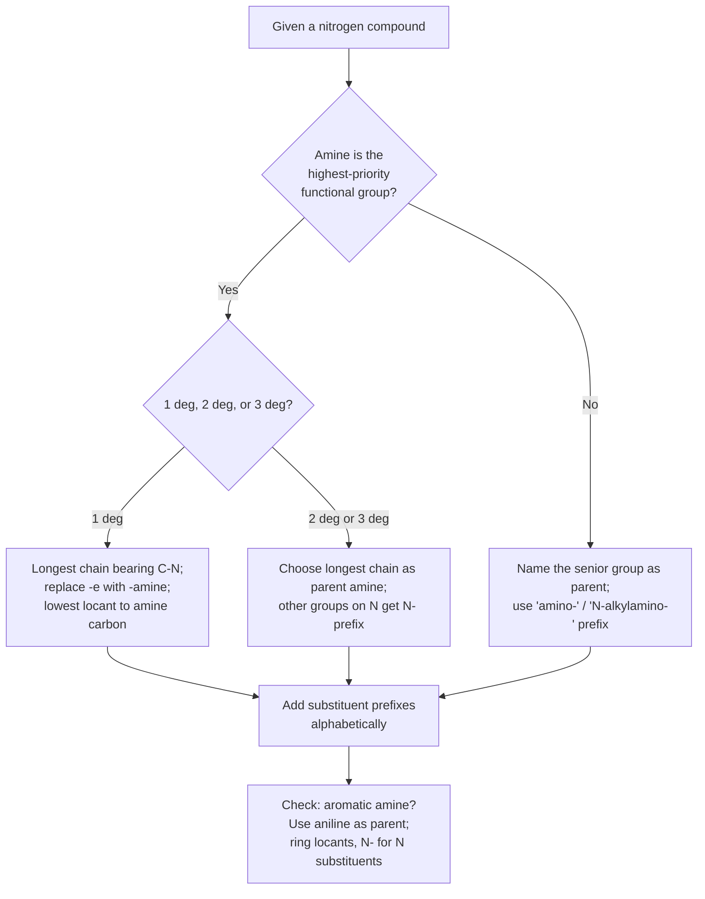
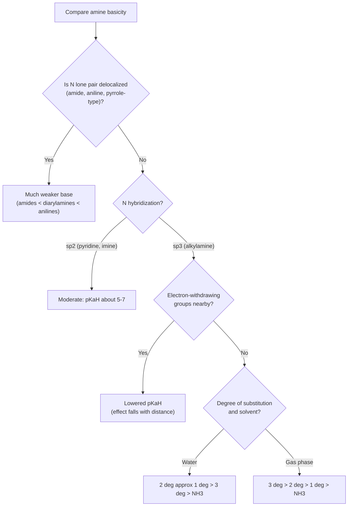

## Nomenclature and Basicity

### Overview

**Amines** are organic derivatives of ammonia ($\text{NH}_3$) in which one or more hydrogen atoms are replaced by alkyl or aryl groups. They contain a nitrogen atom bearing a lone pair, which governs their two defining chemical characteristics: **basicity** (the lone pair accepts a proton) and **nucleophilicity** (the lone pair attacks electrophiles).

$$\text{R-NH}_2 + \text{H}^+ \rightleftharpoons \text{R-NH}_3^+$$

This item covers two connected themes:

1. **Nomenclature:** how amines and related nitrogen compounds are classified and named (IUPAC and common names).
2. **Basicity:** how to quantify and predict amine basicity, and how structure, hybridization, resonance, induction, sterics, and solvation shape it.

**Key Points**

- Amines are classified as primary (1°), secondary (2°), or tertiary (3°) by the number of carbon groups on nitrogen, which differs from the alcohol convention (based on the carbon bearing the OH).
- Aliphatic amines are typically stronger bases than ammonia; aromatic amines and amides are much weaker bases.
- Basicity is best compared using the $pK_a$ of the **conjugate acid** ($\text{R-NH}_3^+$), where a higher $pK_a$ means a stronger base.
- The nitrogen lone pair availability is the central concept: anything that delocalizes or withdraws electron density from it decreases basicity.

### Classification of Nitrogen Compounds

#### Amines by Degree of Substitution

| Class | General formula | Example | Number of N–H bonds |
| --- | --- | --- | --- |
| Primary (1°) | $\text{RNH}_2$ | Ethylamine, $\text{CH}_3\text{CH}_2\text{NH}_2$ | 2 |
| Secondary (2°) | $\text{R}_2\text{NH}$ | Diethylamine, $(\text{CH}_3\text{CH}_2)_2\text{NH}$ | 1 |
| Tertiary (3°) | $\text{R}_3\text{N}$ | Triethylamine, $(\text{CH}_3\text{CH}_2)_3\text{N}$ | 0 |
| Quaternary ammonium salt | $\text{R}_4\text{N}^+\ \text{X}^-$ | Tetramethylammonium chloride | 0 (no lone pair) |

**Comparison with alcohol classification:** *tert*-butylamine, $(\text{CH}_3)_3\text{C-NH}_2$, is a **primary** amine (one carbon substituent on nitrogen) even though the carbon it is attached to is tertiary. Similarly, *tert*-butyl alcohol is a tertiary alcohol.

#### Structural Types

- **Aliphatic amines:** nitrogen attached to $sp^3$ carbon(s) only.
- **Aromatic amines (arylamines):** nitrogen attached directly to an aromatic ring (e.g., aniline).
- **Heterocyclic amines:** nitrogen is part of a ring (piperidine, pyrrolidine, pyridine, pyrrole, imidazole, indole).
- **Cyclic amines:** saturated N-containing rings such as aziridine (3-membered), azetidine (4), pyrrolidine (5), piperidine (6), and azepane (7).
- **Diamines and polyamines:** multiple amino groups (e.g., ethylenediamine, putrescine, spermidine).

#### Related Nitrogen Compounds

| Class | Functional group | Example |
| --- | --- | --- |
| Amide | $\text{RCONR'}_2$ | Acetamide |
| Imine (Schiff base) | $\text{R}_2\text{C=NR'}$ | N-Benzylideneaniline |
| Enamine | $\text{C=C-NR}_2$ | 1-Pyrrolidinocyclohexene |
| Nitrile | $\text{R-C}\equiv\text{N}$ | Acetonitrile |
| Nitro compound | $\text{R-NO}_2$ | Nitromethane |
| Azo compound | $\text{R-N=N-R'}$ | Azobenzene |
| Hydrazine | $\text{R-NH-NH}_2$ | Phenylhydrazine |
| Oxime | $\text{R}_2\text{C=N-OH}$ | Acetone oxime |
| Diazonium salt | $\text{Ar-N}_2^+\ \text{X}^-$ | Benzenediazonium chloride |
| Isocyanate | $\text{R-N=C=O}$ | Methyl isocyanate |
| Azide | $\text{R-N}_3$ | Phenyl azide |

### Nomenclature

#### IUPAC Naming of Simple Amines

**Rule 1: Primary amines.** Replace the terminal *-e* of the parent alkane name with *-amine*. The locant of the amino group is placed before the parent name or before the suffix (current IUPAC recommendations favor the locant immediately before the suffix).

- $\text{CH}_3\text{NH}_2$: methanamine (common: methylamine)
- $\text{CH}_3\text{CH}_2\text{CH}_2\text{NH}_2$: propan-1-amine (1-propanamine)
- $\text{CH}_3\text{CH(NH}_2)\text{CH}_3$: propan-2-amine (2-propanamine; common: isopropylamine)
- $\text{C}_6\text{H}_{11}\text{NH}_2$: cyclohexanamine (cyclohexylamine)

**Rule 2: Longest chain.** Choose the longest continuous carbon chain that contains the carbon bearing the amino group; number so that the amine-bearing carbon receives the lowest locant.

**Rule 3: Secondary and tertiary amines.** Name as N-substituted derivatives of the primary amine derived from the **longest chain** (or the most senior parent). Substituents on nitrogen are cited with the prefix **N-** (italic capital N).

- $\text{CH}_3\text{NHCH}_2\text{CH}_3$: N-methylethanamine
- $(\text{CH}_3)_2\text{NCH}_2\text{CH}_3$: N,N-dimethylethanamine
- $(\text{CH}_3\text{CH}_2)_3\text{N}$: N,N-diethylethanamine (triethylamine)
- $\text{CH}_3\text{CH}_2\text{CH}_2\text{N(CH}_3)\text{CH}_2\text{CH}_3$: N-ethyl-N-methylpropan-1-amine

**Rule 4: Symmetrical secondary and tertiary amines (common/substitutive alternatives).** Prefixes *di-* and *tri-* combined with the alkyl name and *-amine* are widely used: dimethylamine, diethylamine, trimethylamine.

**Rule 5: Diamines and polyamines.** Add multiplicative prefixes to *-amine*.

- $\text{H}_2\text{NCH}_2\text{CH}_2\text{NH}_2$: ethane-1,2-diamine (ethylenediamine)
- $\text{H}_2\text{N(CH}_2)_6\text{NH}_2$: hexane-1,6-diamine (hexamethylenediamine)
- $\text{H}_2\text{N(CH}_2)_4\text{NH}_2$: butane-1,4-diamine (putrescine)

**Rule 6: Amino as a substituent.** When a higher-priority functional group is present, the amine is named with the prefix **amino-** (or **N-alkylamino-**, **N,N-dialkylamino-**).

- $\text{H}_2\text{NCH}_2\text{CH}_2\text{OH}$: 2-aminoethan-1-ol (ethanolamine)
- $\text{H}_2\text{NCH}_2\text{COOH}$: aminoacetic acid (glycine)
- $\text{CH}_3\text{CH(NH}_2)\text{COOH}$: 2-aminopropanoic acid (alanine)
- $\text{(CH}_3)_2\text{NCH}_2\text{CH}_2\text{OH}$: 2-(dimethylamino)ethan-1-ol

**Functional group seniority (descending) relevant to amines:** carboxylic acid > ester > acyl halide > amide > nitrile > aldehyde > ketone > alcohol > **amine** > alkene > alkyne > alkane. An amine outranks alkenes and alkynes but is outranked by alcohols, so an amino-alcohol is named as an alcohol with an *amino* prefix.

#### Aromatic Amines

The parent name **aniline** ($\text{C}_6\text{H}_5\text{NH}_2$) is retained by IUPAC. Ring substituents are numbered with the carbon bearing $\text{NH}_2$ as C1; substituents on nitrogen use N-.

- $\text{C}_6\text{H}_5\text{NHCH}_3$: N-methylaniline
- $\text{C}_6\text{H}_5\text{N(CH}_3)_2$: N,N-dimethylaniline
- $\text{p-CH}_3\text{C}_6\text{H}_4\text{NH}_2$: 4-methylaniline (p-toluidine)
- $\text{p-O}_2\text{NC}_6\text{H}_4\text{NH}_2$: 4-nitroaniline
- Diphenylamine: $(\text{C}_6\text{H}_5)_2\text{NH}$ (N-phenylaniline)

Other retained names: **toluidine** (methylaniline isomers), **anisidine** (methoxyaniline isomers), and **phenetidine** (ethoxyaniline isomers).

#### Heterocyclic Amines

Common named parents (Hantzsch–Widman nomenclature applies to systematic naming; retained trivial names dominate in practice):

| Ring | Structure summary | Type | Approx. conjugate acid $pK_a$ |
| --- | --- | --- | --- |
| Aziridine | 3-membered, saturated | Aliphatic, strained | ~8.0 |
| Azetidine | 4-membered, saturated | Aliphatic | ~11.3 |
| Pyrrolidine | 5-membered, saturated | Aliphatic | ~11.3 |
| Piperidine | 6-membered, saturated | Aliphatic | ~11.1 |
| Morpholine | 6-membered, O and N | Aliphatic | ~8.4 |
| Pyridine | 6-membered aromatic, one N | Aromatic; lone pair in $sp^2$ orbital | ~5.2 |
| Pyrrole | 5-membered aromatic, one N | Aromatic; lone pair part of $\pi$ system | ~ −3.8 |
| Imidazole | 5-membered, two N | Aromatic, amphoteric | ~7.0 |
| Pyrimidine | 6-membered, two N | Aromatic | ~1.3 |
| Quinoline | Benzo-fused pyridine | Aromatic | ~4.9 |
| Indole | Benzo-fused pyrrole | Aromatic; not basic at N | ~ −3.6 (protonates at C3) |

[Values are approximate and vary with literature source and measurement conditions.]

Numbering of heterocycles begins at the heteroatom (position 1) and proceeds around the ring, giving substituents the lowest locants. In **N-substituted** heterocycles the N-substituent is named with the prefix N- (or by locant 1): N-methylpyrrolidine, 1-methylpyrrolidine.

#### Quaternary Ammonium Salts

Named as substituted ammonium salts: list substituents alphabetically, add *ammonium*, then the anion.

- $(\text{CH}_3)_4\text{N}^+\ \text{Cl}^-$: tetramethylammonium chloride
- $\text{C}_6\text{H}_5\text{CH}_2\text{N}^+(\text{CH}_3)_3\ \text{Br}^-$: benzyltrimethylammonium bromide
- Protonated amines are named as ammonium salts: $\text{CH}_3\text{NH}_3^+\ \text{Cl}^-$ is methylammonium chloride (or methanaminium chloride in current IUPAC recommendations).

#### Naming Other Nitrogen Compounds

- **Amides:** replace *-oic acid* with *-amide*; N-substituents use N- ($\text{CH}_3\text{CONHCH}_3$: N-methylacetamide or N-methylethanamide).
- **Nitriles:** replace *-e* with *-nitrile* or *-oic acid* with *-onitrile* (acetonitrile, benzonitrile, propanenitrile).
- **Nitro compounds:** prefix *nitro-* (nitromethane, 1-nitropropane).
- **Imines:** *-imine*, with N-substituents (ethanimine, N-methylethanimine).
- **Hydrazines:** hydrazine parent, e.g., phenylhydrazine, 1,1-dimethylhydrazine.
- **Azo compounds:** azobenzene; substituted: (E)-1,2-diphenyldiazene.
- **Diazonium salts:** benzenediazonium chloride.

#### Naming Workflow

#### Worked Nomenclature Examples

**Example 1**

$\text{CH}_3\text{CH}_2\text{CH(CH}_3)\text{CH}_2\text{NH}_2$

- Longest chain containing the C–N carbon: four carbons (butane), with the amino group on C1 and a methyl at C2.
- **Name:** 2-methylbutan-1-amine.

**Example 2**

$\text{CH}_3\text{CH}_2\text{N(CH}_3)\text{CH}_2\text{CH}_2\text{CH}_3$

- Parent: the longest chain attached to N is propyl (3 carbons), so the parent is propan-1-amine.
- N-substituents: ethyl and methyl (alphabetical: ethyl before methyl).
- **Name:** N-ethyl-N-methylpropan-1-amine.

**Example 3**

$\text{H}_2\text{N-CH}_2\text{CH}_2\text{-CH(OH)-CH}_3$

- The alcohol outranks the amine, so the parent is butan-2-ol with an amino prefix; number so the OH gets the lowest locant: $\text{CH}_3\text{-CH(OH)-CH}_2\text{-CH}_2\text{NH}_2$ numbering from the OH end gives C2 for OH and C4 for amino.
- **Name:** 4-aminobutan-2-ol.

**Example 4**

$\text{2,4-dinitro-N-methylaniline}$: aniline parent with N-methyl and nitro groups at C2 and C4; the N-substituent is cited alphabetically with ring substituents (dinitro counts as *n*, methyl as *m*).

- **Name:** N-methyl-2,4-dinitroaniline.

**Example 5: Stereochemistry**

Chiral amines with a stereogenic carbon use CIP descriptors. For $\text{CH}_3\text{CH(NH}_2)\text{C}_6\text{H}_5$:

- **Name:** (R)-1-phenylethan-1-amine or (S)-1-phenylethan-1-amine (both enantiomers used as resolving agents).

**Note on nitrogen stereochemistry:** a simple tertiary amine with three different substituents is chiral in principle (pyramidal nitrogen), but it undergoes rapid **pyramidal inversion** (barrier about 25 kJ/mol for typical trialkylamines) at room temperature, so enantiomers cannot normally be isolated. Inversion is blocked in quaternary ammonium salts, in Tröger's base (bridgehead nitrogens), and in some strained or bridged systems, which allows chiral N centers to be resolved [barrier values approximate].

<svg xmlns="http://www.w3.org/2000/svg" viewBox="0 0 700 300" width="700" height="300" font-family="Arial, sans-serif">
<title>Pyramidal Inversion of Amines (svg_diagram)</title>
<text x="350" y="24" text-anchor="middle" font-size="16" font-weight="bold">Pyramidal Inversion at Nitrogen (svg_diagram)</text>
<rect x="30" y="60" width="180" height="110" rx="10" fill="#e8f4fd" stroke="#2980b9" />
<text x="120" y="88" text-anchor="middle" font-size="13">Pyramidal N (enantiomer A)</text>
<text x="120" y="110" text-anchor="middle" font-size="12">sp3, lone pair up</text>
<text x="120" y="130" text-anchor="middle" font-size="12">R1, R2, R3 below</text>
<rect x="260" y="60" width="180" height="110" rx="10" fill="#fef5e7" stroke="#e67e22" />
<text x="350" y="88" text-anchor="middle" font-size="13">Planar transition state</text>
<text x="350" y="110" text-anchor="middle" font-size="12">N is sp2-like</text>
<text x="350" y="130" text-anchor="middle" font-size="12">lone pair in a p orbital</text>
<rect x="490" y="60" width="180" height="110" rx="10" fill="#eafaf1" stroke="#27ae60" />
<text x="580" y="88" text-anchor="middle" font-size="13">Pyramidal N (enantiomer B)</text>
<text x="580" y="110" text-anchor="middle" font-size="12">sp3, lone pair down</text>
<text x="580" y="130" text-anchor="middle" font-size="12">R1, R2, R3 above</text>
<line x1="210" y1="115" x2="258" y2="115" stroke="#333" stroke-width="2" marker-end="url(#arr5)" />
<line x1="440" y1="115" x2="488" y2="115" stroke="#333" stroke-width="2" marker-end="url(#arr5)" />
<text x="350" y="215" text-anchor="middle" font-size="12">Barrier is low (about 25 kJ/mol for simple trialkylamines)</text>
<text x="350" y="235" text-anchor="middle" font-size="12">so enantiomers interconvert rapidly at room temperature</text>
<text x="350" y="265" text-anchor="middle" font-size="11" fill="#555">Inversion is blocked in quaternary ammonium salts and some bridgehead nitrogen systems</text>
</svg>

### Structure and Bonding of Amines

- **Geometry:** the nitrogen of a simple aliphatic amine is approximately $sp^3$ hybridized and **trigonal pyramidal**, with a C–N–C bond angle near 108–112° (compare $\text{NH}_3$ at 107°).
- **Lone pair orbital:** occupies an $sp^3$ orbital (about 25% s character) in aliphatic amines.
- **Aromatic amines:** nitrogen is less pyramidal (flatter) because the lone pair delocalizes into the ring; the C–N bond is shorter than in aliphatic amines.
- **Amides:** nitrogen is essentially planar and $sp^2$-like owing to resonance with the carbonyl.
- **Pyridine:** the nitrogen lone pair lies in an $sp^2$ orbital in the plane of the ring, perpendicular to the aromatic $\pi$ system, and is available for protonation.
- **Pyrrole:** the nitrogen lone pair is part of the aromatic sextet, so it is **not** available for protonation without destroying aromaticity.

### Physical Properties

| Property | Trend and reasoning |
| --- | --- |
| Boiling point | 1° and 2° amines hydrogen-bond (N–H···N), giving higher boiling points than alkanes of similar mass but lower than corresponding alcohols (N is less electronegative than O, so N–H···N bonds are weaker than O–H···O). Tertiary amines cannot donate hydrogen bonds and boil lower than isomeric 1° and 2° amines. |
| Water solubility | Lower amines (up to about 5–6 carbons) dissolve in water because they accept hydrogen bonds; solubility drops as the hydrophobic chain lengthens. |
| Odor | Volatile amines smell "fishy" or ammoniacal (trimethylamine); diamines such as putrescine and cadaverine smell of decay. |
| Solubility in acid | Water-insoluble amines dissolve in dilute aqueous acid by forming water-soluble ammonium salts. |

**Boiling point illustration (approximate):**

| Compound | Molar mass (g/mol) | bp (°C) |
| --- | --- | --- |
| Butane | 58 | −1 |
| Trimethylamine (3°) | 59 | 3 |
| Ethylmethylamine (2°) | 59 | 37 |
| Propylamine (1°) | 59 | 48 |
| Propan-1-ol | 60 | 97 |

**Spectroscopic signatures (summary)**

- **IR:** primary amines show two N–H stretches (symmetric and asymmetric) around 3300–3500 $\text{cm}^{-1}$; secondary amines show one; tertiary amines show none. An N–H bend appears near 1600 $\text{cm}^{-1}$ for primary amines.
- **$^1\text{H}$ NMR:** N–H protons appear as broad signals at $\delta$ about 0.5–5 ppm (variable, exchangeable with $\text{D}_2\text{O}$); protons on the carbon attached to N appear at $\delta$ about 2.3–3.0 ppm.
- **$^{13}\text{C}$ NMR:** carbons attached to N appear at about 30–65 ppm.
- **MS (nitrogen rule):** a compound with an odd number of nitrogen atoms has an odd nominal molecular mass; $\alpha$-cleavage is the dominant fragmentation and produces a resonance-stabilized iminium ion.

### Basicity of Amines

#### Definitions and Scales

**Brønsted–Lowry basicity:** a base accepts a proton. For an amine B in water:

$$\text{B} + \text{H}_2\text{O} \rightleftharpoons \text{BH}^+ + \text{OH}^-, \qquad K_b = \frac{[\text{BH}^+][\text{OH}^-]}{[\text{B}]}$$

$$pK_b = -\log K_b$$

Basicity is more conveniently compared through the acid dissociation constant of the **conjugate acid** BH⁺:

$$\text{BH}^+ \rightleftharpoons \text{B} + \text{H}^+, \qquad K_a = \frac{[\text{B}][\text{H}^+]}{[\text{BH}^+]}$$

At 25 °C in water, the two are related by:

$$pK_a(\text{BH}^+) + pK_b(\text{B}) = pK_w = 14.00$$

**Key Points**

- A **higher** $pK_a$ of the conjugate acid means a **stronger** base (the conjugate acid holds its proton less readily released, so the base binds $\text{H}^+$ more strongly).
- A **lower** $pK_b$ means a stronger base.
- Always state the medium: the basicity order of aliphatic amines in water differs from that in the gas phase.

#### Reference Values

| Base | Conjugate acid | $pK_a$ of conjugate acid (approx., water, 25 °C) | $pK_b$ (approx.) |
| --- | --- | --- | --- |
| Ammonia | $\text{NH}_4^+$ | 9.25 | 4.75 |
| Methylamine | $\text{CH}_3\text{NH}_3^+$ | 10.6 | 3.4 |
| Dimethylamine | $(\text{CH}_3)_2\text{NH}_2^+$ | 10.7 | 3.3 |
| Trimethylamine | $(\text{CH}_3)_3\text{NH}^+$ | 9.8 | 4.2 |
| Ethylamine | $\text{CH}_3\text{CH}_2\text{NH}_3^+$ | 10.7 | 3.3 |
| Diethylamine | $(\text{CH}_3\text{CH}_2)_2\text{NH}_2^+$ | 11.0 | 3.0 |
| Triethylamine | $(\text{CH}_3\text{CH}_2)_3\text{NH}^+$ | 10.7 | 3.3 |
| Cyclohexylamine | $\text{C}_6\text{H}_{11}\text{NH}_3^+$ | 10.6 | 3.4 |
| Aniline | $\text{C}_6\text{H}_5\text{NH}_3^+$ | 4.6 | 9.4 |
| 4-Nitroaniline |  | 1.0 | 13.0 |
| 4-Methoxyaniline |  | 5.3 | 8.7 |
| Diphenylamine |  | 0.8 | 13.2 |
| Pyridine | $\text{C}_5\text{H}_5\text{NH}^+$ | 5.2 | 8.8 |
| Acetamide (O-protonation) |  | ~ −0.5 | ~14.5 |

[Values are approximate literature figures and vary slightly between sources.]

#### The Nitrogen Lone Pair and Basicity

Basicity depends on how readily the nitrogen lone pair can form a bond to a proton. Five structural effects control this:

1. **Inductive effects** (alkyl groups donating, electronegative groups withdrawing).
2. **Resonance/delocalization** of the lone pair.
3. **Hybridization** of the nitrogen (s-character of the lone pair orbital).
4. **Solvation** of the conjugate acid (in protic solvents).
5. **Steric effects** (crowding around N and the ammonium ion).

#### Inductive Effects

Alkyl groups are weakly electron-donating (+I). They increase electron density on nitrogen and stabilize the positive charge of the ammonium ion, raising basicity relative to ammonia.

$$\text{NH}_3 < \text{RNH}_2 \quad (\text{in the gas phase, basicity increases: } \text{NH}_3 < \text{RNH}_2 < \text{R}_2\text{NH} < \text{R}_3\text{N})$$

In the gas phase, where solvation is absent, more alkyl groups always raise basicity through polarizability and inductive stabilization of the ammonium ion. In water, the trend is more complicated (see solvation).

Electron-withdrawing groups near the nitrogen (halogens, carbonyl, nitro, $\text{CF}_3$) lower basicity by pulling electron density away from N.

| Amine | Conjugate acid $pK_a$ (approx.) | Comment |
| --- | --- | --- |
| Ethylamine | 10.7 | Reference alkylamine |
| 2-Fluoroethylamine | 9.0 | One F at $\beta$ position lowers $pK_a$ |
| 2,2,2-Trifluoroethylamine | 5.7 | Three F atoms strongly withdraw |
| Glycine methyl ester (amino group) | 7.6 | Ester carbonyl is electron-withdrawing |

The effect diminishes with distance: the effect of an electron-withdrawing group on the $pK_a$ drops sharply with each intervening carbon.

#### Resonance (Delocalization)

**Amides:** the nitrogen lone pair is delocalized into the carbonyl group:

$$\text{R-C(=O)-NR'}_2 \longleftrightarrow \text{R-C(-O}^-\text{)=N}^+\text{R'}_2$$

Because the lone pair is tied up in resonance, amides are essentially non-basic at nitrogen. When protonated, they protonate on **oxygen** (giving a resonance-stabilized cation), with conjugate acid $pK_a$ around −0.5 to 0.

**Aromatic amines (anilines):** the lone pair delocalizes into the benzene ring:

$$\text{C}_6\text{H}_5\text{-NH}_2 \longleftrightarrow \text{C}_6\text{H}_5\text{-}\overset{+}{\text{N}}\text{H}_2\ (\text{with negative charge on ortho/para C})$$

Delocalization stabilizes the free base but not the anilinium ion (whose nitrogen has no lone pair to delocalize). Protonation therefore costs resonance energy, and aniline ($pK_a$ of conjugate acid 4.6) is about $10^6$ times less basic than cyclohexylamine (10.6).

**Substituent effects on anilines:**

| Substituent on ring | Effect on basicity | Reason |
| --- | --- | --- |
| $\text{-NO}_2$ (para or ortho) | Strongly decreases | Withdraws density by resonance and induction; additional delocalization of N lone pair |
| $\text{-CN}$, $\text{-COR}$, $\text{-CF}_3$ | Decreases | Electron-withdrawing |
| $\text{-Cl}$, $\text{-Br}$ | Slightly decreases | Inductive withdrawal outweighs weak resonance donation |
| $\text{-CH}_3$ | Slightly increases | Weak electron donation |
| $\text{-OCH}_3$ (para) | Increases | Resonance donation into ring dominates |
| $\text{-NO}_2$ (meta) | Decreases | Inductive effect only (no direct resonance with N) |

Hammett correlations apply: the $pK_a$ of substituted anilinium ions correlates with $\sigma$ with $\rho \approx 2.9$ (approximate), showing high sensitivity to substituents.

**Conjugation in other systems:**

- **Vinylamines/enamines:** the lone pair is conjugated with the C=C, lowering basicity at N (enamines protonate at carbon $\beta$ to N, giving iminium ions).
- **Guanidine:** an exceptional case where protonation *increases* delocalization, giving a highly resonance-stabilized guanidinium ion; guanidine is a very strong organic base ($pK_a$ of conjugate acid ≈ 13.6).
- **Amidines:** protonation gives a delocalized amidinium ion (e.g., DBU and DBN have conjugate acid $pK_a$ near 12–13 in water, higher in nonaqueous scales) [approximate].

#### Hybridization Effects

Greater s-character in the orbital holding the lone pair means the electrons are held closer to the nucleus and are less available for bonding to $\text{H}^+$.

| Nitrogen type | Lone pair orbital | s-character | Example | Conjugate acid $pK_a$ (approx.) |
| --- | --- | --- | --- | --- |
| Amine | $sp^3$ | 25% | Piperidine | 11.1 |
| Imine / pyridine | $sp^2$ | 33% | Pyridine | 5.2 |
| Nitrile | $sp$ | 50% | Acetonitrile | ~ −10 |

Thus: $\text{amine} \gg \text{pyridine} \gg \text{nitrile}$ in basicity.

**Comparison: Pyridine vs. piperidine**

- Pyridine's lone pair is in an $sp^2$ orbital; piperidine's is in an $sp^3$ orbital.
- Piperidine ($pK_a$ ≈ 11.1) is about $10^6$ times more basic than pyridine ($pK_a$ ≈ 5.2).

**Comparison: Pyridine vs. pyrrole**

- Pyrrole's N lone pair is part of the 6 $\pi$-electron aromatic system; protonation at N would destroy aromaticity, so pyrrole is an extremely weak base (protonates at C2 in strong acid).

**Comparison: Imidazole**

Imidazole has two nitrogens: one pyrrole-like (N1, lone pair in the aromatic sextet) and one pyridine-like (N3, lone pair in the plane, available for protonation). Protonation occurs at N3, and the resulting imidazolium cation is stabilized by symmetric resonance delocalization of the charge between both nitrogens. Conjugate acid $pK_a$ ≈ 7.0, which is why the histidine imidazole side chain acts as a physiological-range acid/base catalyst in enzymes.

<svg xmlns="http://www.w3.org/2000/svg" viewBox="0 0 700 320" width="700" height="320" font-family="Arial, sans-serif">
<title>Basicity Spectrum of Nitrogen Compounds (svg_diagram)</title>
<text x="350" y="24" text-anchor="middle" font-size="16" font-weight="bold">Approximate Basicity Spectrum (svg_diagram)</text>
<line x1="40" y1="100" x2="660" y2="100" stroke="#333" stroke-width="3" marker-end="url(#arr6)" />
<text x="40" y="80" font-size="12">Weaker base</text>
<text x="660" y="80" text-anchor="end" font-size="12">Stronger base</text>
<line x1="70" y1="95" x2="70" y2="110" stroke="#333" stroke-width="2" />
<line x1="180" y1="95" x2="180" y2="110" stroke="#333" stroke-width="2" />
<line x1="290" y1="95" x2="290" y2="110" stroke="#333" stroke-width="2" />
<line x1="400" y1="95" x2="400" y2="110" stroke="#333" stroke-width="2" />
<line x1="510" y1="95" x2="510" y2="110" stroke="#333" stroke-width="2" />
<line x1="620" y1="95" x2="620" y2="110" stroke="#333" stroke-width="2" />
<text x="70" y="135" text-anchor="middle" font-size="12">Amides</text>
<text x="70" y="151" text-anchor="middle" font-size="11">pKaH ~ -0.5</text>
<text x="180" y="135" text-anchor="middle" font-size="12">Diarylamines</text>
<text x="180" y="151" text-anchor="middle" font-size="11">pKaH ~ 1</text>
<text x="290" y="135" text-anchor="middle" font-size="12">Anilines</text>
<text x="290" y="151" text-anchor="middle" font-size="11">pKaH ~ 4.6</text>
<text x="400" y="135" text-anchor="middle" font-size="12">Pyridine</text>
<text x="400" y="151" text-anchor="middle" font-size="11">pKaH ~ 5.2</text>
<text x="510" y="135" text-anchor="middle" font-size="12">Ammonia</text>
<text x="510" y="151" text-anchor="middle" font-size="11">pKaH ~ 9.25</text>
<text x="620" y="135" text-anchor="middle" font-size="12">Alkylamines</text>
<text x="620" y="151" text-anchor="middle" font-size="11">pKaH ~ 10-11</text>
<text x="350" y="215" text-anchor="middle" font-size="12">Key: lone pair availability decreases with delocalization (resonance),</text>
<text x="350" y="233" text-anchor="middle" font-size="12">increased s-character, and electron-withdrawing substituents</text>
<text x="350" y="275" text-anchor="middle" font-size="11" fill="#555">Values are approximate conjugate-acid pKa in water at 25 C</text>
</svg>

#### Solvation Effects and the Aqueous Trend

In water, the basicity order of methyl-substituted amines is **not** monotonic with substitution:

$$\text{(CH}_3)_2\text{NH} \approx \text{CH}_3\text{NH}_2 > (\text{CH}_3)_3\text{N} > \text{NH}_3$$

[Approximate $pK_a$ of conjugate acids: 10.7, 10.6, 9.8, 9.25.]

**Reason:** the ammonium ion is stabilized by hydrogen bonding of its N–H protons to water. A primary ammonium ion ($\text{RNH}_3^+$) has three N–H bonds available for hydrogen bonding; a secondary has two; a tertiary has only one. As more alkyl groups are added, inductive stabilization improves but **solvation of the cation worsens**, so the two effects compete and the maximum basicity in water is reached at the secondary amine for methyl, and at the secondary amine (diethylamine) for ethyl.

For bulkier groups, steric hindrance further compresses solvation of the tertiary ammonium ion.

**Gas-phase versus solution:**

| Medium | Basicity order (methylamines) | Explanation |
| --- | --- | --- |
| Gas phase | $\text{(CH}_3)_3\text{N} > (\text{CH}_3)_2\text{NH} > \text{CH}_3\text{NH}_2 > \text{NH}_3$ | Polarizability and inductive stabilization dominate |
| Water | $\text{(CH}_3)_2\text{NH} \approx \text{CH}_3\text{NH}_2 > (\text{CH}_3)_3\text{N} > \text{NH}_3$ | Solvation of the ammonium ion offsets the inductive trend |
| Non-hydrogen-bonding solvents (e.g., chlorobenzene) | Nearer to the gas-phase order | Reduced solvation differences |

**Key Points**

- Solvation is a major reason that acidity/basicity orders in solution can differ from intrinsic (gas-phase) orders.
- Ethylamine and diethylamine have similar aqueous basicity to methylamine and dimethylamine, since both inductive and solvation effects operate similarly.

#### Steric Effects

- **Steric hindrance to solvation:** bulky substituents shield the ammonium ion from solvent, reducing stabilization and lowering basicity.
- **Steric hindrance to protonation:** typically small, because $\text{H}^+$ is tiny, but bulky groups (e.g., in 2,6-di-*tert*-butylpyridine) block coordination of larger Lewis acids while still allowing protonation. Such hindered bases are "non-nucleophilic bases."
- **Non-nucleophilic bases:** N,N-diisopropylethylamine (Hünig's base, $pK_a$ ≈ 10.7–11), 2,6-lutidine, 2,6-di-*tert*-butylpyridine, and proton sponge (1,8-bis(dimethylamino)naphthalene, conjugate acid $pK_a$ ≈ 12.1 in water) are strongly basic but poorly nucleophilic.

**Proton sponge:** the two dimethylamino groups are forced into close proximity by the naphthalene peri-positions; steric strain in the free base and strong intramolecular hydrogen bonding in the protonated form together give unusually high basicity for an aromatic amine.

#### Ring Strain and Geometry

- **Aziridine** ($pK_a$ ≈ 8.0) is a weaker base than other cyclic amines, because the N lone pair in a 3-membered ring has increased s-character (ring strain increases the s-character of the orbitals directed toward the ring, leaving more p-character in the ring bonds and more s in the lone pair).
- **Quinuclidine** (1-azabicyclo[2.2.2]octane) is a stronger base than triethylamine ($pK_a$ ≈ 11.0 vs. 10.7), since its bicyclic cage pins the alkyl groups back and exposes the lone pair, reducing steric hindrance to solvation.

#### Comparison Summary

| Factor | Increases basicity | Decreases basicity |
| --- | --- | --- |
| Inductive | Electron-donating alkyl groups | Electron-withdrawing groups (F, Cl, C=O, $\text{NO}_2$, $\text{CF}_3$) |
| Resonance | Protonation-enhanced delocalization (guanidines, amidines) | Lone pair delocalization in free base (amides, anilines, enamines) |
| Hybridization | Lower s-character ($sp^3$) | Higher s-character ($sp^2$, $sp$) |
| Solvation | Extensive H-bonding to the ammonium ion (1° > 2° > 3°) | Poor solvation of the ammonium ion |
| Sterics | Exposed lone pair (quinuclidine) | Crowding that impedes solvation of $\text{R}_3\text{NH}^+$ |

### Predicting and Ranking Basicity: A Stepwise Approach

**Ranking checklist**

1. Is the nitrogen lone pair available (not part of resonance)?
2. What is the hybridization of N?
3. Which electron-donating or -withdrawing groups are present, and how far are they from N?
4. In which solvent is the comparison made?
5. Are there steric or ring-strain effects?

### Amines as Nucleophiles vs. Bases

Basicity (thermodynamic; $\text{H}^+$ affinity) and nucleophilicity (kinetic; rate of attack on an electrophilic carbon) are related but not identical.

- Nucleophilicity generally increases with basicity among structurally similar amines.
- Steric hindrance reduces nucleophilicity more than basicity: triethylamine is more basic than triethylenediamine (DABCO) in some scales, yet DABCO is a better nucleophile because its alkyl groups are tied back.
- Primary and secondary amines are excellent nucleophiles (alkylation, acylation); tertiary amines are good nucleophiles toward unhindered electrophiles but cannot form stable neutral acylation products.

### Amine Salts and Solubility

Amines react quantitatively with strong acids to form ammonium salts, which are ionic, water-soluble, and non-volatile:

$$\text{R-NH}_2 + \text{HCl} \rightarrow \text{R-NH}_3^+\ \text{Cl}^-$$

Treatment of the salt with a stronger base (e.g., aqueous NaOH) liberates the free amine:

$$\text{R-NH}_3^+\ \text{Cl}^- + \text{NaOH} \rightarrow \text{R-NH}_2 + \text{NaCl} + \text{H}_2\text{O}$$

**Applications**

- **Acid–base extraction:** separating amines from neutral and acidic compounds. Extract an organic solution with aqueous HCl; the amine moves to the aqueous layer as ammonium salt; basify and re-extract to recover the amine.
- **Drug formulation:** many amine-containing drugs are administered as hydrochloride salts for improved water solubility and stability (e.g., diphenhydramine HCl, fluoxetine HCl).
- **Resolution of racemic acids:** enantiopure chiral amines form diastereomeric ammonium carboxylate salts that can be separated by crystallization.

**Henderson–Hasselbalch for amines**

$$pH = pK_a(\text{BH}^+) + \log\frac{[\text{B}]}{[\text{BH}^+]}$$

At $pH = pK_a$, half of the amine is protonated. For an amine with conjugate acid $pK_a = 10.6$:

- At $pH = 7.4$ (blood): $\log([\text{B}]/[\text{BH}^+]) = 7.4 - 10.6 = -3.2$, so $[\text{B}]/[\text{BH}^+] \approx 6 \times 10^{-4}$, meaning about 99.94% is protonated.

### Worked Examples

**Example 1: Ranking by basicity**

Rank in order of increasing basicity in water: aniline, ammonia, ethylamine, acetamide, diethylamine.

Approximate conjugate acid $pK_a$ values: acetamide (~ −0.5), aniline (4.6), ammonia (9.25), ethylamine (10.7), diethylamine (11.0).

$$\text{acetamide} < \text{aniline} < \text{ammonia} < \text{ethylamine} < \text{diethylamine}$$

**Example 2: Effect of a nitro group**

Explain why 4-nitroaniline ($pK_a$ of conjugate acid ≈ 1.0) is much less basic than aniline (4.6).

- The nitro group is a strong electron-withdrawing group by both induction and resonance.
- In the free base, the amine lone pair can delocalize through the ring into the para nitro group (a push–pull arrangement), which stabilizes the neutral molecule.
- Protonation would eliminate this stabilization, so the base is less inclined to accept a proton.

**Example 3: Pyridine vs. piperidine**

Why is piperidine ($pK_a$ ≈ 11.1) about a million times more basic than pyridine ($pK_a$ ≈ 5.2)?

- The lone pair of piperidine is in an $sp^3$ orbital (25% s), while that of pyridine is in an $sp^2$ orbital (33% s).
- Greater s-character holds the lone pair closer to the nucleus, reducing its availability.

**Example 4: Position of protonation in a molecule with two nitrogens**

4-(Dimethylamino)pyridine (DMAP): protonation occurs on the **ring nitrogen**, not the dimethylamino nitrogen.

- The dimethylamino lone pair donates into the ring by resonance, increasing the electron density on the ring nitrogen.
- The pyridinium ion formed is stabilized by the resonance contributor with positive charge on the exocyclic nitrogen.
- Conjugate acid $pK_a$ ≈ 9.6, much higher than pyridine (5.2), which explains DMAP's effectiveness as a nucleophilic catalyst in acylation.

**Example 5: Calculation of percent protonation**

An amine has conjugate acid $pK_a$ = 9.8. What fraction is protonated at $pH = 8.0$?

$$8.0 = 9.8 + \log\frac{[\text{B}]}{[\text{BH}^+]} \Rightarrow \log\frac{[\text{B}]}{[\text{BH}^+]} = -1.8$$

$$\frac{[\text{B}]}{[\text{BH}^+]} = 10^{-1.8} \approx 0.0158$$

$$\text{fraction protonated} = \frac{1}{1 + 0.0158} \approx 0.984$$

**Output**

About 98.4% of the amine is present as the ammonium ion at pH 8.0.

**Example 6: Naming a polyfunctional compound**

$\text{H}_2\text{N-CH}_2\text{-CH}_2\text{-CH(CH}_3)\text{-COOH}$

- The carboxylic acid is the principal characteristic group, so the parent is butanoic acid.
- Number from the carboxyl carbon (C1): the methyl is at C2 and the amino group is at C4.
- **Name:** 4-amino-2-methylbutanoic acid.

**Example 7: Aqueous $\text{pH}$ of an amine solution**

Calculate the pH of 0.10 M methylamine ($pK_b$ = 3.36, $K_b = 4.4 \times 10^{-4}$).

$$K_b = \frac{x^2}{0.10 - x} \approx \frac{x^2}{0.10} \Rightarrow x = \sqrt{4.4 \times 10^{-4} \times 0.10} = \sqrt{4.4 \times 10^{-5}} \approx 6.6 \times 10^{-3}\ \text{M}$$

(The approximation $x \ll 0.10$ is acceptable: $x/0.10 \approx 6.6\%$, which is slightly above the 5% rule; solving the quadratic gives $x \approx 6.4 \times 10^{-3}$ M.)

$$pOH = -\log(6.4 \times 10^{-3}) \approx 2.19,\quad pH = 14.00 - 2.19 \approx 11.81$$

**Output**

$pH \approx 11.8$.

### Common Pitfalls

- Treating a large $pK_a$ (of the conjugate acid) as meaning a weak base; the relationship is direct: higher conjugate-acid $pK_a$ means stronger base.
- Classifying amines by the substitution of the carbon rather than of nitrogen (*tert*-butylamine is a **primary** amine).
- Assuming that more alkyl substitution always increases basicity in water; solvation of the ammonium ion changes the order so that tertiary amines are often weaker than secondary amines.
- Forgetting that amides are not basic at nitrogen and protonate on oxygen.
- Assuming pyrrole and indole are basic at nitrogen; the lone pair is part of the aromatic system.
- Comparing basicities without stating the solvent or medium.
- Omitting the N- prefix for N-substituents in names (e.g., writing "methylethanamine" instead of "N-methylethanamine").
- Choosing the wrong parent chain in secondary and tertiary amines (parent should be the longest chain or the most senior group, with the other groups cited as N-substituents).
- Forgetting that an alcohol outranks an amine in priority, so amino alcohols are named as alcohols with an *amino* prefix.

### Related Topics

- Synthesis of amines (reductive amination, Gabriel synthesis, reduction of nitriles/amides/nitro compounds, Hofmann rearrangement)
- Reactions of amines (alkylation, acylation, Hofmann elimination, Cope elimination)
- Aromatic amines and diazonium salt chemistry (Sandmeyer, azo coupling)
- Heterocyclic amines and aromaticity (pyridine, pyrrole, imidazole, indole)
- Amino acids, zwitterions, and isoelectric point
- Enamines and the Stork enamine synthesis
- Amidines, guanidines, and superbases
- Phase-transfer catalysis with quaternary ammonium salts
- Chiral amines and resolution of racemates
- Spectroscopy of amines (IR, NMR, MS nitrogen rule)