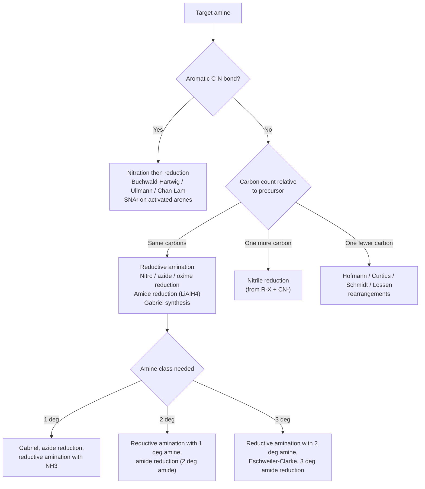
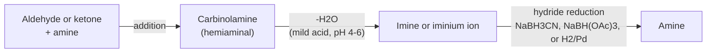
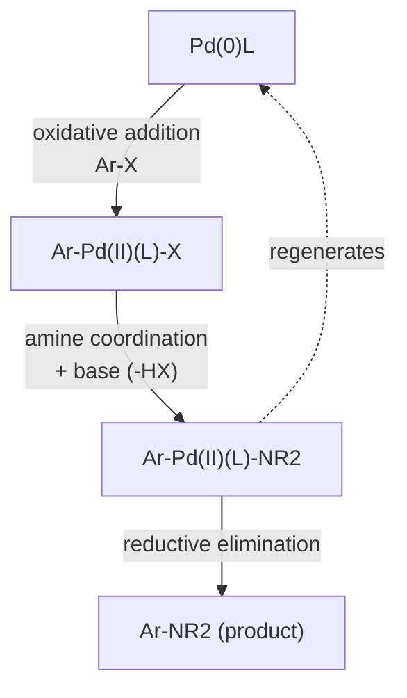

## Synthesis of Amines

### Overview

Amines are prepared by forming a carbon–nitrogen bond, by transforming an existing nitrogen-containing functional group (nitro, nitrile, amide, azide, imine) into an amine, or by rearrangements that convert a carbonyl derivative into an amine with loss of carbon. Choosing a method depends on three questions:

1. **Which class of amine is required** (primary, secondary, tertiary, aromatic, or chiral)?
2. **Which starting material is available** (alkyl halide, carbonyl compound, carboxylic acid derivative, arene, alkene)?
3. **Does the carbon skeleton need to change** (same carbon count, one carbon longer, one carbon shorter)?

**Key Points**

- Direct alkylation of ammonia or an amine with an alkyl halide is simple but suffers from **over-alkylation**, because each alkylation product is more nucleophilic than its precursor.
- Methods that avoid over-alkylation (Gabriel synthesis, azide reduction, nitrile reduction, reductive amination, amide reduction) are preferred for clean preparation of a single amine class.
- **Reductive amination** is the most versatile general method for primary, secondary, and tertiary amines.
- Rearrangements (Hofmann, Curtius, Schmidt, Lossen) give primary amines with **one fewer carbon** than the carbonyl precursor, with retention of configuration at the migrating carbon.
- Aromatic amines are usually prepared by nitration followed by reduction, or by metal-catalyzed C–N coupling (Buchwald–Hartwig, Ullmann–Goldberg, Chan–Lam).

### Strategic Overview

### Direct Alkylation of Ammonia and Amines

#### Reaction

Ammonia or an amine acts as a nucleophile in an $\text{S}_\text{N}2$ reaction with an alkyl halide:

$$\text{R-X} + \text{NH}_3 \rightarrow \text{R-NH}_3^+\ \text{X}^- \xrightarrow{\text{NH}_3} \text{R-NH}_2 + \text{NH}_4^+\ \text{X}^-$$

**Mechanism:** the nitrogen lone pair attacks the alkyl carbon, displacing the halide with inversion at chiral carbons. The initial ammonium salt is deprotonated by a second equivalent of ammonia (or another base) to release the free amine.

#### Over-Alkylation Problem

Each product is more nucleophilic than its precursor (alkyl groups donate electron density), so the reaction continues:

$$\text{NH}_3 \rightarrow \text{RNH}_2 \rightarrow \text{R}_2\text{NH} \rightarrow \text{R}_3\text{N} \rightarrow \text{R}_4\text{N}^+\ \text{X}^-$$

The result is a mixture of primary, secondary, tertiary, and quaternary products.

| Strategy to favor mono-alkylation | Rationale |
| --- | --- |
| Large excess of ammonia (10–50 equivalents) | Statistically favors reaction of the alkyl halide with $\text{NH}_3$ rather than with the product |
| Use of a sealed vessel with ammonia in ethanol | Maintains high $\text{NH}_3$ concentration |
| Alternative methods (Gabriel, azide, reductive amination) | Avoid the problem entirely |

**Applications where direct alkylation is useful**

- **Exhaustive methylation** to make quaternary ammonium salts (excess $\text{CH}_3\text{I}$).
- **Tertiary amine synthesis** from secondary amines with a single alkylation (no further alkylation possible beyond quaternization, which is often slower for hindered substrates).
- **Intramolecular cyclization** to form N-heterocycles such as pyrrolidines and piperidines.
- **Industrial synthesis** of methylamines from methanol and ammonia over an acid catalyst, followed by distillation.

**Limitations**

- Works with primary and methyl halides; secondary halides give elimination as a competing pathway; tertiary halides give elimination; aryl and vinyl halides are unreactive toward simple $\text{S}_\text{N}2$ substitution.
- Poor selectivity for mixed amines.

### Gabriel Synthesis of Primary Amines

The **Gabriel synthesis** converts a primary alkyl halide into a primary amine using potassium phthalimide as a protected ammonia equivalent. Over-alkylation is impossible because the phthalimide nitrogen carries two electron-withdrawing acyl groups, and after one alkylation it has no N–H left.

#### Sequence

1. **Deprotonation:** phthalimide ($pK_a \approx 8.3$) is deprotonated by KOH or $\text{K}_2\text{CO}_3$ to give the nucleophilic phthalimide anion.
2. **$\text{S}_\text{N}2$ alkylation:** the anion attacks a primary (or methyl) alkyl halide to give an N-alkylphthalimide.
3. **Cleavage:** release of the primary amine by hydrazinolysis (Ing–Manske procedure), acid hydrolysis, or base hydrolysis.

$$\text{Phthalimide-N}^-\text{K}^+ + \text{R-X} \rightarrow \text{N-R-phthalimide} + \text{KX}$$

$$\text{N-R-phthalimide} + \text{N}_2\text{H}_4 \rightarrow \text{R-NH}_2 + \text{phthalhydrazide}$$

<svg xmlns="http://www.w3.org/2000/svg" viewBox="0 0 700 260" width="700" height="260" font-family="Arial, sans-serif">
<title>Gabriel Synthesis Sequence (svg_diagram)</title>
<text x="350" y="24" text-anchor="middle" font-size="16" font-weight="bold">Gabriel Synthesis Sequence (svg_diagram)</text>
<rect x="15" y="70" width="140" height="70" rx="8" fill="#e8f4fd" stroke="#2980b9" />
<text x="85" y="97" text-anchor="middle" font-size="13">Phthalimide</text>
<text x="85" y="117" text-anchor="middle" font-size="12">pKa about 8.3</text>
<rect x="190" y="70" width="140" height="70" rx="8" fill="#fef5e7" stroke="#e67e22" />
<text x="260" y="97" text-anchor="middle" font-size="13">Phthalimide anion</text>
<text x="260" y="117" text-anchor="middle" font-size="12">(KOH, base)</text>
<rect x="365" y="70" width="140" height="70" rx="8" fill="#fff3b0" stroke="#d4ac0d" />
<text x="435" y="97" text-anchor="middle" font-size="13">N-Alkylphthalimide</text>
<text x="435" y="117" text-anchor="middle" font-size="12">(R-X, SN2)</text>
<rect x="540" y="70" width="140" height="70" rx="8" fill="#eafaf1" stroke="#27ae60" />
<text x="610" y="97" text-anchor="middle" font-size="13">R-NH2</text>
<text x="610" y="117" text-anchor="middle" font-size="12">(N2H4, cleavage)</text>
<line x1="155" y1="105" x2="188" y2="105" stroke="#333" stroke-width="2" marker-end="url(#arr7)" />
<line x1="330" y1="105" x2="363" y2="105" stroke="#333" stroke-width="2" marker-end="url(#arr7)" />
<line x1="505" y1="105" x2="538" y2="105" stroke="#333" stroke-width="2" marker-end="url(#arr7)" />
<text x="350" y="190" text-anchor="middle" font-size="12">Only one alkylation is possible: the N-alkylphthalimide has no N-H</text>
<text x="350" y="210" text-anchor="middle" font-size="12">Limited to primary and methyl halides (SN2); fails with secondary, tertiary, and aryl halides</text>
</svg>

**Key Points**

- The Gabriel synthesis gives **only primary amines**, free from secondary or tertiary contamination.
- The alkyl halide must be a good $\text{S}_\text{N}2$ substrate: methyl, primary, benzylic, and allylic halides work; secondary halides give poor yields and elimination; tertiary and aryl halides fail.
- The phthalhydrazide byproduct is a poorly soluble solid that can be filtered off.
- Variants for amino acid synthesis: alkylation of potassium phthalimide with diethyl bromomalonate followed by alkylation, hydrolysis, and decarboxylation yields $\alpha$-amino acids (the **Gabriel malonic ester synthesis**).

**Example**

Preparation of benzylamine from benzyl bromide:

$$\text{C}_6\text{H}_5\text{CH}_2\text{Br} + \text{potassium phthalimide} \rightarrow \text{N-benzylphthalimide} \xrightarrow{\text{N}_2\text{H}_4,\ \text{EtOH}} \text{C}_6\text{H}_5\text{CH}_2\text{NH}_2$$

**Output**

Benzylamine (primary amine) with phthalhydrazide as coproduct.

### Azide Synthesis and Reduction

Azide ion ($\text{N}_3^-$) is an excellent, non-basic nucleophile that displaces halides and sulfonates in $\text{S}_\text{N}2$ reactions. The alkyl azide product is not nucleophilic, so over-alkylation does not occur. Reduction then delivers the primary amine.

$$\text{R-X} + \text{NaN}_3 \rightarrow \text{R-N}_3 \xrightarrow{\text{LiAlH}_4,\ \text{or H}_2/\text{Pd, or PPh}_3/\text{H}_2\text{O}} \text{R-NH}_2$$

**Reduction options**

| Method | Conditions | Notes |
| --- | --- | --- |
| Catalytic hydrogenation | $\text{H}_2$, Pd/C or PtO$_2$ | Clean; incompatible with reducible groups (alkenes, alkynes, benzyl ethers) |
| $\text{LiAlH}_4$ | Ether or THF, then aqueous workup | Powerful, reduces many other groups |
| **Staudinger reduction** | $\text{PPh}_3$, then $\text{H}_2\text{O}$ | Very mild, chemoselective; passes through an iminophosphorane |
| Zn/$\text{NH}_4\text{Cl}$ or Zn/HCl | Aqueous | Alternative dissolving-metal conditions |

**Staudinger reduction mechanism (outline):** triphenylphosphine attacks the terminal nitrogen of the azide, giving a phosphazide that loses $\text{N}_2$ to form an iminophosphorane ($\text{R-N=PPh}_3$); hydrolysis then releases the amine and triphenylphosphine oxide.

**Key Points**

- Azide displacement occurs with **inversion** at stereogenic carbons, allowing stereodefined amine synthesis from chiral alcohols (via tosylates, mesylates, or Mitsunobu conditions).
- **Safety:** low-molecular-weight organic azides and sodium azide are toxic and potentially explosive; avoid heavy metals, halogenated solvents such as $\text{CH}_2\text{Cl}_2$ with $\text{NaN}_3$ (risk of forming explosive diazidomethane), and heating of concentrated azides. A common rule of thumb is that the ratio $(\text{N}_\text{C} + \text{N}_\text{O})/\text{N}_\text{N} \ge 3$ indicates greater stability [heuristic; not a guarantee].

### Reduction of Nitriles

Alkyl halides react with cyanide ion to give nitriles, extending the carbon chain by one. Reduction of the nitrile then provides a primary amine.

$$\text{R-X} + \text{CN}^- \rightarrow \text{R-C}\equiv\text{N} \xrightarrow{\text{LiAlH}_4\ \text{or H}_2/\text{Ni}} \text{R-CH}_2\text{NH}_2$$

**Reagents**

| Reagent | Notes |
| --- | --- |
| $\text{LiAlH}_4$, then $\text{H}_2\text{O}$ | Standard laboratory method; gives primary amine |
| $\text{H}_2$, Raney Ni, or Pd/C, often with $\text{NH}_3$ | Ammonia suppresses formation of secondary amine byproducts (condensation of product amine with imine intermediate) |
| $\text{BH}_3\cdot\text{THF}$ or $\text{BH}_3\cdot\text{SMe}_2$ | Chemoselective |
| $\text{NaBH}_4$ with $\text{CoCl}_2$ or $\text{NiCl}_2$ | Generates cobalt/nickel boride catalysts in situ |

**Example**

$$\text{CH}_3\text{CH}_2\text{CH}_2\text{Br} \xrightarrow{\text{NaCN}} \text{CH}_3\text{CH}_2\text{CH}_2\text{CN} \xrightarrow{\text{LiAlH}_4} \text{CH}_3\text{CH}_2\text{CH}_2\text{CH}_2\text{NH}_2$$

**Output**

Butan-1-amine (one carbon longer than the starting bromide's alkyl group).

**Key Points**

- Sequence adds one carbon.
- Aryl nitriles ($\text{ArCN}$) reduce to benzylamines ($\text{ArCH}_2\text{NH}_2$).
- The Strecker synthesis ($\text{RCHO} + \text{NH}_3 + \text{HCN} \rightarrow \alpha$-aminonitrile) gives amino acids after hydrolysis, or 1,2-diamines after reduction.

### Reduction of Amides

$\text{LiAlH}_4$ reduces amides to amines (not alcohols) because oxygen leaves as an aluminate and the resulting iminium ion is reduced further. The nitrogen substitution pattern is preserved, so the amide class determines the amine class:

$$\text{RCONH}_2 \rightarrow \text{RCH}_2\text{NH}_2 \quad (1^\circ)$$

$$\text{RCONHR'} \rightarrow \text{RCH}_2\text{NHR'} \quad (2^\circ)$$

$$\text{RCONR'}_2 \rightarrow \text{RCH}_2\text{NR'}_2 \quad (3^\circ)$$

**Example**

Preparation of N,N-diethylbenzylamine from benzoic acid:

1. $\text{C}_6\text{H}_5\text{COOH} + \text{SOCl}_2 \rightarrow \text{C}_6\text{H}_5\text{COCl}$
2. $\text{C}_6\text{H}_5\text{COCl} + (\text{CH}_3\text{CH}_2)_2\text{NH} \rightarrow \text{C}_6\text{H}_5\text{CON(CH}_2\text{CH}_3)_2$
3. $\text{C}_6\text{H}_5\text{CON(CH}_2\text{CH}_3)_2 \xrightarrow{\text{LiAlH}_4} \text{C}_6\text{H}_5\text{CH}_2\text{N(CH}_2\text{CH}_3)_2$

**Key Points**

- This route **acylation then reduction** avoids over-alkylation and allows clean access to secondary and tertiary amines.
- Friedel–Crafts alkylation-like problems (rearrangement) are avoided, so straight-chain N-alkyl groups can be installed by acylation followed by reduction (e.g., $\text{RCOCl}$ to $\text{RCH}_2\text{-N}$).
- $\text{BH}_3$ and other borane reagents also reduce amides to amines and are more tolerant of some functional groups (e.g., esters may be reduced more slowly than amides with borane).
- $\text{NaBH}_4$ alone does not reduce amides.
- Lactams reduce to cyclic amines (e.g., $\epsilon$-caprolactam to azepane; 2-pyrrolidone to pyrrolidine).

### Reductive Amination

**Reductive amination** (reductive alkylation) converts an aldehyde or ketone and an amine into a more substituted amine through an intermediate imine or iminium ion that is reduced in situ. It is arguably the most versatile amine synthesis in both academic and industrial practice.

$$\text{R}_2\text{C=O} + \text{R'}_2\text{NH} \rightleftharpoons \text{R}_2\text{C=N}^+\text{R'}_2 \xrightarrow{[\text{H}^-]} \text{R}_2\text{CH-NR'}_2$$

#### Mechanism

1. The amine adds to the carbonyl to give a carbinolamine (hemiaminal).
2. Acid-catalyzed dehydration gives an imine (with $\text{NH}_3$ or a primary amine) or an iminium ion (with a secondary amine).
3. A hydride reagent reduces the $\text{C=N}$ (or $\text{C=N}^+$) bond to give the amine.

#### Reducing Agents

| Reagent | Features |
| --- | --- |
| $\text{NaBH}_3\text{CN}$ (sodium cyanoborohydride) | Reduces iminium ions much faster than aldehydes and ketones at pH 4–6; enables one-pot procedures; toxic (HCN risk under strongly acidic conditions) |
| $\text{NaBH(OAc)}_3$ (sodium triacetoxyborohydride, STAB) | Mild, selective; widely used; avoids cyanide; works in DCE or THF |
| $\text{H}_2$, Pd/C, PtO$_2$, or Raney Ni | Catalytic; scalable; industrial standard |
| $\text{NaBH}_4$ | Reduces aldehydes and ketones directly, so imine formation should be complete before it is added (stepwise procedure) |
| Formic acid (Leuckart–Wallach) | Acts as hydride source at high temperature |

**Key Points**

- The choice of amine controls the product class: $\text{NH}_3$ gives primary amines; primary amines give secondary; secondary amines give tertiary.
- Selectivity of $\text{NaBH}_3\text{CN}$ and STAB for iminium over carbonyl allows a one-pot reaction.
- Aromatic amines and hindered ketones react more slowly; adding a Lewis acid (e.g., $\text{Ti(O}i\text{Pr)}_4$) or dehydrating agent promotes imine formation.
- Reductive amination avoids over-alkylation because the reaction stops after a single C–N bond forms and reduction; however, primary amine products can react again with the carbonyl compound, so control of stoichiometry matters.

**Example: Synthesis of N-methylbenzylamine**

$$\text{C}_6\text{H}_5\text{CHO} + \text{CH}_3\text{NH}_2 \xrightarrow{\text{NaBH}_3\text{CN},\ \text{MeOH}} \text{C}_6\text{H}_5\text{CH}_2\text{NHCH}_3$$

**Output**

N-Methylbenzylamine (secondary amine).

**Example: Amphetamine-type skeleton (illustrating primary amine from ketone)**

$$\text{C}_6\text{H}_5\text{CH}_2\text{COCH}_3 + \text{NH}_3 \xrightarrow{\text{NaBH}_3\text{CN}} \text{C}_6\text{H}_5\text{CH}_2\text{CH(NH}_2)\text{CH}_3$$

This general transformation (ketone to $\alpha$-methyl primary amine) illustrates the scope of reductive amination; regulations apply to specific controlled-substance precursors in many jurisdictions.

#### Eschweiler–Clarke Methylation

Primary or secondary amines are converted into N-methyl derivatives by treatment with excess **formaldehyde** and **formic acid**. The reaction proceeds through iminium ion formation followed by hydride transfer from formate (with loss of $\text{CO}_2$).

$$\text{R-NH}_2 + 2\,\text{HCHO} + 2\,\text{HCOOH} \xrightarrow{\Delta} \text{R-N(CH}_3)_2 + 2\,\text{CO}_2 + 2\,\text{H}_2\text{O}$$

**Key Points**

- The reaction **stops at the tertiary amine** because a tertiary amine cannot form an iminium ion with formaldehyde; **no quaternary ammonium salt forms**.
- Stereocenters adjacent to nitrogen are typically retained (no racemization at the $\alpha$-carbon), which makes the method useful for N-methylation of chiral amines and amino acid derivatives.
- Only methyl groups can be introduced.

#### Leuckart–Wallach Reaction

Heating a ketone or aldehyde with ammonium formate or formamide (or with an amine and formic acid) at 160–190 °C gives the amine (often as the N-formyl derivative, which is hydrolyzed in a subsequent step). It is a classical, less-used variant of reductive amination.

### Reduction of Nitro Compounds

**Aromatic amines** are commonly made by nitration of an arene followed by reduction of the $\text{Ar-NO}_2$ group.

$$\text{Ar-H} \xrightarrow{\text{HNO}_3,\ \text{H}_2\text{SO}_4} \text{Ar-NO}_2 \xrightarrow{[\text{H}]} \text{Ar-NH}_2$$

**Reducing systems**

| Method | Conditions | Notes |
| --- | --- | --- |
| Catalytic hydrogenation | $\text{H}_2$, Pd/C, PtO$_2$, or Raney Ni | Clean and scalable; reduces alkenes, alkynes, and many other groups too |
| Béchamp reduction (industrial) | Fe, dilute HCl (or Fe/$\text{NH}_4\text{Cl}$) | Classical, inexpensive; produces iron oxide sludge |
| Sn/HCl or $\text{SnCl}_2$ | Acidic | Tolerates some other functional groups; $\text{SnCl}_2$ is milder and chemoselective |
| Zn/HCl or Zn/$\text{NH}_4\text{Cl}$ | Acidic or neutral | Zn/$\text{NH}_4\text{Cl}$ can stop at the hydroxylamine stage |
| $\text{Na}_2\text{S}_2\text{O}_4$ (sodium dithionite) | Aqueous | Mild; useful for water-soluble substrates |
| Sulfide (Zinin reduction) | $\text{Na}_2\text{S}$, $(\text{NH}_4)_2\text{S}$ | Selectively reduces one nitro group of a dinitroarene |
| Transfer hydrogenation | $\text{HCOONH}_4$ or hydrazine with Pd/C | Avoids handling $\text{H}_2$ gas |

**Example: Preparation of aniline from benzene**

$$\text{C}_6\text{H}_6 \xrightarrow{\text{HNO}_3/\text{H}_2\text{SO}_4} \text{C}_6\text{H}_5\text{NO}_2 \xrightarrow{\text{Fe, HCl}\ \text{or}\ \text{H}_2/\text{Pd}} \text{C}_6\text{H}_5\text{NH}_2$$

**Example: Selective reduction**

Reducing 1,3-dinitrobenzene with $\text{Na}_2\text{S}$ or $(\text{NH}_4)_2\text{S}$ (Zinin conditions) gives 3-nitroaniline, leaving one nitro group intact.

**Key Points**

- Nitration positions the nitrogen substituent according to directing-group effects: the reduction step then delivers the corresponding regiochemically defined aniline.
- Because the $\text{-NH}_2$ group is a strong ortho/para director and can be oxidized by nitrating mixtures, direct nitration of aniline is not practical; the amine is protected as the acetanilide first.
- Nitroalkanes (e.g., from Henry reaction products) reduce to primary alkylamines by the same reagents.

**Mechanistic pathway (aromatic nitro reduction)**

$$\text{Ar-NO}_2 \rightarrow \text{Ar-N=O (nitroso)} \rightarrow \text{Ar-NHOH (hydroxylamine)} \rightarrow \text{Ar-NH}_2$$

In neutral or basic media, condensation of nitroso and hydroxylamine intermediates can give azoxy, azo, and hydrazo compounds as side products or as targeted products under controlled conditions.

### Rearrangement Routes: One-Carbon Degradation

Several rearrangements convert a carbonyl derivative to a primary amine with **loss of the carbonyl carbon** (as $\text{CO}_2$). All proceed through an **isocyanate** intermediate formed by migration of the R group from carbon to an electron-deficient nitrogen, with **retention of configuration** at the migrating carbon.

#### Hofmann Rearrangement

A primary amide reacts with bromine (or hypobromite) and aqueous base to give a primary amine with one carbon fewer.

$$\text{RCONH}_2 + \text{Br}_2 + 4\,\text{NaOH} \rightarrow \text{RNH}_2 + 2\,\text{NaBr} + \text{Na}_2\text{CO}_3 + 2\,\text{H}_2\text{O}$$

**Mechanism steps**

1. Deprotonation of the amide N–H and N-bromination gives an N-bromoamide.
2. A second deprotonation gives the bromoamide anion.
3. Loss of bromide with simultaneous **1,2-shift of R** from carbonyl carbon to nitrogen gives an isocyanate ($\text{R-N=C=O}$).
4. Hydroxide adds to the isocyanate to form a carbamic acid.
5. Decarboxylation of the carbamic acid gives the amine.

#### Curtius Rearrangement

An acyl azide, prepared from an acyl chloride and azide (or from a carboxylic acid with diphenylphosphoryl azide, DPPA), thermally rearranges to an isocyanate with loss of $\text{N}_2$. The isocyanate is trapped by water (to give the amine), an alcohol (to give a carbamate such as Boc- or Cbz-protected amine), or an amine (to give a urea).

$$\text{RCOCl} \xrightarrow{\text{NaN}_3} \text{RCON}_3 \xrightarrow{\Delta} \text{R-N=C=O} \xrightarrow{\text{H}_2\text{O}} \text{RNH}_2 + \text{CO}_2$$

**Key Points**

- Mild, functional-group tolerant, and a favored method for making Boc- and Cbz-protected amines (trapping with *tert*-butanol or benzyl alcohol).
- Complete retention of configuration at the migrating carbon.
- Acyl azides are potentially explosive; handle cautiously and avoid isolating them in quantity.

#### Schmidt Reaction

A carboxylic acid reacts with hydrazoic acid ($\text{HN}_3$) in the presence of a strong acid (e.g., $\text{H}_2\text{SO}_4$) to give a primary amine with loss of one carbon (through an acyl azide/isocyanate pathway). Ketones under similar conditions give amides (N-substituted), a variant related to the Beckmann rearrangement.

#### Lossen Rearrangement

A hydroxamic acid derivative ($\text{RCONH-OX}$, where OX is a leaving group such as O-acyl or O-sulfonyl) rearranges to an isocyanate under basic or thermal conditions, ultimately delivering the primary amine.

#### Comparison of Degradative Rearrangements

| Reaction | Starting material | Key reagents | Isocyanate precursor | Notes |
| --- | --- | --- | --- | --- |
| Hofmann | Primary amide | $\text{Br}_2$, NaOH | N-Bromoamide anion | Aqueous basic; simple and cheap |
| Curtius | Acyl azide (from acid chloride or acid + DPPA) | Heat | Acyl azide | Mild; trapping as carbamates; widely used in synthesis |
| Schmidt | Carboxylic acid | $\text{HN}_3$, $\text{H}_2\text{SO}_4$ | Protonated acyl azide | Strongly acidic; hazardous reagent |
| Lossen | Hydroxamic acid derivative | Base or heat | O-Activated hydroxamate | Avoids azides |

**Key Points**

- All four convert $\text{R-C(=O)-X}$ into $\text{R-NH}_2$ (loss of one carbon as $\text{CO}_2$).
- Retention of configuration makes these methods ideal for synthesizing chiral amines from chiral acids or amides.
- Selection depends on substrate sensitivity: Hofmann needs strong base; Curtius and Lossen proceed under mild neutral conditions.

**Example**

Conversion of pentanamide to butan-1-amine:

$$\text{CH}_3\text{CH}_2\text{CH}_2\text{CH}_2\text{CONH}_2 \xrightarrow{\text{Br}_2,\ \text{NaOH}} \text{CH}_3\text{CH}_2\text{CH}_2\text{CH}_2\text{NH}_2$$

**Output**

Butan-1-amine (one carbon fewer than the amide).

### Synthesis from Alcohols and Alkenes

#### Mitsunobu Reaction with Nitrogen Nucleophiles

Alcohols react with $\text{PPh}_3$, DEAD or DIAD, and an acidic nitrogen nucleophile (phthalimide, HN$_3$/DPPA, or a sulfonamide) to give the C–N bond with **inversion** at secondary stereocenters.

$$\text{R-OH} + \text{HN-nucleophile} \xrightarrow{\text{PPh}_3,\ \text{DIAD}} \text{R-N-nucleophile}$$

Subsequent deprotection (hydrazine for phthalimide, reduction for azide) gives the primary amine.

#### Hydroamination

Direct addition of an N–H bond across an alkene or alkyne, catalyzed by transition metals, lanthanides, or acids, produces amines with atom economy. Selectivity (Markovnikov versus anti-Markovnikov) depends on the catalyst.

#### Ritter Reaction

An alkene or alcohol capable of generating a stable carbocation reacts with a nitrile in strong acid; water addition to the nitrilium ion gives an N-alkylamide, which can be hydrolyzed to a primary amine.

$$\text{R}_3\text{C-OH} + \text{R'C}\equiv\text{N} \xrightarrow{\text{H}_2\text{SO}_4} \text{R'CONHCR}_3 \xrightarrow{\text{hydrolysis}} \text{R}_3\text{C-NH}_2$$

This provides access to *tert*-alkylamines (e.g., *tert*-butylamine), which are difficult to prepare by $\text{S}_\text{N}2$ routes.

#### Aminohydroxylation and Aziridination

- **Sharpless aminohydroxylation** converts alkenes into vicinal amino alcohols with osmium catalysis and a nitrogen source (chloramine-T or carbamates) with enantioselectivity controlled by cinchona alkaloid ligands.
- **Aziridination** of alkenes (nitrene transfer) and ring-opening of aziridines with nucleophiles give functionalized amines.

#### Ring-Opening of Epoxides

Amines and ammonia open epoxides at the less hindered carbon (under neutral or basic conditions) to give $\beta$-amino alcohols, a key motif in $\beta$-blockers.

$$\text{epoxide} + \text{R-NH}_2 \rightarrow \text{HO-CH(R')-CH}_2\text{-NHR}$$

### Synthesis of Aromatic Amines

#### Nitration-Reduction

Described above; the workhorse method for simple anilines.

#### Nucleophilic Aromatic Substitution ($\text{S}_\text{N}\text{Ar}$)

Amines displace halides on arenes bearing strong electron-withdrawing groups (ortho or para $\text{NO}_2$, CN, etc.) through an addition–elimination mechanism via a Meisenheimer complex.

$$\text{2,4-dinitrochlorobenzene} + \text{R-NH}_2 \rightarrow \text{2,4-dinitro-N-alkylaniline} + \text{HCl}$$

Sanger's reagent (1-fluoro-2,4-dinitrobenzene) uses this reaction to label the N-terminal amino group of peptides.

#### Buchwald–Hartwig Amination

Palladium-catalyzed cross-coupling of aryl halides (Cl, Br, I) or pseudohalides (triflates, tosylates) with primary or secondary amines, in the presence of a strong base (NaO*t*Bu, $\text{Cs}_2\text{CO}_3$, $\text{K}_3\text{PO}_4$) and a bulky electron-rich phosphine ligand (e.g., BINAP, XPhos, RuPhos, BrettPhos).

$$\text{Ar-X} + \text{HNR}_2 \xrightarrow{\text{Pd cat., ligand, base}} \text{Ar-NR}_2 + \text{HX}\cdot\text{base}$$

**Catalytic cycle (outline)**

1. Oxidative addition of $\text{Ar-X}$ to $\text{Pd(0)}$.
2. Amine coordination and base-mediated deprotonation to form a Pd-amido complex.
3. Reductive elimination forms the $\text{Ar-N}$ bond and regenerates $\text{Pd(0)}$.

**Key Points**

- Broad scope: works with aryl chlorides, hindered substrates, heteroaryl halides, and a wide range of amine classes; ligand choice is critical.
- A leading method in pharmaceutical synthesis for aryl C–N bond formation [ligand and base selection vary with substrate; consult primary literature].
- Ammonia surrogates (benzophenone imine, LiHMDS) allow installation of a primary $\text{NH}_2$ group.

#### Ullmann–Goldberg and Chan–Lam Couplings

- **Ullmann–Goldberg amination:** copper-catalyzed coupling of aryl halides with amines or amides; classical conditions are harsh (high temperature), but modern ligands (diamines, amino acids, phenanthrolines) allow milder conditions.
- **Chan–Lam coupling:** copper(II)-mediated coupling of aryl boronic acids with N–H compounds under oxidative conditions (air, room temperature), useful for N-arylation of amines, amides, imidazoles, and anilines.

#### Hofmann–Löffler–Freytag and Directed C–H Amination

Radical-based or metal-catalyzed C–H amination reactions install nitrogen at C–H bonds directly and are active research areas for late-stage functionalization [scope and conditions vary widely in the literature].

### Synthesis of Tertiary Amines and Quaternary Ammonium Salts

- **Alkylation of secondary amines** with alkyl halides gives tertiary amines (limit stoichiometry to avoid quaternization).
- **Reductive amination** of aldehydes or ketones with secondary amines (STAB, $\text{NaBH}_3\text{CN}$).
- **Eschweiler–Clarke** for N,N-dimethyl derivatives.
- **Acylation then reduction** of secondary amides ($\text{LiAlH}_4$).
- **Menshutkin reaction:** alkylation of a tertiary amine with an alkyl halide to form a quaternary ammonium salt.

$$\text{R}_3\text{N} + \text{R'-X} \rightarrow \text{R}_3\text{N}^+\text{R'}\ \text{X}^-$$

Quaternary ammonium salts serve as phase-transfer catalysts (e.g., tetrabutylammonium bromide, benzyltriethylammonium chloride) and as Hofmann elimination precursors.

### Synthesis of Chiral Amines

Chiral amines are pervasive in pharmaceuticals and agrochemicals. Common strategies:

| Strategy | Description |
| --- | --- |
| Chiral pool | Start from natural amino acids and reduce, degrade (e.g., Curtius), or functionalize them |
| Resolution | Form diastereomeric salts with a chiral acid (tartaric acid, mandelic acid, camphorsulfonic acid); separate by crystallization |
| Asymmetric hydrogenation | Enantioselective hydrogenation of enamides, imines, or enamines with chiral Rh, Ru, or Ir catalysts |
| Asymmetric reductive amination | Chiral catalysts or biocatalysts (transaminases, imine reductases, reductive aminases) |
| Ellman's sulfinamide auxiliary | Condense a ketone or aldehyde with *tert*-butanesulfinamide, add a nucleophile diastereoselectively, then remove the auxiliary with HCl |
| $\text{S}_\text{N}2$ with inversion | Azide displacement on chiral tosylates/mesylates, followed by reduction |
| Curtius/Hofmann | Retention of configuration at the migrating carbon |
| Biocatalysis | Transaminases convert ketones to chiral amines using amine donors such as isopropylamine or alanine (e.g., in the industrial synthesis of sitagliptin) |

### Comparison of Methods

| Method | Product class | Carbon change | Main advantage | Main limitation |
| --- | --- | --- | --- | --- |
| Direct alkylation of $\text{NH}_3$ | Mixture 1°–4° | None | Simple | Over-alkylation |
| Gabriel synthesis | 1° | None | Clean primary amines | Primary/methyl halides only; harsh cleavage for some substrates |
| Azide substitution/reduction | 1° | None | No over-alkylation; inversion of configuration | Azide safety |
| Nitrile reduction | 1° | +1 carbon | Chain extension | Needs cyanide; over-reduction to secondary amine in some hydrogenations |
| Amide reduction ($\text{LiAlH}_4$) | 1°, 2°, 3° | None (C=O becomes CH$_2$) | Access to all classes; no over-alkylation | Strong reductant; poor functional group tolerance |
| Reductive amination | 1°, 2°, 3° | None | Most versatile; mild; one-pot | Requires carbonyl; imine formation can be slow for hindered substrates |
| Nitro reduction | 1° (aryl or alkyl) | None | Key route to anilines | Requires nitration selectivity |
| Hofmann / Curtius / Schmidt / Lossen | 1° | −1 carbon | Retention of configuration; degradative | Hazards (azides, bromine); loss of carbon |
| Ritter reaction | 1° (tertiary alkyl) | None | Access to *tert*-alkylamines | Strong acid; only for stable carbocations |
| Buchwald–Hartwig | Aryl 1°, 2°, 3° | None | Broad C–N arylation | Catalyst cost; ligand optimization |
| $\text{S}_\text{N}\text{Ar}$ | Aryl 2°, 3° | None | Metal-free | Requires activated arenes |

### Worked Examples

**Example 1: Selecting a method**

Prepare pure propan-1-amine from 1-bromopropane without secondary or tertiary amine impurities.

- Option A (Gabriel): potassium phthalimide + $\text{CH}_3\text{CH}_2\text{CH}_2\text{Br}$, then $\text{N}_2\text{H}_4$. Same carbon count.
- Option B (azide): $\text{NaN}_3$ then $\text{LiAlH}_4$ or Staudinger reduction. Same carbon count.
- Direct alkylation with ammonia is unsuitable because of over-alkylation.

**Example 2: One-carbon chain extension**

Convert 1-bromobutane into pentan-1-amine.

$$\text{CH}_3\text{CH}_2\text{CH}_2\text{CH}_2\text{Br} \xrightarrow{\text{NaCN}} \text{CH}_3\text{CH}_2\text{CH}_2\text{CH}_2\text{CN} \xrightarrow{\text{LiAlH}_4} \text{CH}_3\text{CH}_2\text{CH}_2\text{CH}_2\text{CH}_2\text{NH}_2$$

**Example 3: One-carbon shortening**

Convert hexanoic acid to pentan-1-amine.

1. $\text{CH}_3(\text{CH}_2)_4\text{COOH} \xrightarrow{\text{SOCl}_2} \text{CH}_3(\text{CH}_2)_4\text{COCl}$
2. $\xrightarrow{\text{NH}_3} \text{CH}_3(\text{CH}_2)_4\text{CONH}_2$
3. $\xrightarrow{\text{Br}_2,\ \text{NaOH}} \text{CH}_3(\text{CH}_2)_4\text{NH}_2$ (Hofmann)

Alternatively, convert the acid chloride to the acyl azide and heat (Curtius), or use DPPA directly on the acid.

**Example 4: Synthesis of a tertiary amine by reductive amination**

Prepare N-benzylpiperidine from benzaldehyde and piperidine.

$$\text{C}_6\text{H}_5\text{CHO} + \text{piperidine} \xrightarrow{\text{NaBH(OAc)}_3,\ \text{DCE}} \text{N-benzylpiperidine}$$

**Output**

N-Benzylpiperidine (tertiary amine); acetic acid catalyzes iminium formation, and STAB reduces it selectively.

**Example 5: A multistep aromatic amine sequence**

Prepare 4-bromoaniline from benzene.

1. Nitration: $\text{C}_6\text{H}_6 \rightarrow \text{C}_6\text{H}_5\text{NO}_2$.
2. Reduction to aniline: $\text{Fe/HCl}$.
3. Protect as acetanilide: $\text{Ac}_2\text{O}$ (attenuates the activating effect and prevents over-bromination and oxidation).
4. Bromination: $\text{Br}_2$, AcOH gives *p*-bromoacetanilide (para selectivity because of steric hindrance).
5. Hydrolysis: $\text{H}_3\text{O}^+$ or $\text{OH}^-$, heat gives 4-bromoaniline.

**Example 6: Retention of configuration**

(S)-2-Methylbutanamide undergoes the Hofmann rearrangement.

- The migrating group is the 2-butyl group, which moves from carbon to nitrogen with retention of configuration.
- **Product:** (S)-butan-2-amine (the CIP descriptor is expected to be unchanged because the priority order of substituents is preserved on going from the migrating carbon bonded to the carbonyl carbon to the same carbon bonded to nitrogen [check priorities in each case; the descriptor is not guaranteed to be the same in every substrate]).

**Example 7: Choosing between LiAlH$_4$ reduction of an amide and reductive amination**

To prepare N-ethylaniline:

- Route 1 (reductive amination): aniline + acetaldehyde with STAB or $\text{NaBH}_3\text{CN}$.
- Route 2 (acylation/reduction): aniline + acetyl chloride gives acetanilide; $\text{LiAlH}_4$ gives N-ethylaniline.
- Both avoid over-alkylation; route 1 is milder and one-pot.

### Protecting Groups for Amines

Because amines are both nucleophilic and basic, they are frequently protected during multistep synthesis.

| Protecting group | Installation | Removal | Notes |
| --- | --- | --- | --- |
| Boc (tert-butoxycarbonyl) | $\text{Boc}_2\text{O}$, base | TFA or HCl | Acid-labile; stable to base and hydrogenolysis |
| Cbz / Z (benzyloxycarbonyl) | Cbz-Cl, base | $\text{H}_2$, Pd/C | Stable to mild acid and base |
| Fmoc (9-fluorenylmethoxycarbonyl) | Fmoc-Cl or Fmoc-OSu | Piperidine (base) | Base-labile; widely used in solid-phase peptide synthesis |
| Acetyl / benzoyl | $\text{Ac}_2\text{O}$ or BzCl | Acid or base hydrolysis (forcing) | Robust; moderates aniline reactivity |
| Phthalimide | Gabriel conditions | $\text{N}_2\text{H}_4$ | Protects primary amine as an imide |
| Tosyl (Ts) | TsCl, base | Na/naphthalenide, $\text{HBr}$/phenol, or Mg/MeOH | Very stable |

### Safety Considerations

- **Azides:** sodium azide is acutely toxic; organic azides may be shock- and heat-sensitive; avoid contact with heavy metals, strong acids (forms toxic, explosive $\text{HN}_3$), and halogenated solvents.
- **Cyanide:** NaCN/KCN are acutely toxic; acidification liberates HCN gas; use in a fume hood with appropriate quenching (bleach at basic pH) and emergency preparedness.
- **$\text{LiAlH}_4$:** reacts violently with water and protic solvents; quench cautiously (e.g., Fieser workup).
- **Hydrogenation:** hydrogen is flammable; dry Pd/C, Pt, and Raney Ni are pyrophoric.
- **$\text{NaBH}_3\text{CN}$:** can release HCN under acidic conditions; maintain appropriate pH and ventilation.
- **Bromine, thionyl chloride, and hydrazine:** corrosive or toxic; hydrazine is also a suspected carcinogen.
- **Amines:** many are corrosive, volatile, and malodorous; some (e.g., aromatic amines such as aniline derivatives, $\beta$-naphthylamine, benzidine) are toxic or carcinogenic.
- Hazards depend on the compound and scale; consult the current Safety Data Sheet (SDS) for each reagent and follow institutional protocols.

### Common Pitfalls

- Attempting to prepare a pure primary amine by direct alkylation of ammonia without a large excess, which gives a mixture.
- Applying the Gabriel synthesis to secondary or aryl halides, where $\text{S}_\text{N}2$ fails.
- Using $\text{NaBH}_4$ in a one-pot reductive amination without pre-forming the imine, resulting in reduction of the aldehyde or ketone to an alcohol.
- Expecting $\text{LiAlH}_4$ to reduce an amide to an alcohol; the product is an amine.
- Forgetting the carbon count: nitrile route adds one carbon; Hofmann/Curtius routes remove one carbon.
- Direct nitration of aniline without protection, leading to oxidation and *meta*-substitution through the anilinium ion.
- Using $\text{H}_2$/Pd on substrates that contain groups sensitive to hydrogenation (alkenes, benzyl ethers, nitro groups if selective reduction of another group is desired).
- Neglecting safety when using azides or cyanide.
- Assuming that a rearrangement changes configuration at the migrating center; Hofmann, Curtius, Schmidt, and Lossen proceed with retention.

### Related Topics

- Reactions of amines (alkylation, acylation, sulfonylation, Hinsberg test)
- Hofmann elimination and Cope elimination
- Diazonium salts: preparation, Sandmeyer, Schiemann, and azo coupling reactions
- Amino acid synthesis (Strecker, Gabriel malonic ester, asymmetric hydrogenation)
- Peptide synthesis and protecting-group strategy
- Heterocyclic amine synthesis (Paal–Knorr, Hantzsch, Fischer indole, Bischler–Napieralski, Pictet–Spengler)
- Transition-metal-catalyzed C–N coupling (Buchwald–Hartwig, Ullmann, Chan–Lam)
- Biocatalytic amine synthesis (transaminases, imine reductases)
- Enamine and imine chemistry (Stork enamine alkylation)
- Spectroscopic characterization of amines (IR, NMR, MS nitrogen rule)