## Reactions of Amines

### Overview

The chemistry of amines is dominated by the **nitrogen lone pair**, which makes amines both **bases** (proton acceptors) and **nucleophiles** (electron-pair donors toward electrophilic carbon, sulfur, nitrogen, and metals). Aromatic amines add a second reactivity mode, since the amino group strongly activates the ring toward electrophilic aromatic substitution. A third group of reactions involves the loss of the nitrogen entirely (Hofmann and Cope eliminations, diazonium chemistry).

**Key Points**

- Reactivity follows from lone-pair availability: aliphatic amines are strong nucleophiles; anilines are weaker; amides are essentially non-nucleophilic at nitrogen.
- Primary and secondary amines form stable **N-acyl** and **N-sulfonyl** derivatives; tertiary amines cannot, because they lack an N–H to lose.
- Reaction with nitrous acid distinguishes the three amine classes and is the gateway to **diazonium salts**.
- Aryl diazonium salts are among the most versatile intermediates in aromatic chemistry, converting $\text{Ar-NH}_2$ into $\text{Ar-X}$ (X = halogen, CN, OH, H, and others) and into azo dyes.
- The amino group is a strong ortho/para director, so anilines undergo over-halogenation unless the group is moderated by acylation.

### Summary of Reactivity Modes

```mermaid
flowchart TD
    A["Amine (N lone pair)"] --> B["As a base"]
    A --> C["As a nucleophile"]
    A --> D["Ring activation<br/>(arylamines)"]
    A --> E["Nitrogen as leaving group"]
    A --> F["Oxidation"]

    B --> B1["Ammonium salt formation"]
    C --> C1["Alkylation (SN2)"]
    C --> C2["Acylation (amides)"]
    C --> C3["Sulfonylation (Hinsberg)"]
    C --> C4["Addition to C=O (imines, enamines)"]
    C --> C5["Conjugate addition (Michael, aza-Michael)"]
    C --> C6["Epoxide and aziridine ring opening"]
    C --> C7["Reaction with HNO2"]
    D --> D1["Halogenation, nitration, sulfonation"]
    D --> D2["Azo coupling (via diazonium)"]
    E --> E1["Hofmann elimination"]
    E --> E2["Cope elimination"]
    E --> E3["Diazonium substitution (Sandmeyer)"]
    F --> F1["N-oxides, hydroxylamines, nitro compounds"]
```

### Acid–Base Reactions

Amines react quantitatively with strong acids to give ammonium salts, and the free amine is regenerated by treatment with a stronger base.

$$\text{R-NH}_2 + \text{HCl} \rightarrow \text{R-NH}_3^+\ \text{Cl}^-$$

$$\text{R-NH}_3^+\ \text{Cl}^- + \text{NaOH} \rightarrow \text{R-NH}_2 + \text{NaCl} + \text{H}_2\text{O}$$

**Applications**

- **Acid–base extraction:** amines move into aqueous acid as ammonium salts and are recovered by basification; this separates them from neutral and acidic organic compounds.
- **Salt formation** for purification, crystallization, stability, and water-solubility of amine drugs (e.g., hydrochlorides).
- **Resolution of racemates** through diastereomeric salt formation with chiral acids.

### N-Alkylation

#### With Alkyl Halides ($\text{S}_\text{N}2$)

Amines attack alkyl halides to give ammonium salts, which are deprotonated to release the more substituted amine.

$$\text{R-NH}_2 + \text{R'-X} \rightarrow \text{R-NH}_2^+\text{R'}\ \text{X}^- \xrightarrow{\text{base}} \text{R-NHR'}$$

The product is usually more nucleophilic than the starting amine, so polyalkylation is difficult to avoid, ending in quaternary ammonium salts (the **Menshutkin reaction** when a tertiary amine is alkylated).

$$\text{R}_3\text{N} + \text{R'-X} \rightarrow \text{R}_3\text{R'N}^+\ \text{X}^-$$

**Key Points**

- Primary and methyl halides work best; secondary halides give elimination as a competing reaction; tertiary and aryl halides do not undergo $\text{S}_\text{N}2$.
- Exhaustive methylation with excess $\text{CH}_3\text{I}$ ("Hofmann exhaustive methylation") gives the quaternary ammonium iodide, the substrate for Hofmann elimination.
- Solvent polarity and leaving-group ability affect the Menshutkin rate: polar aprotic solvents and iodides accelerate quaternization.
- Controlled mono-alkylation is better achieved by reductive amination or by acylation followed by reduction.

#### Other Alkylating Systems

- **Epoxide ring opening:** amines attack the less hindered carbon of an epoxide to give $\beta$-amino alcohols.
- **Aza-Michael addition:** amines add to $\alpha,\beta$-unsaturated carbonyl compounds, nitriles, and nitro alkenes at the $\beta$-carbon.
- **Alkylation with alcohols ("borrowing hydrogen"):** transition-metal catalysts (Ru, Ir) dehydrogenate an alcohol to a carbonyl compound, which forms an imine with the amine; the metal hydride then reduces the imine, with water as the only byproduct.
- **Eschweiler–Clarke methylation** (excess $\text{HCHO}$/$\text{HCOOH}$) and **reductive amination** give clean N-alkylation without quaternization.

### N-Acylation

Primary and secondary amines react with acyl chlorides, anhydrides, and (more slowly) esters to give amides through nucleophilic acyl substitution.

$$\text{R'COCl} + \text{R-NH}_2 \rightarrow \text{R'CONHR} + \text{HCl}$$

$$(\text{R'CO})_2\text{O} + \text{R}_2\text{NH} \rightarrow \text{R'CONR}_2 + \text{R'COOH}$$

| Acylating agent | Conditions | Byproduct | Comment |
| --- | --- | --- | --- |
| Acyl chloride | Base (pyridine, $\text{Et}_3\text{N}$, or aqueous NaOH, Schotten–Baumann) | HCl (neutralized) | Very reactive; irreversible |
| Anhydride | Neutral or base | Carboxylic acid | Milder than acyl chloride |
| Ester | Heat or catalyst | Alcohol | Slow; used for activated esters (NHS, pentafluorophenyl) |
| Carboxylic acid + coupling reagent | DCC, EDC, HATU, T3P | Urea or phosphorus byproduct | Standard in peptide synthesis |

**Key Points**

- At least two equivalents of amine, or one equivalent plus an auxiliary base, are needed with acyl chlorides because the HCl formed protonates the amine and removes it from the reaction.
- **Tertiary amines do not give stable amides**; with acyl chlorides they form acylammonium salts that are highly reactive and act as acyl-transfer catalysts (the basis for DMAP catalysis).
- **Amide formation is used to moderate anilines:** acetanilide, $\text{C}_6\text{H}_5\text{NHCOCH}_3$, has a less activating nitrogen (its lone pair is partly delocalized into the carbonyl), which allows mono-substitution in electrophilic aromatic substitution and protects the amine from oxidation.
- The acetyl group is later removed by acid or base hydrolysis.

**Example: Preparation of acetanilide**

$$\text{C}_6\text{H}_5\text{NH}_2 + (\text{CH}_3\text{CO})_2\text{O} \rightarrow \text{C}_6\text{H}_5\text{NHCOCH}_3 + \text{CH}_3\text{COOH}$$

**Output**

Acetanilide (crystalline solid, mp about 114 °C).

### Sulfonylation and the Hinsberg Test

Primary and secondary amines react with sulfonyl chlorides (benzenesulfonyl chloride, tosyl chloride) in the presence of base to give sulfonamides.

$$\text{R-NH}_2 + \text{ArSO}_2\text{Cl} + \text{OH}^- \rightarrow \text{ArSO}_2\text{NHR} + \text{Cl}^- + \text{H}_2\text{O}$$

#### Hinsberg Test (Classification of Amines)

| Amine class | Reaction with $\text{PhSO}_2\text{Cl}$ in aqueous NaOH | Sulfonamide product | Effect of added acid |
| --- | --- | --- | --- |
| Primary | Reacts; product $\text{PhSO}_2\text{NHR}$ has an acidic N–H (pKa about 10–11) and **dissolves** in NaOH as the sodium salt | Soluble in base | Acidification precipitates the sulfonamide |
| Secondary | Reacts; product $\text{PhSO}_2\text{NR}_2$ has no N–H and **precipitates** (insoluble in base) | Insoluble in base | Remains insoluble in acid |
| Tertiary | No stable sulfonamide forms; amine remains unreacted (may form a sulfonylammonium that hydrolyzes) | Amine stays as an insoluble oil | Dissolves upon acidification (as ammonium salt) |

**Key Points**

- Sulfonamides of primary amines are acidic because the N–H is flanked by a strongly electron-withdrawing sulfonyl group.
- Tosylamides serve as protecting groups (very stable) and as activated N–H acids in Mitsunobu chemistry (Fukuyama–Mitsunobu with nosyl amides).
- Sulfonamide drugs (sulfa drugs such as sulfanilamide) are structurally related to this class.

### Reactions with Carbonyl Compounds

#### Imine Formation (Primary Amines)

Primary amines condense with aldehydes and ketones under mild acid catalysis (optimum near pH 4–5) to give imines (Schiff bases) via a carbinolamine intermediate.

$$\text{R}_2\text{C=O} + \text{R'NH}_2 \rightleftharpoons \text{R}_2\text{C=NR'} + \text{H}_2\text{O}$$

- The reaction is reversible; water removal (molecular sieves, Dean–Stark) drives it to completion.
- At low pH the amine is protonated and non-nucleophilic; at high pH the carbinolamine dehydration is slow (no acid to protonate the hydroxyl); hence the bell-shaped pH–rate profile.
- Derivatives of the imine type include oximes ($\text{NH}_2\text{OH}$), hydrazones ($\text{NH}_2\text{NH}_2$), phenylhydrazones, and semicarbazones, useful for characterization of carbonyl compounds.

#### Enamine Formation (Secondary Amines)

Secondary amines (pyrrolidine, piperidine, morpholine) condense with enolizable aldehydes and ketones to give enamines, because the iminium ion intermediate has no N–H to lose and instead loses an $\alpha$-proton.

$$\text{R-CO-CH}_2\text{R'} + \text{R}''_2\text{NH} \rightleftharpoons \text{R-C(NR}''_2)=\text{CHR'} + \text{H}_2\text{O}$$

**Stork enamine synthesis:** enamines are neutral, nucleophilic enolate equivalents at the $\alpha$-carbon. They alkylate or acylate at carbon, and aqueous hydrolysis regenerates the carbonyl group.

1. Ketone + secondary amine gives the enamine.
2. Enamine + $\text{R-X}$ (reactive halides: allyl, benzyl, $\alpha$-halocarbonyl) gives an iminium salt.
3. Hydrolysis ($\text{H}_3\text{O}^+$) gives the $\alpha$-alkylated ketone.

**Key Points**

- The Stork method gives mono-alkylation without the polyalkylation and self-condensation problems of enolate chemistry.
- Enamines also undergo Michael additions to $\alpha,\beta$-unsaturated carbonyl compounds and acylation with acid chlorides.

#### Reductive Amination

Imine or iminium formation followed by hydride reduction ($\text{NaBH}_3\text{CN}$, $\text{NaBH(OAc)}_3$, $\text{H}_2$/Pd) gives higher amines (see the amine synthesis item for a full treatment).

#### Mannich Reaction

An enolizable carbonyl compound, an aldehyde (often formaldehyde), and a primary or secondary amine combine to give a $\beta$-amino carbonyl compound (Mannich base) through electrophilic attack of an iminium ion on the enol.

$$\text{R-CO-CH}_3 + \text{HCHO} + \text{R'}_2\text{NH} \xrightarrow{\text{H}^+} \text{R-CO-CH}_2\text{CH}_2\text{NR'}_2$$

### Reaction with Nitrous Acid

Nitrous acid ($\text{HNO}_2$) is unstable and generated in situ from $\text{NaNO}_2$ and a strong acid (usually HCl) at 0–5 °C. The active electrophile is the nitrosonium ion, $\text{NO}^+$.

$$\text{NaNO}_2 + \text{HCl} \rightarrow \text{HNO}_2 + \text{NaCl}$$

$$\text{HNO}_2 + \text{H}^+ \rightleftharpoons \text{H}_2\text{O} + \text{NO}^+$$

| Amine class | Product with $\text{HNO}_2$ | Observations |
| --- | --- | --- |
| Primary aliphatic | Unstable alkyldiazonium ion, decomposes to $\text{N}_2$ plus a carbocation-derived mixture of alcohols, alkenes, and alkyl halides | Vigorous $\text{N}_2$ evolution; not synthetically useful |
| Primary aromatic | Arenediazonium salt, stable at 0–5 °C in solution | Useful intermediate for substitution and coupling |
| Secondary (aliphatic or aromatic) | **N-Nitrosamine**, $\text{R}_2\text{N-N=O}$ | Yellow oil or solid; **many nitrosamines are potent carcinogens** |
| Tertiary aliphatic | Ammonium nitrite salt; with excess acid/heat, dealkylative nitrosation can occur | Generally no stable neutral product |
| Tertiary aromatic (N,N-dialkylanilines) | C-Nitrosation at the *para* position (electrophilic aromatic substitution by $\text{NO}^+$) | Green solid (e.g., *p*-nitroso-N,N-dimethylaniline) |

**Key Points**

- Nitrosamine formation is a health and regulatory concern in pharmaceuticals and processed foods; secondary and tertiary amines in the presence of nitrosating agents (nitrite) can form N-nitrosamines [regulatory limits for nitrosamine impurities in drug products are set by health authorities and vary by jurisdiction].
- Aromatic diazonium ions are stabilized by conjugation of the $-\text{N}_2^+$ group with the ring; aliphatic diazonium ions lose $\text{N}_2$ instantly because $\text{N}_2$ is an outstanding leaving group.

### Arenediazonium Salt Chemistry

Primary aromatic amines are diazotized with $\text{NaNO}_2$/HCl (or $\text{NaNO}_2$/$\text{H}_2\text{SO}_4$, or nitrosyl tetrafluoroborate) at 0–5 °C to give arenediazonium salts.

$$\text{Ar-NH}_2 + \text{NaNO}_2 + 2\,\text{HX} \xrightarrow{0\text{-}5\,^\circ\text{C}} \text{Ar-N}_2^+\ \text{X}^- + \text{NaX} + 2\,\text{H}_2\text{O}$$

**Mechanism outline**

1. The amine attacks $\text{NO}^+$ to give an N-nitrosoammonium ion.
2. Deprotonation gives the N-nitrosamine ($\text{Ar-NH-N=O}$).
3. Tautomerization to the diazohydroxide ($\text{Ar-N=N-OH}$).
4. Protonation and loss of water gives the diazonium ion.

<svg xmlns="http://www.w3.org/2000/svg" viewBox="0 0 700 380" width="700" height="380" font-family="Arial, sans-serif">
<title>Synthetic Transformations of Arenediazonium Salts (svg_diagram)</title>
<text x="350" y="24" text-anchor="middle" font-size="16" font-weight="bold">Diazonium Salt Transformations (svg_diagram)</text>
<rect x="275" y="150" width="150" height="60" rx="10" fill="#fef5e7" stroke="#e67e22" />
<text x="350" y="177" text-anchor="middle" font-size="13">Ar-N2+ X-</text>
<text x="350" y="196" text-anchor="middle" font-size="11">(0-5 C)</text>
<rect x="20" y="50" width="150" height="45" rx="8" fill="#e8f4fd" stroke="#2980b9" />
<text x="95" y="77" text-anchor="middle" font-size="12">Ar-Cl, Ar-Br (CuX)</text>
<rect x="20" y="130" width="150" height="45" rx="8" fill="#e8f4fd" stroke="#2980b9" />
<text x="95" y="157" text-anchor="middle" font-size="12">Ar-CN (CuCN)</text>
<rect x="20" y="210" width="150" height="45" rx="8" fill="#e8f4fd" stroke="#2980b9" />
<text x="95" y="237" text-anchor="middle" font-size="12">Ar-I (KI)</text>
<rect x="20" y="290" width="150" height="45" rx="8" fill="#e8f4fd" stroke="#2980b9" />
<text x="95" y="317" text-anchor="middle" font-size="12">Ar-F (HBF4, heat)</text>
<rect x="530" y="50" width="150" height="45" rx="8" fill="#eafaf1" stroke="#27ae60" />
<text x="605" y="77" text-anchor="middle" font-size="12">Ar-OH (H2O, heat)</text>
<rect x="530" y="130" width="150" height="45" rx="8" fill="#eafaf1" stroke="#27ae60" />
<text x="605" y="157" text-anchor="middle" font-size="12">Ar-H (H3PO2)</text>
<rect x="530" y="210" width="150" height="45" rx="8" fill="#eafaf1" stroke="#27ae60" />
<text x="605" y="237" text-anchor="middle" font-size="12">Ar-N=N-Ar' (azo)</text>
<rect x="530" y="290" width="150" height="45" rx="8" fill="#eafaf1" stroke="#27ae60" />
<text x="605" y="317" text-anchor="middle" font-size="12">Ar-Ar' (Gomberg)</text>
<line x1="273" y1="165" x2="172" y2="80" stroke="#333" stroke-width="1.5" marker-end="url(#arr8)" />
<line x1="273" y1="175" x2="172" y2="152" stroke="#333" stroke-width="1.5" marker-end="url(#arr8)" />
<line x1="273" y1="187" x2="172" y2="232" stroke="#333" stroke-width="1.5" marker-end="url(#arr8)" />
<line x1="273" y1="197" x2="172" y2="310" stroke="#333" stroke-width="1.5" marker-end="url(#arr8)" />
<line x1="427" y1="165" x2="528" y2="80" stroke="#333" stroke-width="1.5" marker-end="url(#arr8)" />
<line x1="427" y1="175" x2="528" y2="152" stroke="#333" stroke-width="1.5" marker-end="url(#arr8)" />
<line x1="427" y1="187" x2="528" y2="232" stroke="#333" stroke-width="1.5" marker-end="url(#arr8)" />
<line x1="427" y1="197" x2="528" y2="310" stroke="#333" stroke-width="1.5" marker-end="url(#arr8)" />
<text x="350" y="360" text-anchor="middle" font-size="11" fill="#555">N2 is an excellent leaving group; the diazonium group is replaced by many nucleophiles</text>
</svg>

#### Substitution Reactions

| Reaction | Reagents | Product | Mechanism |
| --- | --- | --- | --- |
| Sandmeyer (chloride/bromide) | CuCl or CuBr | Ar–Cl, Ar–Br | Radical-nucleophilic, copper(I) catalyzed (single-electron transfer) |
| Sandmeyer (cyanide) | CuCN | Ar–CN | Same |
| Gattermann | Cu powder, HX | Ar–X | Related to Sandmeyer |
| Iodination | KI (no copper needed) | Ar–I | Iodide reduces the diazonium by electron transfer |
| Balz–Schiemann | $\text{HBF}_4$ (forms $\text{ArN}_2^+\text{BF}_4^-$), then heat | Ar–F | Aryl cation (or aryl radical-like) pathway; $\text{BF}_3$ released |
| Hydroxylation | $\text{H}_2\text{O}$, $\text{H}_2\text{SO}_4$, heat (or $\text{Cu}_2\text{O}$/$\text{Cu}^{2+}$, Cu-catalyzed at room temperature) | Ar–OH | Aryl cation captured by water (phenol byproducts possible) |
| Reduction (deamination) | $\text{H}_3\text{PO}_2$ (hypophosphorous acid) or $\text{CH}_3\text{CH}_2\text{OH}$ | Ar–H | Radical chain |
| Gomberg–Bachmann | Aryl diazonium + arene, base | Biaryl | Aryl radical addition (low yield) |
| Meerwein arylation | Diazonium + alkene, Cu(II) | Aryl-substituted alkyl halide | Aryl radical addition |

**Key Points**

- The **deamination** sequence ($\text{Ar-NO}_2 \rightarrow \text{Ar-NH}_2 \rightarrow \text{Ar-N}_2^+ \rightarrow \text{Ar-H}$) is used to install an amino group temporarily as a powerful ortho/para director, then remove it: for example, to make 1,3,5-tribromobenzene from aniline.
- Diazonium salts are potentially explosive when dry; they are used in cold solution and not isolated as solids except for stabilized salts (e.g., tetrafluoroborates, tosylates), which should still be handled with care.
- Substitution patterns inaccessible by direct electrophilic aromatic substitution (e.g., *meta*-halogenation relative to a directing group) can be achieved through diazonium chemistry.

**Example: Synthesis of 3-bromo-toluene skeleton logic (Sandmeyer)**

$$\text{3-methylaniline} \xrightarrow{\text{NaNO}_2,\ \text{HBr},\ 0\text{-}5\,^\circ\text{C}} \text{diazonium} \xrightarrow{\text{CuBr}} \text{3-bromotoluene}$$

**Example: Synthesis of 1,3,5-tribromobenzene**

1. Aniline + $\text{Br}_2$ (aqueous) gives 2,4,6-tribromoaniline (all three activated positions).
2. $\text{NaNO}_2$, HCl, 0–5 °C gives the diazonium salt.
3. $\text{H}_3\text{PO}_2$ replaces $-\text{N}_2^+$ with H, giving 1,3,5-tribromobenzene.

**Output**

1,3,5-Tribromobenzene, a substitution pattern not accessible by direct bromination of benzene.

#### Azo Coupling

Arenediazonium ions are weak electrophiles and attack strongly activated arenes (phenoxides, anilines, N,N-dialkylanilines) in electrophilic aromatic substitution to give brightly colored **azo compounds** ($\text{Ar-N=N-Ar'}$).

$$\text{Ar-N}_2^+ + \text{Ar'-OH (or Ar'-NR}_2) \rightarrow \text{Ar-N=N-Ar'-OH (or NR}_2) + \text{H}^+$$

| Coupling partner | Optimal pH | Site of attack |
| --- | --- | --- |
| Phenols (as phenoxide) | 8–10 (mildly basic) | *para* (or *ortho* if *para* is blocked) |
| Anilines and N,N-dialkylanilines | 4–7 (mildly acidic) | *para* |

**Notes**

- Too acidic: the phenoxide concentration is too low (phenol is not nucleophilic enough) or the amine is fully protonated (deactivated).
- Too basic: the diazonium ion converts into an unreactive diazotate, $\text{Ar-N=N-O}^-$.
- Azo dyes owe their color to extended conjugation across the $-\text{N=N-}$ bridge. Examples include methyl orange (an acid–base indicator), Sudan dyes, and Congo red. Acid–base indicator behavior arises from protonation states that change the conjugation.

### Electrophilic Aromatic Substitution of Arylamines

The $-\text{NH}_2$, $-\text{NHR}$, and $-\text{NR}_2$ groups are among the strongest activating, ortho/para-directing substituents because the nitrogen lone pair donates into the ring by resonance.

#### Halogenation

Aniline reacts with bromine water at room temperature with no catalyst to give **2,4,6-tribromoaniline** immediately (white precipitate), because every activated position is substituted.

$$\text{C}_6\text{H}_5\text{NH}_2 + 3\,\text{Br}_2 \rightarrow 2,4,6\text{-Br}_3\text{C}_6\text{H}_2\text{NH}_2 + 3\,\text{HBr}$$

**Controlled mono-halogenation:** protect the amine as an acetanilide, brominate (para product predominates for steric reasons), then hydrolyze.

$$\text{C}_6\text{H}_5\text{NH}_2 \xrightarrow{\text{Ac}_2\text{O}} \text{C}_6\text{H}_5\text{NHAc} \xrightarrow{\text{Br}_2,\ \text{AcOH}} \text{p-BrC}_6\text{H}_4\text{NHAc} \xrightarrow{\text{H}_3\text{O}^+} \text{p-BrC}_6\text{H}_4\text{NH}_2$$

#### Nitration

Direct nitration of aniline with $\text{HNO}_3$/$\text{H}_2\text{SO}_4$ gives poor results:

- The strongly acidic medium protonates the amine to the anilinium ion, $-\text{NH}_3^+$, a **meta-directing, deactivating** group, so a substantial amount of *meta*-nitroaniline forms (about 47% under classical conditions [approximate]).
- Nitric acid also oxidizes the electron-rich amine, giving tars.

**Solution:** acylate first. Acetanilide nitrates mainly at the *para* position, and hydrolysis gives *p*-nitroaniline.

#### Sulfonation

Heating aniline with concentrated $\text{H}_2\text{SO}_4$ gives anilinium hydrogen sulfate, which rearranges thermally (about 180–200 °C) to **sulfanilic acid** (4-aminobenzenesulfonic acid), which exists as a zwitterion ($\text{-}\text{NH}_3^+$ and $\text{-SO}_3^-$). Sulfanilamide (the parent of sulfa drugs) is derived from sulfanilic acid-type chemistry.

#### Friedel–Crafts Reactions

Anilines **do not** undergo Friedel–Crafts alkylation or acylation because the amine lone pair coordinates to $\text{AlCl}_3$, forming a strongly deactivated complex. Acylated anilines (anilides) are similarly poor substrates under standard conditions.

#### Summary Table

| Reaction | Aniline | Acetanilide | Comment |
| --- | --- | --- | --- |
| Bromination | Tribromination (uncontrolled) | Mono-bromination (para) | Acetylation attenuates activation |
| Nitration | Oxidation, meta product via anilinium | Para (major) plus ortho | Acetylation protects the amine |
| Sulfonation | Sulfanilic acid (heat) | Para-sulfonation |  |
| Friedel–Crafts | Fails (Lewis acid complexation) | Fails | Use other routes to arylketones |

### Elimination Reactions of Quaternary Ammonium Compounds

#### Hofmann Elimination

A quaternary ammonium hydroxide, when heated (100–200 °C), undergoes $\text{E}2$ elimination to give an alkene and a tertiary amine. The **Hofmann rule** states that the **least substituted (least stable) alkene** predominates.

$$\text{R-CH}_2\text{-CH}_2\text{-N}^+(\text{CH}_3)_3\ \text{OH}^- \xrightarrow{\Delta} \text{R-CH=CH}_2 + \text{N(CH}_3)_3 + \text{H}_2\text{O}$$

**Procedure (exhaustive methylation route)**

1. Treat the amine with excess $\text{CH}_3\text{I}$ to give the quaternary ammonium iodide.
2. Exchange iodide for hydroxide with moist $\text{Ag}_2\text{O}$ (AgI precipitates).
3. Heat the ammonium hydroxide to eliminate.

**Origin of Hofmann regioselectivity**

- The leaving group ($-\text{N}(\text{CH}_3)_3$) is bulky, so the base preferentially abstracts the more accessible, less hindered $\beta$-hydrogen (from a methyl or methylene group).
- The transition state has substantial carbanion character ($\text{E1cB}$-like), which favors deprotonation at the more acidic, less substituted position.

**Example**

$$\text{CH}_3\text{CH}_2\text{CH(CH}_3)\text{N}^+(\text{CH}_3)_3\ \text{OH}^- \xrightarrow{\Delta} \text{CH}_3\text{CH}_2\text{CH=CH}_2\ (\text{major}) + \text{CH}_3\text{CH=CHCH}_3\ (\text{minor})$$

**Output**

But-1-ene (Hofmann product) as the major alkene over but-2-ene (Zaitsev product), together with trimethylamine.

**Key Points**

- Hofmann elimination was historically used to determine the structure of alkaloids (counting methylation cycles needed to remove nitrogen).
- The reaction is stereospecific: $\text{anti}$-periplanar elimination.
- Cyclic amines require repeated exhaustive methylation and elimination cycles to remove the nitrogen completely.

#### Cope Elimination

A tertiary amine N-oxide, formed by oxidation of a tertiary amine with $\text{H}_2\text{O}_2$ or mCPBA, undergoes thermal **syn** elimination (via a five-membered cyclic transition state, $\text{E}_\text{i}$) at 100–160 °C to give an alkene and a dialkylhydroxylamine.

$$\text{R}_2\text{N}^+(\text{O}^-)\text{-CH}_2\text{CH}_2\text{R'} \xrightarrow{\Delta} \text{R}_2\text{N-OH} + \text{CH}_2\text{=CHR'}$$

**Key Points**

- Requires no external base; the N-oxide oxygen abstracts the $\beta$-hydrogen intramolecularly.
- Syn stereochemistry (in contrast to the anti stereochemistry of Hofmann elimination).
- Milder than Hofmann elimination and gives the Hofmann-type alkene in many cases because the cyclic transition state is sensitive to sterics.

### Oxidation of Amines

| Amine | Oxidant | Product |
| --- | --- | --- |
| Primary aliphatic | $\text{KMnO}_4$, strong oxidants | Mixtures (imines, nitriles, aldehydes, carboxylic acids) |
| Primary aromatic (aniline) | $\text{K}_2\text{Cr}_2\text{O}_7/\text{H}_2\text{SO}_4$, $\text{MnO}_2$ | Quinones, polyaniline, tars ("aniline black"), colored oxidation products |
| Primary aromatic | Peracids (peracetic acid, mCPBA) | Nitrosoarene, then nitroarene ($\text{Ar-NO}_2$) |
| Secondary | $\text{H}_2\text{O}_2$, peroxy acids | Hydroxylamines, nitrones |
| Tertiary | $\text{H}_2\text{O}_2$, mCPBA | **N-oxides**, $\text{R}_3\text{N}^+\text{-O}^-$ |

**Key Points**

- Arylamines darken on standing in air because of slow oxidation, which is why aniline samples are often colored and are best distilled or stored under inert gas.
- N-oxides are polar, high-melting solids; $\text{N-methylmorpholine N-oxide}$ (NMO) serves as a stoichiometric co-oxidant in osmium tetroxide dihydroxylations.
- Cope elimination and the **Polonovski reaction** (activation of N-oxides with acetic anhydride) start from tertiary amine N-oxides.

### Reactions Specific to Arylamines and Related Groups

#### Reaction with Carbon Disulfide and Isothiocyanates

Primary amines react with $\text{CS}_2$ and base to give dithiocarbamates, which can be converted into isothiocyanates ($\text{R-N=C=S}$). Amines add to isothiocyanates to give thioureas.

- **Edman degradation** of peptides uses phenyl isothiocyanate to label the N-terminal amino acid.

#### Isocyanide Test (Carbylamine Reaction)

Primary amines (only) react with chloroform and base to give isocyanides (carbylamines), recognized by their extremely foul odor.

$$\text{R-NH}_2 + \text{CHCl}_3 + 3\,\text{KOH} \rightarrow \text{R-N}\equiv\text{C} + 3\,\text{KCl} + 3\,\text{H}_2\text{O}$$

The reaction proceeds via dichlorocarbene, $:\text{CCl}_2$. It is a classical qualitative test for primary amines, but isocyanides are toxic; use is largely obsolete for routine analysis.

#### Reaction with Isocyanates

Amines add to isocyanates to give ureas, and alcohols to isocyanates give carbamates (urethanes); these are the basis for polyurethane and polyurea chemistry.

$$\text{R-N=C=O} + \text{R'NH}_2 \rightarrow \text{R-NH-CO-NH-R'}$$

#### Hofmann Isonitrile, Ninhydrin, and Related Tests

- **Ninhydrin test:** primary amines and amino acids react with ninhydrin to give a deep purple product (Ruhemann's purple); proline (secondary amine) gives a yellow product. Used for amino acid detection.
- **Hinsberg test:** described above.
- **Nitrous acid test:** described above.

### Reactions with Metals and Lewis Acids

- **Coordination to metals:** amines are $\sigma$-donor ligands (e.g., ethylenediamine, ammonia in $[\text{Cu(NH}_3)_4]^{2+}$, tetradentate polyamines, and porphyrin-type macrocycles).
- **Lewis acid–base adducts:** amines form adducts with $\text{BH}_3$ (amine–borane complexes, mild reductants), $\text{BF}_3$, and $\text{AlCl}_3$.
- **Deprotonation:** amines with N–H ($pK_a \approx 35\text{-}38$) are deprotonated by very strong bases ($n$-BuLi, NaH) to give amide anions such as **lithium diisopropylamide (LDA)** and lithium hexamethyldisilazide (LiHMDS). These are strong, hindered, non-nucleophilic bases used to generate kinetic enolates.

$$(\text{i-Pr})_2\text{NH} + n\text{-BuLi} \rightarrow (\text{i-Pr})_2\text{N}^-\text{Li}^+ + \text{butane}$$

### Amines in Transition-Metal-Catalyzed and Modern Reactions

- **Buchwald–Hartwig amination:** Pd-catalyzed N-arylation with aryl halides.
- **Chan–Lam coupling:** Cu-mediated N-arylation with arylboronic acids.
- **Directed C–H functionalization:** amine-derived directing groups (amides, pyridyl, and transient directing groups) enable regioselective C–H activation.
- **Hydroamination and hydroaminoalkylation:** addition of N–H (or $\alpha$-C–H) across alkenes and alkynes.
- **Photoredox $\alpha$-amino C–H functionalization:** tertiary amines are oxidized to radical cations, and deprotonation gives $\alpha$-amino radicals that couple with electrophiles [scope depends on catalyst system and substrate].

### Worked Examples

**Example 1: Distinguishing amines by their reaction with $\text{HNO}_2$**

Three unlabeled samples: butylamine (1°), diethylamine (2°), triethylamine (3°). Add $\text{NaNO}_2$/HCl at 0–5 °C.

- Butylamine: rapid bubbling of $\text{N}_2$ (alkyldiazonium ion decomposes), with alcohol/alkene/chloride mixture.
- Diethylamine: no gas; a yellow oily N-nitrosodiethylamine separates.
- Triethylamine: dissolves as the ammonium salt, with no gas evolution or oil.

**Example 2: Predict the Hinsberg outcome**

Compound: N-methylaniline treated with $\text{PhSO}_2\text{Cl}$ and aqueous NaOH.

- Secondary amine gives an N-methyl-N-phenylbenzenesulfonamide.
- The product lacks an N–H, so it is **insoluble in base** and precipitates; acidifying does not dissolve it.

**Example 3: Multistep synthesis using diazonium chemistry**

Prepare 3-bromonitrobenzene... via Sandmeyer logic is impractical directly; instead prepare *meta*-bromoaniline pattern needing directing-group planning:

Target: 4-bromo-2-nitrotoluene... is a plan that requires directing group analysis. A simpler, valid example follows.

Target: **2,4,6-tribromo-nitrobenzene is not needed;** prepare **1,3,5-tribromobenzene** (see above):

1. Aniline + excess $\text{Br}_2$/$\text{H}_2\text{O}$ gives 2,4,6-tribromoaniline.
2. $\text{NaNO}_2$/HCl, 0–5 °C gives the diazonium chloride.
3. $\text{H}_3\text{PO}_2$ gives 1,3,5-tribromobenzene.

**Example 4: Preparation of *p*-nitroaniline**

1. Aniline + $\text{Ac}_2\text{O}$ gives acetanilide.
2. $\text{HNO}_3$/$\text{H}_2\text{SO}_4$ at low temperature gives *p*-nitroacetanilide (major) and *o*-nitroacetanilide (minor).
3. $\text{H}_3\text{O}^+$ (or aqueous NaOH), heat gives *p*-nitroaniline.

**Example 5: Hofmann elimination regiochemistry**

Predict the major alkene from Hofmann elimination of N,N,N-trimethylhexan-2-aminium hydroxide, $\text{CH}_3\text{CH(N}^+(\text{CH}_3)_3)\text{CH}_2\text{CH}_2\text{CH}_2\text{CH}_3$.

- $\beta$-Hydrogens are on C1 (a methyl group, three H) and C3 (a methylene group).
- The Hofmann rule favors removal of a hydrogen from the less hindered methyl group.
- **Major product:** hex-1-ene; **minor:** hex-2-ene (E and Z).

**Example 6: Azo dye synthesis (methyl orange)**

1. Sulfanilic acid is diazotized with $\text{NaNO}_2$/HCl at 0–5 °C.
2. Coupling with N,N-dimethylaniline under mildly acidic conditions gives methyl orange (sodium salt after neutralization).

$$\text{4-}^-\text{O}_3\text{S-C}_6\text{H}_4\text{-N}_2^+ + \text{C}_6\text{H}_5\text{N(CH}_3)_2 \rightarrow \text{4-}^-\text{O}_3\text{S-C}_6\text{H}_4\text{-N=N-C}_6\text{H}_4\text{-N(CH}_3)_2$$

**Output**

Methyl orange: red in acid (protonated azo form), yellow-orange in base; pH indicator transition range about 3.1–4.4.

**Example 7: Choosing conditions for N-acylation of a hindered amine**

Acylate diisopropylamine with benzoyl chloride.

- Use $\text{Et}_3\text{N}$ (or pyridine) as HCl scavenger and catalytic DMAP to accelerate acyl transfer to the hindered nucleophile.
- Result: N,N-diisopropylbenzamide.

### Comparison of Amine Classes in Key Reactions

| Reaction | 1° amine | 2° amine | 3° amine |
| --- | --- | --- | --- |
| Acylation (RCOCl) | Amide ($\text{RCONHR'}$) | Amide ($\text{RCONR'}_2$) | No stable amide (acylammonium intermediate) |
| Sulfonylation (Hinsberg) | Sulfonamide, soluble in base | Sulfonamide, insoluble in base | No reaction |
| $\text{HNO}_2$ (aliphatic) | $\text{N}_2$ + alcohols/alkenes | N-Nitrosamine (yellow oil) | Ammonium nitrite salt |
| $\text{HNO}_2$ (aromatic) | Diazonium salt | N-Nitrosamine | *para*-C-nitroso compound |
| Condensation with ketone/aldehyde | Imine | Enamine (if enolizable) | No reaction |
| Alkylation | Over-alkylation to 2°, 3°, 4° | To 3° and 4° | Quaternary salt (Menshutkin) |
| Oxidation ($\text{H}_2\text{O}_2$) | Hydroxylamine, nitroso, nitro | Hydroxylamine, nitrone | N-Oxide |
| Heat with base (as quaternary hydroxide) |  |  | Hofmann elimination (as $\text{R}_4\text{N}^+\text{OH}^-$) |

### Safety Considerations

- **N-Nitrosamines** are potent carcinogens; avoid forming them inadvertently from secondary amines and nitrite, and handle with appropriate containment.
- **Diazonium salts** can decompose explosively when dry; keep them cold (0–5 °C), in solution, and use immediately; avoid isolating as solids on scale.
- **Aromatic amines** (aniline, benzidine, 2-naphthylamine, many azo dye precursors) can be toxic (methemoglobinemia) or carcinogenic; use gloves and ventilation.
- **Isocyanides** (carbylamine test) and **isothiocyanates** are toxic and malodorous.
- **Cyanide reagents** (Sandmeyer with CuCN) require appropriate quench protocols.
- **Peroxides and strong oxidants** used to make N-oxides require careful handling and quenching.
- **Alkylating agents** ($\text{CH}_3\text{I}$, dimethyl sulfate) are toxic and potentially carcinogenic.
- Hazards depend on compounds and scale; consult the Safety Data Sheet for each reagent and follow institutional procedures.

### Common Pitfalls

- Expecting a clean mono-alkylation from primary amine plus alkyl halide; polyalkylation is the norm.
- Forgetting that tertiary amines cannot form stable amides or sulfonamides and do not react in the Hinsberg test.
- Nitrating aniline directly rather than protecting it as acetanilide.
- Expecting Friedel–Crafts reactions on anilines (Lewis acid complexation shuts them down).
- Allowing the diazotization mixture to warm above about 5–10 °C, causing premature loss of $\text{N}_2$ and phenol formation.
- Confusing the products of $\text{HNO}_2$ with aliphatic versus aromatic primary amines (unstable versus stable diazonium ions).
- Assuming the Hofmann elimination follows Zaitsev's rule; it gives the **least** substituted alkene.
- Confusing Hofmann (anti, base-mediated, quaternary ammonium hydroxide) with Cope (syn, intramolecular, N-oxide) elimination.
- Using the wrong pH for azo coupling: phenols need mildly basic conditions, amines mildly acidic conditions.

### Related Topics

- Synthesis of amines (Gabriel, reductive amination, Hofmann/Curtius rearrangement)
- Nomenclature and basicity of amines
- Diazonium salt chemistry and azo dyes
- Enamine chemistry and the Stork alkylation
- Amino acids, peptides, and the Edman degradation
- Heterocyclic amines (pyridine, pyrrole, imidazole, indole) and their reactivity
- Amide chemistry and protecting groups (Boc, Cbz, Fmoc, Ts)
- Phase-transfer catalysis with quaternary ammonium salts
- Alkaloids and pharmaceutical amines
- Nitrosamine impurities and pharmaceutical safety