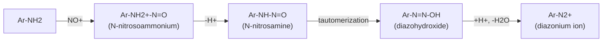
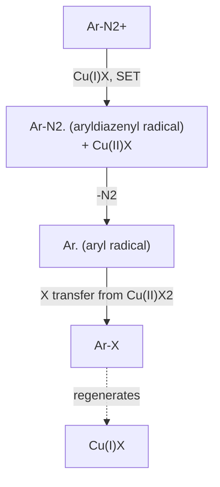

## Diazonium Salts and Their Reactions

### Overview

**Diazonium salts** are ionic compounds of the general formula $\text{R-N}_2^+\ \text{X}^-$, containing the diazonium group $-\text{N}^+\equiv\text{N}$ bonded to carbon. Two families matter in practice:

- **Arenediazonium salts** ($\text{Ar-N}_2^+\ \text{X}^-$): moderately stable in cold aqueous solution; the most useful family.
- **Alkyldiazonium salts** ($\text{R-N}_2^+\ \text{X}^-$): extremely unstable; lose $\text{N}_2$ immediately to give carbocation-derived product mixtures and are rarely useful synthetically.

The synthetic value of arenediazonium salts comes from dinitrogen ($\text{N}_2$) being an outstanding leaving group. The $-\text{N}_2^+$ group can be replaced by halides, cyanide, hydroxyl, hydrogen, aryl groups, and many other substituents, and it can also act as an electrophile toward electron-rich arenes (azo coupling).

**Key Points**

- Diazonium salts are prepared by **diazotization** of primary amines with nitrous acid (from $\text{NaNO}_2$ and a strong acid) at 0–5 °C.
- Arenediazonium ions are stabilized by conjugation of the $\text{N}\equiv\text{N}$ $\pi$ system with the aromatic ring; alkyldiazonium ions lack this stabilization.
- Two reaction families exist: **substitution with loss of $\text{N}_2$** (Sandmeyer, Schiemann, hydroxylation, reduction to Ar–H, Gomberg–Bachmann, Meerwein) and **retention of both nitrogens** (azo coupling, reduction to arylhydrazines).
- Diazonium chemistry allows substitution patterns that direct electrophilic aromatic substitution cannot deliver.
- Dry diazonium salts can be explosive; they are normally generated and consumed in cold solution.

### Structure and Bonding

The diazonium group is linear at the ipso carbon: $\text{Ar-N}\equiv\text{N}^+$ (C–N–N angle near 180°).

**Resonance forms**

$$\text{Ar-N}^+\equiv\text{N} \longleftrightarrow \text{Ar-N=N}^+$$

Delocalization of the ring $\pi$ electrons into the $-\text{N}_2^+$ group, and the weak $\pi$-acceptor ability of the group, contribute to the greater stability of aryl diazonium ions compared with alkyl analogs. In alkyldiazonium ions, heterolysis gives $\text{N}_2$ and a high-energy carbocation (or $\text{S}_\text{N}2$ displacement), and no comparable stabilization exists.

| Feature | Arenediazonium ion | Alkyldiazonium ion |
| --- | --- | --- |
| Stability in solution | Stable at 0–5 °C for hours | Decomposes at or below 0 °C almost instantly |
| Decomposition products | Aryl cation-derived products (phenol, aryl halide, etc.) | Alcohols, alkenes, alkyl halides, rearranged products |
| Synthetic use | Extensive | Minimal (exceptions: diazomethane chemistry, Tiffeneau–Demjanov ring expansion) |
| Counterion effect | Large, non-nucleophilic anions ($\text{BF}_4^-$, $\text{PF}_6^-$, tosylate) give isolable salts | Not isolable |

**Substituent effects on stability and reactivity**

- **Electron-withdrawing groups** (para-$\text{NO}_2$, $-\text{CN}$) make the diazonium ion a stronger electrophile (better azo coupling partner) and generally more reactive toward reductants.
- **Electron-donating groups** (para-$\text{OMe}$, para-$\text{NMe}_2$) stabilize the ion by resonance; para-amino diazonium ions are quinoid-like and resistant to substitution but are poor azo-coupling electrophiles.
- **Counterion:** chloride and hydrogen sulfate salts are unstable when dry; tetrafluoroborate, hexafluorophosphate, and arenesulfonate salts are considerably more stable and can sometimes be isolated as solids [handle with care; stability depends on substituents].

### Preparation: Diazotization

#### Reaction

$$\text{Ar-NH}_2 + \text{NaNO}_2 + 2\,\text{HX} \xrightarrow{0\text{-}5\,^\circ\text{C}} \text{Ar-N}_2^+\ \text{X}^- + \text{NaX} + 2\,\text{H}_2\text{O}$$

**Typical procedure**

1. Dissolve or suspend the aniline in aqueous HCl (about 2.5–3 equivalents of acid); cool to 0–5 °C in an ice–salt bath.
2. Add a cold aqueous solution of $\text{NaNO}_2$ (1.0–1.05 equivalents) dropwise with stirring, keeping the temperature below 5 °C.
3. Test for a slight excess of nitrous acid with starch–iodide paper (blue-black color indicates excess $\text{HNO}_2$); destroy excess with sulfamic acid or urea if necessary.
4. Use the solution immediately in the next step.

#### Mechanism

1. **Formation of the nitrosonium ion:**

$$\text{NaNO}_2 + \text{H}^+ \rightarrow \text{HNO}_2;\qquad \text{HNO}_2 + \text{H}^+ \rightleftharpoons \text{H}_2\text{O} + \text{NO}^+$$

2. **N-Nitrosation:** the amine nitrogen attacks $\text{NO}^+$, giving an N-nitrosoammonium ion, $\text{Ar-NH}_2^+\text{-N=O}$.
3. **Deprotonation:** loss of $\text{H}^+$ gives the N-nitrosamine, $\text{Ar-NH-N=O}$.
4. **Tautomerization:** proton shift gives the diazohydroxide, $\text{Ar-N=N-OH}$.
5. **Ionization:** protonation of the hydroxyl group and loss of water gives the diazonium ion.

#### Practical Considerations

| Factor | Requirement | Reason |
| --- | --- | --- |
| Temperature | 0–5 °C | Prevents premature decomposition to phenol ($\text{Ar-N}_2^+ + \text{H}_2\text{O} \rightarrow \text{Ar-OH}$) and loss of $\text{N}_2$ |
| Acid excess | At least 2 equivalents (typically 2.5–3) | One equivalent generates $\text{HNO}_2$; one protonates the product's counter-ion; extra acid prevents coupling of unreacted amine with diazonium (triazene formation) |
| $\text{NaNO}_2$ addition | Slow, subsurface, with stirring | Avoids local warming and $\text{NO}_x$ evolution |
| Weakly basic anilines (e.g., nitroanilines, polyhaloanilines) | Concentrated $\text{H}_2\text{SO}_4$, nitrosylsulfuric acid ($\text{NOHSO}_4$), or $\text{NOBF}_4$ | Poor solubility and low basicity require stronger nitrosating systems |
| Non-aqueous diazotization | Alkyl nitrites (isoamyl nitrite, *tert*-butyl nitrite) in organic solvents | Allows use in aprotic media, in situ Sandmeyer-type reactions, and substrates unstable to aqueous acid |
| Excess nitrite | Test with starch–iodide; destroy with sulfamic acid | Excess $\text{HNO}_2$ causes side reactions |

**Key Points**

- Aliphatic primary amines give alkyldiazonium ions that decompose at once, so the diazotization is useful synthetically only with aromatic amines.
- Heteroaromatic amines (aminopyridines, aminothiazoles) form diazonium salts of variable stability; 2- and 4-aminopyridines hydrolyze rapidly to pyridones.
- Aryl diazonium tetrafluoroborates are prepared by adding $\text{HBF}_4$ (or $\text{NaBF}_4$) to the cold diazonium solution; the sparingly soluble salt precipitates and can be filtered, dried carefully, and used in Balz–Schiemann and related reactions.

### Stability and Decomposition Pathways

Arenediazonium ions decompose by three broad routes depending on conditions:

1. **Heterolytic** ($\text{S}_\text{N}1$-type, aryl cation): $\text{Ar-N}_2^+ \rightarrow \text{Ar}^+ + \text{N}_2$; the aryl cation is extremely reactive (an $sp^2$ vacant orbital in the ring plane, not conjugated with the $\pi$ system) and is captured by whichever nucleophile is available (water, fluoride, chloride).
2. **Homolytic (radical):** one-electron reduction gives $\text{Ar-N}_2\cdot$, which loses $\text{N}_2$ to give an aryl radical; this is the pathway for Sandmeyer, Gomberg–Bachmann, Meerwein, and hypophosphorous acid reactions.
3. **Retention of nitrogen:** nucleophilic attack at the terminal nitrogen gives azo compounds (with carbon nucleophiles), triazenes (with amines), or diazoethers/diazotates (with hydroxide or alkoxide).

<svg xmlns="http://www.w3.org/2000/svg" viewBox="0 0 700 320" width="700" height="320" font-family="Arial, sans-serif">
<title>Decomposition Pathways of Arenediazonium Ions (svg_diagram)</title>
<text x="350" y="24" text-anchor="middle" font-size="16" font-weight="bold">Pathways of Arenediazonium Ions (svg_diagram)</text>
<rect x="275" y="125" width="150" height="55" rx="10" fill="#fef5e7" stroke="#e67e22" />
<text x="350" y="150" text-anchor="middle" font-size="13">Ar-N2+</text>
<text x="350" y="168" text-anchor="middle" font-size="11">diazonium ion</text>
<rect x="20" y="50" width="200" height="70" rx="8" fill="#e8f4fd" stroke="#2980b9" />
<text x="120" y="76" text-anchor="middle" font-size="13">Heterolysis (-N2)</text>
<text x="120" y="96" text-anchor="middle" font-size="11">Ar+ (aryl cation)</text>
<text x="120" y="112" text-anchor="middle" font-size="11">then Ar-OH, Ar-F</text>
<rect x="480" y="50" width="200" height="70" rx="8" fill="#eafaf1" stroke="#27ae60" />
<text x="580" y="76" text-anchor="middle" font-size="13">Electron transfer (-N2)</text>
<text x="580" y="96" text-anchor="middle" font-size="11">Ar. (aryl radical)</text>
<text x="580" y="112" text-anchor="middle" font-size="11">Sandmeyer, Ar-H, Ar-Ar</text>
<rect x="250" y="230" width="200" height="70" rx="8" fill="#f4ecf7" stroke="#8e44ad" />
<text x="350" y="256" text-anchor="middle" font-size="13">Nitrogen retained</text>
<text x="350" y="276" text-anchor="middle" font-size="11">Azo coupling, triazenes,</text>
<text x="350" y="292" text-anchor="middle" font-size="11">arylhydrazines</text>
<line x1="273" y1="140" x2="222" y2="100" stroke="#333" stroke-width="2" marker-end="url(#arr9)" />
<line x1="427" y1="140" x2="478" y2="100" stroke="#333" stroke-width="2" marker-end="url(#arr9)" />
<line x1="350" y1="182" x2="350" y2="228" stroke="#333" stroke-width="2" marker-end="url(#arr9)" />
</svg>

**Safety-relevant stability facts**

- Solid diazonium chlorides and hydrogen sulfates are shock- and heat-sensitive and can detonate; they should not be allowed to dry out.
- Tetrafluoroborates and tosylates are more stable but are still energetic materials; thermal analysis (DSC) is advised before scale-up [decomposition onset varies widely by substituent].
- Never store a diazonium solution; use it directly.

### Substitution Reactions with Loss of $\text{N}_2$

#### Sandmeyer and Related Copper-Catalyzed Substitutions

Copper(I) salts convert diazonium ions into aryl chlorides, bromides, and nitriles.

$$\text{Ar-N}_2^+\ \text{X}^- + \text{CuX} \rightarrow \text{Ar-X} + \text{N}_2 + \text{Cu}^{2+}\text{-derived species}$$

| Reaction | Reagents | Product |
| --- | --- | --- |
| Sandmeyer chlorination | CuCl, HCl | Ar–Cl |
| Sandmeyer bromination | CuBr, HBr | Ar–Br |
| Sandmeyer cyanation | CuCN, KCN | Ar–CN |
| Gattermann reaction | Cu powder, HX | Ar–Cl or Ar–Br (older, lower-yield variant) |
| Sandmeyer hydroxylation | $\text{Cu}_2\text{O}$, excess $\text{Cu(NO}_3)_2$, $\text{H}_2\text{O}$, room temperature | Ar–OH |
| Sandmeyer trifluoromethylation | CuSCN- or $\text{CuCF}_3$-type reagents ($\text{TMSCF}_3$, Cu) | Ar–$\text{CF}_3$ |
| Thiolation and related | KSCN/CuSCN, KSCSOEt (xanthate), $\text{Na}_2\text{S}_2$ | Ar–SCN, Ar–SH (after hydrolysis), Ar–S–S–Ar |

**Mechanism (radical-nucleophilic aromatic substitution, $\text{S}_\text{RN}$-type)**

1. Single-electron transfer (SET) from $\text{Cu(I)}$ to the diazonium ion gives an aryldiazenyl radical, $\text{Ar-N}_2\cdot$, and $\text{Cu(II)}$.
2. The aryldiazenyl radical loses $\text{N}_2$ to give an aryl radical, $\text{Ar}\cdot$.
3. The aryl radical abstracts a halogen (or cyanide ligand) from the $\text{Cu(II)}$ halide, giving $\text{Ar-X}$ and regenerating $\text{Cu(I)}$.

**Evidence for a radical pathway:** formation of biaryl byproducts ($\text{Ar-Ar}$), detection of aryl radicals by trapping, and the observation that reactions with copper give products different from thermal hydrolysis.

**Key Points**

- Copper(I) is truly catalytic in Sandmeyer halogenation in some systems, though stoichiometric CuX is traditionally used.
- Sandmeyer cyanation with CuCN is a route to benzonitriles, which can be hydrolyzed to benzoic acids or reduced to benzylamines; this converts $\text{Ar-NH}_2$ into $\text{Ar-COOH}$ or $\text{Ar-CH}_2\text{NH}_2$ indirectly.
- Byproducts: biaryls, azo compounds, phenols, and reduced arenes; yields typically fall in the 50–90% range [depends strongly on substrate].
- The reaction is used industrially for aryl halides and nitriles that cannot be made by direct electrophilic substitution.

**Example: Synthesis of 2-chlorotoluene**

$$\text{2-methylaniline} \xrightarrow{\text{NaNO}_2,\ \text{HCl},\ 0\text{-}5\,^\circ\text{C}} \text{2-methylbenzenediazonium chloride} \xrightarrow{\text{CuCl}} \text{2-chlorotoluene} + \text{N}_2$$

**Output**

2-Chlorotoluene (*o*-chlorotoluene) with nitrogen gas evolved; this ortho pattern is not accessible in good yield by direct chlorination of toluene (which gives ortho/para mixtures with poor selectivity).

#### Iodination

Iodide reduces the diazonium ion directly; no copper is required.

$$\text{Ar-N}_2^+\ \text{X}^- + \text{KI} \rightarrow \text{Ar-I} + \text{N}_2 + \text{KX}$$

- Proceeds through electron transfer from $\text{I}^-$ to give an aryl radical, which abstracts iodine from $\text{I}_2$ or $\text{I}_3^-$, or by an ionic pathway; the mechanism is debated [depends on conditions].
- A slight warming of the mixture (room temperature to 40–50 °C) completes the reaction; excess iodine is removed with sodium thiosulfate or bisulfite.
- Provides the most convenient route to aryl iodides, which are valuable substrates for cross-coupling reactions (Suzuki, Heck, Sonogashira, Buchwald–Hartwig).

**Example**

$$\text{4-nitroaniline} \xrightarrow{\text{NaNO}_2,\ \text{H}_2\text{SO}_4} \text{4-nitrobenzenediazonium} \xrightarrow{\text{KI}} \text{1-iodo-4-nitrobenzene}$$

#### Balz–Schiemann Reaction (Fluorination)

Aryl fluorides are made by thermal decomposition of isolated arenediazonium tetrafluoroborates.

$$\text{Ar-N}_2^+\ \text{BF}_4^- \xrightarrow{\Delta} \text{Ar-F} + \text{N}_2 + \text{BF}_3$$

**Procedure outline**

1. Diazotize the aniline in aqueous HCl (or directly in $\text{HBF}_4$).
2. Add $\text{HBF}_4$ or $\text{NaBF}_4$ to precipitate $\text{ArN}_2^+\text{BF}_4^-$.
3. Filter, wash, and dry the salt cautiously.
4. Heat the salt (often 100–200 °C, sometimes in an inert solvent or under photolysis) to give the aryl fluoride.

**Mechanism:** heterolytic loss of $\text{N}_2$ generates an aryl cation, which abstracts fluoride from $\text{BF}_4^-$ (giving $\text{ArF}$ and $\text{BF}_3$). Ion-pair collapse explains why $\text{BF}_4^-$ and $\text{PF}_6^-$, but not $\text{Cl}^-$, give clean fluorination.

**Key Points**

- The $\text{BF}_4^-$ ion serves simultaneously as a stabilizing counterion and as the fluoride source.
- Aryl fluorides are important in pharmaceuticals, agrochemicals, and PET radiochemistry precursors.
- Variants use $\text{HPF}_6$ (hexafluorophosphate), $\text{NaNO}_2$ in HF/pyridine (Olah's reagent), or photochemical and continuous-flow protocols to improve safety and yields.
- Thermal decomposition of dry diazonium salts on scale is hazardous; continuous-flow methods reduce inventory of the energetic intermediate.

#### Hydroxylation (Phenol Formation)

Heating an aqueous diazonium solution gives phenols.

$$\text{Ar-N}_2^+ + \text{H}_2\text{O} \xrightarrow{\Delta,\ \text{H}^+} \text{Ar-OH} + \text{N}_2 + \text{H}^+$$

- Proceeds by an $\text{S}_\text{N}1$-like aryl cation pathway; water is the nucleophile.
- Use of sulfuric acid rather than hydrochloric acid solutions avoids competing chloride capture (aryl chloride).
- Hydrolysis of the diazonium ion is also the main side reaction when diazotization is run too warm.
- Copper-catalyzed variants ($\text{Cu}_2\text{O}$, excess $\text{Cu(NO}_3)_2$) operate at room temperature by the radical pathway and give better yields for sensitive substrates.
- Provides a route to phenols with substituent patterns unavailable from direct hydroxylation, e.g., *m*-substituted phenols from *m*-substituted anilines.

**Example**

$$\text{3-nitroaniline} \xrightarrow{1.\ \text{NaNO}_2,\ \text{H}_2\text{SO}_4;\ 2.\ \text{H}_2\text{O},\ \Delta} \text{3-nitrophenol}$$

#### Reductive Deamination: Replacement by Hydrogen

$$\text{Ar-N}_2^+ + \text{H}_3\text{PO}_2 + \text{H}_2\text{O} \rightarrow \text{Ar-H} + \text{N}_2 + \text{H}_3\text{PO}_3 + \text{H}^+$$

- Hypophosphorous acid ($\text{H}_3\text{PO}_2$) is the usual reagent; ethanol (giving acetaldehyde), $\text{NaBH}_4$, and $\text{SnCl}_2$ (with copper catalysis) are alternatives.
- **Radical chain mechanism:** the aryl radical abstracts hydrogen from $\text{H}_3\text{PO}_2$ (or from the alcohol solvent), propagating the chain.
- Typical use: an amino group is introduced as a powerful ortho/para-directing group to control substitution patterns, then removed.

**Example: Synthesis of 3,5-dibromotoluene**

Start from *p*-toluidine (4-methylaniline):

1. Acetylate (acetanilide) if needed to moderate reactivity, or brominate the aniline directly to give 2,6-dibromo-4-methylaniline.
2. Diazotize with $\text{NaNO}_2$/HBr at 0–5 °C.
3. $\text{H}_3\text{PO}_2$ replaces $-\text{N}_2^+$ with $\text{H}$, giving 3,5-dibromotoluene.

**Output**

3,5-Dibromotoluene, a *meta*-dibromo pattern that cannot be produced by direct bromination of toluene, which places bromine ortho and para to the methyl group.

**Strategic use of the amino group**

| Goal | Sequence |
| --- | --- |
| *meta*-Substituted product from ortho/para director | Install $-\text{NH}_2$ (via $\text{NO}_2$ reduction) to direct electrophiles ortho/para to itself; remove by deamination |
| Polysubstituted arenes with unusual patterns (1,3,5-tribromobenzene) | Aniline → 2,4,6-tribromoaniline → diazotize → $\text{H}_3\text{PO}_2$ |
| Blocking group | Temporary NH$_2$ group blocks a position, then is removed |

#### Gomberg–Bachmann Biaryl Synthesis

An arenediazonium ion reacts with an arene under basic conditions to form an unsymmetrical biaryl through an aryl radical intermediate.

$$\text{Ar-N}_2^+ + \text{Ar'-H} \xrightarrow{\text{NaOH}} \text{Ar-Ar'} + \text{N}_2 + \text{H}_2\text{O}$$

- Yields are typically low (often below 40%) because of competing side reactions and poor regioselectivity with substituted arenes.
- Phase-transfer conditions and diazonium tetrafluoroborates with crown ethers or in organic solvents improve results.
- Modern biaryl synthesis relies mostly on Pd-catalyzed cross-couplings (Suzuki, Stille, Negishi, Hiyama); diazonium salts are now also used directly as coupling partners in Pd-catalyzed reactions (Heck–Matsuda).

#### Meerwein Arylation

An arenediazonium salt adds an aryl group (with a halogen from copper(II) halide) across an electron-poor alkene in the presence of catalytic Cu(II).

$$\text{Ar-N}_2^+ + \text{CH}_2\text{=CH-EWG} \xrightarrow{\text{CuCl}_2} \text{Ar-CH}_2\text{-CHCl-EWG} + \text{N}_2$$

Loss of HCl from the adduct then gives the arylated alkene (**Meerwein arylation**), used for cinnamic-acid derivatives.

#### Heck–Matsuda and Other Pd-Catalyzed Reactions

Arenediazonium tetrafluoroborates couple with alkenes in the presence of Pd(0) or Pd(II) precatalysts without added phosphine ligands or base, since the diazonium group is a highly reactive pseudohalide (much more reactive than iodide toward oxidative addition).

$$\text{Ar-N}_2^+\ \text{BF}_4^- + \text{alkene} \xrightarrow{\text{Pd cat.}} \text{Ar-alkene} + \text{N}_2 + \text{HBF}_4$$

Related processes include diazonium Suzuki, Sonogashira, carbonylative, and photoredox/Cu- or Au-catalyzed reactions, which often proceed at room temperature [scope and conditions vary widely; consult primary literature].

#### Conversion to Sulfur, Selenium, and Boron Derivatives

- **Ar–SO$_2$Cl (sulfonyl chlorides):** diazonium salt + $\text{SO}_2$ (from $\text{SOCl}_2$/$\text{H}_2\text{O}$ or DABSO) + $\text{CuCl}_2$ (Meerwein sulfonylation); provides sulfonyl chlorides for sulfonamide drugs.
- **Ar–SH (thiols):** diazonium salt + potassium ethyl xanthate, then hydrolysis (Leuckart thiophenol synthesis).
- **Ar–B(pin) (boronic esters):** diazonium salt + $\text{B}_2\text{pin}_2$ under metal-free or photochemical conditions.
- **Ar–N$_3$ (aryl azides):** diazonium salt + $\text{NaN}_3$ (Ar–N$_3$ via azide addition and loss of $\text{N}_2$ from the pentazene intermediate); safety precautions for azides apply.

#### Summary of Loss-of-$\text{N}_2$ Reactions

| Transformation | Reagent | Product | Pathway |
| --- | --- | --- | --- |
| Cl or Br | CuCl or CuBr | Ar–Cl, Ar–Br | Radical (SET from Cu(I)) |
| CN | CuCN/KCN | Ar–CN | Radical |
| I | KI | Ar–I | Electron transfer / ionic |
| F | $\text{HBF}_4$, then heat | Ar–F | Aryl cation, ion-pair collapse |
| OH | $\text{H}_2\text{O}$, $\Delta$ (or $\text{Cu}_2\text{O}$/$\text{Cu}^{2+}$) | Ar–OH | Aryl cation (or radical with Cu) |
| H | $\text{H}_3\text{PO}_2$ | Ar–H | Radical chain |
| Aryl | Arene, base | Ar–Ar' | Aryl radical (Gomberg–Bachmann) |
| $\text{SO}_2\text{Cl}$ | $\text{SO}_2$, CuCl | Ar–$\text{SO}_2\text{Cl}$ | Radical |
| N$_3$ | $\text{NaN}_3$ | Ar–N$_3$ | Nucleophilic addition |

### Reactions Retaining Both Nitrogen Atoms

#### Azo Coupling

Arenediazonium ions are weak electrophiles that attack the *para* (or *ortho*) position of strongly activated arenes to give azo compounds ($\text{Ar-N=N-Ar'}$), which are intensely colored because of extended $\pi$ conjugation.

$$\text{Ar-N}_2^+ + \text{Ar'-Y} \rightarrow \text{Ar-N=N-Ar'-Y} + \text{H}^+ \qquad (\text{Y} = \text{OH, NR}_2,\ \text{NH}_2,\ \text{O}^-)$$

**Mechanism:** electrophilic aromatic substitution. The terminal nitrogen of the diazonium ion attacks the ring carbon, giving a Wheland (arenium) intermediate that loses $\text{H}^+$ to restore aromaticity.

**pH control**

| Coupling partner | Optimal pH | Reason |
| --- | --- | --- |
| Phenols and naphthols | Mildly basic (pH 8–10) | Phenoxide is a far more powerful nucleophile than phenol; too high a pH (above about 10–11) converts the diazonium ion to the unreactive diazotate ($\text{Ar-N=N-O}^-$) |
| Anilines and N,N-dialkylanilines | Mildly acidic (pH 4–7) | Free amine is required as nucleophile; strong acid protonates it and shuts the reaction down; very high pH lowers diazonium concentration |
| Enolizable carbonyl compounds (e.g., $\beta$-ketoesters) | Mildly basic | Enolate attacks the diazonium ion; product hydrazone tautomer (**Japp–Klingemann reaction**) |

**Regiochemistry**

- Attack occurs at the *para* position of the coupling partner; if *para* is blocked, *ortho* coupling takes place (slower).
- 2-Naphthol couples at C1; 1-naphthol couples at C4 (and C2).
- Primary and secondary aromatic amines may first give N-coupled **triazenes** ($\text{Ar-N=N-NHAr'}$) under neutral or basic conditions; these rearrange under acid to the C-coupled aminoazo compounds (a diazoamino-to-aminoazo rearrangement).

**Azo dyes:** account for the largest class of synthetic dyes (roughly half of commercial dyes by number). Examples:

| Dye | Diazo component | Coupling component | Use |
| --- | --- | --- | --- |
| Methyl orange | Diazotized sulfanilic acid | N,N-Dimethylaniline | Acid–base indicator (red below about pH 3.1, yellow above about pH 4.4) |
| Sudan I | Diazotized aniline | 2-Naphthol | Historic food/industrial colorant (now banned in foods) |
| Para red | Diazotized 4-nitroaniline | 2-Naphthol | Pigment |
| Congo red | Bis-diazotized benzidine | 2 × naphthionic acid | Historic direct cotton dye and biological stain |
| Alizarin yellow R | Diazotized 4-nitroaniline | Salicylic acid | Indicator, dye |

**Key Points**

- Electron-withdrawing substituents on the diazonium partner (e.g., *p*-$\text{NO}_2$) accelerate coupling; electron-donating groups slow it.
- Azo compounds exist as $E$ (trans) isomers, which isomerize photochemically to $Z$ (cis); azobenzene switches are used in photopharmacology and molecular machines.
- Some azo dyes release carcinogenic aromatic amines upon metabolic azo reduction (e.g., benzidine-based dyes); regulatory restrictions apply in many jurisdictions.

**Example: Synthesis of para red**

1. 4-Nitroaniline + $\text{NaNO}_2$/HCl at 0–5 °C gives 4-nitrobenzenediazonium chloride.
2. Add to a cold alkaline solution of 2-naphthol (as sodium 2-naphthoxide).
3. The red azo pigment precipitates (coupling at C1 of the naphthol).

$$\text{4-O}_2\text{N-C}_6\text{H}_4\text{-N}_2^+ + \text{2-naphthoxide} \rightarrow \text{1-(4-nitrophenylazo)-2-naphthol}$$

#### Reduction to Arylhydrazines

Mild reduction retains both nitrogens and converts the diazonium ion into an arylhydrazine.

$$\text{Ar-N}_2^+\ \text{Cl}^- \xrightarrow{\text{SnCl}_2,\ \text{HCl}\ \text{or}\ \text{Na}_2\text{SO}_3} \text{Ar-NHNH}_2\cdot\text{HCl}$$

- Arylhydrazines are precursors of indoles (**Fischer indole synthesis**, from arylhydrazone plus acid), pyrazoles, and pyrazolones.
- Sulfite reduction proceeds via an aryldiazenesulfonate ($\text{Ar-N=N-SO}_3^-$), then to the hydrazine-sulfonate, and finally to hydrolysis.

#### Triazenes and Diazoethers

- **Triazenes** ($\text{Ar-N=N-NR}_2$): formed by coupling with secondary amines under neutral to basic conditions; stable, isolable, and used as masked diazonium salts (regenerated by acid), as protecting groups for amines, and in linker chemistry (e.g., the anticancer drug dacarbazine is a triazene).
- **Diazoethers** ($\text{Ar-N=N-OR}$) and diazotates ($\text{Ar-N=N-O}^-$): from reaction with alkoxides or hydroxide; the *syn*/*anti* diazotate equilibrium is a classic structural issue.

#### Diazo Compounds and Diazomethane (Related Chemistry)

Although not diazonium salts, **diazo compounds** ($\text{R}_2\text{C=N}_2$) are closely related functional groups.

- Diazomethane ($\text{CH}_2\text{N}_2$) methylates carboxylic acids, phenols, and enols; it is toxic, explosive, and generated in situ from precursors such as Diazald ($N$-methyl-$N$-nitroso-*p*-toluenesulfonamide). Trimethylsilyldiazomethane ($\text{TMSCHN}_2$) is a safer alternative.
- $\alpha$-Diazoketones (Arndt–Eistert homologation, Wolff rearrangement) and diazoacetates (cyclopropanation and X–H insertion with Rh(II) or Cu catalysts) rely on carbene chemistry after loss of $\text{N}_2$.

### Aliphatic Diazonium Ions

Primary alkylamines react with nitrous acid to give alkyldiazonium ions that decompose immediately:

$$\text{R-NH}_2 \xrightarrow{\text{HNO}_2} \text{R-N}_2^+ \rightarrow \text{R}^+ + \text{N}_2 \rightarrow \text{alcohols, alkenes, alkyl halides, rearranged products}$$

- The carbocation undergoes competing $\text{S}_\text{N}1$, $\text{E}1$, and rearrangement pathways, so product mixtures result (e.g., n-propylamine gives mainly propan-2-ol and propan-1-ol with propene and chloropropane).
- **Tiffeneau–Demjanov rearrangement** is a useful exception: a 1-(aminomethyl)cycloalkanol treated with nitrous acid undergoes ring expansion to the next larger cyclic ketone through a diazonium-triggered 1,2-alkyl shift (semipinacol-type).
- **Deamination of amino acids and peptide N-termini** with nitrous acid (**Van Slyke method**) was historically used to quantify free $\alpha$-amino groups by measuring liberated $\text{N}_2$.

### Comparison of Diazonium Reaction Types

| Reaction class | $\text{N}_2$ lost? | Active species | Typical conditions | Best for |
| --- | --- | --- | --- | --- |
| Sandmeyer | Yes | Aryl radical | CuX, 0 °C to room temperature | Ar–Cl, Ar–Br, Ar–CN |
| Iodination | Yes | Aryl radical or cation pair | KI, room temperature to 50 °C | Ar–I |
| Balz–Schiemann | Yes | Aryl cation | Dry $\text{ArN}_2^+\text{BF}_4^-$, heat | Ar–F |
| Hydrolysis | Yes | Aryl cation | Hot aqueous acid | Ar–OH |
| Deamination | Yes | Aryl radical | $\text{H}_3\text{PO}_2$ | Ar–H |
| Azo coupling | No | Diazonium electrophile | Buffered pH, 0–5 °C | Azo dyes, azo compounds |
| Reduction | No | Nucleophilic reductant | $\text{SnCl}_2$, sulfite | Arylhydrazines |
| Heck–Matsuda | Yes | Aryl-Pd | Pd cat., room temperature | Arylalkenes |

### Analytical and Characterization Notes

| Technique | Diagnostic feature |
| --- | --- |
| IR | Strong $\text{N}\equiv\text{N}$ stretch of $\text{ArN}_2^+$ at about 2260–2300 $\text{cm}^{-1}$ (varies with substituents and counterion) |
| Qualitative test | Formation of an intensely red or orange dye on adding an alkaline solution of 2-naphthol (azo coupling); a positive result indicates the presence of a primary aromatic amine after diazotization |
| Starch–iodide paper | Detects excess nitrous acid during diazotization |
| UV–Vis | Azo compounds show strong absorption in the visible region ($\pi\rightarrow\pi^*$ near 350–450 nm, $n\rightarrow\pi^*$ weaker near 450–500 nm) |
| $^{15}\text{N}$ NMR | Two distinct nitrogen signals for $\text{Ar-N}\equiv\text{N}^+$ [rarely used routinely] |

**Example: Qualitative test for a primary aromatic amine**

1. Dissolve the sample in dilute HCl and cool to 0–5 °C.
2. Add cold aqueous $\text{NaNO}_2$.
3. Pour the solution into alkaline 2-naphthol.
4. A scarlet or orange-red precipitate confirms an aromatic primary amine.

### Worked Examples

**Example 1: Predict the product**

3-Aminotoluene (*m*-toluidine) is diazotized ($\text{NaNO}_2$, HCl, 0–5 °C) and then treated with CuCN/KCN.

$$\text{3-CH}_3\text{C}_6\text{H}_4\text{NH}_2 \rightarrow \text{3-CH}_3\text{C}_6\text{H}_4\text{N}_2^+ \xrightarrow{\text{CuCN}} \text{3-CH}_3\text{C}_6\text{H}_4\text{CN}$$

**Output**

3-Methylbenzonitrile (*m*-tolunitrile). Hydrolysis ($\text{H}_3\text{O}^+$, heat) would then give 3-methylbenzoic acid (*m*-toluic acid).

**Example 2: Synthesis of *m*-bromotoluene from toluene**

Direct bromination of toluene gives ortho/para products, so a longer route is needed:

1. Nitration of toluene gives 4-nitrotoluene (major after separation) and 2-nitrotoluene.
2. Bromination of 4-nitrotoluene: the methyl directs ortho to itself (position 2), while the nitro directs meta to itself (also position 2, which is *meta* to $\text{NO}_2$); the product is 2-bromo-4-nitrotoluene.
3. Reduce $\text{NO}_2$ to $\text{NH}_2$ ($\text{Fe/HCl}$): 3-bromo-4-methylaniline.
4. Diazotize and reduce with $\text{H}_3\text{PO}_2$: **3-bromotoluene** ($m$-bromotoluene).

**Output**

3-Bromotoluene, made by using the nitro/amino group as a temporary director and removing it at the end.

**Example 3: Choosing the right halogenation method**

Prepare 4-fluorotoluene from 4-methylaniline (p-toluidine).

- Diazotize with $\text{NaNO}_2$/$\text{HBF}_4$, isolate the tetrafluoroborate, and heat gently (Balz–Schiemann).
- Sandmeyer methods cannot install fluorine, since CuF is ineffective for radical fluorination.

**Example 4: Diazotization stoichiometry**

Diazotize 9.3 g of aniline ($M = 93.13\ \text{g/mol}$). How many grams of $\text{NaNO}_2$ ($M = 69.00\ \text{g/mol}$) are needed for 1.0 equivalent?

$$n(\text{aniline}) = \frac{9.3}{93.13} = 0.100\ \text{mol}$$

$$m(\text{NaNO}_2) = 0.100 \times 69.00 = 6.9\ \text{g}$$

**Output**

6.9 g of $\text{NaNO}_2$ (usually a slight excess, about 1.02–1.05 equivalents, is used), and at least 0.25 mol of HCl (2.5 equivalents).

**Example 5: Azo dye design**

Which diazonium and coupling components give the dye 4-(dimethylamino)azobenzene ("butter yellow")?

- Diazonium component: benzenediazonium chloride (from aniline).
- Coupling component: N,N-dimethylaniline (mildly acidic pH, coupling *para*).

$$\text{C}_6\text{H}_5\text{N}_2^+ + \text{C}_6\text{H}_5\text{N(CH}_3)_2 \rightarrow \text{C}_6\text{H}_5\text{-N=N-C}_6\text{H}_4\text{-N(CH}_3)_2$$

Butter yellow is a suspected carcinogen and is no longer used as a food colorant.

**Example 6: Predicting selectivity in azo coupling**

2-Naphthol is coupled with benzenediazonium chloride under (a) pH 9 and (b) pH 1.

- (a) At pH 9, the naphthoxide ion is present in appreciable concentration, and it is highly nucleophilic; coupling occurs at C1, giving 1-(phenylazo)-2-naphthol (Sudan I).
- (b) At pH 1, the naphthol stays as the neutral, poorly nucleophilic phenol, and coupling essentially does not proceed.

**Example 7: Fischer indole via the hydrazine route**

Prepare phenylhydrazine from aniline and use it to make 2-methylindole.

1. Aniline $\xrightarrow{\text{NaNO}_2,\ \text{HCl}}$ benzenediazonium chloride $\xrightarrow{\text{SnCl}_2,\ \text{HCl}}$ phenylhydrazine hydrochloride.
2. Phenylhydrazine + acetone gives acetone phenylhydrazone.
3. Acid ($\text{ZnCl}_2$, PPA, or $\text{H}_2\text{SO}_4$), heat gives 2-methylindole (via [3,3]-sigmatropic rearrangement and loss of $\text{NH}_3$).

**Example 8: Safe handling scenario**

A reaction requires 20 mmol of an arenediazonium tetrafluoroborate. Which precautions apply?

- Keep the quantity small; prepare the salt fresh and dry it at low temperature (avoid heating; use a plastic or wooden spatula rather than metal; avoid scratching or grinding).
- Use blast-shield protection and a fume hood.
- Consider in situ generation (e.g., *tert*-butyl nitrite with the aniline in the reaction solvent) or continuous-flow generation to avoid isolating the solid [general safety practice; specific hazards depend on the substituents].

### Industrial and Practical Applications

- **Azo dyes and pigments:** textiles, inks, plastics, and paints; the largest commercial use.
- **Pharmaceuticals and agrochemicals:** installing halogens, nitriles, and phenols in complex aromatic scaffolds; sulfonyl chlorides for sulfonamide drugs.
- **Fluoroarene synthesis:** Balz–Schiemann and its safer flow variants for fluorinated intermediates.
- **Materials and surface chemistry:** electrochemical or spontaneous grafting of aryl diazonium salts onto carbon, metal, and semiconductor surfaces produces covalently bound aryl monolayers or multilayers (used in sensors and molecular electronics).
- **Photoresists and diazotype (blueprint-type) copying:** photolabile diazonium salts couple with phenols on exposed regions.
- **Bioconjugation:** diazonium coupling with tyrosine and histidine residues of proteins [scope depends on conditions].

### Safety Considerations

- **Explosion hazard:** dry diazonium chlorides, sulfates, nitrates, and perchlorates can detonate on shock, friction, or heating; even tetrafluoroborates can decompose violently at elevated temperatures. Do not let diazonium salts dry on glassware or filter paper, and do not store them.
- **Temperature control:** maintain 0–5 °C during diazotization; runaway decomposition releases large volumes of nitrogen gas that can over-pressurize closed vessels.
- **Gas evolution:** ensure vented apparatus; nitrogen evolution and nitrogen oxides ($\text{NO}_x$, toxic) may occur.
- **Excess nitrous acid:** quench with sulfamic acid or urea before workup.
- **Toxic reagents:** CuCN/KCN release HCN on acidification; azides are toxic and explosive; diazomethane is toxic and explosive.
- **Azo dye and aromatic amine toxicity:** some aromatic amines and their azo derivatives are carcinogenic (e.g., benzidine, 2-naphthylamine, 4-aminobiphenyl); use appropriate containment.
- **Waste:** destroy residual diazonium salts (e.g., by warming in water or treating with a reducing agent or with $\text{H}_3\text{PO}_2$) before disposal, following institutional procedures.
- Hazards depend on the specific substrate and scale; consult SDS documents and perform a hazard evaluation (e.g., differential scanning calorimetry) before scaling up.

### Common Pitfalls

- Allowing the diazotization mixture to warm above 5–10 °C, which converts the diazonium salt to a phenol and reduces yield.
- Using too little acid in diazotization, which permits coupling of unreacted amine with diazonium ion to form triazenes (diazoamino compounds).
- Using $\text{Cl}^-$ or $\text{Br}^-$ solutions and expecting hydroxylation: the halide competes as a nucleophile; use $\text{H}_2\text{SO}_4$ for hydrolysis.
- Expecting Sandmeyer chemistry to install fluorine; the fluorination requires the Balz–Schiemann sequence.
- Applying azo coupling at the wrong pH (too acidic for phenols; too basic or too acidic for amines; too basic converts diazonium to inactive diazotate).
- Trying to diazotize aliphatic primary amines for synthetic purposes; alkyldiazonium ions give uncontrolled mixtures.
- Forgetting that strongly electron-rich diazonium ions (para-dialkylamino) are poor coupling electrophiles.
- Treating a solid diazonium salt as a routine reagent; safe practice requires minimal scale, appropriate counterion, and no drying to hard solids.
- Ignoring the removal of excess nitrite before adding copper salts or reductants.

### Related Topics

- Nomenclature and basicity of amines
- Synthesis of amines (nitro reduction to the aniline precursor)
- Reactions of amines (nitrous acid test, Hinsberg test)
- Electrophilic aromatic substitution and directing effects
- Azo dyes, pH indicators, and photoswitches
- Radical chemistry and single-electron-transfer processes (Sandmeyer mechanism)
- Palladium-catalyzed cross-coupling (Heck–Matsuda, Suzuki, Sonogashira)
- Fischer indole synthesis and heterocycle formation from hydrazines
- Diazo compounds, carbenes, and Arndt–Eistert homologation
- Fluorine chemistry and Balz–Schiemann alternatives
- Surface functionalization by diazonium grafting