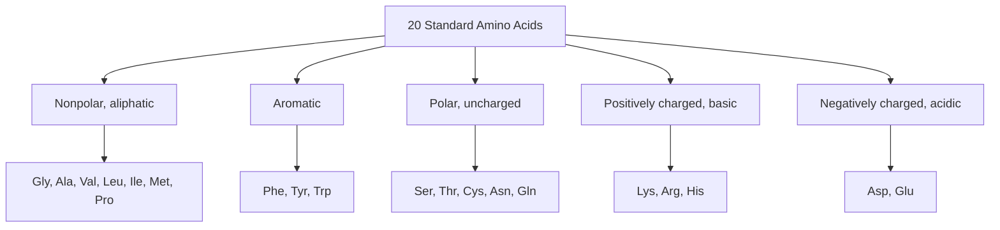
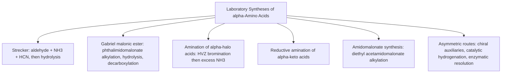
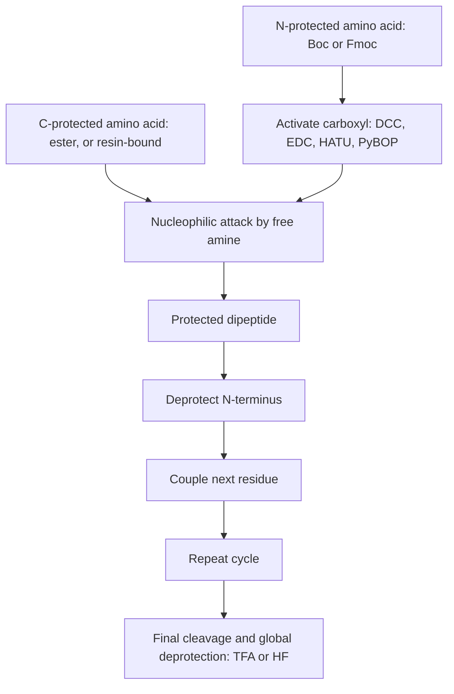

## Introduction to Amino Acids


### Overview

**Amino acids** are organic compounds containing both an **amino group** ($-NH_2$) and a **carboxyl group** ($-COOH$). The most biologically important class is the **$\alpha$-amino acids**, in which both groups are attached to the same carbon (the $\alpha$-carbon). They are the monomeric building blocks of **peptides and proteins**, precursors of neurotransmitters, hormones, nucleotides, and porphyrins, and central intermediates in nitrogen metabolism.

The general structure of an $\alpha$-amino acid is:

$$H_2N{-}C_\alpha H(R){-}COOH$$

where $R$ is the **side chain** (R group) that distinguishes one amino acid from another. In solution near neutral pH, amino acids exist predominantly as **zwitterions** (dipolar ions), $^+H_3N{-}CH(R){-}COO^-$, rather than as the neutral form drawn above.

**Key Points**

- Twenty $\alpha$-amino acids are encoded by the standard genetic code; two more (selenocysteine and pyrrolysine) are incorporated by recoding mechanisms.
- All standard amino acids except glycine are **chiral** at the $\alpha$-carbon; proteinogenic amino acids are of the **L** configuration (most are $S$ by CIP rules; cysteine is $R$).
- Amino acids are **amphoteric**: they behave as acids and bases, and their charge state depends on pH.
- The **isoelectric point** ($pI$) is the pH at which the net charge is zero; it governs electrophoretic and ion-exchange behavior.
- Peptide bonds form by condensation between the carboxyl group of one amino acid and the amino group of the next.

---

### General Structure and Nomenclature

#### The $\alpha$-Amino Acid Skeleton

| Feature | Description |
| --- | --- |
| $\alpha$-Carbon | Central carbon bearing $NH_2$, $COOH$, $H$, and $R$ |
| Amino group | Basic; $pK_a$ of the protonated form typically ~9–10.5 |
| Carboxyl group | Acidic; $pK_a$ typically ~1.8–2.4 |
| Side chain ($R$) | Determines size, polarity, charge, and reactivity |
| Zwitterion | Internal salt: $^+H_3N{-}CHR{-}COO^-$ |

#### Classification by Position of the Amino Group

| Type | Position of $NH_2$ relative to $COOH$ | Example |
| --- | --- | --- |
| $\alpha$-Amino acid | On the carbon adjacent to $COOH$ | Alanine |
| $\beta$-Amino acid | Two carbons from $COOH$ | $\beta$-Alanine (component of coenzyme A and carnosine) |
| $\gamma$-Amino acid | Three carbons from $COOH$ | GABA ($\gamma$-aminobutyric acid), an inhibitory neurotransmitter |

#### Common and IUPAC Names

Amino acids are usually referred to by trivial names with three-letter and one-letter codes (see the table below). Systematic IUPAC names are derived from the parent carboxylic acid:

| Common name | IUPAC name |
| --- | --- |
| Glycine | 2-Aminoacetic acid |
| Alanine | 2-Aminopropanoic acid |
| Valine | 2-Amino-3-methylbutanoic acid |
| Serine | 2-Amino-3-hydroxypropanoic acid |
| Aspartic acid | 2-Aminobutanedioic acid |

---

### Stereochemistry of Amino Acids

#### Chirality

Every standard amino acid except **glycine** ($R = H$) has a stereogenic $\alpha$-carbon bearing four different groups. Isoleucine and threonine have a **second** stereocenter in the side chain, giving four stereoisomers each (only one is proteinogenic).

#### D/L Convention

The D/L system correlates amino acids with **glyceraldehyde** using a Fischer projection: place $COOH$ at the top and $R$ at the bottom. If the $NH_2$ group points to the **left**, the amino acid is **L**; if to the **right**, it is **D**.

$$\text{L-amino acids: } NH_2 \text{ on the left in the Fischer projection (COOH on top)}$$

Proteins are built almost exclusively from **L-amino acids**. D-Amino acids occur in bacterial cell walls (peptidoglycan cross-links), some antibiotics (e.g., gramicidin, valinomycin), and certain venoms and neuropeptides.

#### R/S Assignment

The D/L and R/S systems are independent. Most L-amino acids are $S$, but **L-cysteine is $R$** because the $-CH_2SH$ side chain outranks $-COOH$ in CIP priority (sulfur beats oxygen at the first point of difference).

| Amino acid | Priority order at $C_\alpha$ | L-form descriptor |
| --- | --- | --- |
| L-Alanine | $NH_2 > COOH > CH_3 > H$ | $S$ |
| L-Serine | $NH_2 > CH_2OH > COOH > H$ | $S$ |
| L-Cysteine | $NH_2 > CH_2SH > COOH > H$ | $R$ |
| L-Isoleucine | $NH_2 > COOH > CH(CH_3)CH_2CH_3 > H$ | $(2S,3S)$ |
| L-Threonine | $NH_2 > CH(OH)CH_3 > COOH > H$ | $(2S,3R)$ |

Note that for serine, $-CH_2OH$ carries $(O,H,H)$ and $-COOH$ carries $(O,O,O)$; $-COOH$ therefore outranks $-CH_2OH$ at the first point of difference, so the priority order for serine is $NH_2 > COOH > CH_2OH > H$, giving $S$. The table above lists the order for serine as written in the simplified form; the descriptor $S$ is the established value for L-serine.

**Key Points**

- The L-designation reflects spatial arrangement; the $R/S$ label depends on priorities and can differ between amino acids with the same spatial arrangement.
- The sign of optical rotation ($+$/$-$) is an experimental property and is not predicted by D/L or R/S.

#### Racemization

The $\alpha$-hydrogen is relatively acidic (adjacent to the carbonyl and an electron-withdrawing ammonium/amide group), so amino acids can racemize under strongly basic conditions, elevated temperatures, or during peptide coupling of activated carboxyl groups (via oxazolone/azlactone intermediates). Racemization ratios of aspartic acid in long-lived tissues (teeth, lens proteins) have been used in age estimation. [Inference: practical accuracy varies with tissue and environment.]

---

### The 20 Standard Amino Acids

#### Classification by Side-Chain Properties



#### Reference Table

| Amino acid | 3-letter | 1-letter | Side chain ($R$) | Class |
| --- | --- | --- | --- | --- |
| Glycine | Gly | G | $-H$ | Nonpolar (achiral) |
| Alanine | Ala | A | $-CH_3$ | Nonpolar |
| Valine | Val | V | $-CH(CH_3)_2$ | Nonpolar |
| Leucine | Leu | L | $-CH_2CH(CH_3)_2$ | Nonpolar |
| Isoleucine | Ile | I | $-CH(CH_3)CH_2CH_3$ | Nonpolar |
| Methionine | Met | M | $-CH_2CH_2SCH_3$ | Nonpolar |
| Proline | Pro | P | Cyclic: $\alpha$-N and side chain form a pyrrolidine ring | Nonpolar (secondary amine) |
| Phenylalanine | Phe | F | $-CH_2C_6H_5$ | Aromatic |
| Tyrosine | Tyr | Y | $-CH_2C_6H_4OH$ | Aromatic, polar |
| Tryptophan | Trp | W | $-CH_2$-indolyl | Aromatic |
| Serine | Ser | S | $-CH_2OH$ | Polar uncharged |
| Threonine | Thr | T | $-CH(OH)CH_3$ | Polar uncharged |
| Cysteine | Cys | C | $-CH_2SH$ | Polar uncharged (thiol) |
| Asparagine | Asn | N | $-CH_2CONH_2$ | Polar uncharged |
| Glutamine | Gln | Q | $-CH_2CH_2CONH_2$ | Polar uncharged |
| Lysine | Lys | K | $-(CH_2)_4NH_3^+$ | Basic |
| Arginine | Arg | R | $-(CH_2)_3NHC(=NH_2^+)NH_2$ | Basic (guanidinium) |
| Histidine | His | H | $-CH_2$-imidazolyl | Basic (imidazole, $pK_a \approx 6$) |
| Aspartic acid | Asp | D | $-CH_2COO^-$ | Acidic |
| Glutamic acid | Glu | E | $-CH_2CH_2COO^-$ | Acidic |

*Side chains are shown in the form predominant near physiological pH.*

#### Notable Structural Features

- **Glycine:** the smallest amino acid and the only achiral one; gives peptide backbones high conformational flexibility.
- **Proline:** the only secondary ($\alpha$-imino) amino acid; its ring restricts the $\phi$ backbone dihedral angle, and it disrupts $\alpha$-helices and $\beta$-sheets (often found in turns).
- **Cysteine:** the thiol ($pK_a \approx 8.3$ free; varies widely in proteins) oxidizes to form **disulfide bonds** (cystine, $R{-}S{-}S{-}R$), which stabilize extracellular protein structure.
- **Histidine:** the imidazole ring has a $pK_a$ near physiological pH, making histidine an effective general acid/base catalyst in enzyme active sites and a metal ligand (e.g., zinc, heme iron).
- **Tyrosine, tryptophan, phenylalanine:** aromatic side chains absorb UV light (Trp $\lambda_{max}$ ~280 nm with the largest absorptivity, Tyr ~275 nm, Phe ~257 nm and weak), the basis for $A_{280}$ protein quantitation.
- **Serine, threonine, tyrosine:** hydroxyl groups are sites of **phosphorylation** in signal transduction.
- **Asparagine, serine, threonine:** sites of **glycosylation** (N-linked at Asn in the sequon Asn-X-Ser/Thr; O-linked at Ser/Thr).
- **Arginine and lysine:** cationic side chains bind nucleic acids and acidic patches; lysine is a site of acetylation, methylation, and ubiquitination.

#### Nonstandard and Modified Amino Acids

| Category | Examples |
| --- | --- |
| 21st and 22nd genetically encoded | Selenocysteine (Sec, U; UGA recoding), Pyrrolysine (Pyl, O; UAG recoding in some archaea and bacteria) |
| Post-translational modifications | 4-Hydroxyproline and 5-hydroxylysine (collagen), $\gamma$-carboxyglutamate (clotting factors), phosphoserine, cystine |
| Non-protein metabolic amino acids | Ornithine, citrulline (urea cycle), homocysteine, $\beta$-alanine, GABA, DOPA, thyroxine |
| Non-proteinogenic in synthesis | Norleucine, aminoisobutyric acid (Aib), D-amino acids, $\beta$-amino acids |

#### Essential Amino Acids (Human Nutrition)

Nine amino acids cannot be synthesized *de novo* by humans and must come from the diet: **histidine, isoleucine, leucine, lysine, methionine, phenylalanine, threonine, tryptophan, valine**. Others are **conditionally essential** (e.g., arginine, cysteine, glutamine, glycine, proline, tyrosine) under conditions such as growth, illness, or prematurity. Tyrosine is synthesized from phenylalanine, and cysteine from methionine (with serine).

---

### Acid–Base Properties

#### Amphoterism and the Zwitterion

In the solid state and in water near neutral pH, amino acids exist as zwitterions. This explains their unusual physical properties:

| Property | Amino acid | Comparable simple amine or acid |
| --- | --- | --- |
| Melting point | High, often $> 200\,^\circ C$ (with decomposition) | Amines and acids typically melt/boil far lower |
| Solubility | Soluble in water; sparingly soluble in nonpolar solvents | Similar-mass hydrocarbons are insoluble in water |
| Dipole moment | Large (ionic character) | Smaller for neutral molecules |
| Crystal lattice | Ionic, strong electrostatic interactions | Molecular |

The zwitterion is favored because the carboxylic acid ($pK_a \approx 2$) is a far stronger acid than the ammonium ion ($pK_a \approx 9.5$), so the proton transfers internally from $-COOH$ to $-NH_2$:

$$H_2N{-}CHR{-}COOH \rightleftharpoons {^+}H_3N{-}CHR{-}COO^-$$

#### Titration of a Monoamino Monocarboxylic Acid

Consider a simple amino acid such as glycine, which passes through three forms with pH:

$$^+H_3N{-}CH_2{-}COOH \xrightarrow[pK_{a1}\,=\,2.34]{-H^+} {^+}H_3N{-}CH_2{-}COO^- \xrightarrow[pK_{a2}\,=\,9.60]{-H^+} H_2N{-}CH_2{-}COO^-$$

| pH region | Predominant species | Net charge |
| --- | --- | --- |
| $pH < pK_{a1}$ (strongly acidic) | $^+H_3N{-}CHR{-}COOH$ | $+1$ |
| $pK_{a1} < pH < pK_{a2}$ | $^+H_3N{-}CHR{-}COO^-$ (zwitterion) | $0$ |
| $pH > pK_{a2}$ (strongly basic) | $H_2N{-}CHR{-}COO^-$ | $-1$ |

At $pH = pK_{a1}$, the cationic and zwitterionic forms are present in equal amounts (Henderson–Hasselbalch); the same holds for zwitterion and anion at $pK_{a2}$. The titration curve shows buffering plateaus centered at each $pK_a$ and a steep rise between them near the $pI$.

#### Isoleucine-type Reference $pK_a$ Values

| Amino acid | $pK_{a1}$ ($\alpha$-COOH) | $pK_{a2}$ ($\alpha$-$NH_3^+$) | $pK_{aR}$ (side chain) | $pI$ |
| --- | --- | --- | --- | --- |
| Glycine | 2.34 | 9.60 | — | 5.97 |
| Alanine | 2.34 | 9.69 | — | 6.00 |
| Valine | 2.32 | 9.62 | — | 5.96 |
| Leucine | 2.36 | 9.60 | — | 5.98 |
| Serine | 2.21 | 9.15 | ~13 (OH) | 5.68 |
| Cysteine | 1.96 | 10.28 | 8.18 (SH) | 5.07 |
| Tyrosine | 2.20 | 9.11 | 10.07 (OH) | 5.66 |
| Aspartic acid | 1.88 | 9.60 | 3.65 ($\beta$-COOH) | 2.77 |
| Glutamic acid | 2.19 | 9.67 | 4.25 ($\gamma$-COOH) | 3.22 |
| Histidine | 1.82 | 9.17 | 6.00 (imidazolium) | 7.59 |
| Lysine | 2.18 | 8.95 | 10.53 ($\varepsilon$-$NH_3^+$) | 9.74 |
| Arginine | 2.17 | 9.04 | 12.48 (guanidinium) | 10.76 |

*Values are approximate literature values at $25\,^\circ C$; the exact numbers vary by source, ionic strength, and temperature. Reference-table $pK_a$ values for free amino acids differ from those of the same residues within proteins, where the local environment can shift them by several units.*

The $\alpha$-carboxyl $pK_a$ (~2) is lower than that of a simple carboxylic acid (~4.8) because the adjacent $-NH_3^+$ group exerts a strong electron-withdrawing inductive effect that stabilizes the carboxylate. Conversely, the $\alpha$-ammonium $pK_a$ (~9–10) is slightly lower than for a simple alkylammonium (~10.6) because of the neighboring carboxylate/carboxyl.

#### The Isoelectric Point ($pI$)

The $pI$ is the pH at which the amino acid carries **no net charge**.

**Neutral side chain (no ionizable $R$ group):** average the two $pK_a$ values that bracket the zwitterion:

$$pI = \frac{pK_{a1} + pK_{a2}}{2}$$

**Acidic side chain (Asp, Glu):** average the two *lowest* $pK_a$ values (the two carboxyls):

$$pI = \frac{pK_{a1} + pK_{aR}}{2}$$

**Basic side chain (Lys, Arg, His):** average the two *highest* $pK_a$ values:

$$pI = \frac{pK_{a2} + pK_{aR}}{2}$$

**Example 1: $pI$ of alanine**

$$pI = \frac{2.34 + 9.69}{2} = 6.02 \approx 6.0$$

**Example 2: $pI$ of aspartic acid**

The species with net zero charge lies between the $+1 \to 0$ and $0 \to -1$ transitions, and the relevant $pK_a$ values are the first ($\alpha$-COOH, 1.88) and the side chain ($\beta$-COOH, 3.65):

$$pI = \frac{1.88 + 3.65}{2} = 2.77$$

**Example 3: $pI$ of lysine**

The relevant $pK_a$ values are the $\alpha$-ammonium (8.95) and the $\varepsilon$-ammonium (10.53):

$$pI = \frac{8.95 + 10.53}{2} = 9.74$$

**Key Points**

- To choose the correct pair, write the ionization sequence from fully protonated to fully deprotonated, track the net charge, and average the two $pK_a$ values on either side of the neutral species.
- Acidic amino acids have low $pI$ (~3), basic ones have high $pI$ (~10), and neutral ones sit near 6.
- At $pH < pI$ the amino acid is net positive (moves toward the cathode); at $pH > pI$ it is net negative (moves toward the anode).

#### Charge as a Function of pH

For a species with ionizable groups, the average net charge follows the Henderson–Hasselbalch relationship for each group. For the carboxyl group:

$$\frac{[A^-]}{[HA]} = 10^{\,pH - pK_a}$$

For a simple amino acid, the fractional composition is a function of $[H^+]$, $K_{a1}$, and $K_{a2}$:

$$\alpha_{+} = \frac{[H^+]^2}{[H^+]^2 + K_{a1}[H^+] + K_{a1}K_{a2}}$$


$$\alpha_{0} = \frac{K_{a1}[H^+]}{[H^+]^2 + K_{a1}[H^+] + K_{a1}K_{a2}}$$


$$\alpha_{-} = \frac{K_{a1}K_{a2}}{[H^+]^2 + K_{a1}[H^+] + K_{a1}K_{a2}}$$

These are useful for computing the exact fraction of each charged species at a given pH.

#### Species Distribution (svg_diagram)

<svg xmlns="http://www.w3.org/2000/svg" viewBox="0 0 640 300" width="640" height="300" font-family="Arial, sans-serif">
<title>Glycine Ionization States vs pH (svg_diagram)</title>
<text x="320" y="24" text-anchor="middle" font-size="16" font-weight="bold">Glycine Ionization States vs pH (svg_diagram)</text>

<line x1="50" y1="240" x2="600" y2="240" stroke="#333" stroke-width="2" />
<text x="325" y="285" text-anchor="middle" font-size="13">pH</text>

<line x1="50" y1="240" x2="50" y2="246" stroke="#333" /><text x="50" y="260" text-anchor="middle" font-size="11">0</text>
<line x1="188" y1="240" x2="188" y2="246" stroke="#333" /><text x="188" y="260" text-anchor="middle" font-size="11">3</text>
<line x1="325" y1="240" x2="325" y2="246" stroke="#333" /><text x="325" y="260" text-anchor="middle" font-size="11">6</text>
<line x1="463" y1="240" x2="463" y2="246" stroke="#333" /><text x="463" y="260" text-anchor="middle" font-size="11">9</text>
<line x1="600" y1="240" x2="600" y2="246" stroke="#333" /><text x="600" y="260" text-anchor="middle" font-size="11">12</text>

<rect x="50" y="90" width="58" height="140" fill="#fadbd8" stroke="#c0392b" />
<text x="79" y="125" text-anchor="middle" font-size="12" fill="#c0392b">+1</text>
<text x="79" y="145" text-anchor="middle" font-size="10">H₃N⁺CH₂COOH</text>
<rect x="108" y="90" width="332" height="140" fill="#d5f5e3" stroke="#1e8449" />
<text x="274" y="125" text-anchor="middle" font-size="12" fill="#1e8449">0 (zwitterion)</text>
<text x="274" y="145" text-anchor="middle" font-size="11">H₃N⁺CH₂COO⁻</text>
<text x="274" y="175" text-anchor="middle" font-size="11">pI ≈ 5.97</text>
<rect x="440" y="90" width="160" height="140" fill="#d6eaf8" stroke="#2471a3" />
<text x="520" y="125" text-anchor="middle" font-size="12" fill="#2471a3">-1</text>
<text x="520" y="145" text-anchor="middle" font-size="11">H₂NCH₂COO⁻</text>

<line x1="157" y1="80" x2="157" y2="240" stroke="#555" stroke-dasharray="4,3" />
<text x="157" y="72" text-anchor="middle" font-size="11">pKa1 = 2.34</text>
<line x1="490" y1="80" x2="490" y2="240" stroke="#555" stroke-dasharray="4,3" />
<text x="490" y="72" text-anchor="middle" font-size="11">pKa2 = 9.60</text>
</svg>

*The colored bands are schematic, indicating the predominant species in each pH range; near each $pK_a$ the two adjacent species coexist.*

---

### Physical Properties

| Property | Observation | Explanation |
| --- | --- | --- |
| Melting point | Typically $> 200\,^\circ C$, often with decomposition | Ionic zwitterionic lattice |
| Water solubility | Generally soluble (varies: Tyr and Cys/cystine poorly soluble) | Zwitterion interacts strongly with water |
| Solubility in organic solvents | Poor | High polarity |
| Minimum solubility | Near the $pI$ | Net-zero charge reduces solvation and favors crystallization |
| Taste | Varies (glycine sweet, L-leucine bitter, glutamate umami) | Receptor-specific |
| UV absorption | Only aromatic residues (Trp, Tyr, Phe) absorb $> 250$ nm | Aromatic $\pi$ systems |

**Practical corollary:** amino acids are often purified or crystallized by adjusting the pH to the $pI$, where solubility is lowest.

---

### Synthesis of $\alpha$-Amino Acids



#### 1. Strecker Synthesis

An aldehyde reacts with ammonia (or ammonium chloride) and cyanide to give an $\alpha$-aminonitrile, which is hydrolyzed to the amino acid.

$$R{-}CHO \xrightarrow{NH_4Cl,\ KCN} R{-}CH(NH_2){-}C{\equiv}N \xrightarrow{H_3O^+,\ \Delta} R{-}CH(NH_3^+){-}COOH$$

**Mechanism**

1. Aldehyde + $NH_3$ forms an imine (iminium under mildly acidic conditions).
2. Cyanide adds to the iminium carbon, giving the $\alpha$-aminonitrile.
3. Acid hydrolysis converts $-C{\equiv}N$ to $-COOH$ (via the amide), and the amine is protonated.

**Example 4: Alanine from acetaldehyde**

$$CH_3CHO \xrightarrow{NH_4Cl,\ KCN} CH_3CH(NH_2)CN \xrightarrow{H_3O^+,\ \Delta} CH_3CH(NH_3^+)COOH$$

Ordinarily gives a **racemic** ($DL$) mixture because cyanide attacks the planar iminium from either face. Asymmetric Strecker variants use chiral amines or chiral catalysts. Cyanide reagents are acutely toxic; acidification liberates $HCN$ gas.

#### 2. Amination of $\alpha$-Halo Acids (HVZ, then $NH_3$)

$$R{-}CH_2{-}COOH \xrightarrow{Br_2,\ PBr_3\ (\text{Hell–Volhard–Zelinsky})} R{-}CHBr{-}COOH \xrightarrow{\text{excess }NH_3} R{-}CH(NH_2){-}COOH$$

**Limitations:** direct alkylation of ammonia gives over-alkylated by-products; a large excess of ammonia is needed. Yields are moderate; product is racemic.

#### 3. Gabriel (Phthalimidomalonate) Synthesis

Potassium phthalimide serves as a protected ammonia equivalent, avoiding over-alkylation.

$$\text{Phth-N}^-K^+ + Br{-}CH(COOEt)_2 \rightarrow \text{Phth-N-CH(COOEt)}_2 \xrightarrow{1.\ NaOEt;\ 2.\ RX} \text{Phth-N-C(R)(COOEt)}_2 \xrightarrow{H_3O^+,\ \Delta} R{-}CH(NH_3^+){-}COOH$$

Hydrolysis removes the phthaloyl group and the esters; decarboxylation of the resulting malonic acid gives the amino acid.

#### 4. Acetamidomalonate Synthesis

Diethyl acetamidomalonate is alkylated at the acidic $\alpha$-carbon (like malonic ester), then hydrolyzed and decarboxylated.

$$AcNH{-}CH(COOEt)_2 \xrightarrow{1.\ NaOEt;\ 2.\ R{-}X} AcNH{-}C(R)(COOEt)_2 \xrightarrow{H_3O^+,\ \Delta} R{-}CH(NH_3^+){-}COOH$$

**Example 5: Phenylalanine**

$$AcNHCH(COOEt)_2 \xrightarrow{1.\ NaOEt;\ 2.\ PhCH_2Cl} AcNHC(CH_2Ph)(COOEt)_2 \xrightarrow{H_3O^+,\ \Delta} PhCH_2CH(NH_3^+)COOH$$

#### 5. Reductive Amination of $\alpha$-Keto Acids

$$R{-}CO{-}COOH \xrightarrow{NH_3,\ H_2/\text{Pd or } NaBH_3CN} R{-}CH(NH_2){-}COOH$$

This mirrors biosynthesis, in which glutamate dehydrogenase converts $\alpha$-ketoglutarate to glutamate, and transaminases transfer amino groups between amino and keto acids (PLP-dependent).

#### 6. Asymmetric and Enzymatic Routes

| Approach | Description |
| --- | --- |
| Asymmetric hydrogenation | Rh- or Ru-catalyzed hydrogenation of dehydroamino acids with chiral bisphosphine ligands (e.g., DIPAMP, BINAP), historically used for L-DOPA (Knowles) |
| Chiral auxiliaries | Evans oxazolidinones, Schöllkopf bis-lactim ethers, Myers pseudoephedrine glycinamide alkylation |
| Enzymatic resolution | Acylase on N-acetyl-DL-amino acids hydrolyzes only the L enantiomer, allowing separation |
| Fermentation | Industrial production of L-glutamate (*Corynebacterium glutamicum*), L-lysine, and others |
| Phase-transfer catalysis | O'Donnell glycine imine alkylation with chiral cinchona-derived catalysts |

---

### Reactions of Amino Acids

Amino acids show the reactions of both amines and carboxylic acids, plus side-chain chemistry.

#### Reactions at the Carboxyl Group

| Reaction | Reagents | Product |
| --- | --- | --- |
| Esterification | $ROH$, $HCl$ (or $SOCl_2$) | Amino acid ester hydrochloride (the amine is protonated, protecting it) |
| Amide formation | Coupling reagents (DCC, EDC, HATU) with an amine | Peptide/amide (amine must be protected) |
| Reduction | $LiAlH_4$ or $BH_3$ | Amino alcohol (e.g., L-alaninol) |
| Decarboxylation | Enzymatic (PLP-dependent decarboxylases); thermal with a ketone catalyst | Biogenic amine (e.g., histidine to histamine, tyrosine to tyramine, glutamate to GABA) |

#### Reactions at the Amino Group

| Reaction | Reagents | Product / Use |
| --- | --- | --- |
| Acylation | $Ac_2O$, acid chlorides | $N$-acyl amino acid |
| Carbamate protection | $Boc_2O$ (Boc), Fmoc-Cl or Fmoc-OSu, Cbz-Cl | $N$-protected amino acids for peptide synthesis |
| Alkylation | Alkyl halides (over-alkylation common) | Secondary/tertiary amines, quaternary ammonium (betaines) |
| Reaction with nitrous acid | $HNO_2$ | $\alpha$-Hydroxy acid + $N_2$ (Van Slyke determination of $\alpha$-amino nitrogen) |
| Reaction with Sanger's reagent | 1-Fluoro-2,4-dinitrobenzene (FDNB) | DNP-amino acid (N-terminal labeling) |
| Reaction with dansyl chloride | Dansyl-Cl | Fluorescent sulfonamide (N-terminal analysis, sensitive detection) |
| Reaction with phenyl isothiocyanate | PITC (Edman reagent) | Phenylthiocarbamoyl derivative, then PTH-amino acid |

#### Ninhydrin Reaction

Ninhydrin reacts with $\alpha$-amino acids (with a free $\alpha$-$NH_2$) on heating, producing a deep blue-purple chromophore called **Ruhemann's purple** ($\lambda_{max}$ ~570 nm) plus the aldehyde one carbon shorter, $CO_2$, and $NH_3$. Proline and hydroxyproline (secondary amines) give a yellow-orange product ($\lambda_{max}$ ~440 nm).

$$\text{Amino acid} + 2\ \text{ninhydrin} \longrightarrow \text{Ruhemann's purple} + RCHO + CO_2 + H_2O$$

This is the classical visualization method for amino acids on TLC plates and paper chromatograms, and the basis of post-column detection in traditional amino-acid analyzers.

#### Side-Chain Reactions

| Residue | Reaction | Significance |
| --- | --- | --- |
| Cysteine | Oxidation to cystine (disulfide); alkylation with iodoacetamide; reduction with DTT or TCEP | Protein folding, proteomics sample preparation |
| Serine, threonine, tyrosine | Phosphorylation (kinases), esterification | Signaling |
| Lysine | Acylation, Schiff-base formation with pyridoxal phosphate or aldehydes | Cofactor binding, cross-links (collagen) |
| Arginine | Sakaguchi test ($\alpha$-naphthol, hypobromite) | Colorimetric detection of guanidinium |
| Tyrosine | Millon test; iodination | Qualitative detection; thyroid hormone chemistry |
| Tryptophan | Hopkins–Cole test; acid degradation in 6 M HCl | Note: Trp is destroyed by conventional acid hydrolysis, so alkaline hydrolysis is used for its quantitation |
| Methionine | Oxidation to sulfoxide/sulfone; $S$-adenosylmethionine formation | Methyl donor; oxidative damage marker |
| Asparagine, glutamine | Deamidation (to Asp, Glu) | Protein aging; occurs during acid hydrolysis |
| Asparagine, aspartate | Succinimide formation | Isoaspartate/racemization in aged proteins |
| Histidine | Metal coordination; Pauly test | Metalloenzyme sites |

---

### The Peptide Bond

#### Formation

Two amino acids condense (losing $H_2O$) to form a dipeptide connected by an **amide (peptide) bond**:

$$H_2N{-}CHR_1{-}COOH + H_2N{-}CHR_2{-}COOH \longrightarrow H_2N{-}CHR_1{-}CO{-}NH{-}CHR_2{-}COOH + H_2O$$

Peptides are written from the **N-terminus** (free amine) to the **C-terminus** (free carboxyl). Ala-Gly (alanylglycine) has alanine at the N-terminus; Gly-Ala is a different compound.

Peptide nomenclature by chain length: dipeptide (2), tripeptide (3), oligopeptide (roughly 2–20), polypeptide (many), protein (one or more polypeptide chains folded into a defined structure, usually $> 50$ residues).

#### Properties of the Peptide Bond

- **Partial double-bond character** from resonance between the carbonyl and the amide nitrogen lone pair:

$$O{=}C{-}N{-}H \leftrightarrow {^-}O{-}C{=}{^+}N{-}H$$

- The $C{-}N$ bond length (~1.33 Å) lies between a typical single (~1.47 Å) and double (~1.27 Å) bond.
- The six atoms $C_\alpha$, $C$, $O$, $N$, $H$, and the next $C_\alpha$ lie in a **plane** (the amide plane).
- Rotation about the $C{-}N$ bond is restricted (barrier of roughly 15–20 kcal/mol), so the bond is usually **trans** (the $\alpha$-carbons on opposite sides). A *cis* arrangement occurs occasionally, notably preceding proline (X–Pro bonds), where the energy difference between cis and trans is small.
- The peptide bond is uncharged but polar: the carbonyl is a hydrogen-bond acceptor and $N{-}H$ is a donor, which underlies $\alpha$-helix and $\beta$-sheet secondary structures.
- Peptide bonds are kinetically stable in water (half-life of hundreds of years at neutral pH and $25\,^\circ C$), though thermodynamically hydrolysis is favorable; enzymes (proteases) catalyze hydrolysis rapidly.

#### Backbone Conformation

Two rotatable bonds per residue define backbone conformation: $\phi$ ($N{-}C_\alpha$) and $\psi$ ($C_\alpha{-}C$). Allowed combinations are visualized on a **Ramachandran plot**, in which steric clashes exclude large regions; glycine (no side chain) occupies far more of the plot, proline far less.

#### Hydrolysis and Sequencing

| Method | Purpose |
| --- | --- |
| Acid hydrolysis (6 M HCl, $110\,^\circ C$, 24 h) | Complete hydrolysis for amino-acid composition; destroys Trp, converts Asn/Gln to Asp/Glu, partially degrades Ser, Thr, Cys |
| Edman degradation | Sequential N-terminal residue removal and identification (PITC chemistry) |
| Mass spectrometry (tandem MS/MS) | Modern high-throughput sequencing of peptides and proteins |
| Carboxypeptidase digestion | C-terminal residue identification |
| Trypsin, chymotrypsin, CNBr, etc. | Specific cleavage (trypsin after Lys/Arg; chymotrypsin after Phe/Tyr/Trp; CNBr after Met) |

---

### Peptide Synthesis (Overview)

Forming a specific peptide bond between two amino acids requires **protecting** groups (to prevent random polymerization) and **activation** of the carboxyl group.



| Protecting group | Protects | Installed by | Removed by |
| --- | --- | --- | --- |
| Boc (tert-butoxycarbonyl) | $\alpha$-Amine | $Boc_2O$ | Trifluoroacetic acid (TFA) |
| Fmoc (9-fluorenylmethoxycarbonyl) | $\alpha$-Amine | Fmoc-Cl, Fmoc-OSu | Piperidine (base) |
| Cbz / Z (benzyloxycarbonyl) | $\alpha$-Amine | Cbz-Cl | $H_2$, $Pd/C$; HBr/AcOH |
| Methyl/ethyl ester | Carboxyl | $ROH$, acid | Saponification ($HO^-$) |
| tert-Butyl ester | Carboxyl, side chains | Isobutylene, acid | TFA |
| Benzyl ester | Carboxyl | BnBr, base | Hydrogenolysis |

**Solid-phase peptide synthesis (SPPS)**, developed by Merrifield (Nobel Prize 1984), anchors the C-terminal residue to an insoluble resin. Each cycle (deprotect, wash, couple, wash) adds one residue, with excess reagents removed by simple filtration. Fmoc/tBu chemistry is the most common modern strategy.

**Coupling reagents** (for example, DCC, EDC, HBTU, HATU, PyBOP, with additives such as HOBt or Oxyma) form activated esters that react with amines while minimizing **racemization** at the activated residue. Racemization is a major concern for activated $\alpha$-carbons via oxazolone formation; additives suppress it.

---

### Separation, Detection, and Analysis

| Technique | Basis of separation or detection | Notes |
| --- | --- | --- |
| Ion-exchange chromatography | Net charge (pH relative to $pI$) | Classic amino-acid analyzers (Moore–Stein) using cation-exchange resins and ninhydrin detection |
| Paper and thin-layer chromatography | Polarity/partition | Visualized with ninhydrin |
| Electrophoresis | Charge-to-mass ratio in an electric field | Amino acids migrate toward the electrode of opposite charge; at the $pI$ they do not migrate |
| Isoelectric focusing | Migration in a pH gradient until $pH = pI$ | High-resolution protein separation |
| Reversed-phase HPLC | Hydrophobicity (often after derivatization) | Pre-column derivatization with OPA, FMOC-Cl, AQC, dansyl chloride, or PITC |
| Mass spectrometry | Mass-to-charge ratio | LC-MS/MS for amino acid profiling and peptide sequencing |
| Chiral HPLC/GC, Marfey's reagent | Enantiomeric composition | Distinguishes D from L |
| UV-Vis at 280 nm | Aromatic residues | Protein concentration estimation via $A = \varepsilon c\ell$ |

**Example 4: Direction of migration**

At $pH = 7.0$:

- Alanine ($pI = 6.0$): net slightly negative; migrates weakly toward the anode.
- Lysine ($pI = 9.74$): net positive; migrates toward the cathode.
- Aspartic acid ($pI = 2.77$): net negative; migrates toward the anode.

---

### Worked Calculations

#### Problem 1: Fraction of glycine zwitterion at $pH = 7.0$

Given $pK_{a1} = 2.34$, $pK_{a2} = 9.60$: $K_{a1} = 4.57 \times 10^{-3}$, $K_{a2} = 2.51 \times 10^{-10}$, $[H^+] = 1.0 \times 10^{-7}$.

$$D = [H^+]^2 + K_{a1}[H^+] + K_{a1}K_{a2}$$


$$D = (1.0 \times 10^{-14}) + (4.57 \times 10^{-10}) + (1.15 \times 10^{-12}) \approx 4.68 \times 10^{-10}$$


$$\alpha_0 = \frac{K_{a1}[H^+]}{D} = \frac{4.57 \times 10^{-10}}{4.68 \times 10^{-10}} \approx 0.977$$

About **97.7%** of glycine is in the zwitterionic form at pH 7, with roughly 0.2% cation and 0.2% anion (the small remainders from the $\alpha_+$ and $\alpha_-$ terms); the neutral non-zwitterionic $H_2N{-}CH_2{-}COOH$ tautomer is present only in trace amounts. [Inference: the exact percentages depend on the literature $pK_a$ values used.]

#### Problem 2: Estimate the net charge of a peptide at pH 7.4

Consider the tripeptide Lys-Asp-Glu at $pH = 7.4$ (free N- and C-termini; approximate pKa values: $\alpha$-$NH_3^+$ ~8, Lys $\varepsilon$-$NH_3^+$ ~10.5, Asp side chain ~3.9, Glu side chain ~4.3, C-terminal $COOH$ ~3.6).

| Group | Charge at pH 7.4 |
| --- | --- |
| N-terminal $NH_3^+$ ($pK_a \approx 8$) | approximately $+0.8$ (mostly protonated) |
| Lys side chain ($pK_a \approx 10.5$) | $+1$ |
| Asp side chain ($pK_a \approx 3.9$) | $-1$ |
| Glu side chain ($pK_a \approx 4.3$) | $-1$ |
| C-terminal carboxylate ($pK_a \approx 3.6$) | $-1$ |
| **Net (approximate)** | $\approx -1.2$ |

The peptide is net negative at physiological pH; [Inference: side-chain and terminal $pK_a$ values in a real peptide depend on local environment, so this is an estimate.]

---

### Computational Aid: $pI$ and Charge Calculator

The following Python sketch computes net charge versus pH and finds the $pI$ by bisection. It uses simplified textbook $pK_a$ values and ignores neighbor effects, so results are approximate.

```python
# Net charge vs pH for an amino acid or short peptide using Henderson-Hasselbalch.
# Positive groups: charge = +1 / (1 + 10^(pH - pKa))
# Negative groups: charge = -1 / (1 + 10^(pKa - pH))

def net_charge(ph, pos_pkas, neg_pkas):
    q = 0.0
    for pka in pos_pkas:
        q += 1.0 / (1.0 + 10 ** (ph - pka))
    for pka in neg_pkas:
        q -= 1.0 / (1.0 + 10 ** (pka - ph))
    return q

def find_pi(pos_pkas, neg_pkas, lo=0.0, hi=14.0, tol=1e-6):
    while hi - lo > tol:
        mid = (lo + hi) / 2
        if net_charge(mid, pos_pkas, neg_pkas) > 0:
            lo = mid
        else:
            hi = mid
    return (lo + hi) / 2

# (positive-group pKa list, negative-group pKa list)
amino_acids = {
    "Glycine":       ([9.60],        [2.34]),
    "Aspartic acid": ([9.60],        [1.88, 3.65]),
    "Lysine":        ([8.95, 10.53], [2.18]),
    "Histidine":     ([6.00, 9.17],  [1.82]),
}

for name, (pos, neg) in amino_acids.items():
    print(f"{name:14s} pI = {find_pi(pos, neg):.2f}   "
          f"charge at pH 7.4 = {net_charge(7.4, pos, neg):+.2f}")
```

**Output** (approximate)



```
Glycine        pI = 5.97   charge at pH 7.4 = -0.01
Aspartic acid  pI = 2.77   charge at pH 7.4 = -1.00
Lysine         pI = 9.74   charge at pH 7.4 = +0.99
Histidine      pI = 7.59   charge at pH 7.4 = +0.13
```

---

### Biological Roles

| Role | Examples |
| --- | --- |
| Protein building blocks | 20 standard residues assembled by ribosomes according to mRNA codons |
| Enzyme catalysis | Ser, His, Asp (catalytic triad of serine proteases); Cys, Glu, Lys in other active sites |
| Neurotransmitters | Glutamate (excitatory), GABA and glycine (inhibitory), dopamine (from Tyr), serotonin (from Trp) |
| Hormones | Thyroxine (from Tyr), epinephrine, peptide hormones (insulin, glucagon) |
| Nitrogen metabolism | Transamination, deamination, urea cycle (ornithine, citrulline, arginine) |
| Metabolic precursors | Purine/pyrimidine bases (Gly, Asp, Gln), heme (Gly), glutathione (Glu-Cys-Gly), creatine, NO (from Arg) |
| Energy | Glucogenic and ketogenic catabolism of carbon skeletons |
| Structural | Collagen (rich in Gly, Pro, Hyp), keratin (rich in Cys) |
| Osmolytes and buffers | Glycine betaine, taurine, proline |

---

### Common Pitfalls

**Key Points**

- Drawing amino acids in the neutral $H_2N{-}CHR{-}COOH$ form when describing behavior in water at neutral pH; the zwitterion is the appropriate species.
- Averaging the wrong pair of $pK_a$ values when calculating $pI$ for amino acids with ionizable side chains (average the two values that bracket the neutral species).
- Assuming that L means $S$ for all amino acids (cysteine is $R$) or that L means levorotatory (the sign of rotation is empirical).
- Forgetting that proline is a secondary amine and gives a different ninhydrin color and unique conformational restrictions.
- Ignoring the difference between free-amino-acid $pK_a$ values and $pK_a$ values in proteins.
- Writing peptide sequences in the wrong direction; the N-terminus is on the left.
- Neglecting to protect the amine when activating the carboxyl in peptide coupling (uncontrolled oligomerization).
- Overlooking racemization risk in activated amino acid derivatives, especially His and Cys.
- Assuming a single amino acid appears in only one form: side-chain ionization changes charge state at physiologically relevant pH (His imidazole; Cys thiol in some contexts).
- Applying acid hydrolysis and expecting to recover Trp, Asn, Gln, or Cys unchanged.
- Using cyanide reagents (Strecker) without appropriate safety precautions.

---

### Conclusion

Amino acids combine the chemistry of amines and carboxylic acids in a single scaffold whose properties, especially zwitterionic character, $pK_a$ profile, and $pI$, are governed by the side chain. The twenty standard L-$\alpha$-amino acids provide a chemically diverse alphabet (nonpolar, aromatic, polar, acidic, basic) from which proteins derive structure, catalysis, recognition, and regulation. Mastery of the topic rests on four foundations: structure and stereochemistry (D/L versus R/S), acid–base behavior and isoelectric points, the major syntheses (Strecker, Gabriel/acetamidomalonate, amination, asymmetric and enzymatic routes), and the reactivity that leads to peptide bonds and their controlled synthesis.

---

### Related Topics

- Peptides and proteins: primary, secondary, tertiary, and quaternary structure
- Peptide synthesis in depth: solution phase, SPPS, native chemical ligation
- Protein sequencing: Edman degradation and tandem mass spectrometry
- Enzymes: catalytic mechanisms involving amino acid side chains
- Biosynthesis and catabolism of amino acids: transamination, urea cycle, PLP chemistry
- Acid–base buffers and the Henderson–Hasselbalch equation
- Electrophoresis and isoelectric focusing
- Asymmetric synthesis of amino acids and chiral resolution
- Non-proteinogenic and unnatural amino acids in medicinal chemistry
- Post-translational modifications: phosphorylation, glycosylation, ubiquitination