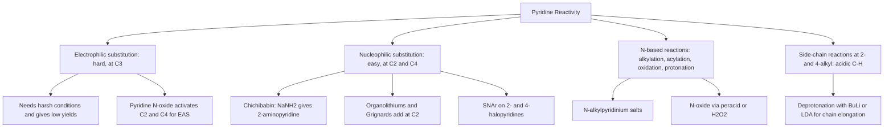

## Nitrogen Containing Heterocycles


### Overview

**Nitrogen-containing heterocycles** are cyclic compounds in which one or more ring atoms are nitrogen, the remaining ring atoms being carbon (or other heteroatoms such as O and S). They are among the most important structural classes in chemistry and biology: they form the core of nucleic acid bases (purines, pyrimidines), amino acids (proline, histidine, tryptophan), vitamins (nicotinamide, thiamine, pyridoxine, folate), alkaloids (nicotine, quinine, morphine, caffeine), porphyrins (heme, chlorophyll), and a large majority of small-molecule pharmaceuticals. Analyses of approved drugs consistently find that a large majority contain at least one nitrogen heterocycle, with pyridine, piperidine, and piperazine among the most frequent.

Ring systems are classified by **saturation** (saturated, partially unsaturated, aromatic), **ring size** (3- to 7-membered and beyond), **number and placement of nitrogen atoms**, and **fusion** with other rings.

**Key Points**

- **Aromatic** nitrogen heterocycles obey Hückel's rule ($4n + 2$ $\pi$ electrons); the position of the nitrogen lone pair (in the $\pi$ system or in the ring plane) determines basicity and reactivity.
- **Pyridine-type** nitrogen ($sp^2$, lone pair in the plane) is basic; **pyrrole-type** nitrogen (lone pair part of the aromatic sextet) is essentially non-basic.
- Pyridine is electron-poor (reacts with nucleophiles, resists electrophilic substitution); pyrrole, furan, and thiophene are electron-rich (react readily with electrophiles).
- Saturated heterocycles (aziridine, azetidine, pyrrolidine, piperidine) behave as ordinary secondary amines with ring-strain effects for the small rings.
- Fused systems (indole, quinoline, purine) combine the properties of their components.

---

### Classification and Nomenclature

#### Ring-Size and Saturation Overview

| Ring size | Saturated | Unsaturated / aromatic |
| --- | --- | --- |
| 3 | Aziridine | Azirine (2H-azirine) |
| 4 | Azetidine | Azete (antiaromatic, unstable) |
| 5 | Pyrrolidine | Pyrrole, imidazole, pyrazole, triazoles, tetrazole |
| 6 | Piperidine, piperazine | Pyridine, pyrimidine, pyrazine, pyridazine, triazines |
| 7 | Azepane | Azepine |

#### Hantzsch–Widman and Common Names

| Ring | Systematic (Hantzsch–Widman) | Common name |
| --- | --- | --- |
| 3-membered, saturated | Azirane | Aziridine |
| 5-membered, saturated | Azolidine | Pyrrolidine |
| 5-membered, unsaturated | 1H-Azole | Pyrrole |
| 6-membered, saturated | Azinane | Piperidine |
| 6-membered, unsaturated | Azine | Pyridine |
| 7-membered, saturated | Azepane | Hexamethyleneimine |

#### Numbering Rules

1. Number the heteroatom as **position 1** (in monocycles with one heteroatom).
2. With multiple heteroatoms, priority is $O > S > N$, and the numbering gives the **lowest locants** to the heteroatoms as a set.
3. In fused systems, numbering starts from the atom adjacent to a fusion atom and proceeds around the periphery; heteroatoms should receive locants as low as possible, and fusion atoms (which do not receive their own number) take letters or are skipped by convention. Indole, quinoline, isoquinoline, and purine retain **historically fixed** numbering (e.g., purine numbers N1–N3, C2, C4, C5, C6, N7, C8, N9).
4. Indicated hydrogen (e.g., 1H-, 2H-) specifies which position bears the extra hydrogen in tautomeric or partially saturated rings.

---

### Aromaticity and Electronic Structure

#### Two Kinds of Nitrogen

| Feature | Pyridine-type N | Pyrrole-type N |
| --- | --- | --- |
| Hybridization | $sp^2$ | $sp^2$ (planar, lone pair in $p$ orbital) |
| Lone pair location | In the ring plane, orthogonal to the $\pi$ system | In the $p$ orbital, contributes 2 electrons to the $\pi$ sextet |
| Electrons contributed to $\pi$ system | 1 | 2 |
| Basicity of N | Basic (protonation does not disrupt aromaticity) | Very weakly basic (protonation destroys aromaticity) |
| Example | Pyridine, imidazole N3, pyrimidine | Pyrrole, indole, imidazole N1 |

**Imidazole** contains both types: N1 (pyrrole-type, bears H) and N3 (pyridine-type, basic). This dual character explains imidazole's role in histidine as both a proton donor and acceptor.

#### Aromatic Sextets

$$\text{Pyridine: } 5\,C\,(1\,e^-\ \text{each}) + 1\,N\,(1\,e^-) = 6\,\pi\,e^-$$


$$\text{Pyrrole: } 4\,C\,(1\,e^-\ \text{each}) + 1\,N\,(2\,e^-) = 6\,\pi\,e^-$$

Both satisfy Hückel's $4n + 2$ rule with $n = 1$.

#### Resonance Energies and Electron Density

| Compound | Approximate resonance (aromatic stabilization) energy | Electronic character |
| --- | --- | --- |
| Benzene | ~36 kcal/mol | Reference |
| Pyridine | ~28–32 kcal/mol | $\pi$-Deficient |
| Pyrrole | ~21 kcal/mol | $\pi$-Excessive |
| Thiophene | ~29 kcal/mol | $\pi$-Excessive |
| Furan | ~16 kcal/mol | $\pi$-Excessive (least aromatic) |

*Values are approximate and depend on the method of estimation.*

**$\pi$-Deficient heterocycles** (pyridine, pyrimidine, pyrazine): the electronegative nitrogen withdraws $\pi$ density from ring carbons (especially C2, C4, C6), reducing reactivity toward electrophiles and enhancing reactivity toward nucleophiles.

**$\pi$-Excessive heterocycles** (pyrrole, furan, thiophene, indole): six $\pi$ electrons are distributed over five atoms, increasing electron density at carbon (especially C2 and C5 in pyrrole), enabling facile electrophilic substitution.

#### Resonance Structures of Pyrrole and Pyridine (svg_diagram)

<svg xmlns="http://www.w3.org/2000/svg" viewBox="0 0 680 280" width="680" height="280" font-family="Arial, sans-serif">
<title>Pyridine vs Pyrrole Nitrogen Lone Pairs (svg_diagram)</title>
<text x="340" y="24" text-anchor="middle" font-size="16" font-weight="bold">Pyridine vs Pyrrole Nitrogen Lone Pairs (svg_diagram)</text>

<text x="170" y="52" text-anchor="middle" font-size="14" font-weight="bold" fill="#2471a3">Pyridine (pi-deficient)</text>
<polygon points="170,80 215,105 215,155 170,180 125,155 125,105" fill="#d6eaf8" stroke="#2471a3" stroke-width="2" />
<circle cx="170" cy="130" r="26" fill="none" stroke="#2471a3" stroke-width="1.5" stroke-dasharray="4,3" />
<text x="170" y="196" text-anchor="middle" font-size="16" font-weight="bold" fill="#2471a3">N</text>
<ellipse cx="170" cy="222" rx="10" ry="6" fill="#f5b7b1" stroke="#c0392b" />
<text x="170" y="250" text-anchor="middle" font-size="12">Lone pair in ring plane (sp², basic)</text>
<text x="170" y="266" text-anchor="middle" font-size="12">1 e⁻ to the π sextet</text>

<text x="510" y="52" text-anchor="middle" font-size="14" font-weight="bold" fill="#c0392b">Pyrrole (pi-excessive)</text>
<polygon points="510,85 555,118 538,170 482,170 465,118" fill="#fadbd8" stroke="#c0392b" stroke-width="2" />
<circle cx="510" cy="135" r="24" fill="none" stroke="#c0392b" stroke-width="1.5" stroke-dasharray="4,3" />
<text x="510" y="188" text-anchor="middle" font-size="16" font-weight="bold" fill="#c0392b">N–H</text>
<ellipse cx="510" cy="105" rx="8" ry="16" fill="#d5f5e3" stroke="#1e8449" />
<text x="510" y="250" text-anchor="middle" font-size="12">Lone pair in p orbital (part of aromatic sextet)</text>
<text x="510" y="266" text-anchor="middle" font-size="12">2 e⁻ to the π sextet; N is non-basic</text>
</svg>

---

### Basicity

Basicity is determined by the availability of the nitrogen lone pair and the stability of the conjugate acid.

| Compound (conjugate acid) | $pK_a$ of $BH^+$ | Comment |
| --- | --- | --- |
| Piperidine | ~11.1 | Typical aliphatic secondary amine |
| Pyrrolidine | ~11.3 | Slightly stronger base than piperidine |
| Aziridine | ~8.0 | Increased $s$-character of lone pair; ring strain |
| Azetidine | ~11.3 | Similar to unstrained amines |
| Piperazine | ~9.8 (first) / ~5.6 (second) | Two basic centers; second protonation is suppressed electrostatically |
| Imidazole | ~7.0 | Amphoteric; central to histidine chemistry |
| Benzimidazole | ~5.5 |  |
| 4-Dimethylaminopyridine (DMAP) | ~9.6 | Nucleophilic acylation catalyst; resonance from $NMe_2$ |
| Pyridine | ~5.2 | $sp^2$ nitrogen: lone pair in orbital with 33% $s$ character |
| Quinoline | ~4.9 |  |
| Isoquinoline | ~5.4 |  |
| Pyrimidine | ~1.3 | Second N is electron-withdrawing |
| Pyrazine | ~0.6 |  |
| Pyridazine | ~2.3 |  |
| Aniline (reference) | ~4.6 |  |
| Pyrrole ($C$-protonation) | ~$-3.8$ | Protonates at carbon, not nitrogen, in strong acid |
| Indole ($C3$-protonation) | ~$-3.6$ |  |

*Values are approximate literature figures and vary by source and conditions.*

**Trends and explanations**

- **Hybridization effect:** the lone pair of an $sp^2$ nitrogen (33% $s$) is held more tightly than that of an $sp^3$ nitrogen (25% $s$), so pyridine ($pK_a \approx 5.2$) is a much weaker base than piperidine ($\approx 11.1$).
- **Aromaticity effect:** in pyrrole, protonation on nitrogen would sacrifice the aromatic sextet, so pyrrole is not appreciably basic.
- **Inductive effect of extra nitrogens:** each additional ring nitrogen in a diazine lowers basicity by more than 3 $pK_a$ units.
- **Resonance donation:** electron-donating groups at C2 or C4 of pyridine (e.g., $NMe_2$, $NH_2$, $OMe$) raise basicity; DMAP is the classic example.
- **Imidazole:** the conjugate acid (imidazolium) is stabilized by delocalization of the charge over both nitrogens, giving $pK_a \approx 7$, the most basic of the common aromatic azoles.

**Acidity of N–H (aromatic azoles)**

| Compound | $pK_a$ (N–H, in water/DMSO scale as indicated in sources) | Comment |
| --- | --- | --- |
| Pyrrole | ~17.5 (water) | Weakly acidic; deprotonated by $NaH$, $BuLi$, Grignard reagents |
| Indole | ~17 (water) | Similar |
| Imidazole | ~14.4 | More acidic than pyrrole (anion stabilized by two nitrogens) |
| Triazole (1,2,4) | ~10 |  |
| Tetrazole | ~4.9 | Comparable to carboxylic acids; used as a carboxylic acid bioisostere |

---

### Part I: Saturated Nitrogen Heterocycles

#### Aziridines and Azetidines

**Aziridine** (ethyleneimine) is a three-membered ring with ~27 kcal/mol of strain. It behaves as an amine and as an **electrophile** because the strained $C{-}N$ bonds open readily (especially when the nitrogen is protonated or acylated/sulfonylated, giving "activated" aziridines).

$$\text{Aziridine} + Nu^- \xrightarrow{H^+ \text{ or activating group}} Nu{-}CH_2CH_2{-}NH_2$$

Aziridines are alkylating agents; the aziridinium moiety underlies the DNA-crosslinking action of nitrogen mustards and mitomycin C. Many aziridines are **toxic and mutagenic** and must be handled with strict precautions.

**Synthesis of aziridines**

- Intramolecular displacement of a leaving group by an amine (Gabriel–Cromwell, Wenker synthesis from 2-aminoethanol via the sulfate ester):

$$H_2N{-}CH_2CH_2{-}OH \xrightarrow{H_2SO_4} H_2N{-}CH_2CH_2{-}OSO_3H \xrightarrow{NaOH} \text{aziridine}$$

- Nitrene addition to alkenes (from azides, iminoiodinanes with Rh or Cu catalysis).
- Aza-Darzens and Gabriel–Cromwell reactions with $\alpha$-halo carbonyls and imines.

**Azetidine** (four-membered, ~25 kcal/mol strain) is more stable than aziridine but also undergoes ring opening; it appears in $\beta$-lactam antibiotics (as the azetidin-2-one ring of penicillins and cephalosporins), where amide-bond strain drives reactivity toward bacterial transpeptidases.

#### Pyrrolidine and Piperidine

Both are secondary amines with typical amine chemistry (acylation, alkylation, reductive amination, enamine formation with ketones—pyrrolidine is the classic enamine-forming amine in Stork enamine chemistry).

| Property | Pyrrolidine | Piperidine |
| --- | --- | --- |
| Ring size | 5 | 6 |
| Preferred conformation | Envelope / twist | Chair (N–H axial or equatorial; rapid inversion) |
| $pK_a$ ($BH^+$) | ~11.3 | ~11.1 |
| Occurrence | Proline, nicotine, cocaine (tropane core), many drugs | Piperine, coniine, morphinan alkaloids, numerous drugs |

**Piperidine conformation:** chair conformers interconvert rapidly, and nitrogen inversion is fast at room temperature (barrier ~6 kcal/mol). Substituents adopt equatorial positions preferentially, with exceptions for $N$-methyl and stereoelectronic (anomeric-type) effects.

**Synthesis**

- Catalytic hydrogenation of pyridines or pyrroles:

$$\text{Pyridine} + 3\,H_2 \xrightarrow{Pd,\ Pt,\ Rh\ \text{or}\ Raney\ Ni,\ \text{acid or heat}} \text{Piperidine}$$

- Reductive amination of 1,4- or 1,5-dicarbonyl compounds ($NH_3$ or primary amine, $NaBH_3CN$).
- Intramolecular alkylation of $\omega$-haloamines.
- Dieckmann and Mannich cyclizations; aza-Diels–Alder reactions of imines.

#### Piperazine and Morpholine

**Piperazine** (1,4-diazacyclohexane) is a symmetrical diamine with two secondary amine centers; it is one of the most common pharmacophores (e.g., in sildenafil, imatinib, ciprofloxacin). Mono-substitution requires either a large excess of piperazine or a protecting group (Boc).

**Morpholine** (tetrahydro-1,4-oxazine) has an oxygen at position 4, lowering the basicity of the nitrogen ($pK_a \approx 8.4$) and increasing water solubility; it is used as a solvent, in corrosion inhibitors, and in drugs (e.g., linezolid, gefitinib).

---

### Part II: Five-Membered Aromatic Nitrogen Heterocycles

#### Pyrrole

**Structure and properties:** planar, aromatic, with an $N{-}H$ that is a hydrogen-bond donor but nonbasic. Pyrrole is a colorless liquid (bp 130 °C) that darkens on standing due to oxidation and polymerization.

**Electrophilic aromatic substitution**

Pyrrole is far more reactive than benzene (comparable to phenol or aniline) and reacts at **C2** because the intermediate (cationic $\sigma$ complex) has three resonance forms versus two for attack at C3.

$$\text{Pyrrole} + E^+ \longrightarrow \text{2-substituted pyrrole (major)}$$

| Reaction | Reagents | Product |
| --- | --- | --- |
| Nitration | $HNO_3$ / acetic anhydride (acetyl nitrate), low temperature (strong acid destroys pyrrole) | 2-Nitropyrrole |
| Sulfonation | Pyridine·$SO_3$ complex | Pyrrole-2-sulfonic acid |
| Halogenation | $NBS$, $SO_2Cl_2$, or $NCS$ (polyhalogenation is easy) | 2-Halo (and 2,5-dihalo, tetrahalo) pyrroles |
| Friedel–Crafts acylation | $Ac_2O$, heat (no Lewis acid needed) | 2-Acetylpyrrole |
| Vilsmeier–Haack formylation | $POCl_3$, DMF | Pyrrole-2-carbaldehyde |
| Mannich | $CH_2O$, $R_2NH$, acetic acid | 2-(Aminomethyl)pyrrole |

**Sensitivity:** strong acids protonate pyrrole at C2 or C3 (not at N), leading to polymerization (pyrrole red). Reactions are therefore run under mildly acidic or neutral conditions.

**N-deprotonation and N-substitution**

$$\text{Pyrrole} \xrightarrow{NaH \text{ or } KOH,\ DMSO} \text{pyrrolide anion} \xrightarrow{R{-}X} N\text{-alkylpyrrole}$$

The pyrrolide anion is ambident; metal counterion and solvent control N- versus C-alkylation (ionic salts and polar aprotic solvents favor N; covalent Mg or Zn derivatives favor C).

**Pyrrole synthesis**

| Method | Reactants | Notes |
| --- | --- | --- |
| **Paal–Knorr** | 1,4-Diketone + $NH_3$ or primary amine (acid catalyst) | Most general; simple and high yielding |
| **Knorr** | $\alpha$-Amino ketone + $\beta$-keto ester | Gives polysubstituted pyrroles |
| **Hantzsch** | $\beta$-Keto ester + $\alpha$-haloketone + $NH_3$ |  |
| **Van Leusen** | Tosylmethyl isocyanide (TosMIC) + Michael acceptor | Mild base-mediated |
| **Barton–Zard** | Nitroalkene + isocyanoacetate | Access to 3,4-disubstituted pyrroles |

**Example 1: Paal–Knorr synthesis of 2,5-dimethylpyrrole**

$$CH_3COCH_2CH_2COCH_3 + NH_3 \xrightarrow{H^+,\ \Delta} \text{2,5-dimethylpyrrole} + 2\,H_2O$$

**Mechanism outline:** amine attacks one carbonyl to form a hemiaminal; intramolecular attack on the second carbonyl gives a cyclic bis-hemiaminal; double dehydration yields the aromatic ring.

**Biological significance:** the pyrrole ring is the building block of **porphyrins** (heme, chlorophyll, cobalamin's corrin ring), assembled biosynthetically from porphobilinogen.

#### Indole

Indole is a **benzene-fused pyrrole**. It is a planar, aromatic system (10 $\pi$ electrons) and the core of tryptophan, serotonin, melatonin, indole-3-acetic acid (auxin), and many alkaloids (reserpine, strychnine, vinca alkaloids, LSD).

**Reactivity:** electrophilic substitution occurs preferentially at **C3** (the most nucleophilic position, because attack there preserves the benzene ring's aromaticity in the intermediate).

$$\text{Indole} + E^+ \longrightarrow \text{3-substituted indole}$$

| Reaction | Reagents | Product |
| --- | --- | --- |
| Vilsmeier–Haack | $POCl_3$, DMF | Indole-3-carbaldehyde |
| Mannich | $CH_2O$, $Me_2NH$ | Gramine (3-(dimethylaminomethyl)indole) |
| Nitration | Benzoyl nitrate, or $HNO_3$ under mild conditions | 3-Nitroindole |
| Friedel–Crafts type | Mild acylating agents, $Me_2AlCl$ etc. | 3-Acylindoles |

If C3 is blocked, substitution moves to C2 (or through a 3,3-disubstituted indolenine).

**Fischer indole synthesis**

An arylhydrazone of an aldehyde or ketone, under acid catalysis (protic: $HCl$, $H_2SO_4$, PPA; or Lewis acid: $ZnCl_2$, $BF_3$), rearranges and cyclizes to an indole with loss of ammonia.

$$Ph{-}NH{-}N{=}CR{-}CH_2R' \xrightarrow{H^+,\ \Delta} \text{2,3-disubstituted indole} + NH_3$$

**Mechanism outline**

1. Tautomerization of the hydrazone to the ene-hydrazine.
2. **[3,3]-Sigmatropic rearrangement** (a diaza-Cope), forming a new $C{-}C$ bond.
3. Rearomatization, cyclization (attack of the NH$_2$ on the imine), and loss of $NH_3$ to give the aromatic indole.

**Example 2:** phenylhydrazine + acetone gives 2-methylindole; phenylhydrazine + cyclohexanone gives 1,2,3,4-tetrahydrocarbazole. Unsymmetrical ketones can give regioisomer mixtures.

**Other indole syntheses:** Bischler–Möhlau, Reissert, Madelung, Leimgruber–Batcho (widely used in industry), Larock (Pd-catalyzed from *o*-iodoaniline and alkynes), and Nenitzescu (5-hydroxyindoles).

#### Imidazole

Imidazole (1,3-diazole) is a planar aromatic ring with two nitrogens: a pyrrole-type N1 (bearing H) and a pyridine-type N3 (basic). **Tautomerism** between N1–H and N3–H interconverts positions 4 and 5 in unsymmetrical imidazoles.

**Properties**

- Amphoteric: $pK_a(BH^+) \approx 7.0$; $pK_a(NH) \approx 14.4$.
- Strong hydrogen-bond donor and acceptor; high boiling point (256 °C) and water solubility.
- Excellent ligand for metal ions ($Zn^{2+}$, $Fe^{2+/3+}$, $Cu^{2+}$) in metalloproteins.
- Nucleophilic catalyst (e.g., carbonyldiimidazole coupling chemistry; imidazole-catalyzed acyl transfer).

**Reactivity:** electrophilic substitution occurs at C4/C5 (C2 is the most electron-poor carbon and is attacked by nucleophiles or lithiated with $BuLi$ after N-protection).

**Biological occurrence**

- **Histidine:** the side-chain imidazole ($pK_a \approx 6$) acts as a general acid/base catalyst near physiological pH (e.g., the catalytic triad of serine proteases; carbonic anhydrase zinc coordination).
- **Histamine:** biogenic amine formed by histidine decarboxylation.
- **Purines:** imidazole fused to pyrimidine.
- **Drugs:** cimetidine, metronidazole, ketoconazole, losartan, omeprazole (benzimidazole).

**Syntheses**

- **Debus–Radziszewski:** glyoxal + aldehyde + 2 $NH_3$ gives imidazoles.
- **Van Leusen imidazole synthesis:** TosMIC with aldimines.
- **Marckwald:** $\alpha$-aminoketone with cyanate/thiocyanate to imidazol-2-ones/-thiones.

#### Pyrazole, Triazoles, and Tetrazole

| Ring | Nitrogen arrangement | Notable features |
| --- | --- | --- |
| Pyrazole | 1,2 (adjacent) | $pK_a(BH^+) \approx 2.5$; celecoxib, sildenafil core; synthesized from 1,3-dicarbonyls + hydrazines (Knorr pyrazole synthesis) |
| 1,2,3-Triazole | 1,2,3 | Prepared by **CuAAC "click" chemistry** (azide + terminal alkyne, $Cu(I)$) to give 1,4-disubstituted triazoles; RuAAC gives 1,5-isomers |
| 1,2,4-Triazole | 1,2,4 | Fluconazole, voriconazole (antifungals); ribavirin |
| Tetrazole | 4 N atoms | $pK_a \approx 4.9$; carboxylic acid bioisostere (losartan, valsartan); high nitrogen content, energetic; *5-substituted tetrazoles from nitriles + azide ([3+2]) — azides require careful handling* |

**Example 3: Knorr pyrazole synthesis**

$$CH_3COCH_2COCH_3 + PhNHNH_2 \xrightarrow{H^+} \text{1-phenyl-3,5-dimethylpyrazole} + 2\,H_2O$$


---

### Part III: Six-Membered Aromatic Nitrogen Heterocycles

#### Pyridine

Pyridine is a planar, aromatic, $\pi$-deficient six-membered ring, a colorless liquid (bp 115 °C) with a characteristic unpleasant odor, miscible with water and most organic solvents. It is widely used as a **base and nucleophilic catalyst** and as a solvent.

**Electronic structure:** nitrogen withdraws electron density inductively and by resonance, leaving C2, C4, and C6 electron-poor (positions *ortho* and *para* to N), and C3/C5 relatively less deficient.



**Electrophilic aromatic substitution (EAS)**

EAS on pyridine is very sluggish (roughly $10^{-6}$–$10^{-8}$ times slower than benzene), because:

1. The ring is electron-poor.
2. Under acidic EAS conditions, nitrogen is protonated (or complexed to the Lewis acid), converting the ring into a pyridinium cation, which is even more deactivated.

Reaction occurs at **C3**, where the $\sigma$ complex avoids placing positive charge on the electronegative nitrogen (attack at C2/C4 gives one resonance form with a sextet on N, which is highly unfavorable).

| Reaction | Conditions | Product | Yield |
| --- | --- | --- | --- |
| Nitration | $KNO_3$, $H_2SO_4$, ~300 °C | 3-Nitropyridine | Low (~5–20%) |
| Sulfonation | Fuming $H_2SO_4$, $HgSO_4$ cat., ~230 °C | Pyridine-3-sulfonic acid | Moderate |
| Bromination | $Br_2$, oleum, ~130 °C | 3-Bromopyridine | Moderate |
| Friedel–Crafts | Fails | — | N complexes the Lewis acid |

**Pyridine N-oxide strategy:** oxidizing pyridine ($H_2O_2$/AcOH or mCPBA) to the N-oxide makes the ring more reactive toward EAS at C4 (the oxygen donates electron density by resonance), while retaining C2/C4 susceptibility to nucleophilic attack after activation. Nitration of pyridine N-oxide ($HNO_3$, $H_2SO_4$) gives 4-nitropyridine N-oxide; deoxygenation ($PCl_3$, $PPh_3$, or $H_2/Pd$) delivers the 4-substituted pyridine.

$$\text{Pyridine} \xrightarrow{H_2O_2,\ AcOH} \text{Pyridine N-oxide} \xrightarrow{HNO_3,\ H_2SO_4} \text{4-Nitropyridine N-oxide} \xrightarrow{PCl_3} \text{4-Nitropyridine}$$

**Nucleophilic aromatic substitution and addition**

Pyridine undergoes nucleophilic attack at **C2 and C4**, where the anionic $\sigma$ adduct (Meisenheimer-type) places negative charge on nitrogen.

| Reaction | Reagents | Product |
| --- | --- | --- |
| **Chichibabin amination** | $NaNH_2$, $PhNMe_2$ or liquid $NH_3$, ~100–130 °C (hydride is lost, $H_2$ evolved) | 2-Aminopyridine |
| Organolithium addition | $RLi$ (e.g., $PhLi$, $BuLi$) then oxidation/elimination of $LiH$ | 2-Alkyl/arylpyridine |
| Hydroxylation | $KOH$, ~300 °C | 2-Pyridone (via tautomer of 2-hydroxypyridine) |
| $S_NAr$ of leaving groups | 2- or 4-chloropyridine + $RO^-$, $R_2NH$, $RS^-$ | 2- or 4-substituted pyridines (3-halopyridines are unreactive) |

The order of leaving-group ability in $S_NAr$ on activated pyridines often follows $F > Cl > Br > I$ (rate-determining nucleophilic addition), unlike $S_N2$.

**Reactions at nitrogen**

- **Protonation:** $pK_a(BH^+) \approx 5.2$; pyridinium salts are common (pyridinium hydrochloride, PCC, PDC, pyridinium tosylate/PPTS).
- **Alkylation:** with alkyl halides gives N-alkylpyridinium salts (Menshutkin-type), used in ionic liquids and phase-transfer catalysts.
- **Acylation:** gives highly reactive N-acylpyridinium salts, the basis of pyridine's (and DMAP's) catalytic role in acylation.
- **Lewis-base coordination:** ligand for a huge range of metals (bipyridine, terpyridine, phenanthroline).

**Side-chain reactivity:** the methyl groups of 2- and 4-picoline are acidic ($pK_a \approx 32$) because the carbanion is stabilized by delocalization into the ring nitrogen; they can be deprotonated with $BuLi$ or $LDA$ and alkylated or condensed with aldehydes.

**Pyridone tautomerism:** 2-hydroxypyridine exists predominantly as **2-pyridone** (the lactam form) in solution and solid state, aided by aromatic stabilization and hydrogen-bonded dimers; in the gas phase the hydroxy form competes. This lactam–lactim equilibrium also governs nucleobases (uracil, thymine, cytosine, guanine).

**Pyridine syntheses**

| Method | Components | Notes |
| --- | --- | --- |
| **Hantzsch dihydropyridine synthesis** | 2 equiv. $\beta$-keto ester + aldehyde + $NH_3$ | Gives 1,4-dihydropyridines (nifedipine-type calcium-channel blockers); oxidize (e.g., $HNO_3$, DDQ) to pyridines |
| **Chichibabin pyridine synthesis** | Aldehydes/ketones + $NH_3$, high temperature over alumina/silica | Industrial (e.g., acetaldehyde + formaldehyde + ammonia give pyridine and picolines) |
| **Bohlmann–Rahtz** | Enamine + ethynyl ketone | Regiocontrolled trisubstituted pyridines |
| **Kröhnke** | Pyridinium ylides + $\alpha,\beta$-unsaturated carbonyls + $NH_4OAc$ | 2,4,6-Triarylpyridines |
| **Guareschi–Thorpe** | Cyanoacetamide + 1,3-diketone | 2-Pyridones |
| **Diels–Alder / cycloaddition strategies** | Oxazoles + alkenes (Kondrat'eva), 1,2,4-triazines + alkynes | Aza-Diels–Alder access |

**Example 4: Hantzsch dihydropyridine synthesis**

$$2\,CH_3COCH_2COOEt + RCHO + NH_3 \longrightarrow \text{4-R-2,6-dimethyl-1,4-dihydropyridine-3,5-dicarboxylate}$$

Aromatization by mild oxidation provides the corresponding pyridine.

**Biological roles of pyridine derivatives**

| Compound | Role |
| --- | --- |
| Nicotinamide (niacin) / $NAD^+$, $NADP^+$ | Hydride-transfer coenzymes (pyridinium C4 accepts $H^-$ to give 1,4-dihydropyridine $NADH$) |
| Pyridoxal phosphate (vitamin B$_6$) | Cofactor for transamination, decarboxylation of amino acids |
| Nicotine | Alkaloid (pyridine + $N$-methylpyrrolidine) |
| Isoniazid | Antitubercular drug |

#### Diazines: Pyridazine, Pyrimidine, and Pyrazine

| Ring | Nitrogen positions | Key occurrences |
| --- | --- | --- |
| Pyridazine | 1,2 | Some herbicides and drugs (minaprine) |
| **Pyrimidine** | 1,3 | Nucleobases: **cytosine, thymine, uracil**; thiamine (vitamin B$_1$); barbiturates; many kinase inhibitors |
| Pyrazine | 1,4 | Flavor and aroma compounds; pyrazinamide (TB drug); folate/pterin portion; luciferin-related structures |

Diazines are even more $\pi$-deficient than pyridine: EAS is essentially unattainable on unsubstituted rings, whereas nucleophilic substitution (on halo derivatives) is facile.

**Pyrimidine synthesis (principal synthon logic):** a three-carbon unit ($C4{-}C5{-}C6$, e.g., 1,3-dicarbonyl or $\alpha,\beta$-unsaturated carbonyl) reacts with an N–C–N unit (urea, thiourea, guanidine, amidine).

$$CH_3COCH_2COCH_3 + H_2N{-}CO{-}NH_2 \longrightarrow \text{4,6-dimethylpyrimidin-2(1H)-one}$$

The **Biginelli reaction** (aldehyde + $\beta$-keto ester + urea, acid catalysis) gives dihydropyrimidinones in a one-pot multicomponent reaction. The **Pinner synthesis** condenses 1,3-dicarbonyls with amidines.

#### Triazines

1,3,5-Triazine (*s*-triazine) is a symmetric, highly $\pi$-deficient ring. **Cyanuric chloride** (2,4,6-trichloro-1,3,5-triazine) undergoes sequential, temperature-controlled nucleophilic substitutions (~0 °C, ~rt, ~elevated temperature for each successive chlorine), making it a versatile scaffold for herbicides (atrazine, simazine), reactive dyes, and coupling reagents (CDMT, DMTMM). Melamine is 2,4,6-triamino-1,3,5-triazine.

---

### Part IV: Fused Nitrogen Heterocycles

#### Quinoline and Isoquinoline

Both are **benzopyridines** (10 $\pi$ electrons), colorless, weakly basic liquids. Quinoline places N at position 1 of the fused system; isoquinoline at position 2.

**Reactivity summary**

- **Electrophilic substitution** occurs on the **benzene ring** (positions 5 and 8 of quinoline; 5 and 8 of isoquinoline), since the pyridine ring is deactivated. Nitration of quinoline gives a mixture of 5- and 8-nitroquinolines.
- **Nucleophilic substitution** occurs on the **pyridine ring**: quinoline at C2 and C4 (Chichibabin gives 2-aminoquinoline); isoquinoline at C1 (the most electrophilic position).

**Quinoline syntheses**

| Named reaction | Starting materials | Comments |
| --- | --- | --- |
| **Skraup** | Aniline + glycerol + $H_2SO_4$ + oxidant (nitrobenzene, arsenic acid, or iodine) | Glycerol dehydrates to acrolein, which undergoes conjugate addition with aniline, then cyclization and oxidation; notoriously exothermic, can be violent unless moderated (ferrous sulfate) |
| **Doebner–Miller** | Aniline + $\alpha,\beta$-unsaturated aldehyde or ketone, acid | Skraup variant giving 2- and/or 4-substituted quinolines |
| **Friedländer** | 2-Aminobenzaldehyde or 2-aminoaryl ketone + a ketone/aldehyde with an $\alpha$-CH$_2$, acid or base | Regioselective and convergent |
| **Combes** | Aniline + 1,3-diketone, acid | 2,4-Disubstituted quinolines |
| **Conrad–Limpach / Knorr** | Aniline + $\beta$-keto ester | 4-Quinolones (kinetic, thermal cyclization) vs 2-quinolones (thermodynamic) |
| **Pfitzinger** | Isatin + carbonyl compound, base | Quinoline-4-carboxylic acids |

**Isoquinoline syntheses**

| Named reaction | Starting materials | Product |
| --- | --- | --- |
| **Bischler–Napieralski** | $\beta$-Arylethylamide + dehydrating agent ($POCl_3$, $P_2O_5$) | 3,4-Dihydroisoquinoline (oxidize to isoquinoline) |
| **Pictet–Spengler** | $\beta$-Arylethylamine + aldehyde or ketone, acid | 1,2,3,4-Tetrahydroisoquinoline (also tetrahydro-$\beta$-carbolines from tryptamine) |
| **Pomeranz–Fritsch** | Benzaldehyde + aminoacetaldehyde diethyl acetal, then acid | Isoquinoline |

**Example 5: Skraup synthesis of quinoline**

$$C_6H_5NH_2 + HOCH_2CH(OH)CH_2OH \xrightarrow{H_2SO_4,\ PhNO_2,\ FeSO_4,\ \Delta} \text{quinoline}$$

**Biological and pharmaceutical relevance:** quinine (antimalarial, cinchona alkaloid, quinoline core), chloroquine, ciprofloxacin (quinolone antibiotics), morphine and papaverine (isoquinoline-type alkaloids), berberine.

#### Purines and Pyrimidine-Fused Systems

**Purine** is a pyrimidine fused to an imidazole (four nitrogen atoms: N1, N3, N7, N9). Its numbering is a historical exception (it does not follow the usual fused-ring rules).

| Purine | Structure feature | Role |
| --- | --- | --- |
| **Adenine** (6-aminopurine) | 6-$NH_2$ | Base in DNA/RNA, ATP, NAD, coenzyme A, cAMP |
| **Guanine** (2-amino-6-oxopurine) | 2-$NH_2$, 6-$C{=}O$ | Base in DNA/RNA, GTP |
| Hypoxanthine, xanthine, uric acid | Oxidation products in purine catabolism | Uric acid is the end product of purine catabolism in humans (gout when it accumulates) |
| Caffeine, theophylline, theobromine | Methylated xanthines | Adenosine receptor antagonists (stimulants) |

**Nucleobase pairing** rests on hydrogen bonds between lactam/amino groups: adenine pairs with thymine (or uracil) via two hydrogen bonds; guanine pairs with cytosine via three. **Tautomerism** (keto–enol, amino–imino) is central: the canonical amino/keto forms predominate, but rare tautomers can cause mispairing and mutations. [Inference: the rare-tautomer model of spontaneous mutation is a classical proposal; contributions from other mechanisms (wobble geometry, ionized states) are also discussed in the literature.]

**Pyrimidines:** cytosine, uracil, and thymine (5-methyluracil). Cytosine can be deaminated to uracil (a repair-targeted lesion), and 5-methylcytosine deaminates to thymine (a mutational hotspot).

#### Other Important Fused Systems

| System | Description | Examples |
| --- | --- | --- |
| Benzimidazole | Benzene-fused imidazole | Omeprazole, albendazole, vitamin B$_{12}$ ligand (5,6-dimethylbenzimidazole) |
| Carbazole | Two benzene rings fused to pyrrole | Optoelectronic materials, alkaloids |
| $\beta$-Carboline | Indole fused with pyridine | Harmine, tryptophan-derived alkaloids |
| Pteridine | Pyrimidine fused to pyrazine | Folic acid, riboflavin (flavin), biopterin |
| Acridine | Dibenzo-pyridine (three fused rings) | Dyes, DNA intercalators |
| Phenanthroline / bipyridine | Polydentate N-donor ligands | Metal complexes ($[Ru(bpy)_3]^{2+}$, ferroin indicator) |
| Indolizine, imidazo[1,2-*a*]pyridine | Bridgehead-nitrogen systems | Zolpidem (imidazopyridine) |

---

### Part V: Reactivity Comparison

| Feature | Pyridine | Pyrrole | Imidazole | Indole | Quinoline |
| --- | --- | --- | --- | --- | --- |
| Ring electronic character | $\pi$-Deficient | $\pi$-Excessive | $\pi$-Excessive (with a basic N) | $\pi$-Excessive | $\pi$-Deficient (pyridine ring) |
| N basicity ($pK_a$ of $BH^+$) | ~5.2 | Not basic on N | ~7.0 | Not basic on N | ~4.9 |
| N–H acidity ($pK_a$) | — | ~17.5 | ~14.4 | ~17 | — |
| Electrophilic substitution | Difficult; C3 | Facile; C2 | Facile; C4/C5 | Facile; C3 | On the benzo ring (C5, C8) |
| Nucleophilic substitution | Facile; C2, C4 | Rare | At C2 (activated) | Rare | Pyridine ring: C2, C4 |
| Sensitivity to strong acid | Stable (protonated) | Polymerizes | Stable (protonated) | Polymerizes (C3-protonation) | Stable |
| Ring-opening/reduction | $H_2$ gives piperidine | $H_2$ gives pyrrolidine | Resistant | Selective reduction to indoline ($NaBH_3CN$, $AcOH$) | Reduction gives 1,2,3,4-tetrahydroquinoline |

#### Regioselectivity Logic (Stability of the Wheland Intermediate)

For an electrophile attacking a heteroaromatic ring, count the resonance forms of the resulting cationic intermediate that avoid placing a positive charge on an electronegative, electron-poor atom (or those that keep an intact aromatic ring):

- **Pyrrole:** C2 attack gives 3 resonance forms; C3 attack gives 2. **C2 favored.**
- **Indole:** C3 attack retains the benzene aromatic sextet in the intermediate (with the positive charge stabilized by the N lone pair as an iminium). **C3 favored.**
- **Pyridine:** C3 attack avoids an unfavorable resonance form with an electron-sextet nitrogen. **C3 favored, but slow.**

---

### Part VI: Synthetic and Reaction Strategy

#### Retrosynthetic Disconnections

| Ring | Typical disconnection | Forward reaction |
| --- | --- | --- |
| Pyrrole | $C2{-}N$ and $C5{-}N$: 1,4-dicarbonyl + amine | Paal–Knorr |
| Indole | Arylhydrazine + ketone via [3,3] shift | Fischer |
| Pyridine | 1,5-dicarbonyl + $NH_3$ (then oxidation) | Hantzsch-type condensation |
| Pyrimidine | 1,3-dielectrophile + N–C–N unit | Pinner, Biginelli |
| Quinoline | *o*-Aminoaryl carbonyl + enolizable ketone | Friedländer |
| Isoquinoline | $\beta$-Arylethylamine + carbonyl/acyl | Pictet–Spengler, Bischler–Napieralski |
| Imidazole | 1,2-dicarbonyl + aldehyde + $NH_3$ | Debus–Radziszewski |
| 1,2,3-Triazole | Alkyne + azide | CuAAC (click) |

#### Modern Methods

- **Transition-metal cross-coupling:** Suzuki–Miyaura, Stille, Negishi, Sonogashira, and Buchwald–Hartwig couplings on halo-heterocycles; the coordinating nitrogen can poison catalysts, so ligand choice matters.
- **Direct C–H functionalization:** Pd-, Rh-, Ir-, Ru-catalyzed arylation/alkylation of pyridines, indoles, and azoles; N-oxide and directing-group strategies control regiochemistry. Minisci-type radical alkylation of protonated pyridines and other $\pi$-deficient heterocycles installs alkyl groups at C2/C4.
- **Directed ortho-metalation (DoM):** lithiation adjacent to directing groups (amide, carbamate, halogen) on pyridines.
- **Photoredox catalysis:** radical functionalization under mild conditions.
- **Multicomponent reactions:** Hantzsch, Biginelli, Ugi/Passerini-based heterocycle formation.

**Protecting groups on ring nitrogen**

| Group | Introduced by | Removed by | Notes |
| --- | --- | --- | --- |
| Boc | $Boc_2O$, DMAP | TFA, HCl | Common for indole, pyrrole, imidazole, piperazine |
| SEM | SEM-Cl, base | TBAF or acid | Robust to organometallics |
| Tosyl (Ts) | TsCl, base | Mg/MeOH, strong base | Electron-withdrawing; deactivates pyrrole/indole toward EAS and stabilizes them to acid |
| Benzyl (Bn) | BnBr, base | $H_2$/Pd, Birch | Stable |
| Trityl | TrCl | Mild acid | Imidazole protection |

---

### Worked Problems

#### Problem 1: Predict the site of electrophilic substitution

**(a) Nitration of pyrrole** (using acetyl nitrate at $-10\,^\circ C$): substitution at **C2**, giving 2-nitropyrrole, because the cationic intermediate is stabilized by three resonance forms.

**(b) Bromination of indole** (NBS, $CH_2Cl_2$ or DMF): substitution at **C3**.

**(c) Nitration of pyridine** ($KNO_3$, $H_2SO_4$, high temperature): **C3**, in low yield.

**(d) Nitration of quinoline** (mixed acid): **C5 and C8** (the benzene ring), as the quinolinium cation deactivates the pyridine ring.

#### Problem 2: Rank by basicity

Rank pyridine, pyrrole, piperidine, imidazole, and pyrimidine by the $pK_a$ of the conjugate acid.

**Answer (most to least basic):** piperidine (~11) > imidazole (~7) > pyridine (~5.2) > pyrimidine (~1.3) > pyrrole (much lower, ~$-4$ for C-protonation).

**Reasoning:** $sp^3$ N (piperidine) is most basic; imidazole's conjugate acid is resonance stabilized over two nitrogens; pyridine's $sp^2$ lone pair is held tighter; pyrimidine's second N further withdraws electron density; pyrrole's lone pair is part of the aromatic sextet.

#### Problem 3: Design a synthesis of 2,5-dimethyl-1-phenylpyrrole

Disconnect the two $C{-}N$ bonds: the precursors are **2,5-hexanedione** and **aniline**.

$$CH_3COCH_2CH_2COCH_3 + C_6H_5NH_2 \xrightarrow{AcOH,\ \Delta} \text{2,5-dimethyl-1-phenylpyrrole} + 2\,H_2O$$

This is a Paal–Knorr synthesis; the acetylacetone-type 1,4-diketone is available from hydrolysis of 2,5-dimethylfuran.

#### Problem 4: Why does Friedel–Crafts alkylation fail on pyridine, but Friedel–Crafts acylation of pyrrole works without a catalyst?

- Pyridine's nitrogen lone pair coordinates $AlCl_3$ (and protons), generating a strongly deactivated pyridinium/complex; the Lewis-acid catalyst is sequestered.
- Pyrrole is so electron-rich that anhydrides or acid chlorides react at C2 with heat or mild activation; strong Lewis acids would polymerize it.

---

### Computational Aid: Basicity and Reactivity Lookup

The following Python sketch stores approximate $pK_a$ values and prints a ranked list, plus a heuristic for the electrophilic-substitution site. Values are approximate and the site rules are simplified textbook heuristics that do not replace reaction-specific analysis.

```python
# Approximate pKa of conjugate acids (BH+) and EAS site heuristics.
pka_bh = {
    "piperidine": 11.1,
    "pyrrolidine": 11.3,
    "DMAP": 9.6,
    "imidazole": 7.0,
    "isoquinoline": 5.4,
    "pyridine": 5.2,
    "quinoline": 4.9,
    "pyridazine": 2.3,
    "pyrimidine": 1.3,
    "pyrazine": 0.6,
}

eas_site = {
    "pyrrole": "C2",
    "furan": "C2",
    "thiophene": "C2",
    "indole": "C3",
    "imidazole": "C4/C5",
    "pyridine": "C3 (slow; harsh conditions)",
    "quinoline": "C5 and C8 (benzo ring)",
    "isoquinoline": "C5 and C8 (benzo ring)",
    "pyridine N-oxide": "C4 (then deoxygenate)",
}

print("Basicity ranking (conjugate-acid pKa, high = more basic):")
for name, val in sorted(pka_bh.items(), key=lambda kv: -kv[1]):
    print(f"  {name:13s} {val:5.1f}")

print("\nPreferred electrophilic substitution site:")
for name, site in eas_site.items():
    print(f"  {name:17s} -> {site}")
```

**Output** (abridged)



```
Basicity ranking (conjugate-acid pKa, high = more basic):
  pyrrolidine    11.3
  piperidine     11.1
  DMAP            9.6
  imidazole       7.0
  isoquinoline    5.4
  pyridine        5.2
  quinoline       4.9
  pyridazine      2.3
  pyrimidine      1.3
  pyrazine        0.6

Preferred electrophilic substitution site:
  pyrrole           -> C2
  furan             -> C2
  thiophene         -> C2
  indole            -> C3
  imidazole         -> C4/C5
  pyridine          -> C3 (slow; harsh conditions)
  quinoline         -> C5 and C8 (benzo ring)
  isoquinoline      -> C5 and C8 (benzo ring)
  pyridine N-oxide  -> C4 (then deoxygenate)
```

---

### Occurrence in Natural Products and Pharmaceuticals

| Heterocycle | Natural occurrence | Representative drugs |
| --- | --- | --- |
| Pyrrole / porphyrin | Heme, chlorophyll, vitamin B$_{12}$, bilirubin | Atorvastatin (pyrrole), sunitinib, ketorolac |
| Indole | Tryptophan, serotonin, melatonin, auxin, reserpine, vinblastine | Indomethacin, sumatriptan, ondansetron |
| Imidazole | Histidine, histamine, purines | Metronidazole, ketoconazole, losartan |
| Pyridine | NAD(P), pyridoxine, nicotine | Isoniazid, esomeprazole, imatinib, nifedipine (dihydropyridine) |
| Pyrimidine | Cytosine, thymine, uracil, thiamine | 5-Fluorouracil, zidovudine, rosuvastatin, imatinib |
| Purine | Adenine, guanine, caffeine, uric acid | Acyclovir, allopurinol, azathioprine |
| Quinoline / isoquinoline | Quinine, morphine, papaverine, berberine | Chloroquine, ciprofloxacin, bedaquiline |
| Piperidine / piperazine | Piperine, coniine, lobeline | Fentanyl, haloperidol, sildenafil, cetirizine |
| Azetidinone ($\beta$-lactam) | Penicillin and cephalosporin cores | Amoxicillin, ceftriaxone |
| Triazole / tetrazole | — | Fluconazole, letrozole, losartan, valsartan |

---

### Safety and Handling Considerations

**Key Points**

- **Pyridine** is flammable, harmful by inhalation/ingestion/skin absorption, and has a strong, persistent odor; work in a fume hood.
- **Aziridines** and related strained N-heterocycles are alkylating and mutagenic; avoid skin contact and inhalation.
- **Azides** (used in triazole and tetrazole synthesis) can be toxic and explosive, especially heavy-metal azides and low-molecular-weight organic azides; hydrazoic acid ($HN_3$) forms if azide is acidified.
- **Hydrazines** (used for pyrazoles and indoles) are toxic and possibly carcinogenic.
- **Skraup reactions** can be violently exothermic; use moderators and controlled heating.
- **Cyanide-based** and **strong-base** (NaNH$_2$, organolithium) reagents require specialized handling.
- Many alkaloids and heterocyclic compounds are pharmacologically active; treat unknown compounds as hazardous.

---

### Common Pitfalls

**Key Points**

- Treating all ring nitrogens as equally basic; pyrrole-type nitrogens are not basic, and pyridine-type nitrogens are only weakly basic compared with aliphatic amines.
- Attempting Friedel–Crafts alkylation or acylation on pyridine (the ring is deactivated and the nitrogen sequesters the Lewis acid).
- Using strong mineral acid with pyrrole or indole and obtaining polymer (acid-sensitive).
- Assuming electrophilic substitution occurs at the same position in pyrrole (C2), indole (C3), and pyridine (C3) for the same reason; the intermediate stabilities differ.
- Forgetting that quinoline undergoes EAS on the **benzene** ring but nucleophilic substitution on the **pyridine** ring.
- Overlooking pyridone/hydroxypyridine tautomerism and lactam–lactim tautomerism in nucleobases when predicting reactivity and hydrogen bonding.
- Ignoring that free-base pyridines coordinate to metals and can poison cross-coupling catalysts.
- Confusing purine numbering with standard fused-ring numbering rules.
- Forgetting to control regioselectivity in Fischer indole synthesis with unsymmetrical ketones.
- Neglecting to oxidize Hantzsch 1,4-dihydropyridines to obtain the aromatic pyridine.
- Misjudging the $pK_a$ of the second protonation in polyamines such as piperazine.

---

### Conclusion

Nitrogen-containing heterocycles are organized by a small set of governing principles: ring size and saturation, the electronic role of each nitrogen (pyridine-type versus pyrrole-type), aromatic character, and the resulting balance between $\pi$-excessive and $\pi$-deficient behavior. Saturated rings act as ordinary (or strained) amines; five-membered aromatic rings (pyrrole, indole, imidazole) are electron-rich and prone to electrophilic attack at defined positions; six-membered rings (pyridine, diazines, quinoline) are electron-poor, favor nucleophilic substitution, and resist electrophilic attack except at $C3$ or on a fused benzene ring. These principles connect directly to acid–base behavior, synthetic design (Paal–Knorr, Fischer, Hantzsch, Skraup, Friedländer, Pictet–Spengler, and click chemistry), and to biological function in nucleic acids, cofactors, alkaloids, and the majority of modern pharmaceuticals.

---

### Related Topics

- Aromaticity and Hückel's rule in heterocycles; annulenes and nonbenzenoid aromatics
- Oxygen- and sulfur-containing heterocycles: furan, thiophene, oxazole, thiazole
- Nucleic acids: base pairing, tautomers, nucleosides, and nucleotides
- Alkaloid chemistry and biosynthesis
- Porphyrins, heme, chlorophyll, and corrin chemistry
- $\beta$-Lactam antibiotics and mechanisms of resistance
- Cross-coupling and C–H functionalization of heteroarenes
- Multicomponent reactions (Hantzsch, Biginelli, Ugi)
- Coenzyme chemistry: NAD$^+$/NADH, pyridoxal phosphate, thiamine
- Heterocycles in medicinal chemistry: bioisosteres, privileged scaffolds, and drug-likeness