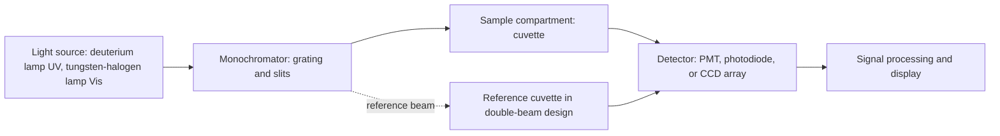
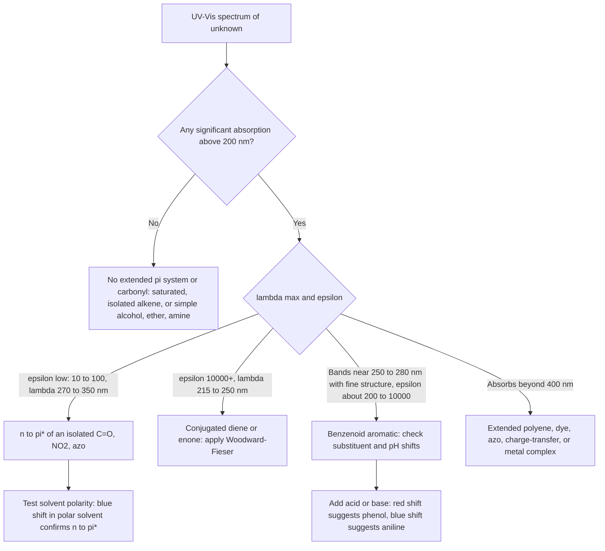

## Ultraviolet and Visible Spectroscopy


### Overview

**Ultraviolet–visible (UV–Vis) spectroscopy** measures the absorption (or transmission) of electromagnetic radiation in the region of roughly **190–800 nm** by a sample. Absorption of a photon promotes an electron from an occupied (ground-state) orbital to an unoccupied (excited-state) orbital. Because these **electronic transitions** are governed by the energies of frontier orbitals, UV–Vis spectra report chiefly on **conjugation, chromophores, and electronic structure**, and, through the Beer–Lambert law, provide one of the most convenient tools for **quantitative analysis** of concentration.

In the structure-determination toolkit, UV–Vis complements IR (functional groups), NMR (carbon–hydrogen framework), and MS (molecular mass and fragments): it identifies **conjugated $\pi$ systems** (dienes, enones, aromatics), heteroatom lone-pair chromophores, and transition-metal $d$–$d$ and charge-transfer transitions.

**Key Points**

- Energy of a transition: $\Delta E = h\nu = \dfrac{hc}{\lambda}$; shorter wavelength corresponds to higher energy.
- The **more extended the conjugation**, the smaller the HOMO–LUMO gap and the **longer** the wavelength of maximum absorption ($\lambda_{max}$).
- Quantitative analysis relies on the **Beer–Lambert law**: $A = \varepsilon\, c\, \ell$.
- Simple saturated compounds (alkanes, alcohols, ethers) do not absorb above ~200 nm; useful absorption arises from $\pi \to \pi^*$ and $n \to \pi^*$ transitions.
- The technique is rapid, inexpensive, and non-destructive, but spectra are broad and less structurally specific than IR or NMR.

---

### The Electromagnetic Spectrum in the UV–Vis Region

| Region | Wavelength range (nm) | Notes |
| --- | --- | --- |
| Vacuum UV | 10–190 | Absorbed by $O_2$ and $N_2$ in air; requires evacuated or purged instruments |
| Far/near UV (quartz UV) | 190–380 | Standard analytical UV region; needs quartz optics |
| Visible | 380–780 | Perceived as color |
| Near-IR (adjacent) | 780–2500 | Overtones; separate technique |

**Relationships between wavelength, frequency, wavenumber, and energy**

$$\nu = \frac{c}{\lambda}, \qquad \tilde{\nu} = \frac{1}{\lambda}, \qquad E = h\nu = \frac{hc}{\lambda}$$

A convenient conversion for molar energy:

$$E\ (\text{kcal/mol}) \approx \frac{28{,}600}{\lambda\ (\text{nm})}, \qquad E\ (\text{kJ/mol}) \approx \frac{119{,}600}{\lambda\ (\text{nm})}$$

For example, at $\lambda = 200$ nm, $E \approx 598$ kJ/mol; at $\lambda = 700$ nm, $E \approx 171$ kJ/mol. These energies are comparable to the strengths of covalent bonds, so prolonged UV irradiation can cause **photochemical decomposition**.

#### Color and Complementary Color

The color perceived is the **complement** of the absorbed light.

| Absorbed wavelength (nm) | Absorbed color | Observed (complementary) color |
| --- | --- | --- |
| 400–435 | Violet | Yellow-green |
| 435–480 | Blue | Yellow |
| 480–490 | Green-blue | Orange |
| 490–500 | Blue-green | Red |
| 500–560 | Green | Purple |
| 560–580 | Yellow-green | Violet |
| 580–595 | Yellow | Blue |
| 595–650 | Orange | Green-blue |
| 650–750 | Red | Blue-green |

*Boundaries are approximate.*

---

### Electronic Transitions

#### Molecular Orbital Types

| Orbital | Description | Relative energy |
| --- | --- | --- |
| $\sigma$ | Bonding sigma | Lowest |
| $\pi$ | Bonding pi |  |
| $n$ | Nonbonding (lone pair) | Intermediate (highest occupied in many heteroatom compounds) |
| $\pi^*$ | Antibonding pi |  |
| $\sigma^*$ | Antibonding sigma | Highest |

#### Transition Energy Ordering

$$\sigma \to \sigma^* \;>\; n \to \sigma^* \;>\; \pi \to \pi^* \;>\; n \to \pi^*$$

(highest energy to lowest energy, i.e., shortest wavelength to longest wavelength.)

#### Energy-Level Diagram (svg_diagram)

<svg xmlns="http://www.w3.org/2000/svg" viewBox="0 0 640 380" width="640" height="380" font-family="Arial, sans-serif">
<title>Electronic Transitions in UV-Vis Spectroscopy (svg_diagram)</title>
<text x="320" y="24" text-anchor="middle" font-size="16" font-weight="bold">Electronic Transitions in UV-Vis Spectroscopy (svg_diagram)</text>
<line x1="40" y1="340" x2="40" y2="50" stroke="#333" stroke-width="2" />
<text x="18" y="200" text-anchor="middle" font-size="13" transform="rotate(-90 18 200)">Energy</text>

<line x1="120" y1="70" x2="220" y2="70" stroke="#2c3e50" stroke-width="3" />
<text x="235" y="75" font-size="14">σ*</text>
<line x1="120" y1="120" x2="220" y2="120" stroke="#2c3e50" stroke-width="3" />
<text x="235" y="125" font-size="14">π*</text>
<line x1="120" y1="220" x2="220" y2="220" stroke="#2c3e50" stroke-width="3" />
<text x="235" y="225" font-size="14">n</text>
<line x1="120" y1="270" x2="220" y2="270" stroke="#2c3e50" stroke-width="3" />
<text x="235" y="275" font-size="14">π</text>
<line x1="120" y1="320" x2="220" y2="320" stroke="#2c3e50" stroke-width="3" />
<text x="235" y="325" font-size="14">σ</text>

<line x1="140" y1="316" x2="140" y2="76" stroke="#c0392b" stroke-width="2" marker-end="url(#up)" />
<text x="340" y="190" font-size="12" fill="#c0392b">σ → σ* (vacuum UV, &lt;150 nm)</text>
<line x1="165" y1="216" x2="165" y2="76" stroke="#e67e22" stroke-width="2" marker-end="url(#up)" />
<text x="340" y="150" font-size="12" fill="#e67e22">n → σ* (~150–250 nm)</text>
<line x1="190" y1="266" x2="190" y2="126" stroke="#2471a3" stroke-width="2" marker-end="url(#up)" />
<text x="340" y="250" font-size="12" fill="#2471a3">π → π* (~170–250 nm; longer with conjugation)</text>
<line x1="205" y1="216" x2="205" y2="126" stroke="#1e8449" stroke-width="2" marker-end="url(#up)" />
<text x="340" y="300" font-size="12" fill="#1e8449">n → π* (~270–350 nm; weak)</text>
</svg>

#### Characteristics of Each Transition

| Transition | Typical $\lambda$ | Typical $\varepsilon$ ($M^{-1}cm^{-1}$) | Examples |
| --- | --- | --- | --- |
| $\sigma \to \sigma^*$ | $< 150$ nm | Variable | Alkanes (methane ~125 nm, ethane ~135 nm) |
| $n \to \sigma^*$ | ~150–250 nm | 100–3,000 | Alcohols, amines, alkyl halides, sulfides (e.g., water ~167 nm, methanol ~177 nm, methylamine ~215 nm, alkyl iodides ~260 nm) |
| $\pi \to \pi^*$ | ~170–250 nm (isolated); longer with conjugation | 1,000–10,000+ (up to $10^5$) | Alkenes (ethylene ~165 nm), carbonyls, aromatics, dienes |
| $n \to \pi^*$ | ~270–350 nm (carbonyls) | 10–100 (weak) | Ketones (acetone ~279 nm), aldehydes, nitro, azo |
| Charge transfer (CT) | Variable | $10^3$–$10^5$ | Metal–ligand CT, donor–acceptor complexes, iodine–solvent |
| $d \to d$ | Visible | 1–100 | Transition-metal complexes (e.g., $[Cu(H_2O)_6]^{2+}$) |

**Key Points**

- $n \to \pi^*$ absorptions are **weak** (small $\varepsilon$) because the orbitals overlap poorly (the transition is symmetry-forbidden or partially forbidden).
- $\pi \to \pi^*$ absorptions are **strong** (allowed transitions).
- Only transitions falling above ~190 nm are accessible in standard instruments.

#### Selection Rules

- **Spin selection rule:** transitions must not change the spin multiplicity ($\Delta S = 0$); singlet–singlet transitions are allowed, singlet–triplet are strongly forbidden (weak, $\varepsilon \lesssim 10^{-3}$–$10^{-1}$).
- **Orbital symmetry (Laporte) rule:** in centrosymmetric molecules, $g \leftrightarrow g$ and $u \leftrightarrow u$ transitions are forbidden (relevant to $d$–$d$ bands in octahedral complexes, which are weak).
- **Franck–Condon principle:** electronic transitions occur much faster than nuclear motion, so they are "vertical" on a potential-energy diagram; the vibrational structure of a band reflects the overlap of ground- and excited-state vibrational wavefunctions.

Forbidden transitions can gain intensity through **vibronic coupling**, spin–orbit coupling, or loss of symmetry.

---

### The Beer–Lambert Law

#### Definitions

Transmittance:

$$T = \frac{I}{I_0}, \qquad \%T = 100\,T$$

Absorbance:

$$A = -\log_{10}\, T = \log_{10}\frac{I_0}{I}$$

**Beer–Lambert law:**

$$A = \varepsilon\, c\, \ell$$

| Symbol | Meaning | Typical units |
| --- | --- | --- |
| $A$ | Absorbance | Dimensionless (absorbance units, AU) |
| $\varepsilon$ | Molar absorptivity (molar extinction coefficient) | $M^{-1}\,cm^{-1}$ (i.e., $L\,mol^{-1}\,cm^{-1}$) |
| $c$ | Concentration | $mol/L$ ($M$) |
| $\ell$ | Path length | cm (standard cuvette: 1.00 cm) |

**Useful relationships**

| $A$ | $\%T$ |
| --- | --- |
| 0 | 100% |
| 0.301 | 50% |
| 1.000 | 10% |
| 2.000 | 1% |
| 3.000 | 0.1% |

The optimal absorbance range for accurate quantitation is roughly **0.1–1.0** (about 80%–10% T); beyond this range, stray light and detector noise degrade linearity and precision.

**Example 1: Concentration from absorbance**

A solution of a compound with $\varepsilon = 1.50 \times 10^4\ M^{-1}cm^{-1}$ at 260 nm shows $A = 0.450$ in a 1.00 cm cell.

$$c = \frac{A}{\varepsilon \ell} = \frac{0.450}{(1.50 \times 10^4)(1.00)} = 3.00 \times 10^{-5}\ M$$

**Example 2: Determining $\varepsilon$ from a standard**

A $2.00 \times 10^{-4}\ M$ solution gives $A = 0.860$ at $\lambda_{max}$ in a 1.00 cm cell:

$$\varepsilon = \frac{A}{c\ell} = \frac{0.860}{(2.00 \times 10^{-4})(1.00)} = 4.30 \times 10^3\ M^{-1}cm^{-1}$$

**Example 3: Nucleic acid concentration ($A_{260}$ rule of thumb)**

For double-stranded DNA, an absorbance of 1.0 at 260 nm (1 cm path) corresponds to roughly $50\ \mu g/mL$ (single-stranded DNA and RNA ~33–40 $\mu g/mL$). Purity is assessed by the $A_{260}/A_{280}$ ratio (~1.8 for pure DNA, ~2.0 for pure RNA). [Inference: exact conversion factors are conventional approximations and can vary with buffer and sequence.]

**Example 4: Multi-component analysis**

For a mixture of two absorbers X and Y measured at two wavelengths $\lambda_1$, $\lambda_2$ (absorbances are additive):

$$A_{\lambda_1} = (\varepsilon_{X,1}\, c_X + \varepsilon_{Y,1}\, c_Y)\,\ell$$


$$A_{\lambda_2} = (\varepsilon_{X,2}\, c_X + \varepsilon_{Y,2}\, c_Y)\,\ell$$

These two linear equations are solved for $c_X$ and $c_Y$. Accuracy is best when the two wavelengths are chosen where the ratio $\varepsilon_X/\varepsilon_Y$ differs greatly.

#### Deviations from the Beer–Lambert Law

| Type | Cause | Remedy |
| --- | --- | --- |
| Real (fundamental) | High concentration ($\gtrsim 0.01\ M$): solute–solute interactions and refractive-index changes | Dilute the sample |
| Chemical | Association/dissociation, complexation, or pH-dependent equilibria alter the absorbing species | Buffer; control pH; work at an isosbestic point |
| Instrumental | Polychromatic light (finite bandwidth), stray light, detector nonlinearity | Narrow slit; use good baseline; keep $A < 1$–2 |
| Fluorescence or scattering | Re-emission or turbid sample | Filter/centrifuge; use appropriate blank; integrating sphere |

An **isosbestic point** is a wavelength at which two interconverting species have identical $\varepsilon$; the absorbance at this point stays constant as the equilibrium shifts, and its presence in a series of spectra indicates a clean two-species conversion (e.g., acid–base indicator, reaction kinetics).

---

### Chromophores and Auxochromes

#### Definitions

- **Chromophore:** the group or system responsible for absorption at a given wavelength (e.g., $C{=}C$, $C{=}O$, benzene ring, $NO_2$, $N{=}N$).
- **Auxochrome:** a substituent with a lone pair (e.g., $-OH$, $-OR$, $-NH_2$, $-Cl$) that is not itself a strong chromophore but **shifts** and intensifies absorption by interacting (conjugating) with the chromophore.

#### Spectral Shift Terminology

| Term | Meaning |
| --- | --- |
| **Bathochromic (red) shift** | $\lambda_{max}$ moves to a **longer** wavelength |
| **Hypsochromic (blue) shift** | $\lambda_{max}$ moves to a **shorter** wavelength |
| **Hyperchromic effect** | Increase in $\varepsilon$ (intensity) |
| **Hypochromic effect** | Decrease in $\varepsilon$ |

#### Common Isolated Chromophores

| Chromophore | Transition | Approx. $\lambda_{max}$ (nm) | Approx. $\varepsilon$ |
| --- | --- | --- | --- |
| $C{=}C$ (ethylene) | $\pi \to \pi^*$ | 165–175 | ~10,000–15,000 |
| $C{\equiv}C$ (acetylene) | $\pi \to \pi^*$ | ~173 | ~6,000 |
| $C{=}O$ (ketone, acetone) | $n \to \pi^*$ | 270–290 | 10–30 |
| $C{=}O$ (ketone) | $\pi \to \pi^*$ | ~180–190 | ~1,000 |
| $C{=}O$ (aldehyde) | $n \to \pi^*$ | 285–295 | 10–20 |
| $-COOH$, $-COOR$ | $n \to \pi^*$ | ~205–210 | 50–100 |
| $-CONH_2$ | $n \to \pi^*$ | ~210–220 | ~100 |
| $-NO_2$ | $n \to \pi^*$ | ~270–280 | ~15–25 |
| $-N{=}N-$ | $n \to \pi^*$ | ~350–370 | ~10–200 |
| $-C{\equiv}N$ | $n \to \pi^*$ | ~160–170 | Weak |
| Benzene | $\pi \to \pi^*$ (multiple bands) | 180, 204, 255 (fine structure) | 47,000; 7,000; 200 |
| $-S{-}$ (thioethers) | $n \to \sigma^*$ | ~210–230 | ~1,000 |

*Values are approximate and depend on solvent and substitution.*

---

### Conjugation and the Woodward–Fieser Rules

#### Why Conjugation Shifts $\lambda_{max}$ to the Red

Combining $n$ $p$ orbitals in a conjugated system produces $n$ molecular orbitals; as $n$ increases, the energy gap between the HOMO and LUMO **narrows**, so $\lambda_{max}$ increases. A simple particle-in-a-box model gives:

$$\Delta E = \frac{h^2}{8 m L^2}\,(N+1)$$

where $N$ is the number of $\pi$ electrons and $L$ is the length of the conjugated chain; as $L$ grows, $\Delta E$ falls and $\lambda_{max}$ rises. [Inference: this free-electron model is a qualitative illustration and is not quantitatively accurate for real polyenes.]

| Compound | Number of conjugated $C{=}C$ | $\lambda_{max}$ (nm) | $\varepsilon$ |
| --- | --- | --- | --- |
| Ethylene | 1 | 165 | ~15,000 |
| 1,3-Butadiene | 2 | 217 | ~21,000 |
| 1,3,5-Hexatriene | 3 | 258 | ~35,000 |
| 1,3,5,7-Octatetraene | 4 | 290 | ~ 50,000 |
| $\beta$-Carotene | 11 | ~450 (visible) | ~140,000 |
| Lycopene | 11 (acyclic) | ~470–505 | ~185,000 |

Compounds with about **eight or more** conjugated double bonds absorb in the visible region and are colored (carotenoids, retinal). Each additional conjugated $C{=}C$ shifts $\lambda_{max}$ by roughly 30–40 nm at first, with diminishing increments for longer chains.

#### Woodward–Fieser Rules for Conjugated Dienes

Empirical additive rules predict $\lambda_{max}$ of conjugated dienes and polyenes.

**Base values**

| Diene type | Base $\lambda$ (nm) |
| --- | --- |
| Acyclic or heteroannular (transoid) diene | 214 |
| Homoannular (cisoid) diene | 253 |

**Increments (added to the base)**

| Structural feature | Increment (nm) |
| --- | --- |
| Each additional conjugated $C{=}C$ | +30 |
| Exocyclic double bond (each) | +5 |
| Each alkyl substituent or ring residue on the diene | +5 |
| $-OR$ (alkoxy) | +6 |
| $-SR$ (thioalkyl) | +30 |
| $-Cl$, $-Br$ | +5 |
| $-NR_2$ | +60 |
| $-OCOR$ (acyloxy) | 0 |

**Procedure**

1. Identify the diene as transoid/heteroannular (base 214) or cisoid/homoannular (base 253); if both types are present, use the higher base value (253).
2. Count additional conjugated double bonds, exocyclic double bonds, alkyl substituents/ring residues, and auxochromes.
3. Sum the increments.

**Example 5: 1,3-Butadiene**

$$\lambda_{max} = 214 + \text{(alkyl substituents: } 0) = 214\ nm$$

Observed: 217 nm (good agreement).

**Example 6: 2,3-Dimethyl-1,3-butadiene**

$$\lambda_{max} = 214 + 2(5) = 224\ nm$$

(Two alkyl groups on the diene carbons; observed ~226 nm.)

**Example 7: 1,3-Cyclohexadiene (homoannular)**

$$\lambda_{max} = 253 + 2\,(5)\ \text{(two ring residues)} = 263\ nm$$

Observed ~256 nm; the rules are approximate.

**Example 8: A heteroannular steroidal diene** with 3 ring residues and 1 exocyclic double bond:

$$\lambda_{max} = 214 + 3(5) + 1(5) = 234\ nm$$

**Key Points**

- **Cisoid (s-cis)** diene conformations, in which the two double bonds lie on the same side of the single bond, give lower-energy, longer-wavelength absorption with different intensity than transoid dienes; strained or twisted conformations reduce conjugation and lower $\varepsilon$.
- Rules apply best to non-strained systems; sterically hindered or nonplanar dienes deviate.

#### Woodward–Fieser Rules for Enones ($\alpha,\beta$-Unsaturated Carbonyls)

**Base values (for the $\pi \to \pi^*$ transition, in ethanol)**

| Enone type | Base $\lambda$ (nm) |
| --- | --- |
| Acyclic $\alpha,\beta$-unsaturated ketone or six-membered ring ketone | 215 |
| Five-membered ring enone | 202 |
| $\alpha,\beta$-Unsaturated aldehyde | 207 |
| $\alpha,\beta$-Unsaturated acid or ester | 195 |

**Increments**

| Feature | Increment (nm) |
| --- | --- |
| Each additional conjugated $C{=}C$ | +30 |
| Homoannular diene component | +39 |
| Exocyclic $C{=}C$ | +5 |

Substituents on the $\alpha$, $\beta$, $\gamma$, $\delta$ (and higher) carbons:

| Substituent | $\alpha$ | $\beta$ | $\gamma$ | $\delta$ and higher |
| --- | --- | --- | --- | --- |
| Alkyl or ring residue | +10 | +12 | +18 | +18 |
| $-OH$ | +35 | +30 | +30 | +50 |
| $-OR$ (alkoxy) | +35 | +30 | +17 | +31 |
| $-OCOR$ (acyloxy) | +6 | +6 | +6 | +6 |
| $-Cl$ | +15 | +12 | — | — |
| $-Br$ | +25 | +30 | — | — |
| $-NR_2$ | — | +95 | — | — |
| $-SR$ | — | +85 | — | — |

**Solvent corrections** (relative to ethanol/methanol):

| Solvent | Correction (nm) |
| --- | --- |
| Water | $-8$ |
| Ethanol, methanol | 0 |
| Chloroform | $+1$ |
| Dioxane | $+5$ |
| Diethyl ether | $+7$ |
| Hexane, cyclohexane | $+11$ |

**Example 9: Mesityl oxide, $(CH_3)_2C{=}CH{-}CO{-}CH_3$ (in ethanol)**

| Contribution | nm |
| --- | --- |
| Base (acyclic enone) | 215 |
| Two $\beta$-alkyl groups ($2 \times 12$) | +24 |
| **Predicted** | **239** |

Observed: ~237 nm in ethanol (excellent agreement).

**Example 10: Cyclohexenone with a $\beta$-methyl and an exocyclic double bond**

| Contribution | nm |
| --- | --- |
| Base (six-ring enone) | 215 |
| $\beta$-Alkyl substituent | +12 |
| Exocyclic double bond | +5 |
| **Predicted** | **232** |

**Key Points**

- The strong $\pi \to \pi^*$ band (~220–250 nm, $\varepsilon \sim 10^4$) shifts to the red with conjugation and alkyl substitution.
- The weak $n \to \pi^*$ band (~320 nm, $\varepsilon \sim 10$–100) is often hidden or observed only at high concentration; it shifts **blue** in polar protic solvents and **red** in nonpolar solvents (see solvent effects).

---

### Aromatic Compounds

Benzene shows three $\pi \to \pi^*$ bands:

| Band name | Approx. $\lambda$ (nm) | Approx. $\varepsilon$ | Comment |
| --- | --- | --- | --- |
| Primary ($E_1$) | ~180 | ~47,000 | Allowed; below quartz-UV cutoff |
| Secondary ($E_2$) | ~204 | ~7,000 | Allowed |
| Benzenoid (fine-structure, $B$) | ~254–256 | ~200 | Symmetry-forbidden; gains intensity via vibronic coupling; shows vibrational fine structure in nonpolar solvents |

#### Substituent Effects on Benzene

Substituents shift and intensify the $B$ and $E_2$ bands.

| Substituent (on benzene) | $E_2$ band $\lambda_{max}$ (nm) | $B$ band $\lambda_{max}$ (nm) | Effect |
| --- | --- | --- | --- |
| $-H$ (benzene) | 204 | 254 | Reference |
| $-CH_3$ (toluene) | 208 | 262 | Small red shift |
| $-Cl$ | 210 | 265 |  |
| $-OH$ (phenol) | 211 | 270 | Red shift (lone-pair conjugation) |
| $-OCH_3$ | 217 | 269 |  |
| $-NH_2$ (aniline) | 230 | 280 | Large red shift |
| $-CO_2H$ (benzoic acid) | 230 | 273 | Conjugation with $C{=}O$ |
| $-CHO$ (benzaldehyde) | 244 | 280 |  |
| $-COCH_3$ (acetophenone) | 240 | 278 |  |
| $-NO_2$ (nitrobenzene) | 252 | 280 | Strong charge-transfer-like band |
| $-CH{=}CH_2$ (styrene) | 244 | 282 | Extended conjugation |
| $-Ph$ (biphenyl) | 246 | — | Extended conjugation |

*Approximate values in polar solvents; they vary with solvent and pH.*

#### pH Effects (Ionizable Auxochromes)

| Compound | Neutral form | Ionized form | Change |
| --- | --- | --- | --- |
| Phenol | $E_2$ 211, $B$ 270 | Phenoxide: 235, 287 | Bathochromic and hyperchromic shift (lone pair on $O^-$ conjugates more strongly) |
| Aniline | $E_2$ 230, $B$ 280 | Anilinium ($-NH_3^+$): resembles benzene, 203, 254 | Hypsochromic (loss of lone pair conjugation) |
| Benzoic acid | 230, 273 | Benzoate: 224, 268 | Small blue shift |

**Diagnostic use:** a shift to longer wavelength on adding base is characteristic of **phenols**; a shift to shorter wavelength (loss of the auxochrome's conjugation) on adding acid is characteristic of **aromatic amines**.

#### Polycyclic Aromatic Hydrocarbons and Heterocycles

| Compound | Number of fused rings | Longest-wavelength band (nm) |
| --- | --- | --- |
| Benzene | 1 | ~254 |
| Naphthalene | 2 | ~314 (weak) |
| Anthracene | 3 (linear) | ~375 |
| Tetracene | 4 (linear) | ~475 (yellow-orange) |
| Pentacene | 5 (linear) | ~580 (blue-violet) |

Linear fusion produces a larger red shift than angular fusion. Heterocycles (pyridine ~251, pyrrole ~210, indole ~270–290, purines ~260) also have characteristic absorptions used in biochemistry.

---

### Solvent and Environmental Effects

#### Polarity Effects

| Transition | Effect of increasing solvent polarity | Reason |
| --- | --- | --- |
| $n \to \pi^*$ | **Hypsochromic (blue) shift** | Polar/protic solvents stabilize the lone pair (ground state) by hydrogen bonding and dipole interactions, raising the transition energy |
| $\pi \to \pi^*$ | **Bathochromic (red) shift** (typically small) | The excited state is usually more polar than the ground state and is stabilized more by a polar solvent |

**Example:** acetone $n \to \pi^*$: 279 nm in hexane, ~272 nm in water (blue shift of several nm). Mesityl oxide $\pi \to \pi^*$: ~230 nm in hexane, ~243 nm in water (red shift).

This opposing behavior is a **diagnostic tool**: measuring the spectrum in a nonpolar and a polar solvent helps assign a band as $n \to \pi^*$ or $\pi \to \pi^*$.

#### Solvent Choice and UV Cutoff

The solvent must be transparent in the region of interest. The **UV cutoff** is the wavelength below which the solvent's own absorbance exceeds ~1 in a 1 cm cell.

| Solvent | Approx. UV cutoff (nm) |
| --- | --- |
| Water | ~190 |
| Acetonitrile | ~190 |
| Hexane, cyclohexane | ~195–200 |
| Methanol | ~205 |
| Ethanol (95%) | ~205–210 |
| Diethyl ether | ~215 |
| Dichloromethane | ~230–235 |
| Chloroform | ~245 |
| Ethyl acetate | ~255 |
| Acetone | ~330 |
| Toluene | ~285 |
| Benzene | ~280 |
| DMSO | ~265 |
| DMF | ~270 |

Values are approximate and vary with purity and supplier grade; use spectroscopic-grade solvents.

#### Other Environmental Factors

- **Temperature:** broadens or narrows bands and shifts equilibria.
- **pH:** ionization state of chromophores (indicators, phenols, amines, nucleobases).
- **Concentration and aggregation:** dimerization or stacking (dyes, nucleobases) shifts and hypochromic effects (DNA hypochromicity: ~10–40% increase in $A_{260}$ upon denaturation, the basis of melting-curve analysis).
- **Complexation:** metal binding, hydrogen bonding, and charge-transfer complexes create new bands.

---

### Inorganic and Charge-Transfer Absorption

#### Transition-Metal Complexes

| Transition type | Description | Typical $\varepsilon$ ($M^{-1}cm^{-1}$) |
| --- | --- | --- |
| $d \to d$ (ligand-field) | Electron promoted between split $d$ orbitals | 1–100 (Laporte-forbidden in octahedral complexes); up to ~$10^2$–$10^3$ in tetrahedral (no inversion center) |
| Ligand-to-metal charge transfer (LMCT) | Electron moves from ligand-based to metal-based orbital (e.g., $MnO_4^-$, $CrO_4^{2-}$) | $10^3$–$10^5$ |
| Metal-to-ligand charge transfer (MLCT) | Electron moves from metal to ligand $\pi^*$ (e.g., $[Ru(bpy)_3]^{2+}$, $[Fe(phen)_3]^{2+}$) | $10^3$–$10^4$ |
| Intervalence charge transfer | Between metal centers of different oxidation states (Prussian blue) | $10^3$–$10^4$ |

**Ligand-field splitting and color:** the octahedral splitting $\Delta_o$ depends on the ligand (spectrochemical series: $I^- < Br^- < Cl^- < F^- < H_2O < NH_3 < en < CN^- < CO$). A larger $\Delta_o$ shifts absorption to shorter wavelength.

$$\Delta_o = h\nu = \frac{hc}{\lambda_{max}}$$

**Example 11:** $[Ti(H_2O)_6]^{3+}$ ($d^1$) absorbs at ~500 nm (20,300 cm$^{-1}$), so $\Delta_o \approx 243$ kJ/mol, consistent with its purple color (it transmits blue and red).

#### Charge-Transfer Complexes

Donor–acceptor pairs (for example, iodine in benzene, or tetracyanoethylene with aromatic donors) show intense broad bands not present in either component; these are used for detecting weak electron-donor interactions.

---

### Instrumentation

#### Components



| Component | Options and notes |
| --- | --- |
| **Light source** | Deuterium arc lamp (~190–400 nm); tungsten or tungsten-halogen lamp (~320–2500 nm); xenon flash lamp; sources are switched at ~320–360 nm |
| **Wavelength selector** | Prism or diffraction grating monochromator; filters in simple colorimeters; bandwidth set by slit width |
| **Sample holder (cuvette)** | **Quartz** or fused silica (transparent from ~190 nm; required for UV work); glass (>~320 nm) and plastic (>~300–350 nm, disposable) for visible; standard path length 1.00 cm; microvolume and long-path cells also used |
| **Detector** | Photomultiplier tube (high sensitivity), silicon photodiode, photodiode array (PDA) or CCD (simultaneous multiwavelength acquisition) |
| **Readout** | Absorbance vs wavelength (spectrum) or absorbance at a fixed wavelength (kinetics/quantitation) |

#### Instrument Designs

| Design | Description | Advantages / limitations |
| --- | --- | --- |
| **Single beam** | Blank and sample measured sequentially | Simple, inexpensive; sensitive to lamp drift |
| **Double beam** | Beam split between reference and sample paths; ratio measured | Corrects for lamp fluctuations; standard for scanning spectrophotometers |
| **Diode-array (PDA)** | Polychromatic light passes through the sample, then is dispersed onto a detector array | Fast full-spectrum acquisition (~1 s); common in HPLC detection; lower stray-light rejection than scanning instruments |
| **Dual-wavelength / derivative** | Measures difference between two wavelengths | Turbid samples, overlapping bands |
| **Integrating sphere / diffuse reflectance** | For solids, powders, and scattering samples | Solid-state UV–Vis, bandgap determination |

#### Practical Measurement Procedure

1. Warm up the lamp (typically 15–30 minutes for stable output).
2. Select an appropriate solvent, blank, and cuvette (quartz for $< 320$ nm).
3. **Baseline (blank) correction:** record the spectrum of the solvent alone (or use a "zero" absorbance with the blank in the beam).
4. Rinse the cuvette with sample; fill to the proper height; wipe optical faces clean; orient consistently (frosted sides handled only).
5. Scan or read the sample; keep $A$ in the range ~0.1–1.0 by dilution as needed.
6. Record $\lambda_{max}$, $A$, and compute $\varepsilon$ if the concentration is known.
7. For quantitation, prepare a **calibration curve** ($A$ vs $c$) with several standards; verify linearity and use the fitted slope.

**Sources of error:** dirty or scratched cuvettes, bubbles, fingerprints, mismatched cuvettes, stray light, incorrect blank, sample photodegradation, temperature drift, fluorescence, scattering by suspended particles, wavelength-calibration error (verified using holmium oxide or didymium filters, and photometric accuracy checked with potassium dichromate solutions).

---

### Applications

| Area | Use |
| --- | --- |
| Structure elucidation | Detecting conjugation, aromatic rings, enones, dienes; distinguishing isomers (e.g., conjugated vs nonconjugated dienes; *cis* vs *trans* stilbene) |
| Quantitative analysis | Beer–Lambert calibration for concentration of analytes (pharmaceutical assays, environmental analysis such as nitrate/nitrite, iron by the 1,10-phenanthroline complex) |
| Biochemistry | Protein quantitation at 280 nm (Trp, Tyr), Bradford/BCA/Lowry colorimetric assays, nucleic acid concentration and purity ($A_{260}$, $A_{260}/A_{280}$), NADH ($\lambda_{max}$ 340 nm, $\varepsilon = 6220\ M^{-1}cm^{-1}$) in enzyme assays |
| Kinetics | Monitoring reaction progress by absorbance change (with isosbestic points confirming clean conversion) |
| Equilibrium constants | Spectrophotometric determination of $pK_a$ (indicator dyes), binding constants (Job's method, Benesi–Hildebrand), complexation stoichiometry |
| HPLC detection | UV or diode-array detectors identify and quantify eluting compounds by their spectra |
| Materials science | Bandgap estimation of semiconductors (Tauc plots), plasmon resonance of metal nanoparticles, thin-film optical properties |
| Dyes and pigments | Color analysis; carotenoid, chlorophyll, and anthocyanin characterization |
| Clinical/analytical | Hemoglobin, bilirubin, enzyme-coupled assays |

**Example 12: Estimating a bandgap from an onset wavelength**

A semiconductor nanocrystal shows an absorption onset at 620 nm:

$$E_g = \frac{1240\ eV \cdot nm}{\lambda} = \frac{1240}{620} = 2.0\ eV$$

(Tauc-plot analysis gives more rigorous values for bulk materials.)

**Example 13: Kinetic monitoring**

For a first-order reaction $A \to B$ where only $A$ absorbs at the chosen wavelength:

$$\ln A_t = \ln A_0 - kt$$

A plot of $\ln A_t$ versus $t$ is linear with slope $-k$.

**Example 14: Determining an indicator $pK_a$**

For a weak-acid indicator $HIn \rightleftharpoons H^+ + In^-$ with absorbances $A_{HIn}$ (acidic limit), $A_{In^-}$ (basic limit), and $A$ at an intermediate pH:

$$pK_a = pH + \log\frac{A - A_{In^-}}{A_{HIn} - A}$$


---

### Interpreting a UV–Vis Spectrum: Decision Logic



**Rules of thumb**

1. **No absorption above 200 nm:** no conjugation, no aromatic ring, no carbonyl (or only isolated ones absorbing weakly).
2. **Weak band ($\varepsilon < 100$) at 270–300 nm:** isolated ketone or aldehyde ($n \to \pi^*$).
3. **Strong band ($\varepsilon > 10{,}000$) at 215–250 nm:** conjugated diene or enone.
4. **Moderate band ($\varepsilon$ ~200–2,000) at 250–280 nm with fine structure:** benzenoid ring.
5. **Absorption above ~400 nm:** extensive conjugation or a colored inorganic/charge-transfer species.

---

### Worked Problems

#### Problem 1: Distinguish two isomers

Which isomer absorbs at a longer wavelength: 1,3-cyclohexadiene or 1,4-cyclohexadiene?

**Answer:** 1,3-cyclohexadiene ($\lambda_{max} \approx 256$ nm) is conjugated, while 1,4-cyclohexadiene has two isolated double bonds and absorbs only below ~200 nm.

#### Problem 2: Predict $\lambda_{max}$ for a diene (Woodward–Fieser)

Predict $\lambda_{max}$ for a heteroannular diene bearing three alkyl/ring-residue substituents and one exocyclic double bond.

| Contribution | nm |
| --- | --- |
| Base (heteroannular) | 214 |
| Three alkyl/ring residues ($3 \times 5$) | +15 |
| One exocyclic double bond | +5 |
| **Predicted** | **234** |

#### Problem 3: Predict $\lambda_{max}$ for an enone

Cyclohex-2-en-1-one bearing an alkyl group at $\beta$ and another at $\gamma$, in ethanol.

| Contribution | nm |
| --- | --- |
| Base (six-membered ring enone) | 215 |
| $\beta$-Alkyl | +12 |
| $\gamma$-Alkyl | +18 |
| Solvent (ethanol) | 0 |
| **Predicted** | **245** |

#### Problem 4: Beer–Lambert with dilution

A stock solution gives $A = 1.80$ at 280 nm in a 1.00 cm cell (outside the ideal range). A 1:5 dilution (1 part stock + 4 parts solvent) gives $A = 0.36$. With $\varepsilon = 5{,}600\ M^{-1}cm^{-1}$:

$$c_{diluted} = \frac{0.36}{5{,}600 \times 1.00} = 6.43 \times 10^{-5}\ M$$


$$c_{stock} = 5 \times 6.43 \times 10^{-5} = 3.21 \times 10^{-4}\ M$$

#### Problem 5: Assign a band by solvent shift

A ketone shows a weak band at 285 nm ($\varepsilon = 25$) in hexane, which shifts to 274 nm in ethanol. The **blue shift** in the polar protic solvent identifies it as an $n \to \pi^*$ transition.

#### Problem 6: Melting curve of DNA

At 25 °C a DNA sample has $A_{260} = 0.80$. On heating to 95 °C, $A_{260}$ rises to 1.00. The hyperchromicity is:

$$\frac{1.00 - 0.80}{0.80} \times 100\% = 25\%$$

The midpoint of the transition (the melting temperature, $T_m$) depends on GC content and ionic strength.

---

### Computational Aid: Woodward–Fieser and Beer–Lambert Calculator

The following Python sketch implements simplified Woodward–Fieser predictions and Beer–Lambert conversions. The increment values are the textbook empirical ones and the predictions are approximate, so the calculator does not replace experiment or quantum-chemical calculation (e.g., TD-DFT).

```python
import math

# ---------- Beer-Lambert ----------
def absorbance_from_T(percent_T):
    return -math.log10(percent_T / 100.0)

def concentration(A, epsilon, path_cm=1.0):
    return A / (epsilon * path_cm)

# ---------- Woodward-Fieser: dienes ----------
def diene_lambda_max(homoannular=False, extra_conj_db=0, exocyclic_db=0,
                     alkyl_or_ring=0, OR=0, SR=0, halogen=0, NR2=0):
    base = 253 if homoannular else 214
    return (base
            + 30 * extra_conj_db
            + 5 * exocyclic_db
            + 5 * alkyl_or_ring
            + 6 * OR
            + 30 * SR
            + 5 * halogen
            + 60 * NR2)

# ---------- Woodward-Fieser: enones ----------
ENONE_BASE = {"acyclic_or_6ring_ketone": 215, "5ring_ketone": 202,
              "aldehyde": 207, "acid_or_ester": 195}
ALKYL = {"alpha": 10, "beta": 12, "gamma": 18, "delta": 18}
SOLVENT = {"ethanol": 0, "methanol": 0, "water": -8, "chloroform": 1,
           "dioxane": 5, "ether": 7, "hexane": 11}

def enone_lambda_max(kind, alkyl_positions=(), extra_conj_db=0,
                     homoannular_diene=False, exocyclic_db=0, solvent="ethanol"):
    lam = ENONE_BASE[kind]
    lam += sum(ALKYL[p] for p in alkyl_positions)
    lam += 30 * extra_conj_db
    lam += 39 if homoannular_diene else 0
    lam += 5 * exocyclic_db
    lam += SOLVENT[solvent]
    return lam

print("Butadiene:                   ", diene_lambda_max(), "nm")
print("2,3-Dimethylbutadiene:       ", diene_lambda_max(alkyl_or_ring=2), "nm")
print("Mesityl oxide (ethanol):     ",
      enone_lambda_max("acyclic_or_6ring_ketone", ("beta", "beta")), "nm")
print("Cyclohexenone, beta+gamma R: ",
      enone_lambda_max("acyclic_or_6ring_ketone", ("beta", "gamma")), "nm")
print("[c] at %T = 25, eps=1.2e4:   ",
      f"{concentration(absorbance_from_T(25), 1.2e4):.2e} M")
```

**Output**



```
Butadiene:                    214 nm
2,3-Dimethylbutadiene:        224 nm
Mesityl oxide (ethanol):      239 nm
Cyclohexenone, beta+gamma R:  245 nm
[c] at %T = 25, eps=1.2e4:    5.02e-05 M
```

---

### Limitations and Complementary Techniques

| Limitation | Consequence | Complement |
| --- | --- | --- |
| Broad, featureless bands | Poor structural specificity | IR, NMR, MS |
| Overlapping absorption of mixtures | Difficult deconvolution | Chromatography with diode-array detection; chemometrics |
| Limited to chromophoric compounds | Saturated compounds are invisible above 200 nm | Derivatization; other detectors (RI, ELSD, CAD, MS) |
| Empirical prediction rules | Deviations for strained, twisted, or heavily substituted systems | Computational methods (TD-DFT, CASPT2) |
| Photodegradation | Sample changes during measurement | Short exposures; lower lamp intensity; fresh samples |

**Related optical techniques:** fluorescence and phosphorescence (emission), circular dichroism (chiral chromophores), linear dichroism, and diffuse reflectance.

---

### Common Pitfalls

**Key Points**

- Reporting $\varepsilon$ without specifying wavelength and solvent.
- Working at $A > 1.5$–2 where the Beer–Lambert relationship breaks down and stray light dominates.
- Using **glass or plastic cuvettes** below ~320 nm (they absorb UV); quartz is required.
- Forgetting to **blank** with the same solvent (and buffer/matrix) used for the sample.
- Choosing a solvent whose UV cutoff overlaps the band of interest (e.g., acetone, toluene, or chloroform for 220–250 nm work).
- Interpreting a weak $n \to \pi^*$ band as evidence of a small amount of impurity (it is intrinsic, and weak because of low $\varepsilon$).
- Applying Woodward–Fieser rules to strained or nonplanar systems or to systems with more than four conjugated double bonds (the Fieser–Kuhn rules are used for longer polyenes).
- Ignoring **pH**: a change in ionization state alters the spectrum significantly (phenols, anilines, indicators, nucleobases).
- Overlooking **scattering** in turbid samples, which raises apparent absorbance (baseline slopes upward toward short wavelengths).
- Neglecting **photodecomposition** or **photoisomerization** (e.g., *trans*-to-*cis* isomerization of stilbene, azo dyes) during scanning.
- Treating $\lambda_{max}$ predictions from empirical rules as exact; typical accuracy is about $\pm 5$–$10$ nm.
- Confusing transmittance and absorbance; $A$ is logarithmic.

---

### Conclusion

UV–Vis spectroscopy probes electronic transitions between molecular orbitals, chiefly $\pi \to \pi^*$ and $n \to \pi^*$ in organic compounds and $d$–$d$ and charge-transfer transitions in inorganic species. The position ($\lambda_{max}$) reports on the extent of conjugation and the nature of the chromophore and auxochromes, with empirical Woodward–Fieser rules providing quick estimates for dienes and enones; the intensity ($\varepsilon$) reports on the allowedness of the transition; and the Beer–Lambert law converts absorbance into concentration. Solvent and pH effects offer additional diagnostic power (blue shift of $n \to \pi^*$ in polar solvents, phenol and aniline behavior on acid/base addition). While the technique lacks the fine structural resolution of IR, NMR, and MS, its speed, sensitivity, and quantitative reliability make it indispensable for conjugation analysis, purity checks, kinetics, equilibria, biochemical assays, and HPLC detection.

---

### Related Topics

- Infrared spectroscopy: functional-group identification
- Nuclear magnetic resonance spectroscopy: $^1H$ and $^{13}C$ structure determination
- Mass spectrometry: molecular mass and fragmentation
- Fluorescence, phosphorescence, and Jablonski diagrams
- Circular dichroism and optical rotatory dispersion
- Fieser–Kuhn rules for extended polyenes and carotenoids
- Molecular orbital theory of conjugated systems: Hückel method and HOMO–LUMO gaps
- Time-dependent density functional theory (TD-DFT) for predicting electronic spectra
- Spectrophotometric titrations and determination of stability constants
- Photochemistry: photoisomerization, photocycloaddition, and photodegradation