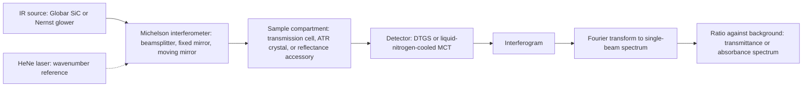
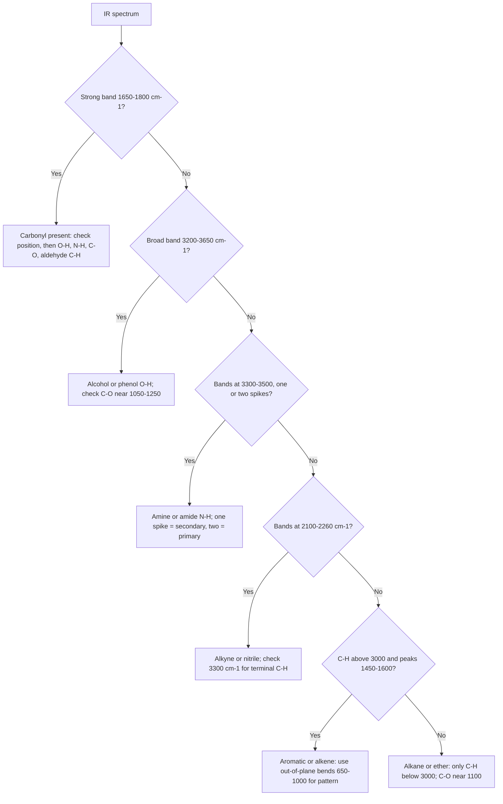

## Infrared Spectroscopy


### Overview

**Infrared (IR) spectroscopy** measures the absorption of infrared radiation by a sample as a function of wavenumber. Absorption occurs when the frequency of the radiation matches the frequency of a **molecular vibration** and that vibration produces a **change in the molecular dipole moment**. Because each type of bond and functional group vibrates at characteristic frequencies, an IR spectrum serves as a rapid, non-destructive probe of **functional groups** and, through the **fingerprint region**, as a unique identifier for a compound.

In the structure-determination toolkit, IR answers "which functional groups are present (or absent)?", complementing UV–Vis (conjugation), NMR (carbon–hydrogen framework), and mass spectrometry (molecular mass and fragmentation).

**Key Points**

- Conventional IR spectra are plotted as **% transmittance** (or absorbance) versus **wavenumber** ($\tilde{\nu}$, cm$^{-1}$), with wavenumber decreasing from left to right (approximately 4000 to 400 cm$^{-1}$).
- A vibration is **IR active** only if it changes the molecular dipole moment; symmetric vibrations of nonpolar bonds (e.g., $N{\equiv}N$, $O{=}O$) are IR inactive but may be Raman active.
- Higher bond strength and lower reduced mass give **higher** stretching wavenumbers (Hooke's law).
- The **diagnostic region** (4000–1500 cm$^{-1}$) identifies functional groups; the **fingerprint region** (1500–400 cm$^{-1}$) is complex, compound-specific, and useful for matching to reference spectra.
- Intensity and **band shape** (sharp, broad, doublet) are as informative as position (e.g., broad O–H versus sharp N–H).

---

### The Infrared Region

| Region | Wavenumber (cm$^{-1}$) | Wavelength ($\mu m$) | Content |
| --- | --- | --- | --- |
| Near-IR (NIR) | 12,500–4,000 | 0.8–2.5 | Overtones and combination bands of X–H stretches; used for quantitative analysis in agriculture, pharmaceuticals |
| **Mid-IR (MIR)** | **4,000–400** | **2.5–25** | **Fundamental vibrations; the region for structure determination** |
| Far-IR | 400–10 | 25–1,000 | Lattice vibrations, metal–ligand, and heavy-atom modes |

**Conversions**

$$\tilde{\nu}\ (\text{cm}^{-1}) = \frac{10^4}{\lambda\ (\mu m)}, \qquad E = h c \tilde{\nu}$$

A photon at 1700 cm$^{-1}$ (a typical carbonyl stretch) has $\lambda = 5.88\ \mu m$ and molar energy $E \approx 20.3$ kJ/mol, far too small to break bonds but sufficient to excite vibrational levels.

---

### Theory of Molecular Vibrations

#### Harmonic Oscillator Model and Hooke's Law

Treating a bond as a spring connecting two masses gives the vibrational frequency:

$$\nu = \frac{1}{2\pi}\sqrt{\frac{k}{\mu}}$$

or, in wavenumbers:

$$\tilde{\nu} = \frac{1}{2\pi c}\sqrt{\frac{k}{\mu}}$$

where $k$ is the **force constant** (N/m; a measure of bond strength) and $\mu$ is the **reduced mass**:

$$\mu = \frac{m_1 m_2}{m_1 + m_2}$$

| Bond | Approx. $k$ (N/m) | Typical stretch (cm$^{-1}$) |
| --- | --- | --- |
| $C{-}C$ | ~450 | 800–1200 |
| $C{=}C$ | ~950 | 1600–1680 |
| $C{\equiv}C$ | ~1500 | 2100–2260 |
| $C{-}H$ | ~500 | 2850–3100 |
| $C{=}O$ | ~1200 | 1650–1800 |
| $O{-}H$ | ~700 | 3200–3650 |

**Consequences**

1. **Stronger bonds vibrate at higher wavenumber:** $C{\equiv}C > C{=}C > C{-}C$.
2. **Lighter atoms give higher wavenumber:** $C{-}H$ stretches (~3000 cm$^{-1}$) are far above $C{-}C$ stretches (~1000 cm$^{-1}$) because of the small reduced mass of C–H.
3. **Isotopic substitution lowers the frequency:** replacing H with D roughly reduces $\tilde{\nu}$ by $1/\sqrt{2}$: $C{-}H$ at ~3000 cm$^{-1}$ becomes $C{-}D$ at ~2200 cm$^{-1}$.

**Example 1: Estimating a carbonyl stretch**

For $C{=}O$: $k \approx 1.2 \times 10^3$ N/m, $\mu = \dfrac{12 \times 16}{12 + 16} = 6.86$ amu $= 1.14 \times 10^{-26}$ kg.

$$\tilde{\nu} = \frac{1}{2\pi (3.00 \times 10^{10}\ cm/s)}\sqrt{\frac{1200\ N/m}{1.14 \times 10^{-26}\ kg}} \approx 1.72 \times 10^3\ cm^{-1}$$

This agrees well with the observed carbonyl range (~1700 cm$^{-1}$).

**Example 2: Isotope effect on C–H versus C–D**

$$\frac{\tilde{\nu}_{C-D}}{\tilde{\nu}_{C-H}} = \sqrt{\frac{\mu_{C-H}}{\mu_{C-D}}} = \sqrt{\frac{0.923}{1.714}} \approx 0.73$$

A $C{-}H$ stretch at 3000 cm$^{-1}$ therefore appears near 2200 cm$^{-1}$ in the deuterated analog.

#### Anharmonicity, Overtones, and Combination Bands

Real bonds are **anharmonic** (the potential energy curve is not a perfect parabola; bonds can dissociate). Consequences:

- Vibrational levels become closer together at higher $v$.
- **Overtone** bands ($\Delta v = \pm 2, \pm 3$) appear at slightly less than integer multiples of the fundamental, with much lower intensity (e.g., the $C{=}O$ first overtone near 3400 cm$^{-1}$ can be mistaken for a weak $O{-}H$).
- **Combination bands** (sums or differences of fundamentals) also appear.
- **Fermi resonance** occurs when an overtone or combination band has nearly the same energy as a fundamental of the same symmetry, mixing them and producing a doublet (classically, the aldehyde C–H stretch at ~2820 and ~2720 cm$^{-1}$, and the doubling of the $C{=}O$ band in some acyl chlorides and cyclopentanones).

#### Number of Vibrational Modes

For a molecule of $N$ atoms:

$$\text{Nonlinear molecule: } 3N - 6 \text{ vibrational modes}, \qquad \text{Linear molecule: } 3N - 5$$

| Molecule | $N$ | Modes | Comment |
| --- | --- | --- | --- |
| $H_2O$ | 3 | 3 | Symmetric stretch (3657), asymmetric stretch (3756), bend (1595 cm$^{-1}$); all IR active |
| $CO_2$ | 3 | 4 ($3N-5$) | Symmetric stretch (~1340, IR inactive), asymmetric stretch (2349, IR active), doubly degenerate bend (667, IR active) |
| Methane | 5 | 9 | Four distinct frequencies because of degeneracy |
| Benzene | 12 | 30 | Many degenerate; only a subset are IR active |

Not every mode gives an observable band: modes that do not change the dipole moment are inactive, degenerate modes coincide, and some modes fall outside the accessible range or are too weak.

#### Types of Vibrations

| Type | Description |
| --- | --- |
| **Stretching** | Change in bond length; **symmetric** and **asymmetric** stretches for groups such as $CH_2$, $CH_3$, $NH_2$, $NO_2$, $SO_2$ |
| **Bending** | Change in bond angle; includes **scissoring** (in-plane, two atoms move toward/away), **rocking** (in-plane, atoms move together), **wagging** (out-of-plane, atoms move together), and **twisting** (out-of-plane, atoms move opposite) |

Stretching modes generally occur at higher frequency than bending modes for the same atoms, because changing a bond length requires more energy than changing an angle.

#### Vibrational Modes of a Methylene Group (svg_diagram)

<svg xmlns="http://www.w3.org/2000/svg" viewBox="0 0 700 300" width="700" height="300" font-family="Arial, sans-serif">
<title>Vibrational Modes of a CH2 Group (svg_diagram)</title>
<text x="350" y="24" text-anchor="middle" font-size="16" font-weight="bold">Vibrational Modes of a CH2 Group (svg_diagram)</text>
<text x="100" y="60" text-anchor="middle" font-size="13" font-weight="bold">Symmetric stretch</text>
<circle cx="100" cy="120" r="14" fill="#5d6d7e" /><text x="100" y="125" text-anchor="middle" font-size="12" fill="#fff">C</text>
<circle cx="55" cy="165" r="9" fill="#ecf0f1" stroke="#7f8c8d" /><text x="55" y="169" text-anchor="middle" font-size="10">H</text>
<circle cx="145" cy="165" r="9" fill="#ecf0f1" stroke="#7f8c8d" /><text x="145" y="169" text-anchor="middle" font-size="10">H</text>
<line x1="62" y1="160" x2="42" y2="180" stroke="#c0392b" stroke-width="2" marker-end="url(#a)" />
<line x1="138" y1="160" x2="158" y2="180" stroke="#c0392b" stroke-width="2" marker-end="url(#a)" />
<text x="100" y="215" text-anchor="middle" font-size="11">~2850 cm⁻¹</text>

<text x="270" y="60" text-anchor="middle" font-size="13" font-weight="bold">Asymmetric stretch</text>
<circle cx="270" cy="120" r="14" fill="#5d6d7e" /><text x="270" y="125" text-anchor="middle" font-size="12" fill="#fff">C</text>
<circle cx="225" cy="165" r="9" fill="#ecf0f1" stroke="#7f8c8d" /><text x="225" y="169" text-anchor="middle" font-size="10">H</text>
<circle cx="315" cy="165" r="9" fill="#ecf0f1" stroke="#7f8c8d" /><text x="315" y="169" text-anchor="middle" font-size="10">H</text>
<line x1="232" y1="160" x2="212" y2="180" stroke="#c0392b" stroke-width="2" marker-end="url(#a)" />
<line x1="308" y1="170" x2="288" y2="150" stroke="#c0392b" stroke-width="2" marker-end="url(#a)" />
<text x="270" y="215" text-anchor="middle" font-size="11">~2925 cm⁻¹</text>

<text x="440" y="60" text-anchor="middle" font-size="13" font-weight="bold">Scissoring (bend)</text>
<circle cx="440" cy="120" r="14" fill="#5d6d7e" /><text x="440" y="125" text-anchor="middle" font-size="12" fill="#fff">C</text>
<circle cx="395" cy="165" r="9" fill="#ecf0f1" stroke="#7f8c8d" /><text x="395" y="169" text-anchor="middle" font-size="10">H</text>
<circle cx="485" cy="165" r="9" fill="#ecf0f1" stroke="#7f8c8d" /><text x="485" y="169" text-anchor="middle" font-size="10">H</text>
<line x1="405" y1="168" x2="425" y2="168" stroke="#c0392b" stroke-width="2" marker-end="url(#a)" />
<line x1="475" y1="168" x2="455" y2="168" stroke="#c0392b" stroke-width="2" marker-end="url(#a)" />
<text x="440" y="215" text-anchor="middle" font-size="11">~1465 cm⁻¹</text>

<text x="610" y="60" text-anchor="middle" font-size="13" font-weight="bold">Rocking (bend)</text>
<circle cx="610" cy="120" r="14" fill="#5d6d7e" /><text x="610" y="125" text-anchor="middle" font-size="12" fill="#fff">C</text>
<circle cx="565" cy="165" r="9" fill="#ecf0f1" stroke="#7f8c8d" /><text x="565" y="169" text-anchor="middle" font-size="10">H</text>
<circle cx="655" cy="165" r="9" fill="#ecf0f1" stroke="#7f8c8d" /><text x="655" y="169" text-anchor="middle" font-size="10">H</text>
<line x1="565" y1="185" x2="590" y2="185" stroke="#c0392b" stroke-width="2" marker-end="url(#a)" />
<line x1="640" y1="185" x2="665" y2="185" stroke="#c0392b" stroke-width="2" marker-end="url(#a)" />
<text x="610" y="215" text-anchor="middle" font-size="11">~720 cm⁻¹</text>
<text x="350" y="260" text-anchor="middle" font-size="12">Wagging and twisting (out-of-plane) modes occur at ~1150–1350 cm⁻¹</text>
</svg>

#### Selection Rule and Band Intensity

**Gross selection rule:** the dipole moment must change during the vibration.

$$\left(\frac{\partial \mu}{\partial Q}\right)_{Q=0} \neq 0$$

Band **intensity** is proportional to the square of this derivative, so polar bonds ($C{=}O$, $O{-}H$, $N{-}H$, $C{-}O$, $N{-}O$) give strong bands and nonpolar or symmetrical bonds ($C{=}C$ in symmetrical alkenes, $C{\equiv}C$ in symmetrical alkynes, $S{-}S$) give weak or absent bands.

| Property | Effect on band |
| --- | --- |
| Bond polarity change during vibration | Larger change gives stronger band |
| Concentration | Intensity increases with concentration (Beer–Lambert law applies: $A = \varepsilon c \ell$) |
| Hydrogen bonding | Broadens and strengthens O–H and N–H bands |

---

### Instrumentation

#### Dispersive and FT-IR Spectrometers

| Feature | Dispersive (older) | **Fourier-transform IR (FT-IR)** |
| --- | --- | --- |
| Principle | Grating monochromator scans wavelengths | Michelson interferometer records an interferogram; Fourier transform gives the spectrum |
| Speed | Minutes | Seconds |
| Sensitivity | Lower | Higher (multiplex/Fellgett advantage) |
| Throughput | Limited by slits | High (Jacquinot advantage) |
| Wavenumber accuracy | Moderate | Excellent (internal HeNe laser reference; Connes advantage) |
| Current use | Rare | Standard |



**Components**

- **Source:** heated inert solid (Globar, silicon carbide, ~1200 K; Nernst glower; nichrome coil) emitting blackbody radiation.
- **Beamsplitter:** KBr (with germanium coating) for mid-IR; CsI for far-IR; $CaF_2$ for near-IR.
- **Detectors:** DTGS (deuterated triglycine sulfate; room-temperature pyroelectric) for routine work; MCT (mercury cadmium telluride; cryogenically cooled, more sensitive and faster) for demanding applications.
- **Resolution:** typically 4 cm$^{-1}$ for routine liquids/solids; 1–0.1 cm$^{-1}$ for gases (rotational fine structure).

**Resolution and interferometer mirror travel:**

$$\Delta\tilde{\nu} \approx \frac{1}{\delta_{max}}$$

where $\delta_{max}$ is the maximum optical path difference. Larger mirror travel gives finer resolution.

#### Sample Handling Techniques

| Technique | Sample state | Procedure / notes |
| --- | --- | --- |
| **Attenuated total reflectance (ATR)** | Solids, liquids, pastes, films | Sample pressed against a high-refractive-index crystal (diamond, ZnSe, Ge); the evanescent wave penetrates ~0.5–5 $\mu m$; minimal preparation; now the most common method. Band intensities depend on wavelength (lower-wavenumber bands appear relatively stronger) and require an ATR correction for comparison with transmission spectra |
| **KBr pellet** | Solids | Grind ~1 mg sample with ~100–200 mg dry KBr; press into a transparent disc; KBr is IR transparent but hygroscopic (moisture gives an O–H band near 3400 and 1640 cm$^{-1}$) |
| **Nujol mull** | Solids | Grind with mineral oil (paraffin); the oil shows C–H bands at ~2920, 2850, 1460, 1375 cm$^{-1}$ that mask the same region of the sample |
| **Thin liquid film ("neat")** | Liquids | Drop between two NaCl or KBr plates (water-sensitive) |
| **Solution cell** | Liquids, dissolved solids | Use IR-transparent solvents ($CCl_4$, $CS_2$, $CHCl_3$, $CH_2Cl_2$); path length 0.1–1 mm; solvent bands must be subtracted or avoided |
| **Gas cell** | Gases and vapors | Path lengths from 10 cm to many meters (multi-pass cells for trace gases) |
| **Diffuse reflectance (DRIFTS)** | Powders, rough solids | Sample diluted in KBr; scattered light collected |
| **Photoacoustic, microscopy (FT-IR imaging), grazing-angle** | Specialized | Opaque solids, microscopic samples, thin films on metals |

**Window materials**

| Material | Transmits to (cm$^{-1}$) | Notes |
| --- | --- | --- |
| NaCl | ~650 | Cheap; dissolves in water |
| KBr | ~400 | Hygroscopic |
| CsI | ~200 | Soft, hygroscopic |
| $CaF_2$, $BaF_2$ | ~1100 / ~800 | Water-insoluble (BaF$_2$ slightly); suitable for aqueous solutions |
| ZnSe | ~550 | ATR crystal and windows; avoid strong acids/bases |
| Diamond | Full range (with absorption ~2000 cm$^{-1}$ from the lattice) | Extremely robust ATR crystal |
| Ge, Si | Ge to ~600; Si to ~1500 | High refractive index (ATR for strongly absorbing samples) |

**Background correction:** a background (single-beam) spectrum of the empty beam (or blank matrix) is recorded and ratioed against the sample single-beam spectrum to remove instrument response, atmospheric $CO_2$ (2349 and 667 cm$^{-1}$), and water vapor (~3900–3500 and ~1900–1300 cm$^{-1}$ fine structure).

---

### Interpreting Spectra: The Regions

#### Overview of the Spectrum

| Region (cm$^{-1}$) | Assignment |
| --- | --- |
| 3700–3200 | $O{-}H$ (alcohol, phenol, acid), $N{-}H$ stretches |
| 3300–2700 | $C{-}H$ stretches ($sp$: ~3300; $sp^2$: 3000–3100; $sp^3$: 2850–3000; aldehyde: ~2720, 2820); carboxylic acid $O{-}H$ (broad, 3300–2500) |
| 2300–2100 | Triple bonds: $C{\equiv}C$ (2100–2260), $C{\equiv}N$ (2210–2260), and cumulenes/azides/isocyanates (~2100–2280) |
| 1850–1650 | $C{=}O$ stretches (the most diagnostic single band) |
| 1680–1500 | $C{=}C$ (alkene ~1620–1680; aromatic ~1450–1600), $C{=}N$, $N{-}H$ bend (amide II ~1550), $NO_2$ asymmetric stretch |
| 1500–1300 | $C{-}H$ bends ($CH_2$ ~1465; $CH_3$ ~1375), $NO_2$ symmetric stretch (~1350), $S{=}O$, $O{-}H$ bend |
| 1300–1000 | $C{-}O$ stretches (alcohol, ether, ester, acid), $C{-}N$, $C{-}F$, $S{=}O$, $P{=}O$, $Si{-}O$ |
| 1000–650 | $=C{-}H$ out-of-plane bends (alkene and aromatic substitution patterns), $C{-}Cl$ (~600–800), $N{-}H$ wag |



---

### Characteristic Absorptions by Functional Group

#### C–H Stretching and Bending

| Type | Wavenumber (cm$^{-1}$) | Intensity | Notes |
| --- | --- | --- | --- |
| Alkane $sp^3$ C–H | 2850–3000 (asym ~2960, sym ~2870 for $CH_3$; asym ~2925, sym ~2850 for $CH_2$) | Strong | Always present in organic compounds with sp³ carbons |
| Alkene $sp^2$ C–H | 3000–3100 | Medium | Above 3000 = unsaturation or aromatic |
| Aromatic C–H | 3000–3100 (typically ~3030) | Weak–medium | Multiple weak bands |
| Alkyne $sp$ C–H | ~3300 | Strong, sharp | Terminal alkyne only |
| Aldehyde C–H | ~2720 and ~2820 | Medium–weak | Fermi doublet; the ~2720 band is diagnostic |
| $CH_2$ scissor | ~1465 | Medium |  |
| $CH_3$ symmetric bend (umbrella) | ~1375 | Medium | *Gem*-dimethyl (isopropyl) splits it into a doublet (~1385, ~1370); *tert*-butyl gives ~1395 and ~1365 |
| $(CH_2)_n$ rock, $n \geq 4$ | ~720 | Weak–medium | Long-chain indicator |

The C–H stretching **frequency correlates with hybridization** (increasing $s$-character strengthens the bond): $sp$ (~3300) > $sp^2$ (~3050) > $sp^3$ (~2900).

#### Alkenes

| Vibration | Wavenumber (cm$^{-1}$) | Intensity | Comment |
| --- | --- | --- | --- |
| $C{=}C$ stretch | 1620–1680 | Weak–medium | Weak or absent in symmetrical alkenes; conjugation lowers it (~1600–1650) and increases intensity |
| $=C{-}H$ stretch | 3010–3100 | Medium |  |
| $=C{-}H$ out-of-plane bend | 650–1000 | Strong | See substitution table below |

**Alkene substitution patterns (out-of-plane C–H bending)**

| Substitution | Bending (cm$^{-1}$) |
| --- | --- |
| Monosubstituted ($RCH{=}CH_2$) | ~990 and ~910 |
| *trans*-1,2-Disubstituted | ~965 |
| *cis*-1,2-Disubstituted | ~700 (variable, ~675–730) |
| 1,1-Disubstituted ($R_2C{=}CH_2$) | ~890 |
| Trisubstituted | ~815–840 |

#### Alkynes

| Vibration | Wavenumber (cm$^{-1}$) | Intensity |
| --- | --- | --- |
| $C{\equiv}C$ stretch | 2100–2260 | Weak (terminal); weak to absent (internal, symmetrical) |
| ${\equiv}C{-}H$ stretch | ~3300 | Strong, sharp |
| $C{\equiv}C{-}H$ bend | 600–700 | Strong, broad |

#### Aromatic Compounds

| Vibration | Wavenumber (cm$^{-1}$) | Intensity |
| --- | --- | --- |
| Aromatic C–H stretch | 3000–3100 | Weak–medium |
| Ring $C{=}C$ stretches | ~1600, ~1580, ~1500, ~1450 | Medium–weak (usually 2–4 bands) |
| Overtone/combination pattern | 2000–1660 | Weak (shape reflects substitution pattern) |
| C–H out-of-plane bending | 900–650 | Strong |

**Aromatic out-of-plane bending and substitution**

| Substitution | Out-of-plane C–H bends (cm$^{-1}$) |
| --- | --- |
| Monosubstituted | ~730–770 and ~690–710 |
| *ortho*-Disubstituted | ~735–770 |
| *meta*-Disubstituted | ~750–810, ~690 |
| *para*-Disubstituted | ~800–860 |
| 1,3,5-Trisubstituted | ~840–880 and ~675–730 |

*Ranges are approximate; strongly polar substituents can shift bands.*

#### Alcohols and Phenols

| Vibration | Wavenumber (cm$^{-1}$) | Appearance |
| --- | --- | --- |
| $O{-}H$ stretch, free (dilute solution, nonpolar solvent, gas phase) | 3580–3650 | Sharp, medium |
| $O{-}H$ stretch, hydrogen-bonded (neat, concentrated) | 3200–3550 | **Broad**, strong |
| $C{-}O$ stretch | ~1000–1260 | Strong (primary ~1050; secondary ~1100; tertiary ~1150–1200; phenol ~1220) |
| $O{-}H$ bend | ~1330–1420 | Medium, broad |

Intermolecular hydrogen bonding creates a distribution of O–H environments, producing the characteristic **broad, rounded** band centered near 3300–3400 cm$^{-1}$. Intramolecular H-bonding (for example, in salicylaldehyde or 2-nitrophenol) gives a band that does **not** sharpen on dilution, which distinguishes it from intermolecular H-bonding.

#### Ethers

| Vibration | Wavenumber (cm$^{-1}$) | Notes |
| --- | --- | --- |
| $C{-}O{-}C$ asymmetric stretch | 1050–1150 (aliphatic, commonly ~1100–1125) | Strong; no O–H or C=O bands present |
| Aryl alkyl ether | ~1250 (asymmetric) and ~1040 (symmetric) | Two strong bands |
| Vinyl ether, epoxide | Epoxide ring: ~1250, ~950–810 |  |

#### Carbonyl Compounds ($C{=}O$ stretch, the most useful IR band)

The carbonyl stretch is **intense** (large dipole change) and appears in a relatively uncluttered region (1650–1850 cm$^{-1}$), and its exact position reports on the type of carbonyl and its environment.

| Compound | $C{=}O$ stretch (cm$^{-1}$) | Additional diagnostic bands |
| --- | --- | --- |
| Saturated aldehyde | ~1725 | C–H at ~2720 and ~2820 |
| Saturated ketone (acyclic, 6-ring) | ~1715 |  |
| Carboxylic acid (dimer) | ~1710 | Very broad O–H, 3300–2500 (overlaps C–H); C–O ~1210–1320; O–H out-of-plane ~920 |
| Ester (saturated) | ~1735–1750 | Two C–O bands ~1000–1300 |
| Amide (primary/secondary/tertiary) | ~1630–1690 (amide I) | N–H stretch and amide II band (~1550, secondary) |
| Acid chloride | ~1800 |  |
| Acid anhydride | ~1820 and ~1760 | Two bands (asymmetric/symmetric); acyclic: higher-frequency band is stronger |
| $\alpha,\beta$-Unsaturated ketone/aldehyde | ~1665–1685 | $C{=}C$ ~1620–1640 |
| Aryl ketone | ~1685–1690 |  |
| Cyclopentanone | ~1745 | Ring strain raises frequency |
| Cyclobutanone | ~1780 |  |
| $\beta$-Lactam | ~1745–1770 |  |
| $\gamma$-Lactone | ~1770 |  |
| Quinone | ~1660 |  |

**Factors that shift the carbonyl frequency**

| Factor | Effect | Reason |
| --- | --- | --- |
| **Conjugation** with $C{=}C$ or aromatic ring | Lowers by ~20–40 cm$^{-1}$ | Resonance reduces double-bond character of $C{=}O$ |
| **Ring strain** (smaller rings) | Raises (6-ring ~1715 → 5-ring ~1745 → 4-ring ~1780) | Increased $s$-character in the exocyclic $C{=}O$ bond |
| **Inductive effect of electronegative substituent** on carbonyl carbon (Cl, OR) | Raises (acid chloride ~1800; ester ~1740) | Withdraws electron density through the $\sigma$ framework, shortening and strengthening $C{=}O$ |
| **Resonance donation** from heteroatom lone pair (N, and to a lesser extent O) | Lowers (amide ~1650; amide N donation is strongest) | Increases single-bond character of $C{=}O$ |
| **Hydrogen bonding** | Lowers by ~10–40 cm$^{-1}$ | Weakens $C{=}O$ |
| **Solvent** (polar or H-bonding) | Slightly lowers | Stabilizes polarized resonance form |

**Competing effects in esters and amides:** in an ester both the inductive effect of O (raises frequency) and resonance donation from O (lowers frequency) operate; the inductive effect dominates, so esters (~1740) absorb above ketones (~1715). In amides, nitrogen is a much better resonance donor and a weaker inductive withdrawer, so resonance dominates and the carbonyl absorbs low (~1650).

**Example 3: Ranking carbonyl stretches**

Rank cyclohexanone, acetyl chloride, acetamide, and ethyl acetate from highest to lowest $C{=}O$ frequency.

**Answer:** acetyl chloride (~1800) > ethyl acetate (~1740) > cyclohexanone (~1715) > acetamide (~1650–1690). Inductive withdrawal (Cl, OR) raises the frequency; resonance donation (NH$_2$) lowers it.

#### Carboxylic Acids

- **O–H stretch:** a very broad, strong absorption from ~3300 to 2500 cm$^{-1}$, caused by strong hydrogen-bonded dimers, with the sharper C–H stretches superimposed.
- **$C{=}O$ stretch:** ~1700–1725 (dimer ~1710; monomer in dilute solution ~1760).
- **C–O stretch:** ~1210–1320; **O–H out-of-plane bend:** ~910–950 (broad).
- **Carboxylate anions** ($RCOO^-$) lose the $C{=}O$ and instead show two bands: asymmetric stretch ~1550–1610 and symmetric stretch ~1300–1420 cm$^{-1}$.

#### Esters and Lactones

- $C{=}O$ at ~1735–1750 (saturated), ~1715–1730 (conjugated to $C{=}C$ or aromatic).
- Two strong C–O bands: $C(=O){-}O$ asymmetric ~1160–1300 and $O{-}C$ ~1000–1150 ("rule of three": three strong bands ~1740, ~1240, ~1050).

#### Amines and Amides

| Group | Vibration | Wavenumber (cm$^{-1}$) | Appearance |
| --- | --- | --- | --- |
| Primary amine ($-NH_2$) | $N{-}H$ stretch (asym + sym) | ~3500 and ~3400 (two bands) | Sharper and weaker than O–H |
| Secondary amine ($R_2NH$) | $N{-}H$ stretch | ~3300–3350 (single band) | Weak |
| Tertiary amine | No $N{-}H$ | — | Only C–N ~1020–1250 |
| Amines | $N{-}H$ bend | ~1580–1650 (primary) |  |
| Amines | $C{-}N$ stretch | ~1020–1250 (aliphatic), ~1250–1360 (aromatic) |  |
| Primary amide | $N{-}H$ stretch | ~3350 and ~3180 (two bands) | Amide I ~1650–1690, amide II ~1600–1640 |
| Secondary amide | $N{-}H$ stretch | ~3300 (one band) | Amide I ~1640–1680; **amide II ~1520–1570** (N–H bend + C–N stretch) |
| Tertiary amide | — | — | Amide I ~1630–1670 only; no N–H |
| Ammonium salt ($R{-}NH_3^+$) | $N{-}H$ stretch | ~3200–2800 (broad, multiple) |  |

Peptides and proteins show characteristic **amide I** (~1650 for $\alpha$-helix; ~1630 for $\beta$-sheet) and **amide II** (~1540–1550) bands, used for secondary-structure analysis.

#### Nitriles, Isocyanates, and Related Groups

| Group | Wavenumber (cm$^{-1}$) | Intensity |
| --- | --- | --- |
| Nitrile $C{\equiv}N$ | 2210–2260 (aliphatic ~2250; conjugated ~2230) | Medium, sharp |
| Isocyanate $N{=}C{=}O$ | ~2250–2275 | Very strong |
| Azide $N_3$ | ~2100–2160 | Strong |
| Isonitrile | ~2110–2165 | Strong |
| Allene $C{=}C{=}C$ | ~1950 | Medium |
| Ketene $C{=}C{=}O$ | ~2150 | Strong |
| Carbon dioxide (atmospheric) | 2349 | Strong (background artifact) |

#### Nitro and Sulfur/Phosphorus Groups

| Group | Wavenumber (cm$^{-1}$) | Comment |
| --- | --- | --- |
| Nitro ($NO_2$), aliphatic | ~1550 (asym) and ~1375 (sym) | Two strong bands |
| Nitro, aromatic | ~1520 and ~1345 | Two strong bands |
| Sulfoxide $S{=}O$ | ~1030–1070 | Strong |
| Sulfone $SO_2$ | ~1300–1350 (asym) and ~1120–1160 (sym) | Two strong bands |
| Sulfonamide, sulfonic acid | ~1330–1370 and ~1150–1180 |  |
| Thiol $S{-}H$ | ~2550–2600 | Weak |
| $P{=}O$ | ~1250–1300 | Strong |
| $Si{-}O$ | ~1000–1100 | Very strong, broad |
| $C{-}F$ | ~1000–1400 | Strong |
| $C{-}Cl$ | ~550–850 | Strong |
| $C{-}Br$, $C{-}I$ | ~500–690 / ~500 |  |

---

### The Fingerprint Region

The region ~1500–400 cm$^{-1}$ contains a very large number of overlapping stretching, bending, and skeletal vibrations. Assignments of individual bands are generally impractical, but the pattern as a whole is **unique to each compound**, making it ideal for:

- **Matching** an unknown to a library or authentic reference spectrum.
- **Distinguishing** closely related compounds (isomers, homologs, polymorphs).
- **Confirming identity** in pharmacopoeial assays (e.g., a sample must match a reference spectrum in the fingerprint region).

Within this region some **group frequencies** remain reliable: C–O stretches (1000–1300), $NO_2$ symmetric stretch (~1350), aromatic and alkene out-of-plane C–H bends (650–1000), C–halogen stretches, and $Si{-}O$, $P{=}O$, $S{=}O$ bands.

---

### Hydrogen Bonding and Environmental Effects

| Effect | Observation |
| --- | --- |
| **Intermolecular H-bonding (concentration dependent)** | Broad O–H/N–H band near 3200–3500; **sharpens and shifts to ~3600 (O–H)** on dilution in a nonpolar solvent |
| **Intramolecular H-bonding** | Band position and breadth largely independent of concentration; O–H may appear ~3200–3500 |
| **Physical state** | Gas-phase spectra show sharp rotational–vibrational fine structure; solid-state spectra can show splitting from crystal packing (polymorphs give different spectra) |
| **Solvent polarity** | Polar solvents lower $C{=}O$ and increase O–H broadening |
| **Temperature** | Higher temperature weakens H-bonding and sharpens bands |
| **Tautomers** | Keto–enol equilibria (e.g., $\beta$-diketones) show separate $C{=}O$ and enol O–H/C=C bands |

---

### Quantitative Aspects

**Beer–Lambert law** holds for IR, with absorbance $A$ related to transmittance $T$:

$$A = -\log_{10} T = \varepsilon\, c\, \ell$$

Molar absorptivities in the IR ($\varepsilon \sim 1$–$1000$ $M^{-1}cm^{-1}$) are much lower than in the UV, so IR cells use short but non-negligible path lengths and higher concentrations. Practical limitations include narrow bands (deviation from the law owing to finite instrument resolution), overlapping bands, and intermolecular interactions.

Uses of quantitative IR include measuring **carbonyl index** in polymer oxidation, **percent conversion** in reaction monitoring (disappearance of the $C{=}O$ or $N{=}C{=}O$ band), **gas analysis** (CO, $CO_2$, $CH_4$, $N_2O$), and blood-alcohol analysis (C–H and C–O bands). ATR-FTIR permits in-situ reaction monitoring with immersion probes.

---

### Complementary Technique: Raman Spectroscopy

| Feature | IR | Raman |
| --- | --- | --- |
| Physical process | Absorption | Inelastic scattering |
| Selection rule | Change in **dipole moment** | Change in **polarizability** |
| Strong for | Polar bonds ($C{=}O$, $O{-}H$, $N{-}H$) | Nonpolar/symmetric bonds ($C{=}C$, $C{\equiv}C$, $S{-}S$, $C{-}S$, $N{=}N$) |
| Water | Strong interference | Weak scatterer; good for aqueous samples |
| Mutual exclusion | In molecules with a **center of symmetry**, modes are either IR active or Raman active, not both |  |

The two techniques provide complementary vibrational information and are often used together.

---

### Systematic Spectrum Interpretation

**Recommended strategy**

1. **Check the carbonyl region (1650–1850).** Is there a strong band? If so, use position to classify it (see the carbonyl table), then look for confirming bands (aldehyde C–H, acid O–H, ester C–O, amide N–H).
2. **Check 3200–3700.** Broad O–H suggests alcohol/acid/phenol; one or two sharp N–H bands suggest amine or amide.
3. **Check C–H stretches near 3000.** Above 3000 indicates $sp^2$/$sp$ C–H (unsaturation, aromatic); below indicates $sp^3$; ~3300 sharp indicates a terminal alkyne.
4. **Check 2100–2300 for triple bonds** and cumulated systems.
5. **Check 1450–1650 for $C{=}C$ and aromatic ring bands,** and 650–1000 for substitution patterns.
6. **Check 1000–1300 for C–O and related heteroatom stretches** (ether, alcohol, ester).
7. **Note what is absent:** no O–H, no C=O, no N–H, etc., is as informative as what is present.
8. **Combine with other data** (molecular formula from MS, unsaturation count, NMR).

#### Degrees of Unsaturation Cross-Check

$$\text{DoU} = \frac{2C + 2 + N - H - X}{2}$$

An IR band for $C{=}O$, $C{=}C$, or $C{\equiv}N$ should be consistent with the calculated DoU.

---

### Worked Problems

#### Problem 1: Identify the functional group

An unknown liquid ($C_4H_8O$) shows a strong sharp band at 1715 cm$^{-1}$, no O–H band, no band at 2720 cm$^{-1}$, and C–H stretches just below 3000 cm$^{-1}$.

**Analysis:** DoU = 1. The band at 1715 cm$^{-1}$ indicates a saturated ketone (or a six-membered-ring ketone); absence of the ~2720 band rules out an aldehyde; absence of O–H rules out an alcohol/acid. **Conclusion:** butanone (2-butanone, methyl ethyl ketone).

#### Problem 2: Distinguish an alcohol from an ether

Compounds A and B are both $C_4H_{10}O$.

|  | Compound A | Compound B |
| --- | --- | --- |
| IR | Broad band ~3350; strong ~1050 | No band above 3000; strong ~1120 |

**Conclusion:** A is an alcohol (1-butanol, with primary C–O near 1050); B is an ether (diethyl ether, C–O–C ~1120).

#### Problem 3: Ketone versus ester versus acid

$C_4H_8O_2$ shows a very broad band 3300–2500 cm$^{-1}$ and a strong band at 1710 cm$^{-1}$.

**Conclusion:** carboxylic acid (butanoic acid or 2-methylpropanoic acid). An ester would lack the broad O–H and show ~1740.

#### Problem 4: Primary versus secondary versus tertiary amine

| Observation | Assignment |
| --- | --- |
| Two bands at ~3400 and ~3330 cm$^{-1}$ | Primary amine ($NH_2$) |
| One band at ~3300 cm$^{-1}$ | Secondary amine ($R_2NH$) |
| No band above 3000 cm$^{-1}$ due to N–H | Tertiary amine |

#### Problem 5: Substitution pattern of a disubstituted benzene

A compound shows aromatic C–H stretch at ~3030, ring bands at ~1600 and ~1500, and a single strong band at ~830 cm$^{-1}$ with no significant bands at 690–770.

**Conclusion:** *para*-disubstituted benzene (the ~800–860 out-of-plane bend, and absence of the monosubstituted 690/750 pair).

#### Problem 6: Effect of conjugation

Compare the $C{=}O$ stretch of 2-butanone (~1715), 3-buten-2-one (methyl vinyl ketone, ~1680), and acetophenone (~1685).

**Explanation:** conjugation delocalizes $\pi$ electrons and lowers the $C{=}O$ double-bond character, shifting the band to lower wavenumber by ~30 cm$^{-1}$.

#### Problem 7: Reaction monitoring

In the reduction of a ketone to an alcohol with $NaBH_4$, the IR would show disappearance of the $C{=}O$ band (~1715) and appearance of a broad O–H band (~3350) and C–O stretch (~1050–1100).

#### Problem 8: Ring-strain effect

Order these ketones by $C{=}O$ stretch: cyclobutanone, cyclopentanone, cyclohexanone.

**Answer:** cyclobutanone (~1780) > cyclopentanone (~1745) > cyclohexanone (~1715), reflecting increasing $s$-character in the carbonyl bond as ring size decreases.

---

### Computational Aid: Hooke's Law and Group Lookup

The following Python sketch computes harmonic estimates of stretching wavenumbers and matches an observed peak against a table of characteristic ranges. The tabulated ranges are approximate textbook values and multiple assignments often overlap, so results are suggestions, not identifications.

```python
import math

# ---- Hooke's law: harmonic wavenumber estimate ----
AMU = 1.66054e-27      # kg
C_CM = 2.99792458e10   # cm/s

def reduced_mass(m1_amu, m2_amu):
    return (m1_amu * m2_amu) / (m1_amu + m2_amu)

def wavenumber(k_N_per_m, m1_amu, m2_amu):
    mu = reduced_mass(m1_amu, m2_amu) * AMU
    return math.sqrt(k_N_per_m / mu) / (2 * math.pi * C_CM)

print(f"C=O  (k=1200): {wavenumber(1200, 12.0, 16.0):7.0f} cm-1")
print(f"C-H  (k= 500): {wavenumber(500, 12.0, 1.008):7.0f} cm-1")
print(f"C-D  (k= 500): {wavenumber(500, 12.0, 2.014):7.0f} cm-1")
print(f"C#C  (k=1500): {wavenumber(1500, 12.0, 12.0):7.0f} cm-1")

# ---- Simple peak-to-group lookup (approximate, overlapping ranges) ----
RANGES = [
    (3200, 3650, "O-H stretch (alcohol/phenol; broad if H-bonded)"),
    (3300, 3500, "N-H stretch (amine/amide)"),
    (3260, 3330, "Terminal alkyne C-H (sharp)"),
    (3000, 3100, "sp2 C-H (alkene/aromatic)"),
    (2850, 3000, "sp3 C-H"),
    (2700, 2850, "Aldehyde C-H (Fermi doublet ~2720/2820)"),
    (2100, 2260, "C#C or C#N"),
    (1780, 1850, "Acid chloride / anhydride C=O"),
    (1730, 1750, "Ester C=O"),
    (1700, 1725, "Ketone / aldehyde / acid C=O"),
    (1630, 1700, "Amide C=O / conjugated C=O / C=C"),
    (1450, 1600, "Aromatic ring C=C"),
    (1000, 1300, "C-O stretch"),
    (650, 1000, "=C-H / aromatic C-H out-of-plane bend"),
]

def assign(peak):
    return [label for lo, hi, label in RANGES if lo <= peak <= hi]

for p in (3340, 3300, 2720, 1735, 1685, 830):
    print(f"{p:5d} cm-1 -> {assign(p)}")
```

**Output** (approximate; abridged)



```
C=O  (k=1200):    1724 cm-1
C-H  (k= 500):    3032 cm-1
C-D  (k= 500):    2231 cm-1
C#C  (k=1500):    2080 cm-1
 3340 cm-1 -> ['O-H stretch (alcohol/phenol; broad if H-bonded)', 'N-H stretch (amine/amide)']
 3300 cm-1 -> ['O-H stretch (alcohol/phenol; broad if H-bonded)', 'N-H stretch (amine/amide)', 'Terminal alkyne C-H (sharp)']
 2720 cm-1 -> ['Aldehyde C-H (Fermi doublet ~2720/2820)']
 1735 cm-1 -> ['Ester C=O', 'Ketone / aldehyde / acid C=O']
 1685 cm-1 -> ['Amide C=O / conjugated C=O / C=C']
  830 cm-1 -> ['=C-H / aromatic C-H out-of-plane bend']
```

---

### Applications

| Area | Use |
| --- | --- |
| Organic structure elucidation | Functional-group identification; reaction monitoring |
| Quality control and forensics | Identity confirmation of raw materials, drugs, polymers, fibers, paints, and explosives by fingerprint matching |
| Polymer science | Composition, tacticity, crystallinity, degradation (carbonyl index), copolymer ratio |
| Biochemistry | Protein secondary structure (amide I/II), lipid phase behavior, nucleic acids |
| Environmental and atmospheric | Gas monitoring (CO$_2$, CH$_4$, N$_2$O, VOCs) by open-path and cavity techniques |
| Materials and surfaces | Adsorbates on catalysts (probe molecules such as CO), thin films, self-assembled monolayers |
| Process analytical technology | In-line ATR probes and NIR for reaction and blend monitoring |
| Art conservation and geology | Pigment, binder, and mineral identification (micro-FTIR) |

---

### Limitations

| Limitation | Consequence |
| --- | --- |
| Strong water absorption (~3400, ~1640 cm$^{-1}$ and libration below ~900) | Aqueous samples require ATR, thin cells with CaF$_2$/BaF$_2$, or D$_2$O; water subtraction |
| Overlap of bands in complex mixtures | Requires chemometrics or separation |
| Limited information on carbon skeleton connectivity | Use NMR and MS |
| Symmetric nonpolar bonds weak or invisible | Complement with Raman |
| Sample preparation artifacts | Moisture in KBr, polymorphic changes on grinding, ATR contact and depth effects |
| Atmospheric $CO_2$ and water vapor | Purge the instrument or subtract the background |

---

### Common Pitfalls

**Key Points**

- Mistaking a broad O–H band for an N–H band (N–H bands are typically weaker and sharper); also, moisture in KBr or a wet sample can produce a spurious O–H band near 3400 cm$^{-1}$.
- Treating the absence of a band at ~3000 as diagnostic without checking that $sp^3$ C–H stretches below 3000 are present (nearly all organic compounds have them).
- Assigning the exact structure from the fingerprint region without reference spectra.
- Ignoring conjugation, ring strain, and inductive/resonance effects when assigning $C{=}O$ frequencies.
- Reporting ATR spectra as if they were transmission spectra, without noting depth-of-penetration and intensity differences at low wavenumber.
- Forgetting overtone bands (e.g., a weak band near 3400 cm$^{-1}$ from a strong $C{=}O$ overtone), which may be mistaken for O–H.
- Overlooking atmospheric $CO_2$ (2349 cm$^{-1}$) and water-vapor bands from an inadequate background.
- Confusing the ~2720 aldehyde C–H band with other weak features; check for the accompanying ~2820 band and the carbonyl at ~1725.
- Assuming a missing $C{=}C$ band means no alkene (symmetrical alkenes may be IR-silent or very weak).
- Neglecting hydrogen-bonding effects when comparing solid-state or neat spectra with dilute-solution data.
- Reading band positions in transmittance plots without noting that wavenumber decreases to the right.
- Assuming empirical correlation-chart values are exact; typical ranges shift with solvent, phase, and neighboring groups.

---

### Conclusion

Infrared spectroscopy exploits the absorption of mid-IR radiation by vibrating bonds whose motion changes the molecular dipole moment. Band positions follow Hooke's law (stronger bonds and lighter atoms vibrate at higher wavenumber) and are modulated by conjugation, ring strain, inductive and resonance effects, and hydrogen bonding; band intensities track bond polarity. A disciplined reading of the spectrum, beginning with the carbonyl region, then the O–H/N–H and C–H regions, then triple bonds, aromatic and alkene patterns, and C–O/heteroatom stretches, rapidly identifies functional groups, while the fingerprint region provides unique identification by comparison. FT-IR with ATR sampling has made the technique fast and nearly preparation-free, and, combined with NMR, mass spectrometry, and UV–Vis, IR forms a cornerstone of modern structure determination and quality control.

---

### Related Topics

- Raman spectroscopy and mutual exclusion in centrosymmetric molecules
- Near-infrared spectroscopy and chemometrics
- Nuclear magnetic resonance spectroscopy: $^1H$ and $^{13}C$ structure determination
- Mass spectrometry: molecular mass, isotopic patterns, and fragmentation
- Ultraviolet–visible spectroscopy and conjugation
- Molecular symmetry, group theory, and vibrational mode assignment
- Computational prediction of vibrational spectra (DFT frequency calculations, scaling factors)
- Two-dimensional IR spectroscopy and time-resolved IR (ultrafast dynamics)
- Vibrational circular dichroism (VCD) for absolute configuration
- Hydrogen bonding and its spectroscopic signatures