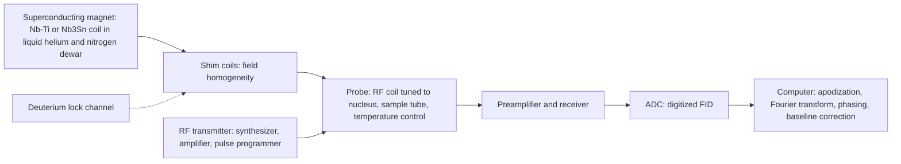
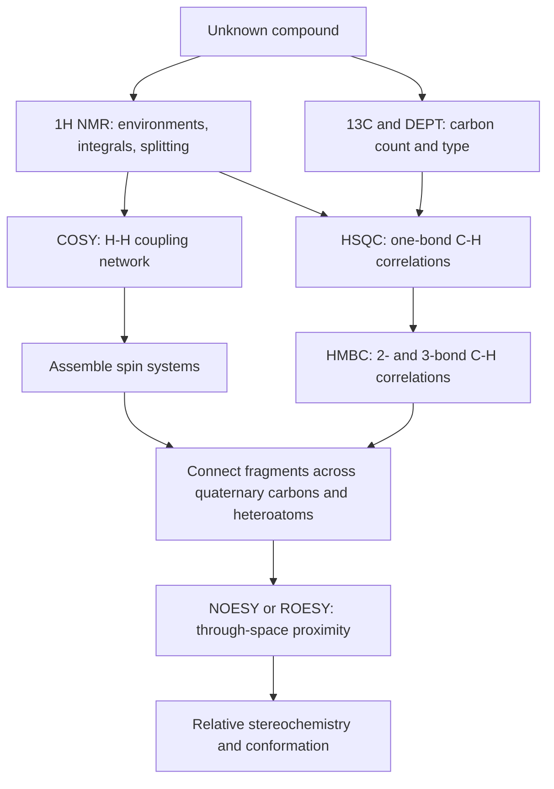

## Nuclear Magnetic Resonance Spectroscopy


### Overview

**Nuclear magnetic resonance (NMR) spectroscopy** exploits the magnetic properties of certain atomic nuclei. When placed in a strong static magnetic field, nuclei with non-zero spin absorb radiofrequency (RF) radiation at frequencies that depend sensitively on their **local electronic environment**. The resulting spectrum reports on how many distinct kinds of nuclei are present (number of signals), what their electronic environment is (**chemical shift**), how many nuclei give each signal (**integration**), and which nuclei are near one another through bonds (**spin–spin coupling**) or through space (**NOE**).

For organic structure determination, the two workhorse nuclei are **$^1H$** and **$^{13}C$**. NMR is the most information-rich single technique for establishing the carbon–hydrogen framework, stereochemistry, and connectivity of a molecule, and it complements IR (functional groups), UV–Vis (conjugation), and mass spectrometry (molecular formula).

**Key Points**

- Only nuclei with nonzero spin quantum number ($I \neq 0$) are NMR active: $^1H$, $^{13}C$, $^{19}F$, $^{31}P$, $^{15}N$, $^{2}H$, $^{29}Si$ and many others; $^{12}C$ and $^{16}O$ ($I = 0$) are silent.
- Resonance frequency is proportional to magnetic field strength: $\nu = \gamma B_0 / 2\pi$.
- Chemical shift ($\delta$, ppm) is **field-independent**; coupling constants ($J$, Hz) are also field-independent, while separation in Hz between signals scales with $B_0$.
- Signal **area** is proportional to the number of equivalent nuclei (in properly acquired $^1H$ spectra).
- Splitting follows the **$n + 1$ rule** for first-order coupling.

---

### Physical Principles

#### Nuclear Spin

A nucleus has spin quantum number $I$ determined by its nucleon composition:

| Protons | Neutrons | Spin $I$ | Examples |
| --- | --- | --- | --- |
| Even | Even | 0 | $^{12}C$, $^{16}O$, $^{32}S$ (NMR silent) |
| Odd | Even | Half-integer (1/2, 3/2, …) | $^1H$, $^{13}C$, $^{15}N$, $^{19}F$, $^{31}P$ (I = 1/2); $^{17}O$ (5/2) |
| Even | Odd | Half-integer | $^{13}C$ (1/2) |
| Odd | Odd | Integer (1, 2, …) | $^2H$ (1), $^{14}N$ (1), $^{10}B$ (3) |

Spin-1/2 nuclei have a spherical charge distribution and give sharp lines; nuclei with $I > 1/2$ have a **quadrupole moment** that interacts with electric-field gradients, generally broadening signals (e.g., $^{14}N$, $^{35}Cl$).

#### Zeeman Splitting

In a magnetic field $B_0$, a spin-$I$ nucleus has $2I + 1$ energy levels. For $I = 1/2$, two states arise: $m = +1/2$ (aligned with the field, lower energy, $\alpha$) and $m = -1/2$ (opposed, higher energy, $\beta$).

$$\Delta E = \gamma \hbar B_0 = h\nu_0 \quad\Rightarrow\quad \nu_0 = \frac{\gamma B_0}{2\pi}$$

where $\gamma$ is the **gyromagnetic ratio** (rad s$^{-1}$ T$^{-1}$), characteristic of each nuclide.

| Nucleus | Spin | Natural abundance | $\gamma$ ($10^7$ rad s$^{-1}$T$^{-1}$) | Relative sensitivity (equal number of nuclei) | Frequency at 9.4 T (MHz) |
| --- | --- | --- | --- | --- | --- |
| $^1H$ | 1/2 | 99.98% | 26.75 | 1.00 | 400 |
| $^2H$ | 1 | 0.015% | 4.11 | $9.65 \times 10^{-3}$ | 61.4 |
| $^{13}C$ | 1/2 | 1.1% | 6.73 | $1.59 \times 10^{-2}$ | 100.6 |
| $^{15}N$ | 1/2 | 0.37% | $-2.71$ | $1.04 \times 10^{-3}$ | 40.5 |
| $^{19}F$ | 1/2 | 100% | 25.18 | 0.83 | 376.5 |
| $^{31}P$ | 1/2 | 100% | 10.84 | $6.63 \times 10^{-2}$ | 162.0 |
| $^{29}Si$ | 1/2 | 4.7% | $-5.32$ | $7.8 \times 10^{-3}$ | 79.5 |

*Values rounded; sensitivity ordering is what matters for practical planning.* At 9.4 T (a "400 MHz" magnet), protons resonate at 400 MHz.

**Why $^{13}C$ is much less sensitive than $^1H$:** low natural abundance (1.1%) and smaller $\gamma$ (lower Larmor frequency and smaller population difference). Overall, $^{13}C$ is about **$1.8 \times 10^{-4}$** as sensitive as $^1H$ at natural abundance.

#### Populations and Sensitivity

The population difference between the two spin states follows a Boltzmann distribution:

$$\frac{N_\beta}{N_\alpha} = e^{-\Delta E / k_B T} \approx 1 - \frac{\gamma \hbar B_0}{k_B T}$$

At 9.4 T and 298 K, the excess in the lower state is only about **32 per million** spins; NMR is intrinsically insensitive relative to optical spectroscopy, which is why higher field strengths, cryoprobes, signal averaging, and hyperpolarization methods are valuable.

**Example 1: Larmor frequency**

For a 11.74 T magnet:

$$\nu_{^1H} = \frac{\gamma B_0}{2\pi} = \frac{(26.75 \times 10^7)(11.74)}{2\pi} \approx 500\ MHz$$


$$\nu_{^{13}C} = \frac{(6.73 \times 10^7)(11.74)}{2\pi} \approx 125.7\ MHz$$

#### Precession, Resonance, and the Vector Model

A nuclear magnetic moment precesses about $B_0$ at the **Larmor frequency**. Applying an RF field $B_1$ oscillating at the Larmor frequency perpendicular to $B_0$ tips the net magnetization $M_0$ away from the $z$-axis. In the rotating frame, $B_1$ appears static, and the magnetization rotates through a **flip angle**:

$$\theta = \gamma B_1 t_p$$

A $90^\circ$ pulse places the magnetization in the transverse plane, where it induces a signal in the receiver coil (the **free induction decay, FID**).

#### Relaxation

After excitation, the system returns to equilibrium through two processes:

| Relaxation | Symbol | Meaning | Typical values ($^1H$ in small molecules) |
| --- | --- | --- | --- |
| **Spin–lattice (longitudinal)** | $T_1$ | Recovery of $M_z$ to equilibrium by energy exchange with the surroundings | 0.5–10 s (up to tens of seconds for quaternary $^{13}C$) |
| **Spin–spin (transverse)** | $T_2$ | Decay of coherence in the $xy$-plane | 0.1–10 s (shorter for large or viscous molecules) |

Linewidth relates to $T_2^*$:

$$\Delta\nu_{1/2} = \frac{1}{\pi T_2^*}$$

**Practical implication:** between scans, wait at least about $5\,T_1$ for full recovery when quantitative integration is required; using shorter delays or smaller flip angles trades accuracy for speed.

#### Continuous-Wave versus Fourier Transform NMR

Modern spectrometers use **pulsed Fourier-transform NMR**: a short, intense RF pulse excites all resonances simultaneously, the FID is digitized, and a Fourier transform converts the time-domain signal to a frequency-domain spectrum. Signal averaging of $n$ scans improves the signal-to-noise ratio by $\sqrt{n}$.

---

### Instrumentation



| Component | Function |
| --- | --- |
| **Superconducting magnet** | Provides $B_0$ (typically 7.0–23.5 T, i.e., 300–1000 MHz for $^1H$); bench-top permanent-magnet instruments run at ~1–2 T (40–90 MHz) |
| **Shim coils** | Adjust field homogeneity to a few parts per billion across the sample |
| **Deuterium lock** | Continuously monitors the $^2H$ signal of the deuterated solvent to correct field drift |
| **Probe** | Holds the sample; contains RF transmit/receive coils; cryoprobes cool the coil and preamplifier to ~20 K, increasing sensitivity by a factor of ~3–4 |
| **Sample spinning (optional)** | Averages residual field inhomogeneity across the sample tube |
| **Sample tube** | 5 mm outer-diameter thin-walled glass tube (0.5–0.7 mL solution); smaller tubes or microcoils for limited material |
| **Safety** | Strong magnetic fringe fields affect pacemakers, magnetic media, and ferromagnetic objects; cryogens (liquid He, $N_2$) carry asphyxiation and cold-burn hazards |

#### Sample Preparation

- **Deuterated solvents** ($CDCl_3$, $DMSO\text{-}d_6$, $D_2O$, $CD_3OD$, $C_6D_6$, acetone-$d_6$, $CD_3CN$) supply the lock signal and avoid overwhelming solvent proton signals; each has a small residual protonated signal (see table below).
- Typical quantities: 1–10 mg for $^1H$; 10–50 mg (or more) for $^{13}C$ of small molecules.
- Filter suspended solids and remove paramagnetic impurities (which broaden lines).
- Add a reference standard if necessary: **tetramethylsilane (TMS, $Si(CH_3)_4$)** for organic solvents; **DSS or TSP** for $D_2O$.

**Residual solvent signals (approximate)**

| Solvent | $^1H$ residual ($\delta$, multiplicity) | $^{13}C$ ($\delta$) | Water peak ($\delta$) |
| --- | --- | --- | --- |
| $CDCl_3$ | 7.26 (singlet) | 77.16 (triplet) | ~1.56 |
| $DMSO\text{-}d_6$ | 2.50 (quintet) | 39.52 (septet) | ~3.33 |
| $D_2O$ | 4.79 (HOD) | — | 4.79 |
| $CD_3OD$ | 3.31 (quintet), 4.87 (OH) | 49.00 | ~4.87 |
| Acetone-$d_6$ | 2.05 (quintet) | 29.84, 206.26 | ~2.84 |
| $C_6D_6$ | 7.16 | 128.06 | ~0.40 |
| $CD_3CN$ | 1.94 (quintet) | 1.32, 118.26 | ~2.13 |

*Water and residual shifts depend on temperature, concentration, and hydrogen-bonding.*

---

### Chemical Shift

#### Definition and Referencing

Electrons around a nucleus circulate in response to $B_0$, generating a small opposing field that **shields** the nucleus. The effective field is:

$$B_{eff} = B_0 (1 - \sigma)$$

where $\sigma$ is the **shielding constant**. Nuclei in different environments have different $\sigma$ and thus different resonance frequencies. To make positions independent of the spectrometer frequency, shifts are reported relative to a reference (TMS = 0):

$$\delta\ (\text{ppm}) = \frac{\nu_{sample} - \nu_{ref}}{\nu_{spectrometer}} \times 10^6$$

- **Downfield** (higher $\delta$, left): **deshielded** nuclei.
- **Upfield** (lower $\delta$, right): **shielded** nuclei.

TMS is used because it is chemically inert, volatile (easily removed), gives a single sharp signal (12 equivalent H; 4 equivalent C), and resonates at high field (more shielded than almost all organic protons or carbons).

**Example 2: Converting Hz to ppm**

A signal appears 1460 Hz downfield of TMS on a 200 MHz spectrometer:

$$\delta = \frac{1460\ Hz}{200 \times 10^6\ Hz} \times 10^6 = 7.30\ ppm$$

On a 500 MHz instrument the same signal appears at $7.30 \times 500 = 3650$ Hz from TMS, but its $\delta$ value is unchanged.

#### Factors Influencing Chemical Shift

| Factor | Effect | Example |
| --- | --- | --- |
| **Inductive effect** (electronegativity) | Electronegative substituents withdraw electron density, deshielding nearby nuclei | $\delta$ of $CH_3X$ protons: $X = H$: 0.23; $X = I$: 2.16; $Br$: 2.68; $Cl$: 3.05; $F$: 4.26 |
| **Hybridization / diamagnetic anisotropy** | $\pi$ electrons generate induced fields that shield or deshield depending on orientation | Aromatic protons (~7 ppm), alkene (~5–6), alkyne (~2.5), aldehyde (~9–10) |
| **Ring current** | Aromatic ring circulation generates a field that reinforces $B_0$ at the periphery (deshielding) and opposes it above/below the ring (shielding) | Benzene H at 7.27; [18]annulene inner H at $-3$ ppm, outer H at ~9 ppm |
| **Hydrogen bonding** | Lowers electron density at the proton; downfield shifts | Alcohol OH at ~1–5 ppm (concentration-dependent), carboxylic acid at ~10–13 |
| **Solvent** | Polarity, aromatic solvent-induced shifts (ASIS in $C_6D_6$), H-bond acceptor solvents | OH signals shift dramatically in $DMSO\text{-}d_6$ |
| **Temperature and concentration** | Affect exchangeable protons and conformational averaging |  |
| **Steric compression** (van der Waals deshielding) | Close contacts deshield $^1H$ |  |
| **$\gamma$-gauche effect** | Upfield shift of $^{13}C$ due to gauche interaction | Axial substituent carbons on cyclohexane |

#### Diamagnetic Anisotropy (svg_diagram)

<svg xmlns="http://www.w3.org/2000/svg" viewBox="0 0 700 300" width="700" height="300" font-family="Arial, sans-serif">
<title>Ring Current and Anisotropy Regions (svg_diagram)</title>
<text x="350" y="24" text-anchor="middle" font-size="16" font-weight="bold">Ring Current and Anisotropy Regions (svg_diagram)</text>

<polygon points="350,110 395,135 395,185 350,210 305,185 305,135" fill="#d6eaf8" stroke="#2471a3" stroke-width="2" />
<circle cx="350" cy="160" r="28" fill="none" stroke="#2471a3" stroke-width="1.5" stroke-dasharray="4,3" />

<text x="350" y="100" text-anchor="middle" font-size="13">H</text>
<text x="410" y="132" text-anchor="middle" font-size="13">H</text>
<text x="410" y="195" text-anchor="middle" font-size="13">H</text>
<text x="350" y="228" text-anchor="middle" font-size="13">H</text>
<text x="290" y="195" text-anchor="middle" font-size="13">H</text>
<text x="290" y="132" text-anchor="middle" font-size="13">H</text>

<ellipse cx="455" cy="160" rx="45" ry="22" fill="#fadbd8" stroke="#c0392b" stroke-dasharray="4,3" />
<text x="455" y="164" text-anchor="middle" font-size="11" fill="#c0392b">deshielded (+)</text>
<ellipse cx="245" cy="160" rx="45" ry="22" fill="#fadbd8" stroke="#c0392b" stroke-dasharray="4,3" />
<text x="245" y="164" text-anchor="middle" font-size="11" fill="#c0392b">deshielded (+)</text>

<ellipse cx="350" cy="62" rx="55" ry="18" fill="#d5f5e3" stroke="#1e8449" stroke-dasharray="4,3" />
<text x="350" y="66" text-anchor="middle" font-size="11" fill="#1e8449">shielded (−)</text>
<ellipse cx="350" cy="262" rx="55" ry="18" fill="#d5f5e3" stroke="#1e8449" stroke-dasharray="4,3" />
<text x="350" y="266" text-anchor="middle" font-size="11" fill="#1e8449">shielded (−)</text>
<text x="350" y="48" text-anchor="middle" font-size="11">B₀ applied perpendicular to ring plane</text>
</svg>

---

### $^1H$ NMR Spectroscopy

#### The Four Pieces of Information

1. **Number of signals:** number of chemically distinct ("nonequivalent") proton environments.
2. **Chemical shift:** electronic environment (functional group).
3. **Integration:** relative number of protons per signal.
4. **Splitting (multiplicity):** number of neighboring protons (through-bond coupling).

#### Chemical and Magnetic Equivalence

| Type | Definition | Test |
| --- | --- | --- |
| **Homotopic** | Exchange by a symmetry operation ($C_n$ axis); equivalent in all environments | Substituting each in turn gives identical compounds |
| **Enantiotopic** | Related by a mirror plane or inversion center; equivalent in achiral solvents | Substitution gives enantiomers; nonequivalent in a chiral environment |
| **Diastereotopic** | Not related by symmetry; e.g., $CH_2$ protons next to a stereocenter | Substitution gives diastereomers; **different shifts** and couple to each other (AB or ABX patterns) |
| **Chemically equivalent** | Interconvert by rapid rotation or exchange | E.g., $CH_3$ protons |

**Diastereotopic protons** are common pitfalls: the two protons of a $CH_2$ group adjacent to a chiral center are generally nonequivalent and appear as separate (often complex) signals with geminal coupling.

#### Typical $^1H$ Chemical Shifts

| Proton type | $\delta$ (ppm) |
| --- | --- |
| Alkyl $CH_3$ | 0.8–1.0 |
| Alkyl $CH_2$ | 1.2–1.4 |
| Alkyl $CH$ | 1.4–1.7 |
| Allylic ($C{=}C{-}CH$) | 1.6–2.2 |
| Alpha to carbonyl ($O{=}C{-}CH$) | 2.0–2.7 |
| Benzylic ($Ar{-}CH$) | 2.2–3.0 |
| Alkyne ($C{\equiv}C{-}H$) | 2.0–3.0 |
| $R{-}C{\equiv}C{-}CH$ (propargylic) | ~2.1–2.5 |
| Alkyl halide $CH{-}X$: I | 2.0–4.0 |
| Alkyl halide: Br | 2.7–4.1 |
| Alkyl halide: Cl | 3.1–4.1 |
| Amine $N{-}CH$ | 2.2–2.9 |
| Ether/alcohol $O{-}CH$ | 3.3–4.0 |
| Ester $O{-}CH$ ($RCOO{-}CH$) | 4.0–4.4 |
| Alkene ($C{=}C{-}H$, vinylic) | 4.6–5.9 |
| Aromatic (Ar–H) | 6.5–8.5 |
| Aldehyde ($CHO$) | 9.0–10.0 |
| Carboxylic acid ($COOH$) | 10–13 |
| Alcohol $OH$ | 0.5–5.5 (variable) |
| Phenol $OH$ | 4–8 (variable), up to ~12 when intramolecularly H-bonded |
| Amine $NH$ | 0.5–5.0 (variable) |
| Amide $NH$ | 5.0–9.0 |
| Enol OH ($\beta$-diketone) | 12–16 |

**Substituent additivity (Shoolery-type rules)** estimate the shift of a methylene or methine proton:

$$\delta \approx 0.23 + \sum \sigma_i \quad (\text{for } CH_2 X Y)$$

with substituent constants (approximate) such as $Ph\ (1.85)$, $OR\ (2.36)$, $Cl\ (2.53)$, $C{=}O\ (1.70)$, $C{=}C\ (1.32)$.

**Example 3: Shoolery estimate for $ClCH_2OCH_3$'s $CH_2$**

$$\delta \approx 0.23 + 2.53\ (Cl) + 2.36\ (OR) = 5.12\ ppm$$

Observed ~5.4 ppm (adequate for prediction).

#### Integration

The area under each signal is proportional to the number of protons it represents (for a fully relaxed spectrum). Relative integrals are converted to whole-number ratios; combined with the molecular formula, they reveal the number of H per signal.

**Example 4:** A compound $C_8H_{10}O$ shows signals with integrals 5 : 2 : 2 : 1 (aromatic 5H at 7.3, $CH_2$ 2H at 3.85, $CH_2$ 2H at 2.85, OH 1H at 1.9). Total = 10 H (consistent). This pattern corresponds to 2-phenylethanol.

#### Spin–Spin Coupling

Nuclei couple through bonding electrons (indirect dipole–dipole, **scalar coupling**, $J$). The signal of a proton is split by neighboring protons that are **nonequivalent** to it and within about 2–3 bonds.

**The $n + 1$ rule:** a proton with $n$ equivalent neighboring protons appears as a multiplet with $n + 1$ lines, with intensities given by **Pascal's triangle**:

| Neighbors ($n$) | Multiplet | Name | Relative intensities |
| --- | --- | --- | --- |
| 0 | 1 | Singlet (s) | 1 |
| 1 | 2 | Doublet (d) | 1 : 1 |
| 2 | 3 | Triplet (t) | 1 : 2 : 1 |
| 3 | 4 | Quartet (q) | 1 : 3 : 3 : 1 |
| 4 | 5 | Quintet | 1 : 4 : 6 : 4 : 1 |
| 5 | 6 | Sextet | 1 : 5 : 10 : 10 : 5 : 1 |
| 6 | 7 | Septet | 1 : 6 : 15 : 20 : 15 : 6 : 1 |

Other descriptors: **m** (multiplet, unresolved), **dd** (doublet of doublets), **dt** (doublet of triplets), **br** (broad), **app** (apparent).

**Key rules**

- Equivalent protons do not split each other (e.g., the three H of a $CH_3$ appear as a singlet unless neighbors exist).
- **The coupling constant $J$ is the same for coupled partners** (reciprocity); it is measured in **Hz** and is independent of $B_0$.
- Exchangeable protons (OH, NH, COOH) normally show no coupling in $CDCl_3$ or protic solvents because of rapid exchange; in dry $DMSO\text{-}d_6$, coupling can be observed.
- When a proton couples to two or more different sets of neighbors with different $J$ values, a **tree diagram** resolves the pattern (e.g., a doublet of triplets).

**Typical coupling constants**

| Coupling type | Structural relation | $J$ (Hz) |
| --- | --- | --- |
| **Geminal** ($^2J_{HH}$) | $H{-}C{-}H$ on the same $sp^3$ carbon | 10–18 (magnitude; typically $-12$) |
| Geminal (alkene, $=CH_2$) |  | 0–3 |
| **Vicinal** ($^3J_{HH}$), free rotation ($sp^3$–$sp^3$) | $H{-}C{-}C{-}H$ | 6–8 (averaged; ~7) |
| Vicinal, cyclohexane axial–axial | Dihedral ~180° | 8–13 |
| Vicinal, cyclohexane axial–equatorial or eq–eq | Dihedral ~60° | 2–5 |
| Vinyl, *trans* | $H{-}C{=}C{-}H$ | 11–18 (typically ~15) |
| Vinyl, *cis* |  | 6–12 (typically ~10) |
| Aromatic, *ortho* |  | 6–10 |
| Aromatic, *meta* |  | 1–3 |
| Aromatic, *para* |  | 0–1 |
| Allylic (long-range, 4-bond) | $H{-}C{=}C{-}C{-}H$ | 0–3 |
| Aldehyde $H{-}C{-}CHO$ |  | 1–3 |
| $^1J_{CH}$ ($sp^3$) |  | ~125 |
| $^1J_{CH}$ ($sp^2$) |  | ~160 |
| $^1J_{CH}$ ($sp$) |  | ~250 |

#### The Karplus Relationship

Vicinal coupling depends on the **dihedral angle** $\phi$ between the two C–H bonds:

$$^3J_{HH}(\phi) = A\cos^2\phi + B\cos\phi + C$$

with typical parameters $A \approx 7$–8 Hz, $B \approx -1$ Hz, $C \approx 5$ Hz. $J$ is maximal near $\phi = 180^\circ$ (~12–13 Hz) and $0^\circ$ (~8–10 Hz) and minimal near $90^\circ$ (~0–2 Hz). This enables determination of **conformation and relative stereochemistry** (e.g., axial versus equatorial substituents in cyclohexanes; sugar ring configuration).

#### First-Order versus Second-Order Spectra

Splitting patterns follow simple rules when the shift difference between coupled protons is large compared with $J$:

$$\frac{\Delta\nu\ (Hz)}{J\ (Hz)} \gtrsim 10 \quad \Rightarrow \quad \text{first-order (AX, AMX, A}_2\text{X}_3, \ldots)$$

When $\Delta\nu/J$ is small, second-order effects appear: intensities distort ("roofing," with inner lines of coupled multiplets taller than outer lines), and extra lines and complex patterns arise (AB, ABX, AA'BB'). **Roofing** points toward the coupling partner. Using a higher-field spectrometer increases $\Delta\nu$ (in Hz) but not $J$, simplifying spectra.

Spin-system notation: letters far apart in the alphabet (A, X) denote large shift difference; adjacent letters (A, B) denote small; a prime distinguishes chemically equivalent but magnetically inequivalent nuclei (AA'BB' in *para*-disubstituted benzenes).

#### Classic Splitting Patterns

| Fragment | Pattern |
| --- | --- |
| Ethyl ($CH_3CH_2{-}X$) | $CH_3$ triplet (~1.0–1.3, 3H), $CH_2$ quartet (~2.3–4.4, 2H) |
| Isopropyl ($(CH_3)_2CH{-}X$) | Doublet (6H) + septet (1H) |
| *tert*-Butyl | Singlet (9H, ~1.0–1.3) |
| *n*-Propyl ($CH_3CH_2CH_2{-}X$) | Triplet (3H), sextet (2H), triplet (2H) |
| Methoxy / acetyl / methyl on aromatic | Singlets (3H) at ~3.3–3.9 ($OCH_3$), ~2.1–2.6 ($COCH_3$), ~2.3 ($ArCH_3$) |
| Monosubstituted benzene | Complex multiplet (5H, 7.1–7.4) |
| *para*-Disubstituted benzene | Two doublets (AA'BB', each 2H) |
| Vinyl ($-CH{=}CH_2$) | ABC/ABX pattern: dd (~5.0, 5.2, 5.8) |

#### Exchangeable Protons and the $D_2O$ Shake

Adding a drop of $D_2O$ to the sample tube exchanges labile protons (OH, NH, COOH, SH) for deuterium, causing their signals to **disappear** (or diminish) in the $^1H$ spectrum. This is a reliable test for such protons.

$$R{-}OH + D_2O \rightleftharpoons R{-}OD + HOD$$

#### Dynamic Effects

Processes on the NMR timescale (rotation about the C–N bond in amides, ring inversion, proton exchange) produce **line broadening** or coalescence. At the **coalescence temperature** $T_c$, two exchanging signals merge:

$$k_c = \frac{\pi \Delta\nu}{\sqrt{2}} \approx 2.22\,\Delta\nu$$


$$\Delta G^\ddagger = R\,T_c\left[22.96 + \ln\frac{T_c}{\Delta\nu}\right]\ (\text{J/mol})$$

(with $\Delta\nu$ in Hz, $T_c$ in K), an approximation used for slow-exchange barriers such as amide rotation (~15–20 kcal/mol) and cyclohexane ring flip (~10 kcal/mol; $T_c \approx -60\,^\circ C$ for cyclohexane-$d_{11}$).

---

### $^{13}C$ NMR Spectroscopy

#### Distinctive Features

| Feature | $^1H$ NMR | $^{13}C$ NMR |
| --- | --- | --- |
| Natural abundance | ~100% | 1.1% |
| Chemical-shift range | ~0–14 ppm | ~0–220 ppm |
| Sensitivity | High | Low (many scans; often longer acquisitions) |
| Integration | Reliable | Not reliable in routine spectra (NOE, differing $T_1$) |
| Coupling appearance | $^1H{-}^1H$ splitting common | Routine spectra are **proton-decoupled**: each unique carbon gives a singlet |
| $^{13}C{-}^{13}C$ coupling | — | Not observed (low abundance: probability of adjacent $^{13}C$ pair ~0.01%) |
| Signal count | Environments of H | Environments of C (symmetry) |

**Proton decoupling** irradiates all $^1H$ frequencies (broadband decoupling), collapsing $^{13}C{-}{^1H}$ splitting into singlets and, through the **nuclear Overhauser effect (NOE)**, enhancing $^{13}C$ signals (up to ~3× for protonated carbons). Carbons without attached H (quaternary, C=O, nitrile) are weaker because they lack NOE enhancement and relax slowly.

#### Typical $^{13}C$ Chemical Shifts

| Carbon type | $\delta$ (ppm) |
| --- | --- |
| Alkyl $CH_3$, $CH_2$, $CH$, $C$ | 5–50 |
| Carbon bonded to N ($C{-}N$) | 30–65 |
| Carbon bonded to halogen (Cl: 25–50; Br: 20–40; I: $-10$ to 40) | Variable |
| $C{-}O$ (alcohol, ether) | 50–90 |
| Alkyne ($C{\equiv}C$) | 65–95 |
| Alkene ($C{=}C$) | 100–150 |
| Aromatic carbons | 110–160 |
| Nitrile ($C{\equiv}N$) | 110–125 |
| Carboxylic acid / ester / amide $C{=}O$ | 160–185 |
| Aldehyde / ketone $C{=}O$ | 190–220 |

The **shift range ($\sim$220 ppm) is large enough that nearly every nonequivalent carbon gives a separate line**, making $^{13}C$ NMR ideal for counting nonequivalent carbons and detecting symmetry.

**Carbonyl trends:** ketones and aldehydes (~190–220) are far downfield of acids, esters, and amides (~160–185); conjugation moves the carbonyl carbon upfield by ~5–10 ppm.

**Example 5: Counting $^{13}C$ signals**

| Compound | Distinct carbons |
| --- | --- |
| Benzene | 1 |
| Toluene | 5 (CH$_3$, C-ipso, C-ortho, C-meta, C-para) |
| *o*-Xylene | 4 |
| *m*-Xylene | 5 |
| *p*-Xylene | 3 |
| Mesitylene (1,3,5-trimethylbenzene) | 3 |
| 2-Methylbutane | 4 |
| Cyclohexane | 1 |

#### Editing Sequences: DEPT and APT

**DEPT (Distortionless Enhancement by Polarization Transfer)** distinguishes carbons by the number of attached protons:

| DEPT experiment | $CH_3$ | $CH_2$ | $CH$ | Quaternary C |
| --- | --- | --- | --- | --- |
| Broadband decoupled $^{13}C$ | Positive | Positive | Positive | Positive (weak) |
| DEPT-45 | Positive | Positive | Positive | Absent |
| **DEPT-90** | Absent | Absent | **Positive** | Absent |
| **DEPT-135** | **Positive** | **Negative** | **Positive** | Absent |

Combining the standard $^{13}C$, DEPT-90, and DEPT-135 spectra assigns each carbon as C, CH, $CH_2$, or $CH_3$.

**APT (Attached Proton Test)** gives a single spectrum in which $CH$ and $CH_3$ carbons have opposite phase from $CH_2$ and quaternary C.

---

### Two-Dimensional and Advanced Techniques



| Technique | Correlation | Information |
| --- | --- | --- |
| **COSY** (Correlation Spectroscopy) | $^1H{-}^1H$ through 2–3 bonds | Shows which protons are coupled; traces spin systems |
| **TOCSY** | $^1H{-}^1H$ within an entire spin system | Identifies all protons of a coupled network (amino-acid residues, sugars) |
| **HSQC / HMQC** | $^1H{-}^{13}C$ one-bond | Assigns each carbon to its attached proton(s); phase-sensitive HSQC can also edit $CH/CH_3$ versus $CH_2$ |
| **HMBC** | $^1H{-}^{13}C$ two- and three-bond (long-range) | Connects fragments through quaternary carbons and heteroatoms |
| **NOESY / ROESY** | Through-space ($< \sim 5$ Å) via NOE | Relative stereochemistry, conformation, proximity |
| **INADEQUATE** | $^{13}C{-}^{13}C$ | Carbon skeleton directly (very insensitive; requires concentrated samples) |
| **DOSY** | Diffusion | Separates mixture components by molecular size |
| **$^{19}F$, $^{31}P$, $^{15}N$ NMR** | Heteronuclear observation | Fluorinated compounds, phosphorus compounds and nucleotides, nitrogen heterocycles (with indirect detection, HMBC-$^{15}N$) |
| **Solid-state NMR (MAS, CP)** | Anisotropic interactions averaged by magic-angle spinning | Polymers, crystalline forms, materials, membrane proteins |
| **Variable-temperature NMR** | Exchange processes | Barriers to rotation, tautomerism, ring inversion |

#### Nuclear Overhauser Effect (NOE)

Irradiating one proton transfers magnetization to spatially close protons (distance $r$) through dipolar relaxation, changing their intensity by an amount proportional to $r^{-6}$. This makes NOE a sensitive probe of **internuclear distances up to ~5 Å**, decisive for stereochemical assignments (e.g., *cis* versus *trans* ring fusions, alkene geometry, protein tertiary structure).

**Key Points**

- NOE is a through-space effect; scalar coupling ($J$) is a through-bond effect.
- For medium-sized molecules with a correlation time near $1/\omega_0$, the NOE crosses zero; ROESY is used instead.

---

### Systematic Structure Elucidation

#### Recommended Workflow

1. **Molecular formula** (from high-resolution MS, elemental analysis) and **degrees of unsaturation**:

$$\text{DoU} = \frac{2C + 2 + N - H - X}{2}$$

2. **IR:** identify key functional groups (C=O, O–H, N–H, C≡N, C=C, aromatic).
3. **$^{13}C$ NMR + DEPT:** number of unique carbons; types (C, CH, $CH_2$, $CH_3$); carbonyl and aromatic/alkene carbons.
4. **$^1H$ NMR:** shift, integration, multiplicity for each signal; exchangeable H (via $D_2O$).
5. **2D NMR** (COSY, HSQC, HMBC, NOESY) for complex molecules: assemble fragments and relative stereochemistry.
6. **Propose structure(s),** predict the spectra, and check consistency with all data (including MS fragmentation, UV).

#### Worked Problems

**Problem 1: Assign the structure of $C_4H_8O_2$**

| Data | Interpretation |
| --- | --- |
| DoU = 1 | One ring or double bond |
| IR 1740 cm$^{-1}$, no O–H | Ester |
| $^1H$: 4.12 (q, 2H), 2.05 (s, 3H), 1.26 (t, 3H) | Ethyl group on an O ($OCH_2CH_3$; q + t), acetyl methyl (s at 2.05) |
| $^{13}C$: 171 (C=O), 60 ($OCH_2$), 21 ($CH_3C{=}O$), 14 ($CH_3$) | Consistent |

**Conclusion:** ethyl acetate, $CH_3COOCH_2CH_3$.

**Problem 2: Assign the structure of $C_9H_{10}O$**

| Data | Interpretation |
| --- | --- |
| DoU = 5 | Aromatic ring (4) + one C=O or C=C |
| IR 1685 cm$^{-1}$ | Conjugated ketone (aryl ketone) |
| $^1H$: 7.95 (d, 2H), 7.55 (t, 1H), 7.45 (t, 2H), 2.99 (q, 2H), 1.22 (t, 3H) | Monosubstituted benzene bearing C=O; ethyl group ($CH_2$ q at 2.99 α to C=O, $CH_3$ t at 1.22) |
| $^{13}C$: 200.5, 137, 133, 128.6, 128.0, 31.8, 8.3 | Ketone C=O (~200), 4 aromatic signals, $CH_2$, $CH_3$ |

**Conclusion:** propiophenone (1-phenylpropan-1-one), $C_6H_5COCH_2CH_3$.

**Problem 3: Distinguishing isomers by $^{13}C$ count**

Three isomers of dichlorobenzene: *ortho* (3 $^{13}C$ signals), *meta* (4 signals), *para* (2 signals). The number of signals immediately identifies the isomer.

**Problem 4: Coupling analysis of a vinyl group**

A three-proton pattern showing $J = 17$ Hz, $J = 10$ Hz, and $J = 2$ Hz identifies a monosubstituted alkene $R{-}CH{=}CH_2$: $J_{trans} \approx 17$, $J_{cis} \approx 10$, $J_{gem} \approx 2$ Hz.

**Problem 5: Alkene stereochemistry**

For a 1,2-disubstituted alkene, vicinal $J = 15.8$ Hz indicates *E* (*trans*); $J = 10.5$ Hz indicates *Z* (*cis*).

**Problem 6: Cyclohexane axial versus equatorial**

A proton appearing as a triplet of triplets with large couplings ($J \approx 11$ Hz, two) and smaller ones ($J \approx 4$ Hz, two) is **axial** (two large axial–axial couplings and two small axial–equatorial couplings), indicating an equatorial substituent at that carbon.

**Problem 7: Number of signals and integration**

Predict the $^1H$ NMR of *tert*-butyl acetate, $CH_3COOC(CH_3)_3$: two singlets, 3H (~2.0, $CH_3CO$) and 9H (~1.45, $C(CH_3)_3$).

**Problem 8: Spin-system analysis**

1-Bromopropane ($CH_3CH_2CH_2Br$): $CH_3$ triplet (~1.03), central $CH_2$ sextet (~1.85), $CH_2Br$ triplet (~3.39), integrals 3:2:2.

---

### Quantitative NMR (qNMR)

Because signal area is directly proportional to the number of nuclei, NMR can be a primary quantitative method:

$$\frac{n_x}{n_{std}} = \frac{I_x}{I_{std}} \times \frac{N_{std}}{N_x}$$

where $I$ is integral area and $N$ the number of nuclei contributing to the integrated signal. Requirements: complete relaxation (recycle delay $\ge 5\,T_1$ of the slowest-relaxing nucleus), uniform excitation (calibrated pulse, adequate spectral width), sufficient signal-to-noise (>250:1 for 1% uncertainty), good phasing and baseline, and a certified internal standard (e.g., maleic acid, dimethyl sulfone, 1,4-BTMSB) with non-overlapping signals. qNMR is used for purity determination of pharmaceuticals and reference materials.

---

### Data Processing and Spectral Quality

| Step | Purpose |
| --- | --- |
| **Apodization** (window function, e.g., exponential line broadening 0.3–1 Hz for $^1H$; 1–3 Hz for $^{13}C$) | Improves S/N at the cost of resolution (or vice versa with resolution enhancement) |
| **Zero filling** | Increases digital resolution of the transformed spectrum |
| **Fourier transform** | Time domain (FID) to frequency domain |
| **Phase correction** (zero- and first-order) | Produces pure absorption line shapes |
| **Baseline correction** | Removes rolling baselines that distort integrals |
| **Referencing** | Set TMS (or residual solvent peak) to its known $\delta$ |
| **Peak picking and integration** | Extract shifts, multiplicities, and areas |

Common artifacts include spinning sidebands, poor shimming (broad or asymmetric lines), $^{13}C$ satellites (0.55% on each side of a proton signal from $^1H{-}^{13}C$ coupling), solvent suppression residues, and truncation wiggles.

**Reporting format (typical organic-chemistry convention):**

$^1H$ NMR (400 MHz, $CDCl_3$) $\delta$ 7.26 (d, $J$ = 8.4 Hz, 2H), 3.82 (s, 3H), 2.41 (q, $J$ = 7.6 Hz, 2H), 1.14 (t, $J$ = 7.6 Hz, 3H).

---

### Computational Aid: Multiplet Simulator and Shift Estimator

The following Python sketch generates first-order multiplet line positions and intensities from Pascal's triangle, converts Hz to ppm, and gives a rough lookup of shift ranges. It is a first-order teaching model that ignores second-order effects, and real spectra should be interpreted with dedicated software.

```python
from math import comb

def multiplet(delta_ppm, J_hz, n, spectrometer_mhz):
    """First-order multiplet from n equivalent neighbors with one coupling J.
    Returns (ppm positions, relative intensities)."""
    lines = n + 1
    center_hz = delta_ppm * spectrometer_mhz          # ppm * MHz = Hz
    positions_hz = [center_hz + (i - n / 2) * J_hz for i in range(lines)]
    intensities = [comb(n, i) for i in range(lines)]
    positions_ppm = [p / spectrometer_mhz for p in positions_hz]
    return positions_ppm, intensities

names = {0: "singlet", 1: "doublet", 2: "triplet", 3: "quartet",
         4: "quintet", 5: "sextet", 6: "septet"}

# Ethyl group in ethyl acetate at 400 MHz
for label, d, n in (("OCH2 (quartet)", 4.12, 3), ("CH3 (triplet)", 1.26, 2)):
    pos, inten = multiplet(d, 7.1, n, 400)
    print(f"{label}: {names[n]}")
    for p, i in zip(pos, inten):
        print(f"   {p:6.3f} ppm   intensity {i}")

# Hz <-> ppm conversion
def hz_to_ppm(hz, spectrometer_mhz):
    return hz / spectrometer_mhz

print("1460 Hz at 200 MHz =", hz_to_ppm(1460, 200), "ppm")
print("J = 7.1 Hz at 400 MHz spans", round(hz_to_ppm(7.1, 400), 4), "ppm")
print("J = 7.1 Hz at 800 MHz spans", round(hz_to_ppm(7.1, 800), 4), "ppm")
```

**Output** (abridged)



```
OCH2 (quartet): quartet
    4.103 ppm   intensity 1
    4.120 ppm   intensity 3
    4.138 ppm   intensity 3
    4.155 ppm   intensity 1
CH3 (triplet): triplet
    1.242 ppm   intensity 1
    1.260 ppm   intensity 2
    1.278 ppm   intensity 1
1460 Hz at 200 MHz = 7.3 ppm
J = 7.1 Hz at 400 MHz spans 0.0178 ppm
J = 7.1 Hz at 800 MHz spans 0.0089 ppm
```

*Note that the line spacing in ppm shrinks as the field increases (the same $J$ in Hz occupies fewer ppm), which is why multiplets resolve better on higher-field instruments.*

---

### Applications

| Area | Use |
| --- | --- |
| Organic and organometallic synthesis | Routine confirmation of structure and purity; reaction monitoring |
| Natural products | Full structure and stereochemistry determination by 2D NMR |
| Biomolecular NMR | Protein and nucleic-acid structure, dynamics, and ligand binding (isotopic $^{13}C$/$^{15}N$ labeling; HSQC, NOESY, TROSY) |
| Pharmaceutical analysis | Purity by qNMR, polymorph identification by solid-state NMR, fragment-based drug screening |
| Materials and polymers | Composition, tacticity, end groups, molecular weight, solid-state structure |
| Metabolomics and food analysis | Untargeted profiling of complex mixtures |
| Medical imaging (MRI) | Proton NMR imaging of water and fat distribution in tissue |
| Physical chemistry | Kinetics, exchange rates, diffusion, hydrogen bonding, acid–base equilibria |
| Petroleum and geochemistry | Hydrocarbon composition, well-logging |

---

### Limitations

| Limitation | Consequence |
| --- | --- |
| Low intrinsic sensitivity | Requires milligram quantities (microgram with cryoprobes) and long acquisitions for $^{13}C$, $^{15}N$ |
| Signal overlap in complex molecules | Needs 2D/3D methods or higher field |
| Second-order and dynamic effects | Complicate interpretation; may require simulation and variable temperature |
| Paramagnetic species | Broaden or shift signals; can render spectra uninformative |
| Solvent and exchange dependence of OH/NH shifts | Assignments must be verified by $D_2O$ exchange or solvent change |
| Cost and infrastructure | Superconducting magnets, cryogens, and expertise |
| Absolute stereochemistry | Not directly determined; needs chiral solvating/derivatizing agents (Mosher's method), X-ray, or chiroptical methods |

---

### Common Pitfalls

**Key Points**

- Forgetting that **equivalent protons do not split each other** and that **OH/NH protons often appear as broad singlets without coupling**.
- Missing **diastereotopic** protons adjacent to a stereocenter, which are nonequivalent and can look like an unexpected multiplet.
- Assuming that peak **integration in routine $^{13}C$ spectra** reflects the number of carbons (it does not).
- Applying the **$n + 1$ rule to second-order spectra** (e.g., closely spaced, strongly coupled protons in AB systems).
- Reporting multiplet **$J$ values in ppm** rather than Hz, or believing $J$ changes with field strength (it does not).
- Overlooking **residual solvent, water, grease, or $^{13}C$ satellite** signals when counting peaks.
- Confusing **chemical equivalence with magnetic equivalence** (as in AA'BB' patterns).
- Neglecting to allow **adequate relaxation delay** for quantitative work.
- Interpreting **broad signals** without considering exchange, quadrupolar relaxation (e.g., $^{14}N$-bound protons), or poor shimming.
- Misreading **downfield/upfield**: downfield means higher $\delta$ (left), upfield means lower $\delta$ (right).
- Ignoring that **carbons without attached H** (C=O, quaternary, nitrile) give weak $^{13}C$ signals and are absent in DEPT.
- Treating chemical-shift charts as exact; solvent, concentration, temperature, and conformation shift values by tenths of a ppm or more.

---

### Conclusion

NMR spectroscopy converts the tiny magnetic moments of nuclei into a detailed map of molecular structure. The resonance frequency, expressed as chemical shift, encodes the electronic environment; the integral counts the nuclei; scalar coupling reveals through-bond connectivity and dihedral angles (Karplus relationship); and the NOE reports through-space proximity. $^1H$ and $^{13}C$ spectra, aided by DEPT and by 2D methods such as COSY, HSQC, HMBC, and NOESY, allow the systematic assembly of the carbon skeleton, functional groups, and relative stereochemistry of unknown compounds. Combined with mass spectrometry, IR, and UV–Vis, NMR is the central technique of modern structure determination, and its quantitative, non-destructive, and highly reproducible character extends its role into purity analysis, biomolecular studies, materials characterization, and medical imaging.

---

### Related Topics

- Mass spectrometry: molecular formula and fragmentation analysis
- Infrared spectroscopy: functional-group identification
- Ultraviolet–visible spectroscopy: conjugation and chromophores
- Heteronuclear NMR: $^{19}F$, $^{31}P$, $^{15}N$, $^{29}Si$, and metal nuclei
- Protein and nucleic-acid NMR: assignment strategies, TROSY, residual dipolar couplings
- Solid-state NMR: magic-angle spinning and cross-polarization
- Magnetic resonance imaging (MRI) and in-vivo spectroscopy
- Chiral analysis by NMR: chiral solvating agents and Mosher esters
- Dynamic NMR and chemical exchange: lineshape analysis and EXSY
- Computational NMR: DFT shielding calculations and DP4 probability analysis