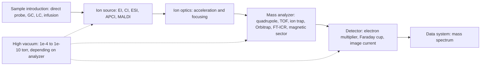
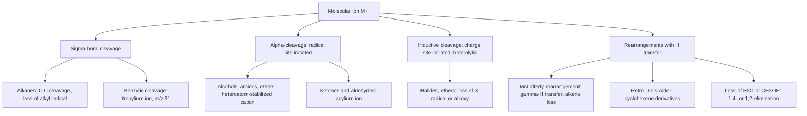

## Mass Spectrometry


### Overview

**Mass spectrometry (MS)** determines the **mass-to-charge ratio ($m/z$)** of gas-phase ions. A sample is ionized, the resulting ions are separated according to $m/z$ in electric and/or magnetic fields (or by flight time), and the ion abundance at each $m/z$ is recorded as a **mass spectrum**. Unlike IR, UV–Vis, and NMR, MS does not measure absorption of radiation: it is a destructive technique that analyzes ions directly.

In the structure-determination toolkit, MS answers three questions that the other spectroscopies address poorly:

1. **What is the molecular mass and molecular formula?** (molecular ion, exact mass, isotope pattern)
2. **Which elements are present?** (characteristic isotope patterns of Cl, Br, S, and others)
3. **How are the atoms connected?** (fragmentation pathways, tandem MS)

**Key Points**

- A mass spectrum plots **relative abundance (%) versus $m/z$**; the tallest peak is the **base peak** (assigned 100%).
- The **molecular ion ($M^{+\bullet}$)** gives the nominal molecular mass; **high-resolution MS (HRMS)** gives the exact mass, from which the molecular formula is derived.
- Fragmentation is not random: it follows the stability of the resulting ions and neutral fragments (Stevenson's rule, resonance and hyperconjugation, loss of stable neutrals).
- The **nitrogen rule** relates the parity of the molecular mass to the number of nitrogen atoms.
- Ionization technique determines whether the spectrum shows mostly the intact molecule (**soft ionization**: ESI, MALDI, CI) or extensive fragments (**hard ionization**: EI).

---

### Fundamental Principles

#### Mass-to-Charge Ratio

$$\frac{m}{z} = \frac{\text{mass of the ion (u)}}{\text{number of elementary charges}}$$

For singly charged ions ($z = 1$), $m/z$ equals the ion mass in unified atomic mass units (u, also called Da). For multiply charged ions, common in electrospray ionization of proteins, $m/z$ is smaller than the mass.

#### General Scheme of a Mass Spectrometer



All stages after the source operate under **high vacuum** so that ions travel without colliding with gas molecules (mean free path must exceed the instrument's flight path).

#### Ion Motion in a Magnetic Sector (Historical Basis)

An ion of charge $ze$ accelerated through potential $V$ acquires kinetic energy:

$$zeV = \frac{1}{2}mv^2$$

In a magnetic field $B$, the ion follows a circular path of radius $r$ where centripetal and magnetic forces balance ($mv^2/r = zevB$):

$$\frac{m}{z} = \frac{B^2 r^2 e}{2V}$$

Scanning $B$ (or $V$) brings ions of successive $m/z$ to the detector. This relationship underlies sector instruments and is a useful reference for the principle of separation.

---

### Ionization Methods

The ion source converts neutral analyte molecules into gas-phase ions. The choice of method depends on the sample's volatility, thermal stability, polarity, and molecular mass.

#### Overview

| Method | Type | Analytes | Typical ions | Comment |
| --- | --- | --- | --- | --- |
| **Electron ionization (EI)** | Hard | Volatile, thermally stable, low mass (< ~600 u) | $M^{+\bullet}$ and abundant fragments | Standard for GC–MS; reproducible spectra; large searchable libraries |
| **Chemical ionization (CI)** | Soft | Volatile compounds | $[M+H]^+$, $[M-H]^-$, adducts | Reagent gas ($CH_4$, $NH_3$, isobutane) transfers a proton; enhances molecular-ion signal |
| **Electrospray ionization (ESI)** | Soft | Polar, ionizable, thermally labile; peptides, proteins, oligonucleotides, small polar molecules | $[M+nH]^{n+}$, $[M-nH]^{n-}$, $[M+Na]^+$ | Couples directly to LC; multiply charged ions extend the accessible mass range |
| **Atmospheric-pressure chemical ionization (APCI)** | Soft | Less polar, moderately volatile molecules | $[M+H]^+$, $[M-H]^-$ | Complements ESI for weakly polar compounds |
| **Atmospheric-pressure photoionization (APPI)** | Soft | Nonpolar aromatics, PAHs | $M^{+\bullet}$, $[M+H]^+$ | UV lamp initiates ionization (often with a dopant) |
| **Matrix-assisted laser desorption/ionization (MALDI)** | Soft | Large biomolecules, polymers, intact proteins | Mostly singly charged $[M+H]^+$ | Analyte co-crystallized with a UV-absorbing matrix; pulsed laser; typically coupled to TOF |
| **Fast atom bombardment (FAB)** | Soft | Polar, nonvolatile | $[M+H]^+$ | Largely superseded by ESI/MALDI |
| **Desorption ESI (DESI), DART** | Ambient | Surfaces, untreated samples | $[M+H]^+$, $M^{+\bullet}$ | Minimal sample preparation |
| **Inductively coupled plasma (ICP)** | Elemental | Metals, trace elements | Atomic ions ($M^+$) | Isotope ratio and trace-element analysis |

#### Electron Ionization (EI)

A heated filament emits electrons accelerated to **70 eV** (the standard, chosen because fragmentation patterns become reproducible and largely independent of energy near that value). An electron passing near a molecule ejects one of its valence electrons:

$$M + e^- \longrightarrow M^{+\bullet} + 2e^-$$

$M^{+\bullet}$ is a **radical cation** (the molecular ion). The ionization energy of most organic molecules is 8–12 eV, so the 70 eV beam deposits considerable excess internal energy (several eV), driving **fragmentation**.

**Order of electron removal** (lowest ionization energy first): nonbonding (lone-pair, $n$) electrons > $\pi$ electrons > $\sigma$ electrons. Thus the radical site and charge often localize on heteroatoms or $\pi$ systems, directing fragmentation.

**Characteristics**

- Reproducible spectra enable library matching (e.g., NIST, Wiley databases).
- The molecular ion may be weak or absent for alcohols, highly branched alkanes, and other labile compounds.
- Requires vaporizable sample; introduced via GC or a heated direct-insertion probe.

#### Chemical Ionization (CI)

A reagent gas at ~1 torr is first ionized by EI; the reagent ions then transfer a proton (or other species) to the analyte through ion–molecule reactions. For methane:

$$CH_4 + e^- \rightarrow CH_4^{+\bullet},\qquad CH_4^{+\bullet} + CH_4 \rightarrow CH_5^+ + CH_3^\bullet$$


$$M + CH_5^+ \rightarrow [M+H]^+ + CH_4$$

The proton-transfer step is only mildly exothermic, so less excess energy remains and **fragmentation is reduced**; the $[M+H]^+$ ion is typically abundant. Negative-ion CI (electron capture) is highly sensitive for electronegative compounds (halogenated, nitro).

#### Electrospray Ionization (ESI)

A solution of analyte is pumped through a capillary held at 2–5 kV; a fine aerosol of charged droplets forms, solvent evaporates (assisted by warm drying gas), droplets shrink until Coulomb repulsion causes **droplet fission**, and analyte ions are ultimately released into the gas phase.

- **Positive mode:** protonation or cation attachment: $[M+H]^+$, $[M+Na]^+$, $[M+K]^+$, $[M+NH_4]^+$.
- **Negative mode:** deprotonation, $[M-H]^-$, or anion attachment.
- **Multiple charging** in proteins produces a series of peaks differing by one charge; a **deconvolution** algorithm converts the envelope into the neutral mass.

**Multiply charged ions:** for adjacent peaks with charges $n_1$ and $n_2 = n_1 + 1$ at $m/z$ values $a_1$ and $a_2$:

$$a_1 = \frac{M + n_1 m_H}{n_1}, \qquad a_2 = \frac{M + (n_1+1) m_H}{n_1 + 1}$$

Solving gives $n_1 = \dfrac{a_2 - m_H}{a_1 - a_2}$ and then $M = n_1(a_1 - m_H)$, where $m_H = 1.00728$ (the proton mass).

**Example 1: Deconvolving an ESI protein series**

Adjacent peaks appear at $m/z$ 1001.0 ($a_1$) and 1112.1 ($a_2$)? Note that the higher charge gives the *lower* $m/z$, so assign the smaller value to the higher charge. Let $a_2 = 1001.0$ (charge $n+1$) and $a_1 = 1112.1$ (charge $n$):

$$n = \frac{a_2 - m_H}{a_1 - a_2} = \frac{1001.0 - 1.007}{1112.1 - 1001.0} = \frac{999.99}{111.1} \approx 9.0$$


$$M = n(a_1 - m_H) = 9.0 \times (1112.1 - 1.007) = 9.0 \times 1111.09 \approx 9{,}999.8\ u$$

The neutral mass is about 10,000 u.

**Characteristics of ESI:** very gentle, suitable for noncovalent complexes; susceptible to **ion suppression** by salts and co-eluting matrix; nonvolatile salts and detergents (phosphate, SDS) should be avoided; formic or acetic acid (positive mode) or ammonium hydroxide/acetate (negative mode) are common additives.

#### MALDI

The analyte is mixed with a large excess of a small organic matrix (e.g., $\alpha$-cyano-4-hydroxycinnamic acid for peptides, sinapinic acid for proteins, 2,5-dihydroxybenzoic acid for glycans and small molecules), dried on a target plate, and irradiated by a pulsed UV laser (commonly nitrogen, 337 nm, or Nd:YAG, 355 nm). The matrix absorbs the energy, vaporizes, and transfers protons to the analyte, producing mainly singly charged ions. Because pulses define a discrete start time, MALDI pairs naturally with **time-of-flight** analyzers.

---

### Mass Analyzers

#### Comparison

| Analyzer | Principle | Resolving power | Mass accuracy | Typical use |
| --- | --- | --- | --- | --- |
| **Quadrupole (Q)** | Stable trajectories in oscillating RF/DC fields select one $m/z$ at a time | Unit (~1,000–4,000) | ~100–500 ppm | GC–MS, LC–MS quantitation; triple quadrupole (QqQ) for targeted analysis |
| **Time-of-flight (TOF)** | Flight time over a field-free drift tube depends on $m/z$ | 10,000–60,000+ (reflectron) | 1–5 ppm | Fast full-spectrum acquisition; MALDI-TOF; Q-TOF hybrids |
| **Ion trap (3-D, linear)** | Ions confined by RF fields and ejected by $m/z$ | 1,000–10,000 | Modest | MS$^n$ experiments; compact |
| **Orbitrap** | Ions orbit a central spindle; image current frequency gives $m/z$ | 15,000–500,000+ | < 1–3 ppm | High-resolution proteomics, metabolomics |
| **FT-ICR** | Ions cycle in a strong magnetic field; cyclotron frequency gives $m/z$ | 100,000–> 1,000,000 | < 1 ppm | Ultra-high resolution; petroleomics; complex mixtures |
| **Magnetic sector (single or double focusing)** | Momentum/energy separation | 10,000–100,000 | 1–5 ppm | Classical high-resolution work; isotope ratio MS |

#### Time-of-Flight

Ions accelerated through potential $V$ reach velocity $v = \sqrt{2zeV/m}$ and traverse a drift length $L$ in time:

$$t = L\sqrt{\frac{m}{2zeV}} \quad\Rightarrow\quad m/z \propto t^2$$

A **reflectron** (ion mirror) compensates for the initial energy spread and lengthens the flight path, improving resolution.

#### Quadrupole

Four parallel rods carry a combined DC ($U$) and RF ($V\cos\omega t$) voltage. For given $U$ and $V$, only ions of a narrow $m/z$ range have stable trajectories and pass through; others strike the rods. Scanning $U$ and $V$ (at a constant $U/V$ ratio) sweeps the passband. **Triple quadrupole (QqQ)** places a collision cell (q) between two mass-filtering quadrupoles for selected-reaction monitoring (SRM/MRM), the workhorse of targeted quantitation.

#### Resolution and Mass Accuracy

**Resolving power:**

$$R = \frac{m}{\Delta m}$$

where $\Delta m$ is the peak width at half maximum (FWHM). Two peaks of similar height at $m$ and $m + \Delta m$ are considered resolved with a 10% valley when $R = m/\Delta m$ (definition of "valley" convention varies; FWHM is standard for modern instruments).

**Mass accuracy** (in parts per million):

$$\text{error (ppm)} = \frac{m_{measured} - m_{theoretical}}{m_{theoretical}} \times 10^6$$

**Example 2:** the theoretical exact mass of $[C_{10}H_{14}N_2 + H]^+$ (protonated nicotine) is 163.1230; if a TOF measures 163.1224:

$$\text{error} = \frac{163.1224 - 163.1230}{163.1230} \times 10^6 = -3.7\ ppm$$

**Example 3:** to resolve $CO^+$ (27.9949) from $N_2^+$ (28.0061) requires $R = \dfrac{28.0}{0.0112} \approx 2{,}500$; a unit-resolution quadrupole cannot separate them, whereas a TOF or Orbitrap can.

#### Tandem Mass Spectrometry (MS/MS)

Two or more stages of mass analysis separated by a fragmentation step:

1. **MS1:** select a **precursor ion** of a given $m/z$.
2. **Activation:** fragment it by **collision-induced dissociation (CID)** with inert gas (He, Ar, $N_2$), higher-energy collisional dissociation (HCD), electron-capture/transfer dissociation (ECD/ETD), or infrared multiphoton dissociation (IRMPD).
3. **MS2:** analyze the **product ions**.

| Scan mode (QqQ) | MS1 | MS2 | Question answered |
| --- | --- | --- | --- |
| Product-ion scan | Fixed precursor | Scan | What fragments does this ion give? |
| Precursor-ion scan | Scan | Fixed product | Which precursors yield this fragment? |
| Neutral-loss scan | Scan (offset) | Scan (offset) | Which ions lose a given neutral (e.g., 44 u $CO_2$)? |
| **SRM/MRM** | Fixed precursor | Fixed product | Highly selective and sensitive quantitation |

Tandem MS gives structural information about specific ions selected from mixtures without prior separation and is the core of proteomics (peptide sequencing) and modern quantitative bioanalysis.

---

### Reading a Mass Spectrum

#### Terminology

| Term | Definition |
| --- | --- |
| **Molecular ion ($M^{+\bullet}$)** | Intact molecule minus one electron (EI); highest $m/z$ of the monoisotopic pattern (apart from isotope peaks) |
| **Base peak** | Most intense peak (set to 100%) |
| **Fragment ion** | Ion formed by dissociation of the molecular ion |
| **Isotope peaks ($M+1$, $M+2$)** | Peaks from molecules containing heavier isotopes ($^{13}C$, $^{2}H$, $^{37}Cl$, $^{81}Br$, $^{34}S$) |
| **Metastable peak ($m^*$)** | Broad, low-intensity peak from ions fragmenting during flight; $m^* = m_2^2/m_1$ |
| **Nominal mass** | Mass calculated using the most abundant isotope of each element, to the nearest integer |
| **Monoisotopic (exact) mass** | Mass calculated from the exact isotopic masses of the most abundant isotopes |
| **Average mass** | Mass calculated using average atomic weights (relevant for large biomolecules in low-resolution spectra) |

#### Exact Masses of Common Isotopes

| Isotope | Exact mass (u) | Natural abundance (%) |
| --- | --- | --- |
| $^1H$ | 1.007825 | 99.985 |
| $^2H$ (D) | 2.014102 | 0.015 |
| $^{12}C$ | 12.000000 (defined) | 98.93 |
| $^{13}C$ | 13.003355 | 1.07 |
| $^{14}N$ | 14.003074 | 99.632 |
| $^{15}N$ | 15.000109 | 0.368 |
| $^{16}O$ | 15.994915 | 99.757 |
| $^{17}O$ | 16.999132 | 0.038 |
| $^{18}O$ | 17.999160 | 0.205 |
| $^{19}F$ | 18.998403 | 100 |
| $^{31}P$ | 30.973762 | 100 |
| $^{32}S$ | 31.972071 | 94.93 |
| $^{33}S$ | 32.971459 | 0.76 |
| $^{34}S$ | 33.967867 | 4.29 |
| $^{35}Cl$ | 34.968853 | 75.78 |
| $^{37}Cl$ | 36.965903 | 24.22 |
| $^{79}Br$ | 78.918338 | 50.69 |
| $^{81}Br$ | 80.916291 | 49.31 |
| $^{127}I$ | 126.904473 | 100 |

**Mass defect:** exact masses differ from integers ($^1H$ is slightly above; $^{16}O$ slightly below; heavy atoms such as $^{127}I$ are below). High-resolution MS exploits these small differences to distinguish elemental compositions with the same nominal mass.

**Example 4: Same nominal mass, different formulas (nominal mass 28)**

| Species | Exact mass (u) |
| --- | --- |
| $CO$ | 27.9949 |
| $N_2$ | 28.0061 |
| $C_2H_4$ | 28.0313 |

**Example 5: HRMS to determine a formula**

An EI or ESI spectrum shows $M^{+\bullet}$ at $m/z$ 180.0634. Candidates with nominal mass 180:

| Formula | Calculated exact mass | Error (ppm) |
| --- | --- | --- |
| $C_9H_{8}O_4$ (aspirin, $M$) | 180.0423 | +117 |
| $C_{6}H_{12}O_{6}$ (glucose) | 180.0634 | 0 |
| $C_{10}H_{12}O_3$ | 180.0786 | −84 |

The measured mass matches glucose ($C_6H_{12}O_6$) within a fraction of a ppm. HRMS alone often admits several formulas at larger masses, so **isotope-pattern matching and chemical constraints** (valid DoU, element restrictions) supplement it.

---

### Isotope Patterns

Isotopic abundance patterns reveal which elements are present and how many.

#### The $M+1$ and $M+2$ Peaks

For carbon-hydrogen-nitrogen-oxygen compounds, the $M+1$ peak arises chiefly from $^{13}C$ (1.07% per carbon) with small contributions from $^{2}H$ (0.015%), $^{15}N$ (0.37%), and $^{17}O$ (0.04%):

$$\frac{I(M+1)}{I(M)} \times 100 \approx 1.1\,n_C + 0.37\,n_N + 0.015\,n_H + 0.04\,n_O$$

For a hydrocarbon-like compound the **number of carbons** can be estimated:

$$n_C \approx \frac{I(M+1)/I(M) \times 100}{1.1}$$

Similarly, the $M+2$ intensity for CHNO compounds (without S, Cl, Br) is small, roughly $\dfrac{(1.1\,n_C)^2}{200} + 0.20\,n_O$ (in percent relative to $M$).

**Example 6:** A molecular ion at $m/z$ 100 has an $M+1$ peak 6.6% as tall as $M$. Estimate $n_C$:

$$n_C \approx \frac{6.6}{1.1} = 6$$

(Example: hexane-type or a six-carbon compound; consistent with $C_6H_{12}O$ = 100.)

#### Halogen and Sulfur Patterns

| Element | Isotopes (approx. ratio) | Pattern in the molecular ion |
| --- | --- | --- |
| **Chlorine (1 Cl)** | $^{35}Cl : {}^{37}Cl \approx 3 : 1$ | $M : M+2 \approx 100 : 32$ (3:1) |
| **Chlorine (2 Cl)** |  | $M : M+2 : M+4 \approx 100 : 65 : 10$ (9:6:1) |
| **Chlorine (3 Cl)** |  | $M : M+2 : M+4 : M+6 \approx 100 : 98 : 32 : 3$ (27:27:9:1) |
| **Bromine (1 Br)** | $^{79}Br : {}^{81}Br \approx 1 : 1$ | $M : M+2 \approx 100 : 97$ (1:1) |
| **Bromine (2 Br)** |  | $M : M+2 : M+4 \approx 1 : 2 : 1$ |
| **Bromine + Chlorine (1 each)** |  | $M : M+2 : M+4 \approx 3 : 4 : 1$ |
| **Sulfur** | $^{32}S : {}^{34}S \approx 100 : 4.5$ | $M+2 \approx 4.4\%$ per S (plus smaller $M+1$) |
| **Iodine, fluorine, phosphorus, arsenic** | Monoisotopic | No isotope pattern; no $M+2$ contribution |
| **Silicon** | $^{28}Si : {}^{29}Si : {}^{30}Si \approx 92 : 5 : 3$ | $M+1 \approx 5\%$, $M+2 \approx 3.4\%$ per Si |

The pattern for $n$ chlorine (or bromine) atoms follows the binomial expansion $(a + b)^n$ with $a$ and $b$ the abundances of the two isotopes; for Cl, $a : b = 3 : 1$; for Br, $1 : 1$.

**Example 7: Bromoethane ($C_2H_5Br$)**

Peaks at $m/z$ 108 ($C_2H_5{}^{79}Br^{+\bullet}$) and 110 ($C_2H_5{}^{81}Br^{+\bullet}$) in approximately 1:1 ratio; fragments retaining Br (e.g., $CH_2Br^+$ at 93/95, $C_2H_5Br^{+\bullet}$) show the same doublet, while fragments lacking Br ($C_2H_5^+$, $m/z$ 29) appear as single peaks.

**Example 8: Chlorobenzene ($C_6H_5Cl$)**

$M$ at 112 and $M+2$ at 114 in approximately 3:1 ratio; major fragment $C_6H_5^+$ at $m/z$ 77.

#### Isotope Pattern Sketch (svg_diagram)

<svg xmlns="http://www.w3.org/2000/svg" viewBox="0 0 720 300" width="720" height="300" font-family="Arial, sans-serif">
<title>Characteristic Isotope Patterns of Cl and Br (svg_diagram)</title>
<text x="360" y="24" text-anchor="middle" font-size="16" font-weight="bold">Characteristic Isotope Patterns of Cl and Br (svg_diagram)</text>


<text x="100" y="52" text-anchor="middle" font-size="12" font-weight="bold">1 Cl</text>
<line x1="30" y1="230" x2="170" y2="230" stroke="#333" />
<rect x="60" y="90" width="18" height="140" fill="#2471a3" />
<rect x="100" y="188" width="18" height="42" fill="#2471a3" />
<text x="69" y="246" text-anchor="middle" font-size="10">M</text>
<text x="109" y="246" text-anchor="middle" font-size="10">M+2</text>
<text x="100" y="268" text-anchor="middle" font-size="10">3 : 1</text>

<text x="270" y="52" text-anchor="middle" font-size="12" font-weight="bold">2 Cl</text>
<line x1="200" y1="230" x2="340" y2="230" stroke="#333" />
<rect x="215" y="90" width="18" height="140" fill="#1e8449" />
<rect x="255" y="139" width="18" height="91" fill="#1e8449" />
<rect x="295" y="215" width="18" height="15" fill="#1e8449" />
<text x="224" y="246" text-anchor="middle" font-size="10">M</text>
<text x="264" y="246" text-anchor="middle" font-size="10">M+2</text>
<text x="304" y="246" text-anchor="middle" font-size="10">M+4</text>
<text x="270" y="268" text-anchor="middle" font-size="10">9 : 6 : 1</text>

<text x="440" y="52" text-anchor="middle" font-size="12" font-weight="bold">1 Br</text>
<line x1="370" y1="230" x2="510" y2="230" stroke="#333" />
<rect x="400" y="90" width="18" height="140" fill="#c0392b" />
<rect x="440" y="94" width="18" height="136" fill="#c0392b" />
<text x="409" y="246" text-anchor="middle" font-size="10">M</text>
<text x="449" y="246" text-anchor="middle" font-size="10">M+2</text>
<text x="440" y="268" text-anchor="middle" font-size="10">1 : 1</text>

<text x="610" y="52" text-anchor="middle" font-size="12" font-weight="bold">2 Br</text>
<line x1="540" y1="230" x2="680" y2="230" stroke="#333" />
<rect x="555" y="160" width="18" height="70" fill="#7d3c98" />
<rect x="595" y="90" width="18" height="140" fill="#7d3c98" />
<rect x="635" y="160" width="18" height="70" fill="#7d3c98" />
<text x="564" y="246" text-anchor="middle" font-size="10">M</text>
<text x="604" y="246" text-anchor="middle" font-size="10">M+2</text>
<text x="644" y="246" text-anchor="middle" font-size="10">M+4</text>
<text x="610" y="268" text-anchor="middle" font-size="10">1 : 2 : 1</text>
</svg>

---

### The Molecular Ion and the Nitrogen Rule

#### Nitrogen Rule

A molecule with an **even number of nitrogen atoms (including zero)** has an **even nominal molecular mass**; a molecule with an **odd number of nitrogen atoms** has an **odd nominal molecular mass**. This applies to compounds containing C, H, N, O, S, halogens, P, and Si (all common elements with even valence combined with an odd-mass, odd-valence N). It also follows that the parity of $m/z$ of an ion tells whether a fragment retains an odd number of nitrogens:

| Ion type | Parity of even-electron ion mass | Interpretation |
| --- | --- | --- |
| Molecular ion, radical cation, no N | Even | Normal |
| Molecular ion, one N | Odd | Nitrogen rule |
| Even-electron fragment ion (no N) | Odd | Formed from $M^{+\bullet}$ by loss of a radical |
| Radical-cation fragment (no N) | Even | Formed by loss of a neutral molecule |

Loss of a radical or neutral molecule therefore changes parity in a predictable way. This helps decide whether a fragment retains nitrogen.

#### Stability of the Molecular Ion

| Compound class | Molecular ion abundance |
| --- | --- |
| Aromatics, conjugated polyenes, heterocycles | Strong |
| Alkanes (unbranched), alkenes, cycloalkanes, sulfides | Moderate |
| Ketones, aldehydes, esters, amides, ethers, amines | Often observable but variable |
| Branched alkanes, tertiary alcohols, nitrates, nitro compounds, acetals | Weak or absent |
| Aliphatic alcohols, carboxylic acids (some), amines (some) | Often weak |

When the molecular ion is missing under EI, soft ionization (CI, ESI, FI) can be used to confirm the mass.

#### Loss From the Molecular Ion: Diagnostic Mass Differences

The difference between $M^{+\bullet}$ and a fragment identifies what was lost. Unreasonable losses (e.g., 4–14, 21–25 u) suggest that the assumed molecular ion is incorrect.

| Loss (u) | Neutral lost | Typical source |
| --- | --- | --- |
| 1 | $H^\bullet$ | Aldehydes, some amines, alcohols; $M-1$ |
| 15 | $CH_3^\bullet$ | Methyl groups, branched compounds |
| 16 | $O$ (N-oxides, nitro), $NH_2^\bullet$ (amides) |  |
| 17 | $OH^\bullet$, $NH_3$ | Acids, alcohols |
| 18 | $H_2O$ | Alcohols, acids, carbonyls |
| 19 | $F^\bullet$ | Fluorides |
| 20 | $HF$ | Fluorides |
| 26 | $C_2H_2$, $CN^\bullet$ | Aromatics, nitriles |
| 27 | $HCN$, $C_2H_3^\bullet$ | Nitriles, N-heterocycles, vinyl |
| 28 | $CO$, $C_2H_4$, $N_2$ | Carbonyls, McLafferty rearrangement, diazo/azo |
| 29 | $C_2H_5^\bullet$, $CHO^\bullet$ | Ethyl, aldehydes |
| 30 | $CH_2O$, $NO$, $C_2H_6$ | Methyl ethers, nitro/nitroso |
| 31 | $OCH_3^\bullet$, $CH_2OH^\bullet$, $CH_3NH_2$ | Methyl esters, alcohols |
| 32 | $CH_3OH$, $S$ | Methyl esters/ethers; sulfur |
| 35/37 | $Cl^\bullet$ | Chlorides |
| 36/38 | $HCl$ | Chlorides |
| 42 | $CH_2{=}C{=}O$ (ketene), $C_3H_6$ | Acetates, methyl ketones |
| 43 | $CH_3CO^\bullet$, $C_3H_7^\bullet$ | Methyl ketones, propyl |
| 44 | $CO_2$, $C_3H_8$, $CH_3CHO$ | Carboxylic acids, anhydrides, esters |
| 45 | $OC_2H_5^\bullet$, $COOH^\bullet$ | Ethyl esters/ethers; acids |
| 46 | $NO_2^\bullet$, $C_2H_5OH$ | Nitro compounds; ethanol |
| 57 | $C_4H_9^\bullet$ | Butyl (*tert*-butyl) |
| 77 | $C_6H_5^\bullet$ | Phenyl |
| 79/81 | $Br^\bullet$ | Bromides |
| 127 | $I^\bullet$ | Iodides |

---

### Fragmentation Mechanisms (EI)

#### Guiding Principles

1. **Stability of the products governs the pathway.** The more stable the resulting cation (and neutral fragment), the more abundant the corresponding peak. Relative cation stabilities: tertiary > secondary > primary carbocation; allylic and benzylic ions (resonance stabilized) are especially favorable; acylium ($RC{\equiv}O^+$) and oxonium/iminium ions ($R_2C{=}O^+R$, $R_2C{=}N^+R_2$) are strongly stabilized by lone-pair donation.
2. **Stevenson's rule:** when a bond cleaves, the positive charge is retained by the fragment with the **lower ionization energy** (i.e., the more stable cation), while the other fragment departs as the radical.
3. **Loss of the largest alkyl radical** is favored at a branch point.
4. **Even-electron ions** (all electrons paired) are preferred fragments over radical cations; **loss of small stable neutrals** ($H_2O$, $CO$, $CO_2$, $HCN$, $C_2H_4$, $NH_3$) is common.
5. **Rearrangements** (McLafferty, retro-Diels–Alder) occur when a favorable cyclic transition state exists.

The half-arrow (fishhook) notation shows movement of a **single electron**, while a full arrow shows movement of an **electron pair**.

#### Mechanistic Categories



---

#### Alkanes

- Molecular ion visible for straight chains, weaker (or absent) as branching increases.
- Fragments appear in **clusters separated by 14 u ($CH_2$)**: $C_nH_{2n+1}^+$ at $m/z$ 29, 43, 57, 71, 85, ... The $m/z$ 43 ($C_3H_7^+$) and 57 ($C_4H_9^+$) peaks are usually the most prominent for simple alkanes.
- Cleavage at **branch points** gives the most stable carbocation; the largest alkyl group is lost preferentially as a radical.

**Example 9: 2,2-Dimethylpropane (neopentane, $M = 72$)**

Molecular ion essentially absent; base peak at $m/z$ 57 (tert-butyl cation, $(CH_3)_3C^+$), formed by loss of $CH_3^\bullet$ (15 u).

**Example 10: Hexane ($M = 86$)**

$M^{+\bullet}$ (86, weak), and fragments at 71 ($M - 15$), 57 ($M - 29$; $C_4H_9^+$, often the base peak), 43 ($C_3H_7^+$), 29.

#### Alkenes

- Molecular ion is usually more intense than in alkanes.
- Characteristic **allylic cleavage** yields resonance-stabilized allyl cations (e.g., $CH_2{=}CH{-}CH_2^+$, $m/z$ 41), which is often the base peak or a major peak.
- Series at $m/z$ 41, 55, 69, ... ($C_nH_{2n-1}^+$).
- A **McLafferty-type rearrangement** may operate when a $\gamma$-hydrogen is available.

#### Aromatic Hydrocarbons

- **Strong molecular ion** (aromatic stabilization).
- Alkylbenzenes undergo **benzylic cleavage** to give the benzyl cation ($C_7H_7^+$, $m/z$ 91), which rearranges to the very stable **tropylium ion** (a seven-membered aromatic $6\pi$ cation).
- Benzene ring fragments: $m/z$ 77 ($C_6H_5^+$), 65 ($C_5H_5^+$, loss of $C_2H_2$ from 91), 51 ($C_4H_3^+$), 39.
- Alkylbenzenes with a $\gamma$-hydrogen on the chain ($\ge$ propyl) show a **McLafferty rearrangement** peak at $m/z$ 92 (radical cation).
- Monosubstituted benzenes: $m/z$ 77; substituted benzoyl: $m/z$ 105 ($C_6H_5CO^+$).

**Example 11: Toluene ($M = 92$)**

$M^{+\bullet}$ at 92; loss of $H^\bullet$ gives $m/z$ 91 (benzyl/tropylium, often the base peak); $m/z$ 65 (loss of $C_2H_2$ from 91).

**Example 12: Butylbenzene ($M = 134$)**

Base peak at $m/z$ 91 (benzylic cleavage, loss of propyl radical); $m/z$ 92 from McLafferty rearrangement (loss of propene, 42 u); $M^{+\bullet}$ at 134 moderate.

#### Alcohols

- **Molecular ion weak or absent** (especially for tertiary and long-chain alcohols).
- **$\alpha$-Cleavage:** breaking the C–C bond adjacent to the carbon bearing OH gives a resonance-stabilized oxonium ion; the largest alkyl group is lost preferentially.

$$R{-}CH(OH){-}R'\ ^{+\bullet} \longrightarrow R{-}CH{=}O^+H + R'^\bullet$$

| Alcohol class | Diagnostic $\alpha$-cleavage ion |
| --- | --- |
| Primary ($RCH_2OH$) | $CH_2{=}OH^+$, $m/z$ **31** |
| Secondary | $R{-}CH{=}OH^+$: $m/z$ 45, 59, 73, ... |
| Tertiary | $R_2C{=}OH^+$: $m/z$ 59, 73, ... |

- **Dehydration:** loss of $H_2O$ ($M - 18$), often via 1,4-elimination (five-membered transition state), especially for primary alcohols with at least four carbons; sometimes combined with alkene loss ($M - 18 - 28$).

**Example 13: 2-Butanol ($M = 74$)**

$M^{+\bullet}$ weak at 74; $\alpha$-cleavage losing $C_2H_5^\bullet$ gives $m/z$ 45 ($CH_3CH{=}OH^+$, base peak); losing $CH_3^\bullet$ gives $m/z$ 59 (smaller). Loss of the larger radical is preferred.

**Example 14: 1-Butanol ($M = 74$)**

$M^{+\bullet}$ very weak; $m/z$ 31 ($CH_2{=}OH^+$, base peak); $m/z$ 56 ($M - 18$, loss of water); $m/z$ 41, 43 alkyl ions.

**Cyclic alcohols:** ring cleavage gives a characteristic peak at $m/z$ 57 for cyclohexanol; $M - H_2O$ also observed.

**Phenols:** strong molecular ion; loss of $CO$ (28 u) and $HCO^\bullet$ (29 u) to give $m/z$ 66 and 65 for phenol ($M = 94$).

#### Ethers

- Molecular ion weak but generally visible for aliphatic ethers (slightly stronger than alcohols).
- **$\alpha$-Cleavage** (adjacent to oxygen; loss of an alkyl radical, largest preferred) yields oxonium ions: $CH_3O^+{=}CH_2$ ($m/z$ 45), $CH_3CH_2O^+{=}CH_2$ ($m/z$ 59), etc.
- **Inductive (charge-site-initiated) cleavage** of the C–O bond forms an alkyl cation (or alkoxy ion) with loss of an alkoxy radical.
- **Aromatic ethers:** strong $M^{+\bullet}$; loss of the alkyl group, then loss of $CO$; anisole ($M = 108$) gives 93 ($M - CH_3$), 78, 65 ($M - CH_3 - CO$).

#### Aldehydes and Ketones

**Aldehydes**

- Weak but visible $M^{+\bullet}$ for aliphatic; stronger for aromatic.
- **$M - 1$** (loss of the aldehydic $H^\bullet$) and **$M - 29$** (loss of $CHO^\bullet$).
- $m/z$ 29 ($HCO^+$) and 44 (McLafferty, $CH_2{=}CH{-}OH^{+\bullet}$ for aldehydes with $\gamma$-H).
- Benzaldehyde: $M^{+\bullet}$ 106, $M - 1$ at 105 (benzoyl cation), 77 ($C_6H_5^+$).

**Ketones**

- $M^{+\bullet}$ usually visible.
- **$\alpha$-Cleavage** on either side of the carbonyl gives **acylium ions** ($R{-}C{\equiv}O^+$), with loss of the larger alkyl radical favored:

$$R{-}CO{-}R'\ ^{+\bullet} \longrightarrow R{-}C{\equiv}O^+ + R'^\bullet$$

| Acylium ion | $m/z$ |
| --- | --- |
| $CH_3C{\equiv}O^+$ | 43 |
| $CH_3CH_2C{\equiv}O^+$ | 57 |
| $CH_3CH_2CH_2C{\equiv}O^+$ | 71 |
| $C_6H_5C{\equiv}O^+$ | 105 |

- Methyl ketones show a strong $m/z$ 43 peak; aryl ketones show benzoyl ($m/z$ 105) and phenyl ($m/z$ 77, loss of CO from 105).

**McLafferty rearrangement**

A ketone, aldehyde, ester, acid, or amide bearing a **$\gamma$-hydrogen** undergoes a six-membered cyclic transition state in which the $\gamma$-H is transferred to the carbonyl oxygen, followed by cleavage of the $\alpha$–$\beta$ bond to expel a neutral **alkene** while retaining the charge on the **enol** radical cation.

$$R{-}CH_2{-}CH_2{-}CH_2{-}C(=O){-}R' \xrightarrow{M^{+\bullet}} [CH_2{=}C(OH)R']^{+\bullet} + CH_2{=}CH{-}R$$

Diagnostic even-mass ions (from a molecule with even mass and no nitrogen):

| Carbonyl type | McLafferty ion | $m/z$ |
| --- | --- | --- |
| Methyl ketone ($CH_3CO{-}CH_2CH_2CH_2R$) | $CH_2{=}C(OH)CH_3^{+\bullet}$ | **58** |
| Aldehyde | $CH_2{=}CH{-}OH^{+\bullet}$ | **44** |
| Methyl ester | $CH_2{=}C(OH)OCH_3^{+\bullet}$ | **74** |
| Ethyl ester | $CH_2{=}C(OH)OC_2H_5^{+\bullet}$ | 88 |
| Carboxylic acid | $CH_2{=}C(OH)_2^{+\bullet}$ | **60** |
| Primary amide | $CH_2{=}C(OH)NH_2^{+\bullet}$ | **59** |

**Example 15: 2-Hexanone ($M = 100$)**

$M^{+\bullet}$ at 100; $m/z$ 43 (acylium $CH_3CO^+$, $\alpha$-cleavage, base peak or near); $m/z$ 58 (McLafferty, loss of propene, 42 u); $m/z$ 85 ($M - 15$, loss of methyl); $m/z$ 57 ($C_4H_9^+$).

#### Carboxylic Acids and Esters

**Carboxylic acids**

- Aliphatic acids: weak $M^{+\bullet}$; peaks at $M - 17$ (loss of $OH^\bullet$), $M - 45$ (loss of $COOH^\bullet$), $m/z$ 45 ($COOH^+$), and the McLafferty ion at $m/z$ 60 (for acids with a $\gamma$-H).
- Aromatic acids: stronger $M^{+\bullet}$; loss of $OH$ (M − 17), then loss of CO (M − 45).
- **Benzoic acid ($M = 122$):** $M - 17 = 105$ (benzoyl), $M - 45 = 77$ (phenyl).

**Esters**

- $M^{+\bullet}$ weak to moderate.
- **$\alpha$-Cleavage** losing the alkoxy radical gives acylium: $M - OR$ (e.g., $M - 31$ for methyl ester, $M - 45$ for ethyl ester).
- McLafferty rearrangement (acid-side chain with $\gamma$-H) gives $m/z$ 74 (methyl ester) or 88 (ethyl ester).
- Methyl esters of long-chain fatty acids: $m/z$ 74 (base peak), 87, and $M - 31$; a key identification in GC–MS of fatty acid methyl esters (FAMEs).
- **Acetates:** $m/z$ 43 ($CH_3CO^+$, often base peak) and $M - 60$ (loss of acetic acid) for alkyl acetates.

**Example 16: Ethyl acetate ($M = 88$)**

$m/z$ 43 (acetyl cation, base peak), $M - 45 = 43$; $m/z$ 61 ($CH_3C(OH)_2^+$, rearrangement with double hydrogen transfer), $m/z$ 70 ($M - H_2O$), 73 ($M - CH_3$), weak $M^{+\bullet}$ at 88.

#### Amines

- **Nitrogen rule** applies: odd $M$ for one N.
- Aliphatic amines: **weak or absent** $M^{+\bullet}$; dominant **$\alpha$-cleavage** (loss of the largest alkyl radical from the $\alpha$-carbon) giving iminium ions:

$$R{-}CH_2{-}NR'_2\ ^{+\bullet} \longrightarrow CH_2{=}N^+R'_2 + R^\bullet$$

| Amine class | Diagnostic ion | $m/z$ |
| --- | --- | --- |
| Primary ($RCH_2NH_2$) | $CH_2{=}NH_2^+$ | **30** |
| Secondary ($RCH_2NHCH_3$) | $CH_2{=}NHCH_3^+$ | 44 |
| Tertiary ($RCH_2N(CH_3)_2$) | $CH_2{=}N(CH_3)_2^+$ | 58 |

- Aromatic amines: strong $M^{+\bullet}$; loss of $H^\bullet$ ($M - 1$) and $HCN$ ($M - 27$).
- Amides: $M^{+\bullet}$ moderate; primary amides give $m/z$ 44 ($CONH_2^+$); McLafferty with $\gamma$-H gives $m/z$ 59.

**Example 17: Triethylamine ($M = 101$)**

$M^{+\bullet}$ at 101 (odd, one N), $m/z$ 86 ($M - CH_3$, base peak, iminium $CH_3CH{=}N^+(C_2H_5)_2$), fragments at 58, 30.

#### Halides

- **Isotope patterns** dominate the diagnostic value (see above).
- Fragmentation: loss of $X^\bullet$ ($M - 35/37$, $M - 79/81$, $M - 127$), loss of $HX$ ($M - 36$, etc.), and $\alpha$-cleavage.
- **Alkyl chlorides/bromides:** $M - X$ gives $R^+$; cyclic halonium ions for longer chains (e.g., a five-membered ring for 1-chlorohexane at $m/z$ 91/93).
- **Iodides:** $I^+$ at $m/z$ 127 and weak $M^{+\bullet}$; $M - 127$ usually strong.
- Fluorides lose $HF$ ($M - 20$).

#### Nitriles, Nitro Compounds, and Sulfur Compounds

| Class | Characteristic features |
| --- | --- |
| Nitriles | Weak $M^{+\bullet}$; $M - 1$ ($\alpha$-H loss); McLafferty ion at $m/z$ 41 ($CH_2{=}C{=}NH^{+\bullet}$); $m/z$ 27 ($HCN^{+\bullet}$ loss = $M - 27$) |
| Nitroalkanes | Weak or absent $M^{+\bullet}$; $NO_2^+$ at $m/z$ 46, $NO^+$ at 30, and $M - 46$ |
| Nitroarenes | Strong $M^{+\bullet}$; $M - 30$ (NO), $M - 46$ ($NO_2$), $m/z$ 77 |
| Thiols, sulfides | $M + 2$ isotope peak (~4.4% per S); $\alpha$-cleavage; $m/z$ 47 ($CH_3S^+$), 61 ($C_2H_5S^+$) |
| Sulfoxides, sulfones | Loss of $SO$ or $SO_2$ ($M - 48$, $M - 64$) |

#### Retro-Diels–Alder Fragmentation

Cyclohexene derivatives fragment by a retro-Diels–Alder reaction, splitting the ring into a diene and an alkene; the charge resides on the fragment with lower ionization energy (typically the diene).

$$\text{Cyclohexene}^{+\bullet} \longrightarrow \text{1,3-butadiene}^{+\bullet}\ (m/z\ 54) + \text{ethylene}$$

This pathway is prominent in terpenes, steroids, and other natural products.

---

### Interpretation Strategy

#### Systematic Approach

1. **Identify the molecular ion** and check plausibility: the highest-mass significant peak; consider whether the $M^{+\bullet}$ is weak or missing (confirm with soft ionization). Check for unreasonable neutral losses.
2. **Apply the nitrogen rule** (odd/even $M$).
3. **Inspect isotope patterns:** $M+2$ for Cl, Br, S, Si; $M+1$ to estimate carbon count.
4. **Determine the formula** (HRMS if available) and calculate the **degrees of unsaturation**:

$$\text{DoU} = C - \frac{H + X}{2} + \frac{N}{2} + 1$$

5. **Identify prominent low-mass ions** (characteristic series and diagnostic ions: 29, 43, 57 alkyl; 77, 91 aromatic; 31, 45 alcohol/ether; 30, 44 amine; 43, 105 carbonyl).
6. **Identify major neutral losses** from $M^{+\bullet}$.
7. **Propose structure(s)** and verify each fragment mechanistically.
8. **Combine with IR, NMR, UV** to confirm.

#### Diagnostic Ion Series Reference

| $m/z$ | Ion | Suggests |
| --- | --- | --- |
| 29, 43, 57, 71, 85 | $C_nH_{2n+1}^+$ | Alkyl chain |
| 41, 55, 69 | $C_nH_{2n-1}^+$ | Alkenes, cycloalkanes |
| 30 | $CH_2{=}NH_2^+$ | Primary amine |
| 31 | $CH_2{=}OH^+$ | Primary alcohol |
| 39, 51, 65, 77 | Aromatic fragments | Benzene ring |
| 43 | $CH_3CO^+$ | Methyl ketone, acetate |
| 44 | $CH_2{=}CHOH^{+\bullet}$; $CONH_2^+$; $CO_2^{+\bullet}$ | Aldehyde, amide, acid |
| 45 | $CH_3CH{=}OH^+$; $COOH^+$ | Secondary alcohol, ether, acid |
| 58 | $CH_2{=}C(OH)CH_3^{+\bullet}$ | Methyl ketone (McLafferty) |
| 74 | $CH_2{=}C(OH)OCH_3^{+\bullet}$ | Methyl ester (McLafferty) |
| 91 | $C_7H_7^+$ | Alkylbenzene (tropylium) |
| 105 | $C_6H_5CO^+$ | Benzoyl (aryl ketone/ester/acid) |
| 127 | $I^+$ | Iodide |

---

### Worked Problems

#### Problem 1: Identify a compound from its spectrum

**Data:** $M^{+\bullet}$ at $m/z$ 86 (weak); base peak at 43; other peaks at 71 (12%), 57 (20%), 58 (5%); IR shows strong C=O at 1715 cm$^{-1}$.

**Analysis:** even $M$, no nitrogen, DoU for $C_5H_{10}O$ ($M = 86$) = 1 (C=O). Acylium $CH_3CO^+$ at 43 (base peak) indicates a methyl ketone; $M - 15 = 71$ (loss of $CH_3^\bullet$); the McLafferty peak at $m/z$ 58 would require a $\gamma$-H (present in 2-pentanone, $CH_3COCH_2CH_2CH_3$, which gives 58 by loss of ethene). **Conclusion:** 2-pentanone (with 3-methyl-2-butanone also possible, distinguished by the absence of $\gamma$-H). Since the McLafferty peak at 58 is observed, 2-pentanone is favored.

#### Problem 2: Halogen determination

**Data:** $M^{+\bullet}$ at $m/z$ 156 and 158 (approximately 1:1); base peak at 77; other peak at 51.

**Analysis:** 1:1 doublet separated by 2 u indicates one Br ($^{79}Br/^{81}Br$). $M - 79 = 77$ ($C_6H_5^+$). **Conclusion:** bromobenzene ($C_6H_5Br$, $M = 156/158$); 77 is $C_6H_5^+$; 51 is $C_4H_3^+$.

#### Problem 3: Distinguishing isomers

Distinguish 2-pentanone from 3-pentanone:

| Feature | 2-Pentanone | 3-Pentanone |
| --- | --- | --- |
| $\alpha$-Cleavage ions | 43 ($CH_3CO^+$, base), 71 ($C_3H_7CO^+$) | 57 ($C_2H_5CO^+$, base) |
| McLafferty ion (58) | Present | Absent (no $\gamma$-H accessible in the appropriate arrangement: ethyl groups have no $\gamma$-H) |

#### Problem 4: Nitrogen rule application

An unknown shows $M^{+\bullet}$ at $m/z$ 87 and base peak at 30. **Odd $M$:** one nitrogen. $m/z$ 30 ($CH_2{=}NH_2^+$) indicates a primary amine with $\alpha$-cleavage. Candidate: 2-methyl-1-butanamine or 1-pentanamine ($C_5H_{13}N$, $M = 87$).

#### Problem 5: Estimating carbon count

A compound shows $M^{+\bullet}$ at $m/z$ 150 with $M+1$ = 9.9% and $M+2$ = 0.5% of $M$. No Cl, Br, S indicated. $n_C \approx 9.9/1.1 = 9$; DoU calculation with $C_9H_{10}O_2$ ($M = 150$) gives 5, consistent with an aromatic ring plus a carbonyl (e.g., ethyl benzoate is 150; so is phenylacetic-acid methyl ester).

#### Problem 6: ESI charge state

Peaks at $m/z$ 892.6 ($z = n + 1$) and 991.7 ($z = n$) for a protein:

$$n = \frac{892.6 - 1.007}{991.7 - 892.6} = \frac{891.6}{99.1} \approx 9.0$$


$$M = 9 \times (991.7 - 1.007) = 8{,}916.2\ u$$

The protein mass is about 8,916 u.

---

### Computational Aid: Isotope Pattern and Mass Calculator

The following Python sketch calculates monoisotopic masses from a formula, generates halogen isotope patterns from the binomial distribution, and estimates carbon count from an $M+1$ ratio. It uses approximate abundances, so it is a teaching aid, and high-quality isotope simulation should use dedicated software.

```python
from math import comb
import re

# Monoisotopic masses (u)
MASS = {"H": 1.007825, "C": 12.000000, "N": 14.003074, "O": 15.994915,
        "F": 18.998403, "P": 30.973762, "S": 31.972071,
        "Cl": 34.968853, "Br": 78.918338, "I": 126.904473}
ELECTRON = 0.000549

def parse_formula(formula):
    counts = {}
    for el, n in re.findall(r"([A-Z][a-z]?)(\d*)", formula):
        counts[el] = counts.get(el, 0) + int(n or 1)
    return counts

def monoisotopic_mass(formula):
    return sum(MASS[el] * n for el, n in parse_formula(formula).items())

def mz_protonated(formula):
    return monoisotopic_mass(formula) + 1.007276  # + proton

def ppm_error(measured, theoretical):
    return (measured - theoretical) / theoretical * 1e6

def halogen_pattern(n, ratio_a, ratio_b):
    """Relative intensities of M, M+2, ... for n atoms of a 2-isotope halogen."""
    total = (ratio_a + ratio_b) ** n
    vals = [comb(n, k) * ratio_a ** (n - k) * ratio_b ** k / total for k in range(n + 1)]
    top = max(vals)
    return [round(100 * v / top, 1) for v in vals]

def estimate_carbons(m1_percent_of_M):
    return m1_percent_of_M / 1.1

print(f"Glucose C6H12O6 exact mass:         {monoisotopic_mass('C6H12O6'):.4f}")
print(f"Nicotine [M+H]+ (C10H14N2):         {mz_protonated('C10H14N2'):.4f}")
print(f"ppm error (163.1224 vs theory):     "
      f"{ppm_error(163.1224, mz_protonated('C10H14N2')):.1f} ppm")
print("1 Cl pattern (M, M+2):              ", halogen_pattern(1, 3, 1))
print("2 Cl pattern (M, M+2, M+4):         ", halogen_pattern(2, 3, 1))
print("1 Br pattern (M, M+2):              ", halogen_pattern(1, 1, 1))
print("2 Br pattern (M, M+2, M+4):         ", halogen_pattern(2, 1, 1))
print(f"Carbons from M+1 = 6.6%:            {estimate_carbons(6.6):.1f}")
```

**Output**



```
Glucose C6H12O6 exact mass:         180.0634
Nicotine [M+H]+ (C10H14N2):         163.1230
ppm error (163.1224 vs theory):     -3.7 ppm
1 Cl pattern (M, M+2):               [100.0, 33.3]
2 Cl pattern (M, M+2, M+4):          [100.0, 66.7, 11.1]
1 Br pattern (M, M+2):               [100.0, 100.0]
2 Br pattern (M, M+2, M+4):          [50.0, 100.0, 50.0]
Carbons from M+1 = 6.6%:            6.0
```

*The computed halogen patterns use idealized 3:1 (Cl) and 1:1 (Br) ratios; real abundances (75.78:24.22 for Cl; 50.69:49.31 for Br) give slightly different values (for example, about 100:32 for one Cl).*

---

### Coupled and Hyphenated Techniques

| Technique | Combination | Applications |
| --- | --- | --- |
| **GC–MS** | Gas chromatography with EI/CI | Volatile organics, environmental analysis, forensic toxicology, flavors and fragrances, fatty acid methyl esters; library searching |
| **LC–MS** | Liquid chromatography with ESI/APCI | Pharmaceuticals, metabolites, peptides, pesticides, bioanalysis |
| **LC–MS/MS** | LC with tandem MS (QqQ, Q-TOF, Orbitrap) | Targeted quantitation (MRM), proteomics, metabolomics |
| **CE–MS** | Capillary electrophoresis | Charged and highly polar analytes |
| **ICP–MS** | Plasma ionization | Trace metals, isotope ratios, elemental speciation (with LC/GC) |
| **MALDI imaging / DESI imaging** | Spatially resolved ionization | Tissue distribution of lipids, drugs, metabolites |
| **Ion mobility–MS** | Gas-phase mobility separation before MS | Isomer/conformer separation, collision cross sections |
| **Isotope ratio MS (IRMS)** | Sector instrument for stable isotopes | $\delta^{13}C$, $\delta^{15}N$, $\delta^{18}O$, provenance, geochemistry, doping control |

---

### Quantitation

- **External calibration:** peak area versus concentration of standards.
- **Internal standard:** a compound added at fixed concentration; ratio of analyte to internal standard corrects for injection and ionization variability. **Stable isotope-labeled internal standards** ($^{13}C$, $^{15}N$, $^2H$ analogs) are the gold standard because they co-elute and experience identical matrix effects.
- **Isotope dilution MS:** adding a known amount of an isotopically enriched analog and measuring the isotope ratio yields absolute quantity with high accuracy.
- **Matrix effects** (ion suppression or enhancement in ESI) must be evaluated with matrix-matched standards or post-column infusion.
- **Selected ion monitoring (SIM)** and **MRM** greatly improve selectivity and sensitivity relative to full-scan acquisition.
- **Limits of detection** commonly reach femtomole (LC–MS/MS) to attomole levels for targeted assays.

---

### Applications

| Area | Use |
| --- | --- |
| Organic structure elucidation | Molecular mass, formula (HRMS), fragmentation for substructures |
| Pharmaceutical analysis | Impurity profiling, metabolite identification, pharmacokinetics, reaction monitoring |
| Proteomics | Peptide sequencing by MS/MS, protein identification, post-translational modification mapping, intact protein and native MS |
| Metabolomics and lipidomics | Untargeted and targeted profiling of small molecules |
| Environmental and food safety | Pesticides, PFAS, persistent organic pollutants, contaminants |
| Forensics and clinical | Drug screening, toxicology, newborn screening, therapeutic drug monitoring |
| Polymers and materials | Molecular weight distribution, end-group analysis (MALDI-TOF) |
| Geochemistry and archaeology | Isotope ratios, radiocarbon dating (accelerator MS), source apportionment |
| Petroleum | Molecular composition of crude oil (FT-ICR MS) |
| Space and planetary science | In-situ compositional analysis of atmospheres and surfaces |

---

### Limitations

| Limitation | Consequence |
| --- | --- |
| Destructive technique | Sample is consumed (although the amounts are tiny) |
| Isomers give identical or similar masses | Requires chromatography, ion mobility, or MS/MS, and complementary methods (NMR) for definitive identification |
| Absent or weak molecular ion in EI | Use soft ionization to confirm molecular mass |
| Ion suppression and matrix effects | Needs sample cleanup, isotope-labeled standards, and chromatographic separation |
| Poor ionization of some compounds (nonpolar, neutral) | Requires derivatization or alternative ionization (APCI, APPI) |
| Limited stereochemical information | Chiral analysis needs chiral separation or derivatization |
| Complex spectra for mixtures | Combine with separation; software deconvolution |
| Cost and maintenance | High-resolution instruments are expensive and vacuum-dependent |

---

### Common Pitfalls

**Key Points**

- Assuming the highest-$m/z$ peak is always the molecular ion (it may be an adduct, an impurity, a $M+1/M+2$ isotope peak, or a fragment cluster; and conversely the true $M^{+\bullet}$ may be absent).
- Forgetting the **nitrogen rule** and the parity of fragments when deciding which fragments contain nitrogen.
- Confusing **nominal, monoisotopic, and average masses** (especially for large molecules and multiply charged ions).
- Overlooking **adducts in ESI** ($[M+Na]^+$ at $M + 22.9892$ above $[M+H]^+$ by 21.98; $[M+K]^+$; $[M+NH_4]^+$; $[2M+H]^+$ dimers) and solvent or plasticizer contaminants (phthalates at $m/z$ 149; siloxanes at 73, 207, 281; polyethylene glycol repeating units of 44 u).
- Misreading the **isotope pattern** (ignoring the contribution of $^{13}C$ to the $M+2$ region in molecules with many carbons, or forgetting $^{34}S$).
- Interpreting ESI **multiply charged envelopes** without deconvolution.
- Neglecting **ion suppression** in quantitation, or using structural analogs instead of stable isotope-labeled internal standards.
- Treating **library-match scores** as proof of identity without checking retention behavior and diagnostic ions.
- Applying **Stevenson's rule** without considering both fragments' ionization energies and possible rearrangements.
- Ignoring **thermal degradation** in GC inlets (a spectrum may reflect a decomposition product) or **in-source fragmentation** in ESI.
- Assuming $m/z$ equals mass for **multiply charged** ions.
- Overlooking **contaminant background** (column bleed, air $m/z$ 28, 32, 40, 44 from leaks; water at 18).

---

### Conclusion

Mass spectrometry converts neutral molecules into gas-phase ions, separates them by $m/z$, and records their abundance to reveal molecular mass, elemental composition, and connectivity. The molecular ion and the nitrogen rule fix the molecular weight and nitrogen count; high-resolution measurements and isotope patterns pin down the molecular formula; and fragmentation, governed by the stability of ions and neutrals ($\alpha$-cleavage, benzylic cleavage, McLafferty rearrangement, retro-Diels–Alder, and loss of small stable molecules), maps out substructures. Soft ionization (ESI, MALDI, CI) and tandem MS extend the technique to intact biomolecules, complex mixtures, and ultra-trace quantitation, while GC–MS and LC–MS provide separation coupled to identification. Combined with IR, UV–Vis, and NMR, mass spectrometry completes the spectroscopic toolkit for unambiguous structure determination.

---

### Related Topics

- Infrared spectroscopy: functional-group identification
- Nuclear magnetic resonance spectroscopy: carbon–hydrogen framework and stereochemistry
- Ultraviolet–visible spectroscopy: conjugation and chromophores
- Tandem MS and proteomics: peptide fragmentation ($b$/$y$ ions, ETD $c$/$z$ ions), database searching
- Ion mobility spectrometry and collision cross sections
- High-resolution accurate-mass instrumentation: Orbitrap and FT-ICR physics
- Isotope ratio mass spectrometry and isotope geochemistry
- Native mass spectrometry and noncovalent complexes
- Chromatography fundamentals for GC–MS and LC–MS method development
- Computational mass spectrometry: spectral library matching, in-silico fragmentation, and molecular networking