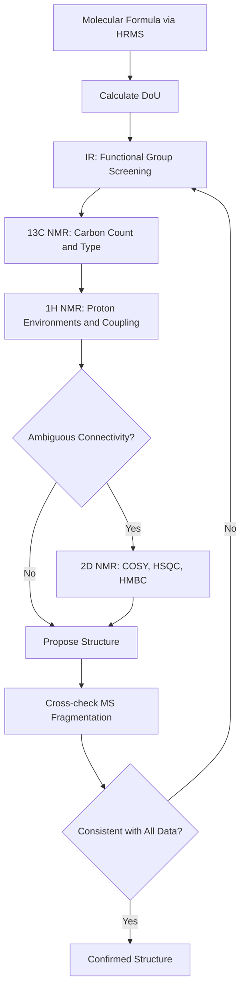

## Combining Spectral Data to Determine Structure

### Overview

Structure elucidation rarely relies on a single spectroscopic technique. Each method probes a different aspect of molecular architecture, and combining them removes ambiguities that any single technique leaves unresolved.

**Key Points**

- Mass spectrometry (MS) establishes molecular formula and fragmentation pattern
- Infrared (IR) spectroscopy identifies functional groups via characteristic vibrational frequencies
- $^1H$ NMR reveals proton environments, counts, and connectivity
- $^{13}C$ NMR reveals carbon skeleton and hybridization
- 2D NMR (COSY, HSQC, HMBC) resolves connectivity and long-range coupling ambiguities
- UV-Vis spectroscopy provides information on conjugation and chromophores

### Systematic Workflow

#### Step 1: Determine Molecular Formula

High-resolution mass spectrometry (HRMS) gives the exact mass, from which the molecular formula is derived.

**Degree of Unsaturation (DoU) / Index of Hydrogen Deficiency (IHD)**

$$\text{DoU} = \frac{2C + 2 + N - H - X}{2}$$

where $C$, $H$, $N$, $X$ are the number of carbon, hydrogen, nitrogen, and halogen atoms respectively (oxygen and sulfur are ignored in the formula).

| DoU value | Interpretation |
| --- | --- |
| 0 | Fully saturated, acyclic |
| 1 | One ring or one $\pi$ bond |
| 4 | Often indicates one aromatic ring (3 $\pi$ bonds + 1 ring) |

#### Step 2: Identify Functional Groups via IR

IR spectroscopy is used early to narrow down functional group possibilities before NMR interpretation, since carbonyls, hydroxyls, amines, and nitriles produce highly diagnostic, sharp absorptions.

| Functional Group | Approximate Wavenumber (cm⁻¹) | Character |
| --- | --- | --- |
| O–H (alcohol) | 3200–3550 | Broad |
| N–H | 3300–3500 | Medium, sharp/broad |
| C≡N | 2210–2260 | Sharp, medium |
| C=O (ketone) | 1705–1725 | Strong, sharp |
| C=O (ester) | 1735–1750 | Strong, sharp |
| C=O (amide) | 1630–1700 | Strong |
| C=C (alkene) | 1620–1680 | Weak–medium |
| C=C (aromatic) | 1450–1600 | Medium, multiple bands |

**Example**

A strong absorption at 1715 cm⁻¹ combined with a DoU of 1 strongly suggests an acyclic ketone or aldehyde rather than a carboxylic acid (which would also show a broad O–H stretch near 2500–3300 cm⁻¹).

#### Step 3: Analyze $^{13}C$ NMR

$^{13}C$ NMR establishes the number of chemically distinct carbon environments and their hybridization/electronic environment.

| Chemical Shift Range (ppm) | Carbon Type |
| --- | --- |
| 0–40 | sp³ C, alkyl |
| 20–50 | C adjacent to carbonyl/halogen |
| 50–90 | C–O, C–N (sp³) |
| 100–150 | sp² aromatic/alkene C |
| 160–185 | Ester, amide, acid carbonyl C |
| 190–220 | Ketone, aldehyde carbonyl C |

The number of unique peaks (accounting for symmetry) constrains the number of distinct carbons in the structure, which must match the molecular formula.

#### Step 4: Analyze $^1H$ NMR

$^1H$ NMR provides four types of structural information simultaneously:

1. **Chemical shift** ($\delta$, ppm) — electronic environment
2. **Integration** — relative number of protons
3. **Multiplicity** — number of neighboring protons (n+1 rule)
4. **Coupling constant** ($J$, Hz) — dihedral/spatial relationships

$$n + 1 \text{ rule: multiplicity} = n_{\text{adjacent H}} + 1$$

| Chemical Shift (ppm) | Proton Environment |
| --- | --- |
| 0.7–1.5 | Alkyl C–H |
| 2.0–2.5 | C–H adjacent to C=O |
| 3.3–4.5 | C–H adjacent to O or N |
| 4.5–6.5 | Vinyl/alkene C–H |
| 6.5–8.5 | Aromatic C–H |
| 9.5–10.5 | Aldehyde C–H |
| 10–13 | Carboxylic acid O–H |

#### Step 5: Resolve Connectivity with 2D NMR

When 1D data alone is ambiguous, 2D correlation experiments establish through-bond and through-space relationships.

| Technique | Correlation Type | Information Provided |
| --- | --- | --- |
| COSY | $^1H$–$^1H$ (2–3 bonds) | Adjacent proton coupling network |
| HSQC | $^1H$–$^{13}C$ (1 bond) | Direct C–H attachment |
| HMBC | $^1H$–$^{13}C$ (2–3 bonds) | Long-range connectivity across heteroatoms/quaternary C |
| NOESY | $^1H$–$^1H$ (through space) | Spatial proximity, stereochemistry |

**Example**

HMBC is particularly valuable for placing quaternary carbons (e.g., carbonyl carbons with no attached H) into the skeleton, since HSQC alone cannot detect them.

#### Step 6: Interpret Mass Fragmentation

Common fragmentation patterns confirm substructures suggested by NMR/IR.

| Loss (m/z) | Fragment Lost | Implies |
| --- | --- | --- |
| 15 | •CH₃ | Methyl group |
| 18 | H₂O | Alcohol or carboxylic acid |
| 28 | CO or C₂H₄ | Carbonyl or ethylene |
| 29 | •CHO or •C₂H₅ | Aldehyde or ethyl |
| 43 | •C₃H₇ or CH₃CO• | Isopropyl or acetyl |

### Integrated Example: Unknown $C_8H_8O$

**Example**

Given data:

- HRMS: $M^+ = 120.0575$, consistent with $C_8H_8O$
- DoU $= \frac{2(8)+2-8}{2} = 5$ (suggests aromatic ring + one additional unsaturation)
- IR: strong sharp band at 1685 cm⁻¹ (conjugated C=O), no O–H or N–H
- $^1H$ NMR: $\delta$ 7.4–7.9 (5H, m, aromatic), $\delta$ 2.6 (3H, s)
- $^{13}C$ NMR: 197 ppm (C=O), 137, 133, 128.6, 128.3 (aromatic C), 26.6 ppm (CH₃)

**Deduction**: Aromatic ring (4 DoU) + carbonyl (1 DoU) = 5 DoU matches. The singlet methyl at 2.6 ppm with no coupling partner, attached to a carbonyl (confirmed by HMBC correlation to the 197 ppm carbon), combined with a monosubstituted phenyl pattern, identifies the structure as **acetophenone** ($C_6H_5COCH_3$).

### Cross-Validation Strategy

### Common Pitfalls

- Relying on a single technique in isolation, especially skipping DoU calculation before proposing rings/pi-bonds
- Misassigning overlapping $^1H$ signals without integration cross-check
- Ignoring the requirement that all four techniques (MS, IR, $^1H$/$^{13}C$ NMR) must be mutually consistent; a structure that fits NMR but not the mass fragmentation must be revised
- [Inference] Overreliance on empirical chemical shift tables without considering solvent, concentration, or temperature effects, which can shift observed values from tabulated ranges

**Related Topics**

- Degree of unsaturation and molecular formula determination
- 2D NMR techniques: COSY, HSQC, HMBC, NOESY
- Mass spectral fragmentation patterns (McLafferty rearrangement)
- Chemical shift correlation tables for $^1H$ and $^{13}C$ NMR
- Coupling constant analysis and stereochemical assignment
- UV-Vis spectroscopy and chromophore identification