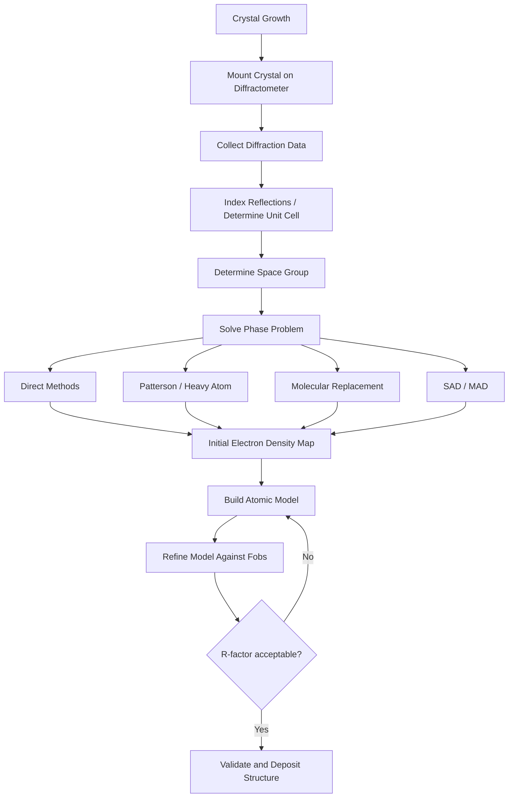

## X-ray Diffraction and Crystallography

### Overview

X-ray diffraction (XRD) is an analytical technique that exploits the elastic scattering of X-ray photons by the electron clouds of atoms arranged in a periodic lattice. Because X-ray wavelengths (typically 0.5–2.5 Å) are comparable to interatomic distances in crystals, constructive and destructive interference of scattered waves produces a diffraction pattern that encodes the three-dimensional arrangement of atoms. Crystallography is the broader discipline of determining and interpreting these atomic arrangements from diffraction data.

### Fundamental Principles

**Nature of X-rays**

X-rays occupy the electromagnetic spectrum between ultraviolet and gamma rays, with wavelengths of roughly 0.01–10 nm. They are generated by:

- **Conventional X-ray tubes**: electrons accelerated toward a metal target (commonly Cu, Mo) produce Bremsstrahlung (continuous) radiation plus characteristic line emission (e.g., Cu Kα at 1.5406 Å) when inner-shell electrons are ejected and outer electrons fall to fill the vacancy.
- **Synchrotron sources**: relativistic electrons in a storage ring emit intense, tunable, highly collimated X-ray beams, enabling higher resolution and faster data collection than lab sources.

**Bragg's Law**

Diffraction is most intuitively described by W.L. Bragg's model, which treats the crystal as stacks of parallel lattice planes that partially reflect incident X-rays. Constructive interference occurs only when the path difference between waves reflected from successive planes equals an integer number of wavelengths:

$$n\lambda = 2d\sin\theta$$

where $n$ is the diffraction order (integer), $\lambda$ is the X-ray wavelength, $d$ is the interplanar spacing, and $\theta$ is the angle of incidence measured from the plane (not the normal). This law defines the geometric condition for observing a diffracted beam but does not by itself account for the intensity of that beam.

**Reciprocal Lattice and the Laue Condition**

A more rigorous treatment uses the reciprocal lattice, a Fourier-space construction where each point corresponds to a set of real-space lattice planes $(hkl)$. Diffraction occurs when the scattering vector $\mathbf{Q} = \mathbf{k}_{\text{out}} - \mathbf{k}_{\text{in}}$ coincides with a reciprocal lattice vector $\mathbf{G}_{hkl}$. This is the **Laue condition**, and it is geometrically equivalent to Bragg's law. The **Ewald sphere** construction visualizes which reciprocal lattice points satisfy this condition for a given incident wavelength and crystal orientation — a reflection is observed only when a reciprocal lattice point touches the surface of the Ewald sphere.

### Crystal Structure Descriptors

**Unit Cells and Lattice Systems**

A crystal is built from a unit cell repeated periodically in three dimensions, defined by lattice parameters $a, b, c$ (edge lengths) and $\alpha, \beta, \gamma$ (interaxial angles). There are 7 crystal systems (triclinic, monoclinic, orthorhombic, tetragonal, trigonal, hexagonal, cubic) and 14 Bravais lattices describing all possible periodic point arrangements.

**Miller Indices**

Lattice planes are labeled with Miller indices $(hkl)$, integers derived from the reciprocals of the plane's fractional intercepts on the unit cell axes. For a cubic system, the interplanar spacing relates simply to the indices:

$$\frac{1}{d^2_{hkl}} = \frac{h^2 + k^2 + l^2}{a^2}$$

Analogous but more complex expressions exist for the other six crystal systems.

**Space Groups and Symmetry**

Combining the 14 Bravais lattices with point-group symmetry operations (rotations, mirrors, inversion, and their combinations with translations — screw axes and glide planes) yields the 230 space groups, which fully classify all possible crystal symmetries. Space group determination is essential for structure solution because it restricts the number of independent atoms and reflections.

### The Structure Factor and Intensity

While Bragg's law predicts *where* reflections occur, the *intensity* of each reflection is governed by the **structure factor**:

$$F_{hkl} = \sum_{j=1}^{N} f_j \, e^{2\pi i (hx_j + ky_j + lz_j)}$$

where $f_j$ is the atomic scattering factor of atom $j$ (proportional to its electron count and falling off with $\sin\theta/\lambda$), and $x_j, y_j, z_j$ are its fractional coordinates in the unit cell. The measured diffraction intensity is proportional to $|F_{hkl}|^2$.

**Key Points**

- $F_{hkl}$ is a complex number containing both amplitude and phase information.
- Diffraction experiments measure only $|F_{hkl}|^2$ (intensity), so the phase of each reflection is lost — this is the **phase problem**, the central obstacle in crystallographic structure determination.
- Systematic absences (reflections with zero intensity for specific $hkl$ combinations) arise from lattice centering and symmetry elements (glide planes, screw axes) and are diagnostic of the space group.

### The Phase Problem and Structure Solution

Because only intensities (not phases) are measured, the electron density map:

$$\rho(x,y,z) = \frac{1}{V}\sum_{hkl} F_{hkl}\, e^{-2\pi i (hx+ky+lz)}$$

cannot be computed directly from raw data. Several methods have been developed to recover approximate phases:

- **Direct methods**: use statistical relationships among structure factor phases and are effective for small molecules with atomic resolution data (typically <1.2 Å).
- **Patterson methods**: the Patterson function $P(uvw)$ is a Fourier transform of $|F_{hkl}|^2$ alone (phase-independent) and reveals interatomic vectors; heavy atoms produce dominant peaks that can anchor an initial phase model (heavy-atom method).
- **Molecular replacement**: uses a known, structurally related model to compute initial phases, widely used in macromolecular (protein) crystallography.
- **Isomorphous replacement (SIR/MIR)** and **anomalous dispersion methods (SAD/MAD)**: exploit intensity differences introduced by heavy-atom derivatives or anomalous X-ray scattering near an element's absorption edge to solve phases experimentally.

Once initial phases are obtained, the structure is refined iteratively (e.g., by least-squares refinement against $F_{hkl}$) and validated using residuals such as the R-factor:

$$R = \frac{\sum \big| |F_{\text{obs}}| - |F_{\text{calc}}| \big|}{\sum |F_{\text{obs}}|}$$

Lower R-factors (well-refined small-molecule structures often reach 2–5%) indicate better agreement between the model and observed data. [Inference: acceptable R-factor thresholds vary by field, resolution, and data quality, so specific cutoffs should be interpreted contextually rather than as universal standards.]

### Instrumentation and Experimental Methods

**Powder XRD**

Used for polycrystalline/powder samples where crystallites are randomly oriented. Produces a 1D pattern of intensity vs. $2\theta$. Applications include phase identification (comparing patterns against reference databases like the ICDD PDF), quantitative phase analysis, crystallite size estimation via the Scherrer equation,

$$\tau = \frac{K\lambda}{\beta \cos\theta}$$

(where $\tau$ is crystallite size, $K$ is a shape factor near 0.9, and $\beta$ is the peak's full width at half maximum), and Rietveld refinement for full structure refinement from powder data.

**Single-Crystal XRD**

Requires a single, well-ordered crystal (often grown by slow evaporation, vapor diffusion, or cooling crystallization). A goniometer rotates the crystal through many orientations while a detector (historically film, now CCD or pixel-array detectors like Pilatus) records thousands of individual reflections, enabling full 3D structure determination including bond lengths, angles, and stereochemistry with high precision.

**Macromolecular Crystallography**

Applied to proteins, nucleic acids, and complexes. Crystals are typically grown by vapor diffusion (hanging/sitting drop) and are far more fragile and solvent-rich than small-molecule crystals. Cryo-cooling in liquid nitrogen minimizes radiation damage during synchrotron data collection.

### Comparison of Related Diffraction and Structural Techniques

| Technique | Radiation/Probe | Typical Sample | Key Information |
| --- | --- | --- | --- |
| Single-crystal XRD | X-rays | Single crystal | Full 3D atomic structure, absolute configuration |
| Powder XRD | X-rays | Polycrystalline powder | Phase ID, unit cell, crystallite size, quantitative phase analysis |
| Neutron diffraction | Neutrons | Single crystal/powder | Precise light-atom (H) positions, magnetic structure |
| Electron diffraction (e.g., MicroED) | Electrons | Nanocrystals | Structure from crystals too small for X-ray methods |
| Small-angle X-ray scattering (SAXS) | X-rays | Solution/amorphous | Low-resolution shape, size distribution (no atomic detail) |

### Worked Example

**Example**

Calculate the interplanar spacing $d$ for the (200) reflection of a cubic crystal with $a = 5.64\ \text{Å}$ (NaCl), and determine the diffraction angle $2\theta$ using Cu Kα radiation ($\lambda = 1.5406\ \text{Å}$).

Step 1 — Compute $d_{200}$:

$$d_{200} = \frac{a}{\sqrt{h^2+k^2+l^2}} = \frac{5.64}{\sqrt{2^2+0^2+0^2}} = \frac{5.64}{2} = 2.82\ \text{Å}$$

Step 2 — Apply Bragg's law ($n=1$):

$$\sin\theta = \frac{\lambda}{2d} = \frac{1.5406}{2 \times 2.82} = 0.2732$$

$$\theta = \sin^{-1}(0.2732) \approx 15.86^\circ$$

$$2\theta \approx 31.7^\circ$$

This closely matches the experimentally observed (200) reflection position for NaCl powder patterns.

### Diagram: Bragg Diffraction Geometry (svg_diagram)

<svg xmlns="http://www.w3.org/2000/svg" viewBox="0 0 500 300">
<text x="200" y="20" font-size="14" font-weight="bold">Bragg Diffraction Geometry (svg_diagram)</text>
<line x1="50" y1="150" x2="450" y2="150" stroke="black" stroke-width="1.5" />
<line x1="50" y1="200" x2="450" y2="200" stroke="black" stroke-width="1.5" />
<circle cx="100" cy="150" r="4" fill="black" />
<circle cx="250" cy="150" r="4" fill="black" />
<circle cx="100" cy="200" r="4" fill="black" />
<circle cx="250" cy="200" r="4" fill="black" />
<line x1="30" y1="90" x2="100" y2="150" stroke="blue" stroke-width="2" />
<line x1="100" y1="150" x2="170" y2="90" stroke="blue" stroke-width="2" />
<line x1="30" y1="140" x2="100" y2="200" stroke="blue" stroke-width="2" />
<line x1="100" y1="200" x2="170" y2="140" stroke="blue" stroke-width="2" />
<path d="M 85 150 A 20 20 0 0 1 100 130" stroke="red" fill="none" stroke-width="1" />
<text x="60" y="135" font-size="12" fill="red">θ</text>
<text x="460" y="153" font-size="12">plane 1</text>
<text x="460" y="203" font-size="12">plane 2</text>
<text x="30" y="175" font-size="12">d</text>
<line x1="100" y1="150" x2="100" y2="200" stroke="green" stroke-dasharray="3,3" />
<text x="200" y="270" font-size="12">Path difference = 2d sinθ = nλ</text>
</svg>

### Diagram: Structure Solution Workflow

### Applications

- **Materials science**: phase identification, texture analysis, residual stress measurement, thin-film characterization.
- **Pharmaceuticals**: polymorph screening and quality control, since different crystal forms of a drug can have different solubility and bioavailability.
- **Structural biology**: determination of protein, nucleic acid, and complex structures underpinning structure-based drug design.
- **Mineralogy and geology**: identification and structural classification of minerals.
- **Metallurgy**: phase composition and crystallite size in alloys.

### Common Pitfalls and Limitations

- Crystals must be sufficiently ordered and large enough (for lab X-ray sources, generally >5–10 µm for single-crystal work); many biologically or technologically important materials resist crystallization.
- Twinning, disorder, and radiation damage complicate data collection and interpretation.
- Hydrogen atoms scatter X-rays weakly (low electron count) and are often poorly located; neutron diffraction is preferred when precise H positions are needed.
- Powder XRD suffers from peak overlap in complex or low-symmetry systems, complicating indexing and Rietveld refinement.

**Related Topics**

- Electron and neutron diffraction techniques
- Rietveld refinement methodology
- Protein crystallography and cryo-EM as a complementary structural technique
- Symmetry, point groups, and space group theory
- Scattering factors and Fourier transform methods in crystallography
- Small-angle X-ray scattering (SAXS) and pair distribution function (PDF) analysis
- Synchrotron and free-electron laser (XFEL) radiation sources