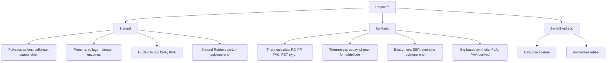

## Natural and Synthetic Polymers

### Overview

Polymers are classified by origin into **natural polymers** (biopolymers produced by living organisms) and **synthetic polymers** (man-made materials produced by controlled polymerization reactions). Both classes share the fundamental structural principle of repeating monomer units linked into macromolecular chains, but they differ substantially in biosynthetic vs. synthetic origin, structural regularity, biodegradability, and the range of accessible properties.

### Natural Polymers

**Definition and Classification**

Natural polymers (biopolymers) are macromolecules synthesized by biological systems through enzyme-catalyzed pathways. They are broadly grouped by chemical class:

- **Polysaccharides**: polymers of monosaccharide units linked by glycosidic bonds.
  - *Cellulose*: linear chains of $\beta$-D-glucose linked by $\beta(1\rightarrow4)$ glycosidic bonds; forms the structural framework of plant cell walls; extensive hydrogen bonding gives high tensile strength and insolubility in water.
  - *Starch*: composed of amylose (linear, $\alpha(1\rightarrow4)$-linked glucose) and amylopectin (branched, with additional $\alpha(1\rightarrow6)$ linkages); the primary energy-storage polysaccharide in plants.
  - *Glycogen*: highly branched glucose polymer analogous to amylopectin but more densely branched; the primary energy-storage polysaccharide in animals.
  - *Chitin*: linear polymer of N-acetylglucosamine; forms the exoskeleton of arthropods and fungal cell walls.
- **Proteins (polypeptides)**: polymers of amino acids linked by amide (peptide) bonds, with sequence and folding determining function (structural, enzymatic, transport, etc.). Examples include collagen (structural, triple-helix), keratin (structural, fibrous), silk fibroin, and globular enzymes.
- **Nucleic acids**: polymers of nucleotide units (a sugar, phosphate, and nitrogenous base) linked by phosphodiester bonds; DNA and RNA store and transmit genetic information.
- **Natural rubber**: cis-1,4-polyisoprene, obtained from the latex of *Hevea brasiliensis*; an elastomeric polymer formed biosynthetically from isoprene units.
- **Other biopolymers**: lignin (a complex aromatic polymer providing rigidity in plant cell walls), natural polyesters such as poly(hydroxyalkanoate)s (PHAs) produced by certain bacteria as carbon/energy storage.

**Key Structural Features**

- Generally exhibit high structural regularity and stereochemical precision (e.g., exclusively $\alpha$ or $\beta$ glycosidic linkages, single amino-acid stereochemistry) because biosynthesis is enzyme-templated.
- Often capable of complex hierarchical folding (secondary, tertiary, quaternary structure in proteins; helical and crystalline domains in polysaccharides).
- Generally biodegradable via specific enzymatic pathways (cellulases, proteases, nucleases, etc.) present in the natural environment.

### Synthetic Polymers

**Definition and Classification**

Synthetic polymers are produced industrially by chain-growth (addition) or step-growth (condensation) polymerization of small-molecule monomers under controlled conditions (see the companion topic on addition and condensation polymerization mechanisms). Broad classes include:

- **Thermoplastics**: soften/melt reversibly on heating; linear or branched chains with no covalent cross-links (e.g., polyethylene, polypropylene, polystyrene, PVC, PET, nylon, polycarbonate).
- **Thermosets**: form irreversible covalent cross-links on curing, yielding rigid, infusible networks that decompose rather than melt on heating (e.g., phenol-formaldehyde/Bakelite, epoxy resins, melamine-formaldehyde, vulcanized rubber).
- **Elastomers**: lightly cross-linked polymers capable of large reversible elastic deformation due to entropic recoil of chain segments between cross-link points (e.g., vulcanized natural rubber, synthetic polyisoprene, styrene-butadiene rubber).
- **Synthetic fibers**: polymers processed (e.g., by spinning) into oriented, high-tenacity filaments (e.g., nylon, polyester, acrylics, aramids such as Kevlar).

**Key Structural Features**

- Structural regularity depends on the polymerization method and catalyst — coordination catalysis (e.g., Ziegler–Natta, metallocene) can achieve high stereoregularity (isotactic/syndiotactic), whereas uncontrolled free-radical polymerization often gives atactic, less-ordered chains.
- Molecular weight distributions and architectures (linear, branched, cross-linked, block, graft) can be engineered precisely through choice of monomer, initiator, and reaction conditions.
- Biodegradability varies widely: most commodity synthetic polymers (PE, PP, PVC, PET) resist microbial degradation and persist in the environment; some engineered synthetic polymers (e.g., poly(lactic acid), PLA; polycaprolactone, PCL) are designed to be biodegradable or compostable.

### Comparative Summary

| Feature | Natural Polymers | Synthetic Polymers |
| --- | --- | --- |
| Origin | Biosynthesized by living organisms (enzyme-catalyzed) | Industrially synthesized from small-molecule monomers |
| Structural regularity | Typically very high (stereochemically precise) | Variable — depends on catalyst/mechanism |
| Molecular weight control | Set by biological template/pathway | Tunable via reaction conditions, initiator, catalyst |
| Biodegradability | Generally biodegradable by natural enzymatic pathways | Variable; most commodity plastics persist; some engineered types are biodegradable |
| Examples | Cellulose, starch, proteins, DNA/RNA, natural rubber, chitin | Polyethylene, PVC, nylon, PET, polystyrene, synthetic rubbers |
| Typical processing | Extracted/isolated from biological sources | Polymerized from petrochemical or bio-based monomers, then processed (extrusion, molding, spinning) |
| Property tunability | Constrained by biological function/sequence | Broadly tunable by monomer choice, composition, additives |

### Semi-Synthetic and Bio-Based Polymers

Some polymers occupy an intermediate category: **semi-synthetic polymers** are derived by chemically modifying a natural polymer (e.g., cellulose acetate and cellulose nitrate from cellulose; vulcanized rubber from natural rubber cross-linked with sulfur). **Bio-based synthetic polymers** are polymerized from monomers derived from renewable biological feedstocks (e.g., poly(lactic acid), PLA, synthesized from lactic acid obtained by fermentation of plant sugars) but otherwise follow conventional synthetic polymerization chemistry. Bio-based origin does not necessarily imply biodegradability, and biodegradability does not necessarily imply bio-based origin — these are independent properties. [Inference: this distinction is a common source of confusion in applied/environmental contexts and is worth emphasizing explicitly.]

### Structural Comparison Diagram

### Worked Example

**Example**

Compare the repeat unit and glycosidic linkage of cellulose (natural) with the repeat unit of polyethylene (synthetic), and explain why cellulose is biodegradable while polyethylene generally is not.

Cellulose's repeat unit is cellobiose (two $\beta$-D-glucose units linked by a $\beta(1\rightarrow4)$ glycosidic bond), and the polymer backbone contains hydrolyzable acetal (glycosidic) linkages:

$$-[\text{C}_6\text{H}_{10}\text{O}_5]_n-$$

These glycosidic bonds are substrates for cellulase enzymes, which hydrolyze the $\beta(1\rightarrow4)$ linkage, breaking the polymer into glucose units that are metabolized by microorganisms — hence cellulose is biodegradable.

Polyethylene's repeat unit is $-[\text{CH}_2-\text{CH}_2]_n-$, an all-carbon backbone formed by addition polymerization with no hydrolyzable heteroatom linkages. Because no natural enzyme system recognizes or cleaves the C–C backbone efficiently, polyethylene resists biodegradation over normal environmental timescales, [Inference: though slow abiotic photo-oxidative and thermo-oxidative degradation, and biodegradation by specialized microbial/enzymatic systems under specific conditions, have been reported and remain active areas of research].

### Applications

- **Natural polymers**: textiles (cotton = cellulose, silk = protein, wool = keratin), paper and packaging (cellulose), food thickeners and industrial adhesives (starch), surgical sutures and tissue scaffolds (collagen), biomedical/genetic applications (DNA/RNA), tires and elastic goods (natural rubber).
- **Synthetic polymers**: packaging films and bottles (PE, PP, PET), pipes and construction materials (PVC), textiles and engineering plastics (nylon, polyester), automotive and industrial rubber goods (SBR, synthetic polyisoprene), high-performance composites and protective gear (aramid fibers), medical implants and biodegradable sutures (PLA, PCL, PGA).

### Common Pitfalls and Misconceptions

- Assuming "natural" automatically means "safe" or "environmentally benign," and "synthetic" automatically means "harmful" — biodegradability, toxicity, and environmental impact depend on specific chemical structure, not origin category alone.
- Conflating "biodegradable" with "bio-based" — a bio-based polymer (derived from renewable feedstock) is not necessarily biodegradable, and a biodegradable polymer is not necessarily bio-based (some petrochemical-derived polymers are engineered to be biodegradable, e.g., certain aliphatic polyesters).
- Assuming all natural polymers have simple, unbranched structures — many (e.g., glycogen, amylopectin, folded proteins) have complex branched or three-dimensional architectures.
- Overlooking that semi-synthetic polymers (chemically modified natural polymers) do not fit cleanly into either category and require separate classification.

**Related Topics**

- Addition and condensation polymerization mechanisms
- Biodegradable and compostable polymers (PLA, PHA, PCL)
- Polymer processing and fabrication (extrusion, injection molding, fiber spinning)
- Protein structure and folding (primary through quaternary structure)
- Carbohydrate chemistry and glycosidic bond formation
- Rubber vulcanization and elastomer cross-linking
- Green and sustainable polymer chemistry