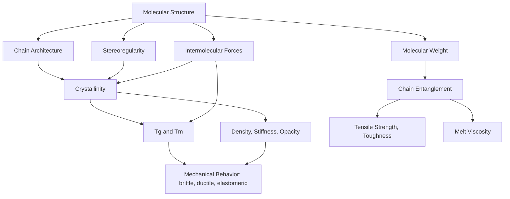

## Polymer Structure and Physical Properties

### Overview

The macroscopic physical properties of a polymer — mechanical strength, flexibility, transparency, melting behavior, solubility — arise directly from its molecular-level structure: chain architecture, molecular weight, degree of crystallinity, intermolecular forces, and chain conformation. Understanding these structure–property relationships is central to selecting or engineering polymers for specific applications.

### Chain Architecture

**Linear Polymers**

Chains extend without branching, allowing efficient chain packing and, consequently, higher density, higher crystallinity, and higher tensile strength (e.g., high-density polyethylene, HDPE).

**Branched Polymers**

Side chains extend from the main backbone, disrupting regular packing. This lowers crystallinity and density and generally reduces tensile strength while increasing flexibility (e.g., low-density polyethylene, LDPE, produced by free-radical polymerization with chain-transfer-induced branching).

**Cross-Linked (Network) Polymers**

Covalent bonds connect separate chains into a three-dimensional network. Light cross-linking produces elastomers (rubbery, reversibly extensible); dense cross-linking produces thermosets (rigid, infusible, insoluble). Cross-link density directly controls modulus and the degree of swelling in solvents.

**Copolymer Architectures**

When more than one monomer type is present, sequence arrangement further diversifies structure:

- *Random copolymer*: monomers arranged without regular pattern.
- *Alternating copolymer*: monomers strictly alternate.
- *Block copolymer*: long sequences ("blocks") of each monomer type joined end-to-end; can self-assemble into microphase-separated domains (e.g., styrene-butadiene-styrene, SBS, thermoplastic elastomers).
- *Graft copolymer*: a backbone of one monomer type with side chains of a different monomer type branching off.

### Molecular Weight and Its Distribution

Because polymerization produces chains of varying length, molecular weight is described statistically:

$$\bar{M}_n = \frac{\sum N_i M_i}{\sum N_i}, \qquad \bar{M}_w = \frac{\sum N_i M_i^2}{\sum N_i M_i}, \qquad Đ = \frac{\bar{M}_w}{\bar{M}_n}$$

where $\bar{M}_n$ is the number-average molecular weight, $\bar{M}_w$ is the weight-average molecular weight (more sensitive to high-MW species), and $Đ$ (dispersity, historically "polydispersity index") quantifies the breadth of the distribution ($Đ = 1$ for a perfectly uniform, monodisperse polymer).

**Effect on Properties**

- Mechanical strength (tensile strength, toughness) generally increases with molecular weight up to a plateau, because longer chains allow more physical entanglement, which resists chain slippage under stress.
- Melt viscosity increases strongly with molecular weight — for entangled linear polymers above a critical molecular weight $M_c$, zero-shear melt viscosity scales approximately as $\eta_0 \propto \bar{M}_w^{3.4}$, [Inference: this well-established empirical scaling exponent can vary slightly by polymer system and is derived from reptation theory, so it should be treated as a strong general trend rather than an exact universal constant].
- Very low molecular weight material (oligomers) behaves as a viscous liquid or brittle solid lacking the entanglement network needed for elastomeric or tough thermoplastic behavior.

### Crystallinity and Amorphous Regions

**Semicrystalline Polymers**

Most commercial thermoplastics are semicrystalline: they contain ordered, tightly packed crystalline regions interspersed with disordered amorphous regions. The **degree of crystallinity** (mass or volume fraction crystalline) governs many bulk properties:

- Higher crystallinity → higher density, stiffness, tensile strength, opacity (crystallites scatter light), and chemical resistance.
- Lower crystallinity → greater flexibility, transparency, and elongation at break.

**Factors Favoring Crystallinity**

- Structural regularity/stereoregularity (isotactic or syndiotactic chains pack more readily than atactic chains).
- Linear (unbranched) chain architecture.
- Strong, regularly spaced intermolecular forces (hydrogen bonding in nylon; dipole interactions in PET).
- Slow cooling rates during processing, allowing time for chain folding into ordered lamellae.

**Amorphous Polymers**

Some polymers (e.g., atactic polystyrene, poly(methyl methacrylate)) are essentially fully amorphous due to irregular stereochemistry or bulky, randomly oriented side groups that prevent ordered packing — these are typically transparent and exhibit a glass transition rather than a sharp melting point.

### Thermal Transitions

**Glass Transition Temperature ($T_g$)**

The temperature at which an amorphous (or the amorphous fraction of a semicrystalline) polymer transitions between a hard, glassy state and a soft, rubbery state, corresponding to the onset of long-range segmental chain motion. Below $T_g$, chains are essentially frozen in place; above $T_g$, cooperative micro-Brownian motion of chain segments becomes possible.

**Melting Temperature ($T_m$)**

The temperature at which crystalline regions melt into a disordered melt; applies only to the crystalline fraction of semicrystalline polymers. Amorphous polymers have no true $T_m$.

**Factors Raising $T_g$ and $T_m$**

- Chain stiffness (aromatic rings, rigid backbone segments).
- Strong intermolecular forces (hydrogen bonding, polar groups).
- Bulky side groups that restrict rotation.
- Increased cross-link density (raises $T_g$; can eliminate melting entirely in heavily cross-linked thermosets).

**Factors Lowering $T_g$ and $T_m$**

- Flexible backbone segments (e.g., ether or methylene linkages).
- Plasticizer additives, which insert between chains and increase free volume/chain mobility.
- Reduced regularity/branching (which also tends to lower $T_m$ by disrupting crystallization, though its direct effect on $T_g$ is more variable).

### Intermolecular Forces

The strength and type of secondary (non-covalent) forces between chains strongly influence bulk mechanical and thermal behavior:

- **Van der Waals/dispersion forces**: dominant in nonpolar polymers (e.g., polyethylene); relatively weak, giving lower $T_g/T_m$ and softer materials at a given molecular weight.
- **Dipole–dipole interactions**: present in polar polymers (e.g., PVC, PET); intermediate strength.
- **Hydrogen bonding**: strong, directional interactions in polymers bearing N–H, O–H groups (e.g., nylon's amide linkages, cellulose's hydroxyls); raises $T_g/T_m$, tensile strength, and often promotes fiber-forming ability.

### Mechanical Behavior

**Stress–Strain Response**

Polymer mechanical response is commonly characterized by a stress–strain curve, from which key parameters are extracted: elastic (Young's) modulus (initial slope, stiffness), yield strength, ultimate tensile strength, and elongation at break (ductility). Behavior spans a spectrum:

- **Brittle** (e.g., heavily cross-linked thermosets, glassy amorphous polymers below $T_g$): high modulus, low elongation, fracture with little plastic deformation.
- **Ductile/tough** (e.g., semicrystalline thermoplastics above $T_g$): moderate modulus, significant plastic deformation before fracture.
- **Elastomeric** (e.g., lightly cross-linked rubbers above $T_g$): low modulus, very large reversible elongation (entropy-driven elastic recoil).

**Viscoelasticity**

Polymers exhibit time- and temperature-dependent mechanical response combining viscous (liquid-like, energy-dissipating) and elastic (solid-like, energy-storing) behavior simultaneously. This manifests as creep (gradual deformation under constant stress), stress relaxation (gradual stress decay under constant strain), and frequency/temperature-dependent modulus, often modeled with combinations of springs (elastic) and dashpots (viscous) such as the Maxwell and Kelvin–Voigt models.

### Structure–Property Relationship Diagram

### Worked Example

**Example**

Explain, in structural terms, why high-density polyethylene (HDPE) is more rigid and opaque than low-density polyethylene (LDPE), despite both being chemically identical repeat units, $-[\text{CH}_2-\text{CH}_2]_n-$.

HDPE is produced under conditions (e.g., coordination catalysis) that yield predominantly linear chains with minimal branching. This structural regularity allows chains to pack closely into ordered lamellar crystallites, giving HDPE a high degree of crystallinity (typically ~60–80%). The dense crystalline packing increases density, stiffness, and tensile strength, and the crystallites scatter visible light, producing an opaque or translucent appearance.

LDPE, produced by high-pressure free-radical polymerization, develops significant short- and long-chain branching via intra- and intermolecular chain-transfer reactions. These branches disrupt regular chain packing, substantially lowering crystallinity (typically ~40–50%). The larger amorphous fraction increases flexibility and reduces density, stiffness, and opacity relative to HDPE — the two materials thus differ dramatically in physical properties despite sharing an identical chemical repeat unit, purely as a consequence of chain architecture.

### Applications of Structure–Property Control

- **Fiber engineering**: maximizing chain orientation and crystallinity (via drawing/stretching during spinning) to achieve high tensile strength in textile and technical fibers (nylon, polyester, aramids).
- **Packaging film design**: balancing crystallinity and branching to tune flexibility, clarity, and barrier properties (LDPE vs. HDPE vs. linear low-density polyethylene, LLDPE).
- **Elastomer formulation**: controlling cross-link density (e.g., degree of vulcanization) to tune modulus and elastic recovery in rubber products.
- **Plasticized PVC**: adding plasticizers to lower $T_g$ well below room temperature, converting rigid PVC into flexible material for cabling, flooring, and medical tubing.
- **Engineering thermoplastics**: selecting polymers with high $T_g$ and strong intermolecular forces (polycarbonate, PEEK) for load-bearing, high-temperature-resistant components.

### Common Pitfalls and Misconceptions

- Assuming molecular weight and degree of polymerization are interchangeable with "chain length" in a simple linear sense without accounting for branching, which changes the relationship between mass and physical chain dimensions.
- Treating $T_g$ and $T_m$ as interchangeable — $T_g$ pertains to the amorphous phase (a transition, not a phase change), while $T_m$ pertains to the crystalline phase (a true first-order thermodynamic phase transition).
- Assuming higher crystallinity is universally "better" — while it improves strength and chemical resistance, it typically reduces impact toughness, transparency, and processability.
- Overlooking that identical monomer/repeat-unit chemistry can yield drastically different bulk properties depending purely on architecture, molecular weight, and processing history (as in the HDPE/LDPE example above).

**Related Topics**

- Addition and condensation polymerization mechanisms
- Polymer crystallization kinetics and spherulite formation
- Viscoelasticity and rheology of polymer melts
- Copolymer microphase separation and block copolymer self-assembly
- Polymer processing methods (extrusion, injection molding, fiber spinning) and their effect on morphology
- Plasticizers and polymer additive chemistry
- Mechanical testing methods (tensile testing, DMA, DSC)