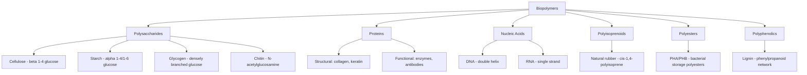

## Biopolymers

### Overview

Biopolymers are macromolecules synthesized by living organisms through enzyme-catalyzed biosynthetic pathways. They constitute the structural, functional, and informational macromolecules of biological systems and are classified chemically into three major families — polysaccharides, proteins, and nucleic acids — plus additional specialized classes such as polyesters and polyphenolic biopolymers. This topic addresses biopolymer chemistry in depth, complementing the broader natural-vs-synthetic polymer comparison covered elsewhere in this chapter.

### Polysaccharides

**General Structure**

Polysaccharides are polymers of monosaccharide units joined by glycosidic bonds, formed via condensation (loss of water) between the anomeric carbon of one sugar and a hydroxyl group of another. Linkage stereochemistry ($\alpha$ vs. $\beta$) and connectivity (e.g., $1\rightarrow4$, $1\rightarrow6$) critically determine three-dimensional structure and biological function.

- **Cellulose**: linear homopolymer of D-glucose linked exclusively by $\beta(1\rightarrow4)$ glycosidic bonds. The $\beta$-linkage forces successive glucose units to rotate 180° relative to each other, producing an extended, ribbon-like chain that packs into highly ordered, hydrogen-bonded microfibrils — the source of cellulose's high tensile strength and insolubility, and the structural basis of plant cell walls.
- **Starch**: a mixture of amylose (linear, $\alpha(1\rightarrow4)$-linked glucose, forming a helical conformation) and amylopectin (branched, with $\alpha(1\rightarrow6)$ branch points roughly every 24–30 glucose units). The $\alpha$-linkage allows a curved, helical conformation distinct from cellulose's extended form, and is readily hydrolyzed by $\alpha$-amylase — the basis of starch's role as a digestible energy-storage polysaccharide.
- **Glycogen**: structurally analogous to amylopectin but far more densely branched (branch points roughly every 8–12 units), maximizing the number of terminal ends accessible for rapid enzymatic glucose mobilization — suited to glycogen's role as the primary animal energy reserve.
- **Chitin**: linear polymer of N-acetyl-D-glucosamine linked by $\beta(1\rightarrow4)$ bonds, structurally analogous to cellulose with an acetamido group replacing one hydroxyl; forms the structural exoskeleton of arthropods and cell walls of fungi.
- **Glycosaminoglycans (GAGs)**, e.g., hyaluronic acid, chondroitin sulfate: linear, often highly charged (sulfated/carboxylated) polysaccharides found in connective tissue and extracellular matrix, contributing to hydration and mechanical cushioning through strong water-binding capacity.

### Proteins (Polypeptides)

**Primary Structure**

Proteins are condensation polymers of the 20 standard $\alpha$-amino acids, linked by amide (peptide) bonds formed between the carboxyl group of one residue and the amino group of the next, with loss of water:

$$\text{H}_2\text{N–CHR}_1\text{–COOH} + \text{H}_2\text{N–CHR}_2\text{–COOH} \longrightarrow \text{H}_2\text{N–CHR}_1\text{–CO–NH–CHR}_2\text{–COOH} + \text{H}_2\text{O}$$

The specific sequence of amino acid residues (primary structure) is genetically encoded and determines all higher levels of structure.

**Higher-Order Structure**

- **Secondary structure**: local, repeating conformations stabilized by backbone hydrogen bonding — the $\alpha$-helix and $\beta$-pleated sheet are the two principal motifs.
- **Tertiary structure**: the overall three-dimensional fold of a single polypeptide chain, stabilized by a combination of hydrophobic collapse, hydrogen bonding, ionic (salt-bridge) interactions, and covalent disulfide bonds between cysteine residues.
- **Quaternary structure**: the assembly of multiple polypeptide subunits into a functional multi-chain complex (e.g., hemoglobin's four subunits).

**Structural vs. Functional Proteins**

- *Structural*: collagen (triple-helical, the most abundant protein in mammals, providing tensile strength in connective tissue), keratin ($\alpha$-helical or $\beta$-sheet-rich, forming hair, nails, and horn, stabilized by extensive disulfide cross-linking), elastin (cross-linked, providing elastic recoil in tissues).
- *Functional*: enzymes (catalytic proteins, typically globular), transport proteins (e.g., hemoglobin), antibodies, and signaling proteins (e.g., hormones).

### Nucleic Acids

**Structure**

Nucleic acids (DNA and RNA) are condensation polymers of nucleotide monomers, each composed of a nitrogenous base, a pentose sugar (deoxyribose in DNA, ribose in RNA), and a phosphate group. Nucleotides are linked by phosphodiester bonds between the 3′-hydroxyl of one sugar and the 5′-phosphate of the next, forming a sugar-phosphate backbone with bases projecting outward.

- **DNA**: double-stranded helix; complementary base pairing (adenine–thymine via two hydrogen bonds, guanine–cytosine via three hydrogen bonds) between antiparallel strands stores and transmits genetic information.
- **RNA**: typically single-stranded, uses uracil in place of thymine, and the additional 2′-hydroxyl on ribose (absent in DNA's deoxyribose) makes RNA more chemically reactive and susceptible to hydrolysis; functions include messenger RNA (protein-coding template), ribosomal RNA (structural/catalytic component of ribosomes), and transfer RNA (amino acid delivery during translation).

### Other Biopolymer Classes

- **Natural rubber (cis-1,4-polyisoprene)**: biosynthesized from isopentenyl pyrophosphate via the mevalonate pathway in latex-producing plants; the exclusively *cis* configuration at each double bond prevents the tight chain packing seen in the *trans* isomer (gutta-percha), giving natural rubber its characteristic elastomeric, low-crystallinity behavior at room temperature.
- **Poly(hydroxyalkanoate)s (PHAs)**: linear polyesters (e.g., poly(3-hydroxybutyrate), PHB) synthesized and stored intracellularly by various bacteria as carbon/energy reserves under nutrient-limited conditions; of significant applied interest as biodegradable, bio-based substitutes for petrochemical plastics.
- **Lignin**: a complex, highly cross-linked polymer of phenylpropanoid units (formed via oxidative radical coupling of coumaryl, coniferyl, and sinapyl alcohols), providing rigidity and hydrophobicity to plant cell walls alongside cellulose and hemicellulose.

### Comparative Summary of Major Biopolymer Classes

| Class | Monomer Unit | Linkage | Primary Biological Role |
| --- | --- | --- | --- |
| Cellulose | $\beta$-D-glucose | $\beta(1\rightarrow4)$ glycosidic | Structural (plant cell wall) |
| Starch (amylose/amylopectin) | $\alpha$-D-glucose | $\alpha(1\rightarrow4)$, $\alpha(1\rightarrow6)$ glycosidic | Energy storage (plants) |
| Glycogen | $\alpha$-D-glucose | $\alpha(1\rightarrow4)$, $\alpha(1\rightarrow6)$ glycosidic | Energy storage (animals) |
| Chitin | N-acetylglucosamine | $\beta(1\rightarrow4)$ glycosidic | Structural (exoskeletons, fungal walls) |
| Proteins | Amino acids (20 types) | Peptide (amide) bond | Structural, catalytic, transport, regulatory |
| DNA/RNA | Nucleotides | Phosphodiester bond | Genetic information storage/transmission |
| Natural rubber | Isoprene (cis-1,4) | C–C (isoprenoid) | Latex/elastomeric defense in plants |
| PHAs | 3-hydroxyalkanoic acids | Ester bond | Bacterial carbon/energy storage |

### Biopolymer Classification Diagram

### Worked Example

**Example**

Explain, at the structural level, why cellulose is mechanically strong and indigestible by humans, while starch — built from the same glucose monomer — is readily digestible and used for energy storage.

Both polymers are built from D-glucose, but they differ in the stereochemistry of the glycosidic linkage. Cellulose uses exclusively $\beta(1\rightarrow4)$ linkages, which force each glucose unit to alternate orientation along the chain, producing a fully extended, linear conformation. These extended chains align in parallel and form extensive interchain and intrachain hydrogen bonding, packing into highly crystalline microfibrils that confer high tensile strength and chemical resistance. Humans lack the enzyme ($\beta$-glucosidase/cellulase) capable of hydrolyzing $\beta(1\rightarrow4)$ bonds, so cellulose passes through the human digestive tract largely intact (functioning as dietary fiber).

Starch (amylose) uses $\alpha(1\rightarrow4)$ linkages, which introduce a consistent bend at each glycosidic bond, causing the chain to coil into a helical conformation rather than an extended ribbon. This helical form does not pack as densely or crystallize as extensively as cellulose, and — critically — the $\alpha$-glycosidic bond is the specific substrate recognized and hydrolyzed by human salivary and pancreatic $\alpha$-amylase, releasing glucose for absorption. The single stereochemical difference at the anomeric carbon ($\alpha$ vs. $\beta$) is thus responsible for the dramatically different structural role and digestibility of these two chemically related polysaccharides.

### Applications

- **Cellulose**: paper and textiles (cotton, rayon), and as a raw material for semi-synthetic derivatives (cellulose acetate, nitrocellulose, carboxymethyl cellulose).
- **Starch**: food industry (thickeners, texturizers), and as feedstock for bioethanol production and biodegradable packaging materials.
- **Proteins**: biomedical materials (collagen-based scaffolds, gelatin), industrial enzymes (detergents, food processing), and biopharmaceuticals (therapeutic antibodies, recombinant insulin).
- **Nucleic acids**: biotechnology and molecular diagnostics (PCR, sequencing), gene therapy, and mRNA vaccine platforms.
- **PHAs**: biodegradable packaging and single-use plastic alternatives, and biomedical implants/sutures due to biocompatibility.
- **Chitin/chitosan** (deacetylated chitin derivative): wound dressings, water treatment (flocculants), and agricultural applications.

### Common Pitfalls and Misconceptions

- Assuming cellulose and starch differ chemically in monomer identity — they are both pure glucose polymers; the functional difference arises entirely from glycosidic bond stereochemistry ($\beta$ vs. $\alpha$).
- Treating "protein" and "enzyme" as synonyms — all enzymes (with the exception of catalytic RNAs, ribozymes) are proteins, but the majority of proteins are not enzymes.
- Assuming RNA's single-strandedness means it lacks secondary structure — RNA frequently folds back on itself to form extensive intramolecular base-paired secondary and tertiary structures (e.g., hairpins, stem-loops, as in tRNA and ribozymes).
- Overlooking that natural rubber's elastomeric properties depend specifically on its *cis* stereochemistry — the *trans* isomer (gutta-percha) is a rigid, semicrystalline, non-elastomeric material despite identical monomer connectivity.

**Related Topics**

- Natural and synthetic polymers (comparative classification)
- Protein structure determination (X-ray crystallography, NMR, cryo-EM)
- Enzyme catalysis and biochemical kinetics
- Carbohydrate chemistry and glycosidic bond formation/hydrolysis
- Nucleic acid chemistry and the central dogma of molecular biology
- Biodegradable polymer engineering (PLA, PHA, starch-based bioplastics)
- Polymer structure and physical properties (crystallinity, hydrogen bonding effects)