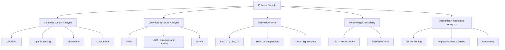

## Techniques for Characterizing Polymers

### Overview

Polymer characterization encompasses the analytical methods used to determine molecular weight and its distribution, chemical composition and structure, thermal transitions, crystallinity, and mechanical/rheological behavior. Because bulk polymer properties depend sensitively on these underlying molecular parameters, a combination of complementary techniques is typically required to fully characterize a given material.

### Molecular Weight Determination

**Gel Permeation Chromatography / Size Exclusion Chromatography (GPC/SEC)**

The most widely used method for determining molecular weight distribution. A dilute polymer solution is passed through a column packed with porous beads; smaller molecules penetrate more pores and are retained longer, while larger molecules are excluded from smaller pores and elute first. Detection (typically refractive index, UV, or light scattering) combined with column calibration against known standards (often polystyrene) yields $\bar{M}_n$, $\bar{M}_w$, and dispersity $Đ = \bar{M}_w/\bar{M}_n$.

- **Key Points**
  - Provides the full molecular weight distribution, not just an average.
  - Conventional calibration against standards (e.g., narrow-dispersity polystyrene) gives relative molecular weights unless the standard has the same hydrodynamic behavior as the analyte; true absolute values require additional detection.
  - Coupling with multi-angle light scattering (SEC-MALS) or viscometry detectors enables absolute molecular weight determination independent of column calibration, since light scattering intensity relates directly to molecular weight and concentration.

**Light Scattering (Static and Dynamic)**

Static light scattering (SLS) measures the angular dependence of scattered light intensity from a polymer solution, yielding absolute weight-average molecular weight, the second virial coefficient (a measure of polymer-solvent interaction quality), and radius of gyration, via the Zimm equation. Dynamic light scattering (DLS) measures intensity fluctuations arising from Brownian motion to determine the hydrodynamic radius and diffusion coefficient of polymer chains or particles in solution.

**Viscometry**

Dilute solution viscosity measurements determine intrinsic viscosity $[\eta]$, related to molecular weight through the Mark–Houwink equation:

$$[\eta] = K M^a$$

where $K$ and $a$ are empirical constants specific to a given polymer–solvent–temperature system, and $a$ (typically 0.5–0.8 for flexible coils in good solvents) reflects chain conformation and solvent quality. This method is comparatively simple and inexpensive but requires prior Mark–Houwink parameters for accurate absolute molecular weight determination.

**End-Group Analysis**

For polymers with a known, quantifiable number of chain-end functional groups (e.g., by titration or NMR integration), $\bar{M}_n$ can be calculated directly from the ratio of end-group concentration to sample mass. Most reliable for lower molecular weight polymers, since end-group concentration becomes vanishingly small (and thus harder to quantify accurately) at high molecular weight.

**Mass Spectrometry (MALDI-TOF)**

Matrix-assisted laser desorption/ionization time-of-flight mass spectrometry can resolve individual oligomer peaks for polymers of moderate molecular weight and narrow dispersity, providing highly precise mass and end-group information, though it becomes less reliable for high-molecular-weight or broadly disperse samples due to mass-dependent ionization/detection biases.

### Thermal Analysis

**Differential Scanning Calorimetry (DSC)**

Measures heat flow into or out of a sample as a function of temperature, relative to an inert reference. Key transitions identified include:

- **Glass transition ($T_g$)**: observed as a step change (not a peak) in baseline heat capacity, marking the onset of segmental chain mobility in amorphous regions.
- **Melting ($T_m$)**: an endothermic peak corresponding to the melting of crystalline regions; peak area gives the heat of fusion, from which percent crystallinity can be calculated by comparison to the heat of fusion of a 100% crystalline reference sample.
- **Crystallization ($T_c$)**: an exothermic peak observed on cooling (or sometimes on heating, "cold crystallization"), corresponding to chain ordering into crystallites.
- **Curing/cross-linking exotherms**: observed for thermosetting resins during network formation.

**Thermogravimetric Analysis (TGA)**

Measures sample mass as a function of temperature under controlled atmosphere (inert or oxidative), used to determine thermal stability, decomposition temperature(s), and composition of multi-component systems (e.g., filler content, residual solvent, moisture) from characteristic mass-loss steps.

**Dynamic Mechanical Analysis (DMA)**

Applies a small oscillatory mechanical stress to a sample while varying temperature or frequency, measuring storage modulus ($E'$, elastic/energy-storing response), loss modulus ($E''$, viscous/energy-dissipating response), and their ratio, $\tan\delta = E''/E'$ (damping factor). $T_g$ is often identified more sensitively by DMA (as a peak in $\tan\delta$ or a drop in $E'$) than by DSC, particularly for lightly cross-linked or filled systems.

### Spectroscopic Techniques

**Infrared Spectroscopy (FTIR)**

Identifies characteristic functional groups and chemical bonds via their vibrational absorption frequencies (e.g., C=O stretch near 1700–1750 cm⁻¹ for esters/carbonyls, N–H stretch near 3300 cm⁻¹ for amides). Widely used for polymer identification, monitoring reaction/cure progress, detecting oxidative degradation, and quantifying copolymer composition via characteristic band ratios.

**Nuclear Magnetic Resonance Spectroscopy (NMR)**

$^1$H and $^{13}$C NMR provide detailed information on chemical structure, copolymer composition, chain-end groups, and — critically for polymers — **tacticity** (stereoregularity), since isotactic, syndiotactic, and atactic triads/pentads produce resolvably distinct chemical shifts, especially in $^{13}$C spectra. Solid-state NMR extends structural analysis to insoluble or cross-linked polymers not amenable to solution-state methods.

**Ultraviolet-Visible Spectroscopy (UV-Vis)**

Used for polymers with chromophoric groups (e.g., conjugated or aromatic systems) to probe electronic transitions, monitor certain degradation processes, and quantify additive or chromophore content.

### Structural and Morphological Techniques

**X-ray Diffraction (XRD)**

Wide-angle X-ray scattering (WAXS) resolves crystalline reflections used to determine crystal structure, unit cell parameters, and percent crystallinity in semicrystalline polymers. Small-angle X-ray scattering (SAXS) probes larger length scales (nanometers to tens of nanometers), useful for characterizing lamellar spacing in semicrystalline polymers and microphase-separated domain structure in block copolymers.

**Microscopy**

- **Optical microscopy** (often with polarized light/crossed polarizers): visualizes spherulitic crystalline morphology in semicrystalline polymers via characteristic Maltese-cross birefringence patterns.
- **Scanning electron microscopy (SEM)**: surface and fracture-surface morphology at high resolution, widely used to assess fracture mode (brittle vs. ductile) and filler/fiber dispersion in composites.
- **Transmission electron microscopy (TEM)**: internal nanoscale morphology, including lamellar crystalline structure and block copolymer microdomains, typically requiring thin-sectioned and often stained samples for adequate contrast.
- **Atomic force microscopy (AFM)**: surface topography and, via phase-imaging modes, spatial mapping of local mechanical/viscoelastic property variation at the nanoscale.

### Mechanical Testing

**Tensile Testing**

A sample of standardized geometry is elongated at a controlled rate while force and displacement are recorded, yielding a stress–strain curve from which elastic modulus, yield strength, ultimate tensile strength, and elongation at break are extracted.

**Other Mechanical Tests**

- **Impact testing** (e.g., Izod, Charpy): measures energy absorbed during fracture under high-strain-rate impact loading, characterizing toughness/brittleness.
- **Hardness testing** (e.g., Shore A/D): measures resistance to indentation, commonly used for elastomers and rigid plastics respectively.
- **Rheology (rotational/oscillatory rheometry)**: characterizes melt or solution viscoelastic behavior — viscosity as a function of shear rate, and storage/loss moduli as a function of oscillation frequency — critical for understanding processability (extrusion, injection molding) and for probing molecular weight, branching, and entanglement structure indirectly through melt flow behavior.

### Comparative Summary of Key Techniques

| Technique | Primary Information | Typical Sample State |
| --- | --- | --- |
| GPC/SEC | Molecular weight distribution, $Đ$ | Dilute solution |
| Light scattering (SLS/DLS) | Absolute $M_w$, size, second virial coefficient | Dilute solution |
| DSC | $T_g$, $T_m$, $T_c$, heat of fusion, % crystallinity | Solid (bulk) |
| TGA | Thermal stability, decomposition, composition | Solid (bulk) |
| DMA | $T_g$, storage/loss modulus, $\tan\delta$ | Solid (bulk) |
| FTIR | Functional groups, composition, degradation | Solid, film, or solution |
| NMR | Chemical structure, tacticity, composition | Solution or solid-state |
| XRD (WAXS/SAXS) | Crystal structure, % crystallinity, nanoscale morphology | Solid (bulk) |
| SEM/TEM/AFM | Surface/internal morphology, nanostructure | Solid (bulk/thin section) |
| Tensile testing | Modulus, strength, elongation | Solid (standardized specimen) |
| Rheometry | Melt/solution viscosity, viscoelastic moduli | Melt or solution |

### Characterization Workflow Diagram

### Worked Example

**Example**

A polyethylene sample is analyzed by DSC and shows a melting endotherm with a measured heat of fusion $\Delta H_m = 140\ \text{J/g}$. The heat of fusion for 100% crystalline polyethylene is reported as $\Delta H_m^{\circ} = 293\ \text{J/g}$. Calculate the percent crystallinity of the sample.

$$\%\text{Crystallinity} = \frac{\Delta H_m}{\Delta H_m^{\circ}} \times 100\% = \frac{140}{293} \times 100\% \approx 47.8\%$$

This result would be consistent with a linear low-density or moderately branched polyethylene sample; a highly linear HDPE sample would typically show a higher heat of fusion and correspondingly higher calculated crystallinity, while highly branched LDPE would show a lower value — illustrating how DSC data connects quantitatively to the chain-architecture concepts discussed under polymer structure and physical properties.

### Applications

- **Quality control and batch consistency**: routine GPC and DSC checks ensure molecular weight and thermal properties meet specification across production batches.
- **Failure analysis**: SEM fractography and DMA/tensile testing diagnose the mechanical origin of in-service part failures.
- **Polymer synthesis research**: NMR and GPC together confirm successful controlled/living polymerization (narrow $Đ$, expected end groups) and copolymer composition.
- **Processing optimization**: rheometry data informs extrusion and injection-molding parameter selection by characterizing melt flow behavior.
- **Regulatory/compliance testing**: TGA and FTIR are used to verify material composition and filler/additive content against specifications.

### Common Pitfalls and Misconceptions

- Relying on a single technique (e.g., DSC alone) to fully characterize a polymer — thermal, structural, and mechanical properties are interdependent but not interchangeable measurements, and comprehensive characterization typically requires several complementary methods.
- Treating conventional GPC molecular weights (calibrated against polystyrene standards) as absolute values for chemically dissimilar polymers — without a universal calibration or light-scattering detector, reported values are relative to the standard's hydrodynamic behavior, not necessarily the true molecular weight of the analyte.
- Confusing $T_g$ observed by DSC with $T_g$ observed by DMA — the two can differ by several to over ten degrees because they probe different physical manifestations (heat capacity change vs. mechanical relaxation) and depend on measurement frequency/heating rate; [Inference: the specific magnitude of this discrepancy is sample- and instrument-dependent and should not be treated as a fixed offset].
- Assuming heat of fusion directly and linearly reflects only crystallinity — sample thermal history, prior processing, and even instrument calibration can also influence measured DSC transitions.

**Related Topics**

- Polymer structure and physical properties
- Addition and condensation polymerization mechanisms
- X-ray diffraction and crystallography (WAXS/SAXS fundamentals)
- Nuclear magnetic resonance spectroscopy principles
- Rheology and viscoelasticity of polymer melts
- Copolymer composition and microstructure analysis
- Polymer degradation and stability testing