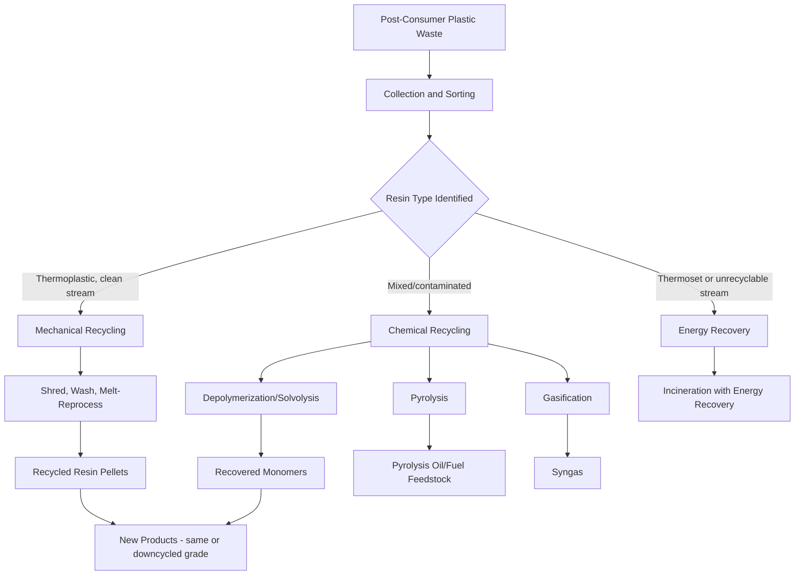

## Applications and Recycling of Polymers

### Overview

Polymers underpin an enormous range of industrial, consumer, medical, and technological applications due to their tunable mechanical, thermal, and chemical properties. Their widespread use, however, has created significant end-of-life management challenges, driving the development of recycling technologies and codified classification systems to support material recovery and circular-economy strategies.

### Major Application Sectors

**Packaging**

The largest single-volume application of commodity plastics. Polyethylene (LDPE, HDPE, LLDPE) is used for films, bags, and bottles; polyethylene terephthalate (PET) for beverage bottles and food containers; polypropylene (PP) for rigid containers and caps; polystyrene (PS) for foam packaging and disposable containers.

**Construction and Building Materials**

Poly(vinyl chloride) (PVC) is extensively used for pipes, window frames, and siding due to its rigidity, weather resistance, and flame retardancy; polyurethane foams provide thermal insulation; epoxy and polyester thermosets are used in composite structural panels and coatings.

**Automotive and Transportation**

Engineering thermoplastics (polycarbonate, nylon, ABS) and fiber-reinforced composites (epoxy/glass or carbon fiber) are used for lightweight structural and interior components, reducing vehicle mass and improving fuel efficiency; elastomers (synthetic rubbers) remain essential for tires, seals, and gaskets.

**Textiles and Fibers**

Polyester (PET) and nylon dominate synthetic fiber production for clothing, carpets, and industrial textiles; acrylic fibers substitute for wool in some applications; aramid fibers (e.g., Kevlar) provide high-performance, high-strength applications such as body armor and protective equipment.

**Electronics**

Polymers serve as insulators, encapsulants, and structural housings; specialized polymers (e.g., polyimides) provide high thermal stability for flexible circuit substrates; conductive polymers (e.g., PEDOT:PSS, polyaniline) enable applications in organic electronics and antistatic coatings.

**Biomedical Applications**

Biocompatible and biodegradable polymers (PLA, PGA, PLGA, PCL) are used for sutures, drug-delivery systems, and tissue-engineering scaffolds; hydrogels (cross-linked hydrophilic polymer networks) are used in contact lenses and wound dressings; PMMA and silicone polymers are used in medical devices and implants.

**Agriculture**

Mulch films, greenhouse coverings, and controlled-release fertilizer coatings utilize polyethylene and, increasingly, biodegradable polymer formulations to reduce field plastic accumulation.

### Resin Identification Codes

The Society of the Plastics Industry (SPI) resin identification code system assigns numbers 1–7 (typically within a triangular chasing-arrows symbol) to common plastic types, primarily to aid sorting for recycling — the presence of this code does not by itself indicate that a given material stream is actually recyclable in a particular municipality.

| Code | Abbreviation | Polymer | Common Applications |
| --- | --- | --- | --- |
| 1 | PET/PETE | Poly(ethylene terephthalate) | Beverage bottles, food containers |
| 2 | HDPE | High-density polyethylene | Milk jugs, detergent bottles, pipe |
| 3 | PVC | Poly(vinyl chloride) | Pipes, window frames, some packaging |
| 4 | LDPE | Low-density polyethylene | Plastic bags, film wrap |
| 5 | PP | Polypropylene | Bottle caps, food containers, automotive parts |
| 6 | PS | Polystyrene | Foam packaging, disposable cutlery |
| 7 | Other | Mixed/other (e.g., PC, PLA, multilayer) | Varies widely |

### Recycling Approaches

**Mechanical (Primary/Secondary) Recycling**

Involves sorting, cleaning, shredding, and melt-reprocessing of thermoplastic waste into new products, either as the same material grade (primary) or downcycled into lower-grade applications (secondary, e.g., textile fibers, plastic lumber). This is the most widely implemented recycling route for PET and HDPE but is limited by:

- Progressive molecular weight reduction and property degradation with each reprocessing cycle, due to chain scission from thermal, mechanical, and hydrolytic stress during melt processing.
- Contamination sensitivity — mixed polymer streams or residual contaminants (food residue, labels, other resin types) degrade the quality of recycled output.
- Thermosets and heavily cross-linked polymers cannot be melt-reprocessed at all, since their network structure does not melt (only decomposes) on heating.

**Chemical (Tertiary) Recycling**

Breaks polymer chains down into monomers or smaller molecular fragments via chemical reactions, which can then be re-polymerized or used as chemical feedstocks. Approaches include:

- **Depolymerization/solvolysis**: e.g., glycolysis, methanolysis, or hydrolysis of PET back to its monomers (terephthalic acid/dimethyl terephthalate and ethylene glycol), enabling theoretically indefinite recyclability without progressive quality loss, since the process regenerates virgin-quality monomer.
- **Pyrolysis**: thermal decomposition in the absence of oxygen, breaking polymer chains into a mixture of shorter hydrocarbons (pyrolysis oil, gases, char) usable as fuel or chemical feedstock; applicable to a broader range of mixed/contaminated polymer waste than depolymerization but generally yields a less well-defined product slate.
- **Gasification**: high-temperature conversion into syngas (CO + H₂) for chemical synthesis or energy recovery.

**Energy Recovery (Quaternary Recycling)**

Incineration of polymer waste with recovery of the released heat as energy, generally considered the least resource-efficient recycling route since the carbon-based material value is fully consumed rather than being recovered as material; used primarily for waste streams unsuitable for mechanical or chemical recycling.

**Biodegradation-Based Approaches**

Applicable to inherently biodegradable polymers (e.g., PLA, PHA, starch-based bioplastics under industrial composting conditions) or to conventional polymers deliberately engineered with additives to promote environmental breakdown; effectiveness is strongly dependent on specific environmental conditions (temperature, moisture, microbial community), and biodegradability claims require standardized testing (e.g., under defined composting protocols) rather than general assumption. [Inference: the practical effectiveness of many "biodegradable" or "compostable" products outside controlled industrial composting facilities remains a subject of active study and regulatory scrutiny.]

### Recycling Process Flow Diagram

### Worked Example

**Example**

Explain why PET (resin code 1) is one of the most successfully recycled plastics, while thermosetting polyurethane foam is generally not mechanically recyclable, in terms of their underlying polymer chemistry.

PET is a linear, step-growth-synthesized thermoplastic polyester with no covalent cross-links between chains. Because its ester linkages are hydrolytically and chemically cleavable, PET can undergo either mechanical recycling (melt-reprocessing, since it has a well-defined melting behavior as a semicrystalline thermoplastic) or, more advantageously, chemical depolymerization (glycolysis/methanolysis) back to its constituent monomers, terephthalic acid/dimethyl terephthalate and ethylene glycol, which can be re-polymerized to virgin-quality PET without cumulative property loss.

Thermosetting polyurethane foam, by contrast, is formed by a step-growth reaction between polyols and diisocyanates that produces an extensively cross-linked three-dimensional network. This network has no melting transition — heating leads to thermal decomposition rather than melt flow — so conventional mechanical (melt) recycling is not applicable. Because the cross-linked network cannot simply be re-melted or dissolved and reshaped, closed-loop recycling of thermoset polyurethane requires more complex chemical approaches (e.g., glycolysis of the urethane linkages to recover polyol fragments), which are considerably less mature and less widely implemented industrially than PET depolymerization routes. [Inference: the maturity and economic viability of specific thermoset chemical recycling routes vary significantly and continue to develop, so this comparison reflects general trends rather than a fixed, permanent technological gap.]

### Environmental Considerations

- **Persistence and microplastics**: conventional commodity plastics resist environmental biodegradation and can fragment into microplastics (particles <5 mm) through mechanical and photo-oxidative weathering, raising concerns regarding accumulation in marine and terrestrial ecosystems.
- **Life-cycle assessment (LCA)**: a systematic framework for quantifying the cumulative environmental impact (energy use, emissions, resource depletion) of a polymer product across its full life cycle, from raw material extraction through production, use, and end-of-life management — used to compare recycling routes, bio-based alternatives, and conventional materials on a consistent basis.
- **Design for recyclability**: increasingly emphasized in product design, favoring mono-material construction (avoiding difficult-to-separate multilayer or multi-resin composites), minimizing additive/colorant content that complicates recycling streams, and selecting resins with established, mature recycling infrastructure.

### Applications of Recycling-Derived Materials

- **rPET (recycled PET)**: used extensively in beverage bottles (including food-contact-grade applications following appropriate purification), polyester textile fiber, and strapping.
- **Recycled HDPE/LDPE**: used in plastic lumber, drainage pipe, and non-food-contact packaging.
- **Pyrolysis oil**: used as a chemical feedstock for producing new virgin-quality monomers or as a fuel substitute, particularly for mixed or contaminated plastic waste streams unsuitable for mechanical recycling.
- **Recovered PHA/PLA compost products**: soil amendment applications following industrial composting of biodegradable packaging waste.

### Common Pitfalls and Misconceptions

- Assuming the resin identification code number (1–7) directly indicates actual recyclability in a given locality — it identifies resin type only; actual recyclability depends on local collection infrastructure, market demand for the recovered material, and contamination levels.
- Assuming all recycling routes are equally environmentally beneficial — mechanical, chemical, and energy-recovery routes differ substantially in resource efficiency and should be evaluated via life-cycle assessment rather than treated as interchangeable.
- Confusing "biodegradable," "compostable," and "bio-based" as synonymous terms — each describes a distinct, independent property (see the natural and synthetic polymers topic for further discussion of this distinction).
- Assuming mechanical recycling can be repeated indefinitely without quality loss — progressive chain scission during each melt-reprocessing cycle generally degrades molecular weight and mechanical properties over successive cycles, limiting the practical number of mechanical recycling loops for a given material.

**Related Topics**

- Natural and synthetic polymers (biodegradability and bio-based origin distinctions)
- Polymer structure and physical properties (relationship to processability and degradation)
- Addition and condensation polymerization mechanisms (relevance to depolymerization routes)
- Thermoplastic vs. thermoset polymer chemistry
- Life-cycle assessment methodology
- Microplastic formation and environmental fate
- Green chemistry principles in polymer design