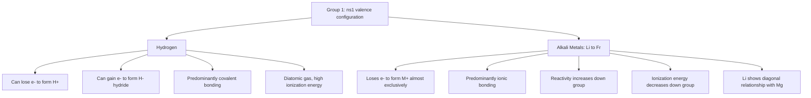

## Hydrogen and the Alkali Metals

### Overview

Hydrogen and the alkali metals (Group 1 of the periodic table: Li, Na, K, Rb, Cs, Fr) share the characteristic of possessing a single electron in their outermost $ns^1$ configuration, but this superficial similarity masks substantial chemical differences. Hydrogen occupies a unique, somewhat anomalous position in the periodic table, exhibiting behavior that overlaps with both Group 1 and Group 17 elements, while the alkali metals form a highly regular, well-behaved family exemplifying periodic trends across a group.

### Hydrogen: Position and Properties

**Electronic Configuration and Periodic Placement**

Hydrogen has the electron configuration $1s^1$, giving it, like the alkali metals, a single valence electron and the capacity to lose that electron to form a $+1$ cation ($\text{H}^+$). However, hydrogen's ionization energy (1312 kJ/mol) is far higher than any alkali metal's (Li: 520 kJ/mol, decreasing down the group), and hydrogen can also gain one electron to complete a stable duet ($1s^2$), forming the hydride ion $\text{H}^-$, isoelectronic with helium — a reactivity mode with no alkali metal counterpart. This dual behavior (cation- or anion-forming) is why hydrogen is sometimes placed above Group 17 (halogens) in some periodic table presentations, in addition to or instead of its conventional Group 1 position.

**Forms of Elemental Hydrogen**

- **Diatomic gas ($\text{H}_2$)**: the standard form under ordinary conditions, held together by a strong covalent single bond (bond dissociation energy ≈ 436 kJ/mol).
- **Isotopes**: protium ($^1\text{H}$, no neutrons, >99.98% natural abundance), deuterium ($^2\text{H}$ or D, one neutron), and tritium ($^3\text{H}$ or T, two neutrons, radioactive). The substantial relative mass difference between isotopes gives rise to measurable kinetic isotope effects in reactions involving H–X bond cleavage.

**Hydrogen Bonding Types**

- $\text{H}^+$ (proton): essentially a bare proton in the gas phase; in solution, always associated with a base (e.g., as hydronium, $\text{H}_3\text{O}^+$), since a bare proton's extremely high charge density precludes independent existence in condensed phases.
- $\text{H}^-$ (hydride): a strong reducing agent and strong Brønsted base, found in ionic hydrides of the alkali and alkaline earth metals (e.g., $\text{NaH}$, $\text{CaH}_2$).
- Covalent hydrogen: forms a single covalent bond in the vast majority of its compounds (e.g., $\text{H}_2\text{O}$, $\text{CH}_4$, $\text{HCl}$), reflecting its typical bonding mode across organic and inorganic chemistry.

**Industrial Production and Uses**

Hydrogen is produced industrially primarily by steam reforming of methane ($\text{CH}_4 + \text{H}_2\text{O} \rightarrow \text{CO} + 3\text{H}_2$, "grey/blue hydrogen" depending on carbon capture) or by electrolysis of water ("green hydrogen" when powered by renewable electricity). Major applications include ammonia synthesis via the Haber process, petroleum refining (hydrocracking, hydrodesulfurization), and increasingly as a potential energy carrier/fuel for fuel cells.

### Alkali Metals: General Characteristics

**Electronic Configuration**

All alkali metals share the valence configuration $ns^1$ (Li: $[\text{He}]2s^1$, Na: $[\text{Ne}]3s^1$, K: $[\text{Ar}]4s^1$, etc.), with the single, loosely held valence electron accounting for their high reactivity and near-universal $+1$ oxidation state in compounds.

**Physical Properties and Trends**

| Property | Trend Down the Group | Explanation |
| --- | --- | --- |
| Atomic radius | Increases | Additional electron shells outweigh increasing nuclear charge |
| Ionization energy | Decreases | Valence electron further from nucleus, more shielded, more easily removed |
| Melting/boiling point | Decreases | Weaker metallic bonding as atomic size increases and valence electron density decreases |
| Density | Generally increases (with irregularities) | Increasing atomic mass outweighs increasing atomic volume, though not perfectly monotonically |
| Reactivity | Increases | Lower ionization energy facilitates electron loss and reaction with other species |

All alkali metals are soft (cuttable with a knife), low-density metals (Li, Na, and K are less dense than water), with low melting points that decrease from lithium (180.5 °C) to cesium (28.4 °C).

**Reactivity**

- **With water**: $2\text{M}(s) + 2\text{H}_2\text{O}(l) \rightarrow 2\text{MOH}(aq) + \text{H}_2(g)$, producing a strongly basic hydroxide solution and hydrogen gas; the vigor of this reaction increases markedly down the group (lithium reacts steadily, sodium reacts vigorously, potassium ignites the liberated hydrogen, and rubidium/cesium react explosively) due to decreasing ionization energy.
- **With oxygen**: differs by element — lithium forms the simple oxide $\text{Li}_2\text{O}$; sodium forms predominantly the peroxide $\text{Na}_2\text{O}_2$; potassium, rubidium, and cesium form predominantly the superoxide $\text{MO}_2$ under normal combustion conditions in air. This trend reflects the increasing stability of larger, more polarizable anions (peroxide, superoxide) when paired with larger, less polarizing cations — a manifestation of ionic size-matching effects related to lattice energy.
- **With halogens**: direct combination to form ionic halides, $2\text{M} + \text{X}_2 \rightarrow 2\text{MX}$.
- **With hydrogen**: direct combination on heating to form ionic (saline) hydrides, $2\text{M} + \text{H}_2 \rightarrow 2\text{MH}$, containing the hydride ion $\text{H}^-$.

**Flame Test Colors**

Alkali metal ions produce characteristic flame colors arising from electronic transitions of the valence electron when thermally excited: lithium (crimson red), sodium (persistent bright yellow, from the well-known 589 nm sodium D-line emission), potassium (lilac/pale violet), rubidium (red-violet), and cesium (blue-violet) — a diagnostic qualitative test for these cations.

### Alkali Metal Compounds

**Hydroxides ($\text{MOH}$)**

Strong bases, fully dissociating in water; solubility and basicity generally increase down the group. Sodium hydroxide (caustic soda) is produced industrially by the chlor-alkali process (electrolysis of concentrated brine).

**Oxides, Peroxides, and Superoxides**

$\text{Li}_2\text{O}$ (normal oxide, $\text{O}^{2-}$), $\text{Na}_2\text{O}_2$ (peroxide, $\text{O}_2^{2-}$), $\text{KO}_2$/$\text{RbO}_2$/$\text{CsO}_2$ (superoxide, $\text{O}_2^-$). Potassium superoxide is notably used in some self-contained breathing apparatus and life-support systems, since it reacts with exhaled $\text{CO}_2$ and moisture to regenerate oxygen: $4\text{KO}_2 + 2\text{CO}_2 \rightarrow 2\text{K}_2\text{CO}_3 + 3\text{O}_2$.

**Halides**

All alkali metal halides are ionic solids with high melting points, generally water-soluble (with lithium fluoride, $\text{LiF}$, being a notable low-solubility exception due to the particularly high lattice energy arising from the close size match of $\text{Li}^+$ and $\text{F}^-$).

**Carbonates and Bicarbonates**

Sodium carbonate ($\text{Na}_2\text{CO}_3$, soda ash) and sodium bicarbonate ($\text{NaHCO}_3$, baking soda) are industrially significant compounds produced via the Solvay process; unlike most alkali metal carbonates, lithium carbonate ($\text{Li}_2\text{CO}_3$) has notably lower solubility, again reflecting lithium's distinctive size-related behavior within the group.

### The Anomalous Behavior of Lithium

Lithium, as the first member of Group 1, exhibits a well-documented "diagonal relationship" with magnesium (Group 2), displaying several properties atypical of the rest of the alkali metal group:

- Forms a covalent-character-influenced organolithium chemistry more extensively than other alkali metals (e.g., $n$-butyllithium is a common synthetic reagent), reflecting lithium's small size and correspondingly higher polarizing power/charge density.
- $\text{Li}_2\text{CO}_3$ and $\text{LiF}$ are markedly less water-soluble than their heavier Group 1 counterparts.
- Reacts directly with atmospheric nitrogen on heating to form lithium nitride, $6\text{Li} + \text{N}_2 \rightarrow 2\text{Li}_3\text{N}$, a reaction not observed for the other alkali metals under comparable conditions.
- Forms only the simple oxide ($\text{Li}_2\text{O}$) rather than peroxide or superoxide under normal combustion, unlike its heavier group congeners.

This behavior is attributed to lithium's small ionic radius and correspondingly high charge density, which increases covalent character in its bonding and produces higher lattice energies for its compounds compared to trends predicted by simple extrapolation from the rest of the group.

### Comparative Summary: Hydrogen vs. Alkali Metals

| Feature | Hydrogen | Alkali Metals |
| --- | --- | --- |
| Valence configuration | $1s^1$ | $ns^1$ |
| Common oxidation states | $+1$ and $-1$ | $+1$ only (essentially universal) |
| Elemental form (standard conditions) | Diatomic gas, $\text{H}_2$ | Solid metals |
| Ionization energy | High (1312 kJ/mol) | Low, decreasing down group |
| Electronegativity | Moderate (2.20, Pauling scale) | Low, decreasing down group |
| Bonding in compounds | Predominantly covalent | Predominantly ionic |
| Reactivity with water | $\text{H}_2$ itself does not react with water under ordinary conditions | Vigorous to explosive reaction, releasing $\text{H}_2$ |

### Periodic Trends Diagram

### Worked Example

**Example**

Explain, using ionization energy and lattice energy concepts, why lithium's reaction with water is markedly less vigorous than potassium's, despite both being alkali metals that undergo the same overall reaction type.

The overall reaction is $2\text{M}(s) + 2\text{H}_2\text{O}(l) \rightarrow 2\text{MOH}(aq) + \text{H}_2(g)$ for both metals. Lithium's first ionization energy (520 kJ/mol) is substantially higher than potassium's (419 kJ/mol) because lithium's valence electron is closer to the nucleus and experiences less electron shielding from inner shells, making it more strongly held. This higher ionization energy means more energy input is required to initiate electron loss and cation formation, contributing to a slower observed reaction rate for lithium.

Additionally, lithium's small ionic radius gives it a high charge density, which results in a strong lattice energy contribution and strong hydration enthalpy that helps compensate energetically for its higher ionization energy overall (lithium's reaction with water is thermodynamically favorable and exothermic, just as it is for potassium). However, the *kinetics* of the reaction — governed substantially by the ease of electron transfer at the metal surface, related to the lower ionization energy — become progressively faster down the group. Potassium's lower ionization energy allows more rapid electron transfer to water, and the heat released is sufficient to ignite the hydrogen gas produced, whereas lithium's reaction, while still exothermic, proceeds without ignition under normal conditions. [Inference: the precise balance of kinetic and thermodynamic factors governing the reactivity trend is a well-established qualitative trend in inorganic chemistry, though a fully quantitative rate-determining analysis involves additional factors such as surface oxide layer effects and reaction exothermicity localized at the reacting surface.]

### Applications

- **Hydrogen**: ammonia synthesis (Haber process) for fertilizer production, petroleum refining, hydrogenation of unsaturated fats/oils, emerging fuel-cell and energy-storage technologies.
- **Lithium**: lithium-ion battery electrodes (as $\text{LiCoO}_2$, $\text{LiFePO}_4$, etc.), certain psychiatric medications (lithium carbonate as a mood stabilizer), specialty glass and ceramics, and organolithium reagents in synthetic organic chemistry.
- **Sodium**: sodium hydroxide (chlor-alkali industry, soap/detergent manufacture), sodium chloride (food preservation, de-icing), sodium vapor lamps (street lighting, exploiting the characteristic yellow emission).
- **Potassium**: potassium chloride and other potassium salts as agricultural fertilizers, potassium hydroxide in alkaline battery electrolytes and soap manufacture.
- **Cesium**: cesium atomic clocks (the SI second is defined via the cesium-133 hyperfine transition frequency), photoelectric cell applications.

### Common Pitfalls and Misconceptions

- Assuming hydrogen "belongs" unambiguously to Group 1 in a chemical sense — while positioned there by electron configuration, its ionization energy, electronegativity, and bonding behavior differ substantially from true alkali metals, and it exhibits some halogen-like ($\text{H}^-$-forming) character as well.
- Assuming all alkali metal oxidation products with oxygen are simple oxides — the specific product (oxide, peroxide, or superoxide) depends systematically on cation size and is an important, frequently tested trend.
- Overgeneralizing alkali metal behavior from sodium alone without recognizing lithium's distinctive "diagonal relationship" anomalies relative to the rest of the group.
- Confusing reaction vigor (kinetics, e.g., with water) with thermodynamic favorability (all alkali metal-water reactions are strongly exothermic) — the observed trend in violence of reaction reflects primarily kinetic factors, not a trend in reaction thermodynamics alone.

**Related Topics**

- Periodic trends: ionization energy, atomic radius, electronegativity
- The alkaline earth metals (Group 2) and the diagonal relationship
- Ionic vs. covalent bonding and lattice energy
- The Haber process and industrial nitrogen fixation
- Electrochemistry and battery technology (lithium-ion systems)
- Flame tests and atomic emission spectroscopy
- The chlor-alkali and Solvay industrial processes