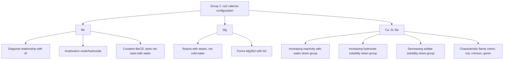

## The Alkaline Earth Metals

### Overview

The alkaline earth metals comprise Group 2 of the periodic table: beryllium (Be), magnesium (Mg), calcium (Ca), strontium (Sr), barium (Ba), and radium (Ra). All possess the valence electron configuration $ns^2$ and characteristically form $+2$ cations, giving rise to a chemistry dominated by ionic bonding, though with systematic exceptions — particularly beryllium — arising from size and charge-density effects analogous to those seen for lithium within Group 1.

### Electronic Configuration and General Trends

**Valence Configuration**

Each alkaline earth metal has a filled $ns^2$ outer shell (Be: $[\text{He}]2s^2$, Mg: $[\text{Ne}]3s^2$, Ca: $[\text{Ar}]4s^2$, etc.). Loss of both valence electrons to form the $\text{M}^{2+}$ cation achieves a stable noble-gas configuration, accounting for the near-universal $+2$ oxidation state throughout the group.

**Periodic Trends**

| Property | Trend Down the Group | Explanation |
| --- | --- | --- |
| Atomic radius | Increases | Additional electron shells outweigh increasing nuclear charge |
| First and second ionization energy | Decreases | Valence electrons further from nucleus, more shielded |
| Melting/boiling point | Generally decreases (with some irregularity) | Metallic bond strength trends complicated by differing crystal structures across the group |
| Reactivity | Increases | Lower ionization energies favor cation formation |
| Density | Generally increases | Increasing atomic mass outweighs increasing atomic volume |

**Comparison with Alkali Metals**

For a given period, alkaline earth metals have smaller atomic radii, higher ionization energies, and higher melting points than the corresponding alkali metal, because the increased nuclear charge across the period pulls the valence shell in more tightly while both elements' valence electrons occupy the same principal shell. Consequently, alkaline earth metals are harder, denser, and less reactive than their alkali metal neighbors, though still substantially more reactive than most transition metals.

### Reactivity

**With Water**

Reactivity with water increases markedly down the group, mirroring the alkali metal trend but shifted to lower overall vigor at each corresponding period:

- Beryllium does not react with water even at red heat, due to a combination of high ionization energy and a passivating surface oxide layer.
- Magnesium reacts very slowly with cold water but reacts readily with steam: $\text{Mg}(s) + \text{H}_2\text{O}(g) \rightarrow \text{MgO}(s) + \text{H}_2(g)$.
- Calcium, strontium, and barium react with cold water at increasing rates: $\text{M}(s) + 2\text{H}_2\text{O}(l) \rightarrow \text{M(OH)}_2(aq) + \text{H}_2(g)$, with calcium reacting steadily and barium reacting vigorously.

**With Oxygen**

All alkaline earth metals react with oxygen to form the simple oxide, $2\text{M} + \text{O}_2 \rightarrow 2\text{MO}$, though heavier members (Sr, Ba) can also form peroxides ($\text{MO}_2$) under an oxygen atmosphere at elevated pressure, paralleling (though less pronounced than) the peroxide/superoxide trend seen in the alkali metals.

**With Nitrogen**

Magnesium, like lithium, reacts directly with atmospheric nitrogen on heating to form the nitride: $3\text{Mg} + \text{N}_2 \rightarrow \text{Mg}_3\text{N}_2$ — this shared reactivity with $\text{N}_2$ is one of several features linking lithium and magnesium via the diagonal relationship (discussed below).

**With Acids**

All alkaline earth metals (with beryllium reacting more slowly due to its protective oxide layer) react with dilute acids to liberate hydrogen gas: $\text{M}(s) + 2\text{HCl}(aq) \rightarrow \text{MCl}_2(aq) + \text{H}_2(g)$.

**Flame Test Colors**

Calcium (brick-red/orange-red), strontium (crimson red), and barium (apple/pale green) produce characteristic flame colors from electronic transitions, used diagnostically; beryllium and magnesium do not produce a useful flame color under standard test conditions.

### Solubility Trends of Key Compounds

**Hydroxides**

Solubility and basic strength of $\text{M(OH)}_2$ increase down the group: $\text{Be(OH)}_2$ and $\text{Mg(OH)}_2$ are only sparingly soluble (Mg(OH)₂ is the active ingredient in "milk of magnesia," a mild antacid/laxative exploiting its low solubility and mild basicity), while $\text{Ca(OH)}_2$ (slaked lime) is moderately soluble, and $\text{Ba(OH)}_2$ is appreciably more soluble, behaving as a strong base in solution.

**Sulfates**

Solubility of $\text{MSO}_4$ *decreases* down the group — the opposite trend to the hydroxides. $\text{MgSO}_4$ is water-soluble (Epsom salt is the heptahydrate, $\text{MgSO}_4\cdot 7\text{H}_2\text{O}$), while $\text{CaSO}_4$ is only slightly soluble, and $\text{SrSO}_4$/$\text{BaSO}_4$ are essentially insoluble. This inverse trend (relative to hydroxides) reflects the differing balance between lattice energy and hydration enthalpy as cation size increases for anions of different size and charge — for the small, highly charged sulfate anion, lattice energy remains large even as the cation grows, so solubility decreases; for the smaller hydroxide anion, the trend runs the other way.

**Carbonates**

All Group 2 carbonates are essentially insoluble in water and undergo thermal decomposition to the oxide and $\text{CO}_2$ on heating: $\text{MCO}_3 \xrightarrow{\Delta} \text{MO} + \text{CO}_2$. Thermal stability of the carbonate (resistance to decomposition, i.e., higher decomposition temperature required) *increases* down the group, correlating with increasing cation size and correspondingly weaker polarization of the carbonate anion by the larger, less charge-dense cation.

### The Diagonal Relationship: Beryllium and Aluminum

Beryllium, as the first member of Group 2, shows a pronounced "diagonal relationship" with aluminum (Group 13) rather than close similarity to the rest of Group 2, analogous to lithium's relationship with magnesium:

- Beryllium compounds are substantially more covalent than those of other Group 2 elements, due to beryllium's very high charge density ($\text{Be}^{2+}$ is exceptionally small and highly polarizing).
- Beryllium oxide ($\text{BeO}$) and beryllium hydroxide ($\text{Be(OH)}_2$), like the corresponding aluminum compounds, are amphoteric — reacting with both acids and bases — unlike the other Group 2 oxides/hydroxides, which are exclusively basic.
- $\text{BeCl}_2$ exists as a covalent, polymeric/dimeric structure in the solid and vapor phase (rather than a simple ionic lattice), again paralleling aluminum chloride's dimeric covalent behavior ($\text{Al}_2\text{Cl}_6$).
- Both beryllium and aluminum form protective, adherent surface oxide layers that confer kinetic (though not thermodynamic) resistance to further oxidation/corrosion.

### Comparative Summary: Group 1 vs. Group 2

| Feature | Alkali Metals (Group 1) | Alkaline Earth Metals (Group 2) |
| --- | --- | --- |
| Valence configuration | $ns^1$ | $ns^2$ |
| Common oxidation state | $+1$ | $+2$ |
| Ionization energy (same period) | Lower | Higher |
| Atomic/ionic radius (same period) | Larger | Smaller |
| Reactivity (same period) | Higher | Lower |
| Hydroxide solubility trend | Increases down group | Increases down group (but Be/Mg hydroxides notably less soluble) |
| First-member anomaly | Li (diagonal relationship with Mg) | Be (diagonal relationship with Al) |

### Periodic and Solubility Trends Diagram

### Worked Example

**Example**

Explain why magnesium hydroxide, $\text{Mg(OH)}_2$, is only sparingly soluble in water and functions as a mild antacid, while barium hydroxide, $\text{Ba(OH)}_2$, is appreciably soluble and behaves as a strong base.

Solubility of an ionic hydroxide depends on the balance between the lattice energy holding the ionic solid together and the hydration enthalpy released when the ions are solvated. For the relatively small hydroxide anion ($\text{OH}^-$), lattice energy is dominated primarily by cation size: $\text{Mg}^{2+}$ is small and highly charge-dense, giving $\text{Mg(OH)}_2$ a large lattice energy that is not fully compensated by hydration enthalpy, resulting in low solubility. This low solubility is precisely why magnesium hydroxide is suitable as a mild antacid ("milk of magnesia") — it exists largely as an undissolved suspension, releasing $\text{OH}^-$ gradually to neutralize excess stomach acid without producing the sudden, potentially damaging pH shift a fully soluble strong base would cause.

$\text{Ba}^{2+}$ is substantially larger than $\text{Mg}^{2+}$, resulting in weaker electrostatic attraction to the hydroxide anions and a correspondingly lower lattice energy. Because the reduction in lattice energy going down the group is proportionally larger than the reduction in hydration enthalpy for the larger cation, the net solubility increases down the group — $\text{Ba(OH)}_2$ dissolves appreciably and dissociates essentially completely in solution, behaving as a strong base suitable for laboratory titration standardization use.

### Applications

- **Beryllium**: aerospace and X-ray window applications (low atomic number gives high X-ray transparency), specialty alloys (beryllium-copper) prized for hardness and non-sparking properties; toxicity (berylliosis risk from inhaled beryllium dust/fumes) significantly restricts handling and applications.
- **Magnesium**: lightweight structural alloys (aerospace, automotive), Grignard reagents in organic synthesis, dietary supplementation and antacid/laxative formulations (Mg(OH)₂, MgSO₄), chlorophyll (the central coordinating metal in the chlorophyll porphyrin ring, essential to photosynthesis).
- **Calcium**: structural material in construction (as calcium carbonate/limestone, and via cement/concrete production using calcium silicates), biological applications (bone and tooth mineral as calcium hydroxyapatite, essential dietary nutrient), calcium oxide (quicklime) and calcium hydroxide (slaked lime) in construction and water treatment.
- **Strontium**: red flame-color pyrotechnics (fireworks, flares), strontium ranelate historically used in osteoporosis treatment [Inference: current pharmaceutical use and regulatory status of strontium ranelate has evolved and specific current guidance should be verified against up-to-date clinical sources].
- **Barium**: barium sulfate as a radiocontrast agent for gastrointestinal imaging (exploiting its extreme insolubility, since soluble barium salts are toxic, while insoluble $\text{BaSO}_4$ passes through the digestive tract without significant absorption), green flame-color pyrotechnics.

### Common Pitfalls and Misconceptions

- Assuming beryllium behaves as a "typical" Group 2 element — its amphoteric oxide, covalent halide character, and lack of reactivity with water instead align it more closely with aluminum via the diagonal relationship.
- Confusing the opposite solubility trends of hydroxides (increasing down the group) and sulfates (decreasing down the group) — these arise from different balances of lattice energy and hydration enthalpy depending on anion size, and should not be assumed to follow the same direction.
- Assuming all Group 2 carbonates and sulfates are freely soluble like typical alkali metal salts — most Group 2 carbonates and the heavier Group 2 sulfates are characteristically poorly soluble, a distinctive and frequently tested feature of this group.
- Overlooking that barium compounds are generally toxic if soluble (e.g., $\text{BaCl}_2$), while barium sulfate's clinical use as a radiocontrast agent depends specifically on its extreme insolubility preventing physiological absorption.

**Related Topics**

- Hydrogen and the alkali metals (Group 1 comparison)
- Periodic trends: ionization energy, atomic/ionic radius, electronegativity
- The diagonal relationship (Li–Mg, Be–Al)
- Lattice energy, hydration enthalpy, and the Born–Haber cycle
- Flame tests and atomic emission spectroscopy
- Amphoteric oxides and hydroxides
- Biological roles of alkaline earth metals (Mg in chlorophyll, Ca in bone mineralization)