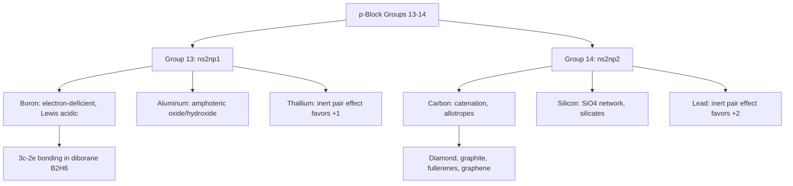

## The Boron and Carbon Groups

### Overview

Group 13 (the boron group: B, Al, Ga, In, Tl) and Group 14 (the carbon group: C, Si, Ge, Sn, Pb) together illustrate one of the most pronounced transitions from nonmetallic to metallic character across the p-block, alongside characteristic group-specific bonding behaviors — three-coordinate electron deficiency in Group 13 and tetravalent catenation/network-forming capability in Group 14.

### Group 13: The Boron Group

**Electronic Configuration and General Trend**

Valence configuration $ns^2np^1$ gives a formal maximum oxidation state of $+3$. Down the group: boron (metalloid, distinctly nonmetallic in chemical behavior), aluminum (metal, though displaying some covalent/amphoteric character due to its position near the metal/nonmetal boundary), gallium, indium, and thallium (increasingly metallic).

**Electron Deficiency and the Octet Rule**

Boron's three valence electrons form only three covalent bonds in simple compounds (e.g., $\text{BF}_3$, $\text{BCl}_3$), leaving the boron atom with only six electrons around it — an electron-deficient, incomplete octet. This electron deficiency confers strong Lewis acidity, and such compounds readily accept an electron pair from a Lewis base to complete an octet (e.g., $\text{BF}_3 + \text{NH}_3 \rightarrow \text{F}_3\text{B–NH}_3$, an adduct with a dative covalent bond).

**Diborane and Electron-Deficient Bonding**

Boron hydrides (boranes) exemplify unusual "three-center, two-electron" (3c-2e) bonding, most notably in diborane, $\text{B}_2\text{H}_6$, where bridging hydrogen atoms are shared between two boron centers via a single bonding molecular orbital spanning three atoms — a bonding mode not encountered in typical main-group two-center, two-electron covalent bonds, and a defining structural feature of boron cluster chemistry.

**Inert Pair Effect**

Down Group 13, the tendency for the $ns^2$ electron pair to remain non-bonding (unionized/unshared) — the **inert pair effect** — becomes increasingly significant, particularly for the heavier elements. This manifests as increasing stability of the $+1$ oxidation state relative to $+3$ moving down the group: boron and aluminum compounds are essentially always $+3$, while thallium shows a pronounced preference for the $+1$ state (e.g., $\text{Tl}^+$ compounds are generally more stable than the corresponding $\text{Tl}^{3+}$ compounds, with $\text{Tl}^{3+}$ species often acting as oxidizing agents that are reduced to $\text{Tl}^+$).

**Aluminum's Amphoteric Character**

Aluminum oxide ($\text{Al}_2\text{O}_3$) and aluminum hydroxide ($\text{Al(OH)}_3$) are amphoteric, reacting with both acids and bases:

$$\text{Al}_2\text{O}_3 + 6\text{HCl} \rightarrow 2\text{AlCl}_3 + 3\text{H}_2\text{O} \qquad \text{(acidic reaction)}$$

$$\text{Al}_2\text{O}_3 + 2\text{NaOH} + 3\text{H}_2\text{O} \rightarrow 2\text{NaAl(OH)}_4 \qquad \text{(basic reaction)}$$

This amphoteric behavior is a key manifestation of aluminum's diagonal relationship with beryllium (see the alkaline earth metals topic).

### Group 14: The Carbon Group

**Electronic Configuration and General Trend**

Valence configuration $ns^2np^2$ gives a formal maximum oxidation state of $+4$. Down the group: carbon (strictly nonmetallic), silicon and germanium (metalloids), tin and lead (metals, though tin retains some metalloid-like amphoteric character in certain compounds).

**Catenation**

Carbon's distinctive ability to form extensive chains, rings, and networks of C–C bonds (**catenation**) is unmatched by any other element, underlying the entire discipline of organic chemistry. This exceptional catenation capacity arises from the high strength and kinetic stability of the C–C single bond relative to analogous Si–Si, Ge–Ge, etc. bonds, which are progressively weaker and more susceptible to oxidative/hydrolytic cleavage down the group — silicon shows some catenation capacity (e.g., silanes, $\text{Si}_n\text{H}_{2n+2}$, though far less stable and diverse than the corresponding alkanes), while catenation becomes negligible for germanium, tin, and lead.

**Allotropy of Carbon**

Carbon exhibits several well-characterized allotropes with dramatically different structures and properties:

- **Diamond**: each carbon $sp^3$-hybridized, tetrahedrally bonded to four neighbors in an extended three-dimensional covalent network — exceptionally hard, electrically insulating, and thermally conductive.
- **Graphite**: each carbon $sp^2$-hybridized, bonded to three neighbors within extended hexagonal sheets (graphene layers) held together by weak interlayer van der Waals forces — soft, electrically conductive (due to delocalized $\pi$ electrons within each layer), used as a lubricant and electrode material.
- **Fullerenes** (e.g., $\text{C}_{60}$, buckminsterfullerene): closed-cage, roughly spherical molecular structures of $sp^2$-hybridized carbon.
- **Graphene**: a single isolated layer of graphite's hexagonal sheet structure, exhibiting exceptional electrical conductivity, mechanical strength, and thermal conductivity, and the subject of extensive ongoing materials research. [Inference: as an area of active and rapidly evolving research, specific performance claims and application timelines for graphene-based technologies should be verified against current literature.]

**Inert Pair Effect in Group 14**

As in Group 13, the inert pair effect becomes progressively more significant down the group: carbon and silicon compounds are dominated by the $+4$ oxidation state, while lead shows a marked preference for $+2$ over $+4$ — $\text{PbO}$ and $\text{Pb}^{2+}$ salts are generally more stable than the corresponding $\text{Pb}^{4+}$ species, and $\text{PbO}_2$ (a $+4$ compound) is a strong oxidizing agent that is readily reduced to $\text{Pb}^{2+}$.

**Silicates and the Silicon–Oxygen Network**

Silicon's chemistry is dominated by strong Si–O bonds rather than Si–Si catenation. The $\text{SiO}_4$ tetrahedron is the fundamental structural unit of silicate minerals, which can share corners to form chains, sheets, or fully three-dimensional networks (as in quartz, $\text{SiO}_2$) — a structural principle analogous in concept, though chemically distinct, to carbon's catenation, and the structural basis of the majority of Earth's crustal minerals.

### Comparative Summary: Group 13 vs. Group 14

| Feature | Group 13 (Boron Group) | Group 14 (Carbon Group) |
| --- | --- | --- |
| Valence configuration | $ns^2np^1$ | $ns^2np^2$ |
| Maximum oxidation state | $+3$ | $+4$ |
| Distinctive first-member behavior | Boron: electron-deficient, 3c-2e bonding | Carbon: extensive catenation, multiple allotropes |
| Inert pair effect significance | Notable for thallium ($\text{Tl}^+$ favored) | Notable for lead ($\text{Pb}^{2+}$ favored) |
| Key structural chemistry | Electron-deficient boranes/boron clusters | Carbon allotropes; silicate network structures |
| Metal/nonmetal transition point | Between B (metalloid) and Al (metal) | Gradual: C (nonmetal) → Si/Ge (metalloid) → Sn/Pb (metal) |

### Group Trends Diagram

### Worked Example

**Example**

Explain, using the inert pair effect, why lead(IV) oxide, $\text{PbO}_2$, is a stronger oxidizing agent than tin(IV) oxide, $\text{SnO}_2$, and why lead(II) compounds are generally more stable/common than lead(IV) compounds.

The inert pair effect describes the increasing reluctance of the $ns^2$ valence electron pair to participate in bonding as one descends a p-block group, attributed to a combination of relativistic effects and poor shielding by intervening $d$- and $f$-block electrons for the heavier elements, which stabilizes the $ns^2$ configuration and makes those two electrons energetically less favorable to remove or share. This effect strengthens progressively down Group 14: it is negligible for carbon and silicon, minor for germanium, moderate for tin, and pronounced for lead.

For lead, this means the $+2$ oxidation state (where the $6s^2$ pair remains as a non-bonding "inert pair") is thermodynamically favored over the $+4$ state (where both $6s$ electrons are engaged in bonding). Consequently, $\text{PbO}_2$ ($+4$) is thermodynamically unstable relative to $\text{PbO}$ ($+2$) and readily acts as an oxidizing agent, being reduced to $\text{Pb}^{2+}$ species in the process, releasing energy as the more stable $+2$ oxidation state is achieved. Tin, positioned one period higher, experiences a much weaker inert pair effect, so $\text{SnO}_2$ ($+4$) remains the thermodynamically stable, commonly encountered oxide, and tin's $+4$ compounds are generally more stable than tin's $+2$ compounds — essentially the reverse relative stability pattern compared to lead.

### Applications

- **Boron**: borosilicate glass (low thermal expansion, laboratory glassware), boron neutron capture applications (nuclear reactor control rods, exploiting boron's high neutron-absorption cross-section), boric acid as a mild antiseptic and insecticide.
- **Aluminum**: lightweight structural material (aerospace, packaging, construction), electrical transmission lines, aluminum oxide as an abrasive (corundum, sapphire, ruby are crystalline forms) and in catalytic supports.
- **Gallium/Indium**: semiconductor and optoelectronic applications (GaAs, InP compound semiconductors; indium tin oxide, ITO, as a transparent conductive coating for touchscreens and displays).
- **Carbon**: the structural basis of organic chemistry and all known biological life; diamond for cutting/abrasive tools and gemstones; graphite for lubricants, electrodes, and pencil "lead"; carbon fiber composites for lightweight, high-strength structural applications.
- **Silicon**: the foundational material of the semiconductor/electronics industry; silicates and silica as the primary constituents of glass, ceramics, and cement.
- **Tin**: corrosion-resistant coatings (tin-plated steel, "tin cans"), solder alloys.
- **Lead**: lead-acid batteries (exploiting the $\text{Pb}/\text{PbO}_2$ redox couple), radiation shielding (high density and atomic number provide effective attenuation of X-rays/gamma rays); most other lead applications have declined substantially due to well-established toxicity concerns.

### Common Pitfalls and Misconceptions

- Assuming boron behaves as a typical metal or forms simple ionic $\text{B}^{3+}$ compounds — boron chemistry is overwhelmingly covalent and characterized by electron deficiency, distinct from the more ionic character of its heavier Group 13 congeners.
- Confusing the inert pair effect's *direction* — it stabilizes the *lower* oxidation state (group number minus 2) for heavier p-block elements, not the higher, maximum-group-number oxidation state.
- Assuming silicon chemistry parallels carbon chemistry closely because both are Group 14 elements — while both readily form four bonds, silicon's chemistry is dominated by strong Si–O bond formation (silicates, silicones) rather than Si–Si catenation, a substantial qualitative difference from carbon's organic chemistry.
- Treating all carbon allotropes as having similar properties because they share elemental identity — diamond, graphite, and fullerenes differ dramatically in hardness, conductivity, and other physical properties due to fundamentally different bonding/hybridization and structural arrangement.

**Related Topics**

- Hydrogen and the alkali metals; the alkaline earth metals (Group 1–2 trends for comparison)
- The pnictogen, chalcogen, and halogen groups (continuing p-block trends)
- The inert pair effect and relativistic effects in heavy p-block elements
- Silicate mineral structures and network covalent solids
- Organic chemistry fundamentals (carbon catenation as its structural basis)
- Semiconductor materials and band theory
- Three-center two-electron bonding and electron-deficient compounds