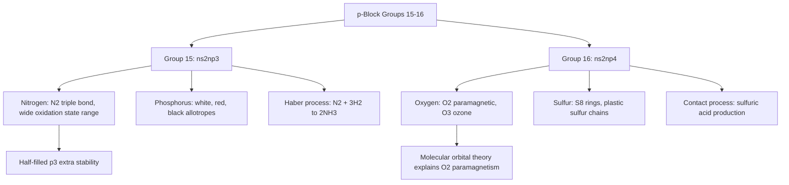

## The Nitrogen and Oxygen Groups

### Overview

Group 15 (the pnictogens: N, P, As, Sb, Bi) and Group 16 (the chalcogens: O, S, Se, Te, Po) continue the p-block transition from strongly nonmetallic first-row behavior toward increasing metallic character down each group. These groups are chemically central to biological systems, industrial acid production, and atmospheric chemistry, and exhibit rich patterns of allotropy, oxidation-state variability, and catenation distinct from both the carbon group and the halogens.

### Group 15: The Nitrogen Group (Pnictogens)

**Electronic Configuration and General Trend**

Valence configuration $ns^2np^3$, with a half-filled $p$ subshell conferring extra stability (Hund's rule maximization of unpaired electrons), reflected in a notably high first ionization energy for nitrogen relative to a simple monotonic trend from neighboring elements. Down the group: nitrogen (strongly nonmetallic, diatomic gas), phosphorus (nonmetal, multiple allotropes), arsenic and antimony (metalloids), bismuth (metal).

**Nitrogen: Triple Bond and Inertness**

Elemental nitrogen exists as $\text{N}_2$, featuring an exceptionally strong triple bond (bond dissociation energy ≈ 945 kJ/mol, among the strongest of any diatomic molecule), which accounts for nitrogen gas's remarkable chemical inertness under ordinary conditions despite favorable thermodynamics for many nitrogen-fixation reactions — the high activation energy required to break this triple bond is the dominant kinetic barrier, necessitating specialized catalysts (as in the Haber process) or biological nitrogenase enzymes for practical nitrogen fixation.

**Oxidation States of Nitrogen**

Nitrogen displays an unusually wide range of oxidation states, from $-3$ (as in ammonia, $\text{NH}_3$, and nitride, $\text{N}^{3-}$) through $0$ ($\text{N}_2$) up to $+5$ (as in nitric acid, $\text{HNO}_3$, and nitrates), reflecting nitrogen's versatile bonding behavior and its central role in redox chemistry (e.g., the nitrogen cycle, combustion chemistry, and explosives).

| Oxidation State | Example Compound |
| --- | --- |
| $-3$ | $\text{NH}_3$ (ammonia) |
| $-2$ | $\text{N}_2\text{H}_4$ (hydrazine) |
| $-1$ | $\text{NH}_2\text{OH}$ (hydroxylamine) |
| $0$ | $\text{N}_2$ |
| $+1$ | $\text{N}_2\text{O}$ (nitrous oxide) |
| $+2$ | $\text{NO}$ (nitric oxide) |
| $+3$ | $\text{HNO}_2$ (nitrous acid) |
| $+4$ | $\text{NO}_2$ (nitrogen dioxide) |
| $+5$ | $\text{HNO}_3$ (nitric acid) |

**Phosphorus Allotropes**

- **White phosphorus** ($\text{P}_4$): discrete tetrahedral molecules with significant ring strain (60° bond angles versus the ideal ~109.5° for $sp^3$ hybridization), highly reactive, spontaneously flammable in air, and acutely toxic.
- **Red phosphorus**: a polymeric network structure formed by ring-opening of $\text{P}_4$ units, thermodynamically more stable and substantially less reactive/toxic than the white allotrope.
- **Black phosphorus**: the thermodynamically most stable allotrope under standard conditions, with a layered structure resembling graphite and semiconducting electronic properties.

**The Nitrogen Cycle and Ammonia Synthesis**

Industrial nitrogen fixation via the Haber process ($\text{N}_2 + 3\text{H}_2 \rightleftharpoons 2\text{NH}_3$, catalyzed by iron with promoters, under high pressure and moderate temperature) converts atmospheric $\text{N}_2$ into ammonia for fertilizer production, representing one of the most consequential industrial chemical processes for global food production. Biological nitrogen fixation (by nitrogenase enzymes in symbiotic and free-living bacteria) achieves the same overall transformation under ambient conditions via a distinct enzymatic mechanism.

### Group 16: The Oxygen Group (Chalcogens)

**Electronic Configuration and General Trend**

Valence configuration $ns^2np^4$. Down the group: oxygen (strongly nonmetallic, diatomic gas), sulfur (nonmetal, extensive allotropy and catenation), selenium and tellurium (metalloids), polonium (metal, radioactive).

**Oxygen: Allotropes and Reactivity**

Elemental oxygen exists predominantly as dioxygen ($\text{O}_2$, a paramagnetic molecule due to two unpaired electrons in antibonding molecular orbitals, a notable feature explained by molecular orbital theory that simple Lewis structure treatment does not predict) and, to a much lesser extent, as ozone ($\text{O}_3$, a bent triatomic molecule with resonance-delocalized bonding). Ozone is significantly more reactive and a stronger oxidizing agent than $\text{O}_2$, and its stratospheric layer plays a critical role in absorbing harmful ultraviolet radiation.

**Oxidation States of Oxygen**

Oxygen most commonly adopts the $-2$ oxidation state (as in the vast majority of oxides and water), but also occurs as $-1$ in peroxides ($\text{O}_2^{2-}$, e.g., $\text{H}_2\text{O}_2$), $-\frac{1}{2}$ in superoxides ($\text{O}_2^-$, e.g., $\text{KO}_2$), and rarely $+2$ in oxygen difluoride ($\text{OF}_2$), where the more electronegative fluorine forces oxygen into an atypical positive oxidation state.

**Sulfur Allotropes and Catenation**

Sulfur exhibits extensive catenation (S–S bond formation), more so than any other Group 16 element:

- **Rhombic sulfur ($\alpha$-S₈)**: the thermodynamically stable form at room temperature, composed of puckered eight-membered $\text{S}_8$ rings.
- **Monoclinic sulfur ($\beta$-S₈)**: also composed of $\text{S}_8$ rings, but a different crystal packing arrangement, stable at higher temperatures.
- **Plastic sulfur**: formed by rapidly cooling molten sulfur, consisting of long, disordered polymeric sulfur chains — a metastable, amorphous form that gradually reverts to the rhombic crystalline form over time.

**Sulfuric Acid: Industrial Significance**

Sulfuric acid ($\text{H}_2\text{SO}_4$) is produced industrially via the Contact process: sulfur is burned to $\text{SO}_2$, catalytically oxidized to $\text{SO}_3$ (typically over a vanadium(V) oxide catalyst), and $\text{SO}_3$ is absorbed into concentrated sulfuric acid to form oleum, which is then diluted to the desired concentration. Sulfuric acid is among the highest-volume industrial chemicals produced worldwide, used extensively in fertilizer manufacture, metal processing, and as a general industrial acid/dehydrating agent.

### Comparative Trends Across Groups 15 and 16

| Property | Group 15 Trend | Group 16 Trend |
| --- | --- | --- |
| First ionization energy | N anomalously high (half-filled $p^3$ stability); generally decreases down group thereafter | Generally decreases down group |
| Electronegativity | Decreases down group | Decreases down group (O is second most electronegative element overall, after F) |
| Metallic character | Increases down group (N, P nonmetal → Bi metal) | Increases down group (O, S nonmetal → Po metal) |
| Catenation tendency | Moderate (hydrazine N–N; polyphosphates) | Strong for sulfur (S₈ rings, polymeric chains); weaker for other members |
| Common maximum oxidation state | $+5$ | $+6$ (e.g., $\text{SO}_3$, $\text{H}_2\text{SO}_4$) |
| Hydride acidity/basicity | $\text{NH}_3$ is a weak base | $\text{H}_2\text{O}$/$\text{H}_2\text{S}$ are weakly amphoteric/acidic |

### Group Trends and Allotropy Diagram

### Worked Example

**Example**

Explain, using molecular orbital theory concepts, why dioxygen ($\text{O}_2$) is paramagnetic, a property that simple Lewis structure ("O=O" double bond) representations fail to predict.

A simple Lewis structure for $\text{O}_2$ shows a double bond with all electrons paired, which would predict a diamagnetic molecule (no unpaired electrons, weakly repelled by a magnetic field). However, molecular orbital theory, by combining the atomic orbitals of the two oxygen atoms into bonding and antibonding molecular orbitals and filling them according to the Aufbau principle and Hund's rule, correctly predicts that the highest-occupied molecular orbitals of $\text{O}_2$ are a pair of degenerate (equal-energy) antibonding $\pi^*$ orbitals, each containing one unpaired electron (following Hund's rule, which favors maximizing unpaired electrons in degenerate orbitals before pairing).

This gives $\text{O}_2$ two unpaired electrons in its ground electronic state, making it paramagnetic — experimentally confirmed by the observation that liquid oxygen is attracted to a strong magnet. This is a classic and frequently cited example demonstrating that molecular orbital theory can capture bonding and magnetic behavior that simpler Lewis structure/valence bond approaches miss, since Lewis structures do not inherently account for the relative energy ordering and degeneracy of molecular orbitals derived from atomic orbital combination.

### Applications

- **Nitrogen**: Haber process ammonia for fertilizer, inert atmosphere applications (nitrogen gas blanketing in industrial/food packaging processes), liquid nitrogen for cryogenic applications, nitric acid production (explosives, fertilizers).
- **Phosphorus**: fertilizer production (phosphate rock processing to superphosphate and related compounds), match-head chemistry (red phosphorus), flame retardants, and organophosphate chemistry (pesticides, some nerve agents — a notable dual-use concern in this chemistry).
- **Oxygen**: respiration and combustion support, medical oxygen therapy, steelmaking (basic oxygen process), oxy-fuel welding/cutting.
- **Sulfur**: sulfuric acid production (the single largest end-use of elemental sulfur), vulcanization of rubber (cross-linking via sulfur bridges), fungicides, and gunpowder (historically, as a component alongside charcoal and potassium nitrate).
- **Ozone**: water disinfection and treatment, and its critical natural role in stratospheric UV absorption (though ground-level/tropospheric ozone is a harmful air pollutant, illustrating that the same chemical species can be beneficial or harmful depending on atmospheric location and context).

### Common Pitfalls and Misconceptions

- Assuming nitrogen's inertness reflects thermodynamic stability of $\text{N}_2$ alone rather than kinetic inertness — many nitrogen-fixation reactions are thermodynamically favorable but proceed extremely slowly without a catalyst or specialized biological enzyme, due to the very high activation energy needed to break the N≡N triple bond.
- Assuming all oxides of nitrogen and sulfur behave identically in terms of acidity/basicity or oxidation state — nitrogen and sulfur both exhibit multiple oxides spanning a wide range of oxidation states with distinct chemical behaviors, requiring attention to the specific oxidation state under discussion rather than generalization.
- Overlooking that dioxygen's paramagnetism is a key piece of evidence historically supporting molecular orbital theory over simple Lewis/valence bond treatments for diatomic molecules.
- Confusing tropospheric (ground-level) ozone, a harmful pollutant and component of smog, with stratospheric ozone, which serves a protective role by absorbing ultraviolet radiation — these represent the same chemical species playing very different roles depending on atmospheric location.

**Related Topics**

- The boron and carbon groups; the halogens and noble gases (continuing p-block trends)
- The Haber process and industrial nitrogen fixation
- Molecular orbital theory and diatomic molecule bonding
- The Contact process and industrial sulfuric acid production
- Acid–base chemistry of nonmetal oxides
- Allotropy and structural chemistry of the p-block elements
- Atmospheric chemistry: ozone layer formation and depletion