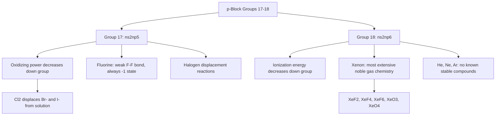

## Halogens and Noble Gases

### Overview

Group 17 (the halogens: F, Cl, Br, I, At) and Group 18 (the noble gases: He, Ne, Ar, Kr, Xe, Rn) represent, respectively, the most reactive nonmetal group and the group historically regarded as chemically inert. The halogens exemplify strong, systematic oxidizing-power and reactivity trends down a group, while the noble gases — once assumed entirely unreactive — have been shown, since the 1960s, to form a genuine (if limited) chemistry under specific conditions with the most electronegative and oxidizing partners.

### Group 17: The Halogens

**Electronic Configuration and General Trend**

Valence configuration $ns^2np^5$, one electron short of a complete octet, giving the halogens the strongest electron-gaining tendency (highest electron affinities and electronegativities) of any p-block group and a near-universal preference for the $-1$ oxidation state in binary compounds with less electronegative elements.

**Physical States and Trends**

| Element | State (room temp.) | Color | Electronegativity (Pauling) |
| --- | --- | --- | --- |
| Fluorine | Pale yellow gas | Pale yellow | 3.98 (highest of all elements) |
| Chlorine | Yellow-green gas | Yellow-green | 3.16 |
| Bromine | Red-brown liquid | Red-brown | 2.96 |
| Iodine | Purple-black solid (sublimes) | Purple-black; violet vapor | 2.66 |
| Astatine | Solid (radioactive, very short-lived) | — | 2.2 (estimated) |

Melting and boiling points increase down the group due to increasing London dispersion forces between the larger, more polarizable diatomic molecules ($\text{X}_2$), accounting for the physical state progression from gas (F, Cl) to liquid (Br) to solid (I).

**Oxidizing Power and Reactivity Trends**

Oxidizing power (tendency to gain electrons, be reduced) decreases down the group as atomic/ionic radius increases and electron affinity/electronegativity decrease, meaning fluorine is the strongest halogen oxidizing agent and iodine the weakest. This translates directly into a well-known set of **halogen displacement reactions**, in which a more reactive (higher) halogen displaces a less reactive (lower) halogen from solution:

$$\text{Cl}_2(aq) + 2\text{NaBr}(aq) \rightarrow 2\text{NaCl}(aq) + \text{Br}_2(aq)$$

$$\text{Cl}_2(aq) + 2\text{NaI}(aq) \rightarrow 2\text{NaCl}(aq) + \text{I}_2(aq)$$

but not the reverse (e.g., $\text{Br}_2$ cannot displace $\text{Cl}^-$ from solution), since this would require the weaker oxidizing agent to oxidize the more stable, less easily oxidized halide.

**Fluorine's Anomalous Behavior**

Fluorine, as the first member of Group 17, displays several properties that deviate from a simple extrapolation of group trends, broadly attributable to its very small atomic radius and correspondingly weak F–F bond (arising from significant lone-pair/lone-pair electron repulsion between the closely spaced fluorine nuclei):

- The F–F bond is unusually weak (≈159 kJ/mol) compared to the Cl–Cl bond (≈242 kJ/mol), despite fluorine's smaller size, which would naively be expected to favor a stronger bond — this weak bond contributes significantly to fluorine's extreme reactivity, since less energy is required to dissociate $\text{F}_2$ to initiate reaction.
- Fluorine exhibits exclusively the $-1$ oxidation state in all its compounds, never displaying positive oxidation states (unlike the heavier halogens, which can adopt oxidation states such as $+1, +3, +5, +7$ in oxoacids/oxoanions), since fluorine is the most electronegative element and therefore cannot be oxidized by any other element.
- Hydrogen fluoride ($\text{HF}$) is a comparatively weak acid in aqueous solution (unlike the other hydrogen halides, HCl, HBr, HI, which are all strong acids), an anomaly generally attributed to the combined effects of the very high H–F bond strength and extensive hydrogen bonding in aqueous HF solutions stabilizing the undissociated molecule. [Inference: the precise quantitative contribution of each factor to HF's anomalous weak-acid behavior remains a topic of ongoing discussion in the physical chemistry literature.]

**Halide Ion Tests and Silver Halide Precipitates**

Halide ions ($\text{Cl}^-$, $\text{Br}^-$, $\text{I}^-$) can be qualitatively distinguished by precipitation with silver nitrate solution, producing silver halide precipitates of characteristic color and solubility in aqueous ammonia:

| Halide | Precipitate Color | Solubility in Dilute NH₃ | Solubility in Concentrated NH₃ |
| --- | --- | --- | --- |
| Cl⁻ | White | Soluble | Soluble |
| Br⁻ | Cream/pale yellow | Insoluble | Soluble |
| I⁻ | Yellow | Insoluble | Insoluble |

### Group 18: The Noble Gases

**Electronic Configuration and Historical View of Inertness**

Valence configuration $ns^2np^6$ (a complete octet, or $1s^2$ for helium), historically regarded as the definitive example of chemical inertness, underlying the very naming rationale of the octet rule in introductory bonding theory. This complete valence shell confers exceptionally high ionization energies (the highest of any group at a given period) and negligible electron affinity, since adding or removing an electron disrupts an already energetically favorable closed-shell configuration.

**Discovery of Noble Gas Reactivity**

In 1962, Neil Bartlett synthesized the first noble gas compound, xenon hexafluoroplatinate, after recognizing that xenon's first ionization energy was comparable to that of molecular oxygen (which Bartlett had shown could be oxidized by platinum hexafluoride, $\text{PtF}_6$), demonstrating that xenon could indeed be chemically oxidized under sufficiently forcing conditions — a landmark result overturning the long-standing assumption of complete noble gas inertness.

**Xenon Compounds**

Xenon, having the lowest ionization energy among the readily available (non-radioactive, naturally abundant) noble gases, forms the most extensive noble gas chemistry, predominantly with the most electronegative and oxidizing elements (fluorine and oxygen):

- **Xenon fluorides**: $\text{XeF}_2$, $\text{XeF}_4$, $\text{XeF}_6$ — formed by direct reaction of xenon and fluorine gas under appropriate temperature/pressure conditions, with molecular geometries ($\text{XeF}_2$ linear, $\text{XeF}_4$ square planar) well-predicted by VSEPR theory when lone pairs on the central xenon atom are properly accounted for.
- **Xenon oxides and oxyfluorides**: $\text{XeO}_3$, $\text{XeO}_4$, $\text{XeOF}_4$ — generally formed via hydrolysis of xenon fluorides; several are notably unstable and potentially explosive.

**Krypton and Radon Compounds**

Krypton, with a higher ionization energy than xenon, forms a much more limited chemistry — krypton difluoride ($\text{KrF}_2$) is the best-characterized krypton compound, thermodynamically unstable and requiring low-temperature conditions for isolation. Radon, though possessing an even lower ionization energy than xenon (favoring compound formation), is intensely radioactive with a short half-life, severely limiting practical study of its chemistry; some evidence for radon fluoride compounds exists, though characterization is inherently limited by radon's instability.

**Lighter Noble Gases**

Helium, neon, and argon have not been shown to form stable chemical compounds under normal laboratory conditions, consistent with their markedly higher ionization energies (particularly helium and neon) relative to xenon, krypton, and radon — reflecting the general trend that noble gas reactivity, where it exists at all, increases down the group as ionization energy decreases.

### Comparative Summary: Groups 17 and 18

| Feature | Group 17 (Halogens) | Group 18 (Noble Gases) |
| --- | --- | --- |
| Valence configuration | $ns^2np^5$ | $ns^2np^6$ |
| General reactivity | High; among the most reactive nonmetals | Very low to negligible; some heavier members form compounds under forcing conditions |
| Trend in reactivity down group | Decreases (oxidizing power decreases) | Increases slightly (ionization energy decreases, enabling limited compound formation) |
| First-member anomaly | Fluorine: weak F–F bond, exclusively $-1$ oxidation state | Helium: essentially zero known chemistry, even relative to other noble gases |
| Characteristic reaction type | Halogen displacement, oxidation of less reactive halides | Oxidation by very strong oxidizers (F₂, PtF₆) under forcing conditions |

### Reactivity Trends Diagram

### Worked Example

**Example**

Explain why chlorine gas can displace bromide and iodide ions from aqueous solution, but bromine cannot displace chloride ions, in terms of oxidizing power and electron affinity trends.

A halogen displacement reaction is fundamentally a redox reaction: the free halogen ($\text{X}_2$) is reduced to halide ion ($\text{X}^-$) while the halide ion originally in solution is oxidized back to the free halogen. This proceeds spontaneously only when the halogen being added is a stronger oxidizing agent (more readily reduced/more strongly attracts electrons) than the halogen already present as halide.

Chlorine has a smaller atomic radius and higher electronegativity/electron affinity than bromine and iodine, giving $\text{Cl}_2$ a greater tendency to gain electrons and be reduced to $\text{Cl}^-$; correspondingly, $\text{Cl}_2$ is thermodynamically capable of oxidizing both $\text{Br}^-$ and $\text{I}^-$ (which are more easily oxidized, having weaker hold on their extra electron due to larger atomic radius) to their respective free halogens, $\text{Br}_2$ and $\text{I}_2$.

The reverse process — bromine attempting to displace chloride — would require $\text{Br}_2$ to oxidize $\text{Cl}^-$ to $\text{Cl}_2$, but bromine is a weaker oxidizing agent than chlorine (bromine's larger atomic radius and lower electronegativity give it a lower electron affinity/reduction potential), so it cannot supply the driving force needed to remove an electron from the more strongly electron-attracting chloride ion. This reaction is therefore thermodynamically unfavorable and does not proceed, consistent with the general principle that oxidizing power decreases down Group 17.

### Applications

- **Fluorine**: production of fluoropolymers (e.g., PTFE/Teflon), pharmaceuticals (many drugs incorporate fluorine to modulate metabolic stability), uranium enrichment (via $\text{UF}_6$), and fluoridation of drinking water/toothpaste for dental health.
- **Chlorine**: water disinfection (municipal water treatment, swimming pools), PVC production, bleaching agents, and chlor-alkali process co-products (NaOH, H₂).
- **Bromine**: flame retardants, certain pharmaceuticals, and historically in photographic film (silver bromide).
- **Iodine**: antiseptic applications, dietary iodine supplementation (thyroid hormone synthesis, preventing goiter), and iodine-131 in medical diagnostic/therapeutic nuclear medicine applications.
- **Xenon**: high-intensity discharge lamps (xenon arc lamps), general anesthesia (in specialized clinical applications), and ion propulsion systems for spacecraft.
- **Argon**: inert shielding gas for arc welding, inert atmosphere for reactive material handling and incandescent/fluorescent lighting fill gas.
- **Helium**: cryogenic cooling (notably for superconducting magnets in MRI machines), lighter-than-air balloon/airship applications, and deep-sea diving gas mixtures (reducing nitrogen narcosis risk).

### Common Pitfalls and Misconceptions

- Assuming all noble gases are entirely unreactive under all conditions — while accurate for helium, neon, and argon under known laboratory conditions, xenon (and to a lesser extent krypton and radon) does form a genuine, if specialized, chemistry with strongly oxidizing/electronegative partners.
- Assuming fluorine's extreme reactivity is due to a particularly strong F–F bond — the opposite is true: the F–F bond is anomalously *weak*, which is part of why fluorine reacts so readily (low bond dissociation energy lowers the activation barrier for reaction).
- Assuming HF is a weak acid because fluorine is a weak oxidizer or the H–F bond is weak — fluorine is in fact the strongest oxidizer/most electronegative element, and HF's weak-acid behavior instead reflects a distinct combination of very high H–F bond strength and strong hydrogen bonding effects in solution.
- Confusing oxidizing power trends (halogens: decreases down group) with reducing power trends of the corresponding halide ions (halides: increases down group, i.e., $\text{I}^-$ is the strongest reducing agent among the common halide ions) — these are related but describe opposite species/directions of electron transfer.

**Related Topics**

- The nitrogen and oxygen groups (continuing p-block trends)
- Electron affinity, electronegativity, and ionization energy periodic trends
- Redox chemistry and standard reduction potentials
- VSEPR theory and molecular geometry (applied to noble gas compounds)
- Hydrogen bonding and its effect on acid strength (HF anomaly)
- Qualitative inorganic analysis (halide ion tests)
- Noble gas applications in lighting, cryogenics, and aerospace propulsion