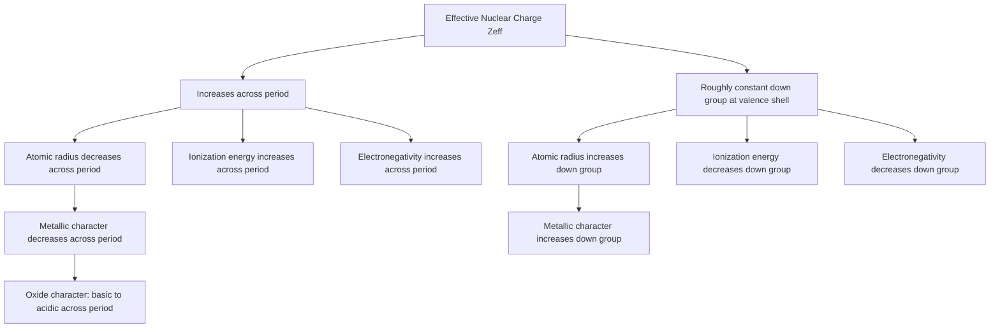

## Descriptive Periodic Trends Across the Main Groups

### Overview

Periodic trends are the systematic variations in atomic and chemical properties that arise across periods (left to right) and down groups (top to bottom) of the periodic table, driven fundamentally by two competing effects: increasing nuclear charge (more protons pulling electrons inward) and increasing electron shielding/principal quantum number (additional filled shells screening the nucleus and placing valence electrons farther away). This topic synthesizes and unifies the trend patterns introduced separately across the preceding main-group topics (Groups 1–2 and 13–18) into a single comparative framework.

### Effective Nuclear Charge

**The Foundational Concept**

The effective nuclear charge ($Z_{\text{eff}}$) experienced by a valence electron is the net positive charge felt after accounting for shielding by inner-shell (core) electrons, approximated by Slater's rules or more simply as:

$$Z_{\text{eff}} = Z - S$$

where $Z$ is the actual nuclear charge (atomic number) and $S$ is a shielding constant representing the screening effect of other electrons. Because inner-shell electrons shield outer electrons far more effectively than electrons within the same shell shield each other, $Z_{\text{eff}}$ increases across a period (as protons are added to the same principal shell with relatively little additional shielding) but remains comparatively similar down a group at the outermost shell (since each new period adds a complete inner shell that largely offsets the increased nuclear charge). This single underlying concept explains the majority of the trends below.

### Atomic and Ionic Radius

**Across a Period (Left to Right)**

Atomic radius generally *decreases* across a period, because increasing $Z_{\text{eff}}$ pulls the valence electron shell (which remains the same principal quantum number $n$ across a period) progressively closer to the nucleus.

**Down a Group**

Atomic radius generally *increases* down a group, because each successive element adds a new outermost principal quantum shell, and this increase in $n$ dominates over the relatively modest increase in $Z_{\text{eff}}$ at the valence shell.

**Ionic Radius**

Cations are smaller than their parent atoms (loss of the outermost electron shell, or at minimum reduced electron-electron repulsion, allows $Z_{\text{eff}}$ to pull remaining electrons in more tightly), while anions are larger than their parent atoms (added electron increases electron-electron repulsion without a compensating increase in nuclear charge). For isoelectronic series (ions/atoms with identical electron configuration), radius decreases with increasing nuclear charge/atomic number, since a greater $Z_{\text{eff}}$ acts on the same fixed number of electrons.

### Ionization Energy

**Definition and General Trend**

Ionization energy (IE) is the energy required to remove an electron from a gaseous atom or ion: $\text{M}(g) \rightarrow \text{M}^+(g) + e^-$. First ionization energy generally *increases* across a period (higher $Z_{\text{eff}}$ holds the valence electron more tightly) and *decreases* down a group (valence electron is farther from the nucleus and more shielded, requiring less energy to remove).

**Notable Irregularities**

- A modest decrease occurs at the start of the $p$-block within a period (e.g., Be to B, or Mg to Al) because the newly occupied $p$ orbital is at slightly higher energy and less penetrating than the filled $s$ orbital it follows, making its electron marginally easier to remove despite the higher nuclear charge.
- A modest decrease occurs between the $np^3$ and $np^4$ configurations (e.g., N to O, or P to S) because the half-filled $p^3$ configuration (three unpaired electrons in three separate orbitals, per Hund's rule) has extra exchange-energy stability, making removal of an electron from this arrangement comparatively harder than removing the fourth electron, which must pair up in an already-occupied orbital and experiences additional electron-electron repulsion.
- **Successive ionization energies** for a given element increase sharply once all valence electrons have been removed and a new, lower-energy core shell begins to be accessed — this large jump is strong evidence for the shell (principal quantum number) structure of the atom and is used to determine the number of valence electrons experimentally.

### Electron Affinity

**Definition and General Trend**

Electron affinity (EA) is the energy change when a gaseous atom gains an electron: $\text{M}(g) + e^- \rightarrow \text{M}^-(g)$, generally reported as the energy *released* in this process (making more negative/more exothermic values correspond to a greater tendency to gain an electron). Electron affinity generally becomes more negative (more favorable) across a period and less negative (less favorable) down a group, broadly paralleling the ionization energy trend, since both reflect the same underlying $Z_{\text{eff}}$ effect on valence-shell electron attraction.

**Irregularities**

Electron affinity trends are notably less regular than ionization energy trends. For example, fluorine's electron affinity is slightly less favorable than chlorine's, despite fluorine's higher electronegativity — attributed to fluorine's very small atomic size, which causes significant electron-electron repulsion in its already compact valence shell when an additional electron is added, partially offsetting the expected trend from $Z_{\text{eff}}$ alone.

### Electronegativity

**Definition and General Trend**

Electronegativity is a measure of an atom's tendency to attract shared electrons within a covalent bond (distinct from electron affinity, which describes a free, isolated atom gaining an electron). It generally increases across a period and decreases down a group, following essentially the same $Z_{\text{eff}}$-driven logic as ionization energy and electron affinity. Fluorine is the most electronegative element on the Pauling scale (3.98), and electronegativity generally decreases toward the lower-left of the periodic table, reaching a minimum at the alkali metals (particularly cesium and francium).

### Metallic and Nonmetallic Character

**General Trend**

Metallic character (tendency to lose electrons, form cations, and exhibit typical metallic physical properties such as electrical conductivity, malleability, and metallic luster) *decreases* across a period and *increases* down a group — essentially the inverse trend to ionization energy and electronegativity, since low ionization energy and low electronegativity favor cation formation and metallic bonding.

**The Metalloid Staircase**

The transition from metals to nonmetals across the p-block is not abrupt but occurs along a diagonal "staircase" line running approximately from boron to astatine, with elements adjacent to this line (B, Si, Ge, As, Sb, Te, and sometimes others depending on the specific classification scheme used) classified as metalloids, displaying intermediate properties between metals and nonmetals (e.g., semiconducting electrical behavior rather than either strong conduction or strong insulation).

### Basicity and Acidity of Oxides

**General Trend**

The acid–base character of an element's oxide correlates directly with metallic/nonmetallic character: metal oxides (especially those of Group 1 and 2 metals) are generally basic, dissolving in water to form hydroxide solutions or reacting with acids; nonmetal oxides are generally acidic, reacting with water to form oxoacids or reacting with bases; oxides of metalloids and some borderline metals (e.g., $\text{Al}_2\text{O}_3$, $\text{BeO}$) are frequently amphoteric, reacting with both acids and bases. This trend follows directly from the electronegativity/metallic-character trend: as electronegativity increases across a period, the corresponding oxide's character shifts from basic through amphoteric to acidic.

### Comparative Summary Table

| Property | Trend Across a Period (L→R) | Trend Down a Group |
| --- | --- | --- |
| Effective nuclear charge ($Z_{\text{eff}}$) | Increases | Roughly constant at valence shell |
| Atomic radius | Decreases | Increases |
| Ionic radius (same charge type) | Decreases | Increases |
| First ionization energy | Increases (with irregularities) | Decreases |
| Electron affinity (magnitude) | Generally increases | Generally decreases |
| Electronegativity | Increases | Decreases |
| Metallic character | Decreases | Increases |
| Oxide acid–base character | Basic → amphoteric → acidic | Acidic character generally decreases (more basic) |

### Unified Periodic Trends Diagram

### Worked Example

**Example**

Using periodic trends alone (without look-up tables), predict which has the larger radius: $\text{O}^{2-}$ or $\text{F}^-$, given that both ions are isoelectronic (each has 10 electrons, matching the neon configuration).

Since both ions are isoelectronic with 10 electrons each, the difference in radius arises entirely from differing nuclear charge: oxygen has atomic number 8, while fluorine has atomic number 9. A greater nuclear charge acting on the same fixed number of electrons results in a stronger net attractive pull on the electron cloud (higher effective nuclear charge per electron), causing that ion to contract to a smaller radius.

Because $\text{F}^-$ has one more proton than $\text{O}^{2-}$ while both have the same 10 electrons, $\text{F}^-$ experiences a greater effective nuclear charge and is therefore predicted to have the smaller ionic radius, meaning $\text{O}^{2-}$ has the larger radius. This is a standard application of the isoelectronic-series trend, in which radius decreases with increasing atomic number for a fixed electron count, and the prediction is consistent with experimentally tabulated ionic radii for these two ions.

### Applications of Periodic Trend Reasoning

- **Predicting reactivity**: qualitatively anticipating relative reactivity of unfamiliar elements (e.g., predicting that francium would be more reactive than cesium, or that astatine would be a weaker oxidizer than iodine) by extrapolating established group trends.
- **Rationalizing compound stoichiometry and stability**: using ionic radius and charge trends to explain lattice energy patterns and predict likely ionic compound formulas (e.g., via Fajans' rules, relating cation charge density to covalent character).
- **Materials selection**: electronegativity and metallic character trends inform selection of elements for specific bonding character requirements (e.g., choosing constituents for ionic versus covalent versus metallic materials).
- **Qualitative inorganic analysis**: predicting acid–base behavior of oxides and hydroxides to anticipate solubility and reactivity patterns in analytical chemistry procedures.

### Common Pitfalls and Misconceptions

- Assuming periodic trends are perfectly monotonic with no exceptions — several well-documented irregularities (the $p$-block "dip" in ionization energy, the half-filled subshell stabilization effect, fluorine's anomalous electron affinity) are important, frequently tested departures from the idealized smooth trend.
- Confusing electron affinity (a property of a neutral, isolated gaseous atom gaining an electron) with electronegativity (a property describing an atom's electron-attracting power specifically within a covalent bond) — these are related but conceptually and quantitatively distinct properties, and their trends, while broadly parallel, are not numerically identical.
- Assuming ionic radius trends always mirror atomic radius trends directly without accounting for charge — cations are always smaller and anions always larger than their respective parent neutral atoms, an effect that must be layered on top of the basic period/group atomic radius trend.
- Treating the metal/nonmetal/metalloid classification as a strict binary or sharply defined boundary — the metalloid "staircase" represents a gradual transition zone, and classification of borderline elements can vary somewhat between different reference sources.

**Related Topics**

- Hydrogen and the alkali metals; the alkaline earth metals
- The boron and carbon groups; the nitrogen and oxygen groups; halogens and noble gases
- Effective nuclear charge and Slater's rules
- Lattice energy, the Born–Haber cycle, and Fajans' rules
- Acid–base chemistry of oxides and hydroxides
- Electronic configuration and the Aufbau principle
- Molecular orbital theory (for trends beyond simple atomic properties)