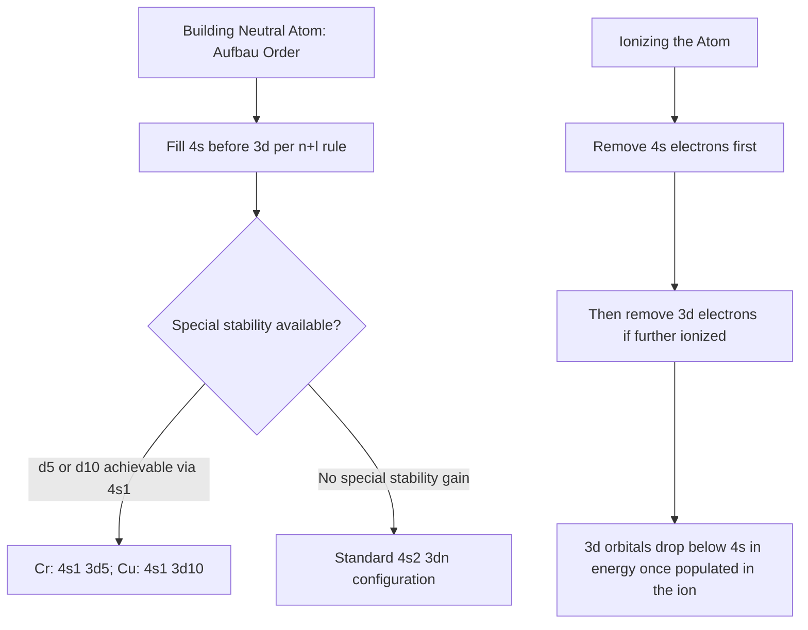

## Electron Configurations of Transition Metals

### Overview

Transition metals (the d-block elements) are defined by the progressive filling of $(n-1)d$ orbitals, giving rise to electron configuration behavior that departs systematically from simple Aufbau predictions in several well-documented ways. Understanding these configurations — for both neutral atoms and their ions — is foundational to explaining transition metal magnetism, oxidation-state variability, color, and coordination chemistry covered elsewhere in this chapter.

### General Aufbau Filling Pattern

**Orbital Filling Order**

Across a given period, the $(n-1)d$ subshell fills after the $ns$ subshell of the same period has already been occupied, reflecting the relative energy ordering predicted by the Madelung (n+l) rule: the $4s$ orbital (period 4, $n=4$, $l=0$, giving $n+l=4$) is filled before the $3d$ orbital (period 4 transition series, $n=3$, $l=2$, giving $n+l=5$) because $4s$ has the lower $(n+l)$ sum and, for equal $(n+l)$ values, the orbital with lower $n$ fills first.

**First-Row (3d) Transition Series Configurations**

| Element | Symbol | Predicted (Aufbau) Configuration | Actual Ground-State Configuration |
| --- | --- | --- | --- |
| Scandium | Sc | $[\text{Ar}]4s^2 3d^1$ | $[\text{Ar}]4s^2 3d^1$ |
| Titanium | Ti | $[\text{Ar}]4s^2 3d^2$ | $[\text{Ar}]4s^2 3d^2$ |
| Vanadium | V | $[\text{Ar}]4s^2 3d^3$ | $[\text{Ar}]4s^2 3d^3$ |
| Chromium | Cr | $[\text{Ar}]4s^2 3d^4$ | $[\text{Ar}]4s^1 3d^5$ |
| Manganese | Mn | $[\text{Ar}]4s^2 3d^5$ | $[\text{Ar}]4s^2 3d^5$ |
| Iron | Fe | $[\text{Ar}]4s^2 3d^6$ | $[\text{Ar}]4s^2 3d^6$ |
| Cobalt | Co | $[\text{Ar}]4s^2 3d^7$ | $[\text{Ar}]4s^2 3d^7$ |
| Nickel | Ni | $[\text{Ar}]4s^2 3d^8$ | $[\text{Ar}]4s^2 3d^8$ |
| Copper | Cu | $[\text{Ar}]4s^2 3d^9$ | $[\text{Ar}]4s^1 3d^{10}$ |
| Zinc | Zn | $[\text{Ar}]4s^2 3d^{10}$ | $[\text{Ar}]4s^2 3d^{10}$ |

### Anomalous Configurations: Chromium and Copper

**Origin of the Anomaly**

Chromium and copper deviate from the straightforward Aufbau prediction, adopting a single $4s$ electron rather than the expected two, in order to achieve a half-filled ($3d^5$, chromium) or fully filled ($3d^{10}$, copper) $d$ subshell. This behavior is conventionally rationalized by the combination of:

- **Exchange energy stabilization**: half-filled and fully filled subshells maximize the number of electrons with parallel spin in separate orbitals, which lowers overall electron-electron repulsion energy through favorable quantum mechanical exchange interactions (a more pronounced, "bonus" version of the same effect responsible for the half-filled-$p^3$ ionization energy irregularity discussed under periodic trends).
- **Reduced electron-electron repulsion**: symmetric, evenly distributed electron density in half-filled or filled subshells minimizes repulsive interactions compared to a less symmetric arrangement.
- **Small energy gap between $4s$ and $3d$**: because the $4s$ and $3d$ orbitals are close in energy for these elements, the modest additional stabilization from achieving a half-filled/filled $d$ subshell configuration is sufficient to favor the $4s^1 3d^5$ (Cr) or $4s^1 3d^{10}$ (Cu) arrangement over the naively predicted $4s^2 3d^4$ or $4s^2 3d^9$.

[Inference: the precise quantitative balance of these contributing factors, and the general applicability of "special stability of half-filled/filled subshells" as an explanation across the full periodic table, is a topic where different textbooks and more advanced treatments offer somewhat varying levels of nuance; the qualitative pattern itself, however, is well-established and experimentally confirmed via atomic spectroscopy.]

**Second- and Third-Row Anomalies**

Similar $ns \to (n-1)d$ electron "promotion" anomalies occur with greater frequency among the second-row (4d) and third-row (5d) transition series (e.g., niobium, molybdenum, ruthenium, rhodium, palladium in the 4d series; several 5d elements as well), reflecting the generally smaller and more variable energy gaps between $ns$ and $(n-1)d$ orbitals for the heavier transition series. [Unverified: the complete, element-by-element list of all such anomalies across the second and third transition series should be confirmed against a current, authoritative reference source (such as NIST atomic spectra data) if precise accuracy for every specific element is required, since exact ground-state configurations for some heavier transition metals have historically been subject to revision as spectroscopic data improved.]

### Electron Configurations of Transition Metal Ions

**The Critical Rule: $4s$ Electrons Are Removed Before $3d$ Electrons**

A frequently emphasized and tested principle in transition metal chemistry: although the $4s$ orbital fills *before* the $3d$ orbital when building up the neutral atom (Aufbau order), $4s$ electrons are removed *before* $3d$ electrons during ionization. This apparent reversal is explained by the fact that, once the $3d$ subshell begins to be populated, the increased nuclear charge causes the $3d$ orbitals to drop below the $4s$ orbital in energy for the resulting ion — the relative $4s$/$3d$ energy ordering is not fixed but depends on the specific electron configuration and effective nuclear charge of the species in question (neutral atom vs. cation).

**Example: Iron and Its Ions**

$$\text{Fe}: [\text{Ar}]4s^2 3d^6 \quad \longrightarrow \quad \text{Fe}^{2+}: [\text{Ar}]3d^6 \quad \longrightarrow \quad \text{Fe}^{3+}: [\text{Ar}]3d^5$$

Both $4s$ electrons are removed first to form $\text{Fe}^{2+}$, and only then does further ionization to $\text{Fe}^{3+}$ remove a $3d$ electron. Notably, $\text{Fe}^{3+}$'s $3d^5$ configuration achieves the extra exchange-energy stability of a half-filled subshell, which is part of why $\text{Fe}^{3+}$ is a comparatively stable, commonly encountered oxidation state for iron alongside $\text{Fe}^{2+}$.

**Example: Chromium and Its Ions**

Because neutral chromium is already $[\text{Ar}]4s^1 3d^5$, formation of $\text{Cr}^{3+}$ (a very common and important oxidation state) removes the single $4s$ electron and two $3d$ electrons: $\text{Cr}^{3+}: [\text{Ar}]3d^3$.

### $d$-Orbital Electron Count and Oxidation State Notation

Transition metal ion configurations are frequently expressed using $d^n$ notation, specifying only the number of $d$ electrons remaining once the (already-removed) $4s$ electrons and the core argon configuration are accounted for — e.g., $\text{Mn}^{2+}$ is $d^5$, $\text{Fe}^{3+}$ is $d^5$, $\text{Co}^{2+}$ is $d^7$, $\text{Cu}^{2+}$ is $d^9$. This $d^n$ shorthand is especially important in crystal field theory and ligand field theory, where the number of $d$ electrons directly determines magnetic behavior, color, and preferred coordination geometry (discussed under coordination chemistry topics).

### Comparative Summary

| Concept | Key Point |
| --- | --- |
| Aufbau filling order | $ns$ fills before $(n-1)d$ for neutral atoms, per the $(n+l)$ rule |
| Chromium/copper anomaly | Adopt $4s^1$ to achieve half-filled ($d^5$) or filled ($d^{10}$) $d$ subshell stability |
| Ionization order | $4s$ electrons removed before $3d$ electrons, regardless of original filling order |
| $d^n$ notation | Counts only $d$ electrons remaining in the ion; used extensively in crystal/ligand field theory |
| Heavier transition series | More frequent $ns \to (n-1)d$ anomalies due to smaller/more variable orbital energy gaps |

### Electron Configuration Logic Diagram

### Worked Example

**Example**

Determine the ground-state electron configuration of $\text{Mn}^{2+}$ and explain, using exchange energy, why this ion is a comparatively stable, commonly encountered oxidation state for manganese.

Neutral manganese has the configuration $[\text{Ar}]4s^2 3d^5$ (following the standard Aufbau order without anomaly, since manganese's $3d^5$ configuration is already half-filled at the neutral-atom stage). Forming $\text{Mn}^{2+}$ requires removal of two electrons; following the rule that $4s$ electrons are removed before $3d$ electrons, both $4s$ electrons are removed:

$$\text{Mn}^{2+}: [\text{Ar}]3d^5$$

This $3d^5$ configuration places one electron in each of the five $d$ orbitals with parallel spin (per Hund's rule), maximizing the number of exchange interactions between electrons of like spin in different orbitals, which lowers the overall electron-electron repulsion energy through the quantum mechanical exchange stabilization effect. This half-filled-subshell stabilization is a significant contributing factor to why $\text{Mn}^{2+}$ is notably resistant to further oxidation or reduction relative to neighboring transition metal ions with non-half-filled $d$-subshell configurations, and is part of why manganese(II) compounds are common and comparatively stable across a range of chemical environments.

### Applications

- **Predicting magnetic behavior**: $d$-electron count and unpaired electron count (following Hund's rule within the $d$ subshell, modified by crystal/ligand field splitting) directly determine whether a transition metal ion or complex is paramagnetic or diamagnetic.
- **Rationalizing oxidation-state stability**: half-filled ($d^5$) and filled ($d^{10}$) configurations correlate with enhanced relative stability of certain oxidation states (e.g., $\text{Mn}^{2+}$, $\text{Fe}^{3+}$, $\text{Zn}^{2+}$).
- **Coordination chemistry and crystal field theory**: the $d^n$ configuration of the central metal ion is the essential starting point for predicting $d$-orbital splitting patterns, complex color, and geometric preferences in coordination compounds.
- **Catalysis**: the availability of multiple accessible oxidation states, itself a consequence of the relatively close energy spacing of $4s$ and $3d$ orbitals, underlies transition metals' widespread utility as redox and catalytic centers.

### Common Pitfalls and Misconceptions

- Writing transition metal ion configurations by simply removing electrons from the $3d$ subshell first (mirroring the *filling* order) — this is incorrect; $4s$ electrons are always removed before $3d$ electrons during ionization, since the relative orbital energies invert once the ion is formed.
- Assuming the chromium/copper anomaly reflects a "rule" that applies uniformly and predictably to every transition metal — while half-filled/filled subshell stabilization is a genuine and important effect, its manifestation varies considerably across the second- and third-row transition series and should be verified against reliable data rather than extrapolated by simple analogy alone.
- Forgetting that $d^n$ notation for an ion already accounts for removed $s$ electrons — e.g., $\text{Fe}^{2+}$ is correctly $d^6$ (not $d^6s^0$ requiring separate mention), since by convention the $4s$ orbital is understood to be empty once any transition metal cation has formed.
- Assuming all transition metal ions with the same overall electron count behave identically — while $d^n$ configuration is a critical starting point, actual chemical and magnetic behavior also depends on ligand field environment, geometry, and spin state (high-spin vs. low-spin), covered under crystal field theory.

**Related Topics**

- Descriptive periodic trends across the main groups (Aufbau principle, exchange energy)
- Crystal field theory and $d$-orbital splitting
- Coordination compound geometry and ligand field theory
- Magnetism in transition metal complexes (paramagnetism, diamagnetism)
- Oxidation states and redox chemistry of transition metals
- Color and electronic transitions in coordination complexes
- Catalytic applications of transition metals