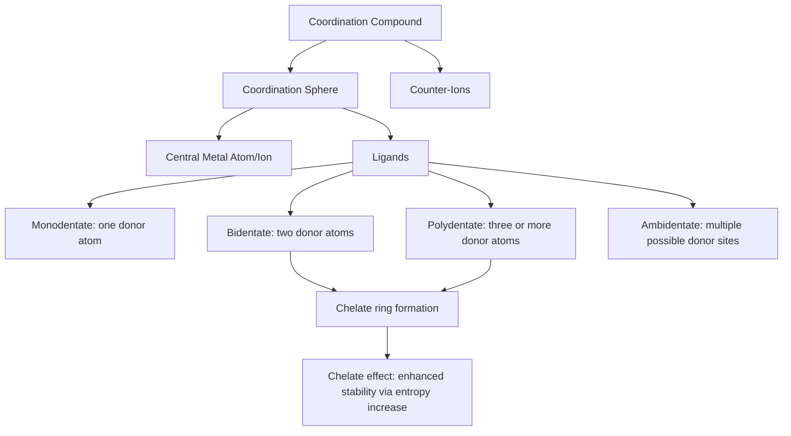

## Coordination Compounds and Ligand Types

### Overview

Coordination compounds consist of a central metal atom or ion bonded to a surrounding array of molecules or ions called ligands, which donate electron pairs to the metal via coordinate (dative) covalent bonds. This class of compounds, historically systematized by Alfred Werner in the late 19th century, underlies much of transition metal chemistry, catalysis, and bioinorganic chemistry, and exhibits structural and bonding behavior distinct from simple ionic or covalent compounds.

### Fundamental Concepts

**Central Metal Atom/Ion**

The central atom, typically a transition metal (though main-group and lanthanide/actinide elements also form coordination compounds), acts as a Lewis acid, accepting electron pairs from surrounding ligands. Its identity and oxidation state strongly influence the compound's geometry, color, magnetic behavior, and reactivity.

**Ligands**

Ligands are Lewis bases (electron-pair donors) that bond to the central metal through one or more donor atoms. The donor atom is the specific atom within the ligand that directly forms the coordinate bond to the metal (e.g., the nitrogen in ammonia, $\text{NH}_3$, or the oxygen atoms in water, $\text{H}_2\text{O}$).

**Coordination Number**

The coordination number is the total number of donor atoms directly bonded to the central metal, most commonly 2, 4, or 6, though other values occur. Coordination number, together with ligand size and electronic factors, determines the overall geometry of the complex (e.g., 6-coordinate complexes are most commonly octahedral; 4-coordinate complexes can be either tetrahedral or square planar, depending on the metal's $d$-electron configuration and ligand field strength).

**Coordination Sphere and Counter-Ions**

The coordination sphere comprises the central metal and its directly bonded ligands, conventionally enclosed in square brackets in formula notation (e.g., $[\text{Co(NH}_3)_6]^{3+}$). Any additional ions required for overall charge neutrality but not directly bonded to the metal are termed counter-ions and are written outside the brackets (e.g., the $\text{Cl}^-$ ions in $[\text{Co(NH}_3)_6]\text{Cl}_3$).

### Classification of Ligands by Denticity

**Monodentate Ligands**

Bond to the metal through a single donor atom. Common examples include:

- $\text{H}_2\text{O}$ (aqua), $\text{NH}_3$ (ammine), $\text{Cl}^-$ (chloro), $\text{CN}^-$ (cyano), $\text{OH}^-$ (hydroxo), $\text{CO}$ (carbonyl), $\text{F}^-$ (fluoro).

**Bidentate Ligands**

Bond through two donor atoms simultaneously, forming a ring (chelate) with the metal. Common examples include:

- **Ethylenediamine (en)**, $\text{H}_2\text{NCH}_2\text{CH}_2\text{NH}_2$: bonds via both nitrogen atoms.
- **Oxalate ($\text{C}_2\text{O}_4^{2-}$)**: bonds via two oxygen atoms.
- **2,2′-Bipyridine (bipy)** and **1,10-phenanthroline (phen)**: nitrogen-donor aromatic bidentate ligands widely used in coordination chemistry and photochemistry.

**Polydentate (Multidentate) Ligands**

Bond through three or more donor atoms. The most significant example is:

- **Ethylenediaminetetraacetic acid (EDTA)**: a hexadentate ligand bonding through two nitrogen atoms and four oxygen atoms (from four carboxylate groups), forming an exceptionally stable, cage-like complex around the metal ion — widely used in analytical chemistry (complexometric titration), water softening, and as a chelating agent in medicine (treatment of heavy metal poisoning).

**Ambidentate Ligands**

Ligands possessing two or more different potential donor atoms, capable of coordinating through either site depending on conditions, giving rise to linkage isomerism (discussed further under isomerism topics). Common examples:

- **Thiocyanate ($\text{SCN}^-$)**: can bond through sulfur (thiocyanato-S) or nitrogen (thiocyanato-N, or isothiocyanato).
- **Nitrite ($\text{NO}_2^-$)**: can bond through nitrogen (nitro) or oxygen (nitrito).

### The Chelate Effect

**Definition and Thermodynamic Basis**

The chelate effect describes the markedly enhanced thermodynamic stability of complexes formed with polydentate (chelating) ligands compared to structurally/electronically comparable complexes formed with an equivalent number of monodentate ligands providing the same donor atoms and bonds. For example, $[\text{Ni(en)}_3]^{2+}$ (three bidentate ethylenediamine ligands) is substantially more stable than $[\text{Ni(NH}_3)_6]^{2+}$ (six monodentate ammonia ligands), even though both provide six nitrogen donor atoms to the metal center.

**Entropic Origin**

The chelate effect is primarily an entropic phenomenon: substitution of one bidentate chelating ligand for two monodentate ligands releases one additional free ligand molecule into solution (e.g., replacing two $\text{NH}_3$ with one en releases one additional $\text{NH}_3$ into free solution upon complex formation), increasing the total number of independent particles in solution and thus increasing overall system entropy — a thermodynamically favorable ($\Delta G$-lowering) contribution independent of the specific enthalpy of the individual metal–ligand bonds involved.

### Nomenclature Conventions

Formal IUPAC nomenclature for coordination compounds follows a systematic set of rules:

- Ligands are named in alphabetical order before the metal name (ignoring multiplying prefixes for alphabetization).
- Anionic ligands typically take an "-o" suffix (chloro, cyano, oxalato, hydroxo); neutral ligands generally retain their molecular name, with notable historical exceptions (aqua for $\text{H}_2\text{O}$, ammine for $\text{NH}_3$, carbonyl for $\text{CO}$).
- Simple multiplying prefixes (di-, tri-, tetra-) are used for simple ligands; bis-, tris-, tetrakis- are used for more complex ligand names (often those already containing a multiplying prefix, such as ethylenediamine) to avoid ambiguity.
- The oxidation state of the central metal is given as a Roman numeral in parentheses immediately following the metal name (Stock notation).
- If the overall complex ion is anionic, the metal name takes the suffix "-ate" (e.g., ferrate, cobaltate), sometimes drawing on the metal's Latin name (ferrate from ferrum for iron).

### Coordination Compound Structural Components Diagram

### Worked Example

**Example**

Using the chelate effect, explain why the formation constant for $[\text{Ni(en)}_3]^{2+}$ is substantially larger than that for $[\text{Ni(NH}_3)_6]^{2+}$, even though both complexes involve six Ni–N coordinate bonds of broadly similar individual bond strength.

Consider the ligand substitution reaction converting the hexaammine complex into the tris(ethylenediamine) complex:

$$[\text{Ni(NH}_3)_6]^{2+} + 3\,\text{en} \longrightarrow [\text{Ni(en)}_3]^{2+} + 6\,\text{NH}_3$$

On the left side of this reaction, four total independent solute particles are present (1 complex ion + 3 free en molecules); on the right side, seven total independent solute particles are present (1 complex ion + 6 free $\text{NH}_3$ molecules). This substantial increase in the total number of independent, freely moving solute particles increases the overall entropy of the system ($\Delta S > 0$ for this substitution), making the reaction thermodynamically favorable ($\Delta G = \Delta H - T\Delta S$ becomes more negative) even when the enthalpy change ($\Delta H$, reflecting the similar Ni–N bond strengths in both complexes) is comparatively small.

Because $\Delta G$ for complex formation relates directly to the formation constant ($\Delta G = -RT\ln K_f$), the more negative $\Delta G$ for the chelate (en-containing) complex corresponds to a substantially larger formation constant, quantitatively demonstrating the chelate effect's thermodynamic, primarily entropy-driven origin.

### Applications

- **Analytical chemistry**: EDTA-based complexometric titrations for quantitative determination of metal ion concentrations (e.g., water hardness testing for $\text{Ca}^{2+}$/$\text{Mg}^{2+}$).
- **Medicine**: chelation therapy using polydentate ligands (e.g., EDTA, deferoxamine) to treat heavy metal poisoning (lead, iron overload) by forming stable, excretable metal complexes.
- **Catalysis**: many industrial homogeneous catalysts are coordination complexes with carefully designed ligand environments (e.g., phosphine ligands in hydroformylation and cross-coupling catalysis).
- **Bioinorganic chemistry**: naturally occurring polydentate ligand systems, such as the porphyrin ring in hemoglobin (coordinating Fe) and chlorophyll (coordinating Mg), exemplify biologically essential coordination chemistry.
- **Water treatment**: EDTA and related chelating agents are used to sequester metal ions that would otherwise cause scaling or interfere with detergent/soap action ("water softening").

### Common Pitfalls and Misconceptions

- Confusing coordination number with the number of ligands — a complex with fewer, higher-denticity ligands can have the same coordination number as one with more monodentate ligands (e.g., $[\text{Ni(en)}_3]^{2+}$ has three ligands but coordination number 6, the same as six-monodentate-ligand $[\text{Ni(NH}_3)_6]^{2+}$).
- Attributing the chelate effect primarily to stronger individual metal–ligand bonds in chelate complexes — the dominant contribution is entropic (increase in the number of free particles released), not a fundamentally stronger enthalpic (bond-strength) interaction per donor atom.
- Assuming all ligands bind through a single, fixed donor atom — ambidentate ligands (e.g., $\text{SCN}^-$, $\text{NO}_2^-$) can bind through either of two different atoms depending on the specific metal and reaction conditions, giving rise to linkage isomerism.
- Overlooking that counter-ions, written outside the coordination sphere brackets, are not directly bonded to the metal and do not contribute to the coordination number, even though they contribute to the compound's overall formula and charge balance.

**Related Topics**

- Electron configurations of transition metals ($d^n$ notation relevant to complex properties)
- Crystal field theory and $d$-orbital splitting
- Isomerism in coordination compounds (linkage, geometric, optical)
- Nomenclature of coordination compounds (detailed IUPAC rules)
- Bioinorganic chemistry (metalloproteins, porphyrin systems)
- Complexometric titration methodology
- Organometallic chemistry and catalytic ligand design