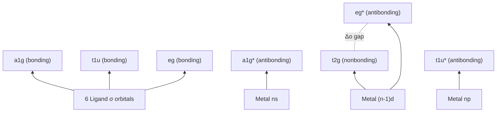

## Ligand Field and Molecular Orbital Approaches to Bonding


### Overview

Ligand field theory (LFT) and molecular orbital (MO) theory describe bonding in coordination compounds by combining metal $d$-orbitals with ligand orbitals through symmetry-adapted linear combinations. LFT extends crystal field theory (CFT) by incorporating covalency, while full MO treatments provide a first-principles description of both $\sigma$ and $\pi$ bonding.

### Limitations of Crystal Field Theory

CFT treats ligands as point charges producing a purely electrostatic perturbation on metal $d$-orbitals. It successfully predicts $d$-orbital splitting patterns and magnetic properties but fails to explain:

- The spectrochemical series ordering (e.g., why CO and CN⁻ are strong-field despite being anionic or neutral, not highly charged)
- Nephelauxetic effect (reduction of interelectronic repulsion parameters in complexes vs. free ions), indicating electron delocalization onto ligands
- Existence of $\pi$-backbonding in carbonyl and related complexes
- Covalent character evidenced by NMR, ESR (hyperfine coupling to ligand nuclei), and X-ray absorption spectroscopy

These observations require a bonding model that includes orbital overlap and electron sharing — the basis of ligand field/MO theory.

### Symmetry-Adapted Ligand Orbitals

For an octahedral $ML_6$ complex, six ligand $\sigma$-donor orbitals (e.g., lone pairs) transform as a reducible representation under the $O_h$ point group:

$$\Gamma_\sigma = a_{1g} + e_g + t_{1u}$$

**Key Points**

- Metal valence orbitals transform as: $s$ ($a_{1g}$), $p_x, p_y, p_z$ ($t_{1u}$), $d_{z^2}, d_{x^2-y^2}$ ($e_g$), $d_{xy}, d_{xz}, d_{yz}$ ($t_{2g}$)
- Only orbitals of matching symmetry can combine to form bonding/antibonding MOs
- The $t_{2g}$ metal orbitals have no symmetry match among $\sigma$-only ligand orbitals, so they remain **nonbonding** in a $\sigma$-only model

### Octahedral MO Diagram (σ-Only Bonding)

Combining $\Gamma_\sigma = a_{1g} + e_g + t_{1u}$ with metal $(n)s\ (a_{1g})$, $(n)p\ (t_{1u})$, and $(n-1)d\ (e_g + t_{2g})$ orbitals gives:

| MO Set | Symmetry | Character | Occupancy |
| --- | --- | --- | --- |
| Bonding | $a_{1g}, t_{1u}, e_g$ | Mostly ligand character | Filled (ligand lone pairs) |
| Nonbonding | $t_{2g}$ | Pure metal $d$ | Metal $d$-electrons |
| Antibonding | $e_g^*$ | Mostly metal $d$ character | Metal $d$-electrons (higher energy) |
| Antibonding | $a_{1g}^*, t_{1u}^*$ | Metal $s,p$ character | Usually empty |

The energy gap between the nonbonding $t_{2g}$ and antibonding $e_g^*$ sets is $\Delta_o$ (or $10Dq$), directly analogous to the CFT splitting but now understood as a bonding/antibonding gap rather than a purely electrostatic one.

**MO Energy Ordering (qualitative, σ-only octahedral):**



### σ-Donor-Only Diagram (svg_diagram)

```svg
<svg xmlns="http://www.w3.org/2000/svg" viewBox="0 0 640 420" font-family="Helvetica,Arial,sans-serif">
  <title>Octahedral MO Diagram sigma only (svg_diagram)</title>
  <line x1="60" y1="380" x2="580" y2="380" stroke="#333" stroke-width="1" />
  <text x="20" y="30" font-size="12" fill="#333">Energy</text>
  <line x1="30" y1="380" x2="30" y2="20" stroke="#333" stroke-width="1" marker-end="url(#arrow)" />
  <text x="90" y="55" font-size="12" text-anchor="middle">Metal AOs</text>
  <line x1="70" y1="70" x2="130" y2="70" stroke="#0055aa" stroke-width="3" />
  <text x="140" y="74" font-size="11">(n)p (t1u)</text>
  <line x1="70" y1="100" x2="130" y2="100" stroke="#0055aa" stroke-width="3" />
  <text x="140" y="104" font-size="11">(n)s (a1g)</text>
  <line x1="70" y1="150" x2="130" y2="150" stroke="#0055aa" stroke-width="3" />
  <line x1="70" y1="160" x2="130" y2="160" stroke="#0055aa" stroke-width="3" />
  <text x="140" y="158" font-size="11">(n-1)d (eg + t2g)</text>

  
  <text x="540" y="55" font-size="12" text-anchor="middle">Ligand SALCs</text>
  <line x1="480" y1="330" x2="540" y2="330" stroke="#aa2200" stroke-width="3" />
  <text x="410" y="334" font-size="11" text-anchor="end">6 σ orbitals</text>

  
  <text x="310" y="30" font-size="12" text-anchor="middle">MOs</text>

  
  <line x1="270" y1="60" x2="350" y2="60" stroke="#0055aa" stroke-width="3" />
  <text x="360" y="64" font-size="11">t1u*</text>
  <line x1="270" y1="80" x2="350" y2="80" stroke="#0055aa" stroke-width="3" />
  <text x="360" y="84" font-size="11">a1g*</text>

  
  <line x1="270" y1="150" x2="350" y2="150" stroke="#cc00cc" stroke-width="3" />
  <line x1="270" y1="160" x2="350" y2="160" stroke="#cc00cc" stroke-width="3" />
  <text x="360" y="158" font-size="11">eg* (metal-like)</text>

  
  <line x1="270" y1="230" x2="350" y2="230" stroke="#008800" stroke-width="3" />
  <line x1="270" y1="238" x2="350" y2="238" stroke="#008800" stroke-width="3" />
  <line x1="270" y1="246" x2="350" y2="246" stroke="#008800" stroke-width="3" />
  <text x="360" y="240" font-size="11">t2g (nonbonding)</text>

  
  <line x1="400" y1="160" x2="400" y2="230" stroke="#333" stroke-width="1" />
  <line x1="395" y1="160" x2="405" y2="160" stroke="#333" stroke-width="1" />
  <line x1="395" y1="230" x2="405" y2="230" stroke="#333" stroke-width="1" />
  <text x="410" y="198" font-size="12" fill="#333">Δo</text>

  
  <line x1="270" y1="330" x2="350" y2="330" stroke="#aa2200" stroke-width="3" />
  <text x="360" y="334" font-size="11">eg (ligand-like)</text>
  <line x1="270" y1="350" x2="350" y2="350" stroke="#aa2200" stroke-width="3" />
  <text x="360" y="354" font-size="11">t1u</text>
  <line x1="270" y1="365" x2="350" y2="365" stroke="#aa2200" stroke-width="3" />
  <text x="360" y="369" font-size="11">a1g</text>

  
  <line x1="130" y1="70" x2="270" y2="65" stroke="#999" stroke-dasharray="3,3" />
  <line x1="130" y1="100" x2="270" y2="82" stroke="#999" stroke-dasharray="3,3" />
  <line x1="130" y1="155" x2="270" y2="155" stroke="#999" stroke-dasharray="3,3" />
  <line x1="130" y1="155" x2="270" y2="233" stroke="#999" stroke-dasharray="3,3" />
  <line x1="480" y1="330" x2="270" y2="330" stroke="#999" stroke-dasharray="3,3" />
  <line x1="480" y1="330" x2="270" y2="352" stroke="#999" stroke-dasharray="3,3" />
  <line x1="480" y1="330" x2="270" y2="367" stroke="#999" stroke-dasharray="3,3" />
</svg>
```

### Incorporating π-Bonding

Ligands can also present orbitals of $\pi$ symmetry that interact with the metal $t_{2g}$ set (previously nonbonding), fundamentally reclassifying it as bonding or antibonding depending on ligand type.

**π-Acceptor Ligands (e.g., CO, CN⁻, phosphines, N₂)**

- Empty ligand $\pi^*$ orbitals (or low-lying $d$ orbitals for phosphines) are low in energy relative to filled $t_{2g}$
- Metal $t_{2g}$ (filled, nonbonding in σ-only model) donates electron density into ligand $\pi^*$ — "backbonding"
- This interaction is **bonding** between metal $t_{2g}$ and ligand $\pi^*$, stabilizing $t_{2g}$ and pushing it to lower energy
- Result: $\Delta_o$ **increases** — consistent with CO, CN⁻ being strong-field ligands in the spectrochemical series
- Backbonding also strengthens M–L bond and weakens the internal ligand bond (e.g., C≡O bond order decreases, observable via IR stretching frequency lowering from ~2143 cm⁻¹ in free CO to ~1850–2125 cm⁻¹ in metal carbonyls)

**π-Donor Ligands (e.g., F⁻, Cl⁻, O²⁻, OH⁻)**

- Filled ligand $p_\pi$ orbitals are close in energy to (often below) the metal $t_{2g}$ set
- Interaction produces a filled bonding combination (mostly ligand character, lower energy) and a filled antibonding combination that becomes the new, destabilized $t_{2g}^*$
- Since $t_{2g}$ is now antibonding and pushed **up** in energy, $\Delta_o$ **decreases**
- Consistent with halides and oxo ligands being weak-field in the spectrochemical series

**Spectrochemical Series Rationalized:**

$$\text{I}^- < \text{Br}^- < \text{S}^{2-} < \text{Cl}^- < \text{F}^- < \text{OH}^- < \text{H}_2\text{O} < \text{NH}_3 < \text{en} < \text{NO}_2^- < \text{CN}^- < \text{CO}$$

Trend: strong $\pi$-donors (left) → weak-field, small $\Delta_o$; pure $\sigma$-donors (middle) → intermediate; strong $\pi$-acceptors (right) → strong-field, large $\Delta_o$.

**π-Interaction Effects on t2g Set (svg_diagram)**

```svg
<svg xmlns="http://www.w3.org/2000/svg" viewBox="0 0 620 300" font-family="Helvetica,Arial,sans-serif">
  <title>Effect of pi donor and pi acceptor ligands on t2g energy (svg_diagram)</title>
  <line x1="40" y1="270" x2="580" y2="270" stroke="#333" />
  <text x="10" y="30" font-size="12">E</text>
  <line x1="20" y1="260" x2="20" y2="20" stroke="#333" marker-end="url(#a2)" />
  <text x="140" y="50" font-size="12" text-anchor="middle">π-donor case</text>
  <line x1="90" y1="90" x2="190" y2="90" stroke="#cc00cc" stroke-width="3" />
  <text x="200" y="94" font-size="10">eg*</text>
  <line x1="90" y1="140" x2="190" y2="140" stroke="#008800" stroke-width="3" />
  <text x="200" y="144" font-size="10">t2g* (destabilized, antibonding w/ ligand pπ)</text>
  <line x1="90" y1="70" x2="190" y2="70" stroke="#666" stroke-dasharray="2,2" />
  <text x="60" y="120" font-size="10">Δo (small)</text>

  
  <text x="330" y="50" font-size="12" text-anchor="middle">σ-only baseline</text>
  <line x1="280" y1="95" x2="380" y2="95" stroke="#cc00cc" stroke-width="3" />
  <text x="390" y="99" font-size="10">eg*</text>
  <line x1="280" y1="175" x2="380" y2="175" stroke="#008800" stroke-width="3" />
  <text x="390" y="179" font-size="10">t2g (nonbonding)</text>
  <text x="250" y="140" font-size="10">Δo (ref.)</text>

  
  <text x="510" y="50" font-size="12" text-anchor="middle">π-acceptor case</text>
  <line x1="460" y1="100" x2="560" y2="100" stroke="#cc00cc" stroke-width="3" />
  <text x="565" y="104" font-size="10">eg*</text>
  <line x1="460" y1="220" x2="560" y2="220" stroke="#008800" stroke-width="3" />
  <text x="565" y="224" font-size="10">t2g (stabilized, bonding w/ ligand π*)</text>
  <text x="430" y="165" font-size="10">Δo (large)</text>
</svg>
```

### Comparison: CFT vs. LFT vs. MO Theory

| Feature | CFT | LFT | MO Theory |
| --- | --- | --- | --- |
| Bonding model | Pure electrostatics | Electrostatics + qualitative covalency | Full orbital overlap treatment |
| Explains $\Delta_o$ magnitude trends | Poorly | Reasonably | Well |
| Explains nephelauxetic effect | No | Partially | Yes |
| Explains π-backbonding | No | Qualitatively | Quantitatively |
| Computational basis | None (empirical) | Semi-empirical | Ab initio / DFT compatible |

### Jahn–Teller Effect in MO Context

Unequal occupation of degenerate $e_g^*$ or $t_{2g}$ orbitals (e.g., high-spin $d^4$, $d^9$, low-spin $d^7$) leads to geometric distortion that removes orbital degeneracy and lowers total energy — a direct consequence of the MO picture's degenerate antibonding orbital sets, not merely an electrostatic argument.

### Tetrahedral and Other Geometries

For tetrahedral $ML_4$ ($T_d$ symmetry):

$$\Gamma_\sigma = a_1 + t_2$$

Metal $d$-orbitals split into $e$ (nonbonding, lower) and $t_2$ (bonding/antibonding admixture with ligand $\sigma$ and $\pi$ sets), giving $\Delta_t \approx \frac{4}{9}\Delta_o$ for comparable ligands. The absence of a center of symmetry increases metal–ligand orbital mixing (more $p$-orbital participation), generally giving smaller splitting than octahedral fields.

**Example**

For $[\text{Cr(CO)}_6]$: CO is a strong π-acceptor. Metal $t_{2g}$ (filled, $d^6$ low-spin Cr(0)) backbonds into CO $\pi^*$, stabilizing $t_{2g}$ and yielding a large $\Delta_o$. This synergic bonding accounts for the diamagnetism and thermal stability of the complex, and IR shows $\nu_{CO}$ lowered relative to free CO, consistent with backbonding into the antibonding $\pi^*$ orbital of CO. [Inference: exact $\nu_{CO}$ shift magnitude is compound- and substituent-dependent and should be confirmed against reference spectra for specific complexes.]

### Angular Overlap Model (AOM)

A semi-quantitative extension of LFT that parameterizes $\sigma$ and $\pi$ interactions independently using overlap-dependent energy parameters $e_\sigma$ and $e_\pi$ (with $e_\pi$ negative for π-donors, positive for π-acceptors upon appropriate sign convention). Total $d$-orbital energy shifts are computed as a sum over ligand positions, allowing treatment of low-symmetry and mixed-ligand complexes where simple $O_h$/$T_d$ symmetry arguments do not directly apply.

**Conclusion**

Ligand field and MO approaches unify the electrostatic simplicity of CFT with quantum mechanical rigor, explaining spectrochemical trends, magnetic behavior, structural distortions, and spectroscopic signatures (IR, UV-Vis, ESR) that CFT alone cannot rationalize. The σ-only MO diagram reproduces CFT's $t_{2g}/e_g^*$ splitting, while inclusion of π-symmetry ligand orbitals correctly predicts why π-acceptors increase and π-donors decrease $\Delta_o$.

**Related Topics**

- Crystal field theory and $d$-orbital splitting diagrams
- Spectrochemical series and factors affecting $\Delta_o$
- Jahn–Teller distortion and its spectroscopic consequences
- π-Backbonding in metal carbonyls and related organometallics
- Angular overlap model parameterization
- Tanabe-Sugano diagrams and electronic spectra of transition metal complexes
- High-spin/low-spin crossover and magnetic susceptibility
- Nephelauxetic series and Racah parameters
- Symmetry and group theory in coordination chemistry (character tables, SALCs)
- Photoelectron spectroscopy and experimental validation of MO diagrams