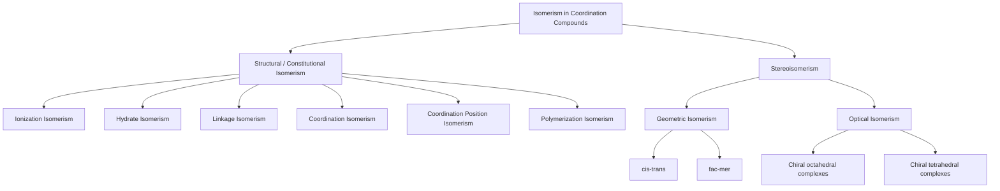

## Isomerism in Coordination Compounds


### Overview

Coordination compounds exhibit two broad classes of isomerism: **structural (constitutional) isomerism**, where atoms are connected differently, and **stereoisomerism**, where connectivity is identical but spatial arrangement differs. Isomerism arises from the variety of ways ligands can bond to and around a central metal, and it has significant consequences for reactivity, spectroscopy, and biological activity.

### Classification Overview



### Structural (Constitutional) Isomerism

**Ionization Isomerism**

Occurs when a complex ion and its counter-ion exchange a ligand and the counter-ion group, producing different ions in solution upon dissociation.

- $[\text{Co(NH}_3)_5\text{Br}]\text{SO}_4$ vs. $[\text{Co(NH}_3)_5\text{SO}_4]\text{Br}$
- The first gives $\text{SO}_4^{2-}$ in solution (tested by $\text{BaCl}_2$ precipitation); the second gives $\text{Br}^-$ (tested by $\text{AgNO}_3$ precipitation)

**Hydrate (Solvate) Isomerism**

A special case of ionization isomerism involving water as the exchanged species.

- $[\text{Cr(H}_2\text{O)}_6]\text{Cl}_3$ (violet, 3 mol Cl⁻ ionizable)
- $[\text{Cr(H}_2\text{O)}_5\text{Cl}]\text{Cl}_2 \cdot \text{H}_2\text{O}$ (blue-green, 2 mol Cl⁻ ionizable)
- $[\text{Cr(H}_2\text{O)}_4\text{Cl}_2]\text{Cl} \cdot 2\text{H}_2\text{O}$ (dark green, 1 mol Cl⁻ ionizable)

Distinguished experimentally by conductometric titration (molar conductivity correlates with number of free ions) and gravimetric chloride analysis.

**Linkage Isomerism**

Occurs when an ambidentate ligand (one with two or more potential donor atoms) coordinates through different atoms.

| Ligand | Donor Atom 1 | Donor Atom 2 |
| --- | --- | --- |
| $\text{NO}_2^-$ | N (nitro) | O (nitrito) |
| $\text{SCN}^-$ | S (thiocyanato) | N (isothiocyanato) |
| $\text{CN}^-$ | C (cyano) | N (isocyano) |
| $\text{DMSO}$ | S | O |

**Example**

$[\text{Co(NH}_3)_5(\text{NO}_2)]\text{Cl}_2$ (nitro, Co–NO₂, yellow-brown) vs. $[\text{Co(NH}_3)_5(\text{ONO})]\text{Cl}_2$ (nitrito, Co–ONO, red). Distinguished by IR spectroscopy: nitro shows $\nu(\text{N=O})$ near 1310 and 1430 cm⁻¹, while nitrito shows $\nu(\text{N=O})$ near 1465 cm⁻¹ and $\nu(\text{N-O})$ near 1065 cm⁻¹. [Inference: precise band positions vary with the specific metal complex and should be confirmed against literature spectra.]

**Coordination Isomerism**

Occurs in compounds containing both cationic and anionic complex ions, where ligand distribution between the two metal centers varies.

- $[\text{Co(NH}_3)_6][\text{Cr(CN)}_6]$ vs. $[\text{Cr(NH}_3)_6][\text{Co(CN)}_6]$
- $[\text{Pt(NH}_3)_4][\text{PtCl}_6]$ vs. $[\text{PtCl}_2(\text{NH}_3)_2][\text{PtCl}_4]$

**Coordination Position Isomerism**

A subtype of coordination isomerism occurring in polynuclear complexes, where the distribution of ligands between two (or more) metal centers connected by bridges differs while total composition remains the same.

**Polymerization Isomerism**

Compounds sharing the same empirical formula but different molecular formulas (multiples of a simple unit), each potentially a distinct compound.

- $[\text{Pt(NH}_3)_2\text{Cl}_2]$ (monomer) vs. $[\text{Pt(NH}_3)_4][\text{PtCl}_4]$ (formally a "tetramer" by empirical formula, though structurally distinct compounds)

### Stereoisomerism

**Geometric (cis-trans) Isomerism — Square Planar $MA_2B_2$**

For square planar complexes of type $[MA_2B_2]$:

- **cis**: identical ligands adjacent (90° apart)
- **trans**: identical ligands opposite (180° apart)

**Example**: $[\text{Pt(NH}_3)_2\text{Cl}_2]$ (cisplatin vs. transplatin)

- *cis*-diamminedichloroplatinum(II) is a clinically important anticancer drug (binds DNA guanine N7 sites, causing intrastrand crosslinks)
- *trans* isomer is biologically inactive/less effective due to different DNA-binding geometry

**Square Planar Isomer Structures (svg_diagram)**

```svg
<svg xmlns="http://www.w3.org/2000/svg" viewBox="0 0 500 240" font-family="Helvetica,Arial,sans-serif">
  <title>cis and trans square planar isomers of Pt(NH3)2Cl2 (svg_diagram)</title>
  
  <text x="110" y="25" font-size="14" text-anchor="middle">cis-[Pt(NH3)2Cl2]</text>
  <rect x="70" y="60" width="80" height="80" fill="none" stroke="#333" stroke-width="1.5" transform="rotate(45 110 100)" />
  <circle cx="110" cy="100" r="10" fill="#888" />
  <text x="110" y="104" font-size="9" text-anchor="middle" fill="#fff">Pt</text>
  <circle cx="110" cy="45" r="8" fill="#2277cc" />
  <text x="110" y="30" font-size="10" text-anchor="middle">NH3</text>
  <circle cx="165" cy="100" r="8" fill="#2277cc" />
  <text x="185" y="104" font-size="10" text-anchor="middle">NH3</text>
  <circle cx="110" cy="155" r="8" fill="#33aa33" />
  <text x="110" y="175" font-size="10" text-anchor="middle">Cl</text>
  <circle cx="55" cy="100" r="8" fill="#33aa33" />
  <text x="35" y="104" font-size="10" text-anchor="middle">Cl</text>

  
  <text x="380" y="25" font-size="14" text-anchor="middle">trans-[Pt(NH3)2Cl2]</text>
  <rect x="340" y="60" width="80" height="80" fill="none" stroke="#333" stroke-width="1.5" transform="rotate(45 380 100)" />
  <circle cx="380" cy="100" r="10" fill="#888" />
  <text x="380" y="104" font-size="9" text-anchor="middle" fill="#fff">Pt</text>
  <circle cx="380" cy="45" r="8" fill="#2277cc" />
  <text x="380" y="30" font-size="10" text-anchor="middle">NH3</text>
  <circle cx="380" cy="155" r="8" fill="#2277cc" />
  <text x="380" y="175" font-size="10" text-anchor="middle">NH3</text>
  <circle cx="435" cy="100" r="8" fill="#33aa33" />
  <text x="455" y="104" font-size="10" text-anchor="middle">Cl</text>
  <circle cx="325" cy="100" r="8" fill="#33aa33" />
  <text x="305" y="104" font-size="10" text-anchor="middle">Cl</text>
</svg>
```

**Geometric Isomerism — Octahedral $MA_4B_2$**

Analogous cis/trans relationship: cis has the two B ligands at 90°, trans has them at 180°.

**Geometric Isomerism — Octahedral $MA_3B_3$: fac and mer**

- **facial (fac)**: three identical ligands occupy one triangular face of the octahedron (mutually cis, all 90° to each other)
- **meridional (mer)**: three identical ligands lie along a meridian (one pair trans, spanning 180°)

**Example**: $[\text{Co(NH}_3)_3(\text{NO}_2)_3]$ exists as fac and mer isomers, distinguishable by IR and NMR due to different local symmetry ($C_{3v}$ for fac vs. $C_s$ for mer).

**fac/mer Octahedral Isomers (svg_diagram)**

```svg
<svg xmlns="http://www.w3.org/2000/svg" viewBox="0 0 500 260" font-family="Helvetica,Arial,sans-serif">
  <title>facial and meridional isomers of MA3B3 (svg_diagram)</title>
  <text x="120" y="25" font-size="14" text-anchor="middle">fac-MA3B3</text>
  <circle cx="120" cy="130" r="10" fill="#888" />
  <text x="120" y="134" font-size="9" text-anchor="middle" fill="#fff">M</text>
  <circle cx="120" cy="60" r="8" fill="#33aa33" />
  <text x="120" y="45" font-size="10" text-anchor="middle">B</text>
  <circle cx="185" cy="95" r="8" fill="#33aa33" />
  <text x="205" y="90" font-size="10" text-anchor="middle">B</text>
  <circle cx="65" cy="165" r="8" fill="#33aa33" />
  <text x="45" y="180" font-size="10" text-anchor="middle">B</text>
  <circle cx="120" cy="200" r="8" fill="#2277cc" />
  <text x="120" y="220" font-size="10" text-anchor="middle">A</text>
  <circle cx="55" cy="95" r="8" fill="#2277cc" />
  <text x="30" y="90" font-size="10" text-anchor="middle">A</text>
  <circle cx="185" cy="165" r="8" fill="#2277cc" />
  <text x="210" y="180" font-size="10" text-anchor="middle">A</text>
  <line x1="120" y1="130" x2="120" y2="60" stroke="#999" />
  <line x1="120" y1="130" x2="185" y2="95" stroke="#999" />
  <line x1="120" y1="130" x2="65" y2="165" stroke="#999" />

  <text x="380" y="25" font-size="14" text-anchor="middle">mer-MA3B3</text>
  <circle cx="380" cy="130" r="10" fill="#888" />
  <text x="380" y="134" font-size="9" text-anchor="middle" fill="#fff">M</text>
  <circle cx="380" cy="60" r="8" fill="#33aa33" />
  <text x="380" y="45" font-size="10" text-anchor="middle">B</text>
  <circle cx="380" cy="200" r="8" fill="#33aa33" />
  <text x="380" y="220" font-size="10" text-anchor="middle">B</text>
  <circle cx="445" cy="130" r="8" fill="#33aa33" />
  <text x="465" y="134" font-size="10" text-anchor="middle">B</text>
  <circle cx="315" cy="130" r="8" fill="#2277cc" />
  <text x="290" y="134" font-size="10" text-anchor="middle">A</text>
  <circle cx="345" cy="95" r="8" fill="#2277cc" />
  <text x="325" y="80" font-size="10" text-anchor="middle">A</text>
  <circle cx="345" cy="165" r="8" fill="#2277cc" />
  <text x="325" y="185" font-size="10" text-anchor="middle">A</text>
</svg>
```

### Optical Isomerism (Chirality)

Optical isomers (enantiomers) are non-superimposable mirror images that rotate plane-polarized light in opposite directions. They arise when a complex lacks an internal plane of symmetry ($\sigma$) or improper rotation axis ($S_n$).

**Octahedral Chelate Complexes**

Tris-chelate complexes such as $[\text{M(en)}_3]^{n+}$ (en = ethylenediamine) are chiral, existing as $\Delta$ (delta, right-handed propeller) and $\Lambda$ (lambda, left-handed propeller) enantiomers, belonging to point group $D_3$.

**Cis-Disubstituted Octahedral Complexes**

$cis\text{-}[\text{Co(en)}_2\text{Cl}_2]^+$ is chiral (point group $C_2$), while the *trans* isomer is achiral (has a $C_2$ axis and mirror plane, point group $C_{2h}$).

**Δ/Λ Enantiomers of [M(en)₃]ⁿ⁺ (svg_diagram)**

```svg
<svg xmlns="http://www.w3.org/2000/svg" viewBox="0 0 480 240" font-family="Helvetica,Arial,sans-serif">
  <title>Delta and Lambda enantiomers of tris-chelate complex (svg_diagram)</title>
  <text x="120" y="25" font-size="14" text-anchor="middle">Δ (Delta)</text>
  <circle cx="120" cy="130" r="8" fill="#888" />
  <path d="M 120 130 Q 170 90 200 130 Q 170 170 120 130" fill="none" stroke="#2277cc" stroke-width="2" />
  <path d="M 120 130 Q 90 70 60 100 Q 70 140 120 130" fill="none" stroke="#33aa33" stroke-width="2" />
  <path d="M 120 130 Q 150 190 100 200 Q 70 170 120 130" fill="none" stroke="#cc6600" stroke-width="2" />
  <text x="120" y="220" font-size="10" text-anchor="middle">right-handed propeller twist</text>

  <text x="380" y="25" font-size="14" text-anchor="middle">Λ (Lambda)</text>
  <circle cx="380" cy="130" r="8" fill="#888" />
  <path d="M 380 130 Q 330 90 300 130 Q 330 170 380 130" fill="none" stroke="#2277cc" stroke-width="2" />
  <path d="M 380 130 Q 410 70 440 100 Q 430 140 380 130" fill="none" stroke="#33aa33" stroke-width="2" />
  <path d="M 380 130 Q 350 190 400 200 Q 430 170 380 130" fill="none" stroke="#cc6600" stroke-width="2" />
  <text x="380" y="220" font-size="10" text-anchor="middle">left-handed propeller twist (mirror image)</text>
</svg>
```

**Detecting Chirality**

- Enantiomers show identical physical properties (melting point, solubility, IR/UV-Vis spectra) but rotate plane-polarized light equally and oppositely (specific rotation $[\alpha]$)
- Distinguished from racemic mixtures using chiral resolving agents or circular dichroism (CD) spectroscopy
- A complex is chiral if it possesses only proper rotation axes ($C_n$) and no $S_n$ (including $\sigma$ as $S_1$ and $i$ as $S_2$)

### Combined Geometric + Optical Isomerism

Some complexes show both types simultaneously. For $[\text{Co(en)}_2\text{Cl}_2]^+$:

| Isomer | Chiral? | Point Group |
| --- | --- | --- |
| cis | Yes (Δ and Λ forms) | $C_2$ |
| trans | No | $C_{2h}$ |

Total distinct stereoisomers = 3 (one trans, two cis enantiomers).

### Isomer Count Summary Table

| Complex Type | Geometric Isomers | Optical Isomers |
| --- | --- | --- |
| $[MA_2B_2]$ square planar | cis, trans (2) | None (both achiral) |
| $[MA_4B_2]$ octahedral | cis, trans (2) | None |
| $[MA_3B_3]$ octahedral | fac, mer (2) | None (both achiral, $C_{3v}$/$C_s$) |
| $[M(AA)_3]$ (tris-chelate) | N/A | Δ, Λ (2) |
| $[MA_2(BB)_2]$ octahedral | cis, trans (2) | cis is chiral (Δ, Λ); trans achiral |

### Experimental Methods for Distinguishing Isomers

- **IR spectroscopy**: number and position of bands differ due to symmetry differences (e.g., fac vs. mer, linkage isomers)
- **UV-Vis spectroscopy**: differing $\Delta_o$ due to different ligand field environments (relevant mainly for geometric isomers with different donor-atom arrangements)
- **NMR spectroscopy**: number of chemically distinct environments differs (e.g., fac isomer of $C_{3v}$ symmetry gives fewer signals than mer of $C_s$ symmetry)
- **Optical rotation / polarimetry**: distinguishes enantiomers, not diastereomers
- **X-ray crystallography**: definitive structural assignment
- **Dipole moment measurements**: cis isomers of square planar/octahedral complexes typically have nonzero dipole moment; trans isomers often have zero or reduced dipole moment due to symmetry cancellation

**Conclusion**

Isomerism in coordination chemistry spans structural differences in atom connectivity (ionization, hydrate, linkage, coordination, and polymerization isomerism) and stereochemical differences in spatial arrangement (geometric and optical isomerism). Recognizing isomer type requires analyzing ligand donor-atom identity, denticity, and the point-group symmetry of the resulting complex, with practical differentiation relying on spectroscopic and physicochemical techniques.

**Related Topics**

- Chelate effect and denticity of ligands
- Point group determination for coordination complexes
- Werner's coordination theory and historical isomer studies
- Cisplatin mechanism of action and structure-activity relationships
- Circular dichroism spectroscopy of chiral metal complexes
- Nomenclature rules (IUPAC) for coordination compounds
- Trans effect and trans influence in square planar substitution
- Chelate ring conformations (λ/δ) in ethylenediamine complexes