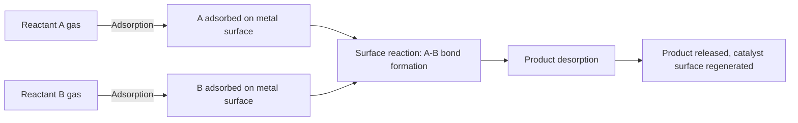
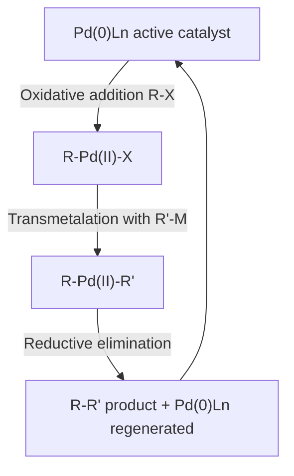

## Catalytic Roles of Transition Metals


### Overview

Transition metals are exceptional catalysts because their partially filled $d$-orbitals, variable oxidation states, and ability to expand or contract coordination number allow them to bind substrates, stabilize reactive intermediates, and lower activation energy pathways that would otherwise be inaccessible. Catalysis occurs in both **heterogeneous** (metal surface/solid-phase) and **homogeneous** (soluble metal complex) systems, spanning industrial, environmental, and biological contexts.

### Why Transition Metals Are Effective Catalysts

**Key Points**

- **Variable oxidation states**: allow reversible electron transfer (e.g., Fe²⁺/Fe³⁺, Pd⁰/Pd²⁺, Pt²⁺/Pt⁴⁺) enabling redox catalytic cycles
- **Variable coordination number/geometry**: metals can accommodate incoming substrates by expanding coordination sphere (e.g., 16e⁻ to 18e⁻ transitions in organometallic catalysis) or by ligand dissociation to create vacant sites
- **d-orbital availability**: partially filled or accessible $d$-orbitals allow back-bonding to stabilize unsaturated/π-acidic substrates (CO, alkenes, alkynes), weakening internal bonds and activating them toward reaction
- **Lewis acidity**: many transition metal centers act as Lewis acids, polarizing substrate bonds
- Combined, these properties allow transition metals to lower activation barriers by providing alternative, lower-energy reaction pathways involving bound intermediates

### Heterogeneous Catalysis

In heterogeneous catalysis, the metal is a solid (often finely divided metal or metal on a support) and reactants are typically gases or liquids adsorbed onto the metal surface.

**General Mechanism (Langmuir-Hinshelwood type)**



**Key Steps**

1. **Adsorption**: reactant molecules bind to metal surface active sites (chemisorption), often weakening internal bonds (e.g., H₂ dissociates into individual H atoms on Pt/Pd/Ni surfaces)
2. **Surface diffusion**: adsorbed species migrate across the surface to reactive sites
3. **Surface reaction**: bond formation/breaking occurs between adsorbed species
4. **Desorption**: product releases from the surface, freeing active sites for further catalysis

**Industrial Examples**

| Process | Catalyst | Reaction |
| --- | --- | --- |
| Haber-Bosch process | Fe (promoted with $\text{K}_2\text{O}$, $\text{Al}_2\text{O}_3$) | $\text{N}_2 + 3\text{H}_2 \rightarrow 2\text{NH}_3$ |
| Contact process | $\text{V}_2\text{O}_5$ | $2\text{SO}_2 + \text{O}_2 \rightarrow 2\text{SO}_3$ |
| Catalytic hydrogenation | Ni, Pd, Pt | $\text{C=C} + \text{H}_2 \rightarrow \text{C-C}$ |
| Automotive catalytic converter | Pt, Pd, Rh | $\text{CO} + \text{NO}_x + \text{hydrocarbons} \rightarrow \text{CO}_2 + \text{N}_2 + \text{H}_2\text{O}$ |
| Fischer-Tropsch synthesis | Fe, Co | $n\text{CO} + (2n+1)\text{H}_2 \rightarrow \text{C}_n\text{H}_{2n+2} + n\text{H}_2\text{O}$ |

**Example**

In the Haber-Bosch process, N₂'s strong triple bond ($\sim$945 kJ/mol) is weakened upon chemisorption onto the iron surface, where N₂ dissociates into individual N atoms bound to Fe. This dramatically lowers the activation energy for subsequent stepwise hydrogenation to $\text{NH}_3$, compared to the enormous barrier for uncatalyzed gas-phase reaction. [Inference: modern industrial conditions and exact promoter compositions vary by plant and are proprietary/process-specific; general figures should be confirmed against current process engineering references.]

### Homogeneous Catalysis

In homogeneous catalysis, the metal complex is dissolved in the same phase as the reactants (typically organometallic complexes in organic solvents), enabling precise mechanistic study and high selectivity.

**Common Elementary Steps in Organometallic Catalytic Cycles**

- **Oxidative addition**: metal inserts into a substrate bond (A–B), increasing oxidation state by 2 and coordination number by 2


  $$L_nM + A{-}B \rightarrow L_nM(A)(B)$$
- **Reductive elimination**: reverse of oxidative addition; two ligands couple and leave, decreasing oxidation state by 2
- **Migratory insertion**: a ligand (e.g., alkyl) migrates to an adjacent coordinated unsaturated ligand (e.g., CO, alkene), forming a new bond while maintaining formal oxidation state
- **β-hydride elimination**: reverse of insertion; a β-hydrogen migrates to the metal, forming M–H and releasing an alkene
- **Ligand association/dissociation**: reversible binding/loss of a two-electron donor ligand, adjusting coordination number

**18-Electron Rule**

Stable, isolable organometallic complexes generally favor 18 valence electrons at the metal (analogous to noble gas configuration), though many catalytically active intermediates are 16-electron, coordinatively unsaturated species that readily bind substrate.

### Wilkinson's Catalyst: Homogeneous Hydrogenation

$[\text{RhCl(PPh}_3)_3]$ catalyzes alkene hydrogenation in solution, offering high selectivity (e.g., avoiding over-reduction, tolerating other functional groups) compared to heterogeneous hydrogenation.

**Catalytic Cycle (svg_diagram)**

```svg
<svg xmlns="http://www.w3.org/2000/svg" viewBox="0 0 600 420" font-family="Helvetica,Arial,sans-serif">
  <title>Wilkinsons catalyst hydrogenation cycle (svg_diagram)</title>
  <circle cx="300" cy="210" r="150" fill="none" stroke="#ccc" stroke-dasharray="4,4" />

  <rect x="240" y="20" width="140" height="40" rx="6" fill="#e8f0ff" stroke="#2277cc" />
  <text x="310" y="45" font-size="11" text-anchor="middle">RhCl(PPh3)3 (16e-)</text>

  <rect x="440" y="120" width="150" height="40" rx="6" fill="#e8f0ff" stroke="#2277cc" />
  <text x="515" y="145" font-size="10" text-anchor="middle">Oxidative addition of H2</text>

  <rect x="440" y="260" width="150" height="40" rx="6" fill="#e8f0ff" stroke="#2277cc" />
  <text x="515" y="285" font-size="10" text-anchor="middle">RhH2Cl(PPh3)2(alkene)</text>

  <rect x="240" y="360" width="150" height="40" rx="6" fill="#e8f0ff" stroke="#2277cc" />
  <text x="315" y="385" font-size="10" text-anchor="middle">Migratory insertion (alkyl-Rh)</text>

  <rect x="20" y="260" width="150" height="40" rx="6" fill="#e8f0ff" stroke="#2277cc" />
  <text x="95" y="285" font-size="10" text-anchor="middle">Reductive elimination</text>

  <text x="300" y="410" font-size="11" text-anchor="middle">Product alkane released, catalyst regenerated</text>

  <path d="M 380 40 Q 460 70 500 120" fill="none" stroke="#333" marker-end="url(#arr3)" />
  <path d="M 515 160 L 515 260" fill="none" stroke="#333" marker-end="url(#arr3)" />
  <path d="M 460 290 Q 400 340 390 360" fill="none" stroke="#333" marker-end="url(#arr3)" />
  <path d="M 240 385 Q 150 350 130 300" fill="none" stroke="#333" marker-end="url(#arr3)" />
  <path d="M 95 260 Q 150 100 240 45" fill="none" stroke="#333" marker-end="url(#arr3)" />

  <text x="60" y="430" font-size="9">H2 →</text>
  <text x="220" y="200" font-size="9">alkene coordinates →</text>
</svg>
```

**Mechanistic Steps**

1. Oxidative addition of $\text{H}_2$ to $\text{Rh(I)}$ → $\text{Rh(III)}$ dihydride (16e⁻ → 18e⁻)
2. Dissociation of one phosphine ligand creates vacant site; alkene coordinates
3. Migratory insertion: alkene inserts into Rh–H bond forming alkyl-Rh species
4. Reductive elimination releases alkane product, regenerating active 16e⁻ Rh(I) catalyst

### Other Major Homogeneous Catalytic Processes

**Hydroformylation (Oxo Process)**

Converts alkenes to aldehydes using $\text{CO/H}_2$ (syngas) with Rh or Co phosphine catalysts:

$$\text{RCH=CH}_2 + \text{CO} + \text{H}_2 \xrightarrow{\text{[Rh] or [Co] cat.}} \text{RCH}_2\text{CH}_2\text{CHO}$$

Industrially significant for producing aldehydes/alcohols used in plasticizers and detergents.

**Wacker Process**

Palladium-catalyzed oxidation of ethylene to acetaldehyde, using $\text{PdCl}_2/\text{CuCl}_2$ with $\text{O}_2$ reoxidant:

$$\text{CH}_2=\text{CH}_2 + \frac{1}{2}\text{O}_2 \xrightarrow{\text{PdCl}_2, \text{CuCl}_2} \text{CH}_3\text{CHO}$$

Mechanism involves Pd(II) alkene coordination, nucleophilic attack by water/hydroxide, β-hydride elimination, and Cu(II)-mediated reoxidation of Pd(0) back to Pd(II).

**Cross-Coupling Reactions (Pd-Catalyzed)**

Palladium catalysts enable formation of C–C bonds between organic halides and organometallic nucleophiles via oxidative addition/transmetalation/reductive elimination cycles.

| Reaction | Nucleophile | Discoverer(s) |
| --- | --- | --- |
| Suzuki-Miyaura | Organoboron | Suzuki, Miyaura |
| Negishi | Organozinc | Negishi |
| Stille | Organotin | Stille |
| Heck | Alkene (no transmetalation) | Heck |
| Sonogashira | Terminal alkyne (Cu co-catalyst) | Sonogashira |

These reactions (2010 Nobel Prize in Chemistry: Heck, Negishi, Suzuki) revolutionized synthetic organic chemistry, pharmaceuticals, and materials science by enabling selective, mild C–C bond formation.

**General Cross-Coupling Cycle**



### Ziegler-Natta and Metallocene Polymerization Catalysis

$\text{TiCl}_4/\text{AlEt}_3$ (Ziegler-Natta) and metallocene catalysts (e.g., $\text{Cp}_2\text{ZrCl}_2$/MAO) polymerize alkenes (ethylene, propylene) with high stereoregularity, producing isotactic or syndiotactic polymers via repeated migratory insertion into a growing polymer chain at a metal-alkyl active site (Cossee-Arlman mechanism).

### Metathesis Catalysis

Grubbs (Ru-based) and Schrock (Mo-based) catalysts enable olefin metathesis — redistribution of alkylidene fragments between alkenes via a metallacyclobutane intermediate:

$$\text{R}_1\text{CH=CHR}_2 + \text{R}_3\text{CH=CHR}_4 \rightleftharpoons \text{R}_1\text{CH=CHR}_3 + \text{R}_2\text{CH=CHR}_4$$

Applications include ring-closing metathesis (RCM), ring-opening metathesis polymerization (ROMP), and cross metathesis, widely used in pharmaceutical and materials synthesis (2005 Nobel Prize: Chauvin, Grubbs, Schrock).

### Biological (Enzymatic) Transition Metal Catalysis

| Enzyme | Metal Center | Function |
| --- | --- | --- |
| Cytochrome P450 | Fe (heme) | Hydroxylation, oxidative metabolism |
| Nitrogenase | Fe-Mo cofactor | $\text{N}_2$ fixation to $\text{NH}_3$ |
| Carbonic anhydrase | Zn²⁺ | $\text{CO}_2$ hydration to $\text{HCO}_3^-$ |
| Superoxide dismutase | Cu/Zn or Mn or Fe | Disproportionation of $\text{O}_2^-$ |
| Hydrogenase | Fe-Fe or Ni-Fe | $\text{H}_2$ activation/production |

These systems mirror synthetic organometallic principles (oxidative addition, ligand exchange, redox cycling) but operate at ambient temperature/pressure with remarkable selectivity, motivating biomimetic catalyst design.

### Heterogeneous vs. Homogeneous: Comparison

| Property | Heterogeneous | Homogeneous |
| --- | --- | --- |
| Phase | Different from reactants (solid catalyst) | Same as reactants (dissolved) |
| Selectivity | Generally lower | Generally higher, tunable via ligands |
| Mechanistic study | Difficult (surface science techniques needed) | Easier (spectroscopy, kinetics in solution) |
| Catalyst recovery/reuse | Easy (filtration) | Difficult (often requires special separation) |
| Industrial scale-up | Well-established, robust | More sensitive to conditions, often costlier |
| Examples | Haber process, catalytic converters | Wilkinson's catalyst, cross-coupling |

### Catalyst Poisoning and Deactivation

Heterogeneous catalysts can be deactivated by strongly adsorbing impurities (e.g., sulfur poisoning Pt catalytic converters, CO poisoning Pt fuel cell electrodes) that block active sites irreversibly or reversibly. Homogeneous catalysts can deactivate via ligand dissociation, aggregation to inactive metal clusters/nanoparticles, or oxidative decomposition. [Inference: specific poisoning thresholds and deactivation pathways are catalyst- and condition-specific and should be verified against current process literature.]

**Conclusion**

Transition metals catalyze an extraordinarily broad range of reactions because their variable oxidation states, flexible coordination environments, and d-orbital bonding capabilities allow them to activate strong bonds, stabilize reactive intermediates, and provide stepwise low-energy pathways. Heterogeneous catalysis dominates large-scale industrial processes (ammonia synthesis, petroleum refining, emissions control), while homogeneous organometallic catalysis enables the high selectivity essential to pharmaceutical and fine chemical synthesis, with biological metalloenzymes providing benchmark examples of catalytic efficiency.

**Related Topics**

- Oxidative addition and reductive elimination mechanisms
- 18-electron rule and organometallic complex stability
- Ligand field and molecular orbital approaches to bonding
- Cross-coupling reactions (Suzuki, Negishi, Heck, Sonogashira)
- Olefin metathesis (Grubbs and Schrock catalysts)
- Enzymatic metal cofactors and bioinorganic chemistry
- Catalyst poisoning and heterogeneous surface chemistry
- Ziegler-Natta and metallocene polymerization catalysis
- Green chemistry and catalytic sustainability principles