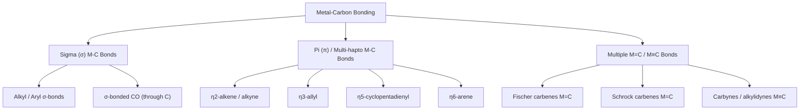

## Types of Metal to Carbon Bonding


### Overview

Organometallic chemistry is defined by the presence of direct metal-to-carbon bonds. These bonds vary widely in character — from simple covalent $\sigma$-bonds to complex multicenter, multi-hapto interactions — and their nature dictates the reactivity, stability, and catalytic behavior of the resulting complexes. Understanding bond type, hapticity, and electron-counting conventions is foundational to organometallic and catalytic chemistry.

### Classification Overview



### σ-Bonded (Two-Center, Two-Electron) Organometallics

The simplest metal-carbon bonds involve a conventional two-electron, two-center covalent bond, analogous to C–C or C–H bonds, formed by overlap of a metal hybrid/d-orbital with a carbon $sp^3$, $sp^2$, or $sp$ orbital.

**Types of σ-Bonded Ligands**

| Ligand Type | Example | Hybridization at C |
| --- | --- | --- |
| Alkyl | $\text{CH}_3$–M, $\text{C}_2\text{H}_5$–M | $sp^3$ |
| Aryl | $\text{C}_6\text{H}_5$–M | $sp^2$ |
| Vinyl | $\text{CH}_2$=CH–M | $sp^2$ |
| Alkynyl | $\text{C}\equiv\text{C}$–M | $sp$ |
| Acyl | $\text{RC(=O)}$–M | $sp^2$ |
| Carbonyl (through C) | $\text{CO}$–M | $sp$ |

**Key Points**

- Simple alkyl complexes (e.g., $\text{WMe}_6$) are often thermally unstable due to accessible decomposition pathways: **β-hydride elimination** (requires a β-hydrogen and a vacant coordination site) is the most common decomposition route
- Stability can be enhanced by using ligands lacking β-hydrogens (e.g., methyl, neopentyl, trimethylsilylmethyl, phenyl) or by sterically/electronically blocking the vacant site required for elimination
- Metal-carbonyl bonding, though formally σ (M←C lone pair donation), is significantly reinforced by π-backbonding (see below), making CO a special case bridging σ and π character

### σ + π Synergic Bonding: Carbonyl (CO) as the Model System

While CO donates a lone pair from carbon to the metal in a conventional $\sigma$-bond, the interaction is substantially strengthened by **π-backbonding**: filled metal $d$-orbitals of appropriate symmetry donate electron density into the empty $\pi^*$ antibonding orbitals of CO.

**Synergic Bonding Diagram (svg_diagram)**

```svg
<svg xmlns="http://www.w3.org/2000/svg" viewBox="0 0 560 300" font-family="Helvetica,Arial,sans-serif">
  <title>Synergic sigma donation and pi backbonding in metal carbonyl (svg_diagram)</title>
  <text x="280" y="30" font-size="14" text-anchor="middle">M-CO Synergic Bonding</text>

  <circle cx="150" cy="150" r="30" fill="#ccc" stroke="#333" />
  <text x="150" y="155" font-size="12" text-anchor="middle">M</text>

  <circle cx="330" cy="130" r="14" fill="#444" />
  <text x="330" y="134" font-size="10" text-anchor="middle" fill="#fff">C</text>
  <circle cx="400" cy="130" r="16" fill="#cc2222" />
  <text x="400" y="134" font-size="10" text-anchor="middle" fill="#fff">O</text>
  <line x1="344" y1="130" x2="384" y2="130" stroke="#333" stroke-width="4" />

  <path d="M 180 150 Q 250 110 316 128" fill="none" stroke="#0055aa" stroke-width="2" marker-end="url(#arrS)" />
  <text x="230" y="105" font-size="10" fill="#0055aa">σ donation: C(lone pair) → M(dσ)</text>

  <path d="M 330 150 Q 250 200 180 165" fill="none" stroke="#aa2200" stroke-width="2" marker-end="url(#arrS)" />
  <text x="230" y="205" font-size="10" fill="#aa2200">π backbonding: M(dπ) → CO(π*)</text>

  <text x="280" y="260" font-size="10" text-anchor="middle">Net effect: strengthens M-C bond, weakens C-O bond</text>
  <text x="280" y="278" font-size="10" text-anchor="middle">(lowers ν(CO) IR stretch relative to free CO ~2143 cm-1)</text>
</svg>
```

**Consequences of Backbonding**

- M–C bond order increases (M=C double-bond character)
- C–O bond order decreases (weakened internal bond)
- IR $\nu_{CO}$ stretching frequency decreases relative to free CO (~2143 cm⁻¹), providing a spectroscopic probe of electron density at the metal — more backbonding (more electron-rich metal) → lower $\nu_{CO}$
- Bridging carbonyl modes ($\mu_2$, $\mu_3$) show progressively lower $\nu_{CO}$ (terminal ~2120–1850 cm⁻¹; $\mu_2$-bridging ~1850–1750 cm⁻¹; $\mu_3$-bridging ~1730–1620 cm⁻¹) [Inference: exact ranges vary by specific complex and should be confirmed against reference IR tables]

### Hapticity (η) Notation

Hapticity ($\eta^n$, "eta-n") describes the number of contiguous carbon atoms of a ligand simultaneously bonded to a metal center through a delocalized π-system, rather than through a single localized σ-bond.

**Common Hapticities**

| Notation | Ligand | Bonding Carbons | Example |
| --- | --- | --- | --- |
| $\eta^1$ | Alkyl, allyl (σ-bound) | 1 | $\text{CH}_3$–M |
| $\eta^2$ | Alkene, alkyne | 2 | $[\text{PtCl}_3(\eta^2\text{-C}_2\text{H}_4)]^-$ (Zeise's salt) |
| $\eta^3$ | Allyl | 3 | $[\text{Pd}(\eta^3\text{-C}_3\text{H}_5)\text{Cl}]_2$ |
| $\eta^4$ | Diene, cyclobutadiene | 4 | $\text{Fe(CO)}_3(\eta^4\text{-C}_4\text{H}_4)$ |
| $\eta^5$ | Cyclopentadienyl (Cp) | 5 | $\text{Fe}(\eta^5\text{-C}_5\text{H}_5)_2$ (ferrocene) |
| $\eta^6$ | Arene (benzene) | 6 | $\text{Cr}(\eta^6\text{-C}_6\text{H}_6)(\text{CO})_3$ |
| $\eta^7$ | Cycloheptatrienyl (tropylium) | 7 | $[\text{Mo}(\eta^7\text{-C}_7\text{H}_7)(\text{CO})_3]^+$ |

**η2-Alkene Bonding (Dewar-Chatt-Duncanson Model)**

Analogous to CO, alkene coordination involves synergic bonding:

- $\sigma$-donation from filled alkene $\pi$ orbital into empty metal $d\sigma$/hybrid orbital
- $\pi$-backdonation from filled metal $d\pi$ orbital into empty alkene $\pi^*$ orbital

Greater backbonding rehybridizes alkene carbons toward $sp^3$, lengthening the C=C bond and bending substituents away from the metal (increased "slippage" toward a metallacyclopropane structure in extreme cases).

**η3-Allyl Bonding**

Allyl ligands can bind either as $\eta^1$ (σ-bonded through one terminal carbon, fluxional) or $\eta^3$ (delocalized π-bonding across all three carbons, symmetric). This $\eta^1 \leftrightarrow \eta^3$ interconversion (**allyl shift**) is mechanistically important in Pd-catalyzed allylic substitution.

**η5-Cyclopentadienyl (Cp) Bonding**

Ferrocene, $\text{Fe}(\eta^5\text{-C}_5\text{H}_5)_2$, is the archetypal sandwich compound: two parallel $\eta^5$-Cp rings bind Fe(II) through delocalized π-systems, contributing to exceptional thermal and chemical stability. Cp ligands can also bind in lower hapticities ($\eta^1$, $\eta^3$) in fluxional or ring-slip mechanisms.

**Metallocene Sandwich Structure (svg_diagram)**

```svg
<svg xmlns="http://www.w3.org/2000/svg" viewBox="0 0 300 320" font-family="Helvetica,Arial,sans-serif">
  <title>Ferrocene sandwich structure eta5 cyclopentadienyl bonding (svg_diagram)</title>
  <ellipse cx="150" cy="80" rx="100" ry="30" fill="none" stroke="#333" stroke-width="2" />
  <text x="150" y="45" font-size="11" text-anchor="middle">η5-C5H5 (top ring)</text>
  <circle cx="150" cy="160" r="18" fill="#cc6600" />
  <text x="150" y="165" font-size="11" text-anchor="middle" fill="#fff">Fe</text>
  <ellipse cx="150" cy="240" rx="100" ry="30" fill="none" stroke="#333" stroke-width="2" />
  <text x="150" y="285" font-size="11" text-anchor="middle">η5-C5H5 (bottom ring)</text>
  <line x1="150" y1="80" x2="150" y2="160" stroke="#999" stroke-dasharray="3,3" />
  <line x1="150" y1="160" x2="150" y2="240" stroke="#999" stroke-dasharray="3,3" />
  <line x1="60" y1="80" x2="150" y2="160" stroke="#ccc" stroke-dasharray="2,2" />
  <line x1="240" y1="80" x2="150" y2="160" stroke="#ccc" stroke-dasharray="2,2" />
  <line x1="60" y1="240" x2="150" y2="160" stroke="#ccc" stroke-dasharray="2,2" />
  <line x1="240" y1="240" x2="150" y2="160" stroke="#ccc" stroke-dasharray="2,2" />
</svg>
```

### Metal-Carbon Multiple Bonds

Beyond conventional σ and hapto interactions, metals can form formal double (carbene) and triple (carbyne/alkylidyne) bonds to carbon, classified into two electronically distinct categories.

**Fischer Carbenes (M=CR₂, electrophilic carbon)**

- Typically found with low oxidation state, electron-rich late transition metals (Fe, Cr, Mo, W) bearing π-acceptor co-ligands (CO)
- Carbene carbon bears a heteroatom substituent (OR, NR₂) that donates electron density into the empty carbene p-orbital, stabilizing it
- Bonding: metal→carbene σ-donation (carbene lone pair to empty metal d-orbital) plus metal→carbene π-backdonation (filled metal d to empty carbene p-orbital) — carbene carbon is electrophilic, susceptible to nucleophilic attack
- Example: $(\text{CO})_5\text{Cr=C(OMe)(Ph)}$ (Fischer's original carbene complex)

**Schrock Carbenes (Alkylidenes, M=CR₂, nucleophilic carbon)**

- Typically found with high oxidation state, electron-poor early transition metals (Ta, W, Mo, Ti) lacking strong π-acceptor co-ligands
- No heteroatom stabilization; carbene carbon is nucleophilic/reactive, behaves like an ylide (M=CR₂ ↔ M⁺–CR₂⁻)
- Bonding: both metal and carbon contribute one electron each to form a genuine covalent double bond (analogous to alkene C=C)
- Example: $\text{Ta(CH}_2\text{CMe}_3)_3(=\text{CHCMe}_3)$ (Schrock's neopentylidene)
- Central to olefin metathesis catalysis (Schrock Mo/W alkylidene catalysts)

**Fischer vs. Schrock Comparison**

| Property | Fischer Carbene | Schrock Carbene |
| --- | --- | --- |
| Metal oxidation state | Low | High |
| Typical metals | Fe, Cr, Mo, W (with CO) | Ti, Ta, Mo, W (without π-acceptors) |
| Carbene substituents | Heteroatom (OR, NR₂) stabilized | Alkyl/H, no heteroatom stabilization |
| Carbene carbon character | Electrophilic | Nucleophilic |
| Bonding description | Donor-acceptor (dative) | Covalent (shared electron pair) |
| Formal carbene electron count | Singlet carbene (neutral, 2e⁻ donor) | Triplet-like coupling (covalent, 2×1e⁻) |

**Carbynes (Alkylidynes, M≡CR)**

Metal-carbon triple bonds, analogous to alkyne C≡C bonding, found in high oxidation state early transition metal complexes (e.g., $\text{Cl(CO)}_4\text{W}\equiv\text{CCH}_3$). Typically prepared by α-hydride abstraction from Schrock carbene precursors or via alkylidene coupling.

### Bonding Type Comparison Summary

| Bond Type | Formal Bond Order | Electron Donation | Example |
| --- | --- | --- | --- |
| σ-alkyl/aryl | 1 | 2e⁻ (X-type, covalent) | $\text{CH}_3$-Mn(CO)₅ |
| σ+π carbonyl | ~1.5–2 (with backbonding) | 2e⁻ σ + variable π | $\text{Ni(CO)}_4$ |
| η²-alkene | Delocalized | 2e⁻ (L-type) | Zeise's salt |
| η³-allyl | Delocalized | 4e⁻ (LX-type) | $[\text{Pd}(\eta^3\text{-allyl})\text{Cl}]_2$ |
| η⁵-Cp | Delocalized | 6e⁻ (L₂X-type) | Ferrocene |
| Fischer carbene | 2 (dative) | 2e⁻ (L-type, singlet carbene) | $(\text{CO})_5\text{Cr=C(OMe)Ph}$ |
| Schrock carbene | 2 (covalent) | 2e⁻ (X₂-type) | Ta neopentylidene |
| Carbyne/alkylidyne | 3 | 3e⁻ (X₃-type) | W≡CCH₃ complex |

### Electron-Counting Conventions

Two formalisms are used to classify metal-carbon (and other) ligand bonds for electron counting toward the 18-electron rule:

**Ionic (Donor-Pair) Method**

- Treats ligands as closed-shell anions/neutrals donating electron pairs; metal oxidation state assigned formally
- Alkyl = X-type (1-electron anionic ligand, formally $\text{R}^-$)
- Carbonyl, alkene = L-type (2-electron neutral donor)

**Covalent (Neutral) Method**

- Treats all atoms as neutral radicals contributing electrons to covalent bonds
- Alkyl = 1-electron neutral donor (X-type in covalent counting)
- Both methods must give the same total electron count and formal oxidation state consistency when applied correctly

**Example**

Ferrocene, $\text{Fe}(\eta^5\text{-C}_5\text{H}_5)_2$: ionic method treats each Cp⁻ as a 6-electron L₂X donor and Fe as Fe(II) ($d^6$), giving $6 (d) + 2 \times 6 (\text{Cp}^-) = 18$ electrons. Covalent method treats each neutral Cp• radical as a 5-electron donor and Fe as neutral Fe(0) ($d^8$), giving $8 + 2 \times 5 = 18$ electrons — both methods converge on the same total.

**Conclusion**

Metal-carbon bonding spans a continuum from simple two-electron σ-bonds through synergic σ/π-donor-acceptor systems (carbonyls, alkenes) to fully delocalized multi-hapto π-systems (allyl, Cp, arene) and formal multiple bonds (carbenes, carbynes). Recognizing bond type, hapticity, and applying consistent electron-counting formalism is essential for predicting structure, stability, and reactivity in organometallic and catalytic chemistry.

**Related Topics**

- Dewar-Chatt-Duncanson model for alkene/alkyne coordination
- 18-electron rule and electron-counting formalisms
- Fischer vs. Schrock carbene reactivity and catalytic applications
- Fluxionality and ring-slip mechanisms in Cp and allyl complexes
- Metal carbonyl IR spectroscopy as an electronic probe
- Oxidative addition, migratory insertion, and catalytic cycles
- Metallacycle intermediates in olefin metathesis
- Zeise's salt and the history of organometallic alkene complexes