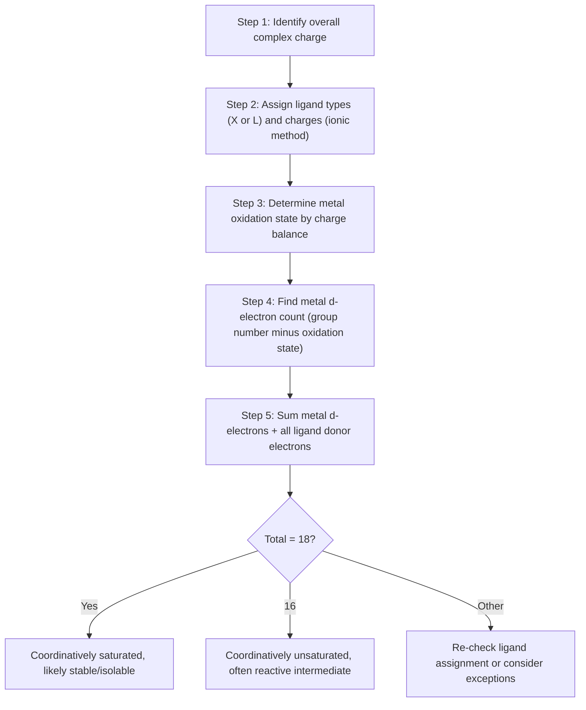

## Electron Counting and the Eighteen Electron Rule


### Overview

Electron counting is the primary bookkeeping tool used in organometallic chemistry to predict the stability, structure, and reactivity of transition metal complexes. The 18-electron rule states that thermodynamically stable, isolable organometallic complexes tend to have a total of 18 valence electrons at the metal center — analogous to the octet rule for main-group elements — corresponding to a filled set of nine valence orbitals (one $s$, three $p$, five $d$).

### Theoretical Basis

A transition metal has nine valence orbitals available for bonding: one $(n)s$, three $(n)p$, and five $(n-1)d$. Filling all nine orbitals with bonding or nonbonding electron pairs (18 electrons total) achieves a closed-shell, saturated configuration, minimizing energy and disfavoring further ligand addition or electron transfer — directly analogous to noble gas electron configuration in main-group chemistry.

$$9 \text{ orbitals} \times 2 \text{ electrons} = 18 \text{ electrons}$$

**Key Points**

- Complexes with 18 electrons are typically coordinatively saturated and kinetically substitution-inert (associative pathways blocked)
- Complexes with fewer than 18 electrons (16e⁻ especially) are often coordinatively unsaturated and reactive, readily binding additional ligands — common in catalytic intermediates
- The rule is a strong guideline, not an absolute law — many stable complexes exist at 16e⁻ (especially square planar $d^8$) or occasionally exceed 18e⁻

### Two Electron-Counting Methods

Two internally consistent formalisms exist; both must yield the same total electron count when applied correctly, though intermediate assignments (formal oxidation state, ligand electron contribution) differ.

```mermaid
flowchart LR
    A[Electron Counting Methods] --> B[Ionic Method]
    A --> C[Covalent / Neutral Method]
    B --> B1[Ligands as closed-shell ions]
    B --> B2[Metal assigned formal oxidation state]
    C --> C1[Ligands as neutral radicals]
    C --> C2[Metal treated as neutral atom, d(n) count]
    B1 --> D[Same total electron count]
    C1 --> D
```

**Ionic (Donor-Pair) Method**

1. Assign formal charges to all ligands as they would exist as closed-shell species (e.g., $\text{Cl}^-$, $\text{CH}_3^-$, $\text{CO}$ neutral)
2. Determine the metal's formal oxidation state by charge balance with the overall complex charge
3. Count the metal's $d$-electron count for that oxidation state ($d^n = $ group number $-$ oxidation state)
4. Add electrons donated by each ligand (ionic ligand electron counts, see table below)

**Covalent (Neutral Atom) Method**

1. Treat the metal as a neutral atom in its ground-state electron configuration (group number = valence electron count)
2. Treat all ligands as neutral radicals, each contributing electrons based on covalent bond formation
3. Sum metal valence electrons + ligand contributions + adjust for overall complex charge

### Ligand Electron Donor Counts

| Ligand | Ionic Method (electrons) | Covalent Method (electrons) | Type |
| --- | --- | --- | --- |
| H, halide (Cl, Br, I) | 2 (as X⁻) | 1 | X-type |
| $\text{CH}_3$, alkyl, aryl | 2 (as R⁻) | 1 | X-type |
| CO, $\text{PR}_3$, amines | 2 | 2 | L-type |
| $\eta^2$-alkene | 2 | 2 | L-type |
| $\eta^3$-allyl | 4 | 3 | LX-type |
| $\eta^4$-diene | 4 | 4 | L₂-type |
| $\eta^5$-Cp | 6 (as Cp⁻) | 5 | L₂X-type |
| $\eta^6$-arene | 6 | 6 | L₃-type |
| $\eta^7$-cycloheptatrienyl | 6 (as C₇H₇⁺, contributes 6 as cation) or 7 (as radical) | 7 | Varies by formalism |
| NO (bent, 1e⁻ pathway) | 2 (as NO⁻) | 1 (as NO•, bent) | X-type (bent) |
| NO (linear, 3e⁻ pathway) | 2 (as NO⁺, but metal reduced) | 3 (as NO•, linear) | L-type (formally) |
| $\mu_2$-bridging CO | 2 (shared, 1 per metal typically) | 2 (shared) | Bridging L-type |

**Note**: X-type ligands are one-electron (covalent) / two-electron (ionic, as anion) donors that form normal covalent bonds and change formal oxidation state by 1 per ligand when using the ionic method. L-type ligands are two-electron neutral donors (dative/Lewis base) that do not change formal oxidation state.

### Worked Examples

**Example 1: Cr(CO)₆ (Ionic Method)**

- CO is neutral, L-type, donates 2e⁻ each → $6 \times 2 = 12$ e⁻
- Complex is neutral; all ligands neutral → Cr oxidation state = 0
- Cr(0) is $d^6$ (Cr is group 6) → 6 d-electrons
- Total: $6 (d) + 12 (\text{CO}) = 18$ electrons ✓

**Example 2: Cr(CO)₆ (Covalent Method)**

- CO neutral, L-type, donates 2e⁻ each (same in covalent method) → 12 e⁻
- Cr treated as neutral atom, group 6 → 6 valence electrons
- Total: $6 + 12 = 18$ electrons ✓ (both methods converge)

**Example 3: Ferrocene, Fe(η⁵-C₅H₅)₂ (Ionic Method)**

- Each Cp ligand treated as $\text{Cp}^-$ (aromatic 6π-electron anion), L₂X-type, donates 6e⁻ each → $2 \times 6 = 12$ e⁻
- Two Cp⁻ ligands contribute $-2$ charge; complex is neutral → Fe oxidation state = $+2$
- Fe(II) is $d^6$ (Fe is group 8, $8-2=6$)
- Total: $6 (d) + 12 (\text{Cp}) = 18$ electrons ✓

**Example 4: Ferrocene (Covalent Method)**

- Each Cp treated as neutral radical Cp•, L₂X-type in covalent counting, donates 5e⁻ each → $2 \times 5 = 10$ e⁻
- Fe treated as neutral atom, group 8 → 8 valence electrons
- Total: $8 + 10 = 18$ electrons ✓

**Example 5: [Mn(CO)₅]⁻ (Ionic Method)**

- CO neutral L-type, 2e⁻ each → $5 \times 2 = 10$ e⁻
- Overall charge $-1$; CO ligands neutral → Mn oxidation state = $-1$
- Mn is group 7; $d^n = 7-(-1) = 8$ → 8 d-electrons
- Total: $8 + 10 = 18$ electrons ✓

**Example 6: Ni(CO)₄ (Ionic/Covalent Method, both converge directly)**

- CO neutral L-type, 2e⁻ each → $4 \times 2 = 8$ e⁻
- Ni(0), group 10 → $d^{10}$ → 10 d-electrons
- Total: $10 + 8 = 18$ electrons ✓

### Electron-Counting Worksheet Format



### Common Deviations from 18 Electrons

**16-Electron Complexes**

Very common and often stable, especially for:

- **Square planar $d^8$ complexes**: e.g., $\text{Rh(PPh}_3)_3\text{Cl}$ (Wilkinson's catalyst, 16e⁻), $[\text{PtCl}_4]^{2-}$, $[\text{Ni(CN)}_4]^{2-}$ — square planar geometry leaves the $d_{x^2-y^2}$ orbital high in energy and effectively nonbonding/unoccupied, so 16e⁻ is the natural saturation point for this geometry
- Catalytically important since the vacant coordination site allows substrate binding (oxidative addition, alkene coordination)

**14-Electron Complexes**

Highly reactive, coordinatively unsaturated species, often transient catalytic intermediates (e.g., $\text{Pd(PPh}_3)_2$ generated in situ during cross-coupling catalytic cycles).

**Complexes Exceeding 18 Electrons**

Rare but occur with:

- Early transition metals in low oxidation states with small ligands (sterically permits higher coordination)
- Some $d^{10}$ complexes with weak-field ligands
- 20-electron metallocenes (e.g., cobaltocene $\text{Co(Cp)}_2$, 19e⁻; nickelocene $\text{Ni(Cp)}_2$, 20e⁻) — these place extra electrons in metal-based antibonding orbitals, resulting in reduced stability and enhanced reactivity (nickelocene and cobaltocene are far more reactive/oxidizable than ferrocene)

### 18-Electron Rule Reliability by Metal Position

| Metal Group/Type | 18e⁻ Rule Reliability |
| --- | --- |
| Early transition metals (Groups 3–5), high oxidation state | Often followed less strictly; lower coordination numbers common |
| Mid transition metals (Groups 6–9), classic carbonyls/organometallics | Very reliable (Cr, Mo, W, Mn, Fe, Co carbonyls) |
| Late transition metals (Groups 10–11), $d^8$/$d^{10}$ | 16e⁻ (square planar $d^8$) or 18e⁻ ($d^{10}$ tetrahedral) both common |
| Lanthanides/actinides | Rule generally not applicable (f-orbitals, high coordination numbers, more ionic bonding) |

### Practical Uses of Electron Counting

**Key Points**

- Predicting whether a proposed complex is likely to be isolable/stable vs. a reactive intermediate
- Rationalizing catalytic cycle steps: oxidative addition typically converts 16e⁻ → 18e⁻ (adds 2e⁻, coordination number +2); reductive elimination reverses this
- Predicting number of CO ligands or other donors needed to complete a stable cluster or mononuclear complex
- Explaining metal-metal bond formation in polynuclear clusters (each M–M bond contributes 1 electron to each metal's count in ionic/covalent formalism)

**Example: Metal-Metal Bonded Dimer**

$\text{Mn}_2(\text{CO})_{10}$: each Mn fragment $\text{Mn(CO)}_5$• is a 17-electron radical (Mn group 7, 7 valence electrons + $5 \times 2 = 10$ from CO = 17). Formation of a single Mn–Mn bond contributes one additional electron to each metal's count (shared covalent bond), bringing each Mn to 18 electrons total.

### Limitations and Exceptions Summary

- The rule is best treated as a strong correlation for kinetic/thermodynamic stability, not an inviolable law
- Steric bulk can prevent a complex from reaching 18e⁻ even when electronically favorable (ligands too large to fit)
- Ionic bonding character in early/late transition metals and lanthanides reduces the rule's predictive power
- Both counting methods must be applied consistently and completely — mixing ionic ligand charges with covalent metal electron counts (or vice versa) produces incorrect totals

**Conclusion**

Electron counting via the ionic or covalent method provides a systematic, verifiable way to predict organometallic complex stability and reactivity, culminating in the 18-electron rule as an organizing principle analogous to the main-group octet rule. While reliably predictive for many mid-to-late transition metal carbonyl and organometallic complexes, deviations (16e⁻ square planar species, coordinatively unsaturated catalytic intermediates, and cases involving early transition metals or lanthanides) are common and mechanistically significant, particularly in catalysis.

**Related Topics**

- Types of metal to carbon bonding and hapticity notation
- Oxidative addition and reductive elimination in catalytic cycles
- Square planar d8 complex geometry and ligand field stabilization
- Metal-metal bonded clusters and cluster electron counting (Wade's rules)
- Ligand field and molecular orbital approaches to bonding
- Catalytic roles of transition metals
- 19- and 20-electron metallocene reactivity (cobaltocene, nickelocene)