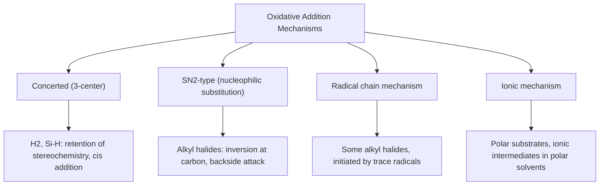
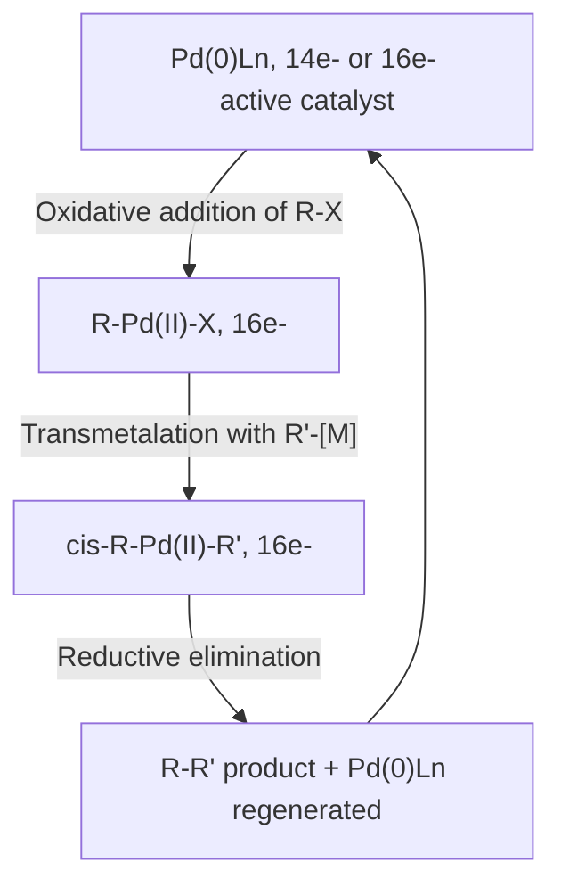

## Oxidative Addition and Reductive Elimination


### Overview

Oxidative addition (OA) and reductive elimination (RE) are complementary, microscopically reversible elementary steps central to organometallic catalysis. Oxidative addition inserts a metal into a substrate bond, increasing both formal oxidation state and coordination number by two; reductive elimination reverses this, coupling two ligands and releasing them from the metal while decreasing oxidation state and coordination number by two.

### General Definitions

$$L_nM + A{-}B \xrightleftharpoons[\text{RE}]{\text{OA}} L_nM(A)(B)$$

**Key Points**

- Oxidative addition: oxidation state increases by 2, coordination number increases by 2, $d$-electron count decreases by 2
- Reductive elimination: oxidation state decreases by 2, coordination number decreases by 2, $d$-electron count increases by 2
- Both steps typically proceed through even-electron changes (2e⁻ processes) at a single metal center, though radical (1e⁻ stepwise) pathways exist for some substrates
- Electron count at the metal generally increases by 2 during OA (e.g., 16e⁻ → 18e⁻) and decreases by 2 during RE (18e⁻ → 16e⁻)

### Requirements for Oxidative Addition

- Metal must have an accessible oxidation state two units higher (must not already be at its maximum stable oxidation state)
- Metal must have two open coordination sites available (or be able to create them via ligand dissociation)
- Metal center should be electron-rich (higher $d$-electron count, more nucleophilic) to favor OA, since the metal formally donates electron density into the substrate's $\sigma^*$ orbital
- Common substrates: $\text{H}_2$, $\text{R–X}$ (alkyl/aryl halides), $\text{Si–H}$, $\text{C–H}$ (in C–H activation), $\text{O}_2$, $\text{H–OR}$

### Mechanisms of Oxidative Addition



**Concerted (Three-Center) Mechanism**

The substrate A–B approaches the metal side-on; a three-center transition state forms as the metal simultaneously donates electron density into the A–B $\sigma^*$ orbital while the A–B $\sigma$ electrons donate into an empty metal orbital. Results in **cis** addition (A and B end up mutually cis on the metal) with retention of configuration at each atom. Typical for $\text{H}_2$ and $\text{Si–H}$ bonds.

**SN2-Type (Nucleophilic Substitution) Mechanism**

The metal center (acting as a nucleophile via a filled $d$-orbital) attacks the carbon of an alkyl halide from the backside, displacing halide in an $\text{S}_N2$-like transition state. Results in **inversion** of configuration at the carbon center; typical for primary alkyl halides. The resulting cationic intermediate ($[\text{L}_n\text{M–R}]^+ \text{X}^-$) can then undergo halide recombination.

**Radical Chain Mechanism**

Occurs particularly with secondary/tertiary alkyl halides or in the presence of radical initiators; proceeds via halogen atom abstraction generating carbon radicals, which then combine with the metal center. Often shows loss of stereochemical integrity at carbon (racemization).

**Ionic Mechanism**

Substrate first ionizes (e.g., in polar solvent) before the resulting ionic fragments coordinate sequentially to the metal.

### Oxidative Addition of H₂: Concerted Pathway (svg_diagram)

```svg
<svg xmlns="http://www.w3.org/2000/svg" viewBox="0 0 560 260" font-family="Helvetica,Arial,sans-serif">
  <title>Concerted oxidative addition of H2 to a metal center (svg_diagram)</title>
  <text x="280" y="25" font-size="13" text-anchor="middle">Concerted OA of H2 (3-center TS)</text>

  <circle cx="100" cy="140" r="28" fill="#ccc" stroke="#333" />
  <text x="100" y="145" font-size="11" text-anchor="middle">MLn</text>
  <circle cx="240" cy="120" r="10" fill="#eee" stroke="#333" />
  <text x="240" y="124" font-size="9" text-anchor="middle">H</text>
  <circle cx="240" cy="160" r="10" fill="#eee" stroke="#333" />
  <text x="240" y="164" font-size="9" text-anchor="middle">H</text>
  <line x1="240" y1="120" x2="240" y2="160" stroke="#333" stroke-width="2" />
  <text x="200" y="90" font-size="10">approach</text>
  <path d="M 150 130 Q 200 100 232 118" fill="none" stroke="#999" stroke-dasharray="3,3" marker-end="url(#arrOA)" />

  <text x="330" y="145" font-size="16">→</text>

  <circle cx="440" cy="140" r="28" fill="#ccc" stroke="#333" />
  <text x="440" y="145" font-size="10" text-anchor="middle">MLn</text>
  <circle cx="490" cy="105" r="10" fill="#eee" stroke="#333" />
  <text x="490" y="109" font-size="9" text-anchor="middle">H</text>
  <circle cx="490" cy="175" r="10" fill="#eee" stroke="#333" />
  <text x="490" y="179" font-size="9" text-anchor="middle">H</text>
  <line x1="465" y1="128" x2="482" y2="112" stroke="#333" stroke-width="2" />
  <line x1="465" y1="152" x2="482" y2="168" stroke="#333" stroke-width="2" />
  <text x="440" y="215" font-size="10" text-anchor="middle">cis-dihydride product</text>

  </svg>
```

### Requirements and Favorability for Reductive Elimination

- Requires the two eliminating ligands to be **mutually cis** on the metal (necessary geometric prerequisite for direct bond formation via orbital overlap)
- Favored by: electron-poor metal centers (higher oxidation state complexes are more prone to RE, reversing OA's preference for electron-rich metals), bulky ligands (steric relief upon reductive elimination is thermodynamically favorable), and smaller bite-angle or more crowded coordination spheres
- Product bond strength strongly influences thermodynamics: formation of strong C–H, C–C, or C–heteroatom bonds drives RE forward

### Mechanistic Types of Reductive Elimination

**Direct (Concerted) Reductive Elimination**

Most common pathway; the two cis ligands directly combine via a three-center transition state, reverse of concerted OA. Requires no bond breaking at the metal beyond the M–A and M–B bonds themselves.

**Dissociative Pathway**

A ligand first dissociates to create a vacant site or lower coordination number, which can accelerate RE by increasing the electrophilicity of the metal center (often observed in Pd(II) → Pd(0) reductive elimination steps in cross-coupling, where phosphine dissociation precedes C–C bond-forming RE).

**Bimolecular (Associative) Pathway**

Involves a second molecule (solvent, additional ligand, oxidant) associating with the metal to facilitate elimination; less common but documented for some systems.

### Reductive Elimination Trans-to-Cis Isomerization Requirement

If A and B ligands are initially trans (as sometimes formed kinetically), a cis/trans isomerization step must precede RE, since direct trans-elimination is geometrically and electronically disfavored (no efficient orbital overlap pathway for direct A–B bond formation from a trans arrangement).


### Role in Catalytic Cycles: Cross-Coupling Example

The Pd-catalyzed cross-coupling cycle (Suzuki, Negishi, Stille, etc.) is the canonical illustration of OA/RE working in tandem:



**Mechanistic Notes**

- Oxidative addition of R–X to Pd(0) is typically the rate-determining step for aryl chlorides (strong C–Cl bond) but fast for aryl iodides
- Transmetalation delivers the second organic group (R′) to Pd, positioning both R and R′ cis to each other
- Reductive elimination forms the new C–C bond and regenerates active Pd(0) catalyst, completing the cycle
- Bulky, electron-rich phosphine ligands (e.g., $\text{PtBu}_3$, SPhos, XPhos) accelerate both OA (via increased electron density at Pd) and RE (via steric bulk favoring ligand extrusion)

### Oxidative Addition/Reductive Elimination Energetics

| Factor | Favors OA | Favors RE |
| --- | --- | --- |
| Metal electron density | Electron-rich (favors OA) | Electron-poor (favors RE) |
| Steric bulk of ligands | Disfavors (crowded TS) | Favors (relieves crowding) |
| Oxidation state accessibility | Low starting oxidation state with accessible +2 state | High oxidation state seeking to reduce |
| Bond strength of product | N/A (substrate bond breaks) | Strong new bond (C-C, C-H) thermodynamically favorable |
| Ligand geometry | N/A | Requires cis disposition |

### C–H Activation as a Special Case of Oxidative Addition

C–H bonds, though strong and typically unreactive, can undergo oxidative addition at electron-rich late transition metal centers, forming M(H)(R) species. This underlies C–H functionalization catalysis (directed C–H activation, alkane dehydrogenation). Mechanistic variants include concerted metalation-deprotonation (CMD), σ-bond metathesis (for $d^0$ early metals lacking accessible higher oxidation states, avoiding formal OA), and electrophilic substitution pathways. [Inference: the dominant mechanism is highly substrate- and catalyst-dependent and should be verified against the specific system's mechanistic literature.]

### σ-Bond Metathesis: An Alternative to OA for d⁰ Metals

Early transition metals in $d^0$ configuration (e.g., Sc(III), Ti(IV), Zr(IV) complexes) cannot undergo classical oxidative addition (no available $d$-electrons to formally oxidize further in most cases, and no accessible two-unit-higher oxidation state). Instead, these metals activate σ-bonds (H–H, C–H) via a concerted four-center transition state (σ-bond metathesis) that does not change the formal oxidation state of the metal.

### Summary Comparison Table

| Property | Oxidative Addition | Reductive Elimination |
| --- | --- | --- |
| Oxidation state change | +2 | −2 |
| Coordination number change | +2 | −2 |
| Electron count change | +2 (e.g., 16e⁻ → 18e⁻) | −2 (e.g., 18e⁻ → 16e⁻) |
| Favored by | Electron-rich, low oxidation state metal | Electron-poor, sterically crowded, high oxidation state metal |
| Geometric requirement | None (substrate approaches freely) | Ligands must be mutually cis |
| Typical role in catalysis | Substrate activation step | Product-forming, catalyst-regenerating step |

**Conclusion**

Oxidative addition and reductive elimination are microscopically reverse, 2-electron redox processes that together enable transition metals to activate strong bonds and subsequently forge new ones, forming the mechanistic backbone of catalytic cycles including cross-coupling, hydrogenation, and C–H functionalization. Their relative favorability is governed by opposing electronic requirements (electron-rich metals favor OA, electron-poor/crowded metals favor RE), making ligand and oxidation-state design central to catalyst optimization.

**Related Topics**

- Migratory insertion and β-hydride elimination mechanisms
- 18-electron rule and electron counting in catalytic intermediates
- Cross-coupling catalytic cycles (Suzuki, Negishi, Heck, Stille)
- C-H activation and σ-bond metathesis mechanisms
- Ligand steric and electronic effects (cone angle, bite angle, Tolman parameters)
- Catalytic roles of transition metals
- Types of metal to carbon bonding