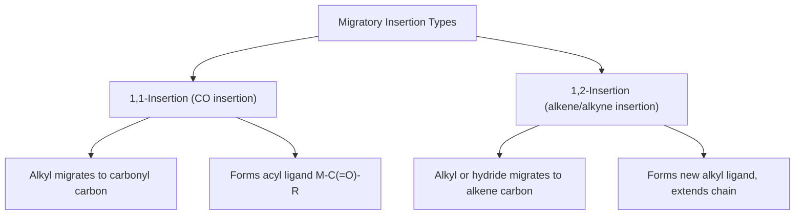
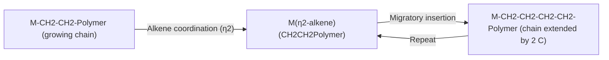

## Migratory Insertion and Related Steps


### Overview

Migratory insertion is an elementary organometallic reaction step in which a ligand bound to a metal migrates to an adjacent coordinated unsaturated ligand, forming a new bond while maintaining the metal's formal oxidation state. Together with its reverse process (β-elimination), migratory insertion is central to catalytic chain-growth, carbonylation, hydroformylation, and polymerization chemistry.

### Defining Features

$$L_nM(X)(Y) \rightarrow L_{n-1}M(XY)$$

where X is a migrating group (commonly H or alkyl) and Y is an unsaturated ligand (CO, alkene, alkyne) coordinated cis to X.

**Key Points**

- Oxidation state of the metal is **unchanged** (distinguishes it from oxidative addition/reductive elimination)
- Coordination number at the metal **decreases by one** (since X and Y combine into a single ligand occupying one coordination site) — unless a new ligand simultaneously associates to fill the vacated site
- Requires X and Y to be **mutually cis** on the metal, since the migration proceeds through a concerted four-center transition state
- Two mechanistic descriptions exist: "migratory insertion" (the X group migrates to Y, which stays fixed) and "1,2-insertion" (Y inserts into the M–X bond); these are kinetically indistinguishable in most cases and are often used interchangeably

### General Mechanism: 1,1- vs 1,2-Insertion



### CO Migratory Insertion (1,1-Insertion): Alkyl-to-Acyl Conversion

An alkyl group migrates to the carbon of an adjacent coordinated CO ligand, forming an acyl ligand. A vacant coordination site is generated at the metal (often refilled by an incoming ligand, e.g., another CO or solvent, in the same step or immediately after).

$$L_nM(\text{CO})(\text{R}) \rightarrow L_nM(\eta^1\text{-C(=O)R})$$

**Mechanistic Detail**

Isotope-labeling and kinetic studies (notably on Mn(CO)₅CH₃ systems) established that it is the **alkyl group that migrates** to a cis-CO ligand (not CO inserting into the M–R bond), though the net structural outcome is the same. The vacant site created is on the same face the alkyl group vacated.

**CO Insertion Mechanism (svg_diagram)**

```svg
<svg viewBox="0 0 560 260" xmlns="http://www.w3.org/2000/svg" font-family="Helvetica,Arial,sans-serif">
  <title>CO migratory insertion alkyl to acyl mechanism (svg_diagram)</title>
  <text x="280" y="25" font-size="13" text-anchor="middle">Alkyl Migration to Coordinated CO</text>

  <circle cx="110" cy="140" r="26" fill="#ccc" stroke="#333"/>
  <text x="110" y="145" font-size="10" text-anchor="middle">MLn</text>
  <line x1="136" y1="130" x2="190" y2="110" stroke="#333" stroke-width="2"/>
  <text x="205" y="108" font-size="10">R (alkyl)</text>
  <circle cx="140" y1="160" cx="150" cy="175" r="8" fill="#444"/>
  <text x="150" y="179" font-size="8" text-anchor="middle" fill="#fff">C</text>
  <circle cx="190" cy="195" r="10" fill="#cc2222"/>
  <text x="190" y="199" font-size="8" text-anchor="middle" fill="#fff">O</text>
  <line x1="136" y1="150" x2="150" y2="170" stroke="#333" stroke-width="2"/>
  <line x1="158" y1="180" x2="180" y2="192" stroke="#333" stroke-width="2"/>

  <path d="M 195 115 Q 175 145 165 172" fill="none" stroke="#0055aa" stroke-dasharray="3,3" marker-end="url(#arrMI)"/>
  <text x="230" y="150" font-size="9" fill="#0055aa">R migrates to CO carbon</text>

  <text x="330" y="150" font-size="16">→</text>

  <circle cx="440" cy="140" r="26" fill="#ccc" stroke="#333"/>
  <text x="440" y="145" font-size="10" text-anchor="middle">MLn</text>
  <text x="440" y="180" font-size="9" text-anchor="middle">(vacant site)</text>
  <circle cx="490" cy="130" r="8" fill="#444"/>
  <text x="490" y="134" font-size="8" text-anchor="middle" fill="#fff">C</text>
  <circle cx="520" cy="110" r="10" fill="#cc2222"/>
  <text x="520" y="114" font-size="8" text-anchor="middle" fill="#fff">O</text>
  <text x="540" y="140" font-size="9">R</text>
  <line x1="466" y1="135" x2="482" y2="132" stroke="#333" stroke-width="2"/>
  <line x1="498" y1="124" x2="512" y2="115" stroke="#333" stroke-width="2"/>
  <line x1="498" y1="132" x2="525" y2="140" stroke="#333" stroke-width="2"/>
  <text x="480" y="200" font-size="10" text-anchor="middle">Acyl ligand M-C(=O)R</text>

  <defs>
    <marker id="arrMI" markerWidth="8" markerHeight="8" refX="4" refY="4" orient="auto">
      <path d="M0,0 L8,4 L0,8 Z" fill="#333"/>
    </marker>
  </defs>
</svg>
```

**Reverse Reaction: Deinsertion (Decarbonylation)**

The reverse process, where an acyl ligand extrudes CO to regenerate a metal-alkyl and free coordination site, is thermodynamically and kinetically accessible under many conditions and is important in catalyst deactivation pathways and in reverse steps of carbonylation catalytic cycles.

**Role in Catalysis: Monsanto/Cativa Acetic Acid Process**

$$\text{CH}_3\text{OH} + \text{CO} \xrightarrow{\text{[Rh] or [Ir] cat., HI}} \text{CH}_3\text{COOH}$$

CO migratory insertion into a Rh–CH₃ (or Ir–CH₃) bond, generated by prior oxidative addition of $\text{CH}_3\text{I}$, forms the key acetyl intermediate that is subsequently hydrolyzed to acetic acid.

### Alkene Migratory Insertion (1,2-Insertion): Chain Propagation

A hydride or alkyl ligand migrates to a coordinated alkene, forming a new (longer) alkyl chain bound to the metal. This step underlies alkene polymerization, hydrogenation, and hydroformylation mechanisms.

$$L_nM(\text{H})(\eta^2\text{-CH}_2=\text{CH}_2) \rightarrow L_nM(\text{CH}_2\text{CH}_3)$$

**Regiochemistry**

Two possible insertion modes exist depending on which alkene carbon bonds to the metal:

- **1,2-insertion** (primary insertion): metal bonds to the terminal/less-substituted carbon, migrating group bonds to the more-substituted carbon — typically favored sterically for most metals
- **2,1-insertion** (secondary insertion): metal bonds to the more-substituted carbon — favored in specific catalyst systems (relevant to regioselectivity in hydroformylation, giving linear vs. branched aldehyde products)

**Migratory Insertion in Ziegler-Natta/Metallocene Polymerization**



Each insertion cycle extends the polymer chain by one monomer unit while regenerating a vacant coordination site for the next alkene to bind — the Cossee-Arlman mechanism for Ziegler-Natta and metallocene-catalyzed olefin polymerization.

### β-Hydride Elimination: The Reverse of Alkene Insertion

β-hydride elimination is the microscopic reverse of alkene migratory insertion: a hydrogen on the carbon β to the metal migrates to the metal center, forming a new M–H bond and releasing a coordinated alkene.

$$L_nM{-}\text{CH}_2\text{CH}_3 \rightarrow L_nM(\text{H})(\eta^2\text{-CH}_2=\text{CH}_2)$$

**Requirements for β-Hydride Elimination**

- The alkyl ligand must possess a hydrogen on the β-carbon (relative to the metal-bound α-carbon)
- The metal must have an accessible **vacant coordination site cis** to the alkyl group, and the M–Cα–Cβ–H dihedral must be able to achieve the required syn-coplanar arrangement for the four-center transition state
- Electron-poor, coordinatively unsaturated metal centers favor β-hydride elimination

**β-Hydride Elimination Mechanism (svg_diagram)**

```svg
<svg xmlns="http://www.w3.org/2000/svg" viewBox="0 0 520 220" font-family="Helvetica,Arial,sans-serif">
  <title>Beta hydride elimination four center transition state (svg_diagram)</title>
  <text x="260" y="25" font-size="13" text-anchor="middle">beta-Hydride Elimination</text>

  <circle cx="100" cy="120" r="24" fill="#ccc" stroke="#333" />
  <text x="100" y="124" font-size="10" text-anchor="middle">M</text>
  <text x="70" y="150" font-size="9">(vacant site)</text>
  <line x1="122" y1="108" x2="165" y2="90" stroke="#333" stroke-width="2" />
  <circle cx="180" cy="82" r="9" fill="#444" />
  <text x="180" y="86" font-size="8" text-anchor="middle" fill="#fff">Cα</text>
  <line x1="192" y1="86" x2="220" y2="105" stroke="#333" stroke-width="2" />
  <circle cx="232" cy="112" r="9" fill="#444" />
  <text x="232" y="116" font-size="8" text-anchor="middle" fill="#fff">Cβ</text>
  <line x1="232" y1="122" x2="150" y2="128" stroke="#0055aa" stroke-dasharray="3,3" marker-end="url(#arrBH)" />
  <text x="185" y="150" font-size="9" fill="#0055aa">syn beta-H migrates to M</text>
  <text x="245" y="100" font-size="8">H</text>

  <text x="360" y="120" font-size="16">→</text>

  <circle cx="440" cy="120" r="24" fill="#ccc" stroke="#333" />
  <text x="440" y="124" font-size="10" text-anchor="middle">M</text>
  <text x="470" y="90" font-size="9">H</text>
  <line x1="460" y1="105" x2="475" y2="95" stroke="#333" stroke-width="2" />
  <text x="410" y="175" font-size="9" text-anchor="middle">η2-alkene + M-H</text>

  </svg>
```

**Consequences for Catalyst Design**

β-hydride elimination is often an undesired chain-termination or decomposition pathway in cross-coupling and polymerization catalysis. Strategies to suppress it include:

- Using ligands without β-hydrogens (methyl, neopentyl, aryl, trimethylsilylmethyl groups) where alkyl stability is required
- Employing bulky, chelating ligands that block the cis vacant site needed for the syn-periplanar transition state
- Operating at lower temperatures where the elimination barrier is not easily surmounted

### α- and γ-Hydride Elimination (Related Processes)

**α-Hydride Elimination**

Removal of a hydrogen from the carbon directly bonded to the metal (the α-carbon), generating a carbene (M=CR₂) and M–H. Relevant in Schrock carbene synthesis (e.g., preparation of Ta neopentylidene from Ta neopentyl precursor via α-abstraction).

**γ-Hydride Elimination**

Less common; involves a hydrogen three carbons from the metal, forming a metallacyclobutane intermediate. Documented in select cases with sterically constrained alkyl ligands lacking accessible β-hydrogens.

### Alkyne and Related Insertions

Alkynes undergo analogous migratory insertion into M–H or M–R bonds, generating vinyl ligands with defined stereochemistry (typically syn addition, giving cis-vinyl products directly from the concerted insertion, though subsequent isomerization can occur).

### Comparative Summary of Insertion-Type Steps

| Step | Oxidation State Change | Coordination Number Change | Typical Role |
| --- | --- | --- | --- |
| CO migratory insertion | None | −1 (often refilled) | Carbonylation, acyl formation |
| Alkene migratory insertion | None | −1 (often refilled) | Chain growth, polymerization, hydrogenation |
| β-hydride elimination | None | +1 (creates coordinated alkene) | Chain termination, catalyst deactivation, alkene isomerization |
| α-hydride elimination | None (formal, though electron redistribution occurs) | Variable | Carbene (Schrock) synthesis |
| Oxidative addition | +2 | +2 | Substrate activation |
| Reductive elimination | −2 | −2 | Product release, catalyst regeneration |

### Role in Complete Catalytic Cycles

**Example: Hydroformylation**

$$\text{RCH=CH}_2 + \text{CO} + \text{H}_2 \xrightarrow{\text{[Rh] cat.}} \text{RCH}_2\text{CH}_2\text{CHO}$$

1. Oxidative addition of $\text{H}_2$ to Rh(I) → Rh(III) dihydride
2. Alkene coordination and migratory insertion (1,2 or 2,1, determining linear/branched selectivity) forms Rh-alkyl
3. CO coordination and migratory insertion (1,1) forms Rh-acyl
4. Oxidative addition of second $\text{H}_2$ equivalent, then reductive elimination releases aldehyde product and regenerates active catalyst

This sequence illustrates how oxidative addition, migratory insertion, and reductive elimination combine as the fundamental toolkit of organometallic catalytic cycles.

**Conclusion**

Migratory insertion (and its reverse, β-hydride elimination) enables metal centers to build new C–C, C–H, and C–heteroatom bonds without changing formal oxidation state, distinguishing it mechanistically from oxidative addition/reductive elimination. Its requirement for cis-ligand disposition and accessible vacant coordination sites makes ligand design (steric bulk, chelation, absence of β-hydrogens) a critical lever for controlling selectivity and stability in polymerization, carbonylation, hydroformylation, and cross-coupling catalysis.

**Related Topics**

- Oxidative addition and reductive elimination mechanisms
- Ziegler-Natta and metallocene alkene polymerization (Cossee-Arlman mechanism)
- Hydroformylation and the oxo process
- Fischer and Schrock carbene synthesis via α-hydride abstraction
- 18-electron rule and coordination number tracking
- Catalytic roles of transition metals
- Regioselectivity in hydroformylation (linear vs. branched products)