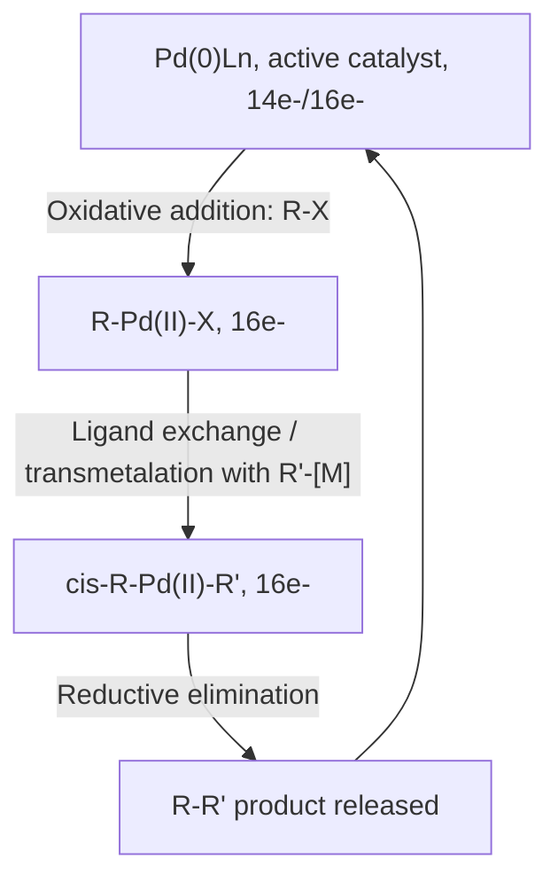
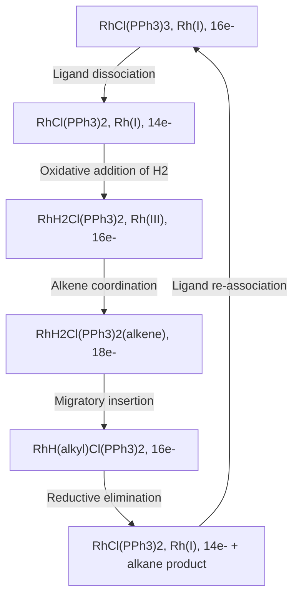
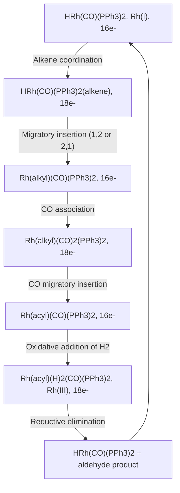
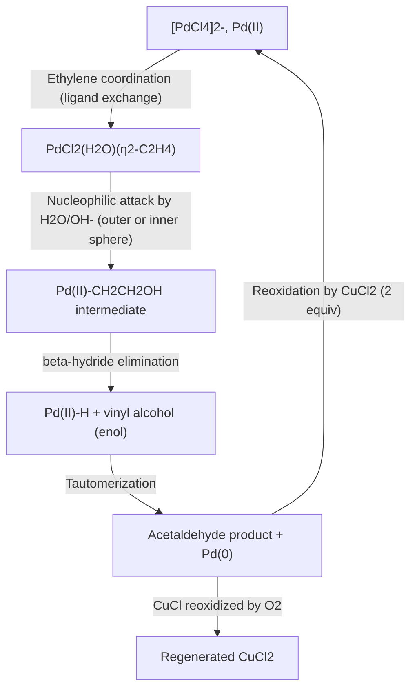
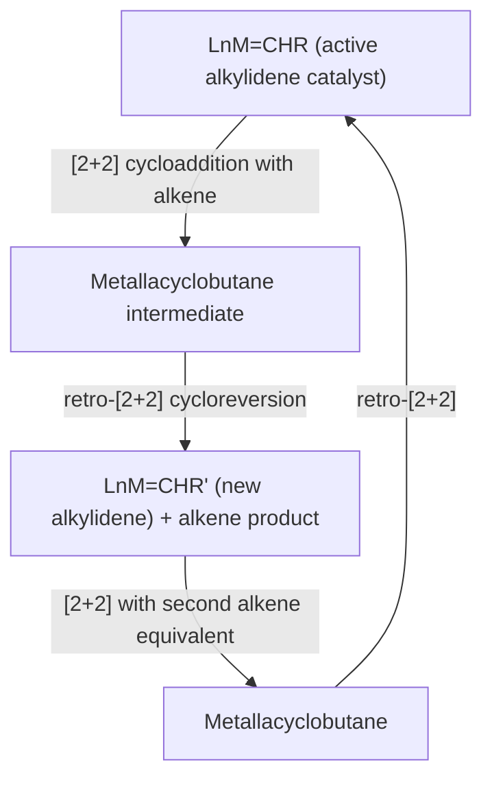
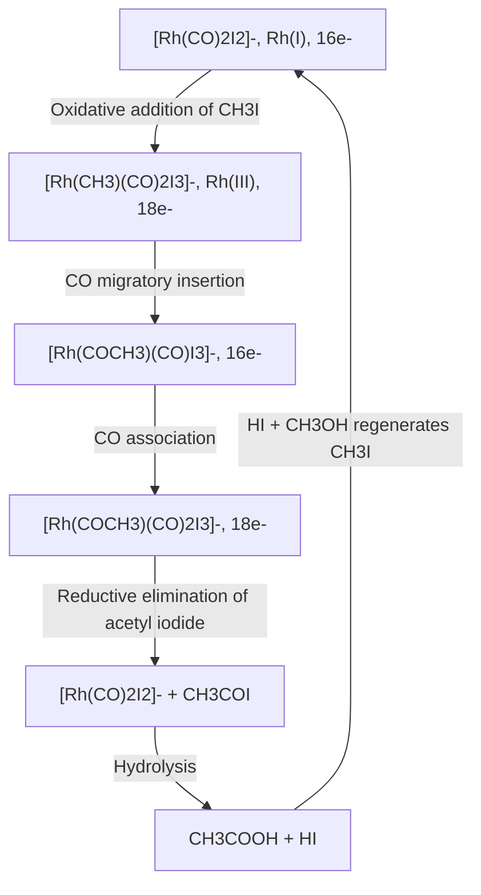
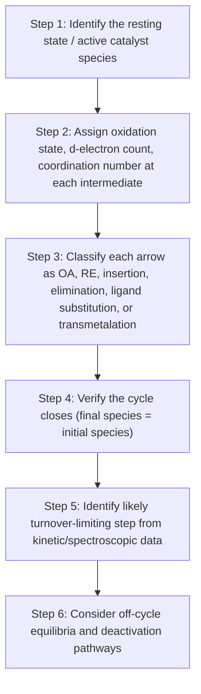

## Catalytic Cycles in Homogeneous Catalysis

### Overview

Homogeneous catalytic cycles are closed sequences of elementary organometallic steps — oxidative addition, migratory insertion, β-hydride elimination, transmetalation, ligand substitution, and reductive elimination — that convert substrates to products while regenerating the active catalyst. Understanding these cycles requires tracking oxidation state, electron count, and coordination number through each step, since a self-consistent cycle must return the catalyst to its starting form.

### General Principles of Catalytic Cycle Construction

**Key Points**

- A valid catalytic cycle must be a closed loop: the catalyst species at the end of the cycle must be identical (same oxidation state, coordination number, ligand set) to the species at the start
- Each elementary step changes oxidation state, coordination number, and/or electron count in a predictable way (see summary table below)
- Turnover-limiting (rate-determining) step is often the step with the highest-energy transition state along the cycle, not necessarily the most "interesting" mechanistic step
- Off-cycle equilibria (resting states, catalyst deactivation pathways, dimerization) frequently control observed kinetics and must be considered alongside the idealized cycle

**Elementary Step Summary**

| Step | ΔOxidation State | ΔCoordination Number | ΔElectron Count |
| --- | --- | --- | --- |
| Oxidative addition | +2 | +2 | +2 |
| Reductive elimination | −2 | −2 | −2 |
| Migratory insertion | 0 | −1 (often refilled) | 0 |
| β-hydride elimination | 0 | +1 | 0 |
| Ligand association | 0 | +1 | +2 |
| Ligand dissociation | 0 | −1 | −2 |
| Transmetalation | 0 | 0 (ligand exchange) | 0 |
| σ-bond metathesis | 0 | 0 | 0 |

### Cross-Coupling Catalysis (Pd-Catalyzed)

The palladium-catalyzed cross-coupling cycle exemplifies the canonical three-step core (oxidative addition → transmetalation → reductive elimination) shared by Suzuki, Negishi, Stille, and related couplings.

**Mechanistic Notes**

- Pd(0) active species often generated in situ by reduction of a Pd(II) precatalyst
- Oxidative addition rate: Ar–I > Ar–Br > Ar–OTf > Ar–Cl (reflecting C–X bond strength), though bulky electron-rich phosphines (SPhos, XPhos, PtBu₃) enable efficient activation of even unreactive aryl chlorides
- Transmetalation mechanism varies by coupling type: Suzuki (boron, often base-assisted via boronate formation), Negishi (zinc, direct), Stille (tin, direct)
- Reductive elimination requires cis-disposed R and R′ groups and is generally facile for Pd(II) with bulky ligands

### Wilkinson's Catalyst: Alkene Hydrogenation

$[\text{RhCl(PPh}_3)_3]$ catalyzes homogeneous hydrogenation via oxidative addition, alkene coordination, migratory insertion, and reductive elimination.

Selectivity for less-hindered alkenes arises because bulky triphenylphosphine ligands sterically disfavor coordination/insertion of more substituted alkenes, giving Wilkinson's catalyst notable chemoselectivity advantages over heterogeneous hydrogenation.

### Hydroformylation (Oxo Process)

$$\text{RCH=CH}_2 + \text{CO} + \text{H}_2 \xrightarrow{\text{[Rh] or [Co] cat.}} \text{RCH}_2\text{CH}_2\text{CHO (linear)} + \text{branched isomer}$$

Regiochemistry of the initial alkene insertion step (1,2- vs 2,1-) determines the linear-to-branched aldehyde product ratio, a key selectivity parameter tuned via ligand choice (bulky, electron-donating phosphines and phosphites favor linear selectivity in modern Rh-catalyzed processes).

### Wacker Process: Pd(II)/Pd(0) Redox Cycle

$$\text{CH}_2=\text{CH}_2 + \frac{1}{2}\text{O}_2 \xrightarrow{\text{PdCl}_2, \text{CuCl}_2} \text{CH}_3\text{CHO}$$

**Key Points**

- The stoichiometric oxidant is $\text{O}_2$; $\text{Cu(II)}$ serves as an electron-transfer mediator, reoxidizing Pd(0) back to Pd(II), while $\text{Cu(I)}$ is itself reoxidized by $\text{O}_2$
- The exact mechanism of nucleophilic attack (inner-sphere migratory insertion of coordinated hydroxide vs. outer-sphere attack by external water) has been historically debated; both pathways have supporting mechanistic evidence depending on conditions [Unverified: which pathway dominates under specific reaction conditions remains a topic of ongoing mechanistic discussion in the primary literature]

### Olefin Metathesis (Grubbs/Schrock Catalysts)

Operates via a distinct mechanism (not OA/RE-based) centered on metal-alkylidene chemistry and [2+2]/retro-[2+2] cycloaddition through metallacyclobutane intermediates.

Ru-based Grubbs catalysts (e.g., Grubbs 1st/2nd generation, bearing NHC ligands in later generations) offer excellent functional group tolerance; Mo/W Schrock alkylidene catalysts offer higher activity and Z-selectivity variants but greater sensitivity to air/moisture.

### Monsanto/Cativa Acetic Acid Process

$$\text{CH}_3\text{OH} + \text{CO} \xrightarrow{\text{[Rh] or [Ir], HI cat.}} \text{CH}_3\text{COOH}$$

The Cativa process (Ir-based) operates via an analogous cycle with improved selectivity and reduced water requirement compared to the original Rh-based Monsanto process. [Inference: specific plant conditions and promoter systems are proprietary and process-specific; general mechanistic description reflects published academic literature.]

### Identifying the Turnover-Limiting Step

**Key Points**

- Kinetic studies (rate law determination, Hammett studies, kinetic isotope effects, in situ spectroscopy such as high-pressure NMR or IR) are used to identify which step controls the overall rate
- The turnover-limiting transition state is not necessarily associated with the highest-energy *intermediate* — energetic span models consider the difference between the highest transition state and the lowest-energy intermediate preceding it anywhere in the cycle, not just adjacent steps
- Catalyst resting state (the most thermodynamically stable, most highly populated species during turnover) may differ from the nominally "active" species drawn at the top of the mechanistic cycle

### Catalyst Deactivation Pathways (Off-Cycle Processes)

| Deactivation Mode | Mechanism | Mitigation Strategy |
| --- | --- | --- |
| Ligand dissociation/decomposition | Phosphine oxidation, ligand degradation | Use robust, bulky, electron-rich ligands |
| Metal aggregation | Formation of inactive metal clusters/nanoparticles/"Pd black" | Stabilizing ligands, dilute conditions |
| β-hydride elimination side reactions | Unwanted alkene isomerization or chain termination | Ligands without accessible β-hydrogens, chelation |
| Catalyst poisoning | Strong-binding impurities (S, halide excess) block active sites | Substrate/reagent purification |
| Off-cycle resting states | Formation of unreactive but stable dimers/adducts | Ligand design to disfavor unproductive equilibria |

### General Workflow for Analyzing a Catalytic Cycle

### Comparative Summary of Major Homogeneous Catalytic Cycles

| Process | Metal | Core Steps | Product |
| --- | --- | --- | --- |
| Cross-coupling (Suzuki, Negishi, Stille) | Pd | OA, transmetalation, RE | C–C bonds |
| Hydrogenation (Wilkinson's) | Rh | OA, insertion, RE | Alkanes |
| Hydroformylation | Rh, Co | OA, insertion (×2), RE | Aldehydes |
| Wacker oxidation | Pd/Cu | Nucleophilic attack, β-H elim, reoxidation | Acetaldehyde |
| Olefin metathesis | Ru, Mo, W | [2+2]/retro-[2+2] | New alkenes |
| Acetic acid synthesis (Monsanto/Cativa) | Rh, Ir | OA, CO insertion, RE | Acetic acid |

**Conclusion**

Homogeneous catalytic cycles are built from a small toolkit of elementary organometallic steps — oxidative addition, reductive elimination, migratory insertion, β-hydride elimination, ligand substitution, and transmetalation — combined in sequences that must close back to the starting catalyst species. Mapping oxidation state, electron count, and coordination number through each intermediate is the essential analytical method for constructing, verifying, and interpreting these cycles, while kinetic and spectroscopic studies reveal which step controls overall turnover and how off-cycle processes affect catalyst performance.

**Related Topics**

- Oxidative addition and reductive elimination mechanisms
- Migratory insertion and β-hydride elimination
- 18-electron rule and electron counting in catalytic intermediates
- Ligand electronic and steric effects (Tolman cone angle, bite angle)
- Kinetic methods for mechanism elucidation (Hammett plots, KIE, in situ spectroscopy)
- Catalytic roles of transition metals
- Olefin metathesis and metal-alkylidene chemistry