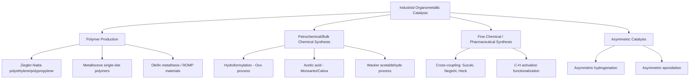

## Industrial Applications of Organometallic Catalysts

### Overview

Organometallic catalysts underpin a large fraction of modern industrial chemistry, enabling the production of bulk polymers, petrochemical intermediates, fine chemicals, and pharmaceuticals with efficiencies unattainable through purely organic or heterogeneous routes. Their value lies in high selectivity, mild operating conditions, and tunability through ligand design, though most industrial processes weigh these advantages against catalyst cost, stability, and separation challenges.

### Overview of Major Industrial Sectors Using Organometallic Catalysis

### Polymer Industry: Ziegler-Natta and Metallocene Catalysis

**Ziegler-Natta Catalysis**

Heterogeneous $\text{TiCl}_4/\text{AlEt}_3$ (or related Ti/Al systems supported on $\text{MgCl}_2$) catalyzes stereoregular polymerization of ethylene and propylene, producing the majority of global polyethylene (HDPE, LLDPE) and isotactic polypropylene.

- Operates via the Cossee-Arlman mechanism (alkene coordination, migratory insertion, chain growth)
- Enables control of tacticity (isotactic, syndiotactic, atactic) critical to polymer mechanical properties
- Multi-site catalyst nature (heterogeneous surface sites) gives broader molecular weight distributions than single-site catalysts

**Metallocene (Single-Site) Catalysis**

$\text{Cp}_2\text{ZrCl}_2$/methylaluminoxane (MAO) and related bent metallocene or constrained-geometry catalysts (CGCs) offer:

- Precise, uniform active sites → narrow molecular weight distribution (low polydispersity)
- Tunable tacticity via ligand symmetry design ($C_2$-symmetric catalysts → isotactic; $C_s$-symmetric → syndiotactic; asymmetric → hemiisotactic)
- Ability to incorporate comonomers (e.g., 1-hexene) more uniformly, producing specialty linear low-density polyethylenes with tailored properties

**Comparison Table**

| Property | Ziegler-Natta (heterogeneous) | Metallocene (homogeneous, single-site) |
| --- | --- | --- |
| Active site uniformity | Multi-site | Single-site |
| Molecular weight distribution | Broad | Narrow |
| Tacticity control | Moderate | Precise, ligand-tunable |
| Cost | Lower | Higher (catalyst + MAO cocatalyst) |
| Industrial scale | Dominant (majority of global PE/PP) | Growing, specialty applications |

**Olefin Metathesis / ROMP in Materials**

Grubbs-type Ru-carbene catalysts enable ring-opening metathesis polymerization (ROMP) of strained cyclic alkenes (e.g., norbornene, dicyclopentadiene) to produce specialty polymers and composites, alongside cross metathesis applications in fragrance and specialty chemical synthesis. [Inference: specific commercial-scale ROMP applications vary by manufacturer and should be verified against current industry sources for up-to-date production figures.]

### Petrochemical and Bulk Chemical Manufacturing

**Hydroformylation (Oxo Process)**

$$\text{RCH=CH}_2 + \text{CO} + \text{H}_2 \xrightarrow{\text{Rh or Co catalyst}} \text{RCH}_2\text{CH}_2\text{CHO}$$

One of the largest-volume homogeneous catalytic processes globally, converting alkenes and syngas into aldehydes, which are further hydrogenated to alcohols used in plasticizers (e.g., 2-ethylhexanol for phthalate/non-phthalate plasticizers) and detergents. Modern Rh-based catalysts (with phosphine/phosphite ligands) have largely displaced older Co-based systems due to milder operating pressures and higher linear-selectivity.

**Monsanto/Cativa Acetic Acid Process**

$$\text{CH}_3\text{OH} + \text{CO} \xrightarrow{\text{Rh or Ir, HI catalyst}} \text{CH}_3\text{COOH}$$

Produces the majority of the world's synthetic acetic acid via Rh(I)/HI (Monsanto, historical) or Ir(I)/HI (Cativa, more modern, improved selectivity and reduced water requirement) catalytic cycles centered on oxidative addition of methyl iodide, CO migratory insertion, and reductive elimination.

**Wacker Process**

$$\text{CH}_2=\text{CH}_2 + \frac{1}{2}\text{O}_2 \xrightarrow{\text{PdCl}_2/\text{CuCl}_2} \text{CH}_3\text{CHO}$$

A historically significant Pd(II)/Cu(II) redox process converting ethylene directly to acetaldehyde, an important intermediate for acetic acid and other derivatives.

### Fine Chemical and Pharmaceutical Synthesis: Cross-Coupling

Palladium-catalyzed cross-coupling reactions (Suzuki-Miyaura, Negishi, Stille, Heck, Sonogashira, Buchwald-Hartwig amination) are foundational tools in pharmaceutical, agrochemical, and materials manufacturing, enabling selective C–C and C–heteroatom bond formation under conditions compatible with complex, functionalized substrates.

| Reaction | Bond Formed | Typical Industrial Use |
| --- | --- | --- |
| Suzuki-Miyaura | C(aryl)-C(aryl/vinyl) | Pharmaceutical intermediates, biaryl motifs |
| Negishi | C(aryl/alkyl)-C | Complex natural product/API synthesis |
| Buchwald-Hartwig | C(aryl)-N | Amine-containing drug substances |
| Heck | C(aryl)-C(alkenyl) | Styrene/cinnamate derivative synthesis |
| Sonogashira | C(aryl)-C(alkynyl) | Alkynylated pharmaceutical/materials intermediates |

**Key Points**

- Cross-coupling's 2010 Nobel Prize (Heck, Negishi, Suzuki) reflects its transformative industrial and academic impact
- Ligand innovations (bulky, electron-rich phosphines such as SPhos, XPhos, and related Buchwald ligands) have enabled coupling of previously unreactive aryl chlorides and sterically hindered substrates, broadening industrial applicability
- Pd catalyst loading, cost, and residual metal contamination (especially critical in pharmaceutical manufacturing, where strict metal-content specifications apply) are major process chemistry considerations

### Asymmetric Catalysis: Chirality in Industrial Synthesis

**Asymmetric Hydrogenation**

Chiral Rh and Ru phosphine catalysts (e.g., DuPhos, BINAP-based systems) enable enantioselective reduction of prochiral alkenes, critical for single-enantiomer pharmaceutical synthesis where the "wrong" enantiomer may be inactive or harmful.

- Noyori's Ru-BINAP catalysts (2001 Nobel Prize in Chemistry, shared with Knowles and Sharpless) enable large-scale asymmetric hydrogenation, notably in the industrial synthesis of L-DOPA (Parkinson's disease treatment) and menthol
- Knowles' Rh-DIPAMP catalyst was used industrially for L-DOPA synthesis, among the earliest large-scale asymmetric catalytic hydrogenation processes

**Asymmetric Epoxidation**

Sharpless epoxidation (Ti-tartrate catalyst system) and related asymmetric oxidation catalysts enable enantioselective synthesis of chiral epoxide building blocks used in pharmaceutical and agrochemical synthesis.

### Industrial Process Selection Considerations

**Key Points**

- **Catalyst cost and recyclability**: precious metals (Rh, Pd, Ir, Ru, Pt) are expensive; process economics require efficient catalyst recovery/recycling or very high turnover numbers (TON) to offset cost
- **Catalyst/product separation**: homogeneous catalysts dissolved with product require separation strategies (distillation, biphasic systems, immobilization on solid supports, aqueous biphasic catalysis using water-soluble phosphine ligands)
- **Ligand and metal availability**: geopolitical and supply-chain factors affect precious metal sourcing (particularly Rh, Ir, Pt group metals), influencing catalyst choice and long-term process design
- **Environmental and safety considerations**: some processes involve toxic reagents (CO, HI, organotin reagents in Stille coupling) requiring careful containment and waste management; green chemistry principles increasingly drive catalyst and process redesign toward reduced metal loading and safer byproducts

### Biphasic and Immobilized Catalysis Strategies

To combine homogeneous catalysis's selectivity with heterogeneous catalysis's easy separation, several strategies have been industrially developed:

| Strategy | Mechanism | Example |
| --- | --- | --- |
| Aqueous biphasic catalysis | Water-soluble ligands (e.g., sulfonated phosphines, TPPTS) keep catalyst in aqueous phase, product in organic phase | Ruhrchemie/Rhône-Poulenc hydroformylation process |
| Supported liquid-phase catalysis | Catalyst dissolved in thin liquid film on porous support | Various hydroformylation/carbonylation applications |
| Fluorous biphasic catalysis | Fluorinated ligands partition catalyst into fluorous phase | Research-stage/specialty applications |
| Immobilization on solid supports | Covalent/ionic attachment of catalyst to polymer or silica | Heterogenized homogeneous catalysts for easier recovery |

### Representative Industrial Process Summary Table

| Process | Catalyst System | Product | Scale/Significance |
| --- | --- | --- | --- |
| Ziegler-Natta polymerization | TiCl₄/AlEt₃ | Polyethylene, polypropylene | Massive global scale (millions of tons/year) |
| Metallocene polymerization | Cp₂ZrCl₂/MAO | Specialty polyolefins | Growing specialty segment |
| Oxo process (hydroformylation) | Rh/phosphine | Aldehydes → plasticizer alcohols | Large-scale petrochemical |
| Monsanto/Cativa process | Rh or Ir/HI | Acetic acid | Dominant global acetic acid production route |
| Wacker process | PdCl₂/CuCl₂ | Acetaldehyde | Historically major, still significant |
| Cross-coupling (Suzuki, etc.) | Pd/phosphine | Pharmaceutical/agrochemical intermediates | Widespread in fine chemical synthesis |
| Asymmetric hydrogenation | Rh/Ru-chiral phosphine | Single-enantiomer APIs (e.g., L-DOPA) | Critical for chiral pharmaceutical synthesis |
| Olefin metathesis | Ru or Mo/W alkylidene | Specialty polymers, fragrance intermediates | Growing industrial and research application |

**Conclusion**

Organometallic catalysts occupy a central position across the polymer, petrochemical, and pharmaceutical industries, exploiting transition metals' tunable oxidation states and ligand environments to achieve selectivity unattainable by other means. Industrial adoption depends not only on catalytic performance but on practical considerations — catalyst cost, recyclability, separation strategy, and environmental impact — driving continued innovation in ligand design, immobilization strategies, and greener process alternatives.

**Related Topics**

- Catalytic cycles in homogeneous catalysis
- Migratory insertion and oxidative addition/reductive elimination
- Ziegler-Natta and metallocene polymerization mechanisms
- Asymmetric catalysis and chiral ligand design (BINAP, DuPhos)
- Green chemistry principles in industrial catalyst design
- Ligand electronic and steric effects (Tolman cone angle)
- Catalytic roles of transition metals