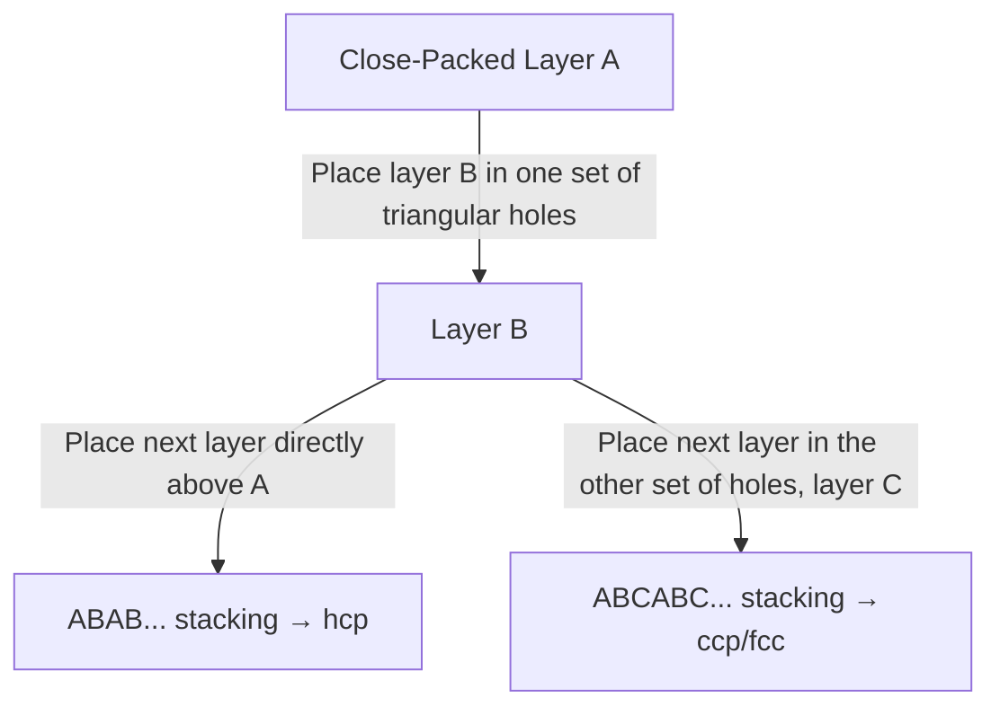

## Crystal Structures and Atomic Packing


### Overview

Crystal structures describe the periodic, long-range ordered arrangement of atoms, ions, or molecules in solids. Atomic packing efficiency, coordination number, and unit cell geometry together determine density, mechanical properties, electrical behavior, and phase stability, making crystal structure analysis foundational to solid-state and materials chemistry.

### The Unit Cell and Lattice Concepts

A **unit cell** is the smallest repeating unit that, through translation in three dimensions, generates the entire crystal lattice. Unit cells are classified by their lattice parameters ($a, b, c, \alpha, \beta, \gamma$) into seven crystal systems, which combine with centering types to give the 14 Bravais lattices.

**Seven Crystal Systems**

| System | Axial Lengths | Axial Angles |
| --- | --- | --- |
| Cubic | $a = b = c$ | $\alpha = \beta = \gamma = 90°$ |
| Tetragonal | $a = b \neq c$ | $\alpha = \beta = \gamma = 90°$ |
| Orthorhombic | $a \neq b \neq c$ | $\alpha = \beta = \gamma = 90°$ |
| Hexagonal | $a = b \neq c$ | $\alpha = \beta = 90°, \gamma = 120°$ |
| Trigonal (Rhombohedral) | $a = b = c$ | $\alpha = \beta = \gamma \neq 90°$ |
| Monoclinic | $a \neq b \neq c$ | $\alpha = \gamma = 90°, \beta \neq 90°$ |
| Triclinic | $a \neq b \neq c$ | $\alpha \neq \beta \neq \gamma \neq 90°$ |

**Bravais Lattice Centering Types**

- **P (Primitive)**: lattice points only at corners
- **I (Body-centered)**: additional point at cell center
- **F (Face-centered)**: additional points at all face centers
- **C (Base-centered/end-centered)**: additional points at two opposite face centers

### Close-Packed Structures

For structures composed of identical spheres, two arrangements achieve the maximum possible packing efficiency (74.05%): **hexagonal close packing (hcp)** and **cubic close packing (ccp)**, differing only in the stacking sequence of close-packed layers.

**Stacking Sequences**

- **hcp**: ABABAB... stacking, hexagonal unit cell, space group $P6_3/mmc$
- **ccp (= fcc)**: ABCABC... stacking, face-centered cubic unit cell, space group $Fm\bar{3}m$



**Close-Packing Stacking Comparison (svg_diagram)**

```svg
<svg xmlns="http://www.w3.org/2000/svg" viewBox="0 0 560 300" font-family="Helvetica,Arial,sans-serif">
  <title>hcp versus ccp stacking sequence comparison (svg_diagram)</title>
  <text x="140" y="25" font-size="13" text-anchor="middle">hcp: ABAB stacking</text>
  <g>
    <circle cx="60" cy="220" r="16" fill="#2277cc" /><circle cx="92" cy="220" r="16" fill="#2277cc" /><circle cx="124" cy="220" r="16" fill="#2277cc" /><circle cx="156" cy="220" r="16" fill="#2277cc" />
    <text x="20" y="225" font-size="10">A</text>
    <circle cx="76" cy="190" r="16" fill="#cc6600" /><circle cx="108" cy="190" r="16" fill="#cc6600" /><circle cx="140" cy="190" r="16" fill="#cc6600" />
    <text x="20" y="195" font-size="10">B</text>
    <circle cx="60" cy="160" r="16" fill="#2277cc" /><circle cx="92" cy="160" r="16" fill="#2277cc" /><circle cx="124" cy="160" r="16" fill="#2277cc" /><circle cx="156" cy="160" r="16" fill="#2277cc" />
    <text x="20" y="165" font-size="10">A</text>
  </g>
  <text x="200" y="270" font-size="10">Layer 3 repeats layer 1 position</text>

  <text x="420" y="25" font-size="13" text-anchor="middle">ccp: ABCABC stacking</text>
  <g>
    <circle cx="340" cy="220" r="16" fill="#2277cc" /><circle cx="372" cy="220" r="16" fill="#2277cc" /><circle cx="404" cy="220" r="16" fill="#2277cc" /><circle cx="436" cy="220" r="16" fill="#2277cc" />
    <text x="300" y="225" font-size="10">A</text>
    <circle cx="356" cy="190" r="16" fill="#cc6600" /><circle cx="388" cy="190" r="16" fill="#cc6600" /><circle cx="420" cy="190" r="16" fill="#cc6600" />
    <text x="300" y="195" font-size="10">B</text>
    <circle cx="340" cy="160" r="16" fill="#33aa33" /><circle cx="372" cy="160" r="16" fill="#33aa33" /><circle cx="404" cy="160" r="16" fill="#33aa33" /><circle cx="436" cy="160" r="16" fill="#33aa33" />
    <text x="300" y="165" font-size="10">C</text>
  </g>
  <text x="480" y="270" font-size="10">Layer 3 is a new position</text>
</svg>
```

### Coordination Number and Packing Efficiency

| Structure Type | Coordination Number | Packing Efficiency | Example Elements |
| --- | --- | --- | --- |
| Simple cubic (SC) | 6 | 52.4% | Po (rare) |
| Body-centered cubic (BCC) | 8 | 68.0% | Fe (α), Cr, W, alkali metals |
| Face-centered cubic (FCC/ccp) | 12 | 74.05% | Cu, Ag, Au, Al, Ni, Pb |
| Hexagonal close-packed (hcp) | 12 | 74.05% | Mg, Zn, Ti, Co |
| Diamond cubic | 4 | 34.0% | C (diamond), Si, Ge |

**Packing Efficiency Calculation (FCC Example)**

For FCC, atoms touch along the face diagonal: $4r = a\sqrt{2}$, giving $a = 2\sqrt{2}r$. With 4 atoms per unit cell:

$$\text{Packing efficiency} = \frac{4 \times \frac{4}{3}\pi r^3}{a^3} = \frac{4 \times \frac{4}{3}\pi r^3}{(2\sqrt{2}r)^3} = \frac{\pi}{3\sqrt{2}} \approx 0.7405 \text{ (74.05\%)}$$

### Atoms Per Unit Cell (Counting Convention)

**Key Points**

- Corner atom: shared among 8 unit cells → contributes $\frac{1}{8}$
- Edge atom: shared among 4 unit cells → contributes $\frac{1}{4}$
- Face atom: shared between 2 unit cells → contributes $\frac{1}{2}$
- Body-center atom: entirely within 1 unit cell → contributes $1$

**Worked Example: FCC Unit Cell**

$$8 \text{ corners} \times \frac{1}{8} + 6 \text{ faces} \times \frac{1}{2} = 1 + 3 = 4 \text{ atoms per unit cell}$$

**Worked Example: BCC Unit Cell**

$$8 \text{ corners} \times \frac{1}{8} + 1 \text{ body center} \times 1 = 1 + 1 = 2 \text{ atoms per unit cell}$$

### Interstitial Sites in Close-Packed Structures

Close-packed arrangements generate two types of interstitial voids between spheres, critical for understanding ionic compound structures where smaller cations occupy these sites within a close-packed anion lattice.

| Void Type | Coordination Number | Number per Close-Packed Atom | Radius Ratio ($r_+/r_-$) |
| --- | --- | --- | --- |
| Tetrahedral | 4 | 2 | 0.225–0.414 |
| Octahedral | 6 | 1 | 0.414–0.732 |

**Radius Ratio Rule**

The ratio of cation to anion radius determines which interstitial site (and resulting coordination geometry) is favored, based on geometric stability of the cation within the surrounding anion polyhedron:

| Radius Ratio ($r_+/r_-$) | Coordination Number | Geometry |
| --- | --- | --- |
| 0.155–0.225 | 3 | Triangular |
| 0.225–0.414 | 4 | Tetrahedral |
| 0.414–0.732 | 6 | Octahedral |
| 0.732–1.000 | 8 | Cubic |

[Inference: the radius ratio rule provides useful first-approximation guidance but has well-documented exceptions due to covalency, polarization effects, and other factors not captured by purely ionic radius arguments; it should be treated as a heuristic rather than a strict predictive law.]

### Common Ionic Crystal Structure Types

**Rock Salt (NaCl) Structure**

- Anions (Cl⁻) form an FCC (ccp) lattice; cations (Na⁺) occupy all octahedral holes
- Coordination: 6:6 (both cation and anion octahedrally coordinated)
- Examples: NaCl, MgO, CaO, KCl, most alkali halides and alkaline earth oxides

**Zinc Blende (Sphalerite, ZnS) Structure**

- Anions (S²⁻) form an FCC (ccp) lattice; cations (Zn²⁺) occupy half the tetrahedral holes (alternating pattern)
- Coordination: 4:4 (both tetrahedrally coordinated)
- Examples: ZnS, CuCl, many III-V semiconductors (GaAs, InP)

**Wurtzite (ZnS) Structure**

- Anions form an hcp lattice; cations occupy half the tetrahedral holes
- Coordination: 4:4
- Examples: ZnS (hexagonal polymorph), ZnO, AlN, GaN

**Fluorite (CaF₂) Structure**

- Cations (Ca²⁺) form an FCC lattice; anions (F⁻) occupy all tetrahedral holes
- Coordination: 8:4 (cation:anion)
- Examples: $\text{CaF}_2$, $\text{UO}_2$, $\text{ZrO}_2$ (antifluorite structure, e.g., $\text{Li}_2\text{O}$, reverses cation/anion roles)

**Cesium Chloride (CsCl) Structure**

- Simple cubic anion lattice with cation at body center (not a close-packed structure; not derived from FCC/hcp anion packing)
- Coordination: 8:8
- Examples: CsCl, CsBr, CsI, NH₄Cl (high-temperature form)

**Rutile (TiO₂) Structure**

- Distorted structure with Ti⁴⁺ in a distorted octahedral environment; O²⁻ in distorted trigonal planar coordination
- Coordination: 6:3
- Examples: $\text{TiO}_2$, $\text{SnO}_2$, $\text{MnO}_2$

**Perovskite (CaTiO₃, ABO₃) Structure**

- Large A-cation at cube corners, small B-cation at body center, O²⁻ at face centers, forming corner-sharing $\text{BO}_6$ octahedra
- Coordination: A-site 12, B-site 6
- Examples: $\text{CaTiO}_3$, $\text{BaTiO}_3$ (ferroelectric), $\text{SrTiO}_3$, many high-temperature superconductors and solar cell materials adopt distorted perovskite variants

**Structure Type Summary Table**

| Structure | Anion Packing | Cation Site Occupancy | Coordination (Cation:Anion) |
| --- | --- | --- | --- |
| Rock salt | FCC (ccp) | All octahedral holes | 6:6 |
| Zinc blende | FCC (ccp) | 1/2 tetrahedral holes | 4:4 |
| Wurtzite | hcp | 1/2 tetrahedral holes | 4:4 |
| Fluorite | FCC (cation lattice) | Anions fill all tetrahedral holes | 8:4 |
| Cesium chloride | Simple cubic | Body center | 8:8 |
| Rutile | Distorted hcp | 1/2 octahedral holes | 6:3 |

### Density Calculation from Unit Cell Data

$$\rho = \frac{Z \times M}{N_A \times V_{cell}}$$

where $Z$ = number of formula units per unit cell, $M$ = molar mass, $N_A$ = Avogadro's number, $V_{cell}$ = unit cell volume.

**Example**

For NaCl (rock salt structure, FCC with $Z = 4$ formula units per unit cell, $a = 564.02$ pm):

$$V_{cell} = a^3 = (564.02 \times 10^{-10}\ \text{cm})^3 \approx 1.794 \times 10^{-22}\ \text{cm}^3$$


$$\rho = \frac{4 \times 58.44\ \text{g/mol}}{6.022 \times 10^{23}\ \text{mol}^{-1} \times 1.794 \times 10^{-22}\ \text{cm}^3} \approx 2.165\ \text{g/cm}^3$$

This closely matches the experimentally measured density of NaCl. [Inference: exact lattice parameter values are temperature-dependent and measurement-specific; the value used here is a standard reference figure.]

### Polymorphism and Phase Transitions

Many elements and compounds adopt different crystal structures depending on temperature and pressure (polymorphism/allotropy).

**Example**: Iron exhibits temperature-dependent polymorphism — α-Fe (BCC, ferromagnetic, stable below 912°C), γ-Fe (FCC, stable 912–1394°C, the basis of austenitic steel), δ-Fe (BCC, stable 1394–1538°C melting point). [Inference: exact transition temperatures are pressure-dependent and can vary slightly across reference sources.]

### Determining Crystal Structures: X-ray Diffraction

Crystal structures are experimentally determined primarily via X-ray diffraction, governed by Bragg's Law:

$$n\lambda = 2d\sin\theta$$

where $n$ is the diffraction order, $\lambda$ is X-ray wavelength, $d$ is interplanar spacing, and $\theta$ is the angle of incidence/reflection. Systematic absences in diffraction patterns (specific $hkl$ reflections missing) directly reveal lattice centering type (P, I, F, C) and space group symmetry.

### Miller Indices

Crystal planes are denoted by Miller indices $(hkl)$, defined as the reciprocals of the fractional intercepts a plane makes with the unit cell axes, cleared of fractions. For cubic systems, interplanar spacing relates to Miller indices by:

$$d_{hkl} = \frac{a}{\sqrt{h^2+k^2+l^2}}$$

**Conclusion**

Crystal structures arise from the geometric optimization of atomic/ionic packing, governed by sphere-packing efficiency, coordination requirements, and (for ionic compounds) radius ratio considerations. The close-packed hcp and ccp arrangements, along with BCC and simple cubic lattices, form the structural basis for elemental metals, while their interstitial sites host cations in a wide range of technologically important ionic structure types (rock salt, zinc blende, fluorite, perovskite, and others). Unit cell geometry directly determines measurable bulk properties including density, and is experimentally elucidated through X-ray diffraction via Bragg's Law.

**Related Topics**

- X-ray diffraction and Bragg's Law in structure determination
- Defects in crystalline solids (point, line, planar defects)
- Band theory and electronic structure of solids
- Ionic radius trends and radius ratio rule limitations
- Perovskite materials in photovoltaics and superconductivity
- Phase diagrams and polymorphic transitions
- Miller indices and crystallographic planes/directions